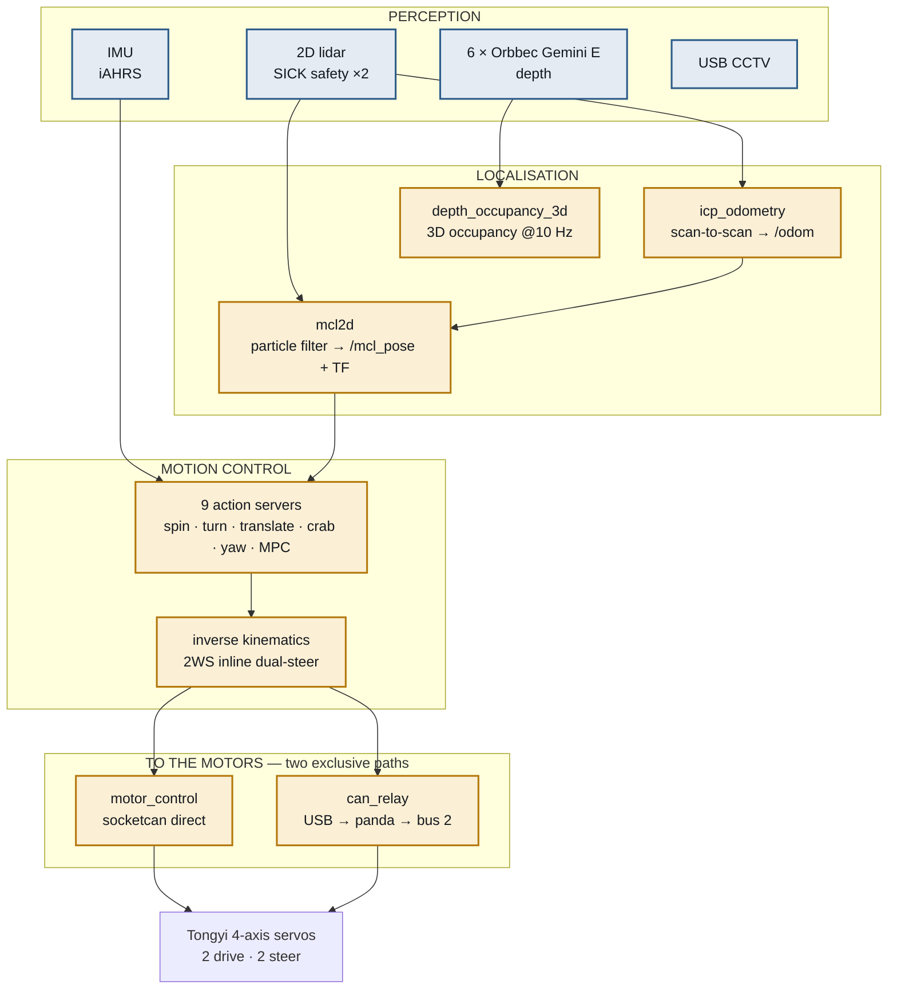

# Big-AMR — Robot Stack Architecture

**The autonomy stack as built on the machine.**

This is the companion to [`ARCHITECTURE.md`](ARCHITECTURE.md), which describes the
plant-level design — Mini MES, ACS, and the flow of orders. This document
describes what actually runs **on the robot**: perception, localisation, motion
control, and the two different ways commands reach the motors.

> Foil_A082 · surveyed from the code 2026-08-03 · 29 ROS 2 packages

---

## Contents

1. [The stack at a glance](#1-the-stack-at-a-glance)
2. [Perception](#2-perception)
3. [Localisation](#3-localisation)
4. [Motion control](#4-motion-control)
5. [The two paths to the motors](#5-the-two-paths-to-the-motors)
6. [AI](#6-ai)
7. [Non-ROS tooling](#7-non-ros-tooling)
8. [Package map](#8-package-map)
9. [Open points](#9-open-points)

---

## 1. The stack at a glance



---

## 2. Perception

### 2D lidar — `src/Sensors/Lidar/2D/`

| Package | Role |
|---|---|
| `sick_safetyscanners2` | Two SICK safety scanners. Publish `/scan`, extended scan, field data. **Safety output is independent of everything above** |
| `dual_laser_merger` | Fuses front and rear into `/scan_merged` — one 360° scan |
| `lidar_calibration_2d` | Finds the transform between the two scanners. ICP-based, with a PyQt5 UI |
| `seer_lidar_tf` | Pulls the mounting TF from Seer over TCP API 1009 rather than hard-coding it |

The merged scan is what both localisation nodes consume.

### Depth — `src/Sensors/Camera/RGBD/`

**Six Orbbec Gemini E cameras** around the body.

| Package | Role |
|---|---|
| `orbbec_multi_bringup` | Brings up all six with mount extrinsics |
| `depth_occupancy_3d` | C++17 fusion → **3D occupancy map at 10 Hz**, with ground layer separated |

Primary purpose is **3D collision avoidance** — the 2D scanners see one plane, so anything overhanging or low is invisible to them. Optional RGB colouring of occupied voxels, off by default.

### CCTV — `src/Sensors/Camera/USB/`

USB cameras with a `vision_guard` viewer UI. Endurance-tested: five cameras, twelve hours.

---

## 3. Localisation

This is the part that most changes the picture from `ARCHITECTURE.md`.

### `mcl2d` — Seer's localiser, re-implemented

`src/Navigation/mcl2d_core` is a **reverse-engineered re-implementation of Seer's `libMCLoc.so`** (rbk 3.4.5.20) — 2D Monte Carlo localisation, particle filter mode.

```
mcl2d_core/     pure C++17, zero dependencies
                MotionModel2D · ObservationField · ParticleFilter2D · SkidDetector
mcl2d_map/      Seer .smap map loader
mcl2d_ros2/     ROS 2 adapter:  /scan + /odom  →  /mcl_pose + TF
```

Governed by the project's reverse-engineering rule: **re-implementation output must be 100% identical to the original — "similar" is failure.** The claimed verification is bit-identical agreement with the original binary on **245/245** samples, and **125/125** on dual lidar with Δ=0.

The motion model was rewritten on 2026-07-31 after disassembling the original binary directly, then taken through three rounds of code review.

### `icp_odometry_bringup` — odometry without wheels

Runs `rtabmap_odom/icp_odometry` over `/scan_merged` to produce `/odom`, standing in for wheel odometry.

**Worth understanding why this exists.** Wheel odometry integrates wheel rotation, so it reports travel that never happened when wheels slip or the robot is obstructed. Scan-to-scan odometry measures how the *world* moved instead, which does not lie in the same way. It is also available when the wheel encoders are not — the relevant case here, since the motion stack does not own the drive.

### The consequence

```
scan → icp_odometry → /odom ─┐
                              ├─► mcl2d ─► /mcl_pose + TF
scan ─────────────────────────┘
```

The robot can now locate itself **without Seer**. `ARCHITECTURE.md` says Seer owns localisation; with this, that is no longer necessarily true.

---

## 4. Motion control

Two parallel stacks, same code, different geometry.

| | `QD/` | `2WS/` |
|---|---|---|
| Platform | Quad-Drive diagonal (Carrier AGV) | inline dual-steer (Foil_A082) |
| Wheels | `(±0.330, ±0.135)`, r=0.080 | `(+0.6039, −0.0014)`, `(−0.5961, −0.0014)`, r=0.125 |
| Packages | 6 | 6 |

Each stack is six packages: `msgs`, `interfaces`, `core`, `kinematics`, `motion`, `action_server`.

**Nine action servers** per stack:

```
spin · turn · translate_forward · translate_reverse · crab_linear
yaw_control · yaw_control_reverse · mpc · mpc_reverse
```

All publish `WheelSetArray` on `/motion/wheel_cmd/<action>` — per wheel, a speed and a steering angle.

The inverse kinematics normalises every steering angle into **±90°**, which makes the solution unique: a wheel's velocity vector always has two equivalent forms `(θ, +v)` and `(θ∓180°, −v)`, and folding into a half-circle picks exactly one, always the smallest steering angle.

MPC uses NLopt (SLSQP).

---

## 5. The two paths to the motors

**The most important thing in this document.** There are two ways to drive the Tongyi servos, and they are **mutually exclusive** — they differ in wiring, in whether Seer may be attached, and in what stops the robot.

| | `src/Actuators/motor_control` | `src/Comm/CAN/can_relay` |
|---|---|---|
| Physical path | socketcan `can1`, **direct** | USB → panda → bus 2 |
| Seer | **must be disconnected** | **must be connected** |
| How it takes control | it is the only master | intercepts and overrides Seer |
| Stop mechanism | guard RTR at 20 Hz stops → **500 ms HALT** | heartbeat lost → firmware zeroes drive and opens the relay |
| Can send RTR frames | yes, and it must | **no** — the panda packet header has no RTR bit |

That last row is not a detail. The direct path's safety rests on a periodic RTR guard frame; the relay path **cannot send RTR at all**, so it needs an entirely different stop mechanism, implemented in the panda firmware.

Getting these two confused in a document or a comment is a known hazard — it is registered as `debt-025`, requiring every citation to say which one it means.

### The relay firmware

`Tools/Can_Relay/panda-firmware/board/safety/safety_seer_gate.h` — the gate itself. Blocks Seer's SDO writes, synthesises acknowledgements, covers the 150–220 ms relay switch from a cache, and freezes the readback so Seer's following error stays at zero.

A recent fix worth knowing about: on freewheel engage, the residual target velocity was left on the drive, so a silent re-enable could make the robot **lurch away at the previous speed**. Now `Target_velocity = 0` is written explicitly before servo-off.

---

## 6. AI

| Package | Role |
|---|---|
| `AI/yolo_detector` | YOLOv8 object detection on the CCTV feeds |
| `AI/dataset_collector` | Gathers training data |
| `AI/ai_msgs` | Shared message definitions |

Separation of concerns is deliberate: **the detector returns results only; display belongs to the GUI.**

---

## 7. Non-ROS tooling

Under `Tools/`, per the repository placement rule.

| Tool | Purpose |
|---|---|
| `Can_Relay/` | Panda firmware — the gate |
| `Kinematics/` | Chassis kinematics + headless drive stack. `CanTransport` ABC over socketcan / pcan / mock |
| `mcl2d_standalone/` | Non-ROS façade over the MCL core, plus a demo |
| `docking_field_kit/` | Field diagnostics: homing, gap measurement, Seer alarm monitoring |
| `panda_bench/` | Bench tests for the gate |
| `usb_cam_bench/` | Camera endurance testing |
| `amr_test_gui/` | Manual drive and test UI |
| `camera_service/`, `firmware/` | Support tooling |
| `live_view/` | System explainer animation |

---

## 8. Package map

29 ROS 2 packages.

```
src/
  AI/                    ai_msgs · dataset_collector · yolo_detector
  Comm/CAN/              can_relay                       ← via panda
  Control/Motion_Control/
    QD/                  6 packages (Carrier AGV geometry)
    2WS/                 6 packages (Foil_A082 geometry)
  MES/                   mini_mes                        ← plant layer
  Navigation/            mcl2d_ros2 · icp_odometry_bringup
                         (+ mcl2d_core, mcl2d_map — plain CMake, not packages)
  Sensors/
    Camera/RGBD/         orbbec_multi_bringup · depth_occupancy_3d
    Camera/USB/          CCTV + vision_guard UI
    IMU/                 iahrs_driver + interfaces
    Lidar/2D/            sick_safetyscanners2 · dual_laser_merger
                         lidar_calibration_2d · seer_lidar_tf
  Sim/                   trnav_2ws_description · trnav_2ws_gazebo
```

---

## 9. Open points

Facts from the code, not judgements.

**The motion stack still does not reach the motors in-repo.** The nine action servers publish `WheelSetArray`; nothing subscribes except the simulation bridge. The mux named by the SIL launch files (`trnav_motion_mux`, `trnav_motion_supervisor`) is absent.

**The 2WS action-server params carry Carrier AGV geometry.** All nine files hold `w1_y: +0.135` and `wheel_radius: 0.080` against measured values of `−0.0014` and `0.125`. Registered in [`docs/audit/`](docs/audit/).

**Front/rear node assignment is disputed.** `Tools/Kinematics/chassis_kinematics.py:38` records `EasyDRIVE canID config` contradicting `KIN_NODE_XY` on which node is the front wheel. Logged as HIGH severity in the debt registry.

**Localisation ownership is now ambiguous.** `ARCHITECTURE.md` assumes Seer localises the robot. `mcl2d` + `icp_odometry` provide an independent path. Which one the system actually uses — and whether both run — is not stated anywhere.

---

## Related

| Document | Contents |
|---|---|
| [`ARCHITECTURE.md`](ARCHITECTURE.md) | Plant level: Mini MES, ACS, the order flow |
| [`WORKFLOW.md`](WORKFLOW.md) | One order followed end to end |
| [`docs/audit/`](docs/audit/) | Known gaps between design and code |
| [`docs/adr/`](docs/adr/) | Decision records, including the reverse-engineering ones |
| [`docs/can_relay/test-process.md`](docs/can_relay/test-process.md) | **Mandatory** before any real-robot drive test |
