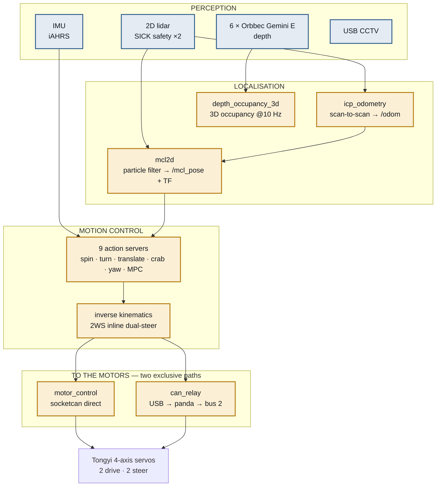

# Big-AMR — Robot Stack Architecture

**The autonomy stack as built on the machine.**

This is the companion to [`ARCHITECTURE.md`](ARCHITECTURE.md), which describes the
plant-level design — CSM, ACS, and the flow of orders. This document
describes what actually runs **on the robot**: perception, localisation, motion
control, and the two different ways commands reach the motors.

> Foil_A082 · surveyed from the code 2026-08-03 · 29 ROS 2 packages

---

## Contents

1. [The stack at a glance](#1-the-stack-at-a-glance)
2. [Perception](#2-perception)
3. [Localisation](#3-localisation)
4. [Motion control](#4-motion-control)
5. [The two paths to the motors](#5-the-two-paths-to-the-motors)
6. [AI](#6-ai)
7. [Non-ROS tooling](#7-non-ros-tooling)
8. [Package map](#8-package-map)
9. [Open points](#9-open-points)
10. [Component reference — what each box does](#10-component-reference--what-each-box-does)

---

## 1. The stack at a glance



> **New to this?** [§10](#10-component-reference--what-each-box-does) explains every box
> above one at a time — what it physically is, what it actually does, and why it is there.

---

## 2. Perception

### 2D lidar — `src/Sensors/Lidar/2D/`

| Package | Role |
|---|---|
| `sick_safetyscanners2` | Two SICK safety scanners. Publish `/scan`, extended scan, field data. **Safety output is independent of everything above** |
| `dual_laser_merger` | Fuses front and rear into `/scan_merged` — one 360° scan |
| `lidar_calibration_2d` | Finds the transform between the two scanners. ICP-based, with a PyQt5 UI |
| `seer_lidar_tf` | Pulls the mounting TF from Seer over TCP API 1009 rather than hard-coding it |

The merged scan is what both localisation nodes consume.

### Depth — `src/Sensors/Camera/RGBD/`

**Six Orbbec Gemini E cameras** around the body.

| Package | Role |
|---|---|
| `orbbec_multi_bringup` | Brings up all six with mount extrinsics |
| `depth_occupancy_3d` | C++17 fusion → **3D occupancy map at 10 Hz**, with ground layer separated |

Primary purpose is **3D collision avoidance** — the 2D scanners see one plane, so anything overhanging or low is invisible to them. Optional RGB colouring of occupied voxels, off by default.

### CCTV — `src/Sensors/Camera/USB/`

USB cameras with a `vision_guard` viewer UI. Endurance-tested: five cameras, twelve hours.

---

## 3. Localisation

This is the part that most changes the picture from `ARCHITECTURE.md`.

### `mcl2d` — Seer's localiser, re-implemented

`src/Navigation/mcl2d_core` is a **reverse-engineered re-implementation of Seer's `libMCLoc.so`** (rbk 3.4.5.20) — 2D Monte Carlo localisation, particle filter mode.

```
mcl2d_core/     pure C++17, zero dependencies
                MotionModel2D · ObservationField · ParticleFilter2D · SkidDetector
mcl2d_map/      Seer .smap map loader
mcl2d_ros2/     ROS 2 adapter:  /scan + /odom  →  /mcl_pose + TF
```

Governed by the project's reverse-engineering rule: **re-implementation output must be 100% identical to the original — "similar" is failure.** The claimed verification is bit-identical agreement with the original binary on **245/245** samples, and **125/125** on dual lidar with Δ=0.

The motion model was rewritten on 2026-07-31 after disassembling the original binary directly, then taken through three rounds of code review.

### `icp_odometry_bringup` — odometry without wheels

Runs `rtabmap_odom/icp_odometry` over `/scan_merged` to produce `/odom`, standing in for wheel odometry.

**Worth understanding why this exists.** Wheel odometry integrates wheel rotation, so it reports travel that never happened when wheels slip or the robot is obstructed. Scan-to-scan odometry measures how the *world* moved instead, which does not lie in the same way. It is also available when the wheel encoders are not — the relevant case here, since the motion stack does not own the drive.

### The consequence

```
scan → icp_odometry → /odom ─┐
                              ├─► mcl2d ─► /mcl_pose + TF
scan ─────────────────────────┘
```

The robot can now locate itself **without Seer**. `ARCHITECTURE.md` says Seer owns localisation; with this, that is no longer necessarily true.

---

## 4. Motion control

Two parallel stacks, same code, different geometry.

| | `QD/` | `2WS/` |
|---|---|---|
| Platform | Quad-Drive diagonal (Carrier AGV) | inline dual-steer (Foil_A082) |
| Wheels | `(±0.330, ±0.135)`, r=0.080 | `(+0.6039, −0.0014)`, `(−0.5961, −0.0014)`, r=0.125 |
| Packages | 6 | 6 |

Each stack is six packages: `msgs`, `interfaces`, `core`, `kinematics`, `motion`, `action_server`.

**Nine action servers** per stack:

```
spin · turn · translate_forward · translate_reverse · crab_linear
yaw_control · yaw_control_reverse · mpc · mpc_reverse
```

All publish `WheelSetArray` on `/motion/wheel_cmd/<action>` — per wheel, a speed and a steering angle.

The inverse kinematics normalises every steering angle into **±90°**, which makes the solution unique: a wheel's velocity vector always has two equivalent forms `(θ, +v)` and `(θ∓180°, −v)`, and folding into a half-circle picks exactly one, always the smallest steering angle.

MPC uses NLopt (SLSQP).

---

## 5. The two paths to the motors

**The most important thing in this document.** There are two ways to drive the Tongyi servos, and they are **mutually exclusive** — they differ in wiring, in whether Seer may be attached, and in what stops the robot.

| | `src/Actuators/motor_control` | `src/Comm/CAN/can_relay` |
|---|---|---|
| Physical path | socketcan `can1`, **direct** | USB → panda → bus 2 |
| Seer | **must be disconnected** | **must be connected** |
| How it takes control | it is the only master | intercepts and overrides Seer |
| Stop mechanism | guard RTR at 20 Hz stops → **500 ms HALT** | heartbeat lost → firmware zeroes drive and opens the relay |
| Can send RTR frames | yes, and it must | **no** — the panda packet header has no RTR bit |

That last row is not a detail. The direct path's safety rests on a periodic RTR guard frame; the relay path **cannot send RTR at all**, so it needs an entirely different stop mechanism, implemented in the panda firmware.

Getting these two confused in a document or a comment is a known hazard — it is registered as `debt-025`, requiring every citation to say which one it means.

### The relay firmware

`Tools/Can_Relay/panda-firmware/board/safety/safety_seer_gate.h` — the gate itself. Blocks Seer's SDO writes, synthesises acknowledgements, covers the 150–220 ms relay switch from a cache, and freezes the readback so Seer's following error stays at zero.

A recent fix worth knowing about: on freewheel engage, the residual target velocity was left on the drive, so a silent re-enable could make the robot **lurch away at the previous speed**. Now `Target_velocity = 0` is written explicitly before servo-off.

---

## 6. AI

| Package | Role |
|---|---|
| `AI/yolo_detector` | YOLOv8 object detection on the CCTV feeds |
| `AI/dataset_collector` | Gathers training data |
| `AI/ai_msgs` | Shared message definitions |

Separation of concerns is deliberate: **the detector returns results only; display belongs to the GUI.**

---

## 7. Non-ROS tooling

Under `Tools/`, per the repository placement rule.

| Tool | Purpose |
|---|---|
| `Can_Relay/` | Panda firmware — the gate |
| `Kinematics/` | Chassis kinematics + headless drive stack. `CanTransport` ABC over socketcan / pcan / mock |
| `mcl2d_standalone/` | Non-ROS façade over the MCL core, plus a demo |
| `docking_field_kit/` | Field diagnostics: homing, gap measurement, Seer alarm monitoring |
| `panda_bench/` | Bench tests for the gate |
| `usb_cam_bench/` | Camera endurance testing |
| `amr_test_gui/` | Manual drive and test UI |
| `camera_service/`, `firmware/` | Support tooling |
| `live_view/` | System explainer animation |

---

## 8. Package map

29 ROS 2 packages.

```
src/
  AI/                    ai_msgs · dataset_collector · yolo_detector
  Comm/CAN/              can_relay                       ← via panda
  Control/Motion_Control/
    QD/                  6 packages (Carrier AGV geometry)
    2WS/                 6 packages (Foil_A082 geometry)
  MES/                   csm                        ← plant layer
  Navigation/            mcl2d_ros2 · icp_odometry_bringup
                         (+ mcl2d_core, mcl2d_map — plain CMake, not packages)
  Sensors/
    Camera/RGBD/         orbbec_multi_bringup · depth_occupancy_3d
    Camera/USB/          CCTV + vision_guard UI
    IMU/                 iahrs_driver + interfaces
    Lidar/2D/            sick_safetyscanners2 · dual_laser_merger
                         lidar_calibration_2d · seer_lidar_tf
  Sim/                   trnav_2ws_description · trnav_2ws_gazebo
```

---

## 9. Open points

Facts from the code, not judgements.

**The motion stack still does not reach the motors in-repo.** The nine action servers publish `WheelSetArray`; nothing subscribes except the simulation bridge. The mux named by the SIL launch files (`trnav_motion_mux`, `trnav_motion_supervisor`) is absent.

**The 2WS action-server params carry Carrier AGV geometry.** All nine files hold `w1_y: +0.135` and `wheel_radius: 0.080` against measured values of `−0.0014` and `0.125`. Registered in [`docs/audit/`](docs/audit/).

**Front/rear node assignment is disputed.** `Tools/Kinematics/chassis_kinematics.py:38` records `EasyDRIVE canID config` contradicting `KIN_NODE_XY` on which node is the front wheel. Logged as HIGH severity in the debt registry.

**Localisation ownership is now ambiguous.** `ARCHITECTURE.md` assumes Seer localises the robot. `mcl2d` + `icp_odometry` provide an independent path. Which one the system actually uses — and whether both run — is not stated anywhere.

---

## 10. Component reference — what each box does

Every box in the §1 diagram, one at a time. Numbers here are read from the code, not
recalled — the file is named where it matters.

---

### PERCEPTION — the robot's senses

Perception answers **"what is around me right now?"** Nothing here knows where the robot
is or where it is going. It only reports what the sensors see.

---

#### 🔵 2D lidar — 2 × SICK safety scanner

**What it is.** A laser on a spinning mirror. It fires a pulse, times how long the
reflection takes, and turns that into a distance. Spin it and you get a ring of distances
— a horizontal slice of the world, typically hundreds of measurements per revolution,
tens of times a second.

**What it does here.** One at the front, one at the rear. Each covers most of a circle
but is blind behind itself, so `dual_laser_merger` fuses them into `/scan_merged` — one
360° scan with no blind spot. `lidar_calibration_2d` works out the exact transform
between the two units (they are bolted on by hand, so it is never exactly what the
drawing says), and `seer_lidar_tf` reads the mounting position from Seer's own API 1009
rather than hard-coding a number that could drift out of date.

**Why it matters most.** These are **safety** scanners, not ordinary ones. They have a
hardware safety output that stops the robot on their own, wired independently of every
piece of software in this document. Nothing above can override it. If the whole ROS 2
stack crashed, the scanners would still stop the robot before it hit a person.

Everything else in localisation is built on this one sensor.

---

#### 🔵 IMU — iAHRS

**What it is.** Inertial Measurement Unit. Accelerometers feel acceleration; gyroscopes
feel rotation rate. No contact with the outside world at all — it senses only its own
motion.

**What it does here.** Reports how fast the robot is turning and which way it is tilted,
on `/imu/data`.

**Its one weakness, and why that shapes the design.** An IMU measures *rate*, so getting
an angle out means integrating, and integration accumulates error. It is excellent over
one second and worthless over ten minutes — the reported heading slowly drifts away from
the truth with nothing to pull it back. That is exactly the opposite of the lidar, which
is noisy tick to tick but never drifts because it keeps re-measuring real walls. Fusing
the two gives you both properties, and it is why neither sensor alone is enough.

---

#### 🔵 6 × Orbbec Gemini E — depth cameras

**What it is.** A camera where every pixel is a *distance* instead of a colour. Point it
at a chair and you get the shape of the chair in 3D.

**What it does here.** Six of them ring the body — `cam_f`, `cam_lf`, `cam_lr`, `cam_r`,
`cam_rr`, `cam_rf` (front, left-front, left-rear, right, right-rear, right-front).
Useful range is **0.2 m to 2.5 m**, so this is close-quarters vision, not long-range.

**Why six cameras when there are already two lidars.** Because a 2D lidar sees exactly
**one horizontal plane** — a single height, usually somewhere around knee level. It is
completely blind to:

- a forklift tine sticking out at chest height
- a pallet overhanging its own base
- a low step, a kerb, or a hole in the floor
- a table top the robot would drive underneath and then wedge itself against

None of those exist as far as the scanners are concerned. The robot would drive straight
into them. The depth ring is what makes the machine aware of a world with a *height* to
it.

---

#### 🔵 USB CCTV

**What it is.** Ordinary colour cameras.

**What it does here.** Feeds the YOLO detector (§6) and a `vision_guard` viewer for
humans. This is for recognising *what* something is — a person, a pallet, a specific
part — which depth and lidar cannot do. They measure shape; only colour vision reads
identity.

---

### LOCALISATION — where am I, and what is in the way

Two different questions get confused constantly, so it is worth separating them:

| Question | Answered by | Fails how |
|---|---|---|
| "How far have I moved since a moment ago?" | **odometry** | drifts — small errors accumulate for ever |
| "Where am I on the map?" | **localisation** | can be lost or wrong, but does not drift |

Odometry is fast and smooth and slowly wrong. Localisation is slower and occasionally
jumpy but stays anchored to reality. You need both, and one feeds the other.

---

#### 🟠 icp_odometry — "how far have I moved?"

**What it is.** ICP means *Iterative Closest Point*. Take the laser scan from a moment
ago and the scan from now. They look almost the same, just shifted. ICP finds the exact
rotation and translation that makes the old scan line up on top of the new one — and
**that shift is how the robot moved.** Repeat forever and you have odometry.

Configured with `Reg/Force3DoF`, which pins the answer to `x`, `y` and `yaw` and forces
`z`, roll and pitch to zero. The robot drives on a flat factory floor; allowing the
solver to imagine the robot floating upward would only let noise leak into a dimension
that physically cannot change.

**Why it exists at all.** Normally you get odometry free from the wheel encoders — count
wheel rotations, multiply by circumference. Two problems here:

1. **The motion stack does not own the drive.** The wheels are on the other side of the
   Panda gate. Encoder counts are not simply available.
2. **Wheel odometry lies when it matters most.** A wheel that spins on a wet patch
   reports metres of travel while the robot sits still. Get stuck against a wall and the
   wheels keep counting happily. That is not a rare edge case — it is exactly the
   situation where you most need to know you have stopped.

Scan matching measures how **the world** moved past the robot, which is not fooled by a
slipping wheel. If the robot did not move, the walls did not move, and ICP reports zero.

`Odom/ResetCountdown` handles the failure case: if matching fails for N frames straight —
a featureless corridor, a sudden crowd — it resets rather than reporting confident
nonsense.

---

#### 🟠 mcl2d — "where am I on the map?"

**What it is.** MCL means *Monte Carlo Localisation*, and this is a **particle filter**.
The idea is easier than the name.

Imagine scattering ten thousand guesses across the map — "maybe the robot is here, or
here, or here". Each guess is a *particle*. Then, every cycle:

1. **Move every particle** by whatever the odometry just reported, plus a little random
   noise (because odometry is not perfect).
2. **Score every particle**: if the robot really were standing there, what would the
   laser see? Compare that to what the laser *actually* sees. Good match, high score.
3. **Resample**: throw away low scorers, duplicate high scorers.

Repeat, and the cloud collapses onto the true position and then tracks it. The robot
never computes its position directly — it maintains a *population of hypotheses* and lets
the bad ones die. That is why it recovers from being wrong: a scattered cloud is a robot
that knows it is unsure, and it re-converges once it sees something distinctive.

**The numbers**, from `mcl2d_core/include/mcl2d_core/types.hpp:96-98`: it starts with
**10,000** particles, then runs between **500 and 3,000**. Many at first because it has no
idea where it is; far fewer once converged, because tracking a known position is cheap
and 10,000 particles would be wasted CPU.

**In:** `/scan_merged` + `/odom` (from `icp_odometry`) + a Seer `.smap` map.
**Out:** `/mcl_pose` and the TF tree.

**The part that makes this remarkable.** This is a **reverse-engineered re-implementation
of Seer's own `libMCLoc.so`** (rbk 3.4.5.20), governed by the project's rule that
re-implementation output must be *100% identical* to the original — "similar" counts as
failure. Verification claimed: bit-identical on 245/245 samples, and 125/125 on dual
lidar with Δ=0.

The consequence is strategic, not technical: **the robot can now locate itself without
Seer.** `ARCHITECTURE.md` assumes Seer owns localisation. That is no longer necessarily
true, and which one the system actually uses is [an open point](#9-open-points).

---

#### 🟠 depth_occupancy_3d — the 3D picture

**What it is.** Takes the six depth cameras and fuses them into one 3D model of the space
immediately around the robot, at **10 Hz**.

**How it works** (`depth_occupancy_node.cpp`). Space around the robot is divided into
small cubes — **5 cm** each, over a volume of **6 m × 6 m × 2.2 m** centred on the robot.
Each cube is marked occupied or free based on what the cameras see. Points below
**0.05 m** are classified as ground and separated out; obstacles are tracked up to
**1.8 m**. `decimation: 4` means it uses every 4th pixel — a depth image has hundreds of
thousands of points and you do not need all of them to know a pallet is there.

**Three outputs, and the third is the clever one:**

| Topic | What it is |
|---|---|
| `~/occupancy_points` | the obstacles — the 3D picture |
| `~/ground_points` | the floor, separated so it is not mistaken for an obstacle |
| `~/virtual_scan` | **a fake 2D laser scan, 360 bins** |

That last one is the interesting design move. It squashes the 3D information down into
the *shape of a 2D laser scan* — so any existing code that expects a `LaserScan` can
consume the depth cameras without knowing they are cameras. The chest-height forklift
tine shows up as an obstacle in a message format written for a device that could never
have seen it.

---

### MOTION CONTROL — deciding how to move

---

#### 🟠 9 action servers

**What an "action" is.** ROS 2 has three ways to talk. A *topic* is a broadcast ("here is
the current scan"). A *service* is a question with an immediate answer ("what is 2+2?").
An **action** is a long-running job you can watch and cancel — "drive 3 metres forward",
which takes seconds, reports progress, and might fail. Motion is always an action.

**The nine**, each one motion primitive:

| Server | Movement |
|---|---|
| `spin` | rotate in place |
| `turn` | drive along a curve |
| `translate_forward` / `_reverse` | straight line, either way |
| `crab_linear` | **sideways, body never rotating** |
| `yaw_control` / `_reverse` | hold or reach a heading |
| `mpc` / `mpc_reverse` | Model Predictive Control — follow a path by repeatedly simulating the next few seconds and picking the best steering. Uses NLopt (SLSQP) |

`crab_linear` is the one that is unusual on a factory floor. Both wheels swivel to the
same angle and the robot slides sideways with the body still square — which is how it can
slot into a narrow bay it could never turn into.

All nine publish `WheelSetArray` on `/motion/wheel_cmd/<action>`: for each wheel, a speed
and a steering angle.

---

#### 🟠 Inverse kinematics — 2WS inline dual-steer

**Forward kinematics** asks: the wheels are doing this, so where does the body go?
**Inverse kinematics** asks the useful question: I want the body to do *this*, so what
must each wheel do? Every action server ends here.

**In:** how the body should move (`vx`, `vy`, `ω`). **Out:** per wheel, a steering angle
and a speed.

**The ±90° fold.** Every wheel's velocity has two equally valid descriptions: point at
angle θ and drive forward at `+v`, or point at `θ∓180°` and drive backward at `−v`. Same
motion, two answers. The code folds every angle into a half-circle, ±90°, which picks
exactly one — and always the one requiring the smallest steering movement. Without that,
a wheel could decide to swing 180° to achieve a motion it could have reached by turning
5°, and on a real machine that is a visible, slow, pointless lurch.

**Foil_A082's geometry**: both wheels on the centreline — `W1 (+0.6039, −0.0014)`,
`W2 (−0.5961, −0.0014)`, radius `0.125 m`, 1.2 m wheelbase, steering limited to ±90°.
Both on the centreline and both able to swivel is what makes crab motion possible at all.

---

### TO THE MOTORS — two paths that must never be confused

Fully covered in [§5](#5-the-two-paths-to-the-motors). In brief:

#### 🟠 motor_control — the direct path

Talks CANopen SDO straight onto `can1` via socketcan. **Seer must be physically
disconnected** — this code assumes it is the only master on the bus, and two masters
commanding one drive is a genuine hazard. Safety rests on a guard RTR frame at 20 Hz: if
those frames stop arriving, the drive halts within 500 ms. Silence means stop, so a
crashed PC or an unplugged cable stops the robot rather than leaving it running.

#### 🟠 can_relay — the intercepting path

Goes USB → Panda board → CAN bus 2, and **Seer must stay connected**, because the whole
point is to sit between Seer and the motors and override it while letting Seer believe
nothing happened.

**It cannot send RTR frames at all** — the panda packet header has no RTR bit. So the
20 Hz guard scheme is simply unavailable, and it needs a completely different stop
mechanism: the firmware watches a heartbeat, and on loss it zeroes the drive and opens
the relay. That single missing bit in a packet header is why the firmware gate is shaped
the way it is.

Confusing these two is a registered hazard — `debt-025` requires every citation to state
which one it means.

#### 🔵 Tongyi 4-axis servos

The actual motors: **2 drive** (make the wheels spin) and **2 steer** (make the wheels
point). Spoken to in CANopen SDO — `0x607A` target position, `0x60FF` target velocity,
`0x6064` actual position, `0x6041` statusword — and each runs the **CiA 402** drive state
machine, an industry-standard sequence a drive must be walked through before it will
accept motion at all.

Freezing the readback of `0x6041` is precisely how the gate convinces Seer the robot is
parked while it is in fact driving.

---

### 🔵 blue = existing / vendor · 🟠 amber = built by this project

---

## Related

| Document | Contents |
|---|---|
| [`ARCHITECTURE.md`](ARCHITECTURE.md) | Plant level: CSM, ACS, the order flow |
| [`WORKFLOW.md`](WORKFLOW.md) | One order followed end to end |
| [`docs/audit/`](docs/audit/) | Known gaps between design and code |
| [`docs/adr/`](docs/adr/) | Decision records, including the reverse-engineering ones |
| [`docs/can_relay/test-process.md`](docs/can_relay/test-process.md) | **Mandatory** before any real-robot drive test |
