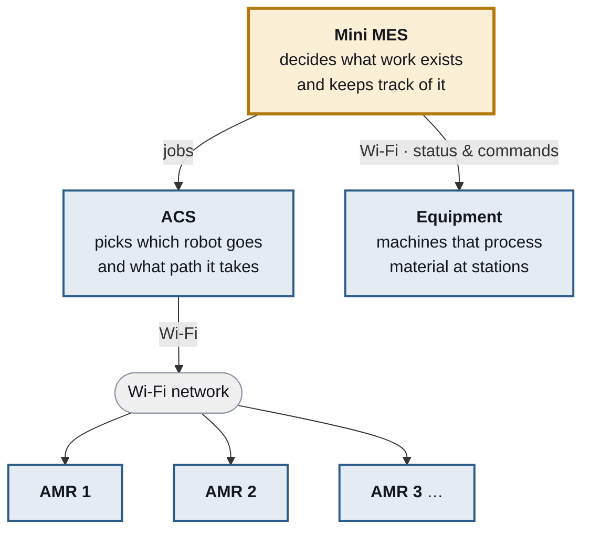
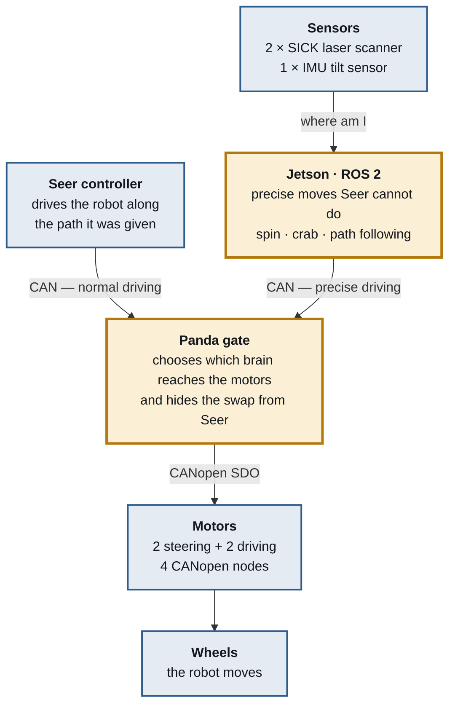
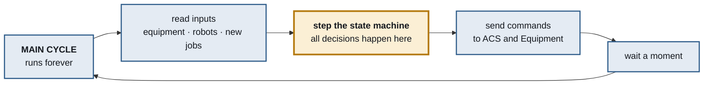
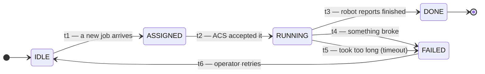
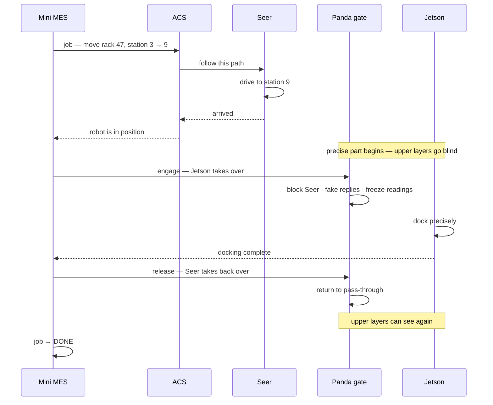

# Big-AMR — System Architecture

**Two brains, one robot, and a box that decides who drives.**

A complete map of the system, from the software that decides what work exists all the
way down to the wheels. Written so anyone can follow it, with the real names kept
alongside the plain ones.

> Foil_A082 retrofit · architecture v1 · 2026-07-28

---

## Table of contents

1. [Start here — the whole thing in five sentences](#1-start-here--the-whole-thing-in-five-sentences)
2. [The full architecture](#2-the-full-architecture)
3. [Every layer, one at a time](#3-every-layer-one-at-a-time)
4. [The trick that makes this project work](#4-the-trick-that-makes-this-project-work)
5. [Inside the Mini MES — main cycle and state machine](#5-inside-the-mini-mes--main-cycle-and-state-machine)
6. [One job, from beginning to end](#6-one-job-from-beginning-to-end)
7. [The arrows — what travels between the boxes](#7-the-arrows--what-travels-between-the-boxes)
8. [What is real today, and what is not](#8-what-is-real-today-and-what-is-not)
9. [Glossary](#9-glossary)
10. [Open questions](#10-open-questions)

---

## 1. Start here — the whole thing in five sentences

A factory has robot carts that move heavy things around. A system called **Seer**
already drives them, and we are not allowed to change it. But we want the carts to do
smarter, more precise things than Seer knows how to do. So we add our own brain — and
a small box in the middle that chooses which brain is holding the steering wheel.
Above everything, a new program called **Mini MES** decides what work needs doing in
the first place.

That is the entire project. Everything below is detail hanging off those five sentences.

---

## 2. The full architecture

### Colour key

| Colour | Meaning |
|---|---|
| 🔵 **Blue** | **Already exists** — the factory's own equipment. We must not modify it. |
| 🟠 **Amber** | **We build this** — the new parts we are adding. |

### 2.1 The plant level — one Mini MES, many robots



One Mini MES commands many robots through the ACS, and talks to the station machines
directly. That second link is what makes it a real MES: it coordinates both the
**machines** that process material and the **transport** that moves material between them.

### 2.2 Inside any one AMR — two brains, one gate



Two brains compete for the motors. The Panda gate decides between them — and that
decision is invisible to everything above it.

---

## 3. Every layer, one at a time

Each layer has **exactly one job**. If a layer needed the word "and" to describe it,
it would really be two layers. Each one only talks to its neighbours, never skipping
past one.

### Layer 1 — Mini MES 🟠

**One job: decides what work exists.**

Creates jobs like *"rack 47 must go from station 3 to station 9."* Tracks every job
from creation to completion. Talks to the station machines to know when they are
finished, and to the ACS to get things carried.

> **Like:** the manager of a restaurant. Doesn't cook, doesn't carry plates — decides
> which orders exist and checks they got done.

### Layer 2 — ACS 🔵

**One job: decides which robot, and which path.**

Receives a job and answers two questions: *which* of the robots should take it, and
*what route* should it follow. Handles traffic so two robots don't meet head-on in a
corridor.

> **Like:** a taxi dispatcher. Doesn't drive — decides which driver takes which
> passenger, and by which road.

### Layer 3 — Seer controller 🔵

**One job: drives one robot along one path.**

Onboard each robot. Follows the given route, watches its lasers, stops if something
blocks it. It also constantly asks the motors *"where are your wheels?"* — a detail
that becomes very important in section 4.

> **Like:** the taxi driver. Given an address, gets there safely.

### Layer 4 — Panda gate 🟠

**One job: decides who is allowed to command the motors.**

A small board physically cut into the cable between Seer and the motors. Normally it
passes messages straight through. When switched on, it blocks Seer and lets the Jetson
drive instead — while telling Seer everything is normal.

> **Like:** a driving instructor's car with two sets of pedals — except the student
> never notices the instructor took over.

Source: [`Tools/Can_Relay/panda-firmware/board/safety/safety_seer_gate.h`](Tools/Can_Relay/panda-firmware/board/safety/safety_seer_gate.h)

### Layer 5 — Jetson · ROS 2 🟠

**One job: performs precise movements.**

Our own computer running our own motion software. Can spin in place, slide sideways
(*crab*), and follow paths more precisely than Seer. Reads the lasers and the tilt
sensor to know where it is.

> **Like:** a parking expert who takes the wheel only for the tricky final few metres.

Source: [`src/Control/Motion_Control/2WS/`](src/Control/Motion_Control/2WS/)

### Layer 6 — Motors 🔵

**One job: turn the wheels.**

Four CANopen motor nodes: two that steer and two that drive. The robot has one wheel
at the front and one at the back, both able to swivel ±90°, which is why it can slide
sideways without turning.

> **Like:** the legs. They don't think — they just do what they're told.

---

## 4. The trick that makes this project work

Seer is not blind. It constantly asks the motors **"where are your wheels right now?"**
If it saw the wheels moving when it had not ordered them to move, it would panic —
raise an alarm, brake, and try to re-calibrate itself.

So when the Jetson takes over, the Panda gate does **three things at once**:

| # | What the gate does | Why |
|---|---|---|
| **1** | **Blocks** Seer's commands and **sends fake "OK" replies** | Seer believes its orders were carried out |
| **2** | **Covers the swap** for 300 ms using remembered answers | The relay takes ~150 ms to switch. Without cover, Seer sees silence and raises `52111 motor timeout` |
| **3** | **Freezes** the wheel readings at the moment of takeover | Seer keeps reading "stopped, wheels unmoved", so its following error stays at zero and no `55602` warning fires |

### The result

> While the robot is genuinely rolling across the factory floor, driven by our Jetson —
> **Seer is sitting there believing the robot is parked and has not moved an inch.**
> Then we switch back, and Seer carries on with no idea anything happened.

### The price of the trick

> ⚠️ During a takeover, **every layer above is blind.** If the Jetson crashes mid-move,
> Seer still reports "all fine", the ACS reports "all fine", and the Mini MES job sits
> at *in progress* forever.

This is why every waiting state in the design must have a timeout — see section 5.

### In state-machine terms

The motors implement **CiA 402**, the CANopen drive state machine:

```
Switch on disabled → Ready to switch on → Switched on → Operation enabled
```

You command it through register `0x6040` (controlword) and read its current state from
`0x6041` (statusword). The freeze feature **replays a frozen `0x6041` to Seer** — so the
gate is literally lying to Seer about a state machine's state.

---

## 5. Inside the Mini MES — main cycle and state machine

The Mini MES is not a pile of scattered checks. It is a **loop** that runs forever, and
inside that loop a **finite state machine** makes every decision.

### 5.1 The main cycle



```python
while running:
    read_inputs()      # equipment status, AMR status, new jobs
    fsm.step(ctx)      # ← the only place decisions are made
    send_commands()
    sleep(0.1)
```

### 5.2 The job state machine

A **state** is a situation the job can be in. A **transition** (`t1`, `t2`, `t3`…) is
the only door between two states. You cannot reach a state without passing through its
door — that is the whole point.



| State | Meaning |
|---|---|
| `IDLE` | nothing to do |
| `ASSIGNED` | handed to ACS, waiting for acceptance |
| `RUNNING` | robot is moving |
| `DONE` | finished successfully |
| `FAILED` | finished badly — needs attention |

### 5.3 The rule to remember

> **Every state that waits for something needs three exits: success, failure, and timeout.**

Look at `RUNNING` above — it has all three (`t3`, `t4`, `t5`). A state with only a
success arrow is a place your system can hang forever. This is not theoretical: Seer
alarm `52954` is exactly a re-homing state that timed out after 20 minutes.

Notice there is **no arrow from `IDLE` to `DONE`**. That jump is therefore impossible —
not "we remembered to prevent it", but structurally unable to happen. That is what a
state machine buys you.

### 5.4 Implementing it with objects

Each state and each transition is an object.

```python
class State:
    """Base class. Every state is an object."""
    name = "unnamed"

    def on_enter(self): pass   # runs once, on arrival
    def execute(self):  pass   # runs every cycle, while here
    def on_exit(self):  pass   # runs once, on leaving


class Transition:
    """t1, t2, t3 ... each is an object too."""
    def __init__(self, name, source, target, guard):
        self.name = name
        self.source = source      # from state
        self.target = target      # to state
        self.guard = guard        # function returning True/False

    def is_open(self, ctx):
        return self.guard(ctx)


class StateMachine:
    def __init__(self, start, transitions):
        self.current = start
        self.transitions = transitions
        self.current.on_enter()

    def step(self, ctx):
        # 1. do the current state's work
        self.current.execute()

        # 2. only transitions LEAVING the current state can fire
        for t in self.transitions:
            if t.source is self.current and t.is_open(ctx):
                # 3. leave, then enter — always in this order
                self.current.on_exit()
                self.current = t.target
                self.current.on_enter()
                break        # one transition per cycle, never two
```

Wiring it up:

```python
IDLE, ASSIGNED, RUNNING, DONE, FAILED = Idle(), Assigned(), Running(), Done(), Failed()

transitions = [
    Transition("t1", IDLE,     ASSIGNED, lambda c: c.job_received),
    Transition("t2", ASSIGNED, RUNNING,  lambda c: c.acs_accepted),
    Transition("t3", RUNNING,  DONE,     lambda c: c.robot_finished),
    Transition("t4", RUNNING,  FAILED,   lambda c: c.error),
    Transition("t5", RUNNING,  FAILED,   lambda c: c.time_in_state > 600.0),
    Transition("t6", FAILED,   IDLE,     lambda c: c.operator_retry),
]

fsm = StateMachine(start=IDLE, transitions=transitions)
```

Three details that matter:

- **`break` after a transition** — one state change per cycle. Without it you could shoot
  through three states in a single tick and never run their `execute()`.
- **`on_exit()` before `on_enter()`** — always leave properly before arriving. This is
  where you stop motors, close files, release the gate.
- **`t.source is self.current`** — this single line is what makes `IDLE → DONE` impossible.

### 5.5 The state machines are stacked

There is not one FSM in this system. There are several, nested inside each other:

| Layer | State machine | Timescale |
|---|---|---|
| Mini MES | job: `IDLE → ASSIGNED → RUNNING → DONE/FAILED` | minutes |
| ACS | mission: `IDLE → ASSIGNED → MOVING → ARRIVED` | ~30 s |
| Seer | navigation: `NAVIGATING → RE-HOMING → ERROR` | seconds |
| Panda gate | authority: `PASSTHROUGH → COVER → PC_AUTHORITY` | 300 ms |
| Jetson | action: `accepted → executing → succeeded/aborted` | ~2 s |
| Jetson | controller: `Stage1 (coarse) → Stage2 (PID fine)` | 20 ms ticks |
| Motors | CiA 402 drive state machine | hardware |

```
JOB: move rack A → B                    runs for minutes
 └── MISSION: drive to station B        runs for ~30 s
      └── MOTION: crab 0.5 m left       runs for ~2 s
           └── Stage1 → Stage2          switches at 30° error
                └── each 20 ms tick     control loop
```

The higher the layer, the slower its state changes. **This is correct** — a layer should
not care about the details below it.

---

## 6. One job, from beginning to end

Time flows downward. This is the normal, everything-works case.



The two `Note` lines are the interesting part: between **engage** and **release**, Seer
and the ACS have no idea what happened. They were told nothing, and they saw nothing.

---

## 7. The arrows — what travels between the boxes

Drawing boxes is easy. **The arrows are the real work.** An arrow labelled "communicates
with" is worthless; an arrow that names its data is an architecture.

| From → To | Carries | Data | Reply |
|---|---|---|---|
| **Mini MES → ACS** | a transport job | `{job_id, from, to, priority}` | accepted / rejected / done / failed |
| **Mini MES → Equipment** | station status request | `{station_id}` | idle / busy / finished / fault |
| **Mini MES → Panda gate** | authority switch | `engage` / `release` | gate state confirmed |
| **ACS → Seer** | a path to follow | path legs (JSON) | arrived / blocked / error |
| **Seer → Motors** | motor commands | CANopen SDO — `0x607A` position, `0x60FF` speed | position `0x6064`, status `0x6041` |
| **Jetson → Motors** | wheel commands | `WheelSetArray` — per wheel: speed + steering angle | joint states, odometry |
| **Sensors → Jetson** | where am I | `/scan_front`, `/scan_rear`, `/imu/data` | — |

> If you cannot fill in the **Data** column for an arrow, you do not yet understand that
> connection — and that is exactly what to find out before writing any code for it.

### Seer network access

The Seer controller is reachable over Wi-Fi only, at `192.168.44.82`:

| Port | Purpose |
|---|---|
| 19204 | Status API |
| 19205 | Control API |
| 19206 | Navigation API |
| 19207 | Configuration API |
| 19301 | Push data stream |

Details: [`docs/network/seer_network_access.md`](docs/network/seer_network_access.md)

---

## 8. What is real today, and what is not

An architecture that only shows the plan is a sales drawing. This is the honest version.

| Part | Status | Notes |
|---|---|---|
| **Panda gate** | ✅ working | Tested on the real robot — 76-cycle endurance run passed |
| **Sensors** | ✅ working | Laser scanner and IMU drivers run |
| **Simulation** | ✅ working | Full robot in Gazebo with a control panel |
| **Jetson motion software** | 🟠 partly | Maths verified correct, but loaded with the wrong robot's dimensions |
| **Link: motion → motors** | ❌ missing | The mux that routes commands into the motor driver does not exist |
| **Mini MES** | ❌ to build | This is the new work — main cycle plus the state machine in section 5 |

> ⚠️ **Fix this before anything else.** The nine settings files in
> `trnav_2ws_action_server/config/` still contain the measurements of a **different
> robot** — wheels in the wrong place (diagonal instead of inline), wheel radius 36% too
> small. Until those are corrected, neither the real robot nor the simulation is being
> commanded correctly.

Full audit: [`docs/audit/2026-07-28-project-gap-audit.md`](docs/audit/2026-07-28-project-gap-audit.md)

---

## 9. Glossary

| Word | What it means |
|---|---|
| **AMR** | Autonomous Mobile Robot — the robot cart itself |
| **MES** | Manufacturing Execution System — software that decides what work happens on the factory floor |
| **ACS** | The system that assigns jobs to robots and routes them |
| **Seer** | The robot's original controller — the one we cannot modify |
| **CAN bus** | The wire that carries messages between the controller and the motors |
| **CANopen SDO** | The language spoken on that wire |
| **CiA 402** | The standard state machine that motor drives implement |
| **ROS 2** | The robot software framework running on our Jetson |
| **Crab** | Moving sideways without turning — possible because both wheels swivel ±90° |
| **2WS inline dual-steer** | This robot's layout: one steerable driven wheel front, one rear, both on the centreline |
| **FSM** | Finite State Machine — being in exactly one situation at a time, with defined doors between them |
| **Transition** | One of those doors (`t1`, `t2`, `t3`…). No door, no way in |
| **Guard** | The condition that must be true before a transition can fire |
| **Mux** | The component that selects which motion source reaches the motors — not yet built |

---

## 10. Open questions

Things this document assumes but has not confirmed. **Resolve these before building.**

1. **Who commands the Panda gate?** This document draws `Mini MES → Panda gate`. The
   original whiteboard sketch did not show this link. It may belong lower down — with
   the ACS, or triggered automatically on arrival.
2. **How does the Mini MES hand a job to the ACS?** The ACS today runs path legs from
   JSON files (`ACS Run All test7.json L4`). Options: generate JSON files, add an API to
   the ACS, or bypass the ACS and talk to Seer's Navigation API directly. Depends on
   whether the ACS is modifiable — the Seer is not.
3. **What are the real Mini MES states?** Section 5 uses a plausible job lifecycle. The
   actual states (`A`, `B`, `C`, `D` on the whiteboard) were not labelled.
4. **The unlabelled box** beside "Equip" on the original sketch — a second machine, a
   station, or something else?
5. **Is a camera needed?** There is no camera anywhere in this project. If precision
   docking by marker is a goal, that sensor is missing.

---

## Related documents

| Path | Contents |
|---|---|
| [`README.md`](README.md) | Project overview, build and run instructions |
| [`docs/adr/`](docs/adr/) | Architecture decision records |
| [`docs/audit/`](docs/audit/) | Gap audit — known problems |
| [`docs/issues_and_fixes/`](docs/issues_and_fixes/) | Field problem → root cause → fix log |
| [`docs/can_relay/test-process.md`](docs/can_relay/test-process.md) | **Mandatory** procedure before any real-robot drive test |
| [`docs/network/`](docs/network/) | How to reach the Seer controller |
| [`References/Seer-Driver/`](References/Seer-Driver/) | Seer Robokit TCP/IP API guide |

⚠️ Before driving the real robot, read
[`docs/can_relay/test-process.md`](docs/can_relay/test-process.md). Testing from a
contaminated state produces meaningless results and is unsafe — an unverified steering
command has already jammed a steering axis at 137°, outside its ±90° range.
