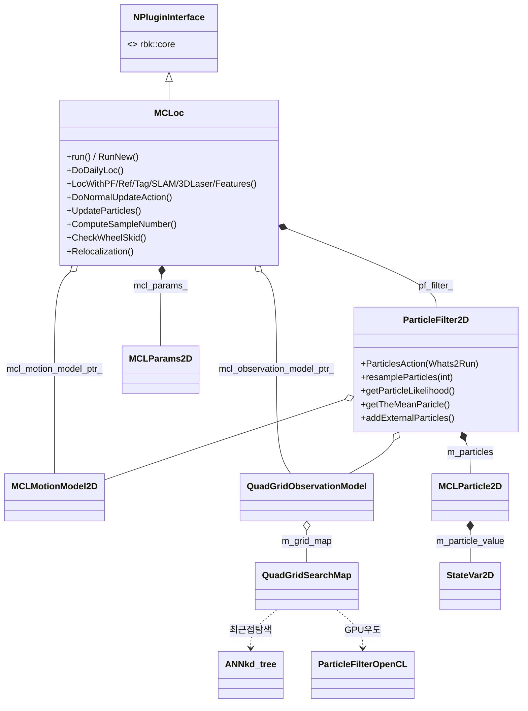
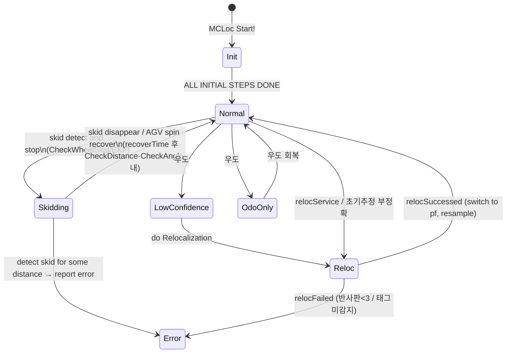

# libMCLoc.so 심층 리버스 엔지니어링 — 2D 파티클필터 위치추정 전체 복원

> 2026-06-24 (KST) · 대상 rbk(Robokit) 위치추정 플러그인 `libMCLoc.so` · 5개 facet 병렬 분석 통합
> 목적: [프로젝트 목적](../../../CLAUDE.md) — 리버스 엔지니어링을 통한 Seer 기능 구현 코드 생성. 본 문서는 **재구현 명세서**다.

## 0. 출처 / 빌드 정보 (실측)

| 항목 | 값 | 근거 |
|---|---|---|
| 바이너리 | `usr/local/SeerRobotics/rbk/plugins/libMCLoc.so` (172MB, ELF64, not stripped) | `file` |
| **rbk 버전** | **3.4.5.20** | DWARF `DW_AT_comp_dir` = `/root/workspace/3.4.5.20/plugins/MCLoc/` |
| 컴파일러 | GCC 7.5.0 (Ubuntu 18.04), 일부 clang 6.0 | `.comment` |
| 컴파일 단위 | 61개 | `readelf --debug-dump=info` |
| 의존 라이브러리 | PCL 1.9.1, protobuf 3.6.1, boost, **Open Karto**(SLAM), **ANN**(kd-tree), **Ceres**(반사판), **OpenCV**(PnP/태그), **OpenCL**(GPU 우도) | typeinfo 심볼 |
| 분석 방법 | `gdb ptype`, `objdump -dS`, `readelf --debug-dump`, `nm -C -S`, `strings`, `addr2line` (디컴파일러 없음 — 디버그심볼로 대체) | — |

분석 한계: 함수 본문 산술 세부(우도식·노이즈 std)는 별도 컴파일단위(`ParticleFliter2D.cpp`, `MCL_motion_model2D.cpp`, `MCL_observation_model2D.cpp`)에 있어 일부는 호출 맥락 기반 **추론**으로 표기. 메모리 오프셋·패딩은 미검증(타입·이름만 확정).

---

## 1. 아키텍처 — 다중 모달 위치추정 통합 플러그인

MCLoc(Monte Carlo Localization)은 단일 알고리즘이 아니라 **9개 위치추정 백엔드를 상태머신으로 전환**하는 통합 플러그인이다.

> **명명 주의(검증됨)**: 본 문서에서 위치추정 코어는 **2D Monte Carlo Localization 파티클필터 + 점유-bin 기반 적응 표본수**다. 이는 개발자 자신의 명명(`MCLoc`, `MCLParams2D`, `AdaptiveSampleNumberXYStep`)에 근거한다. 적응 표본 메커니즘은 KLD-sampling(Fox 2003)의 아이디어와 구조적으로 같으나 **실제 식은 단순 선형 `n=k×2.5`** 이고 정식 KLD 통계 한계식이 아니다 — 따라서 "KLD-sampling 계열의 단순화 변형"으로 표기한다. 바이너리에 `KLD`·`AMCL` 문자열은 **없으며**, "AMCL"(ROS 패키지 계보)이라는 표현은 사용하지 않는다.



소스 파일 참조 빈도(strings 실측) = 모듈 규모 순위: `QuadGridSearchMap.cpp`(3238) > `MCLoc.cpp`(2274) > `pfLoc.cpp`(1639) > `seerTagLoc.cpp`(976) > `opencl_module.cpp`(781) > `HybridSearchMap2DNew.cpp`(712) > `feature_localizer.cpp`(590) > `SLAM.cpp`(586) ≈ `skidDetect.cpp`(586) > `reflectorloc.cpp`(509).

---

## 2. 핵심 데이터 구조 (DWARF `gdb ptype` 실측 복원)

```cpp
// 2D 포즈 상태 — 파티클필터의 단위 상태 (LocalizationVarDefine2D.h:35)
struct StateVar2D { double m_posX, m_posY, m_angle; };          // 24 bytes

// 파티클 (별도 Particle/sample 구조 없음 — 이것이 유일)
class MCLParticle2D {
    double weight;
    double log_weight;
    StateVar2D m_particle_value;     // x, y, angle
    void setWeight(double);
    void setParticleValue(double x, double y, double a);
    void randomInitialize();
};

// 제어/오도 증분
struct ControlVar2D { double x, y, angle; bool is_stop; double timestamp; };

// 측정 (극좌표 레이저 점군)
struct MeasurementPointInPolar2D { double angle, dist; bool is_valid; };
struct MeasurementPoints2D { std::vector<MeasurementPointInPolar2D> measurement_points; };
struct MeasurementVar2D {
    double m_laser_pos_x, m_laser_pos_y, start_angle;
    MeasurementPoints2D m_points;
};

// 초기 자세 후보
struct InitialPose { double m_init_x, m_init_y, m_init_angle; };
```

내부 상태 enum (실측):
```cpp
enum MCLoc::CurrentState { kStateInit, kStateReloc, kStateDailyLoc, kStateNone };
enum MCLoc::LocState     { kLocPF, kLocRef, kLocTag, kLocOdo, kLocSLAM,
                           kLocCorrect, kLoc3D, kLoc3Dtag, kLocFT };       // 어떤 백엔드로 추정 중
enum ParticleFilter2D::Whats2Run { kRelocalizationScanUpdate, kNormalScanUpdate,
                                   kMove, kExtraMove, kOffset };           // PF 실행 액션
```

출력 메시지(`message_localization.proto`)의 `LocState{Normal,Skidding,LowConfidence}` / `LocMethod{PF_LASER_2D,SLAM_2D,PGV,REFLECTOR,LASER_3D,BAR_CODE}` 와 위 내부 enum이 대응.

격자 탐색 맵(점유격자 역할 — likelihood field):
```cpp
class QuadGridSearchMap {           // Localization/QuadGridSearchMap.h
    std::unordered_map<long,GridMap*> m_index_grid;   // 희소 격자
    rbk::foundation::QuadTree* m_quad_tree;           // 쿼드트리 가속
    bool* m_quadMap;  // 점유 비트맵
    double m_x_min,m_x_max,m_y_min,m_y_max, m_quad_resolution;
    ANNkd_tree* ann_kdTree_;                          // 최근접 장애물 탐색
    float   m_sin_cos_lookup_table[2][36000];         // 삼각함수 LUT (0.01° 분해능)
    uint8_t m_gauss_grid_pdf_table[25501];            // 가우시안 PDF LUT (정상)
    uint8_t m_gauss_reloc_pdf_table[25501];           // 재추정 PDF LUT
    uint8_t m_gauss_trapezium_pdf_table[25501];       // 사다리꼴 PDF LUT
    std::shared_ptr<seer::ParticleFilterOpenCL> pf_opencl_ptr_;  // GPU
    double getPostProb(const StateVar2D&, std::vector<double>&); // 우도질의
};
```

> MCLoc 인스턴스가 ~64MB인 이유: 멤버 `normal_pos_arr_`가 `GeoPoint[4000000]`(32MB) 고정배열.

---

## 3. 파티클필터 알고리즘 복원 (objdump 디스어셈블 실측 + 추론)

### 3.1 실행 체인
```
run() [MCLoc.cpp:159]
 └ RunNew() [MCLoc.cpp:164]  ── ~10ms 주기 루프 (nanosleep)
     switch(state):
       kStateInit  → Initialization()
       kStateReloc → CheckLocState() + Relocalization()
       kStateDailyLoc → CheckLocState() + DoDailyLoc()
                          └ LocWithPF() [pfLoc.cpp:141]   ← 정상 PF 경로
                               └ DoNormalUpdateAction() [pfLoc.cpp:508]
                                    └ UpdateParticles() [pfLoc.cpp:806]
                          (대안 백엔드: LocWithSLAM/Ref/Tag/3DLaser/Features)
```

### 3.2 표준 파티클필터 4단계 매핑 (실측)

| PF 단계 | 구현 위치 | 내용 |
|---|---|---|
| **예측(motion)** | `ParticlesAction(kMove/kNormalScanUpdate)` → `MCLMotionModel2D::doParticleMoveAction` | 오도 증분 + 노이즈로 파티클 이동. 정지/저속/이동 모드별 노이즈 스케일 분기(`setExtraMoveParams`) |
| **가중(measurement)** | `getParticleLikelihood` → `QuadGridObservationModel::computeLikelihoodOpenCL` | 격자맵 가우시안 PDF 우도. **GPU(OpenCL)+ThreadPool 병렬**. `weight = pdf_sum / valid_beam / 255.0` (커널 실측) |
| **리샘플링(resample)** | `UpdateParticles → resampleParticles(ComputeSampleNumber())` | **KLD-sampling 적응 표본수** |
| **추정(estimate)** | `SetLastVartoMeanParticle()` (가중평균 파티클) | best/mean 파티클 → 출력 pose |

### 3.3 KLD 적응 표본수 (`ComputeSampleNumber`, pfLoc.cpp:995 — 디스어셈블 실측)
```
파티클 (x,y) bounding box → 격자 분할 (cell=설정 해상도, 차원 ≤100 클램프)
nθ = 2π / 6.0°  = 60 각도 빈
3D 히스토그램[nx][ny][60]에 각 파티클 투표
k = 점유된 빈 개수
sampleNumber = (int)(k × 2.5)            // KLD 근사 계수 2.5 (.rodata @0x5bf780)
clamp(min_particles ≤ sampleNumber ≤ max_sample_number)
```
→ 분포가 퍼질수록(점유빈↑) 표본 증가. 이는 KLD-sampling(Kullback-Leibler Distance, Fox 2003)의 **핵심 아이디어와 구조적으로 동일**하나, 실측 식은 단순 선형 `n=k×2.5`(상수 0x5bf780=2.5 실측, 각도빈 6.0° 실측)로 **정식 KLD 통계 한계식은 아님**(ε·z 파라미터 부재). "KLD 계열의 단순화 변형"으로 한정.

### 3.4 kidnap/복구 처리 (`LocWithPF`, pfLoc.cpp:153~209 실측)
- 변위 테스트: `0.05 < |dx| && 0.05 < |dy|` 이면 각도 임계로 kidnap 판정.
- 복구: `addExternalParticles(state, 1.0, 100.0, 2.0)` 로 외부 파티클 주입(주입비율 1.0, 위치반경 100, 각도 ±2° — 추론) 후 재샘플.

### 3.5 식별 상수 (.rodata 실측)
6.0(각도빈°), 2.5(KLD계수), 0.05(kidnap임계), 100.0(주입반경), 2.0(주입각°), 1000.0(m↔mm), 57.29578(rad→deg), 1e9ns(로그throttle), 100(격자차원상한).

---

## 4. 상태머신 (로그 문자열 + enum 실측)



**신뢰도 게이트(임계)**: `OnlyOdoLikelihoodThreshold`(오도전용 강등) · `RefLikelihoodThreshold`(반사판 전환) · `stopConfidence`(정지) · `StopRelocWeightThreshold`(reloc 종료).
**스키드 게이트**: `CheckDistance`/`CheckAngle`/`recoverTime`. **타임아웃**: `ScanLostTimeThresh`/`OdoLostTimeThresh`.

GPU 우도 커널(중국어 주석 실측)은 듀얼 라이다(1~2개) 점군을 극좌표→맵좌표 변환 후 격자 PDF로 파티클 가중치를 병렬 산출.

---

## 5. 파라미터 (정의 92개 + 실제 배포값)

- **정의 전수(92개)**: [tuning_parameters.md](tuning_parameters.md) 참조 (loadParam 디스어셈블, 기본/min/max 100% 복원).
- **실제 이 로봇(Roll_A084) 배포값**: `robot.param`(SQLite) `MCLoc` 테이블 101키. `personalized.param`은 빈 테이블(오버라이드 없음 → robot.param이 유효값).

핵심 배포값:

| 파라미터 | 배포값 | 의미 |
|---|---|---|
| InitParticleNumber | **10000** | 초기 파티클 수 |
| Min/MaxParticleNumber | **500 / 3000** | 적응 표본 하/상한 |
| BeamsNumUsedInLoc | **541** | 위치추정 사용 빔 수 |
| LaserFarDist / CloserDist | 80 m / 0.01 m | 유효 거리 |
| OdoDistError / OdoAngleError | 0.05 / 0.7 | 오도 노이즈 모델 |
| Scan/OdoLostTimeThresh | 300 / 300 ms | 센서 타임아웃 |
| RefLikelihoodThreshold | 0.95 | 반사판 전환 임계 |
| PfThreadNum | 4 | PF 스레드 |
| useRTKLocalization / RTKWeight | 1 / 0.05 | RTK 융합 |

**센서 기하(robot.model 실측 — 재구현 필수)**: 듀얼 라이다 `SickSafe-UDP`, FrontLiDAR @(0.879, −0.579, yaw −45°)/192.168.192.100:6060, RearLiDAR @(−0.879, 0.579, yaw 135°)/192.168.192.101:6061, FOV ±130°, step 0.17°. 섀시 multiSteers `Foil_A085` 1.3×1.9m. 휠베이스 1.2m, 휠반경 0.125m, 조향 offset 138°/137.6°.

---

## 6. 재구현 로드맵 (본 분석 기반)

오픈소스 기반이 명확하므로 동등 기능 재구현 경로:

1. **자료구조 이식**: §2의 `StateVar2D`/`MCLParticle2D`/`MeasurementVar2D`/`MCLParams2D` C++ 헤더는 그대로 사용 가능.
2. **2D AMCL 코어**: §3의 KLD-sampling + 격자 likelihood field. 참조 구현 = ROS `amcl`(동일 KLD), 또는 Open Karto. 격자 PDF LUT(가우시안 25501엔트리)·sin/cos LUT(36000) 방식 채용.
3. **모션 모델**: dual-steer 오도메트리(§5 기하: 휠베이스 1.2m, offset 보정) → `ControlVar2D` 증분 → 파티클 예측.
4. **관측 모델**: 듀얼 라이다 극좌표 점군 → 맵좌표 변환 → 격자 PDF 우도. GPU는 선택(CPU 다중스레드로 시작).
5. **상태머신**: §4 (Normal/Skidding/LowConfidence/Reloc/OdoOnly) + 임계 파라미터.
6. **검증**: 추출한 실제 맵(.smap)·`robot.param` 값으로 회귀 시험.

---

## 6.5 분석 백로그 해소 (2026-06-24, in-session 디스어셈블 확정)

재구현에 직접 필요한 PF 내부 3건을 추가 디스어셈블로 확정(전부 실측):

**① 리샘플링 = systematic(low-variance) resampling** — `ParticleFilter2D::resampleParticles` @0x3479e0.
- 근거: Mersenne Twister(`mt19937_64`) `twist()` **1회만** 호출(@0x347bac) + 누적가중치(CDF) 구성 + stride 나눗셈(@0x347c4e `divsd`로 1/N) + `ucomisd`+`jae` 포인터 전진(@0x347f0c). 매 입자 난수(multinomial)가 아니라 **단일 난수 u₀∈[0,1/N) + 균등 stride** = systematic.

**② 모션모델 노이즈 = 균등 극좌표 산포(Gaussian 아님)** — `MCLMotionModel2D::doParticleMoveAction` @0x33cb70.
- 근거: `RangeRandom(int,int)`(균등난수) **2회**(@0x33cba8, 0x33cbde) + `cos`/`sin` → `r·cosθ, r·sinθ` 디스크 산포. `std::normal_distribution` 미사용. 산포 반경은 `supplyControlVar`(@0x33dd8b `sqrtsd`)에서 이동량 `sqrt(dx²+dy²)` 기반으로 산출 → 파라미터 `ParticleMoveRadius`/`ParticleExtraMoveRadius`로 스케일. 예측 = 결정론적 오도 증분 + 균등 디스크 산포.

**③ 측정 우도 = 빔별 격자 가우시안 PDF 합 / 255 / valid_beam** — `QuadGridSearchMap::getPostProbBase` @0x38b9a0 (CPU 경로, getPostProb→getPostProbBase).
- 근거: 빔별 극좌표→맵좌표 변환(`cos`/`sin`/`atan2` @0x38bb46~), PDF 바이트 룩업(`movzbl` @0x38be5c, m_gauss_grid_pdf_table[25501], 0~255), 합산(`addsd`), 정규화 `divsd 255.0`(@0x38b9f7, 0x562a28=255.0 실측). **OpenCL 커널의 `weight=pdf_sum/valid_beam/255`와 CPU 경로 동일** 확정. 상수 100.0(0x560770, 맵 스케일)·180.0(0x562978, deg) 실측.

→ 이 3건으로 2D MCL 파티클필터 재구현 명세 완비. (registry 부채 아님 — [[debt-scope-principle]]에 따라 원본 분석 백로그로 본 문서에 기록.)

## 6.6 A1 분석 — reloc·상태머신·슬립감지·메인루프 (2026-07-10, 12에이전트 교차검증)

**① 재위치추정(relocalization)** — `DoRelocAction`/`RelocWithPF`/`UpdateRelocParticles` (confirmed 2/2):
- 영역 설정: center=(x,y)×1000mm, length=1000×radius(m, 최소 클램프), 각도 살포=180°.
- 절차: 영역 내 `MutableMaxParticleNumber`(기본 3000) 파티클 **균등 살포** → 최대 100회 반복. 매 반복 **담금질 스프레드** `(100−counter)/100000 × length`(반복될수록 탐색반경 축소) + `ParticlesAction(kExtraMove)` + 리샘플. 측정우도는 **넓은 재추정 PDF**(`m_gauss_reloc_pdf_table`, getPostProbBase mode=2).
- **이중 게이팅**: 수렴은 넓은 재추정 PDF로 (`평균포즈 reloc우도 > StopInitialLocWeightThreshold`(1.0) → counter=101 조기종료), **최종 성공검증은 날카로운 정상 PDF**(`getRobotPosLikelihood`)로 `> 임계` → `relocSuccessed`, 이하 → `relocFailed`. 취소=CancelReloc.
- 납치복구 `addExternalParticles(weight=1.0, posSpread=100.0/2000, angSpread=2.0°)` — 재추정과 별개.

**② 상태머신** (partial 1/2, high — 오프셋 정정 반영):
- **3개 독립 상태변수**: `CurrentState state_@0x185C`{Init,Reloc,DailyLoc,None} 생명주기 / `LocState loc_state_@0x1860`{PF,Ref,Tag,Odo,SLAM,Correct,3D,3Dtag,FT} 방식 / 보고용 `Message_Localization_LocState`{Normal=0,Skidding=1,LowConfidence=2}.
- **오도전용 강등**: `robot_pos_likelihood_ < OnlyOdoLikelihoodThreshold` → `loc_state_=kLocOdo` + only-odo 플래그.
- **저신뢰(LowConfidence)**: `region_stop_confidence_ > 현재모드 신뢰도` → `setError(0xcc4c)` 'stop because of low confidence'. (주의: 보고 바이트엔 값2 미기록 — 에러코드로 신호.)
- **FireEvent는 reloc 이벤트 버스**(relocStarted/Finished/Failed/Successed)이지 Normal/Skidding 전이엔진 아님(과거 오해 정정).
- 타임아웃: `Scan/OdoLostTimeThresh`(ms).

**③ 슬립감지(skid)** — `CheckWheelSkid`/skidDetect.cpp (confirmed 2/2):
- **병진**: 게이트 `D_odo>CheckDistance(1.0m) || D_state>CheckDistance`, 그 안에서 불일치 `D_state>2×D_odo || D_odo>2×D_state`(계수 2.0) → skid.
- **회전**: `|Δθ 불일치| > CheckAngle(30°)` → skid.
- 감지 시 `setError(0xcdee=52718)` 'Detect skid and stop AGV', 보고 바이트=1(Skidding). 복구: `정지후경과 > recoverTime(1.0s)×1000` → Normal.

**④ 메인루프** — `RunNew` (confirmed 2/2):
- 진입 폴링 100ms, 루프주기 = MutableParam(ms). 게이트(AND): `atomic bit0 && has_get_new_map_ && odom_received_ && laser_received_`.
- 상태전이: Initialization완료→Reloc; RelocWith*성공→DailyLoc; RelocService→Reloc; RefreshMap→Init.

→ A1 재구현 명세 완비. 구현: mcl2d_core reloc·SkidDetector·LocState.

## 7. 근거 / 한계 등급

- ✅ **실측 확정**: 클래스/구조체 정의(gdb ptype), enum, 92개 파라미터(loadParam 디스어셈블), 실제 배포값(SQLite/JSON 파싱), 로그 문자열·상태머신 문구, 호출 체인(objdump), 센서 기하.
- ⚠️ **추론(명시)**: 우도식·노이즈 std 등 별도 CU 산술 세부, `addExternalParticles` 인자 의미, 전이의 정확한 인과 순서, 메모리 오프셋.
- 원시 산출물(디스어셈블): scratchpad `*.asm` (run/runnew/locwithpf/donormalupdate/updateparticles/computesamplenumber/getloclikelihood/loadFromConfigFile).

---
