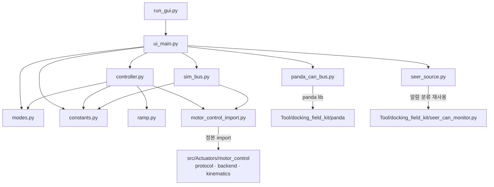

# amr_test_gui 구조 — 함수표·전역변수표·의존 그래프 (2026-07-27)

> coding SOP §6 후속갱신 산출물(상태-미러형 — 덮어쓰기). **루트 정본** + 패키지 병기 이중 기록.
> 병기본: `Tool/amr_test_gui/docs/sw_structure/amr-test-gui/2026-07-27.md`
> 범위 한정: 본 문서는 **coding §6 이 요구하는 함수표·변수표·의존 그래프**다.
> `sw_structure` SOP 의 전체 산출물(클래스·시퀀스·파일그래프 `.drawio` 3종)은 SW-구조 분석 요청이
> 아니었으므로 작성하지 않았다 — 필요 시 별도 요청으로 생성한다.

관련: ADR [2026-07-27-amr-test-gui](../../adr/2026-07-27-amr-test-gui.md) · 부채 `debt-004/005/006`

## 1. 파일 의존 그래프

**단방향 규칙**: UI → controller → ramp/정본. 역방향 import 없음. `ramp.py`·`modes.py`·`constants.py`
는 Qt·CAN·시간원 무의존(순수) — 실차 없이 단위 테스트 가능.

## 2. 함수표

### `ramp.py` — 조향 단계 램프 (순수 상태기계)

| 함수 | 시그니처 | 역할 | 부작용 |
| --- | --- | --- | --- |
| `SteerRamp.__init__` | `(*, step_deg=30, settle_tol_deg=3, step_timeout_s=4, limit_deg=90, start_deg=0)` | 램프 구성. 잘못된 파라미터는 `ValueError` | 없음 |
| `SteerRamp._clamp` | `(deg) -> float` | ±`limit_deg` 하드 클램프 | 없음 |
| `SteerRamp.set_target` | `(deg) -> float` | 목표각 설정(클램프). FAULT 중 무시 | `_target` |
| `SteerRamp.reset` | `() -> None` | FAULT 래치 해제 + 목표를 현 지령으로 되돌림 | `_state,_target,_deadline` |
| `SteerRamp.tick` | `(measured_deg\|None, now) -> RampOutput` | 1주기 진행: 정착 판정 → 단계 전진 / 기한 초과 시 FAULT | `_cmd,_state,_deadline` |
| `SteerRamp._fault` | `(reason) -> RampOutput` | FAULT 래치 + 지령·목표 0(즉시 home) | `_cmd,_target,_state` |
| 속성 | `state · commanded_deg · target_deg · detail` | 조회 전용 | 없음 |

### `controller.py` — backend 수명주기 + 램프 조정 (Qt 무의존)

| 함수 | 시그니처 | 역할 | 부작용 |
| --- | --- | --- | --- |
| `AmrTestController.__init__` | `(*, logger=print)` | 램프·상태 초기화 | 없음 |
| `.connect` | `(bus_factory, *, allow_homing_motion=False)` | 버스 생성 → backend 항등 구성 → `start()`. **실패 시 버스 release 보장** | 버스 take, CAN init 송신 |
| `.disconnect` | `() -> None` | E-stop → `backend.shutdown()`(release·close 포함). 중복 무해 | 버스 release |
| `.connected` | `-> bool` | 연결 여부 | 없음 |
| `.set_mode` | `(key) -> None` | 모드 전환 + 그 모드의 조향 목표를 램프에 설정 | `_mode`, ramp 목표 |
| `.set_speed_mmps` | `(mmps) -> None` | 속도 상한(음수는 0 으로) | `_speed_mmps` |
| `.set_steer_slider_deg` | `(deg) -> None` | 슬라이더값 보관. `조향만` 모드에서만 램프 목표 반영 | ramp 목표 |
| `.estop` | `(engage) -> None` | backend E-stop 래치 위임 + 모드 STOP | CAN(속도 0) |
| `.home` | `() -> None` | `set_mode("home")` | 상동 |
| `.reset_fault` | `() -> None` | 램프 FAULT 해제 + 모드 STOP | ramp 상태 |
| `.tick` | `() -> dict` | snapshot → 램프 진행 → `ModuleCommand[]` 송신 → 상태 dict | CAN 지령 갱신 |
| `._ramp_measurement` | `(nodes) -> float\|None` | 조향 노드 중 **지령에서 가장 벗어난** 값(평균 아님). 하나라도 결측이면 `None` | 없음 |
| `._status` | `(snap, out, units) -> dict` | UI 표시용 상태 조립 | 없음 |

### `modes.py` / `constants.py` — 인용 테이블

| 심볼 | 종류 | 내용 |
| --- | --- | --- |
| `DriveMode` | dataclass | `key·label·steer_deg·raw_sign·basis·verified` |
| `STOP·FORWARD·BACKWARD·CRAB_LEFT·CRAB_RIGHT·STEER_ONLY·HOME` | 상수 | 모드 정의(각각 부호 근거 `basis` 보유) |
| `mmps_to_units` / `units_to_mps` | 함수 | mm/s ↔ raw units(0.1 rpm), `VEL_MAX_UNITS` 포화 |
| `counts_to_deg` | 함수 | 조향 0x6064 절대 counts → 홈 기준 각도 |

### `panda_can_bus.py` / `sim_bus.py` — python-can 호환 버스 (동일 표면)

| 함수 | PandaCanBus | SimBus |
| --- | --- | --- |
| `__init__` | 판다 open + `_take()`(safety 30·CAN0/2 enable·auth=PC·intercept) + heartbeat 스레드 | 노드 상태 초기화 |
| `send(msg)` | SDO → CAN2. **RTR 은 skip**(판다 송신 불가, debt-006) | SDO 해석 → 응답 큐잉 |
| `recv(timeout)` | CAN2 프레임만 반환 | 큐에서 pop |
| `shutdown()` | release(auth=Seer·passthrough·safety 0) + close | 로그만 |
| `_heartbeat` | 0.4 s 주기 0xf3 | — |
| `_integrate` | — | 조향 수렴·구동 적분(모사) |
| `set_stuck` | — | 노드 고착 주입(FAULT 경로 재현) |

### `ui_main.py` — PyQt5 (주요 함수만)

| 함수 | 역할 | 스레드 |
| --- | --- | --- |
| `MainWindow._build*` | 상단바/제어/상태/하단 레이아웃 구성 | GUI |
| `._on_estop` | E-STOP 토글 → `controller.estop()` | GUI |
| `._on_connect` / `ConnectWorker.run` | 브링업을 **워커 스레드**에서 수행(E-STOP 응답성 유지) | 워커 |
| `._on_thread_finished` | 워커 정리. GUI 블로킹 없음 | GUI |
| `._on_tick` | `CMD_HZ`(20 Hz) 주기 tick + 화면 갱신 | GUI |
| `._log` / `._append_log` | **어느 스레드에서든 안전** — `log_line` 시그널 경유(직접 위젯 접근 시 코어 덤프) | any → GUI |
| `.closeEvent` | E-stop → disconnect → 소스 정지. 제어권 반환 보장 | GUI |

## 3. 전역변수·모듈 상수표

| 심볼 | 파일 | 값·근거 | 변경 주체 |
| --- | --- | --- | --- |
| `STEER_LIMIT_DEG` | ramp.py | 90.0 — 실측 검증 범위(홈↔90° = 5,160,960 counts) | 상수 |
| `IDLE/RAMPING/SETTLED/FAULT` | ramp.py | 상태 문자열 | 상수 |
| `M_S_PER_UNIT` | constants.py | 4.0906e-5 ← driver_node.py | 상수(테스트로 대조) |
| `COUNTS_PER_DEG` | constants.py | 57344.0 ← protocol 실측 | 상동 |
| `COUNTS_PER_M` | constants.py | 2670177.0 ← driver_node.py | 상동 |
| `STEER_HOME_COUNTS` | constants.py | {3: 7871815, 4: 7840086} ← tongyi_amr.yaml(전원 사이클 불변) | 상동 |
| `VEL_PER_MMPS` / `VEL_MAX_UNITS` | constants.py | 24.447 / 4889 ← docking_drive.py | 상동 |
| `DEFAULT_SPEED_MMPS` / `MAX_SPEED_MMPS` | constants.py | 50 / `VEL_MAX_UNITS÷VEL_PER_MMPS` (≈200) | 정책값 |
| `RAMP_STEP_DEG` / `RAMP_STEP_TIMEOUT_S` | constants.py | 30.0 / 4.0 | 정책값 |
| `CMD_HZ` | constants.py | 20.0 — backend 워치독 0.2 s 대비 4배 여유 | 정책값 |
| `MOTOR_BUS·SEER_BUS·SEER_GATE·HEARTBEAT_S` | panda_can_bus.py | 2·0·30·0.4 ← relay 실측 프로토콜 | 상수 |
| `MOTOR_CONTROL_PATH` | motor_control_import.py | env `MOTOR_CONTROL_PATH` 또는 레포 상대경로 | 환경변수 |
| `ROLE` | controller.py | 노드↔역할 표시명 | 상수 |

**가변 전역 없음** — 모든 런타임 상태는 `SteerRamp`·`AmrTestController`·버스 인스턴스에 캡슐화되어 있고,
공유 상태는 `threading.Lock`(`_lock`) 로 보호된다.

## 4. 구조 관찰

- **정본 재사용 비율**: 프로토콜 인코딩·SDO 폴링·안전게이트(콜드 홈 거부·정착 게이트·워치독·E-stop 래치)는
  전부 `motor_control` 소유. 본 툴 고유 코드는 램프·모드표·UI·버스 어댑터로 한정된다.
- **안전 이중화**: 구동 허용은 두 곳에서 독립적으로 게이트된다 — 램프(`drive_allowed`)와
  backend TX 루프의 정착 게이트. 한쪽이 무력화돼도 다른 쪽이 남는다.
- **스레드 경계 3곳**: ① backend TX/RX(정본 소유) ② 판다 heartbeat / Seer 폴링 ③ 브링업 워커.
  이 셋에서 GUI 위젯에 닿는 유일한 경로가 `log_line` 시그널이다(그 외 접근은 코어 덤프를 유발했고 수정됨).
- **미검증 잔여**: relay 경유 통합 실구동(`debt-005`)과 guard RTR 대체 가정(`debt-006`).
  코드 구조로는 해소 불가 — 잭업 실기 관측이 필요하다.
