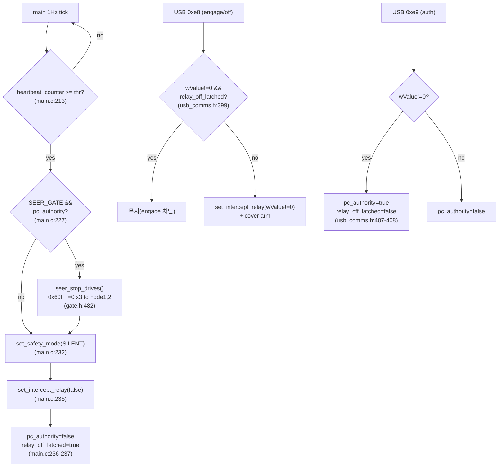

## 2026-07-29 (KST) — CAN Relay 펌웨어 S4(구동륜 감속 정지)·S6(재engage 차단 래치) 리뷰

### 코드 버전
- 대상: `Tools/Can_Relay/panda-firmware/board/` (git **미추적** `??` — 커밋 해시 없음)
- 파일 내용 해시(빌드 서명 md5, 장치 대조): `015f4373b5715d70` (`0xd3`+`0xd4` 서명, 앱 30,172 B)
- 직전 리뷰: 없음(본 주제 최초). 인접 주제 `docs/code_review/can_relay_firmware/`.
- user_instruction 매핑: `docs/user_instructions/sessions/17558ff1-*.md` (2026-07-28 21:22~) sess 17558ff1

### 분석 분기 명시
- 분기: **단위 코드 리뷰** (이번 세션 S4/S6 추가·수정분)
- 감지된 도메인: **embedded-review + concurrency** (STM32F4 bxCAN, 1 Hz 메인틱, USB control 핸들러) / ros2 해당 없음

### Core 인벤토리

#### 1. 목적
Seer↔모터 드라이브 사이 판다 릴레이 펌웨어에 두 안전 기능을 추가한다.
- **S4**: heartbeat 상실(PC 사망) 시 relay off **전에** 구동륜(node1,2)을 목표속도 0(`0x60FF`)으로 발행해 PV 프로파일 감속으로 세운다 — PC 가 마지막에 쓴 속도가 드라이브에 래치돼 계속 주행하는 것을 막음(가이드 §2 S4).
- **S6**: 안전 off 발생 시 래치를 세워, `0xe9` 주도권 재취득 전까지 `0xe8` engage 를 차단 — 조건 지속 시 engage↔off 반복 토글(토글 워) 방지(가이드 §2 S6).
근거: `Tools/Can_Relay/panda-firmware/docs/rewrite-guide.md` §2, `src/Actuators/motor_control/motor_control/backend.py:201`(shutdown=0x60FF=0).

#### 2. 코드 플로우차트 (단위)
동반 `2026-07-29-flow.drawio` (박스·화살표 검증 완료).

#### 3. 함수 리스트
| # | 함수 | 입력 | 출력 | 기능 | 위치(file:line) |
|---|------|------|------|------|-----------------|
| 1 | `seer_stop_drives` | 없음(전역 참조) | void | 구동륜 node1,2 에 `0x60FF`=0 을 3회씩 발행(PV 감속 정지) | safety_seer_gate.h:482 |
| 2 | `seer_home_sdo_write` (호출됨, 기존) | node,index,sub,value,size | void | bus2 로 expedited SDO write(#1 이 재사용) | safety_seer_gate.h:256 |
| 3 | `usb_cb_control_msg` case `0xe8` (수정) | setup(wValue) | resp_len | 래치 아닐 때만 intercept relay 설정+cover arm | usb_comms.h:397 |
| 4 | `usb_cb_control_msg` case `0xe9` (수정) | setup(wValue) | resp_len | pc_authority 설정, wValue!=0 시 래치 해제 | usb_comms.h:406 |
| 5 | `main` 루프 heartbeat 상실 블록 (수정) | heartbeat_counter | (부수효과) | 상실 시 #1 호출→SILENT→relay off→래치 set | main.c:211-237 |

중복/유사 함수: 없음(#1 은 기존 SDO 헬퍼 재사용, 중복 로직 미도입).

#### 4. 전역 변수 / 모듈 상수
| # | 사용처(함수) | 기능 | 위치(file:line) |
|---|-------------|------|-----------------|
| 1 | `relay_off_latched` (가변) — #3,#4,#5 | 안전 off 후 재engage 차단 래치 | safety_seer_gate.h:3 |
| 2 | `SEER_DRIVE_NODE_LO/HI` (상수) — #1 | 구동륜 노드 범위 1..2 | safety_seer_gate.h:480-481 |
| 3 | `pc_authority` (가변, 기존) — #4,#5 | PC 주도권 상태 | safety_seer_gate.h:1 |
필요성: `relay_off_latched` 는 USB 핸들러(#3,#4)와 메인틱(#5) 간 공유 상태라 파일 스코프 전역이 불가피(지역 대체 불가). `SEER_DRIVE_NODE_LO/HI` 는 매직넘버 제거용 상수로 적절.

#### 5. 의존성 3-tier
| Tier | 대상 | 버전/제약 | 부재 시 동작 | 근거(파일:line) |
|------|------|-----------|--------------|-----------------|
| 빌드 | scons + arm-none-eabi-gcc(-Werror) | — | 빌드 불가 | SConscript |
| 런타임 필수 | Tongyi 드라이브 **PV(mode 3)** 상태 | 0x6060=3 | PV 아니면 `0x60FF`=0 감속 미보증(S4 무효) | backend.py:258 |
| 런타임 필수 | bxCAN bus2 (CAN3) 물리 연결 | 250 kbps | 정지프레임 미도달 | can_common.h |
| 런타임 선택 | (없음) | — | — | — |

### 도메인 인벤토리
#### embedded-review
| 항목 | 값 | 위치 |
|---|---|---|
| 실행 문맥 | 메인 루프 1 Hz 틱(비-ISR) — #5. USB control 핸들러 #3·#4 는 USB 콜백 문맥 | main.c:186, usb_comms.h |
| volatile/공유 HW | `GPIOC->ODR`(relay 제어), bxCAN TX 메일박스 | harness.h, bxcan.h |
| 타이밍 | 정지프레임 3×2=6개 can_send → 곧바로 set_safety_mode(SILENT)의 can_init_all | main.c:228→232 |

#### concurrency
| 공유 상태 | 접근자 | 보호 | 위험 |
|---|---|---|---|
| `relay_off_latched` | #3,#4(USB 콜백) · #5(메인틱) set | 없음(단일 워드 bool, 원자성 가정) | STM32 단일코어·바이트 접근이라 실질 race 낮음(Info) |
| bus2 TX 큐 | #1(정지프레임) → #5의 can_init_all | 없음 | **정지프레임 물리송신 전 CAN 재init 가능(아래 High-Medium)** |

### 평가
severity 분포: Critical 0 / High 0 / Medium 2 / Low 2 / Info 1
Verdict: COMMENT

**함수 #1·#5 — [논리][race][신규] 정지프레임 TX 완료 전 CAN 재초기화 가능 (Medium)**
   재현: main.c:228 `seer_stop_drives()`가 6개 프레임을 bus2 TX 큐에 적재만 하고, main.c:232 `set_safety_mode(SAFETY_SILENT)` 내부 `can_init_all()`(main.c:134 부근)이 물리 송신 완료 전에 CAN 페리페럴을 재init 하면 정지프레임 일부/전부가 드라이브에 도달하지 못한다. 순서·의미 결함은 아니나 전송 신뢰성 리스크.
   권고: 정지프레임 발행 후 짧은 TX 드레인 대기 또는 다음 틱으로 relay off 지연(감속 시간 확보와 겸함). 실기 확증은 debt-013 상환 시.

**함수 #1·#5 — [테스트][신규] S4 정지명령 실효성 미검증 (Medium)**
   재현: 정지 순간 판다 발원 `0x60FF`=0 과 relay off 후 Seer 인수가 동시점이라 S4 단독기여 분리 미검증. node1 감속곡선 미확보(이미 홈), 에코로 node1 1건만 관측.
   권고: debt-013 상환(pre-S4 12dd1138 vs S4 대조 · 양 구동륜 0x6064 시계열 · SDO 응답으로 전달 확증).

   > ❌ **정정 2026-08-03 15:40 — 「(이미 홈)」은 1차 자료를 부정확하게 인용한 것이다. 원문은 이력으로 보존한다.**
   > 1차 기록 `docs/debt/registry.md` debt-013 (2) 는 **「node1 은 거의 안 움직여(~3,000 counts) 감속 곡선 확보
   > 실패, 비대칭 원인 미상」** 이라고 적는다 — 사유는 **구동륜 node1 의 이동량 부족**이지 「홈」이 아니다.
   > ⚠ 이 「이미 홈」 표기를 조향 호밍의 폐기된 주장 **「축이 이미 홈이면 드라이브가 무동작 즉시 완료한다」**
   > 와 연결해 읽지 말 것 — 그 주장은 2026-08-03 실측으로 **반증**됐다(홈 ±0.001° 에서 호밍을 걸어도 축이
   > −리밋까지 주행, `bit15` 하강 에지 정상 발생, **10/10 성공 · 35.0 s**).
   > ❌ **재정정 2026-08-03 17:00**: 소요는 **평균 35.07 s · 중앙값 35.05 s**(34.99~35.16, 폭 0.17)다 —
   > `Log/home_experiment_260803_153319_summary.json` 10 런 `elapsed` 직접 계산.
   > 「35.0 s」로 반올림해 인용하지 말 것. **「10/10 성공」 자체는 유효**하다.
   > 본 항은 **구동륜 S4(감속 정지)** 사안이라 조향 호밍과 무관하다.
   > 근거: `docs/homing/2026-08-03-can-relay-homing-assets.md` **§0-1** · `docs/debt/registry.md` debt-013.

**함수 #1 — [논리][신규] PV 모드 전제 (Low)**
   재현: `0x60FF`=0 감속은 드라이브가 PV(0x6060=3)일 때만 성립. 펌웨어는 모드를 설정하지 않고 PC 브링업(backend.py:258)에 의존. 브링업 전/비-PV 상태면 정지 미보증.
   권고: 전제를 문서화(debt-013 에 명시됨). 펌웨어가 모드 미보장은 설계상 수용.

**함수 #3 — [테스트][신규] S6 HIL 관측수단 부재 (Low)**
   재현: relay 상태 직접 read-back(S5)을 미채택해 하드웨어에서 engage 여부를 깨끗이 관측 불가. SIL 진리표 6/6 PASS 하나 HIL 은 전환갭 프록시로 불확정(B=8ms vs C=8.5ms 미분리).
   권고: 관측 필요 시 seer_cover_armed 등 내부상태 반환 디버그 엔드포인트(별도 결정). 현재 로직은 SIL 로 확증.

**함수 #3·#4 — [논리][Info] 래치 우회 경로 (Info)**
   재현: `set_intercept_relay(true)`가 main.c:108(ALLOUTPUT)·125(default)에서 래치 검사 없이 호출됨. 단 SEER_GATE 케이스(main.c:116)는 미호출이고 이는 상위 안전모드 전환 경로라 `0xe8` 래치 경계 밖 — 설계 정합.

---
관련: debt-013(S4 검증)·debt-014(호밍 각도)·mistake 2026-07-29-001. 적대적 감사 `wf_cf5aa79d`(17 에이전트): fw-s4 SUPPORTED·fw-s6 SUPPORTED.

> ⚠ **병기 2026-08-03 15:40** — debt-014 의 전제인 **「`0x6064` 는 호밍 중 0 이 맞다」는 원인 미판정**(debt-036)이며, 그 항목의 원래 사유 **「전원 사이클로만 풀리는 래치」는 폐기**됐다. `0x6064`=0 을 「호밍 중」의 증거로 인용하지 말 것. 한편 **호밍 자체는 정상 동작**한다 — 2026-08-03 15:33~15:40 `orin_home_experiment.py --repeat 10` 에서 **10/10 성공 · 35.0 s**, `0x6098` = **1**(Home 1, −리밋), **리밋 스위치 실재**(10회 모두 DI `0x01`→`0x09`). 근거: `docs/homing/2026-08-03-can-relay-homing-assets.md` **§0**.

> ### ❌ 재정정 2026-08-03 17:00 — **바로 위 15:40 병기가 debt-014 의 전제를 잘못 폐기시켰다** (원자료 재확인)
>
> 원문은 삭제하지 않는다. 아래가 우선한다.
>
> **① 폐기 오적용 — 조건이 다른 두 관측을 하나로 묶었다.**
> - **debt-036** 이 다루는 0 은 `0x6041` **bit15=1**(= 호밍 중이 **아님**) 상태에서 나온 `0x6064`=0 이다.
> - **debt-014** 의 전제는 `0x6041` **bit15=0**(= 호밍 **진행 중**) 상태의 `0x6064`=0 이다.
>
> 후자는 15:33 런 원자료에서 **직접 재현**된다. `Log/home_experiment_260803_153319.jsonl` 의
> SDO 업로드 응답(`0x583`/`0x584`, `43 64 60 00`)을 **노드별 최신 statusword(`4b 41 60`)로 층화**하면:
>
> | 노드 | `bit15=0`(호밍 중) 구간 | `bit15=1` 구간 |
> |---|---|---|
> | node3 | `0x6064`=0 이 **32,243 / 32,243 (100%)** | 0 이 558 / 6,484 |
> | node4 | `0x6064`=0 이 **32,167 / 32,175 (99.98%)** | 0 이 559 / 6,525 |
>
> ⇒ **「호밍 중 `0x6064`=0」 관측은 확정이며 폐기 대상이 아니다. 미상인 것은 원인뿐이다.**
> 표 오른쪽 열(bit15=1 인데 0)이 debt-036 이며, 이 둘은 **서로 다른 조건**이다.
> (같은 사실이 `src/Comm/CAN/can_relay/config/machine/foil_a082.yaml:155` 에도 이미 적혀 있다 —
> 「호밍 진행 중 0 고정(`0x6041` bit15=0 구간)」.)
>
> ⚠ **다만 「`0x6064`=0 이면 호밍 중이다」라는 역방향 추론 금지는 타당하므로 그대로 유지**한다.
>
> **② `0x6064`=0 은 「단발」이 아니다 — 재현된다(원인은 미판정).** 오늘 캡처 직접 집계:
> 09:19 **50/50** · 09:58 node3 **12,220/12,220**·node4 **12,211/12,211** ·
> 10:08 `Log/seer_homing_260803_100813.jsonl` **전량 10,327/10,327**(양 노드) ·
> 리부팅 후 14:43 `Log/homing_edge_260803_144305_can.jsonl` node3 2/74·node4 2/68.
> **인과는 양쪽 미판정**이다 — 0 이 관측되는 조건에서도 오늘 호밍은 **12회 성공**했다.
>
> **③ 「35.0 s」 → 평균 35.07 s · 중앙값 35.05 s**(34.99~35.16). 「10/10 성공」은 유효.
> 참고: 오늘 호밍 개시 시도는 **13회 · 성공 12 · 실패 1**(09:58 `ERR_TIMEOUT`)이며,
> 15:33 런의 「기준선」은 호밍이 아니라 레지스터 스냅샷이다
> (`Tools/docking_field_kit/orin_home_experiment.py:390`).
