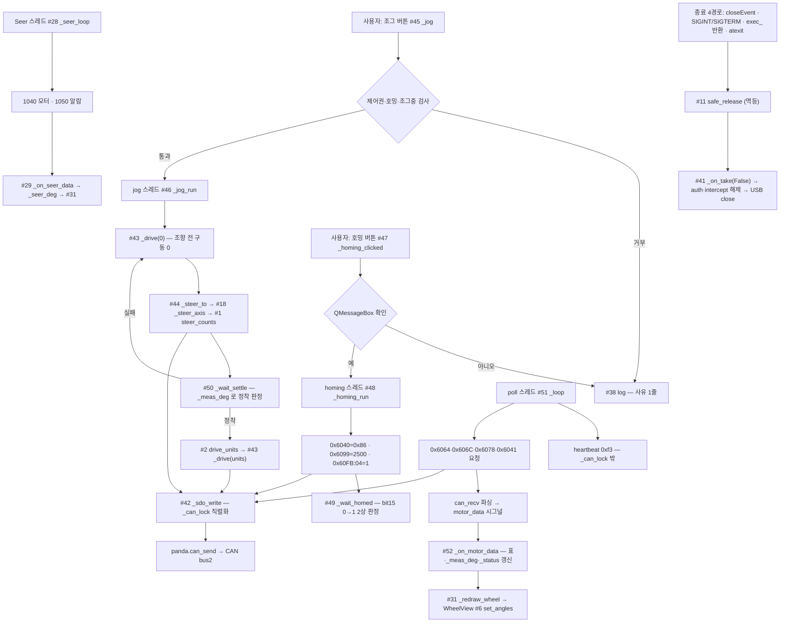

# amr_test_gui — 코드 리뷰 (날짜=버전)

## 2026-08-03 (KST) — `gui.py` 전체 구조 분석 (ROS2 이식 기준선)

### 코드 버전

비-git 대상이 아니라 git 미추적 파일이다 — 파일 내용 해시로 고정한다.

```
$ git ls-files Tools/amr_test_gui/gui.py | wc -l
1
$ git status --short Tools/amr_test_gui/gui.py
 M Tools/amr_test_gui/gui.py          # 워킹트리 미커밋 변경분 포함
```

| 파일 | md5(앞 8) | 줄수 |
| --- | --- | --- |
| `Tools/amr_test_gui/gui.py` | `7a043e4c` | 1,157 |

- 저장소 HEAD: `cc5e049`
- 직전 리뷰: **없음.** `docs/code_review/amr-test-gui/` 에는 `2026-07-27-flow.drawio` 만 있고
  날짜 문서가 없었다(2026-08-03 확인: `ls docs/code_review/amr-test-gui/` → drawio 1개).
  즉 본 문서가 이 대상의 **최초 인벤토리**이며, 따라서 delta 가 아니라 Core 5항목 전체를 작성한다.
- 작성 목적: **ROS2 동일 구현의 대조 기준선.** 「동일하다」를 판정하려면 원본의 함수·전역·흐름이
  표로 있어야 한다. 이식 설계는 `docs/adr/2026-08-03-amr-test-gui-ros2-port.md`.

### 분석 분기 명시

- 분기: 전체 구조 분석(단일 파일이지만 진입점·스레드가 여럿이라 전체 흐름도로 간다)
- 감지된 도메인: concurrency (`threading` 4종 · Qt 시그널) · embedded-review (CAN/SDO·USB 제어전송).
  ros2-review 는 **비적용** — 이 파일은 ROS2 를 쓰지 않는다(`grep -c "rclpy" gui.py` → 0).

---

## Core 인벤토리

### 1. 목적

Tongyi 4축 AMR(구동 2축 · 조향 2축)을 **판다 CAN 릴레이 경유로 직접 구동**하는 실기 시험용 PyQt5 GUI다.
ROS2 를 경유하지 않고 `panda` 라이브러리로 USB 를 직접 열어 safety_mode 30·intercept 를 잡고
SDO 를 만들어 보낸다(`gui.py:812-817`, `:840-849`).

세 가지를 한 화면에서 한다:

1. **연결·제어권** — 판다 열거(`scan`)·USB 개폐(`_on_usb`)·제어권 획득/반환(`_on_take`).
2. **구동** — 3×3 조그 패드(crab 8방향 + 정지), 축별 조향 슬라이더, 조향 원점 복귀(호밍).
3. **관측** — 판다 직독 모터 표 · Seer API 1040 비교 표 · Seer 알람(1050) 로그 · 바퀴 top-view.

「실기 전용」이 파일 docstring 의 선언이며(`gui.py:2`), 시뮬레이션·mock 경로가 **없다**
(`grep -niE "mock|simulat|dry.?run" gui.py` → 0건). 즉 하드웨어 없이는 어떤 경로도 시험할 수 없다.

### 2. 코드 플로우차트 (전체 — 다중 진입점 분리)

진입점이 넷이다: ① Qt 이벤트(버튼·슬라이더) ② 폴링 스레드 ③ Seer 폴링 스레드 ④ 종료 신호.
아래는 그 넷과 공통 자원(USB 핸들·CAN 버스)의 관계다.



노드 27 · 엣지 27. 동반 drawio: `2026-08-03-flow.drawio`(루트 정본·패키지 병기 양쪽, dangling 0 · 1:1 검증).

> 기존 `2026-07-27-flow.drawio` 는 남겨 둔다(그 시점 구조의 기록). 본 문서의 대조 대상은 `2026-08-03-flow.drawio` 다.

### 3. 함수 리스트 — 전수 (누락 0)

| # | 함수 | 입력 | 출력 | 기능 | 위치 |
| --- | --- | --- | --- | --- | --- |
| 1 | `steer_counts` | `node,deg` | `(적용각, counts)` | ±90° 클램프 후 절대위치 counts. **순수 함수** | gui.py:65-71 |
| 2 | `drive_units` | `mmps,raw_sign` | `int` | 구동 raw 환산 + ±4889 클램프. **순수 함수** | gui.py:74-77 |
| 3 | `_panda_class` | — | `Panda` 클래스 | 필드킷 동봉 panda 라이브러리 로드(`sys.path` 변형) | gui.py:100-105 |
| 4 | `_toggle` | `text,on_bg,on_border` | `QPushButton` | 켜짐을 색으로 드러내는 토글 버튼 생성 | gui.py:183-193 |
| 5 | `WheelView.__init__` | — | — | 최소 크기·초기 각 0 | gui.py:121-125 |
| 6 | `WheelView.set_angles` | `front_deg,rear_deg` | None | 각도 반영 후 `update()` | gui.py:127-129 |
| 7 | `WheelView._px` | `x_m,y_m,s` | `QPointF` | 차체좌표(+x 전방·+y 좌) → 화면좌표 | gui.py:131-133 |
| 8 | `WheelView.paintEvent` | `ev` | None | 차체·전방표시·바퀴 2개 렌더 | gui.py:135-160 |
| 9 | `WheelView._draw_wheel` | `p,ctr,deg,s,name` | None | 바퀴 사각형 + 각도 라벨 | gui.py:162-180 |
| 10 | `MainWindow.__init__` | — | — | 3열 레이아웃 구성 · 시그널 8종 연결 · Seer 스레드 기동 · `scan()` | gui.py:207-264 |
| 11 | `MainWindow.safe_release` | `reason` | None | **모든 종료 경로의 단일 해제 지점**(멱등 래치) | gui.py:266-301 |
| 12 | `MainWindow.closeEvent` | `ev` | None | 창 닫기 → `safe_release` | gui.py:303-306 |
| 13 | `MainWindow._build_connect` | — | `QGroupBox` | 판다 목록·검색·USB·제어권 토글 | gui.py:309-337 |
| 14 | `MainWindow._build_jog` | — | `QGroupBox` | 3×3 방향 패드 + 호밍 버튼. 미실측 방향은 `⚠` 표기 | gui.py:339-379 |
| 15 | `MainWindow._build_wheel_adj` | — | `QGroupBox` | 앞/뒤 조향 슬라이더(±90°, 자기 줄 통째) | gui.py:381-417 |
| 16 | `MainWindow._on_wheel_changed` | `node` | None | 드래그 중이면 미송신, 키보드·홈 클릭은 즉시 송신 | gui.py:419-429 |
| 17 | `MainWindow._send_steer` | `node` | None | 그 축에만 조향 지령 + 로그 | gui.py:431-438 |
| 18 | `MainWindow._steer_axis` | `node,deg` | `float` | 0x607A + 0x6040=0x3F 2프레임 | gui.py:440-445 |
| 19 | `MainWindow._build_settings` | — | `QGroupBox` | 바퀴 속도(0~200 mm/s)·정착 허용치(0.5~10°) | gui.py:447-477 |
| 20 | `MainWindow._motor_table` (staticmethod) | `rpm_header` | `QTableWidget` | 4행 4열 모터 표 생성(두 표가 공유) | gui.py:482-500 |
| 21 | `MainWindow._fill_row` (classmethod) | `table,node,values` | None | 노드 행에 각도·회전·전류 기입(None 은 `—`) | gui.py:502-510 |
| 22 | `MainWindow._build_motors` | — | `QGroupBox` | 판다 직독 모터 표 | gui.py:512-523 |
| 23 | `MainWindow.set_motor_values` | `node,deg,rpm,amp` | None | 모터 표 1행 갱신 | gui.py:525-527 |
| 24 | `MainWindow._build_status` | — | `QLabel` | 하단 Seer 접속 상태 바 | gui.py:529-534 |
| 25 | `MainWindow._on_seer_status` | `text,ok` | None | 상태 바 갱신. 끊기면 `_seer_deg` 비우고 재렌더 | gui.py:536-544 |
| 26 | `MainWindow._build_seer` | — | `QGroupBox` | Seer 1040 비교 표 | gui.py:546-557 |
| 27 | `MainWindow._fmt_alarm` (staticmethod) | `item` | `str` | 1050 항목 1줄 정규화(구조 미확정 방어) | gui.py:559-567 |
| 28 | `MainWindow._seer_loop` | — | None | **Seer 폴링 스레드** — 1040 매회 · 1050 4회마다. 신규 알람만 로그 | gui.py:569-622 |
| 29 | `MainWindow._on_seer_data` | `data` | None | Seer 표 갱신 + `_seer_deg` 반영 | gui.py:624-631 |
| 30 | `MainWindow._meas_angle` | `node` | `float\|None` | 제어권 있으면 판다 직독, 없으면 Seer, 없으면 None | gui.py:633-635 |
| 31 | `MainWindow._redraw_wheel` | — | None | 실측 우선 렌더. **슬라이더에 되쓰지 않는다** | gui.py:637-648 |
| 32 | `MainWindow._update_wheel_labels` | — | None | `목표°  (실측 …°)` 병기 | gui.py:650-656 |
| 33 | `MainWindow._build_wheel` | — | `QGroupBox` | `WheelView` 배치 | gui.py:658-663 |
| 34 | `MainWindow._build_log` | — | `QWidget` | GUI 로그 + Seer 알람 로그 + Fatal 리셋 버튼 | gui.py:665-695 |
| 35 | `MainWindow.seer_log` | `msg` | None | Seer 로그 창 append | gui.py:697-698 |
| 36 | `MainWindow._set_alarm_color` | `n_fatal,n_error` | None | 건수 표기 + 색(붉음/초록) | gui.py:700-714 |
| 37 | `MainWindow._on_clear_fatal` | — | None | Seer config 4300 (Fatal 만 클리어) — **쓰기 명령** | gui.py:716-740 |
| 37a | `_on_clear_fatal.work` (inner) | — | None | 4300 호출 스레드 본체 | gui.py:726-738 |
| 38 | `MainWindow.log` | `msg` | None | GUI 로그 창 + stdout | gui.py:743-746 |
| 39 | `MainWindow.scan` | — | None | 판다 열거(USB 미개방). 2대 이상이면 경고만 | gui.py:748-771 |
| 40 | `MainWindow._on_usb` | `on` | None | USB 개폐. 해제 시 제어권 먼저 반환 | gui.py:773-801 |
| 41 | `MainWindow._on_take` | `on` | None | 제어권 획득/반환(safety 30 → 속도 → auth 0xe9 → intercept 0xe8) | gui.py:803-837 |
| 42 | `MainWindow._sdo_write` | `node,idx,val,size,sub` | None | SDO expedited 쓰기. `_can_lock` 직렬화 | gui.py:840-849 |
| 43 | `MainWindow._drive` | `units` | None | 구동 2축 0x60FF. 0 이면 정지 | gui.py:851-854 |
| 44 | `MainWindow._steer_to` | `deg` | `float` | 조향 2축 동일각 지령 | gui.py:856-865 |
| 45 | `MainWindow._jog` | `label` | None | 조그 진입 게이트 + jog 스레드 기동. `정지` 는 즉시 처리 | gui.py:867-887 |
| 46 | `MainWindow._jog_run` | `label,steer_deg,raw_sign` | None | **jog 스레드** — 구동 0 → 조향 → 정착 → 구동 | gui.py:889-913 |
| 47 | `MainWindow._homing_clicked` | — | None | 확인 대화상자 후 homing 스레드 기동 | gui.py:920-944 |
| 48 | `MainWindow._homing_run` | — | None | **homing 스레드** — 0x6040=0x86 · 0x6099 · 0x60FB:04=1 | gui.py:946-967 |
| 49 | `MainWindow._wait_homed` | — | `(bool,str)` | bit15 0→1 **2상** 판정(개시 창 10 s · 완료 90 s) | gui.py:969-995 |
| 50 | `MainWindow._wait_settle` | `target,tol,timeout` | `bool` | 두 축 모두 허용치 안이어야 정착 | gui.py:997-1011 |
| 51 | `MainWindow._loop` | — | None | **poll 스레드** — heartbeat + 4객체 폴 + 응답 파싱 | gui.py:1014-1062 |
| 52 | `MainWindow._on_motor_data` | `data` | None | 표·`_meas_deg`·`_status` 갱신. 호밍 중 각도 미갱신 | gui.py:1064-1083 |
| 53 | `main` | — | `int` | 해제 4경로 배선 + 신호 pump 타이머 + 이벤트 루프 | gui.py:1090-1153 |
| 53a | `main._on_stop_signal` (inner) | `signum,frame` | None | SIGINT/SIGTERM → `app.quit()` (핸들러에서 USB 미조작) | gui.py:1124-1128 |
| 53b | `main._excepthook` (inner) | `exc_type,exc,tb` | None | 미처리 예외 → `safe_release` 후 기본 훅 | gui.py:1140-1144 |

**중복/유사 함수**: `#17 _send_steer`(1축) ↔ `#44 _steer_to`(2축)는 둘 다 `#18 _steer_axis` 를 부르는
얇은 래퍼로 **중복이 아니다**(축 개수가 다르다). `#38 log` ↔ `log_line` 시그널은 스레드 경계 때문에
둘 다 필요하다 — GUI 스레드는 `log`, 작업 스레드는 `log_line.emit`. → §평가 [품질] 참조.

### 4. 전역 변수 / 모듈 상수

**가변 전역 없음** — 모듈 레벨에 재대입되는 이름이 없다(모든 상태는 `MainWindow` 인스턴스 속성).

| # | 사용처(함수) | 기능 | 위치 |
| --- | --- | --- | --- |
| G1 | #41·#42·#51 | `SEER_BUS=0` · `MOTOR_BUS=2` (상수) — 판다 버스 번호 | gui.py:28 |
| G2 | #41 | `SEER_GATE=30` · `CAN_KBPS=250` (상수) — safety_mode·버스속도 | gui.py:29 |
| G3 | #1·#52 | `COUNTS_PER_DEG=57344` (상수) | gui.py:30 |
| G4 | #1·#52 | `STEER_HOME={3:7871815, 4:7840086}` (상수) — ⚠ **정본의 사본**. 정본은 `src/Comm/CAN/can_relay/config/machine/foil_a082.yaml` | gui.py:45 |
| G5 | #28·#37 | `SEER_IP="192.168.44.82"` (상수) | gui.py:46 |
| G6 | #28·#37 | `SEER_GUI="/home/nvidia/T-Robot_seer_gui"` (상수) — **절대경로 · 환경 의존** | gui.py:47 |
| G7 | #2 | `VEL_PER_MMPS=24.447` · `VEL_MAX_UNITS=4889` (상수) | gui.py:48 |
| G8 | #1 | `STEER_LIMIT_DEG=90.0` (상수) | gui.py:49 |
| G9 | #51 | `_ABORT` 8종 (상수) — SDO abort 사유 사전 | gui.py:52-61 |
| G10 | #45 | `JOG` 8방향 (상수) — (조향각, raw 부호, 직접실측 여부) | gui.py:85-94 |
| G11 | #3 | `_KIT` (상수) — 필드킷 경로. 파일 위치 기준 상대 산출 | gui.py:96-97 |
| G12 | #53 | `SIGNAL_PUMP_MS=50` (상수) — 신호 전달용 pump 주기 | gui.py:1087 |
| G13 | #7·#8·#9 | `WheelView.FRONT_X/REAR_X/WHEEL_R/BODY_L/BODY_W` (클래스 상수) — 시각화 전용 근사 | gui.py:117-119 |
| G14 | #20·#21 | `MainWindow.ROWS`·`CELL_FMT` (클래스 상수) | gui.py:479-480 |
| G15 | #48·#49 | `MainWindow.HOMING_SPEED=2500`·`HOMING_TIMEOUT_S=90`·`HOMING_START_S=10` (클래스 상수) | gui.py:916-918 |

**필요성 평가**: G1~G3·G7~G12 는 상수로 적절하다. **G4 는 사본이라 정본과 어긋날 수 있다**(§평가 Medium).
**G6 는 절대경로**라 다른 PC 에서 Seer 폴링이 통째로 죽는다(§평가 Medium).

### 5. 의존성 3-tier

| Tier | 대상 | 버전/제약 | 부재 시 동작(필수/선택) | 근거(파일:line) |
| --- | --- | --- | --- | --- |
| 빌드 | 없음(단일 스크립트, `python3` 즉시 실행) | — | — | `Tools/amr_test_gui/README.md` |
| 런타임 필수 | `PyQt5` | — | `ImportError` 로 기동 불가 | gui.py:17-24 |
| 런타임 필수 | comma.ai `panda` 라이브러리 | `Tools/docking_field_kit/panda` 동봉본 | `scan()` 이 "검색 실패" 로그 후 USB 버튼 비활성 — **기동은 된다** | gui.py:96-105, :754-760 |
| 런타임 필수 | 판다 하드웨어 + udev(0666) | VID/PID `bbaa:ddcc` | 열거 0건 → "판다 없음", 모든 구동 경로 차단 | gui.py:761-763 |
| 런타임 필수 | 판다 커스텀 펌웨어(safety_mode 30) | `ALLOW_DEBUG` 빌드 | mode 30 미등록 시 SILENT 폴백 → 릴레이 강제 off. **GUI 는 검출하지 못한다** | gui.py:812 |
| 런타임 선택 | Seer API(1040/1050/4300) via `T-Robot_seer_gui` | `RobokitClient`, IP 192.168.44.82 | 상태 바에 "연결 불가" 표시 후 Seer 표·알람 영구 비활성. **구동은 정상** | gui.py:569-579 |
| 런타임 선택 | 조향 실측(판다 폴링 또는 Seer) | — | 둘 다 없으면 바퀴 그림이 **슬라이더 목표값 미리보기**로 대체 | gui.py:644-647 |

---

## 평가

severity 분포: Critical 0 / High 3 / Medium 5 / Low 3 / Info 2
  (❌ 2026-08-04 정정: High 4 → 3 — 「호밍 취소 부재」 철회, 아래 참조)
Verdict: REQUEST CHANGES

> 본 문서는 이식 기준선 작성 세션이 썼으므로 `APPROVE` 를 찍을 수 없다(SOP 룰 11).
>
> ⚠ **2026-08-04 확인**: 원본 파일은 이 리뷰 이후 **변경되지 않았다**(md5 `7a043e4c` 동일, 1,157줄). 남은 High 3건은 **현재도 그대로 있다** — 어제 고친 것은 드라이버(`can_relay`)이지 이 파일이 아니다(`MultiThreadedExecutor`→`driver_node.py` · `_ctrl` 락→`link.py` · 워치독→`backend.py`). 원본을 고치지 않는 것은 의도된 결정이다(비교 기준선 — ADR 2026-08-04 §Decision ④).
> **아래 High 4건은 「ROS2 이식본이 반드시 다르게 만들어야 할 것」의 목록이기도 하다** — 이식 ADR 이 인용한다.

### High

**함수 #50·#46 — [논리] 정착 판정에 피드백 신선도 검사가 없다 (High)**
   재현: `_wait_settle`(gui.py:1007)은 `self._meas_deg.get(n)` 값만 보고 **언제 갱신된 값인지 보지 않는다.**
   `_meas_deg` 는 `_on_motor_data`(gui.py:1076)에서만 쓰이고, 폴링 스레드가 죽으면
   `_loop` 이 `self._run = False` 로 조용히 끝난다(gui.py:1058-1061).
   즉 **폴링이 멈춘 뒤에도 마지막 값이 목표와 일치하면 정착으로 판정**되어 `_jog_run` 이 구동에 들어간다
   (gui.py:897-906). 조향이 실제로 그 각도인지는 그 시점에 아무도 모른다.
   대조: `can_relay` 는 `NodeState.fresh(now, ttl)` 게이트를 `steer_angles_deg`·`halt_steer`·
   `_home_method35` 전부에 건다(debt-019 가 이 소실을 등록해 둔 항목이다).
   권고: `_meas_deg` 에 타임스탬프를 함께 저장하고 TTL(예 1.0 s) 밖이면 정착 아님으로 처리.

**함수 #51·#42 — [race] heartbeat(0xf3)만 `_can_lock` 밖이라 USB 핸들이 겹친다 (High)**
   재현: `_loop` 의 heartbeat 는 락 밖에서 `controlWrite` 한다(gui.py:1026). 같은 루프의 `can_send` 는
   락 안이고(gui.py:1027-1032), `_sdo_write` 도 락 안이다(gui.py:848-849).
   그런데 `_sdo_write` 를 부르는 것은 **jog·homing 스레드**다(gui.py:889·946) — 그 스레드가 락을 쥐고
   `can_send` 하는 동안 poll 스레드가 같은 핸들에 heartbeat 를 낼 수 있다.
   심박이 실패하면 펌웨어 fail-safe 가 걸려 **주행 중 정지**한다.
   ⚠ `can_relay` 의 동일 결함(2026-08-03 리뷰 H2)은 같은 날 수정됐다 —
   `PandaLink._ctrl()` 이 락을 잡도록 바꿨다(`docs/adr/2026-08-03-can-relay-node-concurrency.md`).
   **이 파일에는 그 수정이 반영되지 않았다.**
   권고: heartbeat 도 `_can_lock` 안으로. 이식본은 `can_relay` 의 `PandaLink` 를 그대로 쓰므로 자동 해소.

**함수 #43·#46 — [논리] 구동 지령이 단발 송신이고 워치독이 없다 (High)**
   재현: `_drive`(gui.py:851-854)는 `0x60FF` 를 **한 번** 보내고 끝난다. 재송신 루프도, 지령 만료도 없다
   (`grep -nE "0x60FF" gui.py` → `:854` 1곳). 프레임이 하나 유실되면 그대로 끝이고, 반대로 지령이
   들어간 뒤 GUI 가 응답을 잃어도 드라이브는 마지막 값을 물고 간다.
   정지 근간은 heartbeat 상실 → 펌웨어 fail-safe **하나뿐**이다(위 High 와 결합하면 그 하나도 흔들린다).
   2026-07-29 리뷰의 High(#53)와 같은 항목이며 **[잔존]** 이다.
   권고: 이식본은 `RelayBackend` 의 20 Hz 재송신 + `cmd_timeout_s` 워치독을 그대로 쓴다.

**함수 #47·#48 — [논리] 호밍 취소 수단 — ❌ 철회 (2026-08-04, High 아님)**

   ❌ **철회 사유**: 소유자 판단으로 **취소 기능을 쓰지 않기로 확정**됐다 —
   「실제 호밍이 필요해서 하는데 왜 취소를? 해서 얻는 이득이 뭔지?」(2026-08-04).
   호밍은 조향 0° 기준을 세우려고 **필요해서** 하는 동작이고, 중간에 끊으면 축이 어중간한 위치에
   남아 **어차피 다시 호밍해야 한다**. 소요도 10회 실측 35.0 s(편차 0.17 s)로 짧다(debt-034).
   ⇒ **원하지 않는 기능의 부재는 결함이 아니다.** 본 항목을 High 에서 뺀다
   (ADR `docs/adr/2026-08-04-amr-test-gui-swappable-backend.md` §Decision ②).
   ⚠ 아래 원문은 이력으로 남긴다 — 판정이 바뀐 경위를 지우지 않는다.

   ~~원 지적:~~
   재현: `_homing_clicked` 의 확인 대화상자가 스스로 적는다 — 「이 프로그램에는 취소 버튼이 없습니다 —
   중단하려면 하드웨어 E-STOP 을 쓰십시오」(gui.py:936-937). `_homing_run` 은 시작 3프레임을 보내고
   `_wait_homed` 로 최대 90 s 기다릴 뿐 취소 경로가 없다(gui.py:946-967).
   물리 스윙이 100°+ 이고 실측 소요가 약 35 s 다.
   ⚠ 취소 자체는 가능하다 — 펌웨어에 취소 프레임 생성기가 있다
   (`Tools/Can_Relay/panda-firmware/board/safety/safety_seer_gate.h:312-316`). GUI 가 안 쓸 뿐이다.
   권고: 이식본은 `~/home_cancel` 서비스를 노출하고 버튼을 만든다(can_relay 에 이미 있다).

### Medium

**전역 G4 — [품질] `STEER_HOME` 이 정본의 사본이라 어긋날 수 있다 (Medium)**
   재현: gui.py:45 가 `{3:7871815, 4:7840086}` 을 직접 들고, 같은 값이
   `src/Comm/CAN/can_relay/config/machine/foil_a082.yaml` 에도 있다. 주석이 「정본은 yaml, 여기는 사본」
   이라고 적고 있으나(gui.py:32-33) **동기화를 강제하는 장치는 없다.**
   실제로 2026-08-03 에 이 값이 `[7871810, 7839894]` → `[7871815, 7840086]` 로 정정된 이력이 주석에 남아 있다.
   권고: 이식본은 값을 갖지 않고 노드 파라미터(=yaml)를 읽는다. GUI 잔존 시에는 yaml 로드로 대체.

**전역 G6 — [품질] `SEER_GUI` 절대경로가 하드코딩돼 있다 (Medium)**
   재현: gui.py:47 `"/home/nvidia/T-Robot_seer_gui"`. 다른 계정·PC 에서는 `_seer_loop` 의 import 가 실패해
   Seer 표·알람이 통째로 죽는다(gui.py:571-579). `_KIT`(G11)은 파일 위치 기준 상대 산출인데 이것만 절대경로다.
   권고: 환경변수 또는 설정 파일. 이식본은 파라미터.

**함수 #39 — [논리] 판다 2대 이상이면 경고만 하고 그중 1대를 연다 (Medium)**
   재현: gui.py:767-770 이 「1 PC 1대 원칙 위반」을 로그로 남기지만 `btn_usb` 를 **활성화한다**(gui.py:771).
   어느 판다가 열릴지는 라이브러리 순서에 달렸다 — 즉 **어느 로봇에 지령이 갈지 모르는 상태로 진행 가능**하다.
   대조: `can_relay` 는 같은 상황에서 `LinkError` 로 거부한다(`link.py:356-359`).
   권고: 2대 이상이면 차단하거나 시리얼 선택을 요구한다.

**함수 #41 — [논리] 제어권 반환 시 정지 실패가 조용히 삼켜진다 (Medium)**
   재현: gui.py:824-827 의 `try: self._drive(0) except Exception: pass` — 로그 한 줄도 없다.
   정지 프레임이 못 나간 채 auth·intercept 가 내려가면 드라이브는 마지막 속도를 유지한 채
   Seer 로 넘어간다. 같은 파일의 다른 예외 경로는 전부 로그를 남긴다(gui.py:836-837 등).
   권고: 최소한 로그, 가능하면 반환 중단 후 사용자 확인.

**함수 #51 — [논리] 폴링 스레드가 죽어도 UI 는 "제어권 획득" 상태로 남는다 (Medium)**
   재현: `_loop` 이 예외로 끝나면 `self._run = False` 를 세우고 로그 1줄을 남긴 뒤 반환한다
   (gui.py:1058-1061). 그런데 `btn_take` 는 여전히 체크 상태이고 색도 앰버 그대로다.
   `_run=False` 때문에 이후 조그·조향은 「제어권을 먼저 획득하세요」로 거부되는데, 화면은 획득 상태를
   보여준다 — **표시와 동작이 반대**다.
   권고: 폴링 사망 시 `btn_take` 상태를 되돌리거나 별도 경보 표시.

### Low

**함수 #45·#46 — [논리] `_jog_stop` 확인과 구동 시작 사이에 경합 창이 있다 (Low)**
   재현: gui.py:902-906 — `if self._jog_stop: return` 직후 `self._drive(units)` 다. 그 사이에 정지 버튼이
   눌리면 정지가 먼저 나가고 구동이 뒤에 나간다. 창이 좁지만 0 은 아니다.
   권고: 락 안에서 확인·송신을 묶거나, 정지 후 재확인 1회.

**함수 #42 — [논리] `self.panda` None 검사 없이 `can_send` 한다 (Low)**
   재현: gui.py:849. USB 해제(`_on_usb(False)`)가 `self.panda = None` 으로 만드는데(gui.py:799),
   jog·homing 스레드는 그 뒤에도 살아 있을 수 있다. 결과는 `AttributeError` 이고 상위 `except` 가
   "조그 중단"으로 로그한다 — 죽지는 않으나 사유가 부정확하다.
   권고: 진입부 가드 + 명시적 사유.

**함수 #38 · `log_line` — [품질] 로그 경로가 둘이라 호출부가 매번 고른다 (Low)**
   재현: GUI 스레드는 `self.log`(gui.py:743), 작업 스레드는 `self.log_line.emit`(gui.py:896 등).
   Qt 제약상 둘 다 필요하지만 선택은 호출자 몫이라 잘못 고르면 스레드 위반이 된다.
   권고: 항상 시그널로 보내고 `log` 는 슬롯 전용으로 좁힌다(호출부가 고를 일이 없어진다).

### Info

**전역 전체 — [품질] 가변 전역 0 (Info)**
   근거: 모듈 레벨 재대입 없음. 상태는 전부 `MainWindow` 인스턴스 속성이라 이식 시 노드 멤버로 1:1 대응된다.

**함수 #28·#37a·#46·#48·#51 — [race] 스레드 5종이 도는데 동기화 지점은 `_can_lock` 하나다 (Info)**
   근거: `seer`(gui.py:262) · `clearfatal`(gui.py:740) · `jog`(gui.py:885) · `homing`(gui.py:944) ·
   `poll`(gui.py:819). 공유 상태(`_meas_deg`·`_status`·`_seer_deg`·`_jog_stop`)는 dict/bool 원자 연산에
   의존한다 — CPython 에서 깨지지는 않으나 **불변식이 문서화돼 있지 않다.**
   이식본은 노드 1개 + `RelayBackend` 스레드 1개로 줄어 이 항목 자체가 소멸한다.

---

## 검증 (실행 명령과 출력 원문)

```
$ grep -c "^\s*def " Tools/amr_test_gui/gui.py
56                     # 표 53행 + inner 3(#37a·#53a·#53b) = 56 — 누락 0

$ grep -c "rclpy" Tools/amr_test_gui/gui.py
0                      # ros2-review 도메인 비적용 근거

$ grep -n "0x60FF" Tools/amr_test_gui/gui.py
75:    """구동 속도 지령 raw(0x60FF) 환산 + 상한 클램프."""
852:        """구동 노드에 속도 지령(0x60FF). units=0 이면 정지."""
854:            self._sdo_write(n, 0x60FF, units, 4)
1019:        ⚠ 읽기만 한다. 0x60FF(속도지령)·0x607A(위치지령)는 보내지 않는다.
                       # 4건 중 **실제 송신은 :854 한 곳**, 나머지 3건은 docstring (High 근거)

$ md5sum Tools/amr_test_gui/gui.py | cut -c1-8
7a043e4c

$ git ls-files Tools/amr_test_gui/gui.py | wc -l
1                      # 추적됨(워킹트리 미커밋 변경분 포함)
```

**하지 않은 것**: GUI 기동 0 · 장치 접속 0 · 실모터 구동 0. 본 문서는 **정적 분석**이며,
어떤 문장도 실행 시 거동을 확정하지 않는다. High 4건은 전부 코드 경로로만 성립을 보였다.

## 후속 TODO

① High 4건 중 **#50·#51·#43 은 이식본에서 구조적으로 해소**된다(can_relay 재사용) — GUI 원본을 계속
   쓸지 여부는 사용자 결정. 원본 존치 시 개별 수정이 필요하다.
② G4 사본 동기화 — 이식 완료 후 GUI 원본을 폐기하면 소멸, 존치하면 yaml 로드로 전환.
③ 본 문서는 이식 ADR(`docs/adr/2026-08-03-amr-test-gui-ros2-port.md`)의 §대조표 기준선이다.

---

---

## 조치 (2026-08-04) — 원본 결함 11건 전부 수정

사용자 지시: 「**먼저 원본을 고치고 나서 ros2 backend 연결하는 것이 정석**」.
그에 따라 §Decision ④(원본 동결)를 뒤집고 원본을 먼저 고쳤다 — 결함 있는 코드를 비교
기준선으로 삼는 것이 애초에 잘못이었다.

| 항목 | 조치 | 회귀 | 변이 주입 |
| --- | --- | --- | --- |
| High ① 정착 판정 신선도 부재 | `_set_meas` 단일 기록지점 + `MEAS_TTL_S`(1.0 s) | `test_settle_freshness.py` 5건 | TTL 제거 시 **3건 실패** |
| High ② `heartbeat` 가 `_can_lock` 밖 | 락 안으로 이동 | `test_usb_serialization.py` 2건 | 락 밖으로 되돌리면 **동시 전송 2건 관측** |
| High ③ 구동 단발 송신·워치독 부재 | 폴 루프가 매 주기 재송신(0 포함) + **응답 끊김** 워치독(`RX_TTL_S`) | `test_drive_resend.py` 4건 | 블록 제거 시 **3건 실패** |
| Medium ① `STEER_HOME` 사본 | **정본 YAML 을 런타임 로드**, 실패 시 사본 + 출처를 로그에 명시 | `test_medium_fixes.py` 3건 | — |
| Medium ② `SEER_GUI` 절대경로 | `SEER_GUI_PATH` 환경변수로 덮기 | 1건 | — |
| Medium ③ 판다 2대 이상 진행 가능 | **차단**(USB 버튼 비활성) | 2건 | — |
| Medium ④ 반환 시 정지 실패 무고지 | 로그 + E-STOP 확인 안내 | 1건 | — |
| Medium ⑤ 폴링 사망 시 표시 불일치 | `poll_died` 시그널 → 제어권 토글 내림 | 1건 | — |
| Low ① 정지↔구동 경합 창 | `RLock` + 확인·송신을 **한 임계구역**에 | 1건 | — |
| Low ② `panda is None` 미검사 | 진입부 가드(사유 명확화) | 1건 | — |
| Low ③ 로그 경로 이원화 | `log()` 는 항상 시그널, 위젯 접근은 `_append_log` 하나 | 2건 | — |

**워치독 설계 주의** — 「지령 만료」 방식(상류가 주기 발행하지 않으면 정지)을 쓰지 **않았다.**
이 GUI 는 지령원이 사람이라 조그가 스스로 꺼진다. 대신 **드라이브 응답이 끊기면** 0 으로 간다.
회귀 `test_watchdog_does_not_expire_a_live_command` 가 그 구분을 고정한다.

**검증**: 원본 시험 **88 → 111 passed**(신규 23건). `can_relay` **342 passed** 무회귀.
`colcon build` 통과. 양쪽 백엔드 오프스크린 기동·SIGTERM 정상.
**실기 검증 0** — 실기 비교는 사용자 수행 예정.

⚠ 남은 것: `backend_direct` 에 같은 수정을 반영했다. 두 벌 유지의 위험은 debt-039 그대로다.
