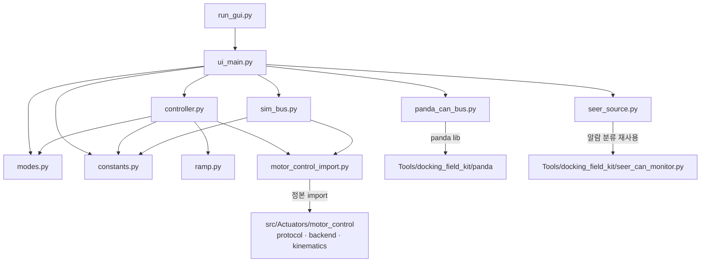

# amr_test_gui 구조 — 함수표·전역변수표·의존 그래프 (2026-07-27)

> ## ⚠ 2026-07-28 — 본 구조 분석의 **대상 코드는 전부 삭제됐다**
>
> 여기서 그린 파일 의존 그래프·클래스·시퀀스는 구 `amr_test_gui/` 패키지(11 모듈)의 것이며,
> 그 코드는 2026-07-28 에 폐기되고 단일 파일 `Tools/amr_test_gui/gui.py` 로 대체됐다
> — **docs/adr/2026-07-28-old-gui-removal.md**. 본 문서는 그 시점의 기록으로 남기며 수정하지 않는다.
> **신 GUI 의 구조 분석은 아직 없다**(작성 필요). 구 코드 실물은 커밋 `fdc1c51`(`Tool/amr_test_gui/`).

> coding SOP §6 후속갱신 산출물(상태-미러형 — 덮어쓰기). **루트 정본** + 패키지 병기 이중 기록.
> 병기본: `Tools/amr_test_gui/docs/sw_structure/amr-test-gui/2026-07-27.md`
> 범위 한정: 본 문서는 **coding §6 이 요구하는 함수표·변수표·의존 그래프**다.
> `sw_structure` SOP 의 전체 산출물(클래스·시퀀스·파일그래프 `.drawio` 3종)은 SW-구조 분석 요청이
> 아니었으므로 작성하지 않았다 — 필요 시 별도 요청으로 생성한다.

관련: ADR [2026-07-27-amr-test-gui](../../adr/2026-07-27-amr-test-gui.md) · 부채 `debt-004/005/006`

## 1. 파일 의존 그래프

**단방향 규칙**: UI → controller → ramp/정본. 역방향 import 없음. `ramp.py`·`modes.py`·`constants.py`
는 Qt·CAN·시간원 무의존(순수) — 실차 없이 단위 테스트 가능.

## 2. 함수표

### `ramp.py` — 조향 단계 램프 (순수 상태기계)

| 함수 | 시그니처 | 역할 | 부작용 |
| --- | --- | --- | --- |
| `SteerRamp.__init__` | `(*, step_deg=30, settle_tol_deg=3, step_timeout_s=4, limit_deg=90, start_deg=0)` | 램프 구성. 잘못된 파라미터는 `ValueError` | 없음 |
| `SteerRamp._clamp` | `(deg) -> float` | ±`limit_deg` 하드 클램프 | 없음 |
| `SteerRamp.set_target` | `(deg) -> float` | 목표각 설정(클램프). FAULT 중 무시 | `_target` |
| `SteerRamp.reset` | `() -> None` | FAULT 래치 해제 + 목표를 현 지령으로 되돌림 | `_state,_target,_deadline` |
| `SteerRamp.freeze` | `(now) -> RampOutput` | **E-STOP 등 액추에이터가 지령을 따를 수 없는 구간에서 램프 동결**(ramp.py:85-99). 기한 시계를 정지시켜 정상 E-STOP 조작이 spurious 추종실패 FAULT 를 남기지 않게 한다(리뷰 #M3). `drive_allowed=False` 고정 | `_deadline,_last_now` |
| `SteerRamp.tick` | `(measured_deg\|None, now) -> RampOutput` | 1주기 진행: 정착 판정 → 단계 전진 / 기한 초과 시 FAULT | `_cmd,_state,_deadline` |
| `SteerRamp._fault` | `(reason) -> RampOutput` | FAULT 래치 + 지령·목표 0(즉시 home) | `_cmd,_target,_state` |
| 속성 | `state · commanded_deg · target_deg · detail` | 조회 전용 | 없음 |

### `controller.py` — backend 수명주기 + 램프 조정 (Qt 무의존)

| 함수 | 시그니처 | 역할 | 부작용 |
| --- | --- | --- | --- |
| `AmrTestController.__init__` | `(*, logger=print)` | 램프·상태 초기화 | 없음 |
| `.connect` | `(bus_factory, *, allow_homing_motion=False)` | 버스 생성 → backend 항등 구성 → `start()`. **실패 시 버스 release 보장** | 버스 take, CAN init 송신 |
| `.disconnect` | `() -> None` | E-stop → `backend.shutdown()`(release·close 포함). 중복 무해 | 버스 release |
| `.connected` | `-> bool` | 연결 여부 | 없음 |
| `.set_mode` | `(key) -> None` | 모드 전환 + 그 모드의 조향 목표를 램프에 설정 | `_mode`, ramp 목표 |
| `.set_speed_mmps` | `(mmps) -> None` | 속도 상한(음수는 0 으로) | `_speed_mmps` |
| `.set_steer_slider_deg` | `(deg, node=None) -> None` | 슬라이더값 보관. `조향만` 모드에서만 램프 목표 반영. `node=None` 이면 양 조향축 동일 적용, 지정하면 그 축만(전륜/후륜 개별) — controller.py:171-183 | ramp 목표 |
| `.capture_home` | `() -> dict` | **조향 홈 기준을 현재 실측 위치로 덮어쓴다**(controller.py:190-224). ⚠ 운전자가 바퀴가 **물리적으로 직진**임을 확인한 뒤에만 호출. 이후 모든 조향 지령의 기준이 되므로 틀리면 통째로 어긋난다. 낡은 피드백(`FEEDBACK_STALE_S` 초과)이면 거부. **`ui_main.py` 에 호출부 없음**(GUI 미노출) | `steer_home`, `home_source`, backend `m.steer_home`, ramp 목표 0 |
| `.estop` | `(engage) -> None` | backend E-stop 래치 위임 + 모드 STOP | CAN(속도 0) |
| `.home` | `() -> None` | `set_mode("home")` | 상동 |
| `.reset_fault` | `() -> None` | 램프 FAULT 해제 + 모드 STOP | ramp 상태 |
| `.tick` | `() -> dict` | snapshot → 램프 진행 → `ModuleCommand[]` 송신 → 상태 dict | CAN 지령 갱신 |
| `._axis_measurement` | `(steer_node, nodes) -> float\|None` | 축별 램프 입력 실측각 — **그 축 자신의** 0x6064 만 본다(controller.py:291-309). `pos is None` 이거나 `last_seen` 이 `FEEDBACK_STALE_S` 초과면 `None` | 없음 |
| ~~`._ramp_measurement`~~ | ~~`(nodes) -> float\|None`~~ | ⚠ **무효(2026-07-27 개정)** — 아래 주석 참조 | — |
| `._status` | `(snap, out, units) -> dict` | UI 표시용 상태 조립 | 없음 |

> ⚠ 정정(2026-07-27 감사 — 반증됨): 종전 행 `._ramp_measurement`(조향 노드 중 **지령에서 가장 벗어난**
> 값 = 양축 최악편차 단일 스칼라, 하나라도 결측이면 `None`)는 **현재 코드에 존재하지 않는다**.
> 램프가 축별 독립 인스턴스로 바뀌었고(`controller.py:46-47`
> `self.ramps = {n: SteerRamp(...) for n in STEER_NODES}`), 입력도 축별
> `_axis_measurement()` 로 대체됐다(`controller.py:291-292` "축별 램프 입력 실측각 — **그 축 자신의**
> 0x6064 만 본다").
> **따라서 종전 서술에서 읽히던 안전 속성 — "한 축이 뒤처지면 조향 전진이 전부 멈춘다" — 은 더 이상
> 성립하지 않는다.** `test/test_controller.py:237-241` 이 "축별 램프로 바뀌면서 '정상 축이 먼저
> 진행'하는 것은 정상이다"라고 명시한다.
> 남는 불변식은 **구동 게이트**뿐이다: 양 축이 **모두** 정착해야 구동 raw 가 나간다
> (`controller.py:277-278` `drive_allowed = all(o.drive_allowed for o in outs.values())`).
> 즉 '한 축 지연 시 중단'은 **조향**이 아니라 **구동**에만 적용된다.

### `modes.py` / `constants.py` — 인용 테이블

| 심볼 | 종류 | 내용 |
| --- | --- | --- |
| `DriveMode` | dataclass | `key·label·steer_deg·raw_sign·basis·verified` |
| `STOP·FORWARD·BACKWARD·CRAB_LEFT·CRAB_RIGHT·STEER_ONLY·HOME` | 상수 | 모드 정의(각각 부호 근거 `basis` 보유) |
| `mmps_to_units` / `units_to_mps` | 함수 | mm/s ↔ raw units(0.1 rpm), `VEL_MAX_UNITS` 포화 |
| `counts_to_deg` | 함수 | 조향 0x6064 절대 counts → 홈 기준 각도 |

### `panda_can_bus.py` / `sim_bus.py` — python-can 호환 버스 (동일 표면)

| 함수 | PandaCanBus | SimBus |
| --- | --- | --- |
| `PandaLink.__init__` | **USB 연결만** 담당 — 제어권은 절대 건드리지 않는다(panda_can_bus.py:58-68). `Panda.__init__` 은 `connect()`+`get_mcu_type()` 만 하고 safety mode 를 바꾸지 않으므로 릴레이·모터 무영향 | — |
| `__init__` | ⚠ **정정(2026-07-27 감사 — 반증됨)**: 종전 서술 "판다 open + `_take()`"는 두 동작이 한 몸이라는 뜻으로 읽혔으나, 현재는 **분리**돼 있다. `PandaCanBus.__init__` 은 `link` 를 받아 재사용하며 USB 핸들을 소유하지 않을 수 있다(`_owns_usb`, panda_can_bus.py:124-136·:218-226). 제어권 취득(`_take()`: safety 30·CAN0/2 enable·auth=PC·intercept)+heartbeat 스레드는 **별도 단계**다 | 노드 상태 초기화 |
| `send(msg)` | SDO → CAN2. **RTR 은 skip**(판다 송신 불가, debt-006) | SDO 해석 → 응답 큐잉 |
| `recv(timeout)` | CAN2 프레임만 반환 | 큐에서 pop |
| `shutdown()` | release(auth=Seer·passthrough·safety 0) + close | 로그만 |
| `_heartbeat` | 0.4 s 주기 0xf3 | — |
| `_integrate` | — | 조향 수렴·구동 적분(모사) |
| `set_stuck` | — | 노드 고착 주입(FAULT 경로 재현) |

### `ui_main.py` — PyQt5 (주요 함수만)

| 함수 | 역할 | 스레드 |
| --- | --- | --- |
| `MainWindow._build*` | 상단바/제어/상태/하단 레이아웃 구성 | GUI |
| `._on_estop` | E-STOP 토글 → `controller.estop()` | GUI |
| `._on_usb_connect` / `._on_usb_disconnect` | **1단계 — USB 연결만**(`btn_usb_on`, ui_main.py:125-135). 펌웨어·safety_mode·CAN 상태만 읽는다. 제어권 미취득 | GUI |
| `._on_connect` / `ConnectWorker.run` | **2단계 — 제어권 획득(take)**(`btn_connect`, ui_main.py:141-146). 브링업을 **워커 스레드**에서 수행(E-STOP 응답성 유지). ⚠ **1단계→2단계 순서가 강제된다**: `btn_connect` 는 USB 연결 전 비활성(ui_main.py:143)이고, 순서를 어긴 직접 호출도 거부된다 | 워커 |
| `._on_thread_finished` | 워커 정리. GUI 블로킹 없음 | GUI |
| `._on_tick` | `CMD_HZ`(20 Hz) 주기 tick + 화면 갱신 | GUI |
| `._log` / `._append_log` | **어느 스레드에서든 안전** — `log_line` 시그널 경유(직접 위젯 접근 시 코어 덤프) | any → GUI |
| `.safe_release` | **해제 사슬 정본**(2026-07-28 신설, ui_main.py:783) — 워커 대기 → E-STOP → `controller.disconnect()` → `seer.stop()` → `block_seer_homing(False)` → `link.close()`(USB 해제). `_released` 래치로 **멱등**, 각 단계 예외를 삼켜 뒷 단계까지 반드시 도달 | 호출자 스레드 |
| `.closeEvent` | 창 닫기 경로. `safe_release("창 닫기")` 위임만 | GUI |
| `run()` | **종료 4경로 배선**(2026-07-28) — 창 닫기 / SIGINT·SIGTERM(`app.quit()` 만) / 이벤트 루프 반환 직후 / `atexit`+`sys.excepthook`. 전부 `safe_release` 로 수렴 | 메인 |

> **종료 경로 해제는 안전 요구사항**이다(2026-07-28 사용자 지시: "코드가 종료되면 자동으로
> 해제권 넘어가고 usb도 연결해제"). 종전에는 `closeEvent` 만 있어 **정상 창 닫기 외의 종료
> (Ctrl+C·`kill`·미처리 예외)에서 릴레이가 intercept, USB 가 열린 채 남았다**. 4경로 배선과
> 멱등성은 `test/test_safe_release.py`(21건)로 고정돼 있다.
>
> 정지 신호 핸들러는 `app.quit()` 만 한다 — 핸들러 안에서 `libusb` 제어전송·`sleep` 을 하면
> 재진입 위험이 있어(`domains/concurrency-coding.md` §1) 실제 해제는 이벤트 루프를 빠져나온
> 정상 스택에서 수행한다.
>
> ⚠ **신호 해제는 `MainWindow._timer` 에 의존한다.** Qt 의 C++ 이벤트 루프 중에는 파이썬
> 바이트코드가 실행되지 않아 신호 핸들러가 전달되지 않는다. `_timer`(`CMD_HZ`)가 파이썬
> 슬롯을 계속 돌려 인터프리터가 제어를 되찾는 덕분에 동작한다 — 2026-07-28 실측(PyQt5,
> offscreen, 하드웨어 무관):
>
> | 조건 | SIGTERM 결과 |
> | --- | --- |
> | 타이머 있음(현행) | 0.036 s 내 핸들러 실행 → 해제 → exit 0 |
> | 타이머 없음 | **핸들러 미실행 · 프로세스 매달림 → SIGKILL(exit 137)** |
>
> `_timer` 를 조건부 기동으로 바꾸면 **연결 전 Ctrl+C 가 먹지 않는다.** `__init__` 무조건
> start 를 유지하거나, 바꿀 때 별도 keep-alive 타이머를 함께 도입할 것.

> **연결 2단계 분리는 안전 요구사항**이며 테스트로 고정돼 있다 —
> `test/test_safety_regressions.py:187-206` `test_control_takeover_requires_usb_connection_first`
> ("USB 연결과 제어권 획득은 분리되어야 하고, **순서가 강제되어야 한다**").
> 종전 문서는 이 단계를 적지 않아 "연결 버튼 하나 = 즉시 릴레이 탈취"로 오해될 수 있었다.

## 3. 전역변수·모듈 상수표

| 심볼 | 파일 | 값·근거 | 변경 주체 |
| --- | --- | --- | --- |
| `STEER_LIMIT_DEG` | ramp.py | 90.0 — 실측 검증 범위(홈↔90° = 5,160,960 counts) | 상수 |
| `IDLE/RAMPING/SETTLED/FAULT` | ramp.py | 상태 문자열 | 상수 |
| `M_S_PER_UNIT` | constants.py | 4.0906e-5 ← driver_node.py | 상수(테스트로 대조) |
| `COUNTS_PER_DEG` | constants.py | 57344.0 ← protocol 실측 | 상동 |
| `COUNTS_PER_M` | constants.py | 2670177.0 ← driver_node.py | 상동 |
| `STEER_HOME_COUNTS` | constants.py | {3: 7871815, 4: 7840086} ← tongyi_amr.yaml — ⚠ **미판정 모순**(아래 참조). ~~(전원 사이클 불변)~~ | 상동 |
| `VEL_PER_MMPS` / `VEL_MAX_UNITS` | constants.py | 24.447 / 4889 ← docking_drive.py | 상동 |
| `DEFAULT_SPEED_MMPS` / `MAX_SPEED_MMPS` | constants.py | 50 / `VEL_MAX_UNITS÷VEL_PER_MMPS` (≈200) | 정책값 |
| `RAMP_STEP_DEG` / `RAMP_STEP_TIMEOUT_S` | constants.py | 30.0 / 4.0 | 정책값 |
| `CMD_HZ` | constants.py | 20.0 — backend 워치독 0.2 s 대비 4배 여유 | 정책값 |
| `MOTOR_BUS·SEER_BUS·SEER_GATE·HEARTBEAT_S` | panda_can_bus.py | 2·0·30·0.4 ← relay 실측 프로토콜 | 상수 |
| `MOTOR_CONTROL_PATH` | motor_control_import.py | env `MOTOR_CONTROL_PATH` 또는 레포 상대경로 | 환경변수 |
| `ROLE` | controller.py | 노드↔역할 표시명 | 상수 |

### ⚠ 미판정 모순 — `STEER_HOME_COUNTS` "전원 사이클 불변" (2026-07-27 감사, 미해소)

두 기록이 정면으로 충돌한다. **본 감사로는 어느 쪽이 참인지 판정할 수 없다.**
따라서 어느 쪽으로도 고치지 않고, 값·상수도 그대로 둔다(위 표의 숫자 변경 없음).

| 쪽 | 근거 | 주장 |
| --- | --- | --- |
| ① 불변이다 | `docs/ros2_driver/2026-07-09-design-inputs.md:56` "**홈 상수는 전원 사이클 불변**(07-07/07-08 두 전원 세션 일치)" · 같은 문서 `:81` "✓ 해소(2026-07-09) … 홈 상수(7.87M/7.84M)는 전원 사이클 불변 절대 목표(steerOffset 137.3°)" | ~~config 홈은 절대 기준이며 매 기동 시 137.3° 스윙으로 도달한다~~ → ⚠ **2026-07-27 실기 반증** (아래 정정 블록) |
| ② 반증됐다 | `Tools/amr_test_gui/amr_test_gui/controller.py:60-64` "config 는 '전원 사이클 불변'이라고 적혀 있으나 2026-07-27 실측으로 **반증**됐다: 전원 재인가 후 조향 0x6064 가 ≈0 으로 리셋됐는데 바퀴는 물리적으로 직진이었다(Seer 1040 position≈0·calib=True·육안 0° 3중 확인). 이 상태에서 상수 홈을 쓰면 0° 지령이 7.87M counts = **137° 스윙**이 된다" | config 홈은 물리 직진과 일치하지 않을 수 있다 |

- 참고: ①쪽 문서 스스로 `design-inputs.md:82` 에서 "0 기준점이 **절대 엔코더 기준인지 미확인** —
  2회 전원 사이클 관측뿐"이라고 적어, 근거가 2회 관측임을 인정한다.
- ~~②가 지적한 137° 는 `docs/claude-mistake/2026-07-27-002_node4-unverified-command-damage.md:18-23`
  의 node4 물리 갇힘 사고와 **같은 값**이다.~~

> #### ⚠ 정정 (2026-07-27 실기 검증 — 이 블록이 정본이다)
>
> 근거: `Log/homing_capture_220350.jsonl`(Seer 주도 호밍, 수동청취 253,510 프레임) ·
> `Log/homing_run_*.jsonl`(판다 펌웨어 주도 호밍 2회) · 드라이브 파라미터 직접 판독 ·
> [Handbook V7.0 §6.9, page 171] · [같은 문서 §4.6, page 122].
>
> **(1) 137° 스윙은 이상거동이 아니다 — 설계된 호밍 복귀 이동이다.**
> 조향축에 **리밋 스위치가 실재**하며 방식은 **Home 1**(음(−)의 리밋 트리거) — 전 노드
> `0x6098 = 1` 실기 판독으로 확정(Handbook 기본 RstMode 도 1). 호밍은 「원점(−리밋) 경유 →
> 조향 0°(물리 직진) 복귀」까지이고, 그 복귀 목표가 **node3 7,882,020 / node4 7,859,062 counts
> (= +137.45° / +137.05°, 57344 counts/°)** 다. EasyDRIVE `steerOffset` 138.000 / 137.250 과 대응.
> 「원인 미상」·「이상 스윙」·「Home 36/37 기계 하드스톱」류 서술은 **전부 오류**다.
>
> **(2) ① 「전원 사이클 불변인 단일 홈 상수」는 반증됐다.** 같은 캡처에서 Seer 의 조향 `0x607A`
> 목표는 **한 전원 사이클 안에서** 호밍 전 7,871,815 / 7,840,086 → 호밍 후 7,882,020 / 7,859,062
> 로 전환된다(전환 t≈49.14). 차이 +10,205 / +18,976 counts = **+0.178° / +0.331°**.
>
> **(3) 「137.3°」 단일값 표기 금지 — 두 축이 다르다.** 호밍 복귀 목표 기준 node3 **+137.45°** /
> node4 **+137.05°**, config `STEER_HOME_COUNTS` 기준 node3 **+137.27°** / node4 **+136.72°**
> (7,871,815 ÷ 57344 · 7,840,086 ÷ 57344). 어느 조합으로도 137.3° 는 나오지 않는다
> (`docs/verified_facts/2026-07-27.md:215-218` 도 동일 결론).
>
> **(4) 사고 기록의 「137°」와 「같은 값」이라 단정하지 말 것 — 기준계가 다르다.**
> 본 문서의 137° 대는 **호밍 원점(−리밋) 기준, 직진 자세까지의 기구 오프셋**이다. 반면
> `docs/claude-mistake/2026-07-27-002_node4-unverified-command-damage.md:17-18` 의 137° 는
> **직진 기준 이탈각**("정상 ±90° 범위 밖")으로 서술돼 있다. 수치가 근접하므로 「0 counts 부근
> 지령 = 호밍 원점 자세로의 이동」 가설이 성립할 수 있으나 **인과는 미확인**이다(사고 당시
> `0x607A` 로그 미회수; `docs/verified_facts/2026-07-27.md:269,283` 도 「인과는 확인되지 않았다」로
> 유보). → **안전 직결이되, '같은 값'으로 단정하지 말 것.**
>
> **(5) ② 의 관측도 그대로 확정하지 말 것.** 호밍 **진행 중**에는 조향 `0x6064` 가 0 을 반환한다
> (`Log/homing_capture_220350.jsonl` t=18.15~49.07;
> `src/Actuators/motor_control/motor_control/backend.py:264-272`). 따라서 "전원 재인가 후 ≈0" 관측은
> 판독 시각이 호밍 구간(`0x6041` bit15 = 0)이었을 가능성이 배제되지 않았다 —
> 아래 「판정에 필요한 측정」에 **판독 시각의 호밍 구간 여부 확인**을 추가한다.

> **판정 전까지의 취급 규칙**: 상수 홈을 "물리 직진"의 진실로 **쓰지 말 것**.
> 조향 지령 전 반드시 원시 0x6064 와 바퀴 물리각을 육안 대조한다(README 검증 계단 ②-0).

**판정에 필요한 측정** (`design-inputs.md:82` 가 이미 지정한 절차):
조향을 **임의 자세**(예: +45°)로 둔 뒤 전원을 재인가하고, `0x6064` 값과 바퀴 **물리각**
(육안 + Seer 1040 `position`/`calib`)을 **동시에** 기록한다. **2회 이상 반복**한다.
- 자세와 무관하게 0x6064 가 홈 상수 부근으로 복원되면 → ① 성립(절대 엔코더).
- 자세와 무관하게 ≈0 으로 리셋되면 → ② 성립(상대/재기준화). 이 경우 `capture_home()` 필수.

**가변 전역 없음** — 모든 런타임 상태는 `SteerRamp`·`AmrTestController`·버스 인스턴스에 캡슐화되어 있다.
공유 상태 중 `_mode` / `_estop` / `_speed_mmps` / `backend` / `bus` 는 `threading.Lock`(`_lock`) 로
보호된다.

> ⚠ 정정(2026-07-27 감사 — 반증됨): 종전 서술 "공유 상태는 `threading.Lock`(`_lock`) 로 보호된다"는
> **전칭으로는 성립하지 않는다**. `ramps` 는 락이 아니라 **초기화 순서**로 경합을 회피한다 —
> 브링업은 워커 스레드에서 실행되고(`ui_main.py:436-445` `ConnectWorker` + `thread.start()`),
> 그 안의 `controller.py:112-113` `for r in self.ramps.values(): r.reset()` 은 **락 밖**이며,
> 같은 시간 GUI 타이머(`ui_main.py:93-95` `QTimer … _on_tick`)가 `controller.tick()` →
> `controller.py:400-402` 에서 `self.ramps[...].commanded_deg / target_deg` 를 읽는다.
> 코드 자신도 `controller.py:110-111` 에서 이를 락이 아닌 순서로 막았다고 적는다
> ("램프는 backend 공표 **이전**에 초기화한다 … 공표 후에는 … 워커 스레드의 reset() 과 겹치는
> 창이 열린다(리뷰 #M6)"). 즉 **락 보호가 아니다**.

## 4. 구조 관찰

- **정본 재사용 비율**: 프로토콜 인코딩·SDO 폴링·안전게이트(콜드 홈 거부·정착 게이트·워치독·E-stop 래치)는
  **대부분** `motor_control` 소유. 본 툴 고유 코드는 램프·모드표·UI·버스 어댑터 —
  **단 아래 두 안전 로직은 본 툴이 소유한다**(2026-07-27 감사 정정 — 종전 "전부 `motor_control` 소유 /
  본 툴 고유 코드는 …로 **한정**" 서술은 반증됨):
  - **피드백 신선도 게이트** `FEEDBACK_STALE_S = 0.5` (controller.py:29-33) — 주석 자신이
    "⚠ 이 게이트가 없으면 RX 만 죽은 상태에서 `pos` 가 마지막 값으로 굳고, backend 는 pos 를 None 으로
    되돌리지 않으므로 **램프가 영원히 SETTLED·구동 허용으로 남는다**"라고 적는다(리뷰 #H1).
    회귀 고정: `test/test_safety_regressions.py:39-58`.
  - **조향 홈 기준의 런타임 재정의** `capture_home()` (controller.py:190-224) — 이후 모든 조향 지령의
    기준을 실측으로 덮어쓴다.
  둘 다 '램프·모드표·UI·버스 어댑터' 어디에도 속하지 않는다. 즉 **안전이 정본에만 있다고 가정하고
  본 툴 코드를 리뷰 없이 수정하면 안 된다.**
- **안전 이중화**: 구동 허용은 두 곳에서 독립적으로 게이트된다 — 램프(`drive_allowed`)와
  backend TX 루프의 정착 게이트. 한쪽이 무력화돼도 다른 쪽이 남는다.
- **스레드 경계 3곳**: ① backend TX/RX(정본 소유) ② 판다 heartbeat / Seer 폴링 ③ 브링업 워커.
  이 셋에서 GUI 위젯에 닿는 유일한 경로가 `log_line` 시그널이다(그 외 접근은 코어 덤프를 유발했고 수정됨).
- **미검증 잔여**: relay 경유 통합 실구동(`debt-005`)과 guard RTR 대체 가정(`debt-006`).
  코드 구조로는 해소 불가 — 잭업 실기 관측이 필요하다.
