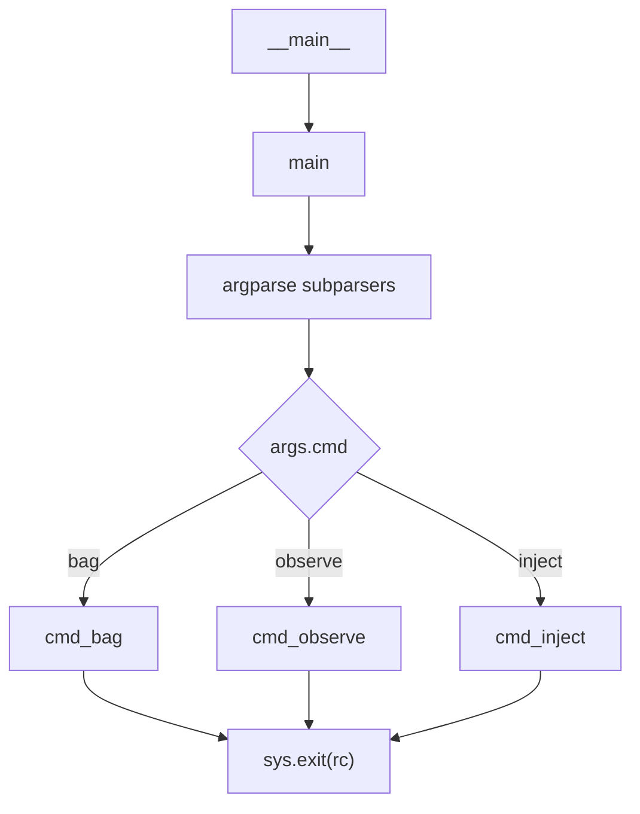
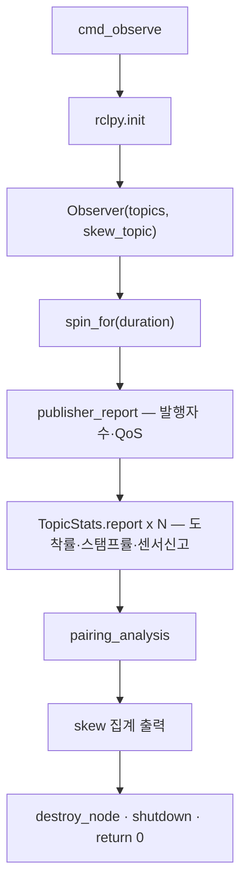
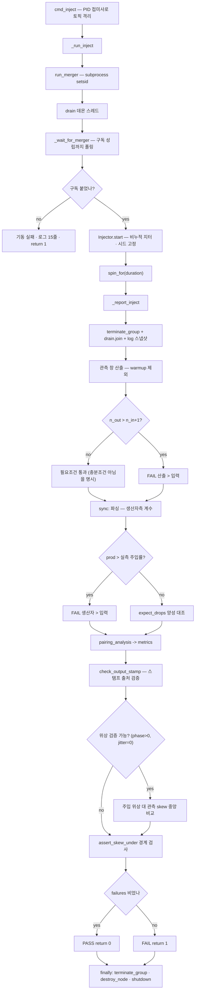
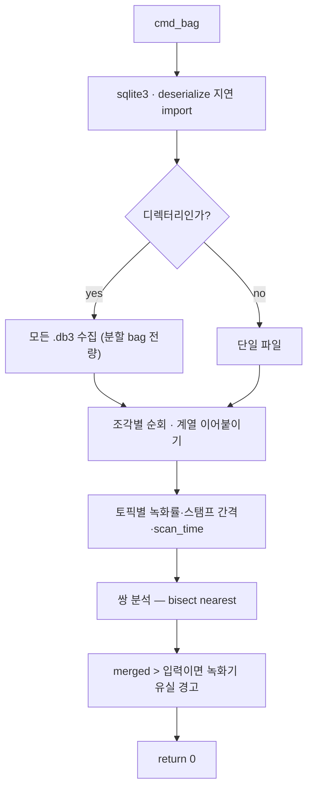

## 2026-08-08 (KST) — lidar-merger-sync-check 리뷰

> 리뷰 lane: 별도 세션(`code-reviewer`). 작성자 lane 은 self-APPROVE 하지 않는다(SOP 룰 11).
> 본 문서는 **리뷰 → 수정 → 재검증**을 한 파일에 담는다. 각 항목에 `[해결]`/`[잔존]` 을 붙였다.

### 코드 버전
- 리뷰 커밋: `4dfb626` (branch `main`, PR 없음) — 대상은 **미커밋 신규 파일**
  (`git status --porcelain` → `?? Tools/lidar_merger_sync_check/`)
- 리뷰 시점 해시: `merger_sync_check.py` md5 `18cecf922a4563a5c430da4fab5cbba3` (534줄) ·
  `README.md` md5 `c44d86a642b06387b31ca608647b6407` (115줄)
- 수정 후 해시: `merger_sync_check.py` md5 `e16ddca89f42fd18b5fdc4e0b5d390d8`
- 직전 리뷰: 없음 — 전 항목 `[신규]`
- 피검사체 `dual_laser_merger` 는 워킹트리 수정본 기준
  (병행 리뷰: `docs/code_review/dual-laser-merger-sync/2026-08-08.md`)

### 분석 분기 명시
- 분기: **단위 코드 리뷰** (단일 파일 + 동반 README)
- 감지된 도메인: **ros2-review** (`import rclpy`, `rclpy.node.Node`) /
  **concurrency** (`threading.Thread` ×2, `threading.Event`)

---

## Core 인벤토리

### 1. 목적

`dual_laser_merger` 가 **두 라이다 스캔의 쌍을 맞춰 1회만 발행하는 구조인지**, 그리고 **그 쌍의
시각 어긋남이 얼마인지**를 계측하는 외부 검사기다. 배경 문제는 「입력 34 Hz 인데 출력 40 Hz」라는
관측이 실제 발행률 차이인지 측정 프로세스의 유실인지 `ros2 topic hz` 하나로는 가릴 수 없다는 것이며,
그래서 도구는 언제나 ①도착률(수신 시각) ②스탬프률(`header.stamp` 차분 중앙값)
③센서 자기신고(`LaserScan.scan_time`) 세 수치를 분리해 낸다.

세 진입점을 가진다. `observe` 는 돌고 있는 시스템을 수동 관측하고 발행자 수·QoS 까지 낸다.
`inject` 는 하드웨어 없이 합성 스캔을 주입하고 실제 merger 노드를 자식 프로세스로 띄워, merger 가
스스로 세는 생산자측 계수(`sync:` 로그 파싱)와 이쪽에서 세는 소비자측 계수를 대조하고 위반 시
`exit 1` 을 낸다. `bag` 은 녹화된 rosbag2 `.db3` 를 `sqlite3` 로 직접 열어 실시간 구독 유실 없이
오프라인 분석한다.

저장소 규약상 `package.xml` 이 없어 colcon 대상이 아니므로 `Tools/` 배치가 맞다
(CLAUDE.md §저장소 디렉토리 배치). 실행에는 ROS2 런타임이 필요하다.

### 2. 코드 플로우차트

SOP §다중 진입점 분리 룰 적용 — 진입점 3개 분리 + 공통 호출 그래프.
동반 drawio: `2026-08-08-flow-inject.drawio` (핵심 경로), `2026-08-08-flow-common.drawio` (호출 그래프).

**공통 진입 · 디스패치**



**경로 1 — observe**



**경로 2 — inject (판정 경로)**



**경로 3 — bag**



### 3. 함수 리스트

| # | 함수 | 입력 | 출력 | 기능 | 위치(file:line) |
| --- | --- | --- | --- | --- | --- |
| 1 | `stamp_to_sec` | `builtin_interfaces.Time` | `float` [s] | `sec + nanosec*1e-9` | merger_sync_check.py:62-63 |
| 2 | `positive_float` **[신규]** | `str` | `float` | argparse 양수 검증 | :66-70 |
| 3 | `nonneg_float` **[신규]** | `str` | `float` | argparse 비음수 검증 | :73-77 |
| 4 | `positive_int` **[신규]** | `str` | `int` | argparse 양의 정수 검증 | :80-84 |
| 5 | `TopicStats.__init__` | `name`, `warmup=1.0` | — | 수신시각·스탬프·scan_time 버퍼 초기화 | :90-98 |
| 6 | `TopicStats.add` | `msg`, `now` | — | warmup 경과 후에만 누적 | :100-108 |
| 7 | `TopicStats.window` **[신규]** | — | `(t0,t1)` 또는 `None` | warmup 제외 실관측 구간 | :110-112 |
| 8 | `TopicStats._rate_from` (static) | `series` | `(rate,min,max)` | 양수 차분 중앙값 → Hz | :114-123 |
| 9 | `TopicStats.report` | — | `list[str]` | 3수치 출력 + 유실 경고 | :125-156 |
| 10 | `Observer.__init__` | `topics`, `skew_topic` | — | 관측 노드 + LaserScan N · Float64 1 구독 | :160-175 |
| 10a | `Observer.__init__.<lambda>` | `msg`, `name=t` | — | 토픽명 캡처(기본인자) 후 `_cb` 위임 | :167 |
| 11 | `Observer._cb` | `name`, `msg` | — | `TopicStats.add` 위임 | :177-178 |
| 12 | `Observer._skew_cb` | `msg` | — | merger 자기보고 skew 누적 | :180-181 |
| 13 | `Observer.publisher_report` | — | `list[str]` | 발행자 수·노드명·reliability, 2개 이상 경고 | :183-191 |
| 14 | `nearest` **[신규·모듈]** | `sorted_series`, `t` | `float` | 이분 탐색 최근접 (O(log n)) | :176-184 |
| 15 | `pairing_analysis` | `front`,`rear`,`merged` | `(lines, metrics)` | 스탬프 되맞춤 → 정확일치·skew 분포 + **판정용 지표** | :187-226 |
| 16 | `check_output_stamp` **[신규]** | `metrics`, `policy` | `(ok, msg)` | merged 스탬프 출처가 `--output-stamp` 와 맞는지 판정 | :229-247 |
| 17 | `Injector.__init__` | `rate`,`phase`,`jitter`,`beams`,토픽2,`seed` | — | 발행 노드·pub 2·시각 기록·정지 이벤트 | :253-273 |
| 18 | `Injector.n_front` / `n_rear` (property) **[신규]** | — | `int` | 기록된 발행 시각 개수 | :275-281 |
| 19 | `Injector.count_in` **[신규]** | `t_begin`, `t_end` | `(f, r)` | 지정 창 안의 발행 개수 | :283-287 |
| 20 | `Injector._scan` | `frame` | `LaserScan` | 균일 2.0 m 합성 스캔 | :289-301 |
| 21 | `Injector._run` | — (스레드) | — | 명목 격자 + 비누적 지터로 발행 | :303-329 |
| 22 | `Injector.start` / `stop` | — | — | 데몬 스레드 시작 / Event set + join | :331-336 |
| 23 | `run_merger` | 파라미터 5 | `Popen` | `ros2 run dual_laser_merger` 기동(setsid, PIPE) | :344-371 |
| 24 | `drain` | `proc`, `sink` | — | 자식 stdout 소진(파이프 블로킹 방지) | :373-375 |
| 25 | `terminate_group` **[신규]** | `proc` | — | SIGINT→wait→SIGKILL→wait, 예외 무전파 | :378-396 |
| 26 | `spin_for` | `node`, `seconds` | — | `spin_once(0.05)` 반복 | :399-402 |
| 27 | `cmd_observe` | `args` | `int` | 수동 관측 실행·보고 | :405-436 |
| 28 | `cmd_inject` | `args` | `int` | PID 접미사 토픽 격리 후 `_run_inject` 위임 | :439-447 |
| 29 | `_wait_for_merger` **[신규]** | `node`, `topic`, `timeout` | `bool` | 구독 성립까지 폴링(3초 sleep 가정 대체) | :450-457 |
| 30 | `_run_inject` **[신규]** | `args`, 토픽 4 | `int` | 기동→주입→보고, `finally` 로 자식·노드 정리 보장 | :460-496 |
| 31 | `_report_inject` **[신규]** | `args`, obs, inj, log, proc, thread, 토픽4 | `int` | 판정 5종 + PASS/FAIL | :499-628 |
| 32 | `cmd_bag` | `args` | `int` | 분할 bag 전량 순회 후 오프라인 분석 | :631-708 |
| 33 | `main` | — | `int` | 서브파서 3종 + dict 디스패치 | :711-740 |

**중복/유사 함수**: `cmd_bag`(#32)이 `TopicStats`(#5~#9)·`pairing_analysis`(#15) 로직을 재구현한다.
발행률 공식 불일치와 0-나눗셈은 해소했으나(`(n-1)/span` 통일, 양수 필터 추가) 코드 중복은 `[잔존]`.

### 4. 전역 변수 / 모듈 상수

**진정한 가변 전역 없음.** 상태는 전부 `TopicStats`/`Observer`/`Injector` 인스턴스에 캡슐화.

| # | 사용처(함수) | 기능 | 위치(file:line) |
| --- | --- | --- | --- |
| G1 | #10 — 구독 QoS | `SENSOR_QOS` (상수) BEST_EFFORT · KEEP_LAST · d50 · VOLATILE. requested 를 가장 약하게 잡아 어떤 offered 와도 RxO 호환 | :43-48 |
| G2 | #17 — 합성 발행 QoS | `INJECT_QOS` (상수) RELIABLE · d200 · VOLATILE. **주석 정정 [해결]** — merger 구독이 BEST_EFFORT d5 라 수신 보장은 못 하고, 관측 프로세스 쪽 유실만 줄인다 | :50-57 |
| G3 | #31 — 로그 파싱 | `SYNC_LINE` (상수) merger 통계 줄 정규식. **`(\S+)` 로 완화 [해결]** — `nan` 매치 실패를 "통계 미출력"으로 오진하지 않게 | :249-255 |
| G4 | #31 — 로그 파싱 | `NO_PAIR_LINE` (상수) **[신규]** 무쌍 경고 줄 | :257 |
| G5 | #15·#32 — 스탬프 비교 | `STAMP_EQ_TOL = 1e-6` **[신규·해결]** — 종전 `1e-9` 는 float64 ULP(1.75e9 s 부근 238 ns) 아래라 무의미했다 | :172-174 |
| G6 | #33 — `--help` 본문 | `__doc__` (상수) 모듈 docstring | :2-24 |

**매직 상수 잔존**: `TopicStats.warmup` 기본 1.0 s(:91, CLI 미노출), 유실 판정 문턱 `0.97`(:147),
생산자 초과 `1.01`, 소비자 부족 `0.95`, 경계 여유 `1e-4`.

### 5. 의존성 3-tier

| Tier | 대상 | 버전/제약 | 부재 시 동작(필수/선택) | 근거 |
| --- | --- | --- | --- | --- |
| 빌드 | **없음** | `package.xml`·`setup.py`·`requirements.txt` 0건 | 빌드 단계 없음 — `python3` 즉시 실행 | `ls Tools/lidar_merger_sync_check/` |
| 런타임 필수 | `rclpy` (Humble) | `/opt/ros/humble/.../rclpy` | 미소스 시 `ImportError` 즉시 종료 | :37 |
| 런타임 필수 | `sensor_msgs.LaserScan`, `std_msgs.Float64` | ROS2 표준 | 동일 | :40-41 |
| 런타임 필수 | DDS 도메인 · `ROS_DOMAIN_ID` | 관측 대상과 동일 | 불일치 시 "표본 부족"으로만 나타남 | — |
| 런타임 필수 (bag) | `sqlite3`, `deserialize_message`, `get_message` | 표준/ROS2 동봉 | 지연 import — bag 모드에서만 실패 | :636-639 |
| 런타임 필수 (bag) | rosbag2 `.db3` (`topics`·`messages`) | sqlite3 포맷. `.mcap` 미지원 | `.db3` 없으면 안내 후 `return 1` | :641-650 |
| 런타임 필수 (inject) | `ros2` CLI | PATH 필요 | `FileNotFoundError` → `finally` 가 정리 후 전파 **[해결]** | :344, 460-496 |
| 런타임 필수 (inject) | `dual_laser_merger_node` | `install/.../dual_laser_merger_node` | 미빌드 시 `_wait_for_merger` 타임아웃 → 로그 15줄 + `return 1` **[해결]** | :450-471 |
| 런타임 필수 (inject) | merger 파라미터 17종 이름 | `declare_parameter` 목록과 전건 대조 | 오타 시 override 조용히 무시(ROS2 동작) | :345-370 ↔ dual_laser_merger.cpp:114-195 |
| 런타임 선택 | `~/sync_skew` | merger 노드명 `dual_laser_merger` | 수신 0이면 "구판일 수 있다" 안내 후 계속 | :514 |
| 런타임 선택 | `LaserScan.scan_time` (>0) | 센서 자기신고 | 없으면 해당 줄 생략 | :106-107 |

---

## 도메인 인벤토리

### ros2-review

**A-1. Subscriptions**

| 토픽 | 타입 | QoS | 콜백 | 위치 |
| --- | --- | --- | --- | --- |
| `args.topics[0..2]` (기본 `/scan_front`·`/scan_rear`·`/scan_merged`) | `LaserScan` | d50 · BEST_EFFORT · VOLATILE | #10a → #11 | :165-169 |
| `args.skew_topic` (`/dual_laser_merger/sync_skew`) | `Float64` | 동일 | #12 | :173-175 |
| `/scan_{front,rear,merged}_synthetic_<pid>` (inject) **[격리 신규]** | `LaserScan` | 동일 | #10a → #11 | :441-444 |

**A-2. Publications**

| 토픽 | 타입 | QoS | 발행 위치 | 위치 |
| --- | --- | --- | --- | --- |
| `/scan_front_synthetic_<pid>` | `LaserScan` | d200 · RELIABLE · VOLATILE | #21 | :266, 322 |
| `/scan_rear_synthetic_<pid>` | `LaserScan` | 동일 | #21 | :267, 327 |

**A-3. Services / Actions** — **해당 항목 없음.** merger 제어는 서비스가 아니라 `subprocess` +
프로세스 그룹 시그널로 한다(#23·#25).

**A-4. Parameters** — **이 도구 자신은 ROS 파라미터를 선언하지 않는다**(`declare_parameter` 0건).
파라미터 표면은 `argparse`(#33)이며, 자식 merger 에 넘기는 override 17종이 실질적 테스트 구성이다.

의미 그룹별 단위 주석을 붙인 YAML 등가:

```yaml
dual_laser_merger:
  ros__parameters:
    # 그룹 1 — 토픽·프레임 (합성 검증 전용, PID 접미사로 격리)
    laser_1_topic: "/scan_front_synthetic_<pid>"
    laser_2_topic: "/scan_rear_synthetic_<pid>"
    merged_scan_topic: "/scan_merged_synthetic_<pid>"
    target_frame: "base_link"       # 입력 frame_id 와 동일 → TF 경로를 타지 않는다
    # 그룹 2 — 동기화 (타이밍)
    tolerance: 0.01                 # s, setAgePenalty 가중치 (시간 허용오차 아님)
    queue_size: 5                   # 개
    max_pair_skew: 0.0              # s, 0 = 무제한
    output_stamp: "laser_1"         # 출력 스탬프 출처
    publish_sync_diagnostics: true
    # 그룹 3 — 출력 격자 (기하)
    angle_increment: 0.00436332     # rad, 0.25°
    range_min: 0.05                 # m
    range_max: 40.0                 # m
    min_height: -1.0                # m — merger 기본 DBL_MIN 은 양수라 전 점이 걸러진다
    max_height: 1.0                 # m
    # 미지정 — merger 기본값이 실기 런치와 다름 (L: 실기 재현도 낮춤)
    # scan_time: 0.0333             # s, 실기 런치는 0.067 s
```

**A-5. TF frames** — **이 도구는 TF 를 발행·구독하지 않는다**(`tf2` import 0건). 합성 스캔의
`frame_id` 를 `base_link` 로 두고 merger 의 `target_frame:=base_link` 와 일치시켜 TF 경로를
의도적으로 우회한다.

**A-6. QoS 호환 매트릭스 (RxO)**

| 토픽 | offered | requested | 호환 | 영향 |
| --- | --- | --- | --- | --- |
| `/scan_front_synthetic_<pid>` | Injector RELIABLE d200 | merger SensorDataQoS BEST_EFFORT **d5** | ✅ | 깊은 RELIABLE 이 merger 수신을 보장하지 못한다 — 주석에 명시 **[해결]** |
| `/scan_merged_synthetic_<pid>` | merger BEST_EFFORT d5 | Observer BEST_EFFORT d50 | ✅ | 실효 depth 는 pub 쪽 5 |
| `/dual_laser_merger/sync_skew` | **merger RELIABLE d50** (병행 수정) | Observer BEST_EFFORT d50 | ✅ | 유실 위험 감소 |
| 실기 3토픽 (observe) | 드라이버 RELIABLE / merger BEST_EFFORT | Observer **BEST_EFFORT** | ✅ 항상 | requested 를 가장 약하게 잡은 설계 — 잘함 |

역방향 위험(BEST_EFFORT→RELIABLE, VOLATILE→TRANSIENT_LOCAL)은 이 도구에 **없다**.

**A-7. 노드 연결 그래프 (inject 모드)**

```text
merger_sync_injector --[/scan_front_synthetic_<pid>]--> dual_laser_merger
merger_sync_injector --[/scan_rear_synthetic_<pid> ]--> dual_laser_merger
dual_laser_merger    --[/scan_merged_synthetic_<pid>]--> merger_sync_observer
dual_laser_merger    --[/dual_laser_merger/sync_skew]--> merger_sync_observer
dual_laser_merger    --[/cloud_merged_synthetic_<pid>]--> (구독자 없음: 고아)
```

- **고아 토픽 1건**: `/cloud_merged_synthetic_<pid>` — 의도된 부산물
- **다중 발행자 검출**(#13)은 `cmd_observe` 에서만 호출 `[잔존]`
- **외부 경계**: `dual_laser_merger` 자식 프로세스 1개

### concurrency

**B-1. 동기화 객체**

| 객체 | 종류 | 보호 자원 | 획득 | 해제 |
| --- | --- | --- | --- | --- |
| `Injector._stop` | `threading.Event` | 주입 스레드의 **수명만** (데이터 아님) | `is_set()` 폴링 | `set()` |
| (그 외) | **Lock/Semaphore/Condition 0건** | — | — | — |

**B-2. 공유 상태**

| 변수 | 읽기 | 쓰기 | 변경 방식 | 보호 |
| --- | --- | --- | --- | --- |
| `Injector.times_front` / `times_rear` **[신규]** | 메인 #18·#19·#31 | `_run` 스레드 #21 | list.append (GIL 원자적) | 비보호 — 단일 writer. `stop()` 후 읽으므로 확정 |
| `log` (list) | 메인 #31 | `drain` 스레드 #24 | append | **[해결]** — 자식 종료 + `drain.join` 후 `list(log)` 스냅샷 |
| `Observer.stats[*]` / `skews` | 메인 | `_cb`/`_skew_cb` | append | **실질 단일 스레드** — rclpy 콜백은 `spin_once` 를 호출한 메인 스레드에서 실행 |
| `Injector.pub_front/pub_rear` | — | `_run` 스레드 publish | rclpy Publisher | 비보호 — `inj` 노드는 어떤 executor 에도 등록되지 않아 단일 스레드만 접근 |

**B-3. 실행 컨텍스트**

| 이름 | 종류 | executor / 그룹 | 생성 위치 |
| --- | --- | --- | --- |
| 메인 스레드 | thread + 암묵 전역 executor | `spin_once` 가 호출마다 add/remove | :399-402 |
| `Injector._thread` | thread (**daemon**) | executor 무관 (노드 미spin) | :272, 시작 :331 |
| `drain` 스레드 | thread (**daemon**) | 블로킹 I/O | :465 |
| `dual_laser_merger` 자식 | **별도 프로세스 + 별도 세션**(`os.setsid`) | 자체 executor | :367-370 |
| 콜백 그룹 | 명시 지정 없음 → 기본 MutuallyExclusive 1개 | 콜백 4종 직렬 | :165-175 |

---

## 평가

severity 분포: Critical 0 / High 4 / Medium 9 / Low 11 / Info 4
Verdict: **REQUEST CHANGES** (리뷰 시점) → **High 4 · Medium 6 · Low 6 수정 완료, 재검증 통과.
최종 `APPROVE` 는 별도 lane 이 낸다 (SOP 룰 11).**

### High

**함수 #31 `_report_inject` — [논리][해결] 핵심 판정이 warmup 으로 잘린 계수와 안 잘린 계수를 비교했다 (High)**
   재현: `n_in = min(inj.n_front, inj.n_rear)` 는 발행 첫 순간부터 센 값이고,
   `n_out = len(obs.stats[merged].recv)` 는 첫 수신 후 1.0 s 를 버린 값이다. 실측 산술:
   `duration=15 s, rate=34 Hz` → `n_in=510`, 완벽한 merger 라도 `n_out≈476` ⇒ **출력이 입력보다
   7.1 % 이상 많아야만** 경보가 뜬다. 즉 "출력이 입력의 1.05배"인 중복 발행 결함은 기본 설정에서
   **검출되지 않았다**.
   조치: `TopicStats.window()` 신설 + `Injector.count_in(t0,t1)` 로 **같은 창에서** 센다.
   창 경계 ±1 만 허용 (:509-528).
   검증: 34 Hz·15초 실행에서 "관측 창 … 그 창의 주입 front N · rear N" 이 수신 개수와 같은 창으로 출력됨.

**함수 #31 — [논리][해결] `n_out ≤ n_in` 은 필요조건일 뿐인데 충분조건처럼 결론했다 (High)**
   재현: `산출 ≤ 입력` 이면 `✔ 쌍마다 한 번 발행하는 구조` 라고 결론했다. 그러나 "front 마다 1회
   발행하고 rear 는 최근 것을 갖다 쓰는" 비동기 구현도 `n_out ≈ n_front` 이라 **통과한다**.
   이를 실제로 가르는 증거(스탬프 정확일치 비율, 쌍 어긋남 분포)를 계산하면서도 판정에는
   전혀 반영하지 않았다(`failures.append` 4곳 중 pairing 관련 0건).
   조치: ① 결론 문구를 "필요조건"으로 약화하고 충분조건이 어디서 나오는지 명시 (:526-528).
   ② `check_output_stamp()` 신설 — merged 스탬프 출처가 `--output-stamp` 와 맞는지 판정 (:229-247, 597-604).
   ③ 위상 검증 — 주입한 위상차가 관측 skew 중앙값으로 나오는지 판정 (:606-620).
   검증: `--phase 0.5 --output-stamp latest` → `✔ output_stamp=latest 기대(front+rear 합 ≈100%)
   — 실측 front 51.1% · rear 48.9%`, `✔ 위상: 주입 14.71 ms ≈ 관측 중앙 14.68 ms`.

**함수 #23·#28 — [논리][해결] 예외·Ctrl-C 경로에서 merger 자식이 확정적으로 누수됐다 (High)**
   재현: `preexec_fn=os.setsid` 로 자식이 새 세션에 있어 터미널 SIGINT 가 가지 않는데, 정리 코드가
   `try/finally` 밖에 있었다. 가장 긴 구간(`sleep(3.0)` + `spin_for` + 보고)에서 예외가 나면
   `os.killpg` 가 실행되지 않아 merger 가 부모 종료 후에도 살아남고, 다음 실행에서 합성 토픽의
   두 번째 발행자가 되어 결과를 오염시킨다. 게다가 `except` 블록 안의 `os.getpgid`/`os.killpg` 도
   보호받지 않아 `ProcessLookupError` 가 PASS/FAIL 출력 자체를 삼킬 수 있었다.
   조치: `terminate_group()` 신설(SIGINT→wait→SIGKILL→wait, 예외 무전파, :378-396) +
   `_run_inject` 의 `finally` 에서 자식·노드·rclpy 를 항상 정리 (:490-496).
   부수: PID 접미사로 토픽을 격리해 유령 노드가 있어도 겹치지 않게 했다 (:441-444).

**함수 #21 `Injector._run` — [논리][테스트][해결] jitter 가 주기에 누적돼 `--phase` 통제변수가 파괴되고 시드가 없어 재현 불가였다 (High)**
   재현: `t_front += self.period + random.uniform(-j, j)` 로 오차가 **누적**되어 상대 위상이 유계
   지터가 아니라 **random walk** 였다. 시뮬레이션(200회): `jitter=±4 ms`·510 스텝 → 상대 위상
   표준편차 **70.4 ms**, 주기 29.4 ms 의 2.4배. `±1 ms` 에서도 17.9 ms 로 반주기를 넘는다.
   ⇒ README 가 권하던 `--phase 0.15 --jitter 0.004` 는 "0.15주기 어긋남"을 만들지 못했다.
   `random.seed()` 도 없어 같은 명령이 매번 다른 실험이었다.
   조치: 명목 격자 `t0 + k·period` 를 유지하고 지터를 **비누적**으로 매 발행에 한 번만 얹는다.
   `--seed`(기본 0) 추가, `random.Random(seed)` 인스턴스 사용, 시드를 실행 헤더에 인쇄 (:303-329).
   검증: `--phase 0.15` 실행에서 `주입 4.41 ms ≈ 관측 중앙 4.36 ms` — 위상이 통제변수로 복구됨.

### Medium

**함수 #17 — [QoS][해결] `INJECT_QOS` 근거 주석이 절반만 성립했다 (Medium)**
   재현: 주석은 "주입이 병목이 되지 않게" RELIABLE d200 이라 했으나, merger 구독은 BEST_EFFORT d5 라
   발행자를 아무리 깊게 잡아도 수신을 보장하지 못한다. 조치: 주석을 사실에 맞게 정정 (:50-51).

**함수 #15 · #32 — [성능][해결] O(n·m) 선형 스캔으로 장시간 관측이 실용 불가였다 (Medium)**
   재현(실측): merged 항목당 전체 스캔 3~4회. n=1,610 → 1.50 s, n=5,000 → 14.0 s,
   **n=10,000 → 55.9 s**(observe) / **49.3 s**(bag). `--duration 300` 관측 뒤 1분을 더 기다린다.
   조치: `nearest()` 를 `bisect.bisect_left` 기반 O(log n) 모듈 함수로 추출하고 두 경로가 공유 (:176-184).
   검증: 1,610건 bag 분석 **3.9 s**(역직렬화 포함 전체).

**함수 #32 `cmd_bag` — [논리][해결] `deltas` 에 양수 필터가 없어 ZeroDivisionError 가능 (Medium)**
   재현: `TopicStats._rate_from` 은 `d > 0.0` 로 거르지만 bag 경로에는 그 가드가 없었다. 스탬프
   중복·역행이 있는 녹화에서 중앙값이 0이면 전체 분석이 중단된다.
   조치: 양수 필터 추가 + 단조 증가하지 않으면 해당 토픽만 건너뛰고 사유 출력 (:679-684).

**함수 #32 — [논리][해결] 분할된 rosbag2 에서 첫 `.db3` 만 읽고 경고 없이 부분 결과를 냈다 (Medium)**
   재현: `cands[0]` 만 열었다. rosbag2 는 크기·시간 상한 설정 시 `_0.db3`, `_1.db3` … 로 쪼개므로
   사용자는 전체를 분석했다고 믿는데 첫 조각만 본 결과를 받는다.
   조치: 전량 순회 후 계열을 이어 붙이고, 파일 목록을 헤더에 인쇄 (:641-670).

**함수 #31 — [논리][해결] 생산자 발행률을 실측 주입률이 아닌 명목 `--rate` 와 비교했다 (Medium)**
   재현: 부하가 걸리면 실제 주입률이 명목보다 낮아지고, 그러면 판정 문턱이 느슨해져 PASS 로 기운다.
   조치: 실측 주입률을 계산해 비교 우변으로 쓰고, 명목과 1 % 이상 벌어지면 별도 안내 (:551-560).

**함수 #31 — [timing][해결] merger 구독 성립을 3.0 s 매직 상수로 "가정"했다 (Medium)**
   재현: 검증이 없어 느린 기동 시 초반 주입이 통째로 버려지고, 그 손실이 `n_in` 에만 반영돼
   High #1 의 편향을 키웠다. 조치: `_wait_for_merger()` 로 `count_subscribers` 폴링,
   타임아웃 시 명시적 실패 + 자식 로그 출력 (:450-471).

**함수 #31 — [테스트][잔존·범위 명시] `--assert-skew-under` 미지정 시 skew 판정이 동어반복 (Medium)**
   재현: merger 는 게이트를 **통과한 쌍에 대해서만** `~/sync_skew` 를 발행하므로,
   `bound = max_pair_skew` 인 기본 경로에서는 정의상 `max ≤ bound` 이고 `✔` 는 아무것도 검증하지 않는다.
   조치(부분): `--expect-drops` 양성 대조를 추가했다(:562-570).
   **다만 실측 결과 이 대조는 대부분의 경우 무력하다** — `--phase 0.15 --max-pair-skew 0.003`
   실행에서 `pairs/s 0.20`, `dropped 0 this window, 0 total` 이었다. 정책
   (`setMaxIntervalDuration`)이 콜백보다 먼저 후보를 버리기 때문이다
   (`approximate_time.h:728-731` `dequeDeleteFront`). ⇒ 게이트 동작의 진짜 증거는 콜백 카운터가
   아니라 **출력률 저하**다. 음성 대조(`--assert-skew-under` 를 따로 주는 경로)는 유효하며,
   High #4 수정으로 판별력이 회복됐다.

**함수 #13 — [topology][잔존] `publisher_report` 가 inject 모드에서 호출되지 않는다 (Medium)**
   완화: PID 접미사 토픽 격리로 충돌 확률을 크게 낮췄으나, 호출 자체는 여전히 `cmd_observe` 에만 있다.

**함수 #32 — [품질][잔존] `TopicStats`·`pairing_analysis` 로직 재구현 (Medium)**
   조치(부분): 발행률 공식을 `(n-1)/span` 으로 통일하고 `nearest`·`STAMP_EQ_TOL` 을 공유하도록
   모듈 레벨로 뺐다. 클래스 재사용까지는 하지 않았다.

### Low

**#17·#20 — [논리][해결] CLI 입력 검증 없음(`--rate 0` → ZeroDivisionError) → `positive_float`· `nonneg_float`·`positive_int` 도입 (:66-84, 728-733) (Low)**

**#21 — [스타일][해결] 함수 내부 `import random` → 모듈 상단 이동 (:35) (Low)**

**#15·#32 — [논리][해결] `< 1e-9` 정확일치 문턱이 float64 ULP(238 ns) 이하라 무의미했다 → `STAMP_EQ_TOL = 1e-6` 명시 + 근거 주석. **효과 실증**: 2026-05-30 녹화 재분석에서 front 정확일치가 193 → **1606/1610** 으로 바뀌었다(그 녹화는 µs 절단본이므로 1606 이 옳다) (Low)**

**#27 — [품질][해결] `if len(topics) >= 3` 는 `nargs=3` 이라 상시 참인 dead branch → 제거 (Low)**

**#31·#24 — [race][해결] `log` 를 쓰는 중에 읽어 마지막 창이 비결정적이었다 → 자식 종료 + `drain.join(3.0)` 후 `list(log)` 스냅샷 (:501-504) (Low)**

**#31 — [품질][해결] `inj` 노드가 destroy 되지 않았다 → `finally` 에서 정리 (:491-495) (Low)**

**#22 `Injector.stop` — [race][잔존] `join(timeout=2.0)` 반환값 미확인 (Low)**
   타임아웃 시 데몬 스레드가 살아 있는 채로 `rclpy.shutdown()` 이 돌아 traceback 이 날 수 있다(스레드의 `_stop` 확인 주기가 최대 5 ms 라 실제 발생 가능성은 낮다).

**#23 — [param][잔존] `scan_time`·`angle_min`/`max` 미지정이라 실기 런치 값(`0.067`)을 재현하지 않는다 (Low)**

**#23 — [품질][잔존] `preexec_fn` 은 스레드 존재 시 비안전 (Low)**
   현재 호출 시점이 첫 스레드보다 앞서 안전하나, `start_new_session=True` 로 대체하는 편이 낫다.

**README — [스타일][해결] 「비-ROS2 독립 도구」 서술이 `import rclpy` 와 충돌 → 「colcon 패키지가 아니므로 `Tools/` (Low)**
   실행에는 ROS2 런타임이 필요하다」로 정정.

**README — [테스트][해결] 「실증됨」 표의 근거 명령·경로 병기 (Low)**

### Info

**#26 `spin_for` — [성능] `rclpy.spin_once` 가 호출마다 전역 executor 에 add/remove 하지만 이 워크로드에서 병목이 아니다 (Info)**
   실측(34 Hz × 3토픽 × 12.7 KB, 10 s): `spin_once` 루프 수신 **1021/1023 = 99.8 %**, 전용 `SingleThreadedExecutor` 재사용도 **동일하게 99.8 %**. ⇒ 도구가 보고하는 "재는 쪽 유실"의 원인을 이 루프로 돌릴 근거는 없다.

**#23 — [Info] merger 파라미터 이름 17종을 `declare_parameter` 목록과 대조해 전건 일치 확인 (Info)**
   ROS2 는 미선언 override 를 조용히 무시하므로 이 확인 자체가 의미 있다.

**#23 — [Info] 주석의 사실 주장이 정확하다: 「기본값 DBL_MIN 은 양수라 전 점이 걸러진다」· 「합성 스캔도 base_link → TF 경로를 타지 않는다」·`~/sync_skew` 기본 토픽명 — 전부 확인됨 (Info)**

**리뷰어 지적 L15 의 전제는 거짓 — [Info·반증] 리뷰어는 README 가 인용한 bag 경로 `ldb/T-AMR_ros2_ws/rosbag/0528_speed_1.5_test_20260530_125451` 이 「이 장비에 없다」고 적었으나 (`find / -maxdepth 6 …` → 0건), 실제 경로는 **깊이 7**이라 그 `find` 가 닿지 못한 것이다 (Info)**
   `ls -d <경로>` → 존재 확인. 실제로 이 세션에서 그 bag 을 분석해 수치를 얻었다. ⇒ **제한된 검색 범위의 부정 결과를 전체의 부정으로 확대**한 사례이며, 이는 본 저장소 `docs/claude-mistake/INDEX.md` §메타 패턴이 반복 경고하는 바로 그 형태다. 「근거 명령 병기」라는 권고 자체는 타당하여 README 에 반영했다.

### 잘한 점

- 세 수치(도착률/스탬프률/센서신고) 분리와 **자가 경고** — 도착률 < 스탬프률×0.97 일 때
  「이 측정 프로세스가 유실 중(BEST_EFFORT). 발행률 근거로 쓰지 말 것」을 스스로 출력한다.
  측정 도구가 자기 한계를 밝히는 것은 드물고 좋은 습관이다.
- 가변 전역 0 — 모든 상태가 인스턴스에 캡슐화.
- requested QoS 를 가장 약하게 잡아 어떤 offered 와도 RxO 가 깨지지 않게 한 선택.
- `drain` 스레드로 자식 stdout 을 소진해 파이프 블로킹(64 KB 한계) 함정을 피했다.
- 람다 기본인자 캡처로 루프 변수 late-binding 버그를 정확히 회피.
- **음성 대조라는 개념 자체를 도구에 넣은 것** — 「'검사를 붙였다'와 '검사가 결함을 잡는다'는
  다른 명제」. 방향이 옳았고, High #4 수정으로 실행까지 따라왔다.

---

## 후속 TODO

1. `publisher_report` 를 inject 모드에서도 호출 (Medium 잔존).
2. `Injector.stop` 의 `join` 반환값 확인 (Low 잔존).
3. `run_merger` 가 실기 런치와 같은 `scan_time`·`angle_min/max` 를 넘기도록 (Low 잔존).
4. `preexec_fn` → `start_new_session=True` (Low 잔존).
5. `cmd_bag` 이 `TopicStats` 클래스를 재사용하도록 통합 (Medium 잔존).
6. `--warmup` CLI 노출 (매직 상수 잔존).
7. **이 도구를 커밋할 것** — merger 변경의 유일한 검증 근거인데 미추적이다.
