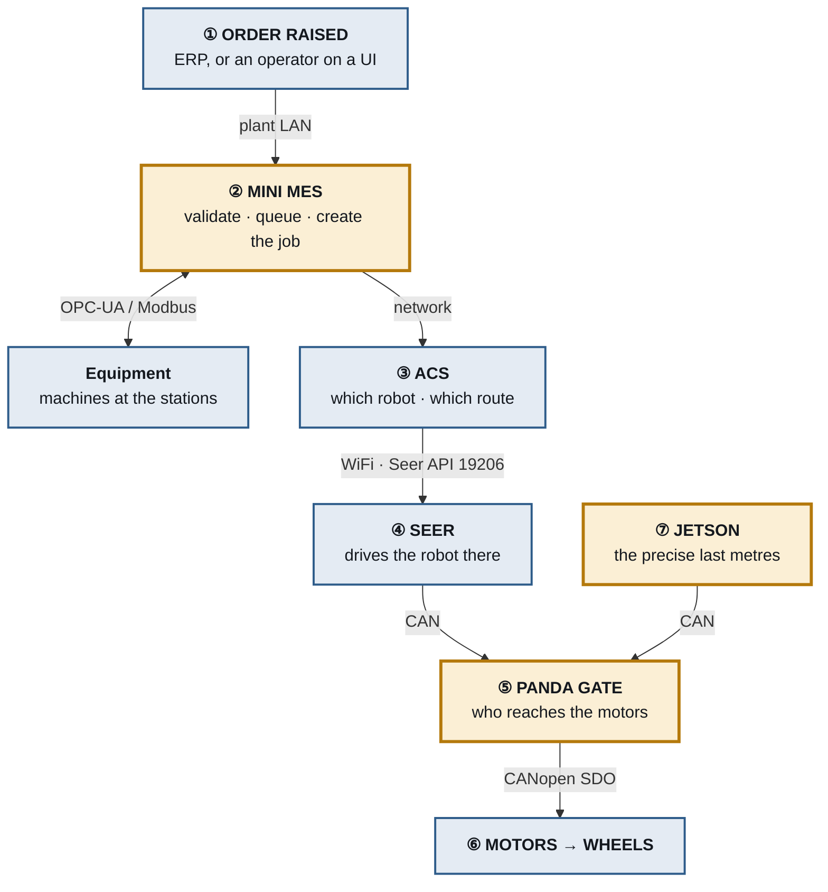
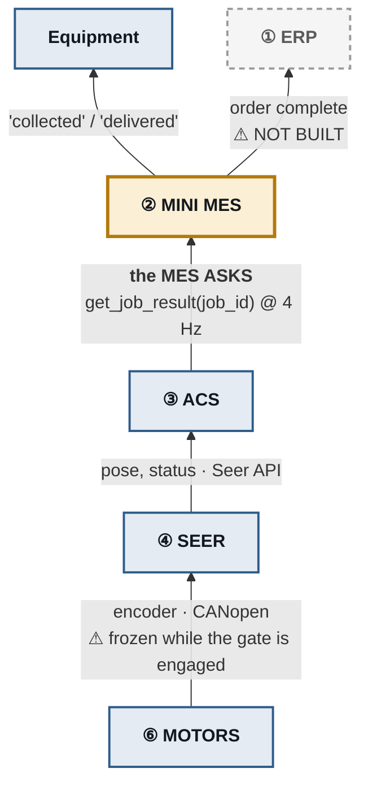

# Big-AMR — Order Workflow

**One order, from the moment it is raised to the moment it is closed.**

Every hop, every network boundary, and where each piece physically sits. This
describes the system as designed and fully built — see
[`ARCHITECTURE.md` §8](ARCHITECTURE.md) for what is working today.

> Foil_A082 retrofit · 2026-07-30

---

## Contents

1. [The short version](#1-the-short-version)
2. [Raising the order](#2-raising-the-order)
3. [Transit — Seer drives](#3-transit--seer-drives)
4. [Arrival — authority hands over](#4-arrival--authority-hands-over)
5. [Load, then the second leg](#5-load-then-the-second-leg)
6. [Closing the loop](#6-closing-the-loop)
7. [Running underneath all of it](#7-running-underneath-all-of-it)
8. [Where each part physically lives](#8-where-each-part-physically-lives)
9. [Assumptions in this document](#9-assumptions-in-this-document)

---

## 1. The short version



Amber is what we build; blue is what already exists and must not be modified.

### And the way back

The diagram above shows **commands only**. Something has to travel the other way too, or
no job could ever reach `DONE`.



**Three things about this direction are worth knowing.**

**It is a pull, not a push.** The Mini MES asks the ACS "is `job_0007` finished?" four
times a second (`job_fsm.py:103`, `Running.execute`). The ACS never calls us. That is
forced by the interface rather than chosen — `AcsAdapter.get_job_result` is
request/response because the real MES → ACS interface is still undecided (§9) and may be
poll-only. If it turns out to support callbacks, only the adapter changes.

**The chain is only as honest as its weakest link — and one link is deliberately lying.**
While the Panda gate is engaged it *freezes the motor readback*, so Seer reports "parked,
nothing moving" while the Jetson is actually driving. Seer then tells the ACS that, and
the ACS tells us. Every layer above the gate is blind **by design** for the duration.

That is why `RUNNING` has a **timeout** and not only a success and a failure exit. If the
Jetson dies mid-dock, nothing upstream reports a problem — Seer keeps saying "parked,
normal" and the ACS faithfully repeats it. The timeout is the only thing that ends such a
job. (Compare Seer's own alarm `52954`: a re-homing state that timed out after 20
minutes.)

**ERP reporting does not exist.** There is no ERP adapter in the code — `grep -i erp`
returns nothing. Jobs complete and the Mini MES tells the two stations, but nothing
travels back up to the order system. It is drawn here because the design calls for it,
greyed because it is not built.

---

## 2. Raising the order

```
┌─ ① ORDER RAISED ──────────────────────────────────────────────┐
│  ERP schedules production, or an operator enters it on a UI    │
└───────────────────────────┬───────────────────────────────────┘
                            │  plant LAN · HTTP/REST
                            ▼
┌─ ② MINI MES ──────────────────────────────────────────────────┐
│                                                                │
│   Order received → validated → queued                          │
│         │                                                      │
│         ├─► Equipment Monitor FSM ──── OPC-UA/Modbus ──►  ⚙    │
│         │      "is the material actually ready at source?"     │
│         │                                                      │
│         ├─► Job Tracker FSM                                    │
│         │      creates Job {id, from, to, priority}            │
│         │      state: IDLE                                     │
│         │                                                      │
│         └─► Dispatcher FSM                                     │
│                takes oldest job, asks for transport            │
│                state: ASSIGNED                                 │
└───────────────────────────┬───────────────────────────────────┘
                            │  network
                            ▼
┌─ ③ ACS (fleet controller) ────────────────────────────────────┐
│   • picks the nearest free robot                               │
│   • plans the route                                            │
│   • reserves corridor segments so two robots never deadlock    │
│   • checks battery; sends the robot to charge if low           │
└───────────────────────────────────────────────────────────────┘
```

The three FSMs inside the Mini MES are independent state machines held by a
supervisor, each woken by an event rather than polled —
[`ARCHITECTURE.md` §5](ARCHITECTURE.md).

**If no robot is free**, the ACS answers `BUSY` and the job returns to `IDLE` to
wait its turn. It is *not* failed — a busy fleet means wait, not give up. This
is also how battery reaches the Mini MES: a charging robot and a working robot
look identical from up there, and both simply mean less capacity.

---

## 3. Transit — Seer drives

```
                            │  WiFi · Seer TCP API 19206
                            ▼
┌─ ④ SEER  (on board) ──────────────────────────────────────────┐
│   navigates to the SOURCE station · safety scanners active     │
└───────────────────────────┬───────────────────────────────────┘
                            │  CAN bus (inside the robot)
                            ▼
                     ┌─ ⑤ PANDA GATE ─┐
                     │   pass-through  │   ← Seer is driving
                     └────────┬────────┘
                              ▼
                    ⑥ MOTORS → WHEELS
                    robot drives across the floor
```

During transit the gate is transparent. Seer drives exactly as it always has,
and nothing downstream knows the gate is there.

---

## 4. Arrival — authority hands over

This is the heart of the retrofit.

```
        robot reaches the approach point beside the machine
                            │
                            ▼
        Mini MES ──────► GATE: ENGAGE
                            │
        ┌───────────────────┴────────────────────┐
        │  gate blocks Seer's commands           │
        │  gate returns fake ACKs                │
        │  gate freezes the readback             │
        │       → Seer believes "parked"         │
        └───────────────────┬────────────────────┘
                            ▼
        ⑦ JETSON drives — spin · crab · MPC
           reads 2× SICK lidar + IMU
              │ ROS 2 topic  WheelSetArray
              ▼
           motion mux → motor_control → CANopen SDO
              │
              ▼
           GATE → MOTORS → docked to the millimetre
```

The robot parks at an **approach point in front of** the machine, never at its
coordinates — a machine is solid, and driving to its position means driving into
it.

Two details that make the deception hold:

- **The 300 ms cover.** The relay takes 150–220 ms to switch, during which the
  motors are unreachable. The gate answers Seer from a cache throughout, or Seer
  raises `52111 motor timeout` and `52106 odometry lost`.
- **The freeze.** The gate replays the motor state captured at the moment of
  takeover, including statusword `0x6041`. Seer's following error stays at zero,
  so no `55602` warning fires.

---

## 5. Load, then the second leg

```
        docked
          │
          ├─► Mini MES ──► Equipment:  "collect"      source freed
          │                             material transfers
          │
          ├─► Mini MES ──► GATE: RELEASE      Seer resumes
          │
          └─► ACS ──► Seer: navigate to DESTINATION
                        │
                        ▼
                  ── transit again ──
                        │
                        ▼
              arrive → GATE ENGAGE → Jetson docks
                        │
                        ▼
              unload → Mini MES ──► Equipment: "delivered"
                        │
                        ▼
                  GATE RELEASE
```

**A transport job is two journeys, not one.** Going straight to the destination
would report the load delivered without the robot ever having collected it.

Telling the **source** it has been collected matters as much as telling the
destination: a source left marked "finished" never produces again, and the line
quietly stops after a few jobs.

---

## 6. Closing the loop

```
        Job Tracker FSM:  RUNNING ──► DONE
                    │
                    ├─► Mini MES ──► ERP:  order complete
                    │
                    └─► robot released back to the ACS
                             │
                    ┌────────┴────────┐
                    ▼                 ▼
               next job          battery low
                                      │
                                      ▼
                              ACS routes to charger
```

---

## 7. Running underneath all of it

### Safety is not in the chain

```
   ┌──────────────────────────────────────────┐
   │  Mini MES → ACS → Seer → gate → motors   │
   └──────────────────────────────────────────┘
                      ▲
              ┌───────┴────────┐
              │ SICK scanners  │  can stop the robot at any instant,
              │  SAFETY LAYER  │  independently. Nothing above can
              └────────────────┘  override it.
```

### Three ways a job ends

```
RUNNING ──t3──► DONE      robot reported delivery
        ──t4──► FAILED    a fault was reported
        ──t5──► FAILED    timeout — nothing was heard in time
```

**The third matters most.** While the gate is engaged, every layer above is
blind *by design*. If the Jetson dies mid-dock, Seer still reports "parked,
normal" and the ACS repeats it. The timeout is the only thing that ends such a
job. Compare Seer alarm `52954` — a re-homing state that timed out after 20
minutes.

Every state that waits on something outside itself needs three exits: success,
failure, and timeout. A state with only a success arrow is a place the system
can hang for ever.

---

## 8. Where each part physically lives

| | Runs on | Talks over |
|---|---|---|
| ERP, Mini MES, ACS | servers in the building | plant network |
| Seer, gate, Jetson, motors, sensors | **on the robot** | CAN wire inside the chassis |
| Between them | — | **WiFi — the only wireless hop** |

```
        ─ ─ ─ ─ ─ WiFi ─ ─ ─ ─ ─      ← the boundary
┌────────────────────────────────┐
│  THE ROBOT                     │
│    Seer ──► gate ──► motors    │
│               ▲                │
│            Jetson ◄── sensors  │
└────────────────────────────────┘
```

That WiFi hop is why jobs cross it as **whole instructions** ("go to station 9")
and never as steering commands. Everything below Seer is wire: fast, reliable,
and it does not drop when the robot passes behind a steel rack. A remotely
steered robot would drive into a wall the first time the signal stuttered
mid-corner.

It is also why the gate works. The deception happens on a wire sealed inside the
chassis, and the Mini MES and ACS are in another building — they can only hear
what Seer chooses to radio out.

### Multiplying it

| | How many |
|---|---|
| ERP, Mini MES, ACS | **one** for the whole plant |
| Seer + gate + Jetson + 4 motors + sensors | **one set per robot** |

Ten robots means ten of the second group. Not another Mini MES.

---

## 9. Assumptions in this document

Marked so nobody mistakes them for settled design.

| Assumption | Status |
|---|---|
| **Mini MES commands the gate** (engage / release) | ⚠️ Not on Dr. Shim's whiteboard. It could belong to the ACS, or trigger automatically on arrival. [`ARCHITECTURE.md` §10 Q1](ARCHITECTURE.md) |
| **The Jetson reports completion to the Mini MES** | ⚠️ Follows from the above; same open question |
| **Mini MES → ACS interface** | ⚠️ Undecided — JSON path files, a new API, or Seer's own API |
| **Equipment protocol** | ✅ **Answered 2026-08-04** — OPC-UA for the machine tools, Siemens S7 for the pack line. Specification received; details held outside this public repository |
| **Mini MES may command equipment**, not only read it | ⚠️ "I think so" from Dr. Shim, not confirmed |
| **The ACS handles battery and charging** | ⚠️ Standard fleet-manager behaviour, not verified for this ACS |
| **Station names** (`station_3`, `outbound`) | ⚠️ Invented. The real ids live in Seer's map — read them with `ros2 run mini_mes seer_client` |

Everything else describes the system as designed.

---

## Related

| Document | Contents |
|---|---|
| [`ARCHITECTURE.md`](ARCHITECTURE.md) | The layers, the state machines, the interface contracts |
| [`Tools/live_view/`](Tools/live_view/) | This workflow, animated and running |
| [`docs/can_relay/test-process.md`](docs/can_relay/test-process.md) | **Mandatory** before any real-robot drive test |
| [`docs/audit/`](docs/audit/) | Known gaps between this design and today's code |
