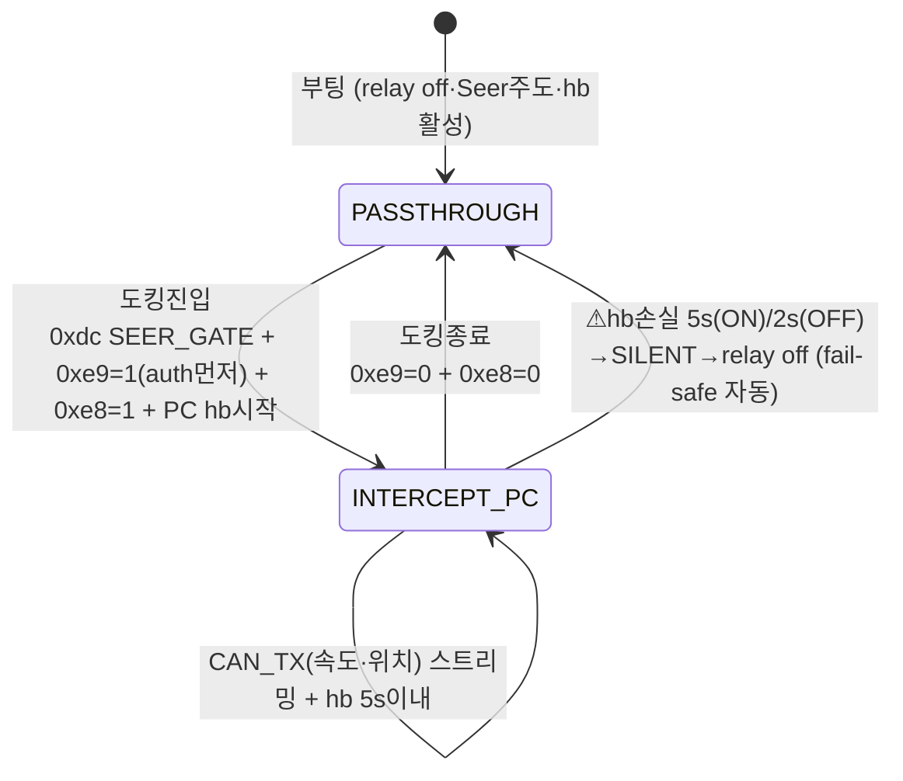

# 릴레이 제어 분리 설계 (#2 — relay ⊥ safety_mode)

> 작성: 2026-07-20 (KST) · 대상: 블랙판다 펌웨어 `26524538` (amap-1 `~/T-Robotics/CAN_Relay/panda`)
> 목적: 릴레이 intercept 상태를 safety mode 종속에서 **독립 런타임 축**으로 분리 → passthrough(노드이동)↔intercept(도킹) 동적 전환.
> 선행: [SW 구조](../sw_structure/panda-relay-firmware/2026-07-20.md) 보완 #2. 근거는 모두 소스 실측(2026-07-20).

---

## 1. 현재 결합 구조 (문제)

릴레이 on/off 가 **두 곳에서 safety mode 에 종속**되어 독립 제어 불가:

| 결합 지점 | 코드 | 문제 |
| --- | --- | --- |
| safety mode switch | `main.c:87-130` — 각 case 가 `set_intercept_relay(...)` 호출 (`SILENT/NOOUTPUT/ELM327`→false, `ALLOUTPUT`/default→true) | 릴레이 = f(safety_mode). 독립 토글 불가 |
| init 하드코딩 | `main.c:396-397` — `heartbeat_disabled=true; set_intercept_relay(true);` | 부팅 즉시 intercept 강제 (fail-safe·passthrough 불가) |
| 메인 루프 | `main.c:405` — `enable_can_transceivers(true)` 매 반복 | 트랜시버 강제 ON (테스트용) |

→ 현재는 "켜면 무조건 intercept + heartbeat 무시" = **평시 passthrough(노드이동)가 구조적으로 불가능**.

---

## 2. 설계 — 릴레이·주도권을 독립 런타임 축으로

safety mode 는 **게이트 훅 선택**만, 릴레이·주도권은 **별도 USB 명령**으로 제어.

### 2.1 신규 상태 변수 (`board/drivers/relay_ctrl.h` 신규)

```c
bool  relay_intercept = false;   // 물리 릴레이: false=passthrough(직결), true=intercept(판다 삽입)
bool  pc_authority    = false;   // 게이트: false=투명중계, true=Seer쓰기차단+가짜ack
```

- 부팅 기본값 = **passthrough + Seer 주도권** (fail-safe: 판다가 개입 안 함).
- `pc_authority` 는 §게이트(seer_gate_fwd_hook)가 읽는 플래그 (PCAN GUI `pc_auth` 이식).

### 2.2 신규 USB vendor request (미사용 번호 실측: `0xe3`,`0xe8~0xef` 비어 있음)

| req | 이름 | wValue | 동작 |
| --- | --- | --- | --- |
| `0xe8` | RELAY_SET | 0=passthrough / 1=intercept | `relay_intercept=wValue; set_intercept_relay(wValue)` |
| `0xe9` | AUTH_SET | 0=Seer / 1=PC | `pc_authority = wValue` |

- 삽입 위치: `usb_comms.h` control switch (기존 `0xdc`=set_safety_mode 패턴 그대로, `usb_comms.h:275`).
- `0xdc`(safety mode)와 **직교** — RELAY_SET 은 safety mode 를 건드리지 않음.

### 2.3 신규 커스텀 safety mode (게이트 훅 — #C 연계)

```c
// safety/safety_seer_gate.h (신규)
SAFETY_SEER_GATE:  can_silent = ALL_CAN_LIVE;   // TX 허용
                   current_hooks = &seer_gate_hooks;  // fwd=게이트
                   // ⚠ set_intercept_relay 호출 안 함 (릴레이는 독립 축)
```

→ safety mode switch(`main.c:87`)에 case 추가하되 **릴레이 토글은 뺀다**(핵심 분리점).

---

## 3. 기존 코드 변경 지점 (실측 file:line)

| # | 파일 | 변경 |
| --- | --- | --- |
| C1 | `main.c:396` | `heartbeat_disabled = true;` **삭제** → heartbeat fail-safe 복원 (사용자 확정) |
| C2 | `main.c:397` | `set_intercept_relay(true);` **삭제** → 부팅 기본 passthrough |
| C3 | `main.c:87-130` | safety switch 의 `set_intercept_relay(...)` 호출 **제거**, 신규 `SAFETY_SEER_GATE` case 추가(릴레이 미개입) |
| C4 | `usb_comms.h:275` 부근 | `0xe8`/`0xe9` case 추가 (RELAY_SET·AUTH_SET) |
| C5 | `can_definitions.h` | `reserved:1 → rtr:1` (#1 RTR 패치 — 별건이나 선행) |
| C6 | `main.c:405` | 트랜시버 강제 ON 은 유지 가능(무해) 또는 board 기본에 위임 — 결정 필요 |

- **주의**: C3 에서 릴레이 토글을 빼면, heartbeat-lost fail-safe 경로(`main.c:240-241`가 `set_safety_mode(SILENT)`)가
  여전히 SILENT case 를 타는데, SILENT case 의 `set_intercept_relay(false)`는 **남겨야** fail-safe 가 릴레이를 내린다.
  → **비대칭 설계**: SILENT/NOOUTPUT case 는 `set_intercept_relay(false)` 유지(fail-safe), SEER_GATE case 만 릴레이 미개입.

---

## 4. 상태 머신 (도킹 1사이클)



| 전이 | USB 시퀀스 |
| --- | --- |
| 도킹 진입 | `0xdc`(SEER_GATE) → `0xe9`=1(auth PC, 먼저) → `0xe8`=1(intercept) → PC heartbeat(`0xf3`) 5s 주기 + `CAN_TX` |
| 정상 종료 | 속도 0 `CAN_TX` → `0xe9`=0 → `0xe8`=0(passthrough) → hb 중단 |
| fail-safe | hb 5s 무전송 → `main.c:240` SILENT → relay off (자동, PC 개입 불필요) |
| 복구 | PC 재개: `0xdc`(SEER_GATE) + `0xe8`=1 재발행 (hb 재개) |

> **⚠ 2026-07-25 실차 반증 — 위 §4 표·mermaid(:82-85)의 `0xf3` heartbeat 전송은 현행 게이트 운용에서 금지** (원문은 이력 보존을 위해 유지)
> 이 시퀀스대로 `0xf3` 를 보낸 것이 **실차 게이트 누출의 근본원인으로 확정**됐다 —
> `docs/can_relay/field-record-orin-nx-2026-07-25.md:102` "**amap2_monitor 가 `0xf3`(heartbeat) 전송** → `heartbeat_disabled=false` 로 되살림(usb_comms.h:448). 이후 별도 스레드 controlWrite(0xf3)가 메인 can_recv 와 USB 단일핸들 경합으로 못 대면 → fail-safe(main.c:248, 임계 2s@ignition off) → `set_intercept_relay(false)`(main.c:88) → **물리 릴레이 OFF(passthrough)** → 게이트 물리 우회 → 누출",
> 같은 파일 `:103` "**수정**: amap2_monitor 게이트/gatecheck 경로 `hb_on=False`(0xf3 미전송). 배포·검증 완료.", `:106` "**heartbeat 는 게이트 동작에 불필요(오히려 미전송이 정답).**"
> → **현행 게이트 운용 = `0xf3` 미전송(hb_on=False).** 위 §4 "도킹 진입" 행의 "PC heartbeat(`0xf3`) 5s 주기"와 mermaid `:82`("PC hb시작")·`:83`("hb 5s이내")·`:85`(hb 손실 fail-safe)는 **이 반증 이후 그대로 따르면 안 된다.**
> **단, 완전 폐기는 아니다** — 같은 파일 `:104` "**debt-004 신규**: docking_drive 는 PC 사망 안전상 heartbeat 유지 필요하나, 별도 스레드 0xf3 전송이 USB 경합으로 실패 가능 → 단일스레드 인터리브/전송확인 재설계 필요." PC 사망 대비 heartbeat 는 **단일스레드 인터리브/전송확인 재설계 후에만 재도입**할 것.
> (⚠ 이 debt-004 는 `CAN-Relay` 저장소 registry 기준 id 로 보이며, 이 저장소 `docs/debt/registry.md:10` 의 debt-004 는 다른 항목이다 — field-record `:92` 의 정정 주석 참조.)

---

## 5. 미해결 / 결정 필요 (⚠)

- **C6 트랜시버 강제 ON 유지 여부** — passthrough 시 판다 트랜시버가 굳이 ON일 필요 있는지(전력·간섭). board 기본 위임 검토.
- **✓ relay_malfunction 트리거 (소스 확정)** — `safety.h:245` — `(safety_mode_cnt > RELAY_TRNS_TIMEOUT) && stock_ecu_detected`
  일 때만 set. `stock_ecu_detected` 는 **차종별 safety 훅**이 세우는 값(우리 `SAFETY_SEER_GATE` 는 세우지 않으면 무관).
  → **우리 모드에서 이 플래그를 안 세우면 게이트가 죽지 않음**. seer_gate 훅에서 `stock_ecu_detected` 미사용 확정하면 해소.
- **✓ heartbeat = `0xf3` (소스 확정)** — `usb_comms.h:404-407` `case 0xf3:` 가 `heartbeat_counter = 0U` 리셋.
  → PC 는 도킹 중 **`0xf3` 를 5s 이내 주기로 전송**하면 됨(신규 정의 불필요, 기존 재사용).
  - > **⚠ 2026-07-25 실차 반증**: 이 "0xf3 를 5s 주기로 전송" 지침을 그대로 따른 것이 게이트 누출의 근본원인이었다(`docs/can_relay/field-record-orin-nx-2026-07-25.md:102`). `0xf3` 전송은 `heartbeat_disabled=false` 로 fail-safe 를 되살리고, 별도 스레드의 0xf3 가 USB 단일핸들 경합으로 지연되면 fail-safe 가 릴레이를 passthrough 로 내려 **게이트를 물리 우회**시킨다. **현행 게이트 운용은 `0xf3` 미전송(hb_on=False)**(같은 파일 `:103`, `:106`). PC 사망 대비 heartbeat 재도입은 단일스레드 인터리브/전송확인 재설계 후(`:104` debt-004).
- **pc_authority 원자성** — 0xe8/0xe9 순서·중간상태(intercept ON인데 auth 아직 Seer) 구간의 프레임 처리. PCAN 은
  `pc_auth.set()` 먼저 후 gate 기동 순서였음 — 도킹 진입 시 **`0xe9`=1(auth PC) 를 `0xe8`=1(intercept) 보다 먼저** 발행해
  intercept 순간부터 게이트가 차단상태이도록 순서 고정(설계 반영: §4 시퀀스 `0xe9` 먼저로 정정 필요).

---

## 6. 요약

릴레이 분리의 본질 = **`set_intercept_relay` 호출을 safety mode switch 밖으로 꺼내 USB 독립 명령(`0xe8`)에 귀속**시키되,
**fail-safe 경로(SILENT case)의 릴레이 off 는 남기는 비대칭 설계**. 변경은 삭제 2줄(C1·C2) + switch 수정(C3) +
USB case 2개(C4)로 작다. #1 RTR 패치와 #C 게이트 훅이 함께 올라가야 도킹이 실동작한다.

## 7. 개발·검증 로드맵 (사용자 확정 2026-07-20)

```
[설계 완료] → [펌웨어 작성] → [PCAN 벤치 테스트] → [실차 테스트]
```

| 단계 | 환경 | 검증 대상 |
| --- | --- | --- |
| 펌웨어 작성 | amap-1 `~/T-Robotics/CAN_Relay/panda` | #1 RTR 패치 → #2 릴레이 분리(본 문서) → #C 게이트 훅 → PC 드라이버(`0xf3` hb + `CAN_TX`) ⚠ **`0xf3` hb 부분은 2026-07-25 실차 반증 — §4 정정 블록 참조**(게이트 경로는 `hb_on=False`, `field-record-orin-nx-2026-07-25.md:102-103,:106`) |
| **PCAN 벤치** (선행) | PCAN 2채널 (2026-07-18 검증 환경) | 릴레이 동적 전환·RTR 통과·Seer 쓰기차단·가짜ack — **실모터 없이 게이트 로직 확정** |
| 실차 | 실 Seer + 실 모터 | 노드이동↔도킹↔반환 왕복, 저속·E-STOP 상비 |

- PCAN 벤치 구성: 한쪽 PCAN = 가짜 Seer(폴링·guard RTR·SDO 쓰기 송신), 다른쪽 = 가짜 모터(응답·guard 응답).
  판다를 두 채널 사이에 삽입해 intercept 전환 시 게이트 동작을 계측 검증.
- 구현 순서(의존성): **#1 → #2 → #C → PC 드라이버**. #1(RTR) 없이는 PCAN 벤치의 guard 검증 불가.
