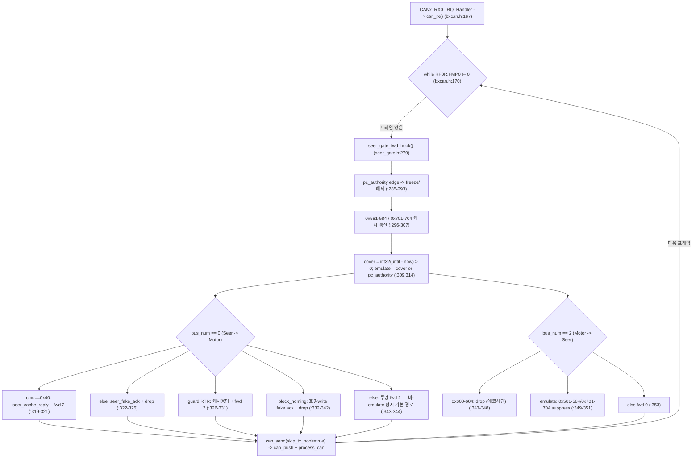
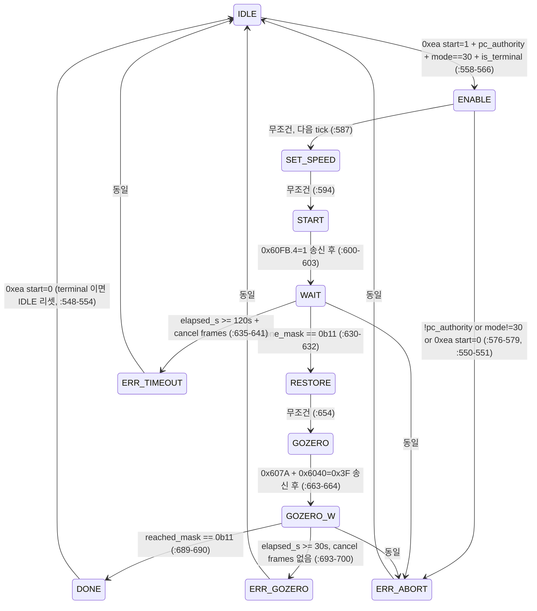

> ⚠ **조향 홈 관련 서술은 2026-08-02 종결 판정으로 갱신됐다. 아래 원문은 이력으로 보존한다.**
> 정본: `docs/verified_facts/2026-08-02-steer-home-closed.md`
> (값 정본은 `src/Comm/CAN/can_relay/config/machine/foil_a082.yaml` 의 `steer_home_counts`)
>
> #### ❌ 정정 2026-08-03 — 아래 2026-08-02 블록의 0° 값과 「구값 폐기」 판정은 실측으로 반증됐다
>
> - **조향 0° 채택 정본 = `[7871815, 7840086]` (실측 역산 추정치는 `[7871816, 7840087]` — 1c 차, 근거로만 인용)** (node3 / node4). **실측 확정 2026-08-03 11:44** —
>   `Tools/docking_field_kit/orin_steer_crosscheck.py`, 판다 **SILENT · passthrough**,
>   **송신 0건**(AST 검사), **사용자 확인 Seer 표시 0°**, 2회 독립 실행 동일.
>   - node3: CAN `0x6064` 7,871,823 + Seer −0.000° → **7,871,816**
>   - node4: CAN `0x6064` 7,840,052 + Seer +0.001° → **7,840,087**
>   - 근거: `docs/homing/2026-08-03-can-relay-homing-assets.md` §10
> - **0° 는 raw CAN 판독값이 아니다** — `0° = CAN_0x6064 + Seer_deg × 57344` 로 역산해야 한다.
>   2026-08-02 종결은 이 식을 §4-2 에 적어 놓고도 **채택값에 적용하지 않고 raw 판독값을 0° 로 박았다.**
>   node3 은 오차 6c 라 드러나지 않았고 node4 는 **193c** 로 드러났다.
> - ⇒ 폐기 선언됐던 구값 **`[7871815, 7840086]` 이 양 노드 모두 1 count 이내로 맞다.**
> - ⇒ 「구값은 **출처 없는 값**」 판정도 **철회** — 출처는 **Seer 가 실시간으로 내는 `0x607A` 조향 목표**다.
> - ⚠ **과장 금지**: node4 차이 193c = **0.0034°** 로 **거동상 무의미**하다.
>   안전 문제가 아니라 **정본 정확성** 문제다.
> - **`7882020 / 7859062`(`SEER_HOME_ZERO_N3/N4`)는 이번 정정 대상이 아니다.**
>   값은 **그대로 둔다**. 다만 이것을 「조향 0°」·「홈」이라 부르는 **라벨이 틀렸다** —
>   **호밍 후 정착 목표(GOZERO)** 이며 실측 0° 기준 **+0.178° / +0.331°** 벗어나 있다
>   (구 정본 `7839894` 로 계산하면 +0.331°). 상수 이름이 `ZERO` 인데 0° 가 아니라는
>   **불일치가 코드에 남아 있다** — 본 정정에서 코드는 변경하지 않는다.
>
> #### ❌ 정정 2026-08-03 15:40 — **바로 위 08-03 11:44 정정본의 「근거」가 무효화됐다 (값은 유지)**
>
> 정본: `docs/homing/2026-08-03-can-relay-homing-assets.md` **§0**. 아래와 어긋나는 서술은 무효다.
>
> - **「판다 SILENT·passthrough 이므로 CAN 과 Seer 가 독립 경로」·「2회 독립 실행 동일」·
>   「사용자 확인 Seer 표시 0°」는 근거가 되지 못한다(인용 금지).**
>   조향을 실제로 90°(크랩) 움직여 대조한 결과 Seer 두 채널 모두 **`0x6064` 유래**다 —
>   **1040 기울기 ×57,344 = 1.000001**, **1005 = 1.000130**(Seer 자체 130 ppm 스케일 보정).
>   ⇒ **CAN↔Seer 독립 교차검증은 성립하지 않으며**, 역산 `0° = CAN + Seer°×57344` 는 **항등식**이다.
> - **값은 유지된다** — 조향 0° = **`[7871815, 7840086]`**. 다만 그 지위는 「물리 0° 실측」이 아니라
>   **「Seer 좌표계의 조향 영점」**이다. **물리적 직진과 같은지는 미확인**이고, 非-Seer 앵커는 여전히 부재다.
>   내비게이션이 Seer 좌표계를 쓰므로 이 값을 채택하는 공학적 결정은 그대로 옳다.
> - **`steer_counts_per_deg = 57,344` 는 실측 확정** — 제어권 보유 국면에서 지령각→CAN `0x6064` 기울기가
>   node3 **1.000000** · node4 1.000005. 부호 `CAN +` ↔ `Seer −` 도 같은 실측으로 확정.
> - **`SEER_HOME_ZERO_N3/N4`(7882020 / 7859062)는 값이 옳다** — 호밍 10회 실측 정착값 중앙이
>   node3 **7,882,021** · node4 **7,859,065**(σ≈3 c)로 **1~3 counts 일치**한다. 틀린 것은 **이름뿐**이며,
>   조향 0° 대비 **+0.178° / +0.331°** 편차는 **결함이 아니라 설계 동작**이다(→ §함수표 #221·222, H1 재현 B).
> - **호밍은 정상 동작한다** — 2026-08-03 15:33~15:40 `--repeat 10` **10/10 DONE**, 소요 **35.0 s**,
>   10회 모두 DI `0x01`→`0x09`(bit3 = −Limit) 전이 관측 ⇒ **리밋 스위치 실재**, `0x6098` Homing_method **= 1**.
>   09:58 `ERR_TIMEOUT` 1회 이후 **12회 연속 성공**했고 재현되지 않는다.
>
> #### ❌ 재정정 2026-08-03 17:00 — **바로 위 15:40 블록의 수치·판정 오류 7건** (원자료 직접 재계산)
>
> 원문은 삭제하지 않는다. 아래가 우선한다. 재계산에 쓴 원자료(문서가 아니라 로그·소스를 직접 파싱):
> `Log/home_experiment_260803_153319_summary.json`(10 런) · `Log/home_experiment_260803_09{1956,5815}_summary.json` ·
> `Log/homing_edge_260803_{144305,144602,152520}.json` · `Log/steer_two_phase_260803_131305.jsonl` ·
> `Log/homing_capture_220350.jsonl` · `board/safety/safety_seer_gate.h` ·
> `src/Comm/CAN/can_relay/config/machine/foil_a082.yaml`.
>
> 1. **「12회 연속 성공」 → 「12회」.** 오늘 호밍 FSM 을 **개시한** 시도는 **13회**이고 **성공 12 · 실패 1** 이다.
>    성공 12 = 14:46 1회(`homing_edge_260803_144602.json`, `accepted=true`·`final_state=5`)
>    + 15:25 1회(`homing_edge_260803_152520.json`, 동일) + 15:33 **10회**.
>    실패 1 = 09:58 (`home_experiment_260803_095815_summary.json` `final_state=6` = `ERR_TIMEOUT`,
>    `elapsed=120.26`; 상태 이름은 `Tools/docking_field_kit/orin_home_experiment.py:59-61`).
>    나머지 오늘 로그(09:19 `repeat=0` · 14:19 진단 · 14:43~14:45 5건 · 15:29)는 `fsm_trace` 가 비어 있어
>    **호밍을 개시하지 않았다** — 시도로 세지 않는다.
>    ⚠ **「15:33 기준선」은 호밍이 아니라 레지스터 스냅샷**이다
>    (`orin_home_experiment.py:390` `base = snapshot(rig, "baseline")`) — 이것을 1회로 세어 13이 됐다.
>    ⚠ **「10회 연속 10/10」 자체는 유효**하다. 바꾸지 않는다.
> 2. **「35.0 s」 → 평균 35.07 s · 중앙값 35.05 s.** 10 런 `elapsed`(s) =
>    35.16 / 35.05 / 35.04 / 35.02 / 35.15 / 35.11 / 35.01 / 35.02 / 35.13 / 34.99
>    → 평균 **35.068**, 중앙값 **35.045**, 범위 34.99~35.16(폭 **0.17**). **범위·폭 0.17 은 정확**하다.
>    (참고 — 「WAIT 31.7 s」로 인용하지 말 것: 10 런의 WAIT(`state 4`→`8`) **체류**는 평균 **31.30 s**
>    (31.21~31.38)이고, **31.69 s** 는 개시~RESTORE(`state 8`) **절대시각**이다.)
> 3. **「σ≈3 c」는 기준 미표기.** 정착값의 σ 2.80(node3) / 3.21(node4)은 **모표준편차** 기준이며,
>    **표본표준편차는 2.95 / 3.38** 이다. 분포 자체는 이산 2값이다 —
>    node3 7,882,021 ×8 · 7,882,014 ×2 / node4 7,859,065 ×7 · 7,859,058 ×3.
> 4. **「결함이 아니라 설계 동작이다」는 과잉 확정** → **「재현되는 정착 동작(상수 적정성은 debt-016)」**.
>    실측이 보증하는 범위는 **「호밍 후 위치가 펌웨어 상수 `SEER_HOME_ZERO_N3/N4`
>    (`board/safety/safety_seer_gate.h:212-213`, 7882020 / 7859062) 근방에 재현성 있게 정착한다」** 까지다.
>    상수 대비 편차는 node3 **+1 c**(8/10) · **−6 c**(2/10), node4 **+3 c**(7/10) · **−4 c**(3/10)
>    ⇒ **최빈 모드 1~3 c, 최대 6 c**. **상수값이 적정한가는 실측 밖**이며
>    debt-016(「영구 미검출 오프셋」)과 충돌한다 — 「설계 동작이므로 옳다」로 닫지 말 것.
> 5. **`counts/°` 는 노드별로 다르다** — node3 **57,344.0**(배율 1.000000) · node4 **57,344.3**(1.000005).
>    근거: `Log/steer_two_phase_260803_131305.jsonl` phase A 5점(−5 / −2.5 / 0 / +2.5 / +5°)의
>    지령각→`0x6064` 최소제곱 기울기. 「57,344」 단일값 표기는 node4 의 +0.3 을 뭉갠다.
>    (config 의 `steer_counts_per_deg: 57344.0` 은 `foil_a082.yaml:20`, 값 변경 대상 아님.)
> 6. **조향 0° `[7871815, 7840086]` — 값은 정본 유지**(`foil_a082.yaml:134`), **근거 서술은 강등**한다.
>    ⇒ 지위는 **「공학적 채택값」**이며 **「실측 확정」 표현을 쓰지 말 것**(위 8행·36-38행 포함).
>    - 「1040 역산」은 **항등식이라 무효** — 1040 은 `0x6064` 의 아핀 변환이다
>      (`Tools/docking_field_kit/orin_steer_crosscheck.py:155-162`).
>    - 「Seer 실시간 `0x607A` 지령이 출처」는 **선택 인용**이다. `Log/homing_capture_220350.jsonl` 의
>      node3 `0x607A` 쓰기 **6,464건 중 `7,871,815` 는 145건(2.2%)** 뿐이고,
>      **`7,882,020`(GOZERO)이 6,319건(97.8%)** 이다(node4 도 같은 비율: `7,840,086` 145 / `7,859,062` 6,319).
>      즉 그 캡처에서 지배적인 실시간 지령은 0° 후보가 아니라 GOZERO 상수다.
> 7. **`0x6064`=0 은 「단 1회·재현 안 됨」이 아니다 — 재현된다.** SDO 응답(`0x583`/`0x584`, `43 64 60 00`)
>    직접 집계: 09:19 **50/50** · 09:58 node3 **12,220/12,220**·node4 **12,211/12,211** ·
>    10:08 `Log/seer_homing_260803_100813.jsonl` **전량 10,327/10,327**(양 노드) ·
>    리부팅 후 14:43 `homing_edge_260803_144305_can.jsonl` 에도 node3 2/74 · node4 2/68.
>    **다만 인과는 미판정**이다 — 0 이 관측되는 조건에서도 호밍은 12회 성공했다.
>    「0 이라서 호밍이 안 된다」도 「0 이어도 무관하다」도 **양쪽 미판정**이다.
>
> **↓ 이하 2026-08-02 원문(이력 보존 — 충돌 시 위 정정이 우선한다)**
>
> - 홈(0°) = **`[7871810, 7839894]`** — 직진 자세 실측(A무리). 세 경로 교차확인.
>   - ❌ **정정 2026-08-03**: node4 `7839894` 는 실측 0° 대비 **−193c**. 0° 채택 정본은 `[7871815, 7840086]`(실측 역산 추정 `[7871816, 7840087]`).
> - 구값 `7871815 / 7840086` 은 **틀린 값이 아니라 출처 없는 값**이었다 —
>   실측과 5c(**0.00009°**) / 192c(**0.0033°**) 차이로 거동상 동일하다.
>   - ❌ **철회 2026-08-03**: 출처가 **있다**(Seer 실시간 `0x607A`). 그리고 실측 0° 와 **1c 이내로 맞다** —
>     「출처 없는 값」이라는 판정 자체를 철회한다.
> - **`7882020 / 7859062` 는 홈이 아니다** — 「**호밍 후 정착값**」(B무리)이며 0° 에서
>   **+0.178° / +0.332°** 벗어나 있다. **호밍은 조향을 0° 에 정확히 놓지 않는다.**
>   이 둘을 모두 "조향 홈"이라 부른 것이 4주간 재실험 반복의 원인이었다.
>   - ✅ **판정 유효**(2026-08-03 재확인). 편차만 실측 0° 기준으로 재계산 → **+0.178° / +0.331°**.
>     **`+0.332°` 는 폐기값이니 인용하지 말 것**(`+0.334°` 도 동일). 15:40 호밍 10회 실측 정착값
>     node3 **7,882,021** · node4 **7,859,065**(σ≈3 c)가 이 상수와 1~3 c 일치 ⇒ **설계 동작**으로 확정.
>     - ❌ **재정정 2026-08-03 17:00**: ① σ 은 **모표준편차 2.80(node3)/3.21(node4)** 기준이다
>       (표본 2.95/3.38). ② 「1~3 c 일치」는 **최빈 모드**만이다 — 상수 대비 편차는
>       node3 +1 c(8/10)·**−6 c**(2/10), node4 +3 c(7/10)·**−4 c**(3/10)로 **최대 6 c**.
>       ③ **「설계 동작으로 확정」은 과잉 확정** ⇒ **「재현되는 정착 동작(상수 적정성은 debt-016)」**.
>       근거·상세는 위 「재정정 2026-08-03 17:00」 §3·§4.
> - `debt-007` 은 **종결**(2026-08-02). 「미판정 · 값 변경 금지」 서술은 더 이상 유효하지 않다.
> - Seer 각도와 CAN counts 는 **음의 상관** — 0° 역산은 `CAN + Seer° × 57344`.
>   - ✅ **유효** — 2026-08-03 실측이 바로 이 식으로 0° 를 확정했다. 종결 문서가 이 식을 **쓰지 않은 것**이 오류였다.
## 2026-07-28 (KST) — CAN Relay firmware 리뷰

> ## ⚠ 줄번호 유효성 고지 (2026-07-28 19:0x 추가)
>
> **본 리뷰의 `safety_seer_gate.h:NNN` 인용 약 317건은 리뷰 시점 코드 기준이며, 현행 파일과 어긋난다.**
> 리뷰 후 같은 날 두 변경이 적용돼 파일이 **731줄 → 475줄**로 줄었기 때문이다.
>
> | 변경 | 내용 | 근거 |
> |---|---|---|
> | ① 기능 | 호밍 속도 범위 검증 추가 | `docs/adr/2026-07-28-homing-speed-clamp.md` (Accepted, 실기 검증 완료) |
> | ② 기능 | `0xec`(`seer_block_homing`·`seer_is_homing_write`) **제거** | `docs/adr/2026-07-28-0xec-rationale-void.md` (Accepted, 안 A) |
> | ③ 서술 | 펌웨어 전체 주석 **2,048건 제거**(87파일) | `panda.bin`·`panda_h7.bin` **바이트 동일** 확인 → 기능 무변경 |
>
> **인용을 따라가려면 리뷰 시점 원본을 보라**:
> `Tools/Can_Relay/panda-firmware/docs/history/pre-strip-2026-07-28/safety_seer_gate.h.orig` (731줄)
> — 단 이 스냅샷은 ①이 이미 반영된 상태이고 ②는 반영 전이다.
>
> **현행 대응 줄번호**(주요 심볼): `seer_gate_fwd_hook` :128 · `seer_cache_reply` :73 ·
> `seer_freeze_snapshot` :61 · `seer_is_motion_obj` :68 · `seer_homing_cmd` :315 · `seer_homing_tick` :340
>
> **영향받지 않는 것**: 결함의 실체·severity·근거 논리는 그대로 유효하다. 어긋나는 것은 위치 인용뿐이다.
> 다만 §High 의 `seer_is_homing_write` 값검사 결함(H4)은 **코드가 제거돼 소멸**했다.
>
> #### ❌ 정정 2026-08-03 15:40 — **줄번호가 한 번 더 밀렸다 + 펌웨어 변경 1건**
>
> `board/safety/safety_seer_gate.h` 는 현재 **552줄**(md5 `d3e23f76f3eadd82700e7c6f784eb22f`, 2026-08-03 확인)이다.
> 위 「현행 대응 줄번호」(475줄 시점)도 이미 낡았다. **2026-08-03 실측 확인한 현행 위치**:
> `seer_gate_fwd_hook` **:131** · `seer_cache_reply` **:76** · `seer_freeze_snapshot` **:64** ·
> `seer_is_motion_obj` **:71** · `seer_home_cancel_frames` **:312** · `seer_homing_cmd` **:330** ·
> `seer_homing_tick` **:356** · `SEER_HOME_ZERO_N3/N4` **:212-213**.
>
> **변경 내용(2026-08-03)**: `SEER_HOME_WAIT` 에 **「이미 홈」 종료 조건**이 추가됐다 —
> 상수 `SEER_HOME_ATHOME_S`(`:221`), 전역 `seer_home_athome_mask`(`:247`), 판정부(`:421-454`).
> **범위를 정확히 적는다**:
> - **무해함은 실증됐다** — 추가 후 호밍 10회 연속 정상 완주(35.0 s), 정상 경로를 건드리지 않았다.
>   - ❌ **재정정 2026-08-03 17:00**: 소요는 **평균 35.07 s · 중앙값 35.05 s**(34.99~35.16)다.
>     「35.0 s」로 반올림해 인용하지 말 것. 근거는 위 「재정정 2026-08-03 17:00」 §2.
> - **필요성은 미확인** — 10회 실측에서 이 경로는 **한 번도 발동하지 않았다**(매회 bit15 하강 에지가
>   정상 발생해 `seen_active` 가 섰다). 「드라이브가 무동작 즉시 완료」 상황은 아직 관측된 적이 없다.
> - ⇒ **「이 수정이 09:58 실패를 고쳤다」고 주장하지 않는다.** 방어적 보험으로 존치할 뿐이다.


리뷰 대상: `Tools/Can_Relay/panda-firmware/board/**` 중 **본 프로젝트가 작성한 부분**(comma.ai upstream 드라이버·USB 스택·부트스텁·crypto 는 범위 밖).
수행: 10-에이전트 병렬 감사(A1~A10) + 오케스트레이터 1차자료 재검증. 사용자 지시 "can relay firmware 코드 분석 해주세요. 10명 투입".

### 코드 버전

펌웨어 트리는 **git 미추적**(`git ls-files Tools/Can_Relay` → 0건)이므로 **파일 내용 해시**로 고정한다.

| 파일 | md5 |
|---|---|
| `board/safety/safety_seer_gate.h` | `6c0b1b059e180abc00083330c3104529` |
| `board/usb_comms.h` | `1b714015a763a095ddd8a625894a60f4` |
| `board/main.c` | `72ee77bb1d130578e2867ae169580206` |
| `board/safety.h` | `eb46492e0bb43d1e8f414d5e0c71c35b` |
| `board/health.h` | `7b3e986ff596ff4bd39a25bfb0acd958` |
| `board/safety_declarations.h` | `89612f0cd856683f087d0f9eefa9486a` |
| `board/drivers/can_common.h` | `e71376e7a8fff13e6eec87ea5e22c49f` |
| `board/can_definitions.h` | `329a2df6387c4561a3fe81fb386f81bb` |
| `board/drivers/bxcan.h` | `d904eb6cbac6b0c15036b8dc891355c7` |

- 저장소 HEAD: `cd7886d` (branch `main`) — 펌웨어 소스는 이 커밋에 포함되지 않는다.
- upstream 기준점: comma.ai panda `26524538`. 자작 1차 커밋 `08c23b53`(2026-07-24, 번들 `Tools/Can_Relay/panda-canrelay.bundle` 의 `can-relay-docking` 브랜치). 그 이후 변경분은 **git 밖 워킹트리에만** 존재.
- 빌드 산출물: `board/obj/panda.bin.signed` 30,268 B, 내부 버전 문자열 `DEV-d98bc1a5-DEBUG`.
- 직전 리뷰: **없음**(최초 리뷰 — Core 5항목 전체 작성, delta 아님).

### 분석 분기 명시

- 분기: **전체 구조 분석**(다중 파일·다중 진입점)
- 감지된 도메인: **embedded-review + concurrency** (ros2 해당 없음)
- 도메인 근거: `IRQHandler`·`NVIC_`·STM32 HAL 레지스터 접근·`.ld` linker script 2종(`board/stm32fx/stm32fx_flash.ld`, `board/stm32h7/stm32h7x5_flash.ld`) → embedded-review. ISR↔ISR 공유 가변 상태 다수 → concurrency.

---

# Core 인벤토리

## 1. 목적

comma.ai 블랙판다(STM32F413, upstream `26524538`)를 **AMR 전용 CAN 릴레이**로 개조한 펌웨어다. 물리적으로 Seer 컨트롤러(bus0=CAN1)와 동익 4축 모터 드라이버(bus2=CAN3) 사이에 판다의 하네스 릴레이를 인라인 삽입하고, 릴레이 상태를 upstream 의 `safety_mode` 종속에서 떼어내 **독립 런타임 축**으로 만든다(`board/usb_comms.h:406-409` `0xe8`, `:410-412` `0xe9`). 평시(passthrough)에는 Seer↔모터가 하드웨어로 직결되고, 도킹 시에는 intercept + "Seer 게이트"로 전환되어 PC 가 모터를 직접 구동하는 동안에도 Seer 는 계속 만족한 상태로 유지된다. 설계 정본 `docs/can_relay/relay-separation-design.md:23-56`, 트래픽 사양 `docs/can_relay/2026-07-07-design-inputs.md:11-45`(250 kbps classic CAN, CANopen SDO 폴링, 노드 1·2 구동 / 3·4 조향, Node Guarding RTR).

게이트 본체는 자작 safety 모드 `SAFETY_SEER_GATE`(=30, `board/safety.h:56`, 등록 `:273`)의 fwd 훅 `seer_gate_fwd_hook()`(`board/safety/safety_seer_gate.h:279-359`)이다. `emulate = cover || pc_authority`(`:314`) 조건에서 ① Seer→모터 SDO 읽기(`0x40`)는 캐시로 즉답 + 모터로도 forward(`:319-321`), ② 그 외 **모든** 0x601~604 프레임은 drop + 가짜 ack 합성(`:322-325`), ③ Node Guard RTR 은 캐시 응답 + forward(`:326-331`), ④ 모터 실응답(0x581~584)·guard 응답(0x701~704)은 Seer 로 suppress(`:346-354`)한다.

여기에 자작 기계 셋이 얹혀 있다 — **전환 커버**(`SEER_COVER_US 300000U`, `:59`), **freeze 스냅샷**(`:102-103`, `:145-151`; pc_authority 상승에지에 캐시를 복사해 모션 객체 `{0x6064, 0x606C, 0x6078, 0x6041}`만 정지값으로 응답 → Seer 추종오차 경보 55602 예방), **조향 호밍 시퀀서**(`:361-709`, 8 Hz 상태기계; PC 가 게이트를 잡으면 Seer 쓰기가 drop 되어 아무도 호밍을 개시 못 하는 공백을 판다가 직접 메운다). 부수적으로 upstream 에 없던 RTR 지원(`board/can_definitions.h:5` + `board/drivers/bxcan.h:153,182,197`)과 per-bus CAN 에러 가시성 `0xc3 can_health`(`board/health.h:28-38`, `board/usb_comms.h:46-73`)가 추가됐다.

**구조적 사실 (평가 전제)**: 자작 로직은 **100% 인터럽트 컨텍스트에 상주**한다. `main()` 의 `for(;;)`(`board/main.c:425-478`)는 LED 페이드·`enable_can_transceivers(true)`·power-save/deepsleep 진입(`:458-473` — `usb_soft_disconnect`, `exti_irq_init()`, `rtc_wakeup_init()`, STOP 모드 SLEEPDEEP)·`__WFI()` 이며, 게이트/캐시/호밍 어느 것도 만지지 않는다(루프 전문에서 `seer_*` 심볼 접촉 0건). 즉 "큐 → 메인 루프 처리" 단계가 존재하지 않고, 게이트 판정·캐시 응답·TX(Transmit) enqueue 가 전부 CAN RX(Receive)0 ISR 안에서 끝난다.

### 문서 대비 코드가 정본인 지점 (불일치)

| # | 문서 서술 | 코드 실제 | 근거 |
|---|---|---|---|
| a | 게이트가 막는 것은 "0x23/27/2B/2F 쓰기", "응답은 통과" (`safety_seer_gate.h:2-3` 원 주석) | `cmd == 0x40` 이 **아닌 모든** 프레임 drop. abort(0x80)·세그먼트까지 포함. emulate 중 모터 실응답도 Seer 로 안 감 | `safety_seer_gate.h:317-325, 349-351` (파일 내 정정 `:11-21` 이 이미 기록) |
| b | 게이트 발동 조건 = `pc_authority` | `emulate = cover \|\| pc_authority`. `0xe8` 은 **wValue 와 무관하게**(disengage 포함) 300 ms 커버를 건다 | `safety_seer_gate.h:309,314`; `usb_comms.h:406-409` |
| c | "어떤 이상 상태에서도 릴레이가 intercept 로 남지 않는다(fail-open)" — `docs/adr/2026-07-27-panda-boot-bitrate-and-failsafe.md:112` (**원문은 이미 취소선 처리**, `:116-117` 에 "heartbeat 상실 경로에 한해" 자체 정정 기록 존재) | fail-open 은 heartbeat 타임아웃 분기 **1곳뿐**. `case SAFETY_SEER_GATE` 는 릴레이 미조작, `default` 는 오히려 `set_intercept_relay(true)` | `main.c:236-238,262-263 / :124-131 / :132-133` |
| d | ADR Decision 4 "펌웨어 소스를 git 에 커밋" — 동 ADR `:138` | **미완료** — `git ls-files Tools/Can_Relay` → 0건 | 실행 확인 2026-07-28 |
| e | `usb-can-mapping-table.md:38,73` 이 E-STOP 을 구현된 것처럼 기재 | 펌웨어에 E-STOP 상당 명령 **부재** (`grep -rni "estop\|emergency" board/` → 0건) | `usb_comms.h` 자작 명령 5종에 없음 |
| f | `docs/adr/2026-07-24-canhealth-firmware.md:29` "REC(23:16) TEC(31:24)" | 벤더 CMSIS 가 정반대. **⚠ 이 행만은 코드가 정본이 아니다** — 펌웨어(`usb_comms.h:70-71`·`health.h:35-36`)도 ADR 과 **동일한 스왑을 공유**하므로 ADR·코드 둘 다 틀렸고 정본은 벤더 헤더다(→ §High #101 참조) | `board/stm32fx/inc/stm32f413xx.h:2022,2025` |

> **표 제목 단서**: 위 표는 "문서 대비 코드가 정본"을 전제로 하나 **row f 는 예외**다(코드도 함께 틀림). 요약만 읽고 코드를 신뢰하지 말 것.

## 2. 코드 플로우차트

**다중 진입점 분리 룰 적용** — 진입점을 코드로 확정한 뒤 path 별 흐름도 4종 + 공통 호출 그래프 1종을 작성했다.

**진입점 — 상시 활성** (등록 위치 기준):

| 진입점 | 정의 | 등록 | 자작 코드 도달 |
|---|---|---|---|
| `main()` | `board/main.c:341` | — | 부팅 3줄(`:419-420`, `:426`) |
| `tick_handler()` (8 Hz) | `board/main.c:169` | `board/main.c:405` | **`seer_homing_tick()` `:177`**, heartbeat fail-safe `:262-263` |
| `CAN1·2·3_RX0_IRQ_Handler` → `can_rx()` | `board/drivers/bxcan.h:167` | `board/drivers/bxcan.h:217,221,225` | **`seer_gate_fwd_hook()` (`:190` 경유)** |
| `CANx_TX_IRQ_Handler` → `process_can()` | `board/drivers/bxcan.h:100` | `board/drivers/bxcan.h:216,220,224` | 자작 RTR 1줄(`:153`) |
| `CANx_SCE_IRQ_Handler` → `can_sce()` | `board/drivers/bxcan.h:72` | `board/drivers/bxcan.h:218,222,226` | 없음 |
| `OTG_FS_IRQ_Handler` → `usb_cb_control_msg()` | `board/usb_comms.h:109` | `board/stm32fx/llusb.h:23` → `board/drivers/usb.h:655` → `:642` | **자작 명령 6종** |
| `interrupt_timer_handler` (1 Hz) | `board/drivers/timers.h:20` | `board/drivers/interrupts.h:91` ← `board/main.c:343` **무조건 호출** | 없음 |
| `USART1_IRQ_Handler` + `DMA2_Stream5_IRQ_Handler` | `board/stm32fx/lluart.h:197,207-208` | `board/main.c:382\|385` (`uart_init(&uart_ring_gps,…)` — **if/else 양쪽 분기 모두**) | 없음 |

**조건부 등록**: `USART2`(`board/main.c:376-379`, 외부 디버그 시리얼 시) · `USART3`/`UART5`(`:388-393`, `has_lin` 시) · `TIM12`(gmlan, `board/drivers/gmlan_alt.h:128`) · `TIM5`(kline, `board/drivers/kline_init.h:5`) · `EXTI2`(fan, 보드 의존).

**정의 ≠ 등록 주의**: `EXTI_IRQ_Handler` 는 정의 `board/main.c:309` / 등록 `board/stm32fx/llexti.h:16,29,36`. `RTC_WKUP_IRQ_Handler` 는 정의 `board/main.c:325` / 등록 `board/main.c:469`(**deep-sleep 진입 경로에서만**).

**drawio 동반**: 같은 폴더 `2026-07-28-flow.drawio` (단일 `<mxfile>` 안에 `<diagram>` 5개).

| `<diagram name>` | 박스 | 화살표 |
|---|---|---|
| `1-can-rx-path` | 56 | 70 |
| `2-usb-control-path` | 36 | 54 |
| `3-tick-path` | 28 | 34 |
| `4-homing-state-machine` | 14 | 31 |
| `5-common-call-graph` | 50 | 83 |
| **합계** | **184** | **272** |

**정확성 검증 (오케스트레이터가 직접 재실행)**: ① `xml.etree.ElementTree.parse()` 성공 = well-formed ② 전 다이어그램 **dangling 0** ③ mermaid 노드 집합 == drawio 박스 id 집합, mermaid 엣지 multiset == drawio (source,target) multiset, 5/5 일치.

**③ 의 검증 대상 명확화 (중요)** — ③ 은 **`flow-src/mermaid-*.mmd` 5개**(생성기 `flow-src/gen.py` 가 단일 정본 그래프에서 drawio 와 동시 출력한 전체본)에 대한 것이다. **아래 §2-1·§2-2 본문 mermaid 는 별도 작성한 요약본**이라 drawio 와 노드 id·개수가 다르다(§2-1 요약 16노드 ↔ drawio `1-can-rx-path` 56노드, §2-2 요약 12상태 ↔ drawio `4-homing-state-machine` 14노드 = 12상태 + 보조 2). 요약본에는 ③ 이 적용되지 않는다.

**재현 방법**: `python3 docs/code_review/can_relay_firmware/flow-src/verify.py` (실행 디렉터리 무관 — 스크립트가 자기 위치 기준으로 `.mmd`·drawio 를 찾는다) → `TOTAL: boxes=184 arrows=272` / `RESULT: PASS - XML well-formed, 0 dangling, mermaid<->drawio 1:1`.

> **[품질] 자체 정정 기록**: 최초 판의 `verify.py` 는 스크래치패드 절대경로가 하드코딩돼 있어 **저장소 사본이 아닌 임시 사본을 검증**하고 있었다(2026-07-28 감사에서 발견). 경로를 스크립트 위치 기준으로 상대화해 저장소 안에서 재현 가능하게 고쳤다. 같은 감사에서 §2-2 의 `terminal → IDLE` 전이 4개가 `.mmd`·drawio 양쪽에 누락된 것도 함께 보정했다(diagram 4: 27→31 엣지).

### 2-1. CAN RX 경로 (요약)



| 노드 id | 라벨 | 파일:line |
|---|---|---|
| `RX_ISR` | CANx_RX0_IRQ_Handler → can_rx() | `board/drivers/bxcan.h:217,221,225 → :167` |
| `RX_FMP` | FIFO 드레인 루프 | `board/drivers/bxcan.h:170` |
| `GATE` | seer_gate_fwd_hook() | `board/safety/safety_seer_gate.h:279` |
| `EDGE` | pc_authority 에지 → freeze/해제 | `board/safety/safety_seer_gate.h:285-293` |
| `CACHE` | 응답·guard 캐시 갱신 | `board/safety/safety_seer_gate.h:296-307` |
| `EMU` | cover·emulate 판정 | `board/safety/safety_seer_gate.h:309,314` |
| `B0` | bus0 분기 | `board/safety/safety_seer_gate.h:316` |
| `B0R` | 읽기 → 캐시 즉답 + fwd 2 | `board/safety/safety_seer_gate.h:319-321` |
| `B0W` | 그 외 → 가짜 ack + drop | `board/safety/safety_seer_gate.h:322-325` |
| `B0G` | guard RTR → 캐시응답 + fwd 2 | `board/safety/safety_seer_gate.h:326-331` |
| `B0H` | block_homing 선별 drop | `board/safety/safety_seer_gate.h:332-342` |
| `B0T` | else 투명 forward (비-emulate 평시 기본) | `board/safety/safety_seer_gate.h:343-344` |
| `B2` | bus2 분기 | `board/safety/safety_seer_gate.h:346` |
| `B2E` | PC 명령 에코 차단 | `board/safety/safety_seer_gate.h:347-348` |
| `B2S` | emulate 중 실응답 suppress | `board/safety/safety_seer_gate.h:349-351` |
| `B2T` | 투명 forward | `board/safety/safety_seer_gate.h:353` |
| `SEND` | can_send(skip_tx_hook=true) | `board/drivers/can_common.h:236-244` |

전체 5종의 노드·엣지 전수 매핑은 `2026-07-28-flow.drawio` 각 박스 `value` 에 `"<라벨> | <file:line>"` 형식으로 내장돼 있다.

### 2-2. 호밍 시퀀서 상태 머신 (요약)



> **요약본 각주 (전체본은 `flow-src/mermaid-4-homing-state-machine.mmd`)**: ① `ERR_ABORT` 전이는 `:576-579` 가드가 switch **앞**에 있어 **비-terminal 7개 상태 전부**에 적용된다(위 요약은 3개만 표시). ② 재시작(`→ ENABLE`)은 `:560` 인터록이 `is_terminal` 이므로 **DONE·ERR_TIMEOUT·ERR_ABORT·ERR_GOZERO 에서도** 가능하다(요약은 IDLE 만 표시). ③ `default:`(`:705-707`) → `ERR_ABORT` 방어 전이 존재.

| 노드 id | 라벨 | 파일:line |
|---|---|---|
| `IDLE`/`ENABLE`/`SET_SPEED`/`START`/`WAIT` | 0/1/2/3/4 | `board/safety/safety_seer_gate.h:430-434` |
| `DONE`/`ERR_TIMEOUT`/`ERR_ABORT` | 5/6/7 | `board/safety/safety_seer_gate.h:435-437` |
| `RESTORE`/`GOZERO`/`ERR_GOZERO`/`GOZERO_W` | 8/9/10/11 | `board/safety/safety_seer_gate.h:438-441` |
| 전이 본체 | `seer_homing_tick()` switch | `board/safety/safety_seer_gate.h:582-708` |

## 3. 함수 리스트

### 3-1. `board/safety/safety_seer_gate.h` (전수 23개, 함수형 매크로 0개)

| # | 함수 | 입력 | 출력 | 기능 | 위치 |
|---|---|---|---|---|---|
| 1 | `seer_is_homing_write` | `CANPacket_t *f` | `bool` | SDO write(0x2F/2B/27/23) 중 index==0x60FB&&sub==4 또는 index==0x6098 이면 true. **`data[4]`(값)은 보지 않음** | `board/safety/safety_seer_gate.h:49` |
| 2 | `seer_send_bus0` | `uint32_t sndaddr`, `const uint8_t *d`, `uint8_t len` | `void` | bus0 로 프레임 주입, `can_send(...,true)` 로 tx 훅 우회 | `board/safety/safety_seer_gate.h:105` |
| 3 | `seer_cache_store_resp` | `CANPacket_t *r` | `void` | SDO upload 응답(0x43/47/4B/4F)만 (node,index,sub) 키로 `seer_cache[24]` 저장. **축출·TTL 없음** | `board/safety/safety_seer_gate.h:115` |
| 4 | `seer_freeze_snapshot` | 없음 | `void` | `seer_cache[]` 24슬롯 전량을 `seer_frozen[]` 복사 + `seer_frozen_valid=1`. **캐시 내용 검사 없음** | `board/safety/safety_seer_gate.h:145` |
| 5 | `seer_is_motion_obj` | `uint16_t index` | `bool` | {0x6064, 0x606C, 0x6078, 0x6041} 판정 | `board/safety/safety_seer_gate.h:203` |
| 6 | `seer_cache_reply` | `int addr`, `CANPacket_t *req` | `void` | 실시간 캐시 검색 → 조건부 frozen 덮어쓰기 → `chosen!=NULL` 일 때만 응답. **미매치 시 무응답** | `board/safety/safety_seer_gate.h:208` |
| 7 | `seer_fake_ack` | `int addr`, `CANPacket_t *req` | `void` | `0x60 idxlo idxhi sub 00..` SDO download 확인응답 위조 | `board/safety/safety_seer_gate.h:250` |
| 8 | `seer_gate_init` | `uint16_t param`(UNUSED) | `const addr_checks*` | `controls_allowed=true` + `&default_rx_checks` 반환 | `board/safety/safety_seer_gate.h:260` |
| 9 | `seer_gate_tx_hook` | `CANPacket_t*`, `bool`(둘 다 UNUSED) | `int` | 무조건 true — PC 원발 TX 전량 허용 | `board/safety/safety_seer_gate.h:266` |
| 10 | `seer_gate_tx_lin_hook` | `int`, `uint8_t*`, `int`(전부 UNUSED) | `int` | 무조건 false | `board/safety/safety_seer_gate.h:272` |
| 11 | `seer_gate_fwd_hook` | `int bus_num`, `CANPacket_t *to_fwd` | `int` bus_fwd | 게이트 본체 — freeze 에지·캐시 갱신·emulate 판정·bus0/bus2 포워딩 정책 | `board/safety/safety_seer_gate.h:279` |
| 12 | `seer_home_zero_target` | `uint8_t node` | `int32_t` | node==3 → N3(7882020), **그 외 전부** N4(7859062). ❌ **라벨 정정 2026-08-03**: 반환값은 **조향 0° 가 아니라 호밍 후 정착 목표(GOZERO)** 다 — 실측 0°(`[7871816, 7840087]`) 대비 **+0.178° / +0.331°**. 함수명의 `zero` 는 오칭(코드 미변경) | `board/safety/safety_seer_gate.h:452` |
| 13 | `seer_send_bus2` | `uint32_t sndaddr`, `const uint8_t *d` | `void` | bus2 로 프레임 주입(DLC 8 고정), tx 훅 우회 | `board/safety/safety_seer_gate.h:456` |
| 14 | `seer_home_sdo_write` | `node,index,sub,value,size` | `void` | size 1→0x2F / 2→0x2B / **그 외 전부 0x23**(0x27 미지원) | `board/safety/safety_seer_gate.h:467` |
| 15 | `seer_home_sdo_read` | `node,index,sub` | `void` | cmd 0x40 upload 요청 | `board/safety/safety_seer_gate.h:483` |
| 16 | `seer_home_cached_sub` | `node,index,sub,uint32_t *out` | `bool` | 캐시 선형탐색 후 data[4..7] LE 조립 | `board/safety/safety_seer_gate.h:494` |
| 17 | `seer_home_cached` | `node,index,uint32_t *out` | `bool` | `_cached_sub(..., 0U, ...)` 위임 래퍼 | `board/safety/safety_seer_gate.h:508` |
| 18 | `seer_home_digital_in` | `uint8_t node` | `uint8_t` | 0x6000 **sub 1** 하위바이트, 미캐시면 `0xFF` | `board/safety/safety_seer_gate.h:519` |
| 19 | `seer_home_cancel_frames` | 없음 | `void` | node 3·4 에 `0x60FB.4 = 0`. **정지/Halt 명령은 없음** | `board/safety/safety_seer_gate.h:527` |
| 20 | `seer_home_stage_reset` | 없음 | `void` | elapsed_s / tick_cnt / poll_cnt 만 0 | `board/safety/safety_seer_gate.h:533` |
| 21 | `seer_home_is_terminal` | `uint8_t st` | `bool` | IDLE·DONE·ERR_TIMEOUT·ERR_ABORT·ERR_GOZERO | `board/safety/safety_seer_gate.h:539` |
| 22 | `seer_homing_cmd` | `bool start`, `uint16_t speed` | `bool` | 0xea 진입점. 3중 인터록(pc_authority·mode 30·terminal). **속도 클램프 없음** | `board/safety/safety_seer_gate.h:547` |
| 23 | `seer_homing_tick` | 없음 | `void` | 8 Hz 상태기계 (§2-2) | `board/safety/safety_seer_gate.h:571` |

**hooks 매핑** (`seer_gate_hooks`, `:711-717`, 멤버 5개 전부 초기화):

| 멤버 | 함수 | upstream 호출점 |
|---|---|---|
| `.init` | `seer_gate_init` | `board/safety.h:318-319` ← `board/main.c:73,77` |
| `.rx` | `default_rx_hook`(**upstream**) | `board/safety.h:63-65` ← `board/drivers/bxcan.h:205` |
| `.tx` | `seer_gate_tx_hook` | `board/safety.h:67-69` ← `board/drivers/can_common.h:237`(skip_tx_hook==false 일 때만) |
| `.tx_lin` | `seer_gate_tx_lin_hook` | `board/safety.h:71-73` ← `board/usb_comms.h:88` |
| `.fwd` | `seer_gate_fwd_hook` | `board/safety.h:75-77` ← `board/drivers/bxcan.h:190` |

hooks 밖 진입점 3개: `seer_homing_tick()` ← `board/main.c:177`(8 Hz), `seer_homing_cmd()` ← `board/usb_comms.h:418`(0xea), `seer_home_digital_in()` ← `board/usb_comms.h:446-447`(0xeb).

> **숨은 결합 [품질]**: 앞의 둘과 달리 `seer_home_digital_in` 만 **`static`**(`:519`)인데 다른 파일에서 호출된다. 컴파일되는 이유는 단일 번역 단위 + include 순서(`board/main.c:13` `safety.h` → `safety.h:19` 가 seer 헤더 include → `board/main.c:25` `usb_comms.h`)뿐이다. **include 순서가 바뀌면 즉시 컴파일 실패**한다. 링키지 규약이 형제 함수 간에 불일치한다.

### 3-2. `usb_comms.h` · `main.c` · 드라이버 자작분

| # | 함수 | 입력 | 출력 | 기능 | 위치 |
|---|---|---|---|---|---|
| 101 | `get_can_health_pkt` | `void *dat`, `uint8_t bus` | `int`=10 | bxCAN `ESR`(Error Status Register) 판독 → packed 10 B. `bus<3` + `can_num<3` 이중 가드. H7 은 **ESR=0 고정**(반환 길이는 동일 10 B) | `board/usb_comms.h:46` |
| 102 | `usb_cb_control_msg` | `USB_Setup_TypeDef*`, `uint8_t *resp` | `int resp_len` | **upstream 함수에 자작 case 6개**: 0xc3·0xe8·0xe9·0xea·0xeb·0xec | `board/usb_comms.h:109` (자작 `:228-231, :406-450`) |
| 103 | `set_safety_mode` | `uint16_t mode, param` | `void` | **자작 case 2개**: `SAFETY_ALLOUTPUT`(`:115`), `SAFETY_SEER_GATE`(`:124`, **릴레이 미조작**) | `board/main.c:71` |
| 104 | `tick_handler` | 없음(TIM9 IRQ) | `void` | **자작 훅 2곳**: `seer_homing_tick()`(`:177`, 8 Hz), heartbeat fail-open(`:262-263`, 1 Hz) | `board/main.c:169` |
| 105 | `main` | 없음 | `int` | **자작 3줄**: 부팅 `can_silent=ALL_CAN_LIVE; can_init_all();`(`:419-420`), 루프마다 `enable_can_transceivers(true)`(`:426`) | `board/main.c:341` |
| 106 | `process_can` | `uint8_t can_number` | `void` | **자작 1줄**: RTR 송신 `TIR \|= (1<<1)` | `board/drivers/bxcan.h:100` (자작 `:153`) |
| 107 | `can_rx` | `uint8_t can_number` | `void` | **자작 2줄**: RIR bit1 → `rtr`(`:182`), 포워딩 시 rtr 전파(`:197`) | `board/drivers/bxcan.h:167` |
| 108 | `can_send`(전방선언만) | `CANPacket_t*, uint8_t, bool` | `void` | 게이트가 safety 헤더에서 호출 가능하도록 선언 추가 | `board/safety_declarations.h:93` |

**USB 제어 명령 표 (자작분)**

| bRequest | wValue | wIndex | wLength | 방향 | 동작 | 응답 레이아웃 | 위치 |
|---|---|---|---|---|---|---|---|
| `0xc3` | bus(0~2), `(uint8_t)` 절단 | 무시 | 10 | in | 해당 bus 의 bxCAN `ESR` 판독 | `[0]bus_off [1]error_passive [2]error_warning [3]LEC [4]"receive_error_cnt" [5]"transmit_error_cnt" [6..9]esr_reg u32 LE` | `board/usb_comms.h:229-231` |
| `0xe8` | 0=passthrough, ≠0=intercept | 무시 | 0 | out | `set_intercept_relay()` + **wValue 무관하게** 300 ms 커버 무장 | 없음 | `board/usb_comms.h:406-409` |
| `0xe9` | 0=Seer 투명, ≠0=PC 주도 | 무시 | 0 | out | `pc_authority = (wValue != 0)` | 없음 | `board/usb_comms.h:410-412` |
| `0xea` | 1=개시, 0=중단 | 호밍속도(0.1 r/min), 0→기본 2500 | 1 | in | `seer_homing_cmd()` | `[0]` 1=수락 0=거부 | `board/usb_comms.h:417-420` |
| `0xeb` | 무시 | 무시 | 8 | in | 호밍 상태 조회(부작용 없음) | `[0]state [1]done_mask [2]seen_active [3..4]elapsed_s LE [5]node3 DI [6]node4 DI [7]reached_mask` | `board/usb_comms.h:440-450` |
| `0xec` | 1=차단, 0=허용(기본) | 무시 | 1 | in | `seer_block_homing = (wValue != 0)` | `[0]` 적용값 | `board/usb_comms.h:425-429` |

**호스트측 계약 대조**: `can_health_t` 10 B 레이아웃은 호스트 `Tools/docking_field_kit/panda/python/__init__.py:179` `"<BBBBBBI"` 와 **바이트 완전 일치**. `0xea`/`0xeb`/`0xe8`/`0xe9` 전 호출처 정합. **`0xec` 는 호출 호스트 0건**(`grep -rn "0xec" --include=*.py Tools/` → 무결과).

**`seer_homing_tick()` 호출 주기 확정 (타이머 체인 실측)**: `TICK_TIMER = TIM9`(`board/stm32fx/stm32fx_config.h:31`) → `timer_init(TICK_TIMER, (uint16_t)((15.25*APB2_FREQ)/8U))` = 183(`board/drivers/timers.h:29`, 함수 `tick_timer_init()` 는 `:28-31`) → PSC=182 → ÷183, ARR 미설정 → 리셋값 0xFFFF → 96 000 000 / 183 / 65536 = **8.005 Hz**. 삽입점이 1 Hz 데시메이션 **바깥**(`board/main.c:177` vs `:180`)이므로 8 Hz 확정.

## 4. 전역 변수 / 모듈 상수

### 4-1. 자작 전역·상수 (**전수 42행** — 가변 18 + 상수/타입 24)

| # | 사용처(함수) | 기능 | 위치 |
|---|---|---|---|
| 201 | 함수 #11·#22·#23 읽기 / **쓰기** `board/usb_comms.h:411`(0xe9), `board/main.c:263`(fail-safe) | **(가변)** `bool`, **volatile 아님**, init `false`. PC 주도권. `emulate` 의 한 축 + freeze 에지 트리거 | `board/safety/safety_seer_gate.h:37` |
| 202 | 함수 #11 읽기 / 쓰기 `board/usb_comms.h:426`(0xec) | **(가변)** `bool`, non-volatile, init `false`. Seer 호밍 트리거 선별 drop | `board/safety/safety_seer_gate.h:43` |
| 203 | 0xe8 핸들러 | **(상수)** `SEER_COVER_US 300000U` = 300 ms | `board/safety/safety_seer_gate.h:59` |
| 204 | 함수 #11 읽기(`:309`) / 쓰기 `board/usb_comms.h:408` | **(가변)** `uint32_t`, non-volatile, **init `0U`**. 커버 만료 시각. **⚠ C1 결함의 소재** | `board/safety/safety_seer_gate.h:60` |
| 205 | 함수 #3·#4·#6·#16 | **(상수)** `SEER_CACHE_N 24` | `board/safety/safety_seer_gate.h:62` |
| 206 | (타입) `seer_cache`·`seer_frozen` 원소 | **(상수/타입)** `seer_resp_cache_t{u8 valid; u8 node; u16 index; u8 sub; u8 data[8]}` — 유효 13 B, **sizeof=14 B**(align 2, 1 B 패딩). ELF 실측 336/24=14 | `board/safety/safety_seer_gate.h:63-69` |
| 207 | 쓰기 함수 #3 / 읽기 함수 #4·#6·#16 | **(가변)** `seer_resp_cache_t[24]` = **336 B**(sizeof=14, 1 B 패딩), non-volatile, bss. **TTL·축출·무효화 전무** | `board/safety/safety_seer_gate.h:70` |
| 208~210 | 함수 #11 | **(가변)** `seer_guard_data[5][8]`=40 B, `_len[5]`, `_valid[5]`. index 0 영구 미사용 | `board/safety/safety_seer_gate.h:71-73` |
| 211 | 쓰기 함수 #4 / 읽기 함수 #6 | **(가변)** `seer_frozen[24]` = **336 B**, non-volatile | `board/safety/safety_seer_gate.h:102` |
| 212 | 쓰기 함수 #4·#11 / 읽기 함수 #6 | **(가변)** `uint8_t seer_frozen_valid`, init 0 | `board/safety/safety_seer_gate.h:103` |
| 213 | 함수 #11 내부 | **(가변)** **`static` bool `prev_pc_auth`** — 자작 전역 중 유일한 내부연결. **리셋 경로 없음** | `board/safety/safety_seer_gate.h:285` |
| 214 | 함수 #22·#23 | **(상수)** `SEER_HOME_REQ_SAFETY_MODE 30U` — `SAFETY_SEER_GATE`(`board/safety.h:56`) 값의 **수동 복제**. 주석은 "safety.h:57" 로 오기 | `board/safety/safety_seer_gate.h:409` |
| 215 | 함수 #12, 전 tick 노드 루프 | **(상수)** `SEER_HOME_NODE_LO 3U` (FrontSteer) | `board/safety/safety_seer_gate.h:411` |
| 216 | 동상 | **(상수)** `SEER_HOME_NODE_HI 4U` (RearSteer) | `board/safety/safety_seer_gate.h:412` |
| 217 | 함수 #23 (`:630`,`:689` 완료 마스크 폭) | **(상수)** `SEER_HOME_NODE_CNT 2U` | `board/safety/safety_seer_gate.h:413` |
| 218 | 함수 #22 (`:561`), 전역 #232 초기값 | **(상수)** `SEER_HOME_SPEED_DEF 2500U` (0.1 r/min) — Seer 실측값 | `board/safety/safety_seer_gate.h:414` |
| 219 | 함수 #23 (`:638`) | **(상수)** `SEER_HOME_TIMEOUT_S 120U` — Handbook §4.6 인용(등급 ⓦ, 원문 미보유) | `board/safety/safety_seer_gate.h:415` |
| 220 | 함수 #23 (`:608`,`:669`) | **(상수)** `SEER_HOME_POLL_DIV 2U` — 8 Hz→4 Hz 분주 | `board/safety/safety_seer_gate.h:416` |
| 221·222 | 함수 #12 | **(상수)** `SEER_HOME_ZERO_N3 7882020` / `_N4 7859062` — **차량별 실측 상수**. ❌ **라벨 정정 2026-08-03**: 「조향 0°」·「홈」이 아니라 **호밍 후 정착 목표(GOZERO)** 다. 실측 0° 채택 정본은 `[7871815, 7840086]`(실측 역산 추정 `[7871816, 7840087]`) 이고 이 상수는 거기서 **+0.178° / +0.331°** 벗어난다. **값은 이번 정정 대상이 아니며 그대로 둔다** — 이름이 `ZERO` 인데 0° 가 아닌 **불일치만 명시**한다. ✅ **확정 2026-08-03 15:40**: 호밍 **10회** 실측 정착값 중앙이 node3 **7,882,021** · node4 **7,859,065**(σ≈3 c)로 이 상수와 **1~3 counts 일치** ⇒ 편차 **+0.178° / +0.331°** 는 **설계 동작**이며 상수 값은 **옳다**. 현행 위치는 `:212-213` ❌ **재정정 2026-08-03 17:00**: ① σ 은 **모표준편차 2.80 / 3.21**(표본 2.95 / 3.38) 기준. ② 「1~3 counts 일치」는 **최빈 모드**만 — node3 +1 c(8/10)·**−6 c**(2/10), node4 +3 c(7/10)·**−4 c**(3/10)로 **최대 6 c**. ③ **「설계 동작이며 상수 값은 옳다」는 과잉 확정** — 실측이 보증하는 것은 **「상수 근방에 재현성 있게 정착한다」** 까지이고, **상수 적정성은 실측 밖**이며 debt-016(「영구 미검출 오프셋」)과 충돌한다 ⇒ **「재현되는 정착 동작(상수 적정성은 debt-016)」** 으로 읽을 것 | `board/safety/safety_seer_gate.h:419-420` |
| 223 | 함수 #23 (`:650`) | **(상수)** `SEER_HOME_PROF_VEL 30000U` → 0x6081 | `board/safety/safety_seer_gate.h:421` |
| 224 | 함수 #23 (`:651`) | **(상수)** `SEER_HOME_PROF_ACC 250U` → 0x6083 | `board/safety/safety_seer_gate.h:422` |
| 225 | 함수 #23 (`:652`) | **(상수)** `SEER_HOME_PROF_DEC 250U` → 0x6084 (**#224 와 값 동일 — §D-4 충돌**) | `board/safety/safety_seer_gate.h:423` |
| 226 | 함수 #23 (`:682`) | **(상수)** `SEER_HOME_ZERO_TOL 57344` (=1.0°; counts/° 스케일 자체는 무명) | `board/safety/safety_seer_gate.h:424` |
| 227 | 함수 #23 (`:696`) | **(상수)** `SEER_HOME_ZERO_TMO_S 30U` | `board/safety/safety_seer_gate.h:425` |
| 228 | 함수 #23 (`:585`) | **(상수)** `SEER_HOME_CW_ENABLE 0x86U` (0x6040 fault reset+enable) | `board/safety/safety_seer_gate.h:426` |
| 229 | 함수 #23 (`:661`) | **(상수)** `SEER_HOME_CW_SETPOINT 0x3FU` (0x6040 신규 setpoint 즉시적용) | `board/safety/safety_seer_gate.h:427` |
| 230 | 함수 #21·#22·#23, 0xeb | **(상수)** FSM 상태값 12개. **정의 순서와 값이 불일치**(ERR_GOZERO=10 이 GOZERO_W=11 보다 뒤에 정의) | `board/safety/safety_seer_gate.h:430-441` |
| 231~238 | 함수 #20·#22·#23, 0xeb | **(가변)** `seer_home_state`(init IDLE) / `_speed`(**.data**, init 2500) / `_elapsed_s` / `_tick_cnt` / `_poll_cnt` / `_seen_active` / `_done_mask` / `_reached_mask`. 전부 non-volatile | `board/safety/safety_seer_gate.h:443-450` |
| 239 | `safety_hook_registry`(`board/safety.h:273`) → `set_safety_hooks`(`:312`) | **(상수)** `const safety_hooks` 5-함수 포인터 테이블, **20 B flash**(nm 실측) | `board/safety/safety_seer_gate.h:711-717` |
| 240 | `safety_hook_registry`, 전역 #214 복제원 | **(상수)** `#define SAFETY_SEER_GATE 30U` | `board/safety.h:56` |
| 241 | (미노출) | **(상수)** `CAN_HEALTH_PACKET_VERSION 1` — **어떤 USB 명령도 이 값을 응답에 싣지 않음** → 호스트 검증 불가 | `board/health.h:29` |
| 242 | 함수 #101 | **(상수/타입)** `struct can_health_t` packed **10 B** | `board/health.h:30-38` |

### 4-2. 자작 코드가 접근하는 upstream 전역

| # | 전역 | 자작 읽기 | 자작 쓰기 | upstream 쓰기 | volatile |
|---|---|---|---|---|---|
| 250 | `controls_allowed` | **0건** | `board/safety/safety_seer_gate.h:262` | `board/safety.h:169,189,235,241,305`; `board/main.c:230` (※ `main.c:203,218,227` 은 **읽기**) | 아님 |
| 251 | `current_safety_mode` | `board/safety/safety_seer_gate.h:559,576` | — | `board/safety.h:313` | 아님 |
| 252 | `can_silent` | — | `board/main.c:130`, **`:419`(메인 스레드, 인터럽트 활성 이후)**; 기본값 자작 개변 `ALL_CAN_LIVE` | `board/main.c:93,100,113,122,139` | 아님 |
| 253 | `bus_config[]` | `board/usb_comms.h:52` | 기본값 자작 개변 `can_speed=2500U` ×3(bus0~2; index 3 은 0xFF placeholder 로 `333U` 유지) | `board/usb_comms.h:322,525-527` | 아님 |
| 254·255 | `heartbeat_counter` / `heartbeat_lost` | — | `board/main.c:125-126` | `board/main.c:104,117,134,211,250,317`; `board/usb_comms.h:486-487` | 아님 |
| 256 | `current_board` (`const board*`) | `board/main.c:127-128`(`has_obd`/`set_can_mode`), `:426`(`enable_can_transceivers`) | — | `board/main.c:369` 초기화 경로(`detect_board_type`) | 아님 |
| 257 | `cans[]` (`CAN_TypeDef*[3]`, `board/drivers/bxcan.h:5`) | `board/usb_comms.h:56`(`CANIF_FROM_CAN_NUM`) | — | 정적 초기화만 | 아님 (가리키는 MMIO 는 CMSIS `__IO`) |
| 258 | `car_harness_status` | 간접 | — | `board/drivers/harness.h:84` (선언 초기화 `:1`) | 아님 — `set_intercept_relay()` 는 `HARNESS_STATUS_NC` 면 **무음 no-op** |
| 259 | `relay_malfunction` | — | — | `board/safety.h:252,257,280` | 아님 — 본 빌드에서 **절대 셋되지 않음**(트리거 `generic_rx_checks` 호출처는 **11개 파일 13곳**이나 `board/safety.h` 의 include 가 `safety_declarations.h`·`safety/safety_defaults.h`·`safety/safety_seer_gate.h` **3개뿐**이라 전부 미컴파일) |
| 260 | `MICROSECOND_TIMER->CNT` | `board/safety/safety_seer_gate.h:309`; `board/usb_comms.h:408` | — | HW | MMIO — 그러나 파생 전역 #204 가 non-volatile |
| 261 | `default_rx_checks` (`const addr_checks`, `board/safety/safety_defaults.h:1-4`) | 함수 #8 `:263`(반환), `.rx = default_rx_hook` `:713` | — | (const) | 해당없음 |

**RAM/Flash 실측 (ELF 대조, 계산과 전건 일치)**: 자작 정적 RAM **740 B**(.bss 738 + .data 2) = 전체 정적 RAM 121,596 B 의 **0.61 %**. 자작 Flash 2,330 B = text 29,172 B 의 8.0 %(최대 `seer_homing_tick` 850 B, `seer_gate_fwd_hook` 796 B). **압박 요인 아님.**

## 5. 의존성 3-tier

| Tier | 대상 | 버전/제약 | 부재 시 동작(필수/선택) | 근거(파일:line) |
|---|---|---|---|---|
| 빌드 | `arm-none-eabi-gcc` | 접두사 고정, 버전 핀 없음(로컬 10.3.1) | **필수** — 빌드 불가 | `board/SConscript:4,159-161` |
| 빌드 | 컴파일 플래그 | `-Wall -Wextra -Wstrict-prototypes -Werror -mthumb -nostdlib -std=gnu11` + `-mcpu=cortex-m4 -Os -DSTM32F413xx -DPANDA` | **필수**. `-Werror` 로 경고 1건도 실패 | `board/SConscript:144-155,35-45` |
| 빌드 | 링커 스크립트 | `board/stm32fx/stm32fx_flash.ld` — `_app_start=0x08004000`, FLASH `LENGTH=128K` | **필수** | `board/stm32fx/stm32fx_flash.ld:38,47` |
| 빌드 | 서명(`crypto/sign.py` + RSA-1024) | DEBUG: `certs/debug` + `-DALLOW_DEBUG`. RELEASE: `CERT` 필수 | **필수**. **RELEASE 불가** — `certs/` 에 debug 개인키(`debug`)는 있으나 **release 계열은 `release.pub` 뿐 — 개인키 없음** | `board/SConscript:68-76,190-191`; `ls certs/` |
| 빌드 | SCons, pycryptodome | `requirements.txt` 핀 `scons==4.1.0.post1` / `pycryptodome==3.9.8`. **로컬 실측 4.10.1 / 3.23.0 — 핀 불일치**(현 빌드는 성공) | **필수** | `requirements.txt:14,4` |
| 빌드 | git(버전 문자열) | 실패 시 `"unknown"` | **선택** (graceful) | `board/SConscript:88-93` |
| 런타임 필수 | **호스트 PC(USB)** — `0xdc(30)→0xe9→0xe8` | USB vendor request | 부재 시: **passthrough + SAFETY_SILENT** 로 부팅 → Seer↔모터 직결 정상 동작(로봇 단독 운전 가능). 게이트·호밍 개시 불가 | `board/main.c:399,419-420`; `board/drivers/harness.h:91`; `board/safety/safety_seer_gate.h:557-560` |
| 런타임 필수 | **USB heartbeat `0xf3`** | 임계 5 s(ign on) / 2 s(off) | **미전송이 현행 운용** — 호스트가 `0xf8` 로 검사를 끈다 → **fail-open 분기가 세션 내내 도달 불가**(→ C3). 미전송·미차단 시 2 s 후 SILENT + relay off | `board/main.c:164-165,236-238,253-263`; `board/usb_comms.h:483-491,515-520`; `Tools/docking_field_kit/panda/python/__init__.py:524-528,727-728` |
| 런타임 필수 | **Seer 컨트롤러(bus0)** | CANopen SDO 마스터, 250 kbps | 부재 시 bus0 분기 미진입. 호밍 시퀀서는 bus2 직접 송신이므로 Seer 없이도 동작 | `board/safety/safety_seer_gate.h:316-345,456-464` |
| 런타임 필수 | **모터 노드 1~4(bus2)** | 3·4 조향, 1·2 구동 | 무응답 시 **캐시가 마지막 정상값을 무기한 대리응답** → Seer 에게 52111 은폐(→ H5). 미캐시 객체는 **완전 무응답** | `board/safety/safety_seer_gate.h:115-143,228-247,349-351` |
| 런타임 필수 | **하네스 릴레이 + 하네스 감지** | `harness_detect_orientation()` 성공 | 감지 실패 시 `set_intercept_relay()` 가 **무음 no-op** → 릴레이 조작 전부 무효, 실패 보고 없음 | `board/drivers/harness.h:21-22,80-94` |
| 런타임 필수 | **버스 비트레이트 250 kbps** | 펌웨어 기본 `can_speed=2500U` ×3 | upstream 기본 `5000U`(500 kbps)면 판다가 버스 파괴(실측 52106/52111/54022) | `board/drivers/can_common.h:173-178` |
| 런타임 필수 | **부트스텁이 ALLOW_DEBUG 빌드** | 앱이 debug 키 서명 → 부트스텁의 `#ifdef ALLOW_DEBUG` RSA_verify 경로 필요. 섹터 0 은 flasher 가 미소거 | 불만족 시 서명검증 실패 → `soft_flasher_start()` 무한루프(부트스텁 갇힘) | `board/bootstub.c:66-79`; `Tools/docking_field_kit/panda/python/__init__.py:297-300` |
| 런타임 선택 | `0xec` Seer 호밍 차단 | 기본 **false** | 미사용 시 제어권 반환 직후 Seer 재초기화가 조향축 137° 왕복 유발. **호스트 소비자 0건 → 사실상 항상 미사용** | `board/safety/safety_seer_gate.h:39-43,332-342` |
| 런타임 선택 | `0xea/0xeb` 호밍 시퀀서 | 인터록 3중 | 미호출 시 IDLE 로 tick 즉시 반환(무부하) | `board/safety/safety_seer_gate.h:547-568,571-572` |
| 런타임 선택 | `0xc3` can_health | H7 은 0 반환 | 진단 전용, 읽기 부작용 없음 | `board/usb_comms.h:46-73` |
| 런타임 선택 | freeze 스냅샷 | 상승에지에 무조건 valid=1 | 미매치 시 **실시간 캐시로 조용한 폴백** → 실위치 누설(→ H6) | `board/safety/safety_seer_gate.h:145-151,228-247` |

### 빌드 제약 실측

- **앱 영역 49,152 B**: flasher 가 섹터 1~3 만 소거(`Tools/docking_field_kit/panda/python/__init__.py:297,299-300`), 섹터 0 = 16 KB 부트로더 예약(`board/stm32fx/stm32fx_flash.ld:38`) → `0x08004000`~`0x0800FFFF` = 3×16 KB. 소스 2곳에 기록(`board/usb_comms.h:4`, `board/safety.h:8-11`).
- **현재 크기**: `panda.bin.signed` **30,268 B**(여유 18,884 B). 차량 safety 16종 제거 전 백업들은 48,408~48,620 B 로 여유 532~744 B 였다.
- **정합 확인**: `0x8004000` 이 SConscript(`:34,186`)·ld(`:38`)·호스트 config(`config.py:9`) 3자 일치. objdump 실측 `.isr_vector 08004000` ~ `.bss LMA 0800b5b4` → 섹터 3 안.
- **⚠ 49,152 B 를 강제하는 장치가 0개**: SConscript 에 크기 검사 없음(`sign.py:17` 은 출력만), ld 리전이 `LENGTH=128K` 라 약 112 KB 까지 링크 통과, CI·pre-commit 없음. 50,052 B 초과로 부트스텁에 갇힌 2026-07-27 사고의 **재발 방지 자동화가 전무**(→ H19).

---

# 도메인 인벤토리

## C. embedded-review

**대상 보드 확정**: Black Panda (`board/stm32fx/board.h:24-44` 폴스루 최종값 `board_black`, 실기 부팅 `Board type: Black` — `docs/can_relay/black-panda-hw-verification.md:43,55`). 하네스 NORMAL → `can_flip_buses()` 미실행 → **bus0=CAN1, bus1=CAN2, bus2=CAN3**.

### C-1. ISR / 인터럽트

| 벡터 이름 | NVIC 우선순위 | 사용 자원(레지스터·전역) | WCET | 위치 |
|---|---|---|---|---|
| `CAN1_RX0_IRQHandler` → `can_rx(0)` → **`seer_gate_fwd_hook`(자작)** | **리셋 기본값 0** — `NVIC_SetPriority` 호출이 저장소 전체 **0건** | `CAN1->RF0R/sFIFOMailBox[0]`, `can_rx_q`, `can_tx1_q`, **`seer_cache[24]`·`seer_frozen[24]`·`seer_guard_*`·`pc_authority`·`seer_cover_until_us`·`seer_block_homing`** | **미측정 — 추정 상한**: 프레임당 자작 루프 **≤ 80회**(engage 에지 freeze 복사 24 + reply 캐시탐색 ≤24 + frozen 탐색 ≤24 + 송신복사 8 — store 경로(0x581~584)와 reply 경로(0x601~604)는 **배타적**이므로 합산되지 않는다) + `can_send()` 1회. **`while (RF0R.FMP0 != 0)` 드레인 루프에 반복 상한 없음**(`bxcan.h:170`). 폴 부하: 저장소 1차 실측은 **버스 총량 1,500~1,600 fps**(`docs/can_relay/2026-07-07-design-inputs.md:19`), 같은 문서 §2 트래픽 모델로 Seer→모터 **단방향 ≈670~890 fps** 추정 → 초당 최대 ~7만 루프(추정). **저장소에 `interrupt_load` 관측값 0건** | `board/drivers/bxcan.h:167-214,217` → `board/safety/safety_seer_gate.h:279-359` |
| `CAN3_RX0_IRQHandler` → `can_rx(2)` | 0 | `seer_cache`·`seer_guard_*` 갱신 | 미측정 — 프레임당 ≤24 루프 | `board/drivers/bxcan.h:225` → `board/safety/safety_seer_gate.h:296-307,346-354` |
| `CAN2_RX0_IRQHandler` → `can_rx(1)` | 0 | — | bus1 은 즉시 `bus_fwd=-1`. **본 배선에서 미사용** | `board/drivers/bxcan.h:221` |
| `CANx_TX_IRQHandler` → `process_can()` | 0 | `CAN->TSR/sTxMailBox[0]`, `can_queues[]` | 자작 코드 없음 | `board/drivers/bxcan.h:216,220,224` |
| `CANx_SCE_IRQHandler` → `can_sce()` | 0 | `CAN->ESR/MSR/TSR`, `can_err_cnt` | 자작 코드 없음. ⚠ `llcan_init()` 이 `CAN_IER_ERRIE` 미설정 → 실질 WKU 경로만 | `board/drivers/bxcan.h:218,222,226` |
| `TIM1_BRK_TIM9_IRQHandler`(TICK, 8 Hz) → `tick_handler` → **`seer_homing_tick()`(자작)** + **heartbeat fail-safe(자작)** | 0. 진입 시 자기 IRQ 를 `NVIC_DisableIRQ`→처리→`EnableIRQ`(`board/stm32fx/llusb.h:23-28`) — 단 동일 우선순위 체제에서 재진입은 원래 불가하므로 **실효 없는(inert) 장치**. `REGISTER_INTERRUPT(..., 10U, ...)` 의 `10U` 는 **우선순위가 아니라 초당 호출 rate 상한** | `TICK_TIMER->SR`, 릴레이 GPIO(PC11), `heartbeat_counter`, `seer_home_*` 8종, `seer_cache`(읽기), `pc_authority`, `can_tx3_q` | **미측정 — 추정 상한**: 최악 `RESTORE` = 2노드×4 SDO = **8프레임 합성·enqueue**, 차악 `GOZERO` = 4프레임, `WAIT`/`GOZERO_W` = 4프레임 + 캐시 선형탐색 2×≤24 | `board/main.c:169-307`(자작 `:177`, `:262-263`) → `board/safety/safety_seer_gate.h:571-709` |
| `OTG_FS_IRQHandler` → `usb_cb_control_msg()` → **0xe8/0xe9/0xea/0xeb/0xec** | 0. 진입 시 자기 IRQ 를 `NVIC_DisableIRQ`→처리→`EnableIRQ` | `pc_authority`, `seer_cover_until_us`, `seer_block_homing`, `seer_home_*`, `seer_cache`(읽기), 릴레이 GPIO, `TIM2->CNT` | **미측정 — 추정 상한**: `0xeb` = 캐시 선형탐색 **≤48**. `0xdc` → `can_init_all()`(전 버스 재초기화, INAK 폴링) — **수 ms 급 블로킹**(→ H20) | `board/drivers/usb.h:642,655` → `board/usb_comms.h:406-450` |
| `TIM6_DAC_IRQHandler`(1 Hz) | 0 | `interrupts[102]`, `interrupt_load` | 자작 코드 없음 | `board/drivers/interrupts.h:65-81` |

**자작 코드 ISR 실행 판정 — 확정**: `can_rx()` 가 `safety_fwd_hook()` 을 직접 호출(`board/drivers/bxcan.h:190`) → `current_hooks->fwd` = `seer_gate_fwd_hook`. `can_rx()` 는 `CAN1/3_RX0_IRQ_Handler` 의 유일한 본문. ⇒ **게이트·캐시응답·가짜ack·freeze 스냅샷 전부 CAN RX ISR 컨텍스트**. 동일하게 `seer_homing_tick` = TICK ISR, `seer_homing_cmd`/`seer_home_digital_in` = USB ISR.

### C-2. Task / Thread

**RTOS 없음 — 순수 베어메탈 "메인 루프 + ISR" 2계층.** 근거: `board/` 아래 FreeRTOS API·스케줄러 0건, `main()` 이 `for(;;)` 하나, 병행성은 전부 NVIC.

| 이름 | 우선순위 | stack 크기 | 주기(또는 이벤트 driven) | 위치 |
|---|---|---|---|---|
| 메인 루프(thread mode, MSP 단일) | 최저(모든 ISR 에 선점) | 링커 최소 `_Min_Stack_Size = 0x400`, `_estack = 0x2001FFFC`. **실측 여유 10,496 B**(`_estack` − `__bss_end__`) | 이벤트 없음 — LED 페이드 busy-wait, power-save 시 `__WFI()` | `board/main.c:425-478`; `board/stm32fx/stm32fx_flash.ld:36-42,47-48` |
| `tick_handler`(의사-task, 8 Hz) — 호밍 시퀀서 호스트 | ISR prio 0 | MSP 공유 | 8.005 Hz, 내부 `loop_counter % 8` 로 1 Hz 감쇠 | `board/main.c:169-307` |
| `can_rx` 게이트(이벤트 driven) | ISR prio 0 | MSP 공유 | CAN1/CAN3 RX FIFO0 non-empty | `board/drivers/bxcan.h:167-214` |
| `usb_cb_control_msg`(이벤트 driven) | ISR prio 0 | MSP 공유 | USB SETUP 패킷 | `board/usb_comms.h:109,406-450` |

`interrupt_depth`(`board/drivers/interrupts.h:29,42,55`)가 중첩을 계수하나 전 IRQ 우선순위가 동일하므로 **실제 선점 중첩은 발생하지 않는다**(0→1→0).

### C-3. 공유 자원

**자작 코드의 `ENTER_CRITICAL()`/`EXIT_CRITICAL()` 사용 = 0건**, `volatile` = 0건. 실측: `grep -n "volatile\|ENTER_CRITICAL\|EXIT_CRITICAL\|__disable_irq\|atomic" board/safety/safety_seer_gate.h board/usb_comms.h board/health.h board/main.c` → 출력 없음.

| 자원 | 사용 ISR/Task | 보호 메커니즘(disable IRQ / semaphore / atomic / volatile) |
|---|---|---|
| `seer_cache[24]` | 쓰기: CAN1/CAN3 RX0 ISR. 읽기: CAN RX0 ISR, **TICK ISR**, **USB ISR** | **비보호** — 현재 안전한 유일한 이유는 전 IRQ 우선순위 동일(암묵·비문서 불변식) |
| `seer_frozen[24]`, `seer_frozen_valid` | CAN RX ISR(336 B 복사) | **비보호**. 동일 ISR 내라 현재는 무해 |
| `seer_guard_data/len/valid[5]` | CAN RX ISR 양 버스 | **비보호** |
| `pc_authority` | 쓰기: USB ISR, **TICK ISR**. 읽기: CAN RX ISR, TICK ISR | **비보호**. 1 B store/load 는 원자적이나 `volatile` 미지정 → 컴파일러 캐싱 가능 |
| `seer_cover_until_us` | 쓰기 USB ISR / 읽기 CAN RX ISR | **비보호**(32-bit 정렬 store 는 원자적) |
| `seer_block_homing` | 쓰기 USB ISR / 읽기 CAN RX ISR | **비보호** |
| `seer_home_state` 외 7종 | 쓰기: TICK ISR + USB ISR. 읽기: 양쪽 | **비보호** — 0xeb 가 8필드를 순차 복사 → 우선순위 분리 시 찢어진 스냅샷 |
| `prev_pc_auth` | CAN RX ISR 전용 | 불필요(단일 컨텍스트) — 정당 |
| CAN RX 큐 `can_rx_q`(64 KiB) | CAN RX/TX ISR push, USB EP1 pop | **`ENTER_CRITICAL`/`EXIT_CRITICAL` 보호** + `w_ptr`/`r_ptr` **`volatile`**(`board/drivers/can_common.h:2-3`) |
| CAN TX 큐 `can_tx1/2/3_q` | USB EP3 push, CAN TX/RX ISR pop, **자작 `seer_send_bus0/bus2` push** | 동일 — `can_push`/`can_pop` 내부 critical |
| 릴레이 GPIO(PC11, open-drain) | USB ISR(0xe8), TICK ISR(fail-safe), `set_safety_mode()` | **비보호**. **릴레이 상태를 보관하는 전역이 없다** — 명령/피드백 비대칭 |
| `heartbeat_counter` | TICK ISR 증가, USB ISR 리셋, EXTI ISR | **비보호**(upstream 설계) |
| `can_fwd_errs` / `can_send_errs` | CAN RX ISR, TICK ISR(자작 송신 경유), **USB ISR**(`board/usb_protocol.h:62` ep3_out → `can_send`) | **부분 보호** — `board/drivers/can_common.h:243,250` 의 `+=` 는 critical section **밖**이나, `board/drivers/bxcan.h:126` 은 `ENTER_CRITICAL`(`:103`)–`EXIT_CRITICAL`(`:161`) **안**이다 |

### C-4. 하드웨어 인터페이스

| 페리페럴 | 핀맵 | 속도/모드 | 드라이버 위치 |
|---|---|---|---|
| **CAN1 (bus0 = Seer)** | PB8=RX, PB9=TX, `GPIO_AF8_CAN1` | **250 kbps**(`can_speed=2500U`). BTR: QUANTA=8, SEQ1=6, SEQ2=1, PCLK 24 MHz, prescaler 12. `can_silent=ALL_CAN_LIVE` 강제, **ABOM 자동복구 on** | `board/stm32fx/peripherals.h:34-41`; `board/drivers/can_common.h:174`; `board/stm32fx/llbxcan.h:15-63` |
| **CAN2 (bus1 — 미사용)** | 일반 PB5/PB6 `AF9`, OBD PB12/PB13 | 250 kbps(일관성 목적) | `board/boards/black.h:102-128` |
| **CAN3 (bus2 = 모터 4축)** | PA8, PA15, `GPIO_AF11_CAN3` | **250 kbps** | `board/boards/black.h:138-140` |
| **USB (OTG_FS device)** | PA11=DM, PA12=DP, `AF10` | FS 12 Mbps. VID 0xBBAA / PID 0xDDCC. EP0 control(자작 0xe8~0xec), EP1 CAN-RX, EP3 CAN-TX | `board/stm32fx/peripherals.h:1-6`; `board/drivers/usb.h` |
| **인터셉트 릴레이 GPIO** | PC10=SBU1_RELAY, **PC11=SBU2_RELAY**(NORMAL 방향 → 실구동 PC11). `MODE_OUTPUT` + **`OUTPUT_TYPE_OPEN_DRAIN`**, 초기값 1(=OFF/패스스루) | 논리 반전 `set_gpio_output(..., !intercept)`. **부팅 기본 passthrough** | `board/boards/black.h:150-157,191-203`; `board/drivers/harness.h:21-35,74-95` |
| **하네스 감지(ADC)** | PC0=SBU1(ch10), PC3=SBU2(ch13), `MODE_ANALOG` | 임계 2500 mV. 감지 후 `MODE_INPUT` 전환(5 V 비내성 보호) | `board/boards/black.h:142-145`; `board/drivers/harness.h:52-95` |
| **CAN 트랜시버 EN** | xcvr1=PC1, xcvr2=PC13, xcvr3=PA0, xcvr4=PB10, active-low | **자작 코드가 메인 루프 매 회 `enable_can_transceivers(true)` 강제** | `board/boards/black.h:5-34`; `board/main.c:426` |
| **TICK/MICROSECOND/INTERRUPT 타이머** | 내부 | TIM9 8.005 Hz(APB2 96 MHz), **TIM2 1 MHz 32-bit(PSC=APB1_FREQ−1=47, ARR 미설정 → 71.58분 랩)**, TIM6 1 s | `board/stm32fx/stm32fx_config.h:31,33`; `board/drivers/timers.h:8-31` |

**부팅 비트레이트 500k→250k 정정 판정: [해결]** — `board/drivers/can_common.h:174-176` bus0/1/2 전부 `.can_speed = 2500U`, 스톡 `5000U` 잔존 0건. **단 검증은 [잔존]** — ADR 이 요구한 "호스트 미실행 전원사이클 60 초 이상 관측"이 21 초까지만 기록됨.

**MISRA 검사 대상 포함 여부**: 자작 5파일 **전부 포함**(`tests/misra/test_misra.sh` 가 `board/main.c` 단일 진입 + `--force -I board/`, include 체인으로 전부 dump 에 들어감). **그러나 실행 주체가 없다** — 펌웨어 git 미추적, 루트 `.github` 부재, 벤더 워크플로는 upstream 경로 전제.

## B. concurrency

### 실행 컨텍스트 확정 — NVIC 우선순위가 한 번도 설정되지 않는다

```
$ grep -rn "NVIC_SetPriority\|SetPriorityGrouping" --include=*.h --include=*.c --include=*.s \
    Tools/Can_Relay/panda-firmware/ | grep -vE "inc/core_cm"
(0건)
```
`REGISTER_INTERRUPT` 매크로도 핸들러 테이블만 채운다. ⇒ **모든 IRQ 가 NVIC_IPR 리셋값 0 = 동일 우선순위** → Cortex-M4 에서 상호 선점 불가, tail-chain. **CAN RX ISR·USB ISR·TICK ISR 은 상호 원자적으로 직렬 실행된다.**

이것이 아래 [race] 평가의 핵심 전제다. 대부분의 고전적 ISR↔ISR 레이스는 **현재 빌드에서 발현하지 않는다** — 다만 그것은 설계된 보호가 아니라 **우연**이며, 코드·주석·ADR 어디에도 문서화돼 있지 않다.

### B-1. 동기화 객체

| 객체 | 종류(Mutex/Lock/Event/Semaphore/Atomic/Condvar) | 보호 자원 | 획득 위치 | 해제 위치 |
|---|---|---|---|---|
| — | — | **자작 코드에 동기화 객체 0건 — 전 자작 공유 상태가 비보호** | — | — |
| `ENTER_CRITICAL()`/`EXIT_CRITICAL()` | Lock(PRIMASK + `global_critical_depth`) | `can_ring` w_ptr/r_ptr | `board/drivers/can_common.h:76,95,133,145` | `:86,106,139,148` |
| 〃 | 〃 | bxCAN TX 메일박스 0, `can_txd_cnt` | `board/drivers/bxcan.h:103` | `board/drivers/bxcan.h:161` |
| 〃 | 〃 | `interrupt_depth`/`idle_time`/`busy_time` | `board/drivers/interrupts.h:36,54` | `:43,61` |
| `NVIC_DisableIRQ(OTG_FS_IRQn)` | **명목상 Lock — 동일 우선순위 체제에서 무효**(재진입 원래 불가) | USB OTG 레지스터·setup 파싱 | `board/stm32fx/llusb.h:24` | `board/stm32fx/llusb.h:28` |
| **암묵(설계 아님)** NVIC 동일 우선순위 | — (우연한 상호배제) | 자작 전역 전부 | — | — |

### B-2. 공유 상태

| 변수 | 읽기 위치 | 쓰기 위치 | 변경 방식 | 공유 방식 | 보호 객체 |
|---|---|---|---|---|---|
| `pc_authority` | CAN RX ISR `board/safety/safety_seer_gate.h:236,286,288,314`; **USB ISR `:558`**(`seer_homing_cmd` ← 0xea); TICK ISR `:576` | USB ISR `board/usb_comms.h:411`; **TICK ISR `board/main.c:263`** | 단순 대입(원자적) | 참조·공유(3 컨텍스트) | **비보호** |
| `seer_block_homing` | CAN RX ISR `:332` | USB ISR `board/usb_comms.h:426` | 단순 대입 | 공유 | **비보호** |
| `seer_cover_until_us` | CAN RX ISR `:309` | USB ISR `board/usb_comms.h:408` | 단순 대입 | 공유 | **비보호** (값 자체가 결함 → C1) |
| `seer_cache[24]`(sizeof 14 B) | CAN RX ISR `:229-234,123-134,147-149`; **TICK ISR `:495-504`**; **USB ISR `:524`** | CAN RX ISR `:137-141` | **복합 read-modify-write(비원자적)** — check-then-act + 5필드 순차 대입, **`valid=1` 을 가장 먼저 씀** | 참조·공유 객체 | **비보호** |
| `seer_frozen[24]` | CAN RX ISR `:237-242` | CAN RX ISR `:147-149`(336 B 복사) | **컬렉션 변형(비원자적)** | 참조·공유 | **비보호** |
| `seer_frozen_valid` | CAN RX ISR `:236` | CAN RX ISR `:150,289` | 단순 대입(publish 는 복사 후 — 순서 정순) | 공유 | **비보호** |
| `seer_guard_data[5][8]` | CAN RX ISR `:329` | CAN RX ISR `:302` | **컬렉션 변형(비원자적)** | 참조 | **비보호** |
| `seer_guard_len[5]` | CAN RX ISR `:328` | CAN RX ISR `:303` | 단순 대입 | 참조 | **비보호** |
| `seer_guard_valid[5]` | CAN RX ISR `:328` | CAN RX ISR `:304` | 단순 대입 | 참조 | **비보호** |
| `seer_home_speed` | **TICK ISR `:592`** | **USB ISR `:561`**(0xea) | 단순 대입(uint16_t, 원자적) | 공유(2 컨텍스트 교차) | **비보호** |
| `prev_pc_auth` | CAN RX ISR `:286,288` | CAN RX ISR `:293` | **check-then-act(비원자적)** | 함수-정적 공유 | **비보호** |
| `seer_home_state` | TICK ISR `:572,582`; USB ISR `board/usb_comms.h:441`, `:550,560` | TICK ISR `:578,587,...,706`; USB ISR `:551,553,566` | **check-then-act(비원자적)** | 공유 | **비보호** |
| `seer_home_elapsed_s` | TICK ISR `:638,696`; USB ISR `board/usb_comms.h:444-445` | TICK ISR `:637,695`; USB ISR `:534` | **복합 RMW(비원자적)** `++` | 공유 | **비보호** |
| `seer_home_tick_cnt` / `_poll_cnt` | TICK ISR | TICK ISR + USB ISR(`:535-536`) | **복합 RMW(비원자적)** `++` | 공유 | **비보호** |
| `seer_home_seen_active` / `_done_mask` / `_reached_mask` | TICK ISR `:623,630,689`; USB ISR `board/usb_comms.h:442-443,448` | TICK ISR `:622,624,683`; USB ISR `:563-565` | **복합 RMW(비원자적)** `\|=`, **sticky(재검증 없음)** | 공유 | **비보호** |
| `heartbeat_counter` | TICK ISR `board/main.c:210,238,240` | TICK ISR `:211`, `:254`경유 `:104\|117\|125\|134`; USB ISR `board/usb_comms.h:486` + 0xdc→`set_safety_mode` 동일 4곳; EXTI ISR `board/main.c:317` | **복합 RMW** `+=1` + **check-then-act**(`:238` 검사 → `:253-277` 조치) | 공유 | **비보호** |
| `current_safety_mode` / `current_hooks` | CAN RX ISR `board/safety.h:64,68,76`; TICK ISR | USB ISR `board/safety.h:312`(`current_hooks`)·`:313`(`current_safety_mode`); **TICK ISR `board/main.c:254`** | **다중 필드 순차 갱신(비원자적)** — 두 대입이 별개 | 참조·포인터 | **비보호** |
| `can_fwd_errs` / `can_send_errs` | health 패킷 | CAN RX ISR, TICK ISR | **복합 RMW(비원자적)**, critical section **밖** | 공유 | **비보호** |

### B-3. 실행 컨텍스트

| 이름 | 종류(thread/task/coroutine/callback group/executor) | 우선순위·executor | 생성 위치 |
|---|---|---|---|
| `main()` 무한루프 | thread mode(베어메탈) | 최저 | `board/main.c:341,425` |
| `tick_handler` | ISR — TIM9 | **미설정 → 기본 0** | `board/main.c:405-406` |
| `can_rx(0/1/2)` → `seer_gate_fwd_hook` | ISR — CAN1/2/3 RX0 | **기본 0** | `board/drivers/bxcan.h:217,221,225` |
| `process_can(0/1/2)` | ISR — CAN1/2/3 TX | **기본 0** | `board/drivers/bxcan.h:216,220,224` |
| `can_sce(CANx)` | ISR — CAN1/2/3 SCE | **기본 0** | `board/drivers/bxcan.h:218,222,226` |
| `usb_cb_control_msg` | ISR — OTG_FS | **기본 0**, 자기 재진입만 차단 | `board/stm32fx/llusb.h:31-32` |
| `interrupt_timer_handler` | ISR — TIM6 | **기본 0** | `board/drivers/timers.h:20` |
| `EXTI_IRQ_Handler` / `RTC_WKUP_IRQ_Handler` | ISR — EXTI / RTC | **기본 0** | `board/main.c:309,325` |

---

# 평가

severity 분포: Critical 4 / High 21 / Medium 11 / Low 8 / Info 4
Verdict: REQUEST CHANGES

> Low 8건 중 1건(상수 값 충돌)은 사용자 지적("중복 함수 중복 변수도 모두 검토했는지?")에 따른 **전용 재검토 패스에서 신규 발견**됐다 — 초기 10-에이전트 패스는 중복을 `[품질]` 한 줄로 압축해 놓쳤다. 상세는 §중복 함수 / 중복·미사용·shadowing 변수.

> 본 리뷰는 작성 lane 산출물이므로 `APPROVE` 할 수 없다(SOP 룰 11). 승인은 별도 lane 에서만 가능.
>
> **판정 충돌 종결 기록**: `safety_seer_gate.h:309` 에 대해 A6·A8 은 "표준 wrap-safe 이디엄이므로 무결함/Low" 로 판정했고, A4·A7·A9 는 Critical/High 로 판정했다. 오케스트레이터가 C 의미론을 Python 으로 재현하고 A9 가 C 로 컴파일·실행한 결과 **후자가 옳다**. 이디엄 자체는 정본이나 **전제조건 `|deadline − now| < 2³¹` 이 성립하지 않는다**(마감시각이 재무장되지 않음). 전자의 판정을 기각한다.

## Critical

**[C1] 함수 #11 `seer_gate_fwd_hook` — [논리][timing][safety][신규] 32비트 타이머 랩으로 `cover` 가 71.58분 주기의 절반 동안 거짓 참이 된다 (Critical)**
   재현: `bool cover = ((int32_t)(seer_cover_until_us - microsecond_timer_get()) > 0);` (`board/safety/safety_seer_gate.h:309`). `MICROSECOND_TIMER=TIM2`(F4 의 32비트 타이머, `board/stm32fx/stm32fx_config.h:33`), `PSC=APB1_FREQ-1=47`(APB1=48 MHz, `board/drivers/timers.h:9`) → 1 µs/tick, `ARR` 쓰기 0건 → 리셋값 `0xFFFFFFFF` → **주기 71.58분**. 마감시각이 `0xe8` 때 한 번 설정된 뒤 재무장되지 않으므로 `now` 가 `until` 보다 2³¹ µs 앞서면 차가 다시 양수가 된다.
   시뮬레이션(C 의미론 재현): `0xe8` 을 t0 에 1회 송신 → 정상 300 ms 후 false → **t0+35.80분부터 35.79분간 `cover=true`**, 71.58분 주기 반복. `0xe8` 미송신(until=0) → 부팅 후 2148 초부터 true.
   귀결: `emulate = cover || pc_authority`(`:314`) 이므로 **`pc_authority=false`(투명 중계여야 할 구간)에서도** Seer→모터 SDO 쓰기 전량이 drop + 가짜 ack 되고(`:322-325`) 모터 실응답이 Seer 로 suppress 된다(`:349-351`). Seer 는 명령이 성공했다고 믿지만 모터는 받은 적이 없다.
   결정적 정황: upstream·벤더 safety 모드 **전 11곳이 예외 없이**(`board/` 전체로는 14곳) `get_ts_elapsed(now, last)`(`board/utils.h:3`)를 쓰고 매 수신마다 `last` 를 재무장한다. 랩 안전 관용구를 벗어난 곳은 자작 `:309` 한 줄뿐이다.
   권고: `bool seer_cover_armed` + `get_ts_elapsed(now, cover_start) < SEER_COVER_US` 로 교체하고 만료 시 `armed=false`. 검증: 판다를 40분 무조작 방치 후 bus0 에 판다 발신 `0x580+N` 프레임이 나오는지 스니핑(캡처는 `Log/` 보존).

**[C2] 함수 #104 `tick_handler` · #23 `seer_homing_tick` — [논리][safety][신규] heartbeat 상실 시 호밍 중단 프레임이 물리적으로 전송 불가 (Critical)**
   재현: 호밍 진행 중(RstStart=1 래치, 축이 리밋으로 이동) → heartbeat 2초 상실 → 같은 tick 에서 ① `set_safety_mode(SAFETY_SILENT)`(`board/main.c:254`) → **`can_silent = ALL_CAN_SILENT`**(`board/main.c:93`, 실측 확인) → CAN1/2/3 전부 bxCAN silent ② `set_intercept_relay(false)` + `pc_authority=false`(`:262-263`).
   그런데 `seer_homing_tick()` 은 `board/main.c:177` 로 **1 Hz 블록(`:180`)보다 앞**에서 호출되므로 상실 검출 tick 에는 아직 `pc_authority==true` 로 정상 진행한다. 취소는 **다음 tick(+125 ms)**에 `seer_home_cancel_frames()`(`board/safety/safety_seer_gate.h:527-531`)로 시도되는데, 그때는 CAN 이 이미 silent 이고 릴레이도 passthrough 다 → **`0x60FB.4=0` 이 와이어에 나가지 않는다.** 드라이브는 호밍을 계속하고 Seer 가 직결로 이어받는다.
   `board/safety/safety_seer_gate.h:574-575` 의 주석 "heartbeat 상실은 main.c 가 pc_authority=false 로 떨어뜨리므로 그 경로도 여기서 잡힌다(fail-safe 일원화)" 는 **순서·전달가능성 두 측면에서 성립하지 않는다.**
   권고: fail-safe 진입 **직전**(`board/main.c:253` 이전)에 호밍 abort 를 동기 실행. 취소 프레임은 `0x60` 응답 확인 + 재시도. `can_silent` 전환 전 TX 큐 flush.

**[C3] 함수 #104 `tick_handler` — [논리][safety][신규] `heartbeat_disabled` 가 fail-safe 전체를 무효화하고, 자체 호스트 래퍼가 이를 기본으로 켠다 (Critical)**
   재현: fail-safe 4중 동작(SILENT 전환·릴레이 open·`pc_authority=false`·power save)이 전부 `if (!heartbeat_disabled)`(`board/main.c:236`) 안에 있다. 호스트 `Panda.set_safety_mode(30, 0)` 은 **`disable_checks=True` 기본값**으로 `0xf8` 을 자동 송신한다(`Tools/docking_field_kit/panda/python/__init__.py:523-528,726-727`) → `heartbeat_disabled=true`(`board/usb_comms.h:517-519`) → **fail-safe 블록 전체가 실행되지 않는다.** `0xf3` 을 한 번도 안 보내면 영구 비활성.
   도달성 확정: `Tools/docking_field_kit/orin_hold_intercept.py:50` 은 `p.set_safety_mode(30, 0)   # SEER_GATE, disable_checks (0xf3 안 보냄)` 로 **주석이 그 사실을 인지한 채** intercept 를 잡고 15초 이상 운전한다.
   ⇒ "fail-safe 가 모든 경로에서 실행되는가"의 답은 **아니오, 확정**. ADR 의 "어떤 이상 상태에서도 릴레이가 intercept 로 남지 않는다"는 현행 운용에서 거짓이다.
   **의존관계 주의**: 이 결함과 **take-시퀀스 레이스(미기록 관찰 — 최종본에 항목으로 남기지 못함)** 는 시점 단위로 **배타적**이다 — heartbeat 를 끄면 fail-safe 가 죽고(본 항목), 켜면 take 구간에 fail-safe 가 조기 발화한다. 어느 한쪽만 보고 판단하지 말 것.
   권고: `if (!heartbeat_disabled || (current_safety_mode == SAFETY_SEER_GATE))` 로 게이트하거나 `0xf8` 핸들러가 mode 30 이면 거부. 호스트는 `disable_checks=False` 로 통일.

**[C4] 함수 #22 `seer_homing_cmd` — [논리][safety][신규] 호스트 지정 호밍속도 무검증 → 리밋 정지면으로 최대 26배 과속 (Critical)**
   재현: `seer_home_speed = (speed == 0U) ? SEER_HOME_SPEED_DEF : speed;`(`board/safety/safety_seer_gate.h:561`) — **상한·하한 클램프 없음**(실측 확인). USB `0xea` 의 `wIndex` 16비트 원값이 그대로 들어온다(`board/usb_comms.h:418`). `wIndex=0xFFFF` → `0x6099 = 65535`(0.1 r/min) = **6,553.5 r/min**, Seer 실측 관례 2500(=250 r/min) 대비 **26배**. 조향축이 기계 리밋 정지면에 그 속도로 충돌한다. `--speed` 는 CLI 인자로 무검증 노출(`Tools/docking_field_kit/orin_homing_run.py:39,67`).
   이것이 호스트 USB 입력이 물리 동작 파라미터로 무검증 전달되는 **유일한 경로**다(배열 인덱스는 전부 안전 — 아래 "결함 아님" 참조).
   권고: `if ((speed != 0U) && ((speed > SEER_HOME_SPEED_MAX) || (speed < SEER_HOME_SPEED_MIN))) { return false; }` (한 줄). 상한은 실측 2500 기준 3000 권장.

## High

**[H1] 함수 #23 `seer_homing_tick` — [논리][safety][신규] 스테일 캐시로 호밍/도달을 허위 완료 판정 (High — `[존재]` 확정 / `[동작]` 조건부)**
   재현 A(허위 원점확정): `SEER_HOME_WAIT` 진입 후 첫 tick 은 `seer_home_poll_cnt` 가 1 이라 `1 >= SEER_HOME_POLL_DIV(2)` 가 거짓 → **읽기를 발행하지 않는다**(`board/safety/safety_seer_gate.h:607-614`). 그런데 `:617-629` 는 곧바로 캐시를 평가한다 → **직전 조그로 남은 스테일 `0x6041`(bit15=0)로 `seen_active` 가 즉시 셋**. 다음 tick 의 첫 응답이 bit15=1 이면 `done_mask` 완성 → 0.25 초 만에 RESTORE→GOZERO → `0x607A` 절대지령이 **호밍되지 않은 엔코더 원점 기준**으로 나간다.
   근거(실측): `Log/homing_run_1785160148.jsonl` 통계 — PP 구동 중 `0x1050`/`0x1450`(bit15=0) **403회** vs bit15=1 **211회**. 즉 "잔류 0" 이 지배적이고, `:615-616` 주석이 방어한다고 주장하는 "잔류 1" 은 소수다. 실측 마진은 RstStart=1 → bit15 1→0 이 31 ms(`Log/homing_capture_220350.jsonl` t=17.925→17.9562)이고 WAIT tick 2 는 250 ms 뒤라 **현재는 우연히 통과**하나, 이를 보장하는 장치가 코드에 없다.
   재현 B(허위 0° 도달): `SEER_HOME_GOZERO_W` 도 동일 패턴 — tick 1 이 읽기 미발행(`:668-675`)한 채 `:676-688` 에서 캐시된 `0x6064` 를 평가한다. WAIT 상태는 `0x6064` 를 폴하지 않으므로(`:611-612` 는 0x6041·0x6000 만) 캐시가 호밍 전 값이면 **축이 전혀 움직이지 않았는데 `SEER_HOME_DONE`**. ❌ **라벨 정정 2026-08-03**: 소제목의 「허위 0° 도달」은 정확히는 「허위 **GOZERO 목표** 도달」이다 — `SEER_HOME_ZERO_N3/N4` 는 조향 0° 가 아니라 호밍 후 정착값(실측 0° 대비 +0.178°/+0.331°). **결함 논리와 severity 는 그대로 유효**하다.
   권고: ① `seer_homing_cmd(start)` 에서 대상 노드의 `0x6041`·`0x6064` 캐시 엔트리를 명시 무효화 ② 각 폴 상태에서 **첫 응답 수신 전에는 판정 금지** ③ WAIT 에서 `0x6064` 도 폴 ④ `done_mask`/`reached_mask` 를 sticky `|=` 대신 **연속 2회 만족** 요구(전기 노이즈 방어 겸용).
   **`[존재]`/`[동작]` 분리 (2026-07-28 감사)**: 보호 장치 부재는 코드로 확정이다(`[존재]`). 그러나 `[동작]` 은 **Seer 폴이 없을 때만** 성립한다 — Seer 가 연결돼 폴하면 읽기가 모터로 forward 되고(`:321`) 응답이 캐시를 갱신하므로(`:296-297`) 캡처 실측 레이트(`0x6064` 100.4~103.1 Hz, `0x6041` node3/4 11.0 Hz)상 첫 tick 의 캐시는 이미 신선하다. **반면 Seer 없이 벤치 단독으로 `orin_homing_run.py` 를 돌리면** 캐시를 채우는 것은 시퀀서 자신의 4 Hz 폴뿐이라 첫 WAIT tick(+125 ms)에 신선한 응답이 존재하지 않는다 — 호밍 도구의 현실적 운용 형태이므로 도달 가능. 이 조건 분화를 반영해 **Critical → High 로 하향**했다.

**[H2] 함수 #1 `seer_is_homing_write` — [논리][safety][신규] `seer_block_homing` 이 호밍 *정지* 명령까지 차단한다 (안전방향 역전) (High)**
   재현: `:54 if ((index == 0x60FBU) && (sub == 0x04U)) { return true; }` — **`f->data[4]`(값)를 보지 않는다**(실측 확인). 즉 `0x60FB.4 = 1`(개시)과 `= 0`(중단)을 구분하지 않는다. `0xec` 차단 ON 상태에서 Seer 가 안전조치로 정지를 보내면 `:332-342` 가 이를 drop 하고 정상 ack 를 위조한다 → **Seer 는 정지가 수리됐다고 믿고 축은 계속 이동.** 같은 파일 `:404-405` 가 "중단은 0x60FB.4 = 0 으로 한다"고 스스로 선언해 놓고 그 프레임을 차단 대상에 넣었다.
   권고: `return (f->data[4] != 0U);` (한 줄).

**[H3] 함수 #103 `set_safety_mode` — [safety][신규] `SAFETY_SEER_GATE` 가 `#ifdef ALLOW_DEBUG` 종속 → 운영 펌웨어에 `0xf8`·`0xd1` 상시 개방 (High)**
   재현: 등록이 `board/safety.h:271-274` 의 `#ifdef ALLOW_DEBUG` 안. `ALLOW_DEBUG` 는 `RELEASE` 환경변수가 **없을 때만** 정의된다(`board/SConscript:68-76`). ⇒ **모드 30 을 쓰려면 반드시 DEBUG 빌드여야 하고**, 실기 기록도 `DEV-…-DEBUG`(`Tools/Can_Relay/FIELD-RECORD-2026-07-25.md:173`). 그 결과 운영 펌웨어에 `0xf8`(heartbeat 검사 해제 → Critical C3 의 전제)과 `0xd1 wValue=0`(DFU 진입 → 서명 우회 재기입)이 **항상 열려 있다**. RELEASE 빌드로 전환하면 `set_safety_hooks(30)` 이 −1 을 반환해 SILENT 폴백(`board/main.c:74-84`)되어 제품 기능이 전부 소실된다.
   권고: 등록을 `#ifdef ALLOW_DEBUG` 밖으로 빼서 RELEASE 운영을 가능하게 한다(앱 여유 18.9 KB 로 공간 문제 없음). 단 `certs/` 에 release 개인키가 없으므로 서명 체계 정비가 선행돼야 한다.

**[H4] 모듈 전반 — [safety][정정] 배포 스테이징 파일이 실기보다 구버전 — 그대로 플래시하면 회귀 (High)**
   ⚠ **최초 판 정정(2026-07-28 실기 실측)**: 최초 판은 "호밍 시퀀서·`0xec`·차량 safety 제거는 소스에만 존재하고 실기에 플래시된 적이 없다"고 적었으나 **이는 틀렸다.** 배포 경로의 *파일* md5 만 보고 *장치* 상태를 추정한 것으로, 본 문서가 §High 에서 인용한 reverse_engineering SOP §6(`[존재]`/`[동작]` 분리, 동작 주장은 배포자산 대조 전 확정 금지)을 **작성자 스스로 위반**했다.
   **실측(읽기 전용 USB 조회, 판다 `bbaa:ddcc` 연결 상태)**: `0xd3`+`0xd4` 서명 꼬리 128 B 의 md5 = `b31d67899631bdf30483a12a6ced7b4e` → **`board/obj/panda.bin.signed`(30,268 B, 현재 빌드)와 완전 일치**. 즉 호밍 시퀀서·`0xec`·차량 safety 제거는 **실기에 이미 올라가 있다**. `0xd6` 버전 문자열도 `DEV-d98bc1a5-DEBUG`.
   **그럼에도 남는 실결함**: 배포 스테이징 파일 3종이 전부 구버전이라 **플래시 절차를 그대로 실행하면 현재 실기가 회귀한다** —
   `~/Project/CAN-Relay/docking_field_kit/panda.bin.signed` 48,620 B(sig `3da313d1` = `fw_backups/…pre_homing_2026-07-27`, 호밍 시퀀서 이전),
   `Tools/docking_field_kit/panda.bin.signed` 47,808 B(sig `ee1c0192`, 2026-07-23 — **250 kbps·fail-open 정정 이전**).
   권고: 배포 정본을 현재 빌드로 갱신하고, `flash_panda.py` 에 플래시 전 `get_signature()` md5 대조를 넣어 다운그레이드를 차단.

**[H5] 모듈 전반 — [safety][신규] 워치독(IWDG/WWDG)이 활성화돼 있지 않다 (High)**
   재현: `grep -rn 'watchdog_init\|watchdog_feed' board/` → **`board/pedal/main.c:260,307` 뿐**(실측 확인). 판다 본체 `board/main.c` 481줄에 호출 0건. 구현(`board/stm32fx/clock.h:27-39`, 50 ms IWDG)은 있으나 미사용.
   귀결: hang 시 복구 주체가 없다. 릴레이는 GPIO 래치이므로 **hang 당시 intercept 였으면 영구 ON** → Seer↔모터 영구 단절. `board/main.c:80-83`(SILENT 설정 실패)·`:361`(보드 미인식)의 의도적 `while` 정지도 영구화된다.
   권고: 부팅 시 `watchdog_init()` + 메인 루프에서 `watchdog_feed()`. 부팅 릴레이 초기값이 passthrough(안전측, 아래 "결함 아님" 4번)이므로 리셋이 안전측이 되어 순이득.

**[H6] 함수 #3 `seer_cache_store_resp` · #6 `seer_cache_reply` — [논리][safety][잔존] 캐시 TTL·축출·무효화 전무 → 모터 상실을 Seer 로부터 무기한 은폐 (High)**
   재현: `pc_authority=1` 중 모터 노드 전원/커넥터 이탈 → 실응답 없음. 그러나 `:349-351` 이 emulate 중 실응답을 Seer 로 suppress 하고 `:245-247` 이 **마지막 정상값을 계속 송신** → Seer 가 52111(모터 통신 상실)·52106(odo lost)을 **영원히 발보하지 않는다**.
   근거(부정형 단정의 grep): `grep -n "valid" board/safety/safety_seer_gate.h` → **17행 매치**. 그중 **`seer_cache[].valid` 에 대한 대입은 `:137`(`= 1U`) 하나뿐**이고 하강 대입은 없다(`:289` 의 `seer_frozen_valid = 0U` 는 freeze 플래그로 별개). `memset` 0건, 타임스탬프 필드 부재. ADR 결함 ③ **[잔존] 확정**.
   부수 확인: 실측 distinct `(node,index,sub)` = **20 ≤ 24**(캡처 전수 집계). 호밍 시퀀서가 읽는 `0x6041.0`·`0x6000.01` 은 Seer 폴 집합과 완전 중복 → 신규 슬롯 0. **파일 주석 `:222` 의 "24슬롯 고갈" 우려는 현 구성에서 반증**(여유 4). 축출 부재 자체는 별건 유지 — 객체 하나만 늘어도 영구 저장 실패로 넘어간다.
   권고: 엔트리에 `uint32_t t_us` 추가, 만료 시 응답 대신 **SDO abort(0x80, 0x05040000)** 합성해 Seer 가 정상적으로 타임아웃을 보게 한다 + 만료 슬롯 축출.

**[H7] 함수 #6 `seer_cache_reply` — [논리][safety][잔존] frozen 미매치 시 실시간 캐시로 조용한 폴백 = 실위치 누설 (High)**
   재현: `:228` 이 `chosen` 을 실시간 캐시로 **선(先)결정**하고 `:236-244` 의 frozen 루프가 매치에 실패하면 `chosen` 이 그대로 `:246` 에서 송신된다. `seer_freeze_snapshot()`(`:145-151`)은 캐시 내용과 무관하게 `seer_frozen_valid=1` 로 세우므로, engage 시점 미캐시 객체는 PC 구동 중 **실위치가 Seer 로 나간다**. 경고·카운터·로그 없음. ADR 결함 ⑤ **[잔존] 확정**.
   도달성: 호스트 take 순서가 `set_safety_mode(30) → CAN enable ×2 → 0xe9=1 → 0xe8=1`(`Tools/amr_test_gui/gui.py:762-767`)이라 **CAN enable 직후 수 ms 안에 스냅샷이 잡힌다**. 폴 레이트(**캡처 180 s 재집계**): `0x6064` 노드당 **100.4~103.1 Hz**, `0x6041` node3/4 **11.0 Hz**·node1/2 2.3 Hz, `0x6078/0x603F/0x6000` 전 노드 **2.3 Hz(주기 400 ms)** → 저빈도 객체가 스냅샷에서 빠질 창이 실재한다. 이것이 55602 실위치 누설 사건의 메커니즘으로 기록돼 있다(`docs/claude-mistake/2026-07-26-001_emulate-stopvalue-false-claim.md:17-19`).
   권고: `seer_freeze_snapshot()` 이 "freeze 대상 4객체 × 대상 노드 전량 valid" 일 때만 `seer_frozen_valid=1` 로 세우고, 폴백 발생 시 카운터 증가 + `0xeb` 노출.

**[H8] 함수 #11 `seer_gate_fwd_hook` — [race][논리][신규] freeze 에지가 CAN RX 훅에만 있어 유실 → 낡은 스냅샷이 무기한 살아남는다 (High)**
   재현(구체 인터리빙): ① engage#1 → 스냅샷, `prev_pc_auth=true` ② PC 가 모터를 구동해 실위치가 크게 변함 ③ **CAN 버스가 죽는다**(모터 전원 리셋/접촉불량/bus-off) → CAN RX ISR 미호출 → 에지 검출기 미표본화 ④ heartbeat 상실로 TICK ISR 이 `pc_authority=false`(`board/main.c:263`), `prev_pc_auth` 는 여전히 true ⑤ 호스트 복구 후 `0xe9=1` ⑥ CAN 복구 → 첫 프레임에서 `:286` 평가: `pc_authority==true && !prev_pc_auth(=true)` → **거짓**, `:288` 도 거짓 → **어느 분기도 타지 않는다** ⑦ `seer_frozen_valid` 는 1 인 채 `seer_frozen[]` 은 ②단계 **이전** 값 → Seer 는 그 사이 이동을 영원히 보지 못한다.
   대칭 사례: `0xe9=0`/`=1` 두 컨트롤 전송이 bus0 프레임 간격(~4 ms) 안에 들어와도 동일하게 유실된다(USB 컨트롤은 1 ms 프레임 단위라 물리적으로 가능).
   `prev_pc_auth`(`:285`)는 함수-정적이고 `set_safety_hooks`·fail-safe 어디서도 리셋되지 않는다.
   권고: 에지 검출을 **값이 바뀌는 지점**으로 옮긴다 — `seer_authority_set(bool)` 헬퍼에서 `seer_freeze_pending` 플래그만 세우고 336 B 복사는 CAN RX ISR 에 남긴다(에지 유실 제거 + 일관성 컨텍스트 유지).

**[H9] 함수 #23 `seer_homing_tick` — [논리][safety][신규] `RESTORE`/`GOZERO` 가 SDO 확인응답을 무시하고 미확인 트랜잭션을 연속 발행 (High)**
   재현: RESTORE tick 한 번에 노드당 4건(`0x6060/0x6081/0x6083/0x6084`)을 **응답 대기 없이 연속 송신**(`:648-653`). CANopen SDO 는 confirmed service 이고 서버당 동시 트랜잭션 1개(**등급 ⓦ — CiA 301 원문 저장소 미보유, 통설 인용**)이므로 두 번째 요청이 첫 트랜잭션 종료 전 도착하면 abort 되거나 폐기된다. **응답을 검사하는 로직이 코드에 없다** — `seer_cache_store_resp` 은 `0x43/47/4B/4F` 만 저장(`:117`)하고 `0x60`/`0x80` 처리 0건.
   귀결: `0x6081`(프로파일 속도)·`0x6083/0x6084`(가감속)가 반려돼도 감지 불가. 그 상태로 다음 tick 이 `0x607A` 절대지령 + `0x6040=0x3F`(`:659-662`)를 던진다 → **이전 세션 프로파일(예: GUI 조그의 고속 프로파일)로 조향축이 137° 상당 거리를 이동.**
   권고: 상태를 write-then-confirm 으로 쪼개고 노드×객체 단위로 `0x60`(성공)/`0x80`(abort)을 전용 슬롯에서 확인. abort 수신 시 `SEER_HOME_ERR_*` 전이.

**[H10] 함수 #22 `seer_homing_cmd` · #23 `seer_homing_tick` — [논리][safety][신규] 중단이 PP 이동을 멈추지 않아 "터미널인데 축은 계속 움직인다" (High)**
   재현: `SEER_HOME_GOZERO` 가 `0x607A` + `0x6040=0x3F` 를 보내 드라이브가 PP 이동을 시작한 뒤, 호스트 `0xea` wValue=0 → `seer_home_cancel_frames()` 가 **`0x60FB.4 = 0` 만** 보낸다(`:527-531`). 상태는 `ERR_ABORT` 로 터미널이 되고 다음 tick 은 `:572` 에서 즉시 반환 → **축은 여전히 0° 목표**(❌ **라벨 정정 2026-08-03**: 0° 가 아니라 `SEER_HOME_ZERO_N3/N4` = **호밍 후 정착 목표**, 실측 0° 대비 +0.178°/+0.331°)**로 이동 중이고 아무도 감시하지 않는다**(30 s 타임아웃·도달 판정 모두 정지). 호스트는 `0xeb` 로 `ERR_ABORT` 를 읽고 "정지했다"고 판단해 `0xe9=0`+`0xe8=0` 으로 **이동 중인 축을 Seer 에 반환**한다(`orin_homing_run.py:106-107`).
   설계 결정 (c)(`:404-405`)는 "0x6040 servo-off 는 홀딩토크를 잃어 위험"이라며 정지 수단을 배제했으나, **홀딩토크를 유지하는 Halt(0x6040 bit8)는 검토되지 않았다.** 같은 경로가 `:576-579`(권한 상실)에서도 자동 발생하므로 Critical C2·C3 와 결합한다.
   권고: `seer_home_cancel_frames()` 에 Halt 또는 "현재 실측위치를 `0x607A` 로 재지령" 추가(Handbook 원문 대조 후 확정). `SEER_HOME_STOPPING` 중간 상태를 두어 정지 확인 후 터미널 전이.

**[H11] 함수 #23 `seer_homing_tick` — [논리][신규] `DONE` 만 RstStart 를 내리지 않는 비대칭 → 2회차 호밍이 상승에지를 못 얻을 수 있다 (High, 일부 미판정)**
   재현: ABORT(`:550`)·TIMEOUT(`:639`)은 `seer_home_cancel_frames()` 를 호출하는데 **DONE(`:690`)·ERR_GOZERO(`:699`)·`default`(`:707`) 3경로가 호출하지 않는다.** 특히 ERR_GOZERO 는 축이 아직 이동 중일 수 있어 더 위험하다. `0x60FB.4` 가 1 로 남으므로 2회차 `SEER_HOME_START` 의 `0x60FB.4=1`(`:600`)이 **0→1 상승에지를 만들지 못한다.** 드라이브가 에지 트리거면 호밍이 시작되지 않고 bit15 가 1 로 유지 → `seen_active` 영원히 미셋 → **120초 뒤 `ERR_TIMEOUT`**.
   근거: `Log/homing_capture_220350.jsonl` 전수 grep — `2ffb6004 01000000`(=1) **2건**, `…00000000`(=0) **0건**. `0x60FB` 읽기(`40fb60…`) **0건** → 현재 값을 아무도 확인하지 않는다.
   **미판정 — 확인 필요**: 드라이브가 호밍 완료 시 RstStart 를 자동 클리어하는지. Handbook §6.9 원문 대조 또는 실기 `0x60FB.4` 읽기 1회로 즉시 판정 가능.
   권고: 판정과 무관하게 **전 터미널 전이(DONE·ERR_GOZERO·default 포함)** 에서 `seer_home_cancel_frames()` 호출(대칭화) + `START` 를 "0 쓰기 → 1 tick → 1 쓰기"로 에지 강제.

   > #### ❌ 정정 2026-08-03 15:40 — **H11 의 귀결(「2회차가 상승에지를 못 얻는다」)은 반증됐다**
   >
   > 위가 요구한 **실기 `0x60FB:04` 읽기 1회를 수행**했다(SDO 읽기 전용, 2026-08-03 14:19,
   > `Tools/docking_field_kit/orin_homing_diag.py` · 산출 `Log/homing_diag_260803_141949.json`):
   > **node3 · node4 모두 `0x60FB:04` = `0`.** 직전 호밍이 `DONE` 으로 끝난 뒤의 판독인데 **1 로 남아 있지 않았다.**
   >
   > 나아가 2026-08-03 15:33~15:40 `--repeat 10` 이 **연속 10회 전부 `DONE`**(35.0 s, 매회 −Limit DI
   > `0x01`→`0x09` 도달)을 냈다. 「2회차부터 상승에지가 안 생겨 120 s `ERR_TIMEOUT`」 이라면
   > **2회차부터 전부 실패했어야 한다.** ⇒ **귀결은 실기에서 재현되지 않는다.**
   >
   > **유지되는 부분**: 「DONE·ERR_GOZERO·default 3경로가 `seer_home_cancel_frames()` 를 호출하지 않는
   > **비대칭이 코드에 존재한다**」는 `[존재]` 사실 그대로다. 다만 그 비대칭이 **호밍 실패를 낳는다는
   > `[동작]` 주장은 폐기**한다 — 드라이브가 실제로 어떻게 클리어하는지는 여전히 미판정이나,
   > **어떤 경로로든 2회차 이후 개시가 정상 동작함이 10회로 실증**됐다.
   > severity 는 **High → 재평가 필요**(현행 근거로는 `[품질]`/대칭성 문제에 가깝다).

**[H12] 함수 #103 `set_safety_mode` — [safety][신규] `set_safety_hooks()` 가 자작 전역을 하나도 리셋하지 않는다 (High)**
   재현: `board/safety.h:277-306` 의 리셋 목록은 upstream 변수 전량이며 `pc_authority`·`seer_*`·`prev_pc_auth` **0건**. 호스트가 `0xdc` 로 30→0(SILENT)→30 을 왕복하면 `pc_authority=true`·`seer_frozen_valid=1`·`prev_pc_auth=true` 가 잔류 → 재진입 시 상승에지가 성립하지 않아 **새 스냅샷이 안 잡히고 이전 세션 정지값이 계속 응답**된다.
   권고: `set_safety_hooks()` 에 자작 상태 리셋 추가, 또는 `seer_gate_init()`(`:260-264`)에서 전량 초기화.

**[H13] 함수 #22 `seer_homing_cmd` — [safety][신규] 릴레이 상태 인터록 부재 → 패스스루에서 이중 마스터 (High)**
   재현: 개시 인터록은 `pc_authority`(`:558`)와 `current_safety_mode==30`(`:559`) 둘뿐이고 **릴레이 위치를 검사하지 않는다.** `0xe8`(릴레이)과 `0xe9`(권한)은 완전히 독립한 명령이므로 `0xe9=1` + 릴레이 패스스루가 성립한다. 이때 Seer↔모터는 하드웨어 직결이므로 게이트의 write-drop 이 물리적으로 우회되고 **Seer 와 판다가 동시에 node3/4 에 SDO write** 를 던진다. 펌웨어는 릴레이 상태를 보관하지도 않는다(`grep -rn "intercept" board/` → 상태 전역 0건; `set_intercept_relay()` 는 write-only).
   권고: `bool relay_intercepted` 전역 추가 → `seer_homing_cmd` 인터록에 편입, `seer_homing_tick` 의 상시 중단 조건에도 릴레이 해제 포함.

**[H14] 함수 #101 `get_can_health_pkt` — [논리][잔존] REC/TEC 필드 라벨 반전, 현장 진단 서술까지 오염 (High)**
   재현: 1차 source(벤더 CMSIS) `board/stm32fx/inc/stm32f413xx.h:2022` `CAN_ESR_TEC_Pos (16U)` / `:2025` `CAN_ESR_REC_Pos (24U)` ⇒ **23:16 = TEC(Transmit Error Counter), 31:24 = REC(Receive Error Counter)**. 코드는 정반대로 라벨링한다 — `board/usb_comms.h:70` `receive_error_cnt = (esr >> 16)` (실제 TEC), `:71` `transmit_error_cnt = (esr >> 24)` (실제 REC). `board/health.h:35-36` 주석도 동일하게 틀렸다.
   2026-07-24 ADR 의 2026-07-27 정정은 **문서에만 반영되고 코드는 하나도 고쳐지지 않았다**([잔존]). 오염 범위: 펌웨어 2줄 + 호스트 딕셔너리 키 2개(`Tools/docking_field_kit/panda/python/__init__.py:415-416`) + 출력 도구 4개. **현장 기록도 오염**됐다 — `field-record…:129` "engage 시 bus2 **RX 수신에러**(REC 100~237)" 는 미ack 송신 시나리오이므로 실제로는 **TEC** 상승이 물리적으로 정합하다.
   비트 오프셋 자체는 헤더와 일치하므로 **값은 정확하고 이름표만 뒤바뀐** 상태다. struct 레이아웃이 불변이므로 **4줄 수정으로 끝난다**(ADR 이 "별도 작업" 이라 미룬 것에 비해 비용이 낮다).

**[H15] 모듈 전반 — [테스트][신규] upstream 안전 테스트 스위트가 컴파일조차 되지 않는다 (High)**
   재현: `cd tests/safety && gcc -fsyntax-only -I. -I../../board -DCANFD test.c` → `error: 'honda_alt_brake_msg' undeclared` 외 다수. 원인은 `test.c:66` 이 `#include "safety.h"` 하는데 `board/safety.h:3-19` 가 차량 정책 16종의 include 를 제거했기 때문. ⇒ `libpandasafety.so` 빌드 실패 → `test_chrysler.py`…`test_volkswagen_pq.py` **13개 전부 실행 불가**(`ls tests/safety/test_*.py | wc -l` → 13).
   `board/safety.h:13-15` 가 "이 빌드는 차량 인터페이스로 쓸 수 없다"고 명시적으로 승인한 **의도된 결과**이나, 그 대가로 회귀 안전망이 0 이 되었는데 **대체물이 없다**.
   권고: `test.c` 의 차량 셰이퍼를 `#ifdef` 분리하고 **`test_seer_gate.py` 를 같은 하네스에 신규 작성**. 이 하네스는 `MICROSECOND_TIMER` 를 소프트웨어 구조체로 대체하므로(`test.c:13-16`) **Critical C1 의 랩어라운드를 호스트에서 그대로 재현·회귀 테스트할 수 있다** — 최소 비용 최대 이득.

**[H16] 모듈 전반 — [테스트][신규] 자작 코드에 자동화 테스트 0건 (High)**
   재현: `find Tools/Can_Relay -name "test_*.py"` → 전부 upstream 원본 HIL 이며 `grep -rn "seer\|0xe9\|0xec\|SEER" tests/ python/` → **0건**. 자작 명령을 다루는 것은 전부 실장비 필요·수동 판독 현장 스크립트(`Tools/docking_field_kit/*`, `Tools/panda_bench/*`)이고 CI 에 연결돼 있지 않다. `python/__init__.py` 의 safety 모드 상수 목록에 **`SAFETY_SEER_GATE = 30` 이 없어** 호스트가 매직넘버 30 을 직접 쓴다.
   미커버 안전 속성: C1 랩어라운드 / C2·C3 fail-safe / C5 스테일 캐시 / H5 TTL / H6 폴백 / 호밍 FSM 전이 / 릴레이×모드 조합 — **전부 F-1 하네스에서 호스트 테스트 가능**.

**[H17] 함수 #11 `seer_gate_fwd_hook` · `0xe8` — [논리][신규] disengage 300 ms 커버 → passthrough 중 프레임 재주입 (High)**
   재현: release 경로(`gui.py:782-784`)에서 `0xe9=0` → `0xe8=0`. 그런데 `board/usb_comms.h:408` 의 커버 설정이 `if` **밖**이라 disengage 에도 300 ms `emulate` 가 걸린다. 그 구간에 릴레이는 이미 passthrough(bus0·bus2 물리 합류)이므로 Seer 의 `0x40` 읽기에 대해 `:319-321` 이 **(a) 캐시 응답을 bus0 에 주입 + (b) 같은 프레임을 bus2 로 forward** → 같은 와이어에 **요청 중복 + 응답 중복**. SDO 클라이언트에 중복 응답이 도착하면 in-flight 트랜잭션이 깨진다.
   버스 합류 근거: `Log/homing_capture_220350.jsonl` 은 bus2 만 수집(`orin_homing_capture.py:178-180`)하는데 Seer 발신 `0x601~0x604` 가 **121,721 프레임** 들어 있다(2026-07-28 재집계). 필드 기록의 미해결 항목과 부합 — `docs/can_relay/field-record-orin-nx-2026-07-25.md:139` "**disengage = 미해결** … 300ms 고정·자동종료 둘 다 실패".
   **미판정 — 확인 필요**: 실제 중복 프레임 계수(`0xe8=0` 직후 400 ms bus0·bus2 동시 캡처).
   권고: `0xe8` 은 engage(wValue≠0)일 때만 커버를 건다 + 게이트 진입부에서 릴레이 상태가 passthrough 면 emulate 경로 전체 우회.

**[H18] 모듈 전반 — [safety][신규] USB 명령 무인증 + 위협모델 문서 부재 (High)**
   재현: `usb_cb_control_msg` 전체에 인증·세션 로직이 없다. `0xe8`(릴레이 개폐)·`0xe9`(주도권 탈취)·`0xea`(**실제 모터 구동**)·`0xec` 모두 USB 제어 전송 한 번으로 실행된다. 유일한 인터록(`pc_authority` + mode 30)조차 **같은 무인증 채널에서** 만들 수 있다. `grep -rln "위협\|threat\|인증\|권한 모델\|물리 접근" docs/can_relay/ docs/adr/` → **0건** — "물리 USB 접근 = 권한"이라는 전제가 어디에도 명시돼 있지 않다.
   권고: 위협모델을 ADR 로 명문화("판다 USB 는 Orin NX 내부 신뢰 경계, 물리 접근 = 전권")하고 그 전제가 성립하는 배선·케이스 조건을 기술.

**[H19] 모듈 전반 — [safety][신규] 49,152 B 앱 영역 제한을 강제하는 장치가 0개 (High)**
   재현: `grep -rn "49152\|0xc000" board/ crypto/ SConstruct python/` → 관련 히트는 `board/usb_comms.h:4` **주석 한 줄뿐**. SConscript 는 `Objcopy` → `sign.py` 로 끝나며 크기 검사가 없고(`crypto/sign.py:17` 은 출력만), 링커 리전이 `LENGTH=128K` 라 약 112 KB 까지 통과한다. 루트 CI·pre-commit 없음.
   ⇒ 50,052 B 초과로 부트스텁에 갇힌 2026-07-27 사고(`board/safety.h:11` 실측 기록)의 **재발 방지 자동화가 전무**하다. 현재 여유 18,884 B 는 넉넉하나 기능 추가 시 다시 위험 구간에 들어간다.
   권고: SConscript 말미에 `assert size < 49152` 한 줄.

**[H20] 함수 #102 `usb_cb_control_msg` — [timing][신규] ISR 안에서 밀리초~초 단위 블로킹, CAN RX 를 굶긴다 (High)**
   재현: `0xdc` → `set_safety_mode()` → **`can_init_all()`**(`board/main.c:142`)가 4개 큐 clear + `can_init()` ×3(INAK 폴링)을 USB ISR 안에서 수행한다. 동일 우선순위라 CAN RX ISR 은 그동안 pending 이고, Seer 폴 간격 <1 ms · FIFO0 3단 → **~1.3 ms 초과 시 RX FIFO 오버런**. 그런데 오버런(`RF0R.FOVR0`)을 확인하는 코드가 없어 **프레임 유실이 관측조차 되지 않는다**. 더 심한 사례로 `0xda`(`board/usb_comms.h:271-281`)는 ISR 안에서 `delay(1000000)` ×2 를 수행한다(upstream 유래).
   권고: `can_init*()` 를 부르는 명령은 플래그만 세우고 메인 루프가 처리(메인 루프는 LED 페이드만 돌아 여유 충분). RX FIFO 오버런 계수를 `can_health_t` 에 추가.

**[H21] 모듈 전반 — [논리][잔존] 버전 문자열로 펌웨어를 식별할 수 없다 (High)**
   재현: `get_version()`(`board/SConscript:88-93`)이 **빌드 CWD(=Big-AMR 저장소)의 HEAD** 를 찍는데 펌웨어는 git 미추적이다 → 펌웨어를 고쳐도 안 바뀌고, 무관한 커밋에는 바뀐다(양방향 무상관). **실증**: 서로 다른 3개 바이너리(48,516 / 48,620 / 30,268 B)가 전부 `DEV-d98bc1a5-DEBUG`, 또 다른 2개(48,408 / 48,424 B)가 전부 `DEV-08c23b53-DEBUG`.
   **정정**: rewrite-brief 의 "hash 가 안 바뀐다" 는 사유 서술은 부정확하다([오진]) — 결론은 맞지만 원인이 다르므로 Decision 4("펌웨어 git 추적")만으로는 해결되지 않는다(빌드 CWD 가 상위면 동일).
   식별 방법은 **존재한다** — `0xd3`+`0xd4`(`get_signature()`)로 읽는 서명 꼬리 128 B 의 md5 가 9개 산출물 전부에서 유일하다. 다만 코드가 아닌 README 에만 있고 어떤 도구도 자동 대조하지 않는다.
   권고: `get_version()` 이 `board/` 재귀 sha256 앞 8자리를 찍도록 변경 → 양방향 무상관 동시 해소.

## Medium

**[M1] 함수 #11 `seer_gate_fwd_hook` — [논리] 게이트 정책 진리표에 미정의 조합 7개, 전부 "통과" 쪽 (Medium)**
   `emulate=1` 기준 미정의 칸: bus0 의 `0x601-604 rtr=1`, `0x701-704 rtr=0`(guard 캐시를 Seer 발신 프레임으로 오염), `0x605-0x67F`(node ≥5), NMT `0x000`/SYNC `0x080`/RPDO `0x200-0x4FF` → 전부 `fwd 2`. bus2 의 EMCY `0x081-084`, TPDO `0x181-0x4FF` → 전부 `fwd 0`(freeze 중에도 실위치 통과). ⇒ 게이트는 화이트리스트가 아니라 **블랙리스트**이며 목록 밖은 무조건 투명이다. freeze 의 목표는 모터가 TPDO·EMCY 를 하나라도 켜는 순간 무력화된다.
   완화 근거(실측): 캡처 253,510 프레임의 ID 히스토그램은 `0x581-584`·`0x601-604`·`0x701-704` **12종뿐** — NMT·SYNC·PDO·EMCY 0건 → **현 배치에서는 미도달**. 단 NMT 는 기동 시에만 나오므로 **180 초** 캡처(실측 span)로 배제되지 않는다.
   권고: bus0 을 화이트리스트로 전환하고 그 외 `bus_fwd=-1` + 카운터.

**[M2] 함수 #7 `seer_fake_ack` — [논리] SDO 규격 위반 응답 (Medium)**
   `d[0]=0x60` 은 download 확인(scs=3 — **1차 source**: `References/Tongyi-Motor-Controller/manuals/IxLII-IxLs-IxH_Servo_Driver_Handbook_V7.0.pdf` p.158 "When the SDO message request writing the data, the instruction word is 0x60")인데 `:322-325` 가 `cmd != 0x40` 인 **모든** 프레임에 이를 돌려준다. download segment(→0x20/0x30), upload segment(→scs=0), **abort(0x80 → 응답 없어야 함 — 등급 ⓦ, CiA 301 원문 저장소 미보유)**, block transfer 전부 오응답. 실측: bus0 cmd 히스토그램 `40`:82,907 / `23`:25,656 / `2b`:13,148 / `2f`:10 — 세그먼트·abort **0건** → 현 배치 미도달. 그러나 H5 권고로 abort 를 도입하면 즉시 도달 경로가 된다.

**[M3] 함수 #6 `seer_cache_reply` — [논리] 캐시 미스 시 SDO abort 대신 완전 무응답 (Medium)**
   `if (chosen != NULL)`(`:245`) 하나뿐이라 미스는 "아무것도 안 보냄"이 되고, `:349-351` 이 실응답도 지우므로 **Seer 는 침묵을 본다**. 정의된 오류(0x80 abort) 대비 진단이 훨씬 느리고 불가능하다.

**[M4] 함수 #103 `set_safety_mode` — [논리] `SAFETY_SEER_GATE` 만 릴레이 상태를 정의하지 않는다 (Medium)**
   다른 5개 case 는 전부 `set_intercept_relay()` 를 호출하는데 `board/main.c:124-131` 만 호출이 없어 릴레이가 **직전 상태를 상속**한다. intercept 중 `0xdc` 재발행 시 릴레이가 닫힌 채 `can_init_all()` 이 전 버스를 재초기화해 수백 ms 공백이 생긴다.

**[M5] 함수 #3 `seer_cache_store_resp` — [race] `valid` 를 먼저 세우고 payload 를 나중에 쓰는 역순 publish (Medium, 현 빌드 잠재)**
   `:137` 이 `valid=1` 을 **가장 먼저** 쓰고 `:138-141` 이 키·데이터를 채운다. 우선순위가 분리되는 순간 매치 슬롯 경로에서 **찢어진 32비트 값**을 TICK ISR 이 읽어 `reached_mask`/`done_mask` 를 오판할 수 있다(둘 다 sticky `|=` 라 한 번 서면 영구).
   권고: `valid=0` → 키·데이터 → `valid=1` 순서로 역전 + 마스크를 연속 2회 만족 요구로.

**[M6] 함수 #4 `seer_freeze_snapshot` — [timing][race] 336 B 구조체 복사를 CAN RX ISR 안에서 수행 (Medium)**
   `:147-149` 가 24×14 B 복사를 CAN RX 핸들러 안에서 실행한다. 주석 `:284` 의 "짧은 스냅샷 복사(ISR 부담 최소)" 는 336 B 를 "짧다"고 규정한 근거가 없다. **현재는 촬영과 캐시 기록이 같은 ISR·같은 함수 본문이라 일관성이 깨지지 않으나**, H7 권고를 순진하게 적용해 USB ISR 로 옮기면 절반 새 값/절반 옛 값 스냅샷이 만들어진다.

**[M7] 함수 #16 `seer_home_cached_sub` — [race] TICK ISR 이 CAN RX ISR 소유 자료구조를 무보호 순회 (Medium, 잠재)**
   자작 코드가 만든 **유일한 진짜 컨텍스트 교차 자료구조**다. 탐색–사용 사이가 원자적이지 않다. 현 코드는 축출이 없어 슬롯 재사용 경로가 닫혀 있으므로 특정 변형은 미발생.

**[M8] 함수 #102 `usb_cb_control_msg` `0xde` — [safety] 비트레이트 무검증 (Medium)**
   `if (wValue < BUS_CNT)` 만 있고 `wIndex` 검증이 없다(`board/usb_comms.h:319-326`, `// TODO: add sanity check` 주석 그대로, 실측 확인). `wIndex` 가 `can_speed_to_prescaler()` 의 **분모**로 들어가므로 `0` 이면 0 나눗셈. **USB 명령 한 번으로 250 kbps 정합을 되돌려 버스를 파괴**할 수 있다.
   권고: 허용 속도 화이트리스트 + mode 30 활성 중 `0xde` 거부.

**[M9] 전역 #207·#211 외 15건 — [volatile] 다중 ISR 공유인데 `volatile` 부재 (Medium, 잠재)**
   §B-1 grep 대로 자작 코드에 `volatile` 0건. 현재 무증상인 이유는 각 ISR 진입 시 레지스터 재적재 + 불투명 호출(`can_send` 등)이 재적재를 강제하기 때문. LTO·인라인 변화 시 `seer_homing_tick` 의 `:576` 검사 결과가 스위치 전체에 캐싱될 수 있다.
   권고: 컨텍스트 교차 스칼라(`pc_authority`, `seer_block_homing`, `seer_cover_until_us`, `seer_frozen_valid`, `seer_home_state`)에 `volatile`. 배열은 `volatile` 대신 publish 순서·seq 로 다룬다.

**[M10] 전역 17개 중 파일 내부 전용 9개 — [safety][품질] external linkage (Medium)**
   cppcheck MISRA addon 실행 결과 `misra-c2012-8.4` **18건**이 전부 `safety_seer_gate.h`. 자작 전역 18개 중 17개가 외부연결이고 `static` 은 `prev_pc_auth` 1개뿐인데, 펌웨어는 **단일 translation unit** 이라 `extern` 참조가 존재할 수 없다(`grep -rn "extern.*seer_\|extern.*pc_authority" board/` → 0건). `seer_cache`/`seer_frozen` 은 **Seer 에게 보내는 응답의 원천**이므로 캡슐화가 필요하다.

**[M11] 모듈 전반 — [테스트] MISRA 게이트가 실패 상태로 방치 (Medium)**
   실제 실행 결과 자작 `safety_seer_gate.h` 만으로 **39건**(8.4×18, 15.5×11, 10.8×7, 10.4×3) — `board/` 전체에서 upstream `drivers/usb.h`(83건) 다음 2위. `test_misra.sh` 는 출력 1줄이면 `exit 1` 이므로 **반드시 실패한다**. "게이트는 있는데 아무도 안 돌리고 돌리면 실패"가 가장 나쁜 상태다.

## Low

**[L1] 함수 #18 `seer_home_digital_in` — [논리] "미판독" 센티널 `0xFF` 가 유효 비트패턴과 충돌 (Low)**
   `0xFF` 는 bit0(ServoEnable)=1, **bit3(−Limit)=1** 로 읽히는 정당한 값이다. `board/usb_comms.h:437-438` 이 "리밋 해제 여부는 호스트가 이 값으로 판단"이라 명시하므로 **미판독을 "리밋 눌림"으로 오독**한다. 별도 valid 마스크로 분리할 것.

**[L2] 함수 #23 `seer_homing_tick` — [논리] `err = -err` 의 INT32_MIN UB (Low, 실질 도달 불가)**
   `:680-681`. 목표값이 7.86e6·7.88e6 이라 도달 가능성은 극히 낮으나, 무부호 거리 계산으로 바꾸면 무비용 제거.

**[L3] 함수 #3·#16 — [논리] DLC 미검사 (Low)**
   `GET_LEN()` 을 보지 않고 `data[0..7]` 을 무조건 읽는다. `CANPacket_t.data` 가 8 B 고정이라 **메모리 안전 문제는 없다**(OOB 아님). 실측상 SDO 는 전량 8 B 라 도달 미확인이나 검사 비용이 0.

**[L4] `set_intercept_relay` — [논리] 하네스 미검출 시 fail-safe 릴레이 조작이 무음 no-op (Low)**
   `board/drivers/harness.h:21-22` 가 `HARNESS_STATUS_NC` 면 GPIO 를 건드리지 않고 반환값도 없다. 호스트가 mode 30 진입 전 `car_harness_status != 0` 을 확인하는 인터록을 추가할 것.

**[L5] 함수 #11 외 11곳 — [safety] 단일 종료(single-exit) 미준수 (Low, 권고 등급)**
   MISRA addon `15.5` **11건** 전부 `safety_seer_gate.h`. 저장소 `suppressions.txt` 6종에 15.5 가 없으므로 채택 규칙셋 기준 실제 위반이나, 가드절 패턴이라 가독성 손해는 없고 upstream 도 동일 스타일이다.

**[L6] 함수 #2·#13 — [품질] `seer_send_bus0` ↔ `seer_send_bus2` 12줄 중복 (Low)**
   차이는 `p.bus`·`can_send` 2nd arg·DLC 처리뿐. `seer_send(bus, addr, d, len)` 하나로 통합 가능. 같은 부류로 캐시 선형탐색 **4개 지점**(`:230`·`:238`·`:496` 4항 비교 + `:125` 3항 변형), SDO 헤더 파싱 **3개 지점**(`:52`·`:119`·`:210`) — 개수는 §D-1 이 정본, 타임아웃 카운터 블록 2중 중복(`:634-642`, `:692-701`).

**[L7] 모듈 전반 — [품질] 매직 넘버 (Low)**
   COB-ID 무명 17개 지점(`0x580`/`0x581-584`/`0x600`/`0x601-604`/`0x700`/`0x701-704`), CANopen object index 무명 21개 지점. **비대칭이 특히 나쁘다** — 쓰는 *값*은 이름이 있는데(`SEER_HOME_PROF_ACC`) 그 값이 가는 *주소*는 리터럴이라 `0x6081/0x6083/0x6084` 를 바꿔 써도 컴파일러도 리뷰어도 못 잡는다. 그 외 sub-index, SDO 커맨드 바이트(`:51` 은 4값 0x2F/2B/27/23, `:471` 은 **3값** 0x2F/2B/23 — 같은 개념을 서로 다른 형태·다른 집합으로 표현), statusword `0x8000`, "8 tick=1초"의 `8U` 복제, `seer_home_digital_in(3U)/(4U)` 가 `SEER_HOME_NODE_LO/HI` 무시.

## Info

**[I1] 함수 #23 — [품질] FSM 상수 값 순서 역전 (Info)**
   `SEER_HOME_ERR_GOZERO 10U`(`:441`)가 `SEER_HOME_GOZERO_W 11U`(`:440`)보다 뒤에 정의돼 정의 순서와 수치 순서가 어긋난다. `0xeb` 문서 문자열은 올바르나 헤더만 읽으면 반대로 읽기 쉽다.

**[I2] 전역 #214 — [품질] `SEER_HOME_REQ_SAFETY_MODE 30U` 가 `SAFETY_SEER_GATE` 의 값 복제 (Info)**
   include 순서상 불가피하나, 두 값이 갈라지면 인터록이 조용히 항상 거부/항상 통과로 바뀐다. 주석의 인용 줄번호도 `safety.h:57` 로 1행 오기(실제 `:56`).

**[I3] 전역 #250 `controls_allowed` — [품질] 죽은 쓰기 + health 패킷 오도 (Info)**
   `seer_gate_init`(`:262`)이 `true` 로 쓰지만 자작 코드 어디도 읽지 않고, 유일한 경유 인자는 `UNUSED`(`:268`)로 폐기된다. upstream `tick_handler` 가 3초 후 0 으로 되돌리므로 **health 패킷의 `controls_allowed_pkt` 가 게이트 실제 상태와 무관하게 오르내린다**.

**[I4] 전역 #241 `CAN_HEALTH_PACKET_VERSION` — [품질] 어떤 명령으로도 노출되지 않음 (Info)**
   `0xdd` 는 HEALTH/CAN_PACKET 두 버전만 반환한다(`board/usb_comms.h:314-315`). 호스트가 같은 상수를 선언(`__init__.py:178`)해 놓고 대조할 방법이 없다.

## 중복 함수 / 중복·미사용·shadowing 변수 (SOP #3·#4 전용 패스, 전수 실측)

### D-1. 중복·유사 함수 — 6건

| 건 | 대상 | 실측 근거 | 권고 |
|---|---|---|---|
| A | 함수 #2 `seer_send_bus0` ↔ #13 `seer_send_bus2` | 본문 **7줄**(`:106-112` / `:457-463`) 중 차이는 `p.bus`(0 vs 2)·`can_send` 2nd arg(0 vs 2)·DLC 처리(`len`+0패딩 vs 8 고정) **3곳뿐** | `[품질]` `seer_send(uint8_t bus, uint32_t addr, const uint8_t *d, uint8_t len)` 하나로 통합 |
| B | 함수 #14 `seer_home_sdo_write` ↔ #15 `seer_home_sdo_read` | `_sdo_write` 본문 12줄(`:469-480`) vs `_sdo_read` 7줄(`:484-490`) — **문자 동일 5줄**(`d` 선언·`d[1]`·`d[2]`·`d[3]`·送信) + **의미 동등 4줄**(value=0). 차이는 `d[0]` 산출부뿐. 의미상 `read(n,i,s) ≡ write_raw(n, 0x40, i, s, 0)` | `[품질]` 공통 프레임 조립 헬퍼로 통합 |
| C | 캐시 선형탐색 **4개 지점** | 4항 비교(`valid && node && index && sub`) 3곳 — `board/safety/safety_seer_gate.h:230`(실시간), `:238`(frozen), `:496`(`seer_home_cached_sub`) + 3항 변형 1곳 `:125`(`seer_cache_store_resp`, `valid` 를 별도 검사) | `[품질]` `seer_resp_cache_t *seer_cache_find(tbl, node, index, sub)` 추출 → 4곳 호출로 축약 |
| D | SDO 헤더 파싱 **3개 지점** | index 재조립(`data[1] \| data[2]<<8`)이 `:52`(#1), `:119`(#3), `:210`(#6) 에 복제. (#7 `seer_fake_ack` `:253-255` 는 재조립 없이 바이트 복사이므로 이 군에서 제외 — A2 보고의 "4건"을 3건으로 정정) | `[품질]` `sdo_hdr_t sdo_parse(const CANPacket_t*)` 추출 |
| E | 8-tick 누산 타임아웃 블록 **2개 지점** + **폴 분주 블록 2개 지점**(`poll_cnt++`/`>= POLL_DIV`/리셋/노드별 read — `:607-614` ↔ `:668-675`) | `:635`(WAIT, 120 s → `ERR_TIMEOUT` + cancel frames) ↔ `:693`(GOZERO_W, 30 s → `ERR_GOZERO`, **cancel frames 없음**). 누산 로직 동일 | `[품질]` `seer_home_tick_timeout(limit_s)` 추출 — **추출하면 cancel 유무 비대칭(H9 계열)이 자동으로 드러난다** |
| F | 노드 순회 루프 **10개 지점** | `for (n = SEER_HOME_NODE_LO; n <= SEER_HOME_NODE_HI; n++)` 가 `:528, :584, :591, :599, :610, :617, :648, :659, :671, :676` 에 복제(grep count = 10) | `[품질]` `SEER_FOR_EACH_STEER_NODE(n)` 매크로 또는 노드 배열 순회 |

함수 #17 `seer_home_cached` 는 #16 의 1줄 위임 래퍼이나 호출부 2곳(`:620`, `:679`)이 전부 `sub 0` 이라 **가독성 목적으로 정당** — 중복으로 계상하지 않는다.

### D-2. 미사용 전역 — **0건** (전수 확인)

자작 전역 **17개**(파일스코프) + 함수 내 `static` 1개(`prev_pc_auth`) = 18개가 전부 최소 3회 이상 참조된다(참조 수: `pc_authority` 23, `seer_home_state` 20, `seer_cache` 19, `seer_home_elapsed_s`/`_tick_cnt`/`_poll_cnt` 각 8, `seer_frozen`/`_valid`/`seen_active`/`done_mask`/`reached_mask` 각 5, `seer_block_homing`/`prev_pc_auth` 각 4, `seer_cover_until_us`/`seer_guard_*`/`seer_home_speed` 각 3). **완전 미사용 전역 없음.**

단 **write-only 전역이 1건** 있다 — upstream `controls_allowed`(#250): `seer_gate_init`(`:262`)이 `true` 로 쓰지만 자작 코드 어디도 읽지 않는다(Info 항목 참조).

### D-3. shadowing 변수 — **0건** (전수 확인)

**검사 범위: `safety_seer_gate.h` 한정.** 이 파일의 지역변수 전수(`node`, `index`, `sub`, `cmd`, `addr`, `len`, `slot`, `match`, `free_slot`, `chosen`, `bit`, `sw`, `raw`, `err`, `gn`, `glen`, `v`, `d`, `p`, `i`, `n`) 중 **파일 스코프 전역과 이름이 겹치는 것은 없다.** 자작 전역은 전부 `seer_`/`pc_` 접두사를 가지므로 구조적으로 충돌하지 않는다.

> **범위 밖 1건**: 리뷰 대상에 포함된 `board/usb_comms.h` 의 `usb_cb_control_msg(…, uint8_t *resp)`(`:109`) 파라미터 `resp` 는 파일스코프 전역 `uint8_t resp[…]`(`board/drivers/usb.h:87`, 동일 TU)를 가린다. 실호출이 그 전역을 넘기므로 무해하나, "shadowing 0건" 은 **gate 파일 한정 명제**다.

`seer_resp_cache_t` 의 구조체 멤버 `node`/`index`/`sub`(`:65-67`)와 `:118-120`·`:209-211` 의 동명 지역변수는 **shadowing 이 아니다**(구조체 멤버는 스코프에 들어오지 않음). 세 함수가 같은 의미에 같은 이름을 쓰는 것이므로 오히려 일관성 측면에서 정합.

### D-4. `[논리][품질][신규]` 상수 값 충돌 — FSM 상태값이 노드번호·분주값과 같은 `uint8_t` 공간을 공유 (Low)

전용 패스에서 **새로 발견**했다. `#define` 값 중복을 전수 집계한 결과:

| 값 | 겹치는 상수 | 위치 |
|---|---|---|
| `2U` | `SEER_HOME_NODE_CNT` · `SEER_HOME_POLL_DIV` · `SEER_HOME_SET_SPEED`(FSM 상태) | `:413` · `:416` · `:432` |
| `3U` | `SEER_HOME_NODE_LO`(노드번호) · `SEER_HOME_START`(FSM 상태) | `:411` · `:433` |
| `4U` | `SEER_HOME_NODE_HI`(노드번호) · `SEER_HOME_WAIT`(FSM 상태) | `:412` · `:434` |
| `30U` | `SEER_HOME_REQ_SAFETY_MODE` · `SEER_HOME_ZERO_TMO_S`(초) | `:409` · `:425` |
| `250U` | `SEER_HOME_PROF_ACC` · `SEER_HOME_PROF_DEC` | `:422` · `:423` |

재현: 세 도메인(노드번호·FSM 상태·분주/카운트)이 전부 `uint8_t` 이고 **`seer_homing_tick()` 한 함수 안에서 동시에 유통된다** — 루프 변수 `n`(노드 3/4)과 `seer_home_state`(상태 3/4)가 같은 스코프에 있다. `seer_home_sdo_read(SEER_HOME_WAIT, ...)` 처럼 잘못 써도 값이 `4U` 로 같아 **현재는 증상이 없고 컴파일러도 잡지 못한다.** 그러나 FSM 상태 번호를 하나라도 재배치하면(예: `GOZERO_W`/`ERR_GOZERO` 의 값 순서 역전을 정리하면 — Info 항목 참조) 그 순간 조용히 다른 노드를 지령하게 된다.

`250U`(ACC/DEC)는 물리적으로 다른 파라미터가 우연히 같은 값인 경우로, 한쪽만 튜닝할 때 나머지를 놓치기 쉽다.

권고: FSM 상태를 `enum seer_home_state_e` 로 전환해 노드번호·분주값과 타입을 분리한다(값 충돌이 타입 오류가 된다). 최소한 상태값을 `0x10` 오프셋으로 옮겨 수치 공간을 분리할 것.

## 적대적으로 확인했으나 결함이 아닌 항목 (부정형 단정의 근거)

1. **배열 인덱싱 전부 안전** — `seer_guard_*[5]` 의 `gn = addr - 0x700` 은 진입 가드 `addr >= 0x701 && addr <= 0x704`(`:298-299`, `:326-327`)로 1~4. `seer_cache[]` 루프는 전부 `i < SEER_CACHE_N`. `seer_home_digital_in(3U)/(4U)` 는 리터럴. `get_can_health_pkt` 는 `bus<3` + `can_num<3` 이중 가드. **호스트 입력이 배열 인덱스가 되는 경로 0건**(호스트 입력이 물리 파라미터가 되는 경로는 C4 하나뿐).
2. **동적 할당·VLA·alloca·재귀 없음** — `grep -nE "\b(malloc|calloc|realloc|free|alloca|new)\s*\(" <자작 6파일>` → **0건(exit 1)**. 자작 호출 그래프 전수 추적 결과 사이클 없음(`safety_fwd_hook` 호출처는 F4 빌드 기준 `bxcan.h:190` 한 곳(저장소 전체로는 H7 전용 `fdcan.h:167` 포함 2곳 — 본 빌드 미컴파일), `process_can` 은 `can_rx` 를 부르지 않음).
3. **스택 구조체 부분 초기화 없음** — `CANPacket_t` 8필드 전부 대입(`:107-111`, `:458-462`), `uint8_t d[8]` 3곳 모두 8/8, `0xeb` 의 `resp[0..7]` 8/8 → 미초기화 유출 없음.
4. **부팅/리셋 초기 상태가 안전측** — 릴레이 코일 무여자 = 기계적 passthrough(`board/drivers/harness.h:91` "keep busses connected by default" + `board/main.c:89`), `pc_authority=false`, `seer_block_homing=false`, `seer_home_state=IDLE`. 부팅 모드 SILENT → `default_fwd_hook` 이 항상 −1 → 프레임 전송 없음. (단 `board/main.c:419-420` 이 SILENT 의 listen-only 를 덮어써 트랜시버를 live 로 만드는 것은 upstream 불변식을 깨는 자작 변경이며 주석이 "debug" 라 적혀 있으나 실제로는 운영 경로다 — 문서화 필요.) ⚠ 단서: `:419-420`(`can_silent=ALL_CAN_LIVE`)과 메인 루프 `:426`(트랜시버 상시 ON)이 SILENT 의 listen-only 를 덮어쓰므로, 이 "안전측" 판정은 **부팅 비트레이트 250 k 일치를 전제**로 한다(과거 500 k 부팅이 단독 전원인가 장애의 근본 원인이었다).
5. **CAN 버스오프 자동복구 활성** — `board/stm32fx/llbxcan.h:48` 이 `CAN_MCR_ABOM` 세트. `bxcan.h` 는 MCR 을 만지지 않는다. (다만 펌웨어는 bus-off 에 반응하지 않고 호스트 스크립트에 위임하므로, heartbeat 가 끊기면 그 대응도 사라진다.)
6. **호밍 FSM 에 lockup·타임아웃 공백 없음** — 12개 상태 전수 대조: 종료 5개는 `:572` 조기 반환, 진행 5개는 같은 tick 에 무조건 전이, 대기 2개는 타임아웃 보유(120 s / 30 s). `default:`(`:705-707`)는 도달 불가 방어코드. **타임아웃 없는 블로킹 상태 0개, 빠져나올 수 없는 상태 0개.** (효과는 C2 로 별건.)
7. **카운터 오버플로 없음** — `tick_cnt`(u8) 최대 8, `poll_cnt`(u8) 최대 2, `elapsed_s`(u16) 최대 120/30, `loop_counter %= 8U`, `heartbeat_counter` 는 UINT32_MAX 캡.
8. **캐시 슬롯 고갈 — ⚠ 「미도달」 단정이 2026-07-28 감사에서 뒤집혔다(조건부로 강등).** Seer 폴만 보면 distinct `(node,index,sub)` = **20 ≤ 24** 가 맞다(캡처 전수 집계). 그러나 캐시는 **요청자를 가리지 않고** bus2 응답 전부를 저장하며(`:296`) 축출이 없다. `Tools/amr_test_gui/gui.py:891` 이 **Seer 가 폴하지 않는 `0x606C`** 를 노드 1~4 에 12.5 Hz(`sleep 0.08`)로 상시 폴하므로 **+4 = 24 만석**이 되고, 실기 판독 객체(`0x6098`·`0x6060`, `:395`)까지 더하면 26~28 로 초과한다. 초과 시 `free_slot = -1` → 신규 (node,index,sub) 영구 미캐시 → emulate 중 **완전 무응답**(§High 캐시 TTL 항목이 우려한 52111 경로). **판정: 「Seer 단독 트래픽 한정」으로만 미도달이며, mode 30 + GUI 동시 운용에서는 도달 가능.**
9. **`0x6099` sub 0 쓰기는 정상** — 캡처의 Seer 원 프레임이 `23 99 60 00 c4090000` 이고 드라이브 abort **0건** → `:592` 가 실측을 정확히 재현. 결함 아님.
10. **`relay_malfunction` 은 본 빌드에서 절대 셋되지 않음** — 유일 트리거 `generic_rx_checks` 의 호출처는 **12개 브랜드 파일**(volkswagen_pq/mqb·hyundai·hyundai_hda2·toyota·tesla×2·honda·chrysler·subaru×2·nissan·mazda·gm)이나, `board/safety.h` 가 include 하는 것은 `safety_defaults.h`·`safety_seer_gate.h` 뿐(`:18-19`)이라 **전부 미컴파일**. `safety.h:68,76` 의 가드는 사문이므로 **fail-safe 로 기대하면 안 된다**.
11. **`seer_home_zero_target` 부호 처리 정상** — `0x6064`/`0x607A` 는 CANopen INT32 이고 LE 조립 후 `(int32_t)` 캐스팅이 규격과 일치.
12. **ADR 결함 ④ `0x606C` — [해결]** — 코드는 포함(`:204`). 실측 Seer 폴 **0회**(캡처 distinct 20종에 부재) → 죽은 분기이나 비용 0·위험 0. `docs/adr/2026-07-27-panda-boot-bitrate-and-failsafe.md:72` 의 "유지" 결정이 유효하고 `docs/claude-mistake/2026-07-27-001` 의 "오포함" 판정은 철회 가능. **규격 근거(1차 source, 저장소 내 실재)**: `References/Tongyi-Motor-Controller/manuals/IxLII-IxLs-IxH_Servo_Driver_Handbook_V7.0.txt:9285` `606C 0 VAR Velocity_actual_value INT32 RO YES`. ⚠ 최초 판이 "저장소에 원문이 없어 등급 ⓦ" 라고 적은 것은 **검색 범위를 생략한 오단정**이었다(2026-07-28 감사에서 정정) — 규격 대조 없이도 "죽은 분기이므로 무해"라는 결론은 실측만으로 성립한다.

---

## 후속 조치 우선순위

> 라벨은 각 severity 절의 **등장 순서**다(`[C1]`~`[C4]`, `[H1]`~`[H21]`, …). 헤더에 직접 표기돼 있다.

| 순위 | 항목 | 비용 | 상태 (2026-07-28) |
|---|---|---|---|
| 1 | **C1** `cover` 랩어라운드 → `get_ts_elapsed` + armed 플래그 | 소(5줄) | **완료** — 플래시·시뮬 검증 (`adr/2026-07-28-cover-wraparound-fix.md`) |
| 2 | **C4** `0xea` 속도 범위 검증 | 소(1줄) | **완료** — 플래시·실기 경계값 검증 (`adr/2026-07-28-homing-speed-clamp.md`) |
| 3 | **H2** `seer_is_homing_write` 값 검사 | 소(1줄) | **소멸** — `0xec` 제거로 코드 자체가 사라짐 (`adr/2026-07-28-0xec-rationale-void.md`) |
| 4 | **C2·C3** fail-safe 신뢰성 — abort 를 CAN silent 이전에 동기 실행 + mode 30 에서 `heartbeat_disabled` 무시 | 중 | 미착수 |
| 5 | **H1** 호밍 개시 시 대상 캐시 무효화 + 첫 응답 전 판정 금지 | 소 | 미착수 |
| 6 | **H5** 워치독 활성화 | 소 | 미착수 |
| 7 | **H4** 배포 판본 정본 선언 + 플래시 전 서명 md5 대조 | 중(운영) | 미착수 |
| 8 | **H14** REC/TEC 라벨 수정 | 소(펌웨어 2줄, 호스트 0) | **완료** — 플래시·실기 재현 검증 (`adr/2026-07-28-rec-tec-label-fix.md`) |
| 9 | **H19** SConscript 크기 assert | 소(1줄) | 미착수 |
| 10 | **H15·H16** `test_seer_gate.py` 신규 — C1 회귀를 호스트에서 재현 | 중 | 미착수 |
| 11 | **H6·H7** 캐시 TTL + freeze 전제조건화 | 대(설계 변경, ADR 필요) | 미착수 |

> **⚠ 라벨 정정 이력**: C5(스테일 캐시)를 High 로 강등해 H1 이 되면서 High 절이 한 칸씩 밀렸다.
> 최초 판의 후속조치 표는 그 이전 서수를 그대로 써서 **H2→H4, H3→H5, H13→H14, H5·H6→H6·H7,
> H14·H15→H15·H16** 이 전부 한 칸씩 어긋나 있었다. 2026-07-28 사용자 질의("H13 이 뭔지")로 발견해 교정.

## 미판정 — 확인 필요

1. **드라이브의 `0x60FB.4` 자동 클리어 여부** — **원문 대조분은 완료(2026-07-28)**: `References/…Handbook_V7.0.txt:5967` 은 자동 리셋을 `SelfSofRst.uwRstEnd` 에 대해 서술하고, `:8596` 의 `RstStart`(0=Reset off / 1=Reset on, RW)에는 **자동 클리어 서술이 없다** → 수동 클리어 전제가 타당하며 H9(cancel 비대칭)의 심각도가 유지된다. **잔여 미판정은 실기 `0x60FB.4` 읽기 1회뿐.**
   - ❌ **정정 2026-08-03 15:40 — 실기 판독 완료, 「1 로 물려 있다」는 전제가 반증됐다.** `DONE` 직후
     `0x60FB:04` 실측 **node3·node4 모두 `0`**(2026-08-03 14:19, SDO 읽기 전용, `Log/homing_diag_260803_141949.json`).
     추가로 `--repeat 10` **10/10 성공**(2026-08-03 15:33~15:40)이 「2회차 이후 개시 불가」를 배제한다.
     ⇒ **H11 의 `[동작]` 귀결 폐기**(→ §High H11 정정). 코드의 cancel 비대칭 `[존재]` 는 유지.
2. **passthrough+SEER_GATE 구간 중복 프레임 실계수** — `0xe8=0` 직후 400 ms bus0·bus2 동시 캡처. H16 의 실위험 크기.
3. **`interrupt_load` 실측** — **부분 해소(2026-07-28)**: SILENT·호스트 미연결·버스 트래픽 활성 조건에서 `0xd2` 실측 **0.0416(4.16 %)**. 잔여: **mode 30 + emulate + Seer 폴** 조건의 최악치(WCET 판단의 실제 근거)는 여전히 미측정 — 이 조건은 실기 구동을 수반하므로 승인 필요.
4. **engage 직후 캐시 워밍 시간** — H6 의 누설 창 크기.
5. **disengage 모터 회복시간** — 300 ms 커버가 disengage 에서 실증된 적 없음.
6. ~~호스트 미실행 전원사이클 60 초 관측~~ — **해소(2026-07-28 실측)**: `0xd2` health 판독 결과 `uptime=34,324 s(9.53 h)`, `safety_mode=0(SILENT)`, 호스트 미연결 상태에서 `can_rx_errs=0`·`heartbeat_lost=0`·`faults=0`, `0xc3` can_health 는 **bus0/1/2 전부 ESR=0x00000000**. ADR 이 요구한 60 초를 **571 배 초과 관측**했고 CAN 에러 0 — 부팅 기본 250 kbps 정합이 실기에서 확증됐다.
7. ~~`SConscript` LTO 플래그~~ — **판정 완료(2026-07-28)**: `grep -rn flto Tools/Can_Relay/panda-firmware/` → **0건**, panda PROJECT_FLAGS 는 `-Os`/`-O2` 단독. **LTO 미사용 확정** — `volatile` 부재의 현재 무증상은 LTO 가 아니라 ISR 진입 시 레지스터 재적재에 기인한다.
8. ~~`0x6098` Homing_method 실측값 / 리밋 스위치 실재 여부~~ — **해소(2026-08-03, 신규 항목)**: 14:19 SDO 읽기에서 node3·node4 모두 `0x6098` = **`1`**(Home 1, −리밋 탐색), `0x6060`/`0x6061` = **1(PP)**, `0x603F` = `0x0000`. 「EDS 기본값 `0` 이라 호밍이 비활성일 수 있다」는 추정은 **반증**됐다. **리밋 스위치도 실재**한다 — 15:33~15:40 호밍 **10회 모두** 리밋 도달 순간 DI(`0x6000:01`)가 `0x01`→**`0x09`**(bit3 = −Limit)로 전이했다.

---
