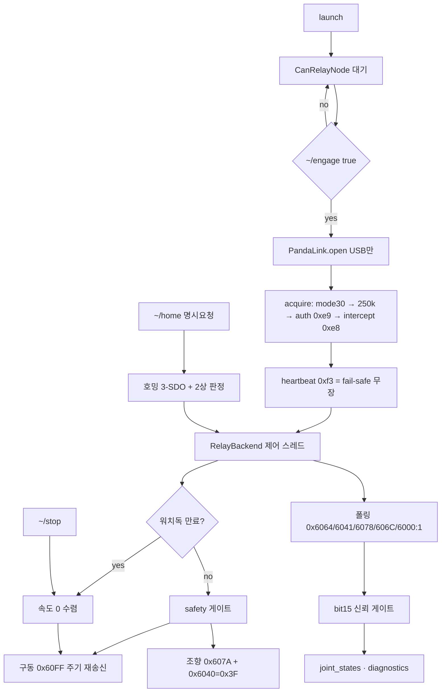

## 2026-07-29 (KST) — can_relay ROS2 패키지 신설 전 감사 + 신설 코드 리뷰

### 코드 버전
- 리뷰 커밋: `88cd633` (branch `main`, 워킹트리 미커밋 변경분 포함)
- 신설 대상: `src/Comm/CAN/can_relay/` — 리뷰 시점 **파일 0개**(`git ls-files src/Comm` → 0건)
- 감사 대상: `src/Actuators/motor_control/`(974줄) · `Tools/amr_test_gui/gui.py`(1142줄) ·
  `Tools/Can_Relay/panda-firmware/board/safety/safety_seer_gate.h` · `src/Control/Motion_Control/2WS/`
- 실측 원자료: `Log/homing_capture_220350.jsonl`(253,510 프레임) · `Log/homing_run_178516*.jsonl` ·
  `Log/clamp_accept_2500.jsonl`
- 직전 리뷰: 없음(주제 신설). 인접 주제 `docs/code_review/motor_control/2026-07-26.md` cross-ref

### 분석 분기 명시
- 분기: 전체 구조 분석(다중 모듈) + 신설 패키지 단위 리뷰
- 감지된 도메인: ros2-review · embedded-review · concurrency
- 수행 방식: 10인 병렬 감사(리뷰어 1~10) → 3인 적대적 반대심문(D1 변호 · D2 반증 · D3 심판).
  사용자 지시 "10명 투입하여 관련 코드 검토 / 적대적 토론 진행"(sess:520bf3ab 09:56)

---

## Core 인벤토리

### 1. 목적

`src/Comm/CAN/can_relay` 는 comma.ai panda 기반 CAN 릴레이를 경유해 Tongyi 4축 서보
(구동 node1·2 / 조향 node3·4)를 구동하는 ROS2 드라이버다. Seer 마스터가 붙어 있는 상태에서
릴레이 intercept 로 버스 주도권을 가져와 지령을 덮어쓴다.

기존 `src/Actuators/motor_control` 과의 관계는 **중복이 아니라 배타**다. 근거는 §평가 R-01 참조.
설계 결정은 `docs/adr/2026-07-29-can-relay-ros2-package.md`.

### 2. 코드 플로우차트



동반 drawio: `2026-07-29-flow.drawio`(루트 정본 · 패키지 병기 양쪽).

### 3. 함수 리스트 — 신설 패키지 전수 (누락 0)

| # | 함수 | 입력 | 출력 | 기능 | 위치 |
| --- | --- | --- | --- | --- | --- |
| 1 | `Frame` (frozen dataclass) | `can_id, data, bus` | 인스턴스 | 전송로 무의존 프레임 값객체 | protocol.py:70-76 |
| 2 | `SdoResponse` (frozen dataclass) | `node,kind,index,sub,value,size` | 인스턴스 | SDO 응답 디코드 결과 | protocol.py:79-88 |
| 3 | `sdo_write` | `node,index,value,size,sub,bus` | `Frame` | expedited download. size 초과 시 `ValueError` | protocol.py:91-108 |
| 4 | `sdo_read` | `node,index,sub,bus` | `Frame` | upload 요청 | protocol.py:111-114 |
| 5 | `parse_sdo_response` | `can_id,data` | `SdoResponse\|None` | **크기별** 언팩(0x43/0x47/0x4B/0x4F) | protocol.py:117-139 |
| 6 | `abort_text` | `code` | `str` | abort 사유 한글화 | protocol.py:142-143 |
| 7 | `drive_init_frames` | `node,bus` | `list[Frame]` | 구동 브링업 5프레임(PV) | protocol.py:148-163 |
| 8 | `steer_init_frames` | `node,bus` | `list[Frame]` | 조향 브링업 7프레임(PP+프로파일) | protocol.py:166-183 |
| 9 | `homing_frames` | `node,speed,bus` | `list[Frame]` | 호밍 3프레임. `0x6098` 미기록 | protocol.py:186-198 |
| 10 | `steer_target_frames` | `node,counts,bus` | `list[Frame]` | 위치 + setpoint CW 2프레임 | protocol.py:201-210 |
| 11 | `drive_velocity_frame` | `node,units,bus` | `Frame` | 속도 지령 1프레임 | protocol.py:213-215 |
| 12 | `poll_frames` | `nodes,bus` | `list[Frame]` | 읽기 전용 폴링 묶음 | protocol.py:227-229 |
| 13 | `UnsafeCommand` (Exception) | — | 예외 | 안전 게이트 거부 신호 | safety.py:41-42 |
| 14 | `finite` | `*values` | `bool` | NaN·inf 검출. 클램프 이디엄의 구멍을 막는다 | safety.py:45-54 |
| 15 | `clamp` | `value,limit` | `float` | ±대칭 클램프. 비유한 입력 거부 | safety.py:57-61 |
| 16 | `steer_deg_to_counts` | `node,deg,steer_home,limit_deg` | `(적용각, counts)` | **클램프가 걸린 유일한 counts 생성 지점** | safety.py:64-77 |
| 17 | `drive_mmps_to_units` | `mmps,sign,max_units` | `int` | 속도 환산 + 상한 클램프 | safety.py:80-86 |
| 18 | `is_homed` | `statusword` | `bool\|None` | bit15 판정. 미상이면 None | safety.py:89-93 |
| 19 | `position_trustworthy` | `statusword` | `bool` | 호밍 중 위치 사용 차단 | safety.py:96-104 |
| 20 | `HomingJudge.__init__` | `nodes,start_window_s,timeout_s` | None | 2상 판정기 초기화 | safety.py:115-120 |
| 21 | `HomingJudge.update` | `status,elapsed_s` | `(결과,사유)` | 0→1 전이 판정 | safety.py:122-139 |
| 22 | `settled` | `target_deg,measured,nodes,tol_deg` | `bool` | **양축 모두** 만족해야 정착 | safety.py:142-154 |
| 23 | `_panda_module` | — | `Panda` 클래스 | 필드킷 동봉 라이브러리 로드 | link.py:63-68 |
| 24 | `LinkError` (Exception) | — | 예외 | 전송 실패 신호 | link.py:71-72 |
| 25 | `BaseLink.*` | — | — | 전송 인터페이스 8메서드 | link.py:75-102 |
| 26 | `MockLink.__init__` | — | None | 무-하드웨어 대역 초기화 | link.py:111-118 |
| 27 | `MockLink.open` | — | None | 개방 표시 | link.py:120-122 |
| 28 | `MockLink.acquire` | — | None | 미개방이면 `LinkError` | link.py:124-128 |
| 29 | `MockLink.release` | — | None | 해제 | link.py:130-132 |
| 30 | `MockLink.send` | `frames` | None | 제어권 없으면 거부·기록 | link.py:134-138 |
| 31 | `MockLink.recv` | — | `list` | inbox 비우고 반환 | link.py:140-142 |
| 32 | `MockLink.heartbeat` | — | None | 카운트 | link.py:144-145 |
| 33 | `MockLink.close` | — | None | 종료 | link.py:147-150 |
| 34 | `PandaLink.__init__` | `serial,log` | None | 핸들·락 초기화 | link.py:167-175 |
| 35 | `PandaLink.open` | — | None | 열거·2대 이상이면 거부·health 로그 | link.py:178-196 |
| 36 | `PandaLink.acquire` | — | None | 주도권 5스텝 + 즉시 heartbeat | link.py:198-224 |
| 37 | `PandaLink.release` | — | None | 롤백 후 반환 | link.py:226-232 |
| 38 | `PandaLink._rollback` | — | None | intercept→auth→SILENT 역순 | link.py:234-245 |
| 39 | `PandaLink.close` | — | None | USB 닫기 | link.py:247-254 |
| 40 | `PandaLink._ctrl` | `P_,request,value` | None | vendor controlWrite | link.py:257-258 |
| 41 | `PandaLink.heartbeat` | — | None | `0xf3` — fail-safe 무장 유지 | link.py:260-264 |
| 42 | `PandaLink.heartbeat_overdue` | `now` | `bool` | 심박 지연 판정 | link.py:266-268 |
| 43 | `PandaLink.send` | `frames` | None | 락 직렬화 송신 | link.py:270-277 |
| 44 | `PandaLink.recv` | — | `list` | 락 직렬화 수신 | link.py:279-284 |
| 45 | `NodeState` (dataclass) | 6필드 | 인스턴스 | 노드 피드백 상태 | backend.py:33-48 |
| 46 | `NodeState.fresh` | `now,ttl` | `bool` | 피드백 신선도 | backend.py:47-48 |
| 47 | `RelayConfig` (dataclass) | 13필드 | 인스턴스 | 배선·한계·주기 | backend.py:51-68 |
| 48 | `RelayBackend.__init__` | `link,cfg,log` | None | 상태·락 초기화 | backend.py:78-101 |
| 49 | `RelayBackend.start` | — | None | 중복 기동 거부·제어 스레드 기동 | backend.py:104-116 |
| 50 | `RelayBackend.shutdown` | — | None | 정지 선행 후 스레드 종료. 멱등 | backend.py:118-135 |
| 51 | `RelayBackend.set_drive_mmps` | `mmps,sign` | None | 비유한 거부·워치독 갱신 | backend.py:138-145 |
| 52 | `RelayBackend.set_steer_deg` | `deg` | `float` | 클램프·호밍 중 거부 | backend.py:147-169 |
| 53 | `RelayBackend.stop` | `reason` | None | **어떤 상태에서도 수용** | backend.py:171-192 |
| 54 | `RelayBackend.estop` | `engage` | None | 소프트 래치. 구동만 세운다 | backend.py:194-203 |
| 55 | `RelayBackend.home` | `speed,start_window_s,timeout_s` | `(bool,str)` | 명시 요청 전용 호밍 | backend.py:206-243 |
| 56 | `RelayBackend.snapshot` | — | `dict` | 진단용 상태 사본 | backend.py:246-278 |
| 57 | `RelayBackend.steer_angles_deg` | — | `dict` | 신뢰 불가 축은 `None` | backend.py:280-300 |
| 58 | `RelayBackend.settled` | — | `bool` | 정착 판정 위임 | backend.py:302-308 |
| 59 | `RelayBackend._drive_frames` | `units` | `list` | 구동 프레임 생성 | backend.py:311-313 |
| 60 | `RelayBackend._send` | `frames` | None | 송신 + tx 카운트 | backend.py:315-320 |
| 61 | `RelayBackend._write_bringup` | — | None | 브링업 송신(기본 비활성) | backend.py:322-330 |
| 62 | `RelayBackend._loop` | — | None | 제어 스레드 본체 | backend.py:332-375 |
| 63 | `RelayBackend._drain` | — | None | 수신 파싱·상태 갱신 | backend.py:377-408 |
| 64 | `CanRelayNode.__init__` | — | None | 파라미터 21개·구독 4·발행 2·서비스 3 | driver_node.py:57-152 |
| 65 | `CanRelayNode._load_kinematics` | — | `객체\|None` | IK 대여. 실패 시 cmd_vel 미생성 | driver_node.py:155-176 |
| 66 | `CanRelayNode._on_cmd_vel` | `Twist` | None | NaN 거부→클램프→IK→동일각 검사 | driver_node.py:179-205 |
| 67 | `CanRelayNode._on_steer_deg` | `Float64` | None | 직접 조향 지령 | driver_node.py:207-211 |
| 68 | `CanRelayNode._on_drive_mmps` | `Float64` | None | 직접 구동 지령 | driver_node.py:213-217 |
| 69 | `CanRelayNode._on_estop` | `Bool` | None | E-stop 위임 | driver_node.py:219-220 |
| 70 | `CanRelayNode._reject` | `why` | None | 거부 계수 + throttled WARN | driver_node.py:222-224 |
| 71 | `CanRelayNode._srv_engage` | `SetBool` | 응답 | 제어권 획득/반환 | driver_node.py:227-244 |
| 72 | `CanRelayNode._srv_stop` | `Trigger` | 응답 | 즉시 정지 | driver_node.py:246-250 |
| 73 | `CanRelayNode._srv_home` | `Trigger` | 응답 | 호밍(경고 로그 선행) | driver_node.py:252-259 |
| 74 | `CanRelayNode._on_state_timer` | — | None | joint_states. 신뢰 불가 축 미발행 | driver_node.py:262-272 |
| 75 | `CanRelayNode._on_diag_timer` | — | None | DiagnosticArray | driver_node.py:274-314 |
| 76 | `CanRelayNode.destroy_node` | — | None | 정지→반환→종료 | driver_node.py:316-325 |
| 77 | `main` | `args` | None | rclpy 진입점 | driver_node.py:328-341 |
| 78 | `generate_launch_description` | — | `LaunchDescription` | 대기 상태 기동. `on_exit=Shutdown` | launch/can_relay.launch.py:16-40 |

### 4. 전역 변수 / 모듈 상수

가변 전역 **없음**. 아래는 전부 모듈 상수(불변)이며, 각 값의 근거를 주석이 함께 든다.

| # | 사용처(함수) | 기능 | 위치 |
| --- | --- | --- | --- |
| G1 | #3·#4·#5 | SDO/guard COB-ID 베이스 3종 (상수) | protocol.py:23-25 |
| G2 | #7~#12 | 객체 사전 18종 (상수) | protocol.py:28-56 |
| G3 | #7·#9·#10 | Controlword 3값 0x86/0x3F/0x05 (상수) | protocol.py:59-61 |
| G4 | #3·#5 | 커맨드 바이트 표 3종 + abort 사전 (상수) | protocol.py:64-79 |
| G5 | #16 | `COUNTS_PER_DEG=57344` (상수) — 실측 90° Δ=5,160,960 | safety.py:19 |
| G6 | #16 | `STEER_LIMIT_DEG=90.0` (상수) — 실측 검증 범위 | safety.py:23 |
| G7 | #17 | `VEL_PER_MMPS`·`VEL_MAX_UNITS` (상수) | safety.py:28-29 |
| G8 | #18·#19 | `STATUSWORD_HOMED_BIT` (상수) | safety.py:31 |
| G9 | #16 | `DEFAULT_STEER_HOME` (상수) — ⚠ debt-007/016 미판정 | safety.py:33 |
| G10 | #36·#41 | 판다 계약 상수 7종(버스·mode 30·0xe8/0xe9/0xf3·250k) (상수) | link.py:38-48 |
| G11 | #62 | `HEARTBEAT_PERIOD_S`·`HEARTBEAT_DEADLINE_S` (상수) | link.py:50-51 |
| G12 | #23 | `_KIT` (상수) — 필드킷 경로. 저장소 상대 경로로 산출 | link.py:53-56 |
| G13 | #64 | `LATCHED_QOS` (상수) — estop 전용 TRANSIENT_LOCAL | driver_node.py:47-50 |

### 5. 의존성 3-tier

| Tier | 대상 | 버전/제약 | 부재 시 동작(필수/선택) | 근거(파일:line) |
| --- | --- | --- | --- | --- |
| 빌드 | `ament_python` | format 3 | 빌드 불가 | package.xml:12 |
| 런타임 필수 | `rclpy`·`std_msgs`·`std_srvs`·`geometry_msgs`·`sensor_msgs`·`diagnostic_msgs` | ROS2 Humble | 노드 기동 불가(ImportError) | package.xml:14-19 |
| 런타임 필수 | comma.ai panda 라이브러리 | `Tools/docking_field_kit/panda` 동봉본 | `link: panda` 시 `open()` 이 `LinkError` 로 중단. `link: mock` 은 무영향 | link.py:63-68 |
| 런타임 필수 | 판다 하드웨어 + udev(0666) | VID/PID `bbaa:ddcc` | 열거 0건 → "판다를 찾지 못했다" 로 거부 | link.py:184-186 |
| 런타임 필수 | 판다 커스텀 펌웨어(safety_mode 30) | `ALLOW_DEBUG` 빌드 필수 | mode 30 미등록 시 SILENT 폴백 → 릴레이 강제 off, 게이트 무효 | link.py:41 |
| 런타임 필수 | Seer 마스터(연결 상태) | — | guard RTR forward 소실 → 드라이브 guard 타임아웃 HALT (debt-012) | ADR §Context |
| 런타임 선택 | `motor_control`(IK 대여) | 같은 워크스페이스 | **fallback 없음** — cmd_vel 구독을 만들지 않고 ERROR 로그. 직접 지령은 계속 동작 | driver_node.py:155-162 |
| 런타임 선택 | `launch`·`launch_ros` | — | launch 파일 사용 불가. `ros2 run` 은 가능 | package.xml:20-21 |

---

## 평가

severity 분포: Critical 0 / High 4 / Medium 5 / Low 3 / Info 2
Verdict: REQUEST CHANGES

> 본 리뷰는 저자가 작성했으므로 `APPROVE` 를 찍을 수 없다(review SOP 룰 11). 아래 High 4건은
> **모두 기존 코드에 대한 지적**이며 신설 패키지는 그 4건을 코드로 막은 상태다. 신설 패키지 자체의
> Verdict 는 별도 lane(다른 세션·리뷰어)에서 렌더해야 한다.

### High

**함수 #16·#66 — [논리][신규] `motor_control` 경로에 조향각 클램프가 없다 (High)**
   재현: `src/Actuators/motor_control/motor_control/kinematics.py:137-139` 는 클램프가 아니라
   ±2.443 rad(=139.97°) 접기다. `driver_node.py:116-118` 은 vx/vy/wz 만 클램프하고,
   `backend.py:153-155` 는 `steer_home + steer_rad*counts_per_rad` 를 그대로 `0x607A` 로 쓴다.
   `vy` 없이 `(vx=-0.1, wz=0.3)` 후진 선회만으로 **118.80°** 가 나온다(D2 계산).
   90~140° 는 미검증 구간이며 2026-07-27-002 와 같은 범위 이탈이다.
   권고: 본 패키지는 #16 에서 막았다(`test_safety.py::test_steer_clamps_beyond_verified_range`).
   `motor_control` 쪽은 소유 세션이 동일 조치 필요.

**함수 #14·#66 — [논리][신규] NaN cmd_vel 이 최대속도 지령이 된다 (High)**
   재현: `max(-0.2, min(0.2, float("nan")))` → `0.2` (실행 확인). `driver_node.py:116` →
   `kinematics.py:135` → `backend.py:150` → `0x60FF=±4889` 50 Hz 지속. 차단 후보 4종
   (estop/freewheel/워치독/정착게이트) 전수 무력 — 특히 워치독은 NaN 퍼블리셔가 계속 갱신한다.
   ⚠ 방향은 `drive_sign` 미판정이라 "전진"으로 단정하지 않는다.
   권고: 본 패키지는 #14 로 거부하고 워치독도 갱신하지 않는다
   (`test_backend.py::test_nonfinite_command_is_rejected_and_does_not_refresh_watchdog`).

**함수 #53 — [논리][신규] `gui.py` 는 구동 지령을 단발 송신하고 워치독이 없다 (High)**
   재현: `Tools/amr_test_gui/gui.py:840` `_drive()` 가 `0x60FF` 를 1회만 쓰고 재송신 루프가 없다
   (확인: `grep -n "0x60FF" gui.py` → :840 1곳). 또 `gui.py:855-857` 은 `_run` 이 False 면
   **"정지"까지 반려**한다 — 폴링 스레드가 예외로 자폭하면(`:1044` `self._run = False`) 정지 버튼이
   거부되고 드라이브는 마지막 값을 물고 간다. 남는 방어선은 판다 heartbeat(최악 2.0 s)뿐이다.
   권고: 본 패키지는 #53 이 상태와 무관하게 수용하고 #62 가 주기 재송신한다
   (`test_backend.py::test_stop_is_accepted_even_when_loop_never_started`, `::test_drive_command_is_resent_periodically`).

**함수 #46·#57 — [논리][신규] 피드백 신선도 게이트가 대체 없이 삭제됐다 (High)**
   재현: `grep -c "stale\|last_seen" Tools/amr_test_gui/gui.py` → **0**. 구 GUI 의
   `FEEDBACK_STALE_S=0.5` 가 구 패키지 폐기와 함께 사라졌고, 그 ADR 의 「폐기 자산과 대체」 표에도
   debt 에도 등록되지 않았다. RX 사망 시 `_wait_settle` 이 굳은 값으로 즉시 True 를 반환해
   조향이 안 돌아간 채 crab 구동이 시작될 수 있다.
   권고: debt-019 로 등록했다. 본 패키지는 #46 TTL + #57 `None` 반환으로 막았다.

### Medium

**함수 #5 — [논리] SDO 응답 크기를 무시하면 값이 오염된다 (Medium)**
   재현: `motor_control/protocol.py:139-141` 은 `_READ_RESP_SIZE` 를 멤버십 검사에만 쓰고 항상
   4바이트를 언팩한다. 실증: `0x4B` 응답 `4B 41 60 00 37 06 AA BB` → `0xBBAA0637`(기대 `0x0637`).
   현 소비자는 `& 0xFFFF` 로 우연히 가려져 있다.
   권고: 본 패키지 #5 는 커맨드 바이트가 알려주는 크기만 읽는다
   (`test_protocol.py::test_parse_2byte_does_not_read_trailing_bytes`).

**함수 #3 — [논리] size 초과 값의 조용한 절단 (Medium)**
   재현: `motor_control/protocol.py:110-111` 에서 `sdo_write(1, 0x6040, 70000, size=2)` →
   payload `70 11` = 4464. 경고 없음.
   권고: 본 패키지 #3 은 `ValueError` 를 낸다(`test_protocol.py::test_write_rejects_oversize_value_instead_of_truncating`).

**함수 #12 — [논리] `0x6000` 을 sub 0 으로 폴하면 리밋 판정이 죽는다 (Medium)**
   재현: `Log/homing_run_1785160148.jsonl` 에서 node3/4 가 `0x6000:00` 을 4.0 Hz ×137 폴하고
   응답이 `0x02`(= 엔트리 수)다. bit3(−리밋)이 항상 0 이 된다. 현행 펌웨어는 sub 1 로 고쳐져 있다.
   권고: 본 패키지 #12 는 sub 1 로 고정(`test_protocol.py::test_digital_input_polls_subindex_one`).

**함수 #55·#21 — [논리] 호밍 완료를 bit15=1 만으로 판정하면 오독한다 (Medium)**
   재현: 이미 호밍된 축은 시작 전부터 bit15=1 이라 즉시 완료로 읽힌다. `motor_control/backend.py:250`
   이 스스로 "bit15 완료 대기 미구현"을 인정한다.
   권고: 본 패키지 #21 은 0 관측을 선행 조건으로 요구한다
   (`test_safety.py::test_already_homed_axis_is_not_reported_complete`).

**함수 #19·#57 — [논리] 호밍 중 `0x6064`=0 이 ≈−137° 로 상위에 누설된다 (Medium)**
   재현: 호밍 진행 중 위치가 0 으로 고정된다(실측 3,080/3,080 샘플, debt-007 §①).
   `motor_control/driver_node.py:138-141` 주석이 "bit15 유효성 게이트 미구현"을 자인한다.
   권고: 본 패키지 #19·#57 이 차단(`test_backend.py::test_homing_zero_position_does_not_leak_as_minus_137_deg`).

### Low

**함수 #66 — [품질] `cmd_vel` 이 동일각(직진·크랩)만 지원한다 (Low)**
   재현: 축별 조향각 차이가 1° 초과면 거부한다(driver_node.py:196-201). 스핀·선회는 미구현이다.
   권고: Phase 2 에서 축별 독립 조향으로 확장. 현재는 조용히 잘못 도는 대신 거부한다.

**함수 #61 — [테스트] 브링업 시퀀스는 실기 검증 이력이 0 이다 (Low)**
   재현: 프레임 바이트는 캡처와 동일하나 "우리가 보냈을 때"의 드라이브 반응은 미관측이다.
   권고: debt-017 등록. `allow_bringup` 기본 false 유지, 잭업에서만 1회 수행.

**함수 #36 — [품질] 주도권 획득 중간 실패 시 롤백이 best-effort 다 (Low)**
   재현: `link.py:218-223` 이 예외 시 `_rollback()` 을 부르지만 롤백 자체의 실패는 로그만 남는다.
   권고: 롤백 실패를 진단 ERROR 로 승격하고 재시도 정책을 둔다.

### Info

**함수 #16 — [품질] 조향 홈 상수를 계승했다 (Info)**
   실측 캡처의 정착 목표(`7882020`/`7859062`)와 `+0.178°`/`+0.331°` 차이가 있으나 debt-007
   상환계획 ③("실측 없이 값 변경 금지")에 따라 바꾸지 않았다. debt-016 으로 등록.

**함수 #62 — [성능] 제어 스레드를 나누지 않았다 (Info)**
   판다 USB 핸들을 여러 스레드가 경합하면 heartbeat 전송이 실패해 릴레이가 풀린 이력이 있어
   의도적으로 단일 스레드로 두었다. 50 Hz 는 guard 타임아웃 500 ms 대비 25배 여유다.

---

## 적대적 반대심문에서 뒤집힌 1차 감사 결론 (기록 의무)

| 1차 주장 | 심문 판정 | 정정 내용 |
| --- | --- | --- |
| "`gui.py` 에 드라이브 브링업 시퀀스가 한 줄도 없다"(리뷰어 3) | **거짓(문자)/참(구동축)** | 호밍 3-SDO 는 `gui.py:942-944` 에 실재한다. 없는 것은 **구동축** 브링업(`0x6060`·`0x100C/D`·프로파일) |
| "조향 홈 상수가 호밍 전 기준계라 다르다"(리뷰어 1·5) | **논리 반증** | `7882020` 은 호밍 **전**에도 47 Hz 정상 목표였다. 기준계 변경이 아니다. 게다가 이미 registry 에 등록된 사실이라 신규 발견도 아니다 |
| "NaN → 최대속도 **전진**"(리뷰어 2) | **방향 미입증** | 최대속도는 확정. `drive_sign=-1` 이 미판정이라 방향은 단정 불가 |
| "emulate 중에만 Seer guard RTR 이 forward 된다"(리뷰어 7) | **조건 누락** | `safety_seer_gate.h:182-184` 의 `else` 가 무조건 `bus_fwd=2` — emulate 무관 **항상** forward. 문제는 더 넓다 |
| "`motor_control` 확장이 옳다"(리뷰어 8) | **반박됨** | 두 경로는 안전 모델이 배타적이며, 병합 시 guard RTR 정지수단이 무력화된다. debt-007 대조 실험도 불가능해진다 |

## 검증 (실행 명령과 출력 원문)

```
$ cd src/Comm/CAN/can_relay && PYTHONPATH=. python3 -m pytest test -q
84 passed in 1.78s

$ colcon build --packages-select motor_control can_relay --symlink-install
Summary: 2 packages finished [7.76s]
```

인코더 ↔ 실측 캡처 바이트 대조: 본 패키지가 만드는 프레임 **28종 전부**가
`Log/homing_capture_220350.jsonl` 에 바이트 동일로 존재(총 12,958건 일치).

**하지 않은 것**: 장치 접속 0 · 판다 플래시 0 · 실모터 구동 0. 따라서 본 문서의 어떤 문장도
실차 거동을 확정하지 않는다. 실차 게이트는 ADR §HIL 게이트 참조.

## 후속 TODO

- Phase 2: `wheel_motor_state`(trnav_2ws_msgs/WheelMotor) 발행 — 2WS 9개 액션서버가 이것이 없어
  Phase 0 에서 5초 후 abort 한다(리뷰어 6·심판 D3).
- debt-015~019 상환.
- `motor_control` 소유 세션에 High 2건(조향 클램프·NaN) 전달.
