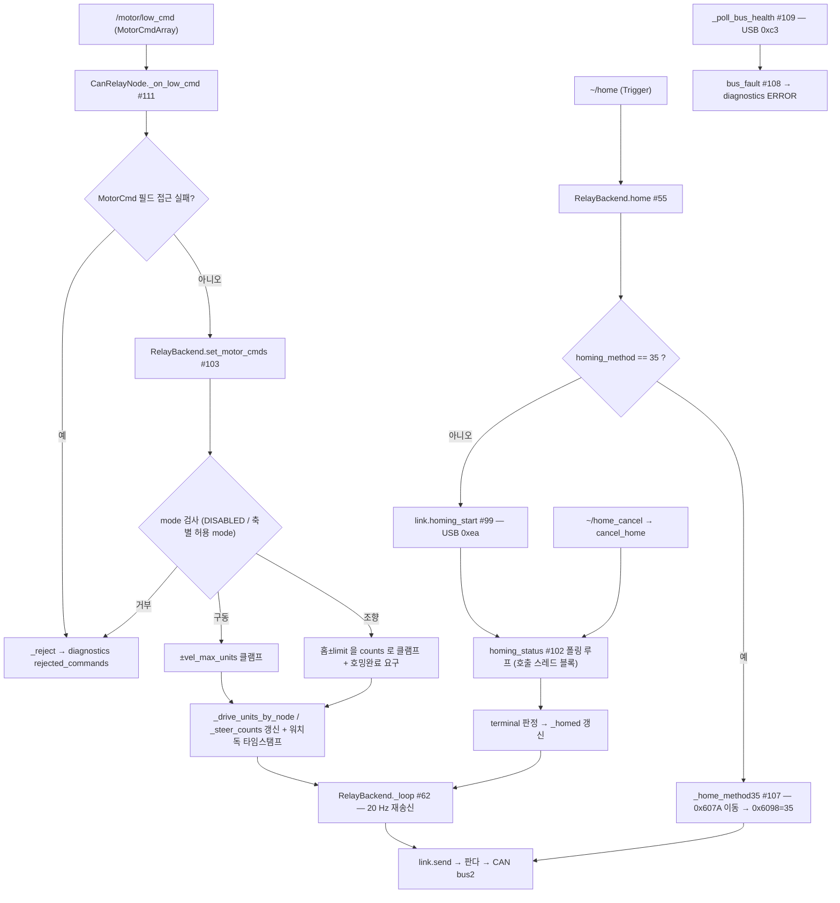

# can_relay ROS2 패키지 — 코드 리뷰 (날짜=버전)

## 2026-08-03 (KST) — delta 리뷰: 인벤토리 갱신 (2026-07-29 이후 추가분)

### 코드 버전

패키지가 **git 미추적**이므로 커밋으로 고정할 수 없다. SOP 의 비-git 규칙(파일 내용 해시)을 쓴다.

```
$ git ls-files src/Comm/CAN/can_relay | wc -l
0
$ git rev-parse --short HEAD
cc5e049
```

| 파일 | md5(앞 8) | 줄수 |
| --- | --- | --- |
| `can_relay/backend.py` | `1500b715` | 844 |
| `can_relay/driver_node.py` | `4f0d833f` | 425 |
| `can_relay/link.py` | `91816934` | 514 |
| `can_relay/protocol.py` | `333f03cd` | 283 |
| `can_relay/safety.py` | `27de8c07` | 182 |
| `launch/can_relay.launch.py` | `7b5e5a44` | 48 |
| `config/can_relay.yaml` | `f73551b8` | — |
| `config/machine/foil_a082.yaml` | `60e7c2c4` | — |

- 직전 리뷰: [2026-07-29](2026-07-29.md) — 그 문서는 코드 버전을 「리뷰 커밋 `88cd633`」로 적었으나,
  위 `git ls-files` 결과대로 **패키지가 한 번도 커밋된 적이 없어 그 해시는 이 패키지 코드를 고정하지 못한다**
  (SOP 룰 12 미충족). 본 문서부터 파일 해시로 고정한다. → 후속 TODO ①
- delta 범위: `git diff` 불가(미추적) → **함수명 전수 대조**로 산출했다. 재현 명령은 §검증 ①.

> ⚠ **줄번호 주의 — 리뷰 후 같은 날 코드가 바뀌었다**(§조치). 본 문서의 인벤토리·인용은 위 표의
> **리뷰 시점 해시** 기준이며, 조치 후 현행은 `backend.py` `b447f1ad`(880줄) · `driver_node.py`
> `8f54b2f0`(456줄) · `link.py` `4f0719a5`(525줄) · `protocol.py` `de2c3521`(294줄) 이다.
> 함수 **추가·삭제는 없고**(조치는 전부 기존 함수 내부 + 콜백 그룹 3개 신설) 줄번호만 밀렸다.
> 위치 컬럼 재동기화는 후속 TODO ②에 포함한다.

### 분석 분기 명시

- 분기: 전체 구조 분석(패키지 단위) — **delta**(직전 리뷰 대비 추가·삭제분 중심)
- 감지된 도메인: ros2-review · concurrency · embedded-review

---

## Core 인벤토리 (delta)

### 1. 목적

변경 없음 — 판다 CAN 릴레이 경유 Tongyi 4축 모터 구동 ROS2 드라이버([2026-07-29 §1](2026-07-29.md) 참조).

**상류 계약이 바뀌었다.** 직전 리뷰 시점의 상위 인터페이스는 `cmd_vel`(Twist) + 자체 IK 대여였고,
현행은 `/motor/low_cmd`(`trnav_msgs/MotorCmdArray`) **raw 지령 수신**이다. 근거: `driver_node.py:175-179`
(구독·발행 생성), `driver_node.py:21-22`(인터페이스 표), 삭제된 `_load_kinematics`·`_on_cmd_vel`(§3 삭제분).

### 2. 코드 플로우차트 (delta — 신규 경로만)

직전 리뷰의 전체 흐름도는 [2026-07-29 §2](2026-07-29.md) 에 있다. 아래는 **이번 delta 로 생긴 경로**다.



노드 21 · 엣지 22. 동반 drawio: `2026-08-03-flow.drawio`(루트 정본 · 패키지 병기 양쪽, dangling 0 · 1:1 검증 — §검증 ③).

### 3. 함수 리스트 — delta

번호는 직전 리뷰(#1~#78)에 **이어서** 매긴다.

#### 3-1. 추가된 함수 (34)

| # | 함수 | 입력 | 출력 | 기능 | 위치 |
| --- | --- | --- | --- | --- | --- |
| 79 | `home35_move_frames` | `node,home_offset,profile_vel,bus` | `list[Frame]` | method 35 1단계 — 절대 counts 로 이동(0x607A·0x6081·0x6040=0x3F). **바퀴가 움직인다** | protocol.py:210-224 |
| 80 | `home35_set_frames` | `node,bus` | `list[Frame]` | method 35 2단계 — `0x6098=35`(현재 위치를 홈으로) | protocol.py:227-233 |
| 81 | `home35_reached` | `statusword,position,home_offset,tol` | `bool` | 1단계 도착 2조건(bit10 ∧ 잔차<tol). 미상이면 False | protocol.py:236-245 |
| 82 | `home_search_allowed` | `position,rng` | `(bool,str)` | 호밍 전 현재 위치가 예상 범위 안인지. 미측정 전제 검출 게이트 | safety.py:98-115 |
| 83 | `decode_can_health` | `data` | `dict` | 0xc3 응답 디코드(REC/TEC 는 uint8 포화) | link.py:94-108 |
| 84 | `decode_homing_status` | `data` | `dict` | 0xeb 8바이트 상태 디코드 | link.py:111-125 |
| 85 | `_find_repo_root` | `start` | `str` | `Tools/docking_field_kit` 마커로 저장소 루트 탐색(고정 깊이 버그 대체) | link.py:128-148 |
| 86 | `BaseLink.engaged` (property) | — | `bool` | 인터페이스 선언 | link.py:209-211 |
| 87 | `BaseLink.can_health` | `bus` | `dict` | 인터페이스 선언(선택 기능) | link.py:214-215 |
| 88 | `BaseLink.homing_start` | `speed` | `bool` | 인터페이스 선언 | link.py:218-219 |
| 89 | `BaseLink.homing_cancel` | — | `bool` | 인터페이스 선언 | link.py:221-222 |
| 90 | `BaseLink.homing_status` | — | `dict` | 인터페이스 선언 | link.py:224-225 |
| 91 | `MockLink.homing_state` (staticmethod) | `state,**kw` | `dict` | 상태 번호 → 0xeb 형태 dict(시험 편의) | link.py:247-255 |
| 92 | `MockLink.engaged` (property) | — | `bool` | 대역 제어권 상태 | link.py:289-291 |
| 93 | `MockLink.can_health` | `bus` | `dict` | 픽스처 반환, 미설정 시 `LinkError` | link.py:294-297 |
| 94 | `MockLink.homing_start` | `speed` | `bool` | 펌웨어와 같은 거부 조건 모사 | link.py:299-310 |
| 95 | `MockLink.homing_cancel` | — | `bool` | 취소는 항상 수리 | link.py:312-318 |
| 96 | `MockLink.homing_status` | — | `dict` | 대본(`homing_script`) 소비 | link.py:320-325 |
| 97 | `PandaLink.engaged` (property) | — | `bool` | 제어권 상태 | link.py:454-456 |
| 98 | `PandaLink.can_health` | `bus` | `dict` | `controlRead(0xc3)` 직접 호출(라이브러리 사본 무관) | link.py:459-471 |
| 99 | `PandaLink.homing_start` | `speed` | `bool` | 0xea 시작. 범위 밖 speed 는 `LinkError` | link.py:474-487 |
| 100 | `PandaLink.homing_cancel` | — | `bool` | 0xea 취소 | link.py:489-499 |
| 101 | `PandaLink._homing_cmd` | `start,speed` | `bool` | 0xea controlRead 공통부 | link.py:501-506 |
| 102 | `PandaLink.homing_status` | — | `dict` | 0xeb controlRead → `decode_homing_status` | link.py:508-514 |
| 103 | `RelayBackend.set_motor_cmds` | `cmds` | `list[str]` | raw 모터 지령 수리. mode 검사·클램프·호밍 게이트. 반환은 거부/클램프 사유 | backend.py:216-291 |
| 104 | `RelayBackend.motor_states` | — | `list[dict]` | `MotorStateArray` 용 노드별 raw 피드백 | backend.py:293-313 |
| ⚠ **2026-08-06 정정**: 아래 `halt_steer`·`halt_note` 관련 행은 **현재 코드에 없다.** `halt_steer` 는 2026-08-05 에 제거됐고(현행 `release_steer_target` — 걸어 둔 목표를 **놓기만** 하고 조향축에 프레임을 보내지 않는다), 확인은 `def halt_steer` **ast 검색 0건**(2026-08-06). 본 표는 2026-08-03 시점 인벤토리이므로 행은 보존하되 **현행으로 인용 금지**. 사유는 `backend.py` `release_steer_target` docstring · `docs/claude-mistake/2026-08-05-001`. |
| 105 | ~~`RelayBackend.halt_steer`~~ **(2026-08-05 제거)** | `reason` | `bool` | ~~조향축 실제 정지 — 현재 실측 위치를 새 목표로 덮어쓴다~~ → 그 송신이 제거됨. 현행 `release_steer_target` 은 목표를 **놓기만** 한다 | backend.py:315-349 |
| 106 | `RelayBackend.stop_all` | `reason` | `bool` | 구동 + 조향 동시 정지(`~/stop` 의 실제 경로) | backend.py:375-383 |
| 107 | `RelayBackend._home_method35` | `poll_s,timeout_s` | `(bool,str)` | method 35 호밍 전 과정(이동→도착→재영점→검증) | backend.py:398-502 |
| 108 | `RelayBackend.bus_fault` | — | `str\|None` | bus_off > passive > warning 우선순위로 사유 1줄 | backend.py:632-649 |
| 109 | `RelayBackend._poll_bus_health` | — | None | 0xc3 폴링. 기능부재(영구 비활성)와 일시실패를 분리 | backend.py:781-812 |
| 110 | `CanRelayNode._load_msgs` | — | `(3-tuple\|None×3)` | `trnav_msgs` 대여. 실패 시 저수준 경로 미개설 | driver_node.py:205-220 |
| 111 | `CanRelayNode._on_low_cmd` | `MotorCmdArray` | None | raw 지령 → `set_motor_cmds`, 사유는 `_reject` | driver_node.py:223-240 |
| 112 | `CanRelayNode._on_low_state_timer` | — | None | `/motor/low_state` 발행(기본 50 Hz) | driver_node.py:242-252 |

#### 3-2. 삭제된 함수 (2)

| 구 # | 함수 | 삭제 근거 |
| --- | --- | --- |
| 65 | `CanRelayNode._load_kinematics` | IK 대여 폐지 — 기구학은 상류 액션서버 소유. 현행 코드에 정의 0건(§검증 ①) |
| 66 | `CanRelayNode._on_cmd_vel` | `cmd_vel` 경로 폐지 → `/motor/low_cmd`(#111)로 대체. 축별 동일각 게이트도 함께 제거(`driver_node.py:229-231`) |

#### 3-3. 유지분

#1~#64, #67~#78 은 [2026-07-29 §3](2026-07-29.md) cross-ref. 단 **줄번호는 어긋나 있다**(파일이 모두
2026-08-02~03 에 수정됨 — §코드 버전의 mtime/해시). 위치 컬럼 재동기화는 후속 TODO ②.

### 4. 전역 변수 / 모듈 상수 — delta

가변 전역 **없음**(신규분 포함). 아래는 직전 표 G1~G13 에 **추가**되는 모듈 상수다.

| # | 사용처(함수) | 기능 | 위치 |
| --- | --- | --- | --- |
| G14 | #79·#80·#81 | `OBJ_HOMING_METHOD`·`HOMING_METHOD_CURRENT_POS`·`STATUSWORD_TARGET_REACHED` (상수) | protocol.py:42·50·51 |
| G15 | #103 | `MODE_DISABLED/VELOCITY/POSITION/TORQUE` + `MODE_NAME` (상수) — 상류 `MotorCmd.msg` 와 같은 값 | protocol.py:268-269 |
| G16 | #62 | `POLL_OBJECTS` 5종 (상수) — `0x6000` 은 sub **1** | protocol.py:272-278 |
| G17 | #83·#98 | `REQ_CAN_HEALTH`(0xc3)·`CAN_HEALTH_STRUCT` (상수) — 펌웨어 `board/health.h:29-37` 대응 | link.py:63-64 |
| G18 | #99·#100·#101·#102 | `REQ_HOMING_CMD`(0xea)·`REQ_HOMING_STATUS`(0xeb) (상수) | link.py:76-77 |
| G19 | #94·#99 | `HOMING_SPEED_DEFAULT/MIN/MAX` (상수) — `safety_seer_gate.h:207-208` | link.py:79-80 |
| G20 | #84·#91·#96 | `HOMING_STATE`(12종)·`HOMING_TERMINAL`·`HOMING_OK`·`HOMING_NODES` (상수) | link.py:83-91 |
| G21 | #85 | `_REPO` (상수 — **import 시점 1회 계산**) | link.py:151 |
| G22 | #85 | `_PANDA_SOURCES` (상수) — panda 라이브러리 사본 2곳 우선순위 | link.py:158-161 |

각 전역의 필요성: G14~G20 은 펌웨어·상류와 **값 대조가 가능해야** 하므로 상수가 맞다(이름을 펌웨어 매크로와
동일하게 둔 것이 근거). G21 은 §Info I1 참조.

### 5. 의존성 3-tier — delta

| Tier | 대상 | 버전/제약 | 부재 시 동작(필수/선택) | 근거(파일:line) |
| --- | --- | --- | --- | --- |
| 런타임 필수 | `trnav_msgs`(MotorCmdArray/MotorStateArray/MotorState) | 상류 `TR_Nav_ros2_ws` | **저수준 경로를 열지 않는다** — `/motor/low_cmd` 구독·`/motor/low_state` 발행 미생성, ERROR 로그. 벤치 지령(`~/steer_deg`·`~/drive_mmps`)은 계속 동작 | driver_node.py:205-220 |
| 런타임 필수 | `config/machine/<기체>.yaml` 의 `steer_home_counts` | 비어 있으면 안 됨 | **기동 거부**(`ValueError`) — 코드 기본값을 두지 않는다 | driver_node.py:107-112, safety.py:41 |
| 런타임 필수 | 판다 펌웨어 호밍 시퀀서(0xea/0xeb) | `safety_seer_gate.h` | `homing_method: firmware` 에서 부재 시 **호밍 실패로 보고**하고 SDO 직접 경로로 내려가지 않는다 | backend.py:558-563 |
| 런타임 선택 | 판다 `can_health`(0xc3) | 펌웨어·라이브러리 | `NotImplementedError` → 폴링 **영구 비활성** + 진단에 `health_supported=False` 노출. 그 외 예외는 재시도 | backend.py:790-806 |
| (삭제) | ~~`motor_control`(IK 대여)~~ | — | `cmd_vel` 경로 폐지로 의존 소멸 | §3-2 |

그 외 tier 는 [2026-07-29 §5](2026-07-29.md) 와 동일(변경 없음).

---

## 평가

severity 분포: Critical 0 / High 2 / Medium 5 / Low 3 / Info 2
Verdict: REQUEST CHANGES

> 본 리뷰는 이 delta 코드를 읽은 세션이 작성했으므로 `APPROVE` 를 찍을 수 없다(SOP 룰 11).

### High

**함수 #107·#55·#73·#73a — [논리][race][신규] 호밍이 노드 전체를 최대 180 초 블록해 `~/home_cancel` 이 도달할 수 없다 (High)**
   재현: `driver_node.py:414` 는 `rclpy.spin(node)` 이고, 이 패키지에는 executor·callback group 지정이 없다
   (`grep -rn "Executor\|callback_group\|MultiThreaded\|Reentrant" can_relay/*.py` → 0건). 즉 **단일 스레드 실행기**다.
   `~/home` 콜백(`_srv_home`, driver_node.py:301-309)은 `backend.home()`(backend.py:527-590)을 직접 호출하고,
   그 함수는 `while True:` 안에서 `time.sleep(poll_s)` 로 **terminal 상태나 `timeout_s`(기본 180.0, backend.py:528)까지
   반환하지 않는다.** method 35 경로(#107)도 같다(backend.py:443-468).
   그 사이 실행기는 다른 콜백을 하나도 처리하지 못하므로 `~/home_cancel`(#73a)·`estop` 구독(driver_node.py:181-182)·
   진단 타이머가 모두 대기한다. 문서화된 취소 수단이 **호밍 중에는 소비될 수 없다**.
   (제어 스레드는 별도이므로 프레임 송신·심박은 계속 돈다 — 멈추는 것은 ROS 인터페이스다.)
   권고: `~/home`·`~/home_cancel` 을 `ReentrantCallbackGroup` + `MultiThreadedExecutor` 로 분리하거나,
   `home()` 을 비동기화(백그라운드 진행 + 상태는 진단·서비스 조회)한다. 회귀는 "호밍 중 cancel 서비스 응답"으로 고정.

**함수 #98~#102·#41 — [race][신규] `heartbeat` 만 `_lock` 밖이라 USB 핸들이 두 스레드에서 겹친다 (High)**
   재현: `PandaLink` 의 USB 접근 중 `send`(link.py:443)·`recv`(link.py:450)·`can_health`(link.py:467)·
   `_homing_cmd`(link.py:502)·`homing_status`(link.py:511)는 `with self._lock:` 안이지만,
   `heartbeat`(link.py:428-432)는 **락 없이** `controlWrite` 한다.
   직전 리뷰 시점에는 모든 USB 접근이 제어 스레드 하나였으므로 문제가 되지 않았다(그래서 락 밖이 무해했다).
   현행은 `home()`/`cancel_home()` 이 **서비스 콜백 스레드**에서 `homing_status`·`_homing_cmd` 를 호출하므로
   (backend.py:571·521, driver_node.py:301-316), 제어 스레드의 `heartbeat`(backend.py:733)와 같은 핸들에서
   동시에 전송될 수 있다. `link.py:32-33` 이 스스로 적어 둔 실패 이력("heartbeat 를 별도 스레드에서 보내면
   폴링과 USB 핸들을 경합해 실패한 이력")과 같은 조건이 다시 성립한다.
   심박 실패는 펌웨어 fail-safe 발동(구동 0 + 릴레이 개방)으로 이어진다 — 안전 방향이지만 **주행 중 예고 없는 정지**다.
   실기 재현은 하지 않았다(장치 접속 0). 코드 경로로만 성립을 확인했다.
   권고: `heartbeat` 를 `_lock` 안으로 넣는다(1줄). 회귀는 두 스레드 동시 호출 시험으로 고정.

### Medium

**함수 #111·#103 — [논리][신규] 상류가 보낸 `profile_vel` 을 말없이 버린다 (Medium)**
   재현: `driver_node.py:234-235` 가 `(motor_id, mode, target_vel, target_pos, profile_vel)` 을 모두 꺼내지만,
   `set_motor_cmds` 는 다섯째를 `_pvel` 로 받고 **한 번도 쓰지 않는다**(backend.py:232).
   조향은 PP 모드라 실제 속도는 드라이브에 마지막으로 기록된 `0x6081` 값(브링업 30000 또는 호밍 2500)이 결정한다.
   즉 상류가 프로파일 속도를 낮춰 보내도 반영되지 않고, 거부 note 도 남지 않아 상위가 알 수 없다.
   권고: 반영하거나(0x6081 동반 송신), 최소한 `notes` 에 "profile_vel 미반영" 을 남긴다.

**함수 #62 — [논리][신규] `_tx_fail_streak` 이 송신 외 예외까지 세어 심박을 끊는다 (Medium)**
   재현: `backend.py:772-776` 의 `except` 는 루프 전체를 감싸므로 `_drain()`(수신 파싱, backend.py:767)에서
   난 예외도 `_tx_fail_streak += 1` 로 계산된다. 10 회(=`tx_fail_halt`, backend.py:91) 누적되면
   `backend.py:727-731` 이 심박을 끊어 펌웨어 fail-safe 를 발동시킨다.
   결과는 안전 방향(정지)이지만 로그·진단은 "송신 연속 실패"라고 **원인을 잘못 지목**한다.
   권고: 송신 실패와 그 외 루프 예외의 카운터를 분리한다.

**함수 #107 — [테스트][신규] method 35 호밍 경로에 회귀가 하나도 없다 (Medium)**
   재현: `grep -c` 로 test 디렉터리 전체에서 `_home_method35` 0건, `home35_move_frames` 0건, `home35_set_frames` 0건,
   `home_search_allowed` 0건(§검증 ②). 이 경로는 `0x607A` 로 **바퀴를 실제로 움직이는** 100여 줄이다.
   기본값이 `homing_method: firmware`(backend.py:81)라 평시 비활성인 것이 완화 요인이다.
   권고: MockLink 로 1단계 이동·도착판정·2단계 abort·재영점 미확인 4 분기를 고정한다.

**함수 #106 — [테스트][신규] `~/stop` 의 실제 경로인 `stop_all` 에 회귀가 없다 (Medium)**
   재현: `_srv_stop`(driver_node.py:294-299)이 부르는 것은 `stop_all` 인데 test 전체에서 `stop_all` 0건(§검증 ②).
   구성요소인 `stop`·~~`halt_steer`~~(제거 → `release_steer_target`) 에는 시험이 있으나 **둘의 결합(반환값이 조향 정지 성패를 반영하는지)** 은 미고정이다.
   권고: 실측 위치 유무 2 분기로 `stop_all` 반환값·송신 프레임을 단언한다.

**함수 #103 — [논리][신규] E-stop 중 구동 지령은 사유 없이 사라진다 (Medium)**
   재현: backend.py:283-285 는 조향이 막히면 `notes` 에 "E-stop 인가 중 — 조향 지령 거부" 를 남기지만,
   구동은 backend.py:279 의 `if drive and not self._estop:` 조건으로 **조용히 버려진다**(note 없음).
   `_reject` 를 타지 않으므로 진단의 `rejected_commands`(driver_node.py:362)도 증가하지 않아, 상위에서 보면
   지령이 수리된 것과 구분되지 않는다.
   권고: 조향과 같은 형태의 note 를 남긴다.

### Low

**함수 #9 — [품질][신규] `homing_frames` 가 실행 경로에서 호출되지 않는다 (Low)**
   재현: 패키지 전체에서 호출부는 시험 2곳(`test/test_protocol.py:124·130`)과 docstring 1줄뿐이다
   (`grep -rn homing_frames --include='*.py' .`). 실행 경로의 호밍은 펌웨어 시퀀서(#99) 또는 method 35(#79·#80)다.
   권고: 남길 근거(펌웨어 미지원 기체 대비 등)를 주석에 명시하거나 삭제한다. 판단 전까지 debt 등록 권고.

**RelayConfig — [스타일][신규] 주석이 다른 필드에 붙어 있다 (Low)**
   재현: backend.py:94-95 의 "매뉴얼 §Home 35 … 전원 사이클마다 재호밍" 주석은 내용상 `require_homed_for_steer`
   (backend.py:90)의 근거인데, 그 사이에 낀 `tx_fail_halt`(backend.py:91) 아래에 놓여 있다.
   권고: 해당 필드 밑으로 옮긴다.

**함수 #62 · `_srv_engage` — [품질][신규] `except (LinkError, Exception)` 중복 (Low)**
   재현: backend.py:772, driver_node.py:287. `LinkError` 는 `RuntimeError`→`Exception` 하위라 첫 항목이 무의미하며,
   "특정 예외를 다룬다"는 인상만 준다.
   권고: 의도가 광범위 포획이면 `except Exception` 하나로 적고 이유를 주석에 남긴다.

### Info

**함수 #85 (G21) — [품질] `_REPO` 가 import 시점에 계산되고 `sys.path` 를 변형한다 (Info)**
   근거: link.py:151 에서 모듈 로드 시 1회 계산되고, `_panda_module()`(link.py:171-172)이 `sys.path.insert` 로
   프로세스 전역을 바꾼다. 같은 프로세스에 다른 panda 사본을 쓰는 노드가 붙으면 먼저 들어간 경로가 이긴다.
   현재 이 저장소에서 한 프로세스에 두 사본이 로드되는 구성은 확인되지 않았다(구성 파일 근거: `launch/can_relay.launch.py`).

**함수 #109 — [race] health 상태 필드가 락 밖에서 갱신된다 (Info)**
   근거: `_health_supported`·`_health_error` 는 backend.py:797-812 에서 락 없이 대입되고
   `snapshot()`(backend.py:627-628)은 락 안에서 읽는다. 파이썬 속성 대입은 원자적이라 값이 찢어지지는 않으며,
   영향은 진단 표시의 1 틱 지연뿐이다.

### findings 상태 추적 (2026-07-29 대비)

| 구 항목 | 상태 | 근거 |
| --- | --- | --- |
| High #16·#66 조향 클램프 부재(`motor_control` 경로) | **[해결]**(본 패키지 측) / [잔존](`motor_control` 소유) | `cmd_vel` 경로 삭제(§3-2). raw 경로는 #103 이 counts 단위로 클램프 |
| High #14·#66 NaN cmd_vel → 최대속도 | **[해결]** | 경로 삭제 + #103 이 `S.finite` 로 거부(backend.py:244·263) |
| High #53 `gui.py` 단발 송신·워치독 부재 | **[잔존]** | 대상은 `Tools/amr_test_gui/gui.py` — 본 delta 범위 밖 |
| High #46·#57 피드백 신선도 게이트 | **[해결 유지]** | `fresh()` 가 #104·#105·#107·#57 에서 계속 게이트로 쓰인다 |
| Medium #5·#3·#12 (SDO 크기·절단·sub1) | **[잔존·유지]** | protocol.py:141-144·110-113·277 그대로 |
| Medium #55·#21 호밍 bit15 오독 | **[잔존·유지]** | `HomingJudge`(safety.py:135-167) 유지. 단 firmware 경로는 `HOMING_OK` 로 판정(backend.py:577) |
| Low #66 `cmd_vel` 동일각 제한 | **[해결]** | 경로 삭제. 축별 상이각 허용이 명시됨(driver_node.py:229-231) |
| Low #61 브링업 실기 미검증 | **[잔존]** | `allow_bringup` 기본 False(backend.py:78) |
| Info #16 조향 홈 상수 계승 | **[해결]** | `DEFAULT_STEER_HOME = {}`(safety.py:41) — 미설정 시 거부 |

---

## 검증 (실행 명령과 출력 원문)

① delta 산출(함수명 전수 대조) — `git diff` 불가(미추적)라 이름 대조로 대신했다:

```
$ for f in src/Comm/CAN/can_relay/can_relay/*.py; do
    grep -oE "^\s*def [a-zA-Z_0-9]+" "$f" | awk '{print $2}'; done | sort -u | wc -l
82
$ # 위 82개 중 2026-07-29.md 에 이름이 등장하지 않는 것
24
$ # 구 표(#1~#78)의 함수명 중 현행 코드에 정의가 없는 것
GONE: CanRelayNode._load_kinematics
GONE: CanRelayNode._on_cmd_vel
```

(고유 이름 24개 → 오버로드 구현 포함 표 행 34개. `engaged`·`can_health`·`homing_start`·`homing_cancel`·
`homing_status` 는 Base/Mock/Panda 3구현이라 각각 3행이다.)

② 회귀:

```
$ cd src/Comm/CAN/can_relay && PYTHONPATH=. python3 -m pytest test -q
192 passed in 5.66s
```

(직전 리뷰 시점 84 → 현행 192.) 시험 0건인 신규 함수: `stop_all` · `_home_method35` · `home_search_allowed` ·
`home35_move_frames` · `home35_set_frames` · `_poll_bus_health`.

③ 산출물 게이트:

```bash
python3 docs/claude_guideline/code_review/checks/drawio_validate.py \
        docs/code_review/can_relay_ros2/2026-08-03-flow.drawio --expect-nodes 21 --expect-edges 22
python3 docs/claude_guideline/code_review/checks/review-claim-lint.py \
        docs/code_review/can_relay_ros2/2026-08-03.md
```

④ ⚠ SOP 자체점검 #4(`grep -oE "\[(논리|…|품질)\]" | sort -u`)는 **`en_US.UTF-8` 로케일에서 오답을 낸다** —
한글 정렬 대조(collation)가 서로 다른 태그를 같은 것으로 접어 `[논리]`·`[테스트]` 2개만 남긴다.
`LC_ALL=C sort -u` 로 실행하면 `[논리]`·`[스타일]`·`[테스트]`·`[품질]` 4개가 모두 나온다(본 문서 실측).
이 검사를 쓰는 다른 리뷰에도 같은 오답이 나므로 SOP 스니펫에 `LC_ALL=C` 를 넣을 것을 권고한다.

**하지 않은 것**: 장치 접속 0 · 판다 플래시 0 · 실모터 구동 0 · ROS2 노드 기동 0.
따라서 본 문서의 어떤 문장도 실차 거동을 확정하지 않는다. High 2건은 **코드 경로로만** 성립을 보였다.

## 조치 (같은 날 반영 — 2026-08-03)

리뷰 직후 사용자 지시("전부다 진행, 검증부터")로 아래를 반영했다. **검증을 먼저 썼다** — 각 항목의
「재현」열은 수정 전 실패를 확인한 회귀다.

| 항목 | 상태 | 재현(수정 전) | 조치 |
| --- | --- | --- | --- |
| High #107·#55·#73·#73a 실행기 블로킹 | **[해결]** | `test_node_concurrency.py` 3건 실패(취소 5 s 무응답, 187 s 소요) | 콜백 그룹 3분리 + `MultiThreadedExecutor`. ADR `docs/adr/2026-08-03-can-relay-node-concurrency.md` |
| High #98~#102·#41 heartbeat 락 | **[해결]** | `test_link_concurrency.py` 3건 실패(동시 전송 2건 관측) | `PandaLink._ctrl()` 이 락을 직접 잡고 `Lock`→`RLock` |
| Medium #111·#103 profile_vel 무고지 | **[부분해결]** | — | 값이 바뀔 때 로그 1줄(에지). **반영 자체는 미룸 → debt-038** |
| Medium #62 `_tx_fail_streak` 오집계 | **[해결]** | `test_recv_failure_does_not_suppress_heartbeat` | 송신 전용 카운터 + `_loop_fail_streak` 분리, 진단에 둘 다 노출 |
| Medium #107 method 35 회귀 0건 | **[해결]** | — | `test_backend_method35.py` 8건(비활성·오프셋부재·위치미상·범위밖·성공·구목표폐기·거부·타임아웃) |
| Medium #106 `stop_all` 회귀 0건 | **[해결]** | — | 실측위치 유무 2분기 고정 |
| Medium #103 E-stop 구동 지령 무고지 | **[해결]** | `test_estop_rejection_of_drive_command_is_reported` | 조향과 대칭으로 사유 note 추가 |
| Low #9 `homing_frames` 실행경로 부재 | **[해결]** | — | 존치 근거를 docstring 에 명시(바이트 대조 기준) + 신규 호출 금지 경고 |
| Low RelayConfig 주석 위치 | **[해결]** | — | `require_homed_for_steer` 아래로 이동 |
| Low `except (LinkError, Exception)` | **[해결]** | — | 2곳 `except Exception` + 이유 주석. 미사용이 된 import 정리 |
| Info #85 `_REPO` · #109 락 밖 갱신 | **[잔존]** | — | 영향이 진단 1틱 지연·구성 미발생이라 이번 범위 밖 |

검증(조치 후):

```
$ cd src/Comm/CAN/can_relay && PYTHONPATH=. python3 -m pytest test -q
227 passed, 1 skipped in 8.83s
$ source /opt/ros/humble/setup.bash && source install/setup.bash
$ PYTHONPATH=.:$PYTHONPATH python3 -m pytest test -q
230 passed in 10.40s
$ colcon build --packages-select can_relay --symlink-install
Finished <<< can_relay [3.01s]
```

⚠ **Verdict 는 그대로 `REQUEST CHANGES` 다.** 조치한 사람이 같은 lane 이라 `APPROVE` 를 찍을 수 없다
(SOP 룰 11). 위 [해결] 표기는 "조치했고 회귀가 있다"는 사실 기술이며, 승인은 별도 lane 몫이다.

## 후속 TODO

① 패키지가 git 미추적이다 — 커밋하지 않는 한 어떤 리뷰도 코드 버전을 고정할 수 없다(SOP 룰 12). 사용자 결정 필요.
② 유지분 #1~#64·#67~#78 의 위치(파일:line) 재동기화 — 5개 모듈이 모두 2026-08-02~03 에 수정돼 줄번호가 어긋난다.
③ High 2건(실행기 블로킹 · heartbeat 락) 조치 + 회귀 고정.
④ 시험 0건 신규 함수 6개 회귀 추가(특히 `stop_all` · `_home_method35`).
⑤ `homing_frames`(#9) 존치/삭제 판정 → debt 등록.

---

---

## 2026-08-04 delta — 함수표 보강 (§6 후속갱신 이행)

2026-08-03 이후 추가·변경된 함수가 표에 빠져 있었다. 코딩 SOP §6(상태-미러형 갱신)을
이행한다. 사용자 지적으로 발견: 「함수 변수 테이블을 읽고 수정하고 다시 … 수정하게 되어있지요?」

| # | 함수 | 입력 | 출력 | 기능 | 위치 |
| --- | --- | --- | --- | --- | --- |
| 113 | `NodeState.stationary` | `tol` | `bool 또는 None` | 연속 두 표본이 `tol` 안이면 정지. 표본 부족이면 **None(모름)** — 모르면 지령을 내지 않는다 | backend.py:56-63 |
| 114 | `RelayBackend.set_steer_axis_deg` | `node,deg` | `float` | **한 축에만** 조향 절대각. 게이트는 전축 경로와 동일(호밍 중·E-stop·호밍 미완료·±limit). 단일 목표각을 주장하지 않는다 | backend.py:235-273 |
| 115 | `RelayBackend.halt_note` | — | `str` | 직전 **`release_steer_target`**(옛 `halt_steer`, 제거) 가 못 잡은 사유(「실측 미확보」/「이동 중 보류」 구분) | backend.py:744-747 |
| 116 | `CanRelayNode._on_steer_axis_deg` | `Float64MultiArray` | None | `[node, deg]` 검증 후 축별 조향. 형식 오류는 `_reject` 로 집계 | driver_node.py:284-297 |

**`cancel_home`(2026-07-29 판 #?)** — 구 표에 이름이 없어 여기 명시한다:
`RelayBackend.cancel_home` · 입력 — · 출력 `(bool,str)` · 진행 중 호밍 취소(firmware 경로는
`link.homing_cancel`, method 35 경로는 `stop`+~~`halt_steer`~~ → 현행 `release_steer_target`) · `backend.py:615-644`.
⚠ **method 35 경로는 죽어 있다**(2026-08-01 실기 기각, 기본값 `firmware`).

### 전역 delta

| # | 사용처(함수) | 기능 | 위치 |
| --- | --- | --- | --- |
| G23 | #105·#113 | `RelayConfig.stationary_tol_counts = 200` (상수) — ~~`halt_steer`~~(**2026-08-05 제거** → `release_steer_target`) ~~`halt_steer` 가 「정지」로 인정하는 폭. 근거는 마스터 캡처 12,396건의 \|Δ\| ≤ 200 c 대역 | backend.py:101-107 |
| G24 | #62 | `_loop_fail_streak` (가변 인스턴스 상태) — 송신 외 루프 예외 카운터. `_tx_fail_streak` 와 분리해 심박 중단 오판을 막는다 | backend.py:156 |

### findings 상태 (2026-08-03 대비)

| 항목 | 상태 | 근거 |
| --- | --- | --- |
| High #107·#55·#73·#73a 실행기 블로킹 | **[해결]** | 콜백 그룹 3분리 + MultiThreadedExecutor |
| High #98~#102·#41 heartbeat 락 | **[해결]** | `PandaLink._ctrl()` 락 |
| Medium #106 `stop_all` 회귀 0건 | **[해결]** | 회귀 추가 + 2026-08-04 사유 구분(`halt_note`) |
| Medium #111·#103 profile_vel | **[부분해결·잔존]** | 고지만, 반영은 debt-038 |
| Info #85 `_REPO` · #109 락 밖 갱신 | **[잔존]** | 영향 경미로 이번 범위 밖 |

⚠ **새로 생긴 제약(2026-08-04 사용자 결정 「현행 유지」)** — ⚠ **2026-08-06: 이 제약은 무의미해졌다.** 그 다음 날(2026-08-05) 조향축 송신 자체가 제거됐다(현행 `release_steer_target` 은 프레임을 보내지 않는다). 아래는 그 시점 기록이다: ~~`halt_steer` 는 **정지 확인된 축에만**
보낸다. 따라서 `stop_all`·`estop`·`shutdown` 은 **조향이 움직이는 중이면 그 축을 잡지 않으며**,
축은 직전 PP 목표까지 계속 회전한다. `~/stop` 응답이 그 사유를 구분해 알린다.

---
