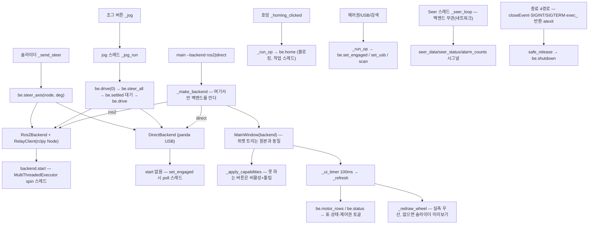

# can_relay/ui — 코드 리뷰 (날짜=버전)

## 2026-08-04 (KST) — 백엔드 교체형 시험 GUI 전체 구조 분석 (최초 인벤토리)

### 코드 버전

패키지는 2026-08-04 에 git 추적으로 들어왔다(커밋 `e56cd38`). 다만 본 리뷰 시점의 워킹트리에는
그 이후 변경이 있으므로 **파일 내용 해시**로 함께 고정한다.

| 파일 | md5(앞 8) | 줄수 |
| --- | --- | --- |
| `ui/backend_base.py` | `5a2e0c62` | 118 |
| `ui/backend_ros2.py` | `eb02fc3d` | 286 |
| `ui/backend_direct.py` | `85d0da1c` | 401 |
| `ui/app.py` | `e1e82409` | 721 |
| `ui/gui_node.py` | `c87b627e` | 108 |
| `ui/__init__.py` | `d41d8cd9`(빈 파일) | 0 |

- 브랜치 `session/7021d760`, 최신 커밋 `aae992a`
- 직전 리뷰: **없음** — 본 문서가 최초 인벤토리다.
- ⚠ **작성 경위(정직 고지)**: 이 코드는 **코딩 SOP §2 를 어기고 만들어졌다.** §2 는 「신규 파일은
  **계획 단계에서** 함수표를 생성한다」(`docs/claude_guideline/coding/coding.md:43-44`)고 요구하는데,
  코드를 먼저 쓰고 표를 만들지 않았다. 사용자 지적(2026-08-04 「코딩 규칙에는 … 함수 변수 테이블을
  읽고 수정하고 다시 … 수정하게 되어있지요?」)으로 **사후에** 이 문서를 만든다.

### 분석 분기 명시

- 분기: **전체 구조 분석**(5 파일·1,634 줄·진입점 다중)
- 감지된 도메인: **ros2-review**(rclpy pub/sub/service/param) · **concurrency**(스레드 5종·락 2종·
  Qt 시그널 6종) · **embedded-review**(`backend_direct` 의 CAN/SDO·USB 제어전송)

---

## Core 인벤토리

### 1. 목적

시험 GUI 를 **화면 1벌 + 백엔드 2종**으로 나눈 패키지다. 위젯 트리는 원본
`Tools/amr_test_gui/gui.py` 와 동일하게 두고, 지령이 나가는 경로만 갈아 끼운다:

- `Ros2Backend` — `can_relay_node` 경유(토픽·서비스). 판다를 **열지 않는다**.
- `DirectBackend` — 판다 USB 직결. 원본과 같은 프레임·같은 순서.

목적은 실기 비교다 — UI 가 같아야 차이가 나왔을 때 **백엔드 탓으로 단정**할 수 있다
(설계 근거: `docs/adr/2026-08-04-amr-test-gui-swappable-backend.md`).

백엔드가 못 하는 기능은 버튼을 **지우지 않고 비활성 + 사유 툴팁**으로 남긴다 — 화면이 항상 같고,
무엇이 다른지가 눈에 보이게 하기 위해서다.

### 2. 코드 플로우차트 (전체 — 다중 진입점)

진입점은 셋이다: ① `main()` 의 백엔드 선택 ② Qt 이벤트(버튼·슬라이더) ③ 배경 스레드(ROS spin ·
판다 폴 · Seer 폴 · 작업 스레드).



노드 24 · 엣지 21. 동반 drawio: `2026-08-04-flow.drawio`(루트 정본·패키지 병기, dangling 0 · 1:1 검증).

### 3. 함수 리스트 — 전수 115개 (누락 0)

| # | 함수 | 입력 | 출력 | 기능 | 위치 |
| --- | --- | --- | --- | --- | --- |
| 1 | `BackendBase.start` | `—` | `None` | 백그라운드 자원(스레드·노드) 기동. 하드웨어를 열지 않는다. | backend_base.py:54 |
| 2 | `BackendBase.shutdown` | `reason` | `None` | 정지 → 제어권 반환 → 자원 해제. **멱등이어야 한다** — 종료 경로가 여럿이다. | backend_base.py:57 |
| 3 | `BackendBase.meas_angle` | `node` | `float 또는 None` | 그 축의 실측 조향각(°). **신선하지 않으면 None** — 오래된 값을 실측인 척하지 않는다. | backend_base.py:61 |
| 4 | `BackendBase.motor_rows` | `—` | `dict` | `{node: (각도°\|None, 회전\|None, 전류A\|None)}`. 모르는 칸은 None 으로 둔다. | backend_base.py:65 |
| 5 | `BackendBase.status` | `—` | `tuple` | `(텍스트, 정상인가, 제어권 보유인가)` — 하단 상태 바용. | backend_base.py:69 |
| 6 | `BackendBase.settled` | `target_deg,tol_deg,nodes` | `bool` | **모든 조향축**이 허용치 안인가. 실측 없는 축은 정착으로 치지 않는다. | backend_base.py:73 |
| 7 | `BackendBase.scan` | `—` | `tuple` | 판다 열거. 반환 `(성공, 메시지)`. | backend_base.py:82 |
| 8 | `BackendBase.set_usb` | `on` | `tuple` | — | backend_base.py:86 |
| 9 | `BackendBase.set_engaged` | `on` | `tuple` | — | backend_base.py:89 |
| 10 | `BackendBase.stop` | `—` | `tuple` | — | backend_base.py:92 |
| 11 | `BackendBase.home` | `—` | `tuple` | 조향 원점 복귀. ⚠ **물리 스윙 100°+**. 취소 경로는 노출하지 않는다. | backend_base.py:95 |
| 12 | ~~`BackendBase.estop`~~ | — | — | **삭제(2026-08-04)** — UI 미노출 죽은 경로. 드라이버 `~/estop` 은 유지. | — |
| 13 | `BackendBase.steer_axis` | `node,deg` | `None` | — | backend_base.py:103 |
| 14 | `BackendBase.steer_all` | `deg` | `None` | — | backend_base.py:106 |
| 15 | `BackendBase.drive` | `mmps` | `None` | — | backend_base.py:109 |
| 16 | `BackendBase.can` | `cap` | `bool` | — | backend_base.py:113 |
| 17 | `BackendBase.why_not` | `cap` | `str` | 그 기능을 못 쓰는 이유 1줄 — 버튼 툴팁에 그대로 쓴다. | backend_base.py:116 |
| 18 | `RelayClient.__init__` | `—` | `—` | — | backend_ros2.py:47 |
| 19 | `RelayClient._load_msgs` | `—` | `—` | — | backend_ros2.py:90 |
| 20 | `RelayClient._on_joints` | `msg` | `—` | — | backend_ros2.py:100 |
| 21 | `RelayClient._on_diag` | `msg` | `—` | — | backend_ros2.py:112 |
| 22 | `RelayClient._on_low_state` | `msg` | `—` | — | backend_ros2.py:124 |
| 23 | `RelayClient.meas_angle` | `node` | `float 또는 None` | **TTL 밖이면 None** — 파라미터를 매번 읽는다(스냅샷을 쓰면 param set 이 무시된다). | backend_ros2.py:130 |
| 24 | `RelayClient.diagnostics` | `—` | `tuple` | — | backend_ros2.py:140 |
| 25 | `RelayClient.motor_states` | `—` | `dict` | — | backend_ros2.py:145 |
| 26 | `RelayClient.has_low_state` | `—` | `bool` | — | backend_ros2.py:150 |
| 27 | `RelayClient.send_steer` | `deg` | `—` | — | backend_ros2.py:154 |
| 28 | `RelayClient.send_steer_axis` | `node,deg` | `—` | — | backend_ros2.py:157 |
| 29 | `RelayClient.send_drive` | `mmps` | `—` | — | backend_ros2.py:160 |
| 30 | ~~`RelayClient.send_estop`~~ | — | — | **삭제(2026-08-04)** — `pub_estop` 과 함께 제거. | — |
| 31 | `RelayClient.call` | `client,request,timeout_s,discovery_s` | `—` | 서비스 1회 호출. 반환 `(성공, 메시지)`. **블로킹** — 작업 스레드에서 부른다. | backend_ros2.py:166 |
| 32 | `Ros2Backend.__init__` | `log,None]],args` | `—` | — | backend_ros2.py:192 |
| 33 | `Ros2Backend.cfg` | `—` | `dict` | Seer 설정 등 UI 가 읽는 파라미터(백엔드 무관 부분). | backend_ros2.py:203 |
| 34 | `Ros2Backend.why_not` | `cap` | `str` | — | backend_ros2.py:207 |
| 35 | `Ros2Backend.start` | `—` | `None` | — | backend_ros2.py:211 |
| 36 | `Ros2Backend.shutdown` | `reason` | `None` | — | backend_ros2.py:216 |
| 37 | `Ros2Backend.meas_angle` | `node` | `float 또는 None` | — | backend_ros2.py:239 |
| 38 | `Ros2Backend.motor_rows` | `—` | `dict` | — | backend_ros2.py:242 |
| 39 | `Ros2Backend.status` | `—` | `tuple` | — | backend_ros2.py:253 |
| 40 | `Ros2Backend.set_engaged` | `on` | `tuple` | — | backend_ros2.py:266 |
| 41 | `Ros2Backend.stop` | `—` | `tuple` | — | backend_ros2.py:269 |
| 42 | `Ros2Backend.home` | `—` | `tuple` | — | backend_ros2.py:272 |
| 43 | ~~`Ros2Backend.estop`~~ | — | — | **삭제(2026-08-04)**. | — |
| 44 | `Ros2Backend.steer_axis` | `node,deg` | `None` | — | backend_ros2.py:279 |
| 45 | `Ros2Backend.steer_all` | `deg` | `None` | — | backend_ros2.py:282 |
| 46 | `Ros2Backend.drive` | `mmps` | `None` | — | backend_ros2.py:285 |
| 47 | `steer_counts` | `node,deg` | `—` | 가동범위 클램프 후 조향 절대위치 counts. 원본 `gui.py:65-71` 과 같은 식. | backend_direct.py:66 |
| 48 | `drive_units` | `mmps,raw_sign` | `int` | 구동 raw 환산 + 상한 클램프. 원본 `gui.py:74-77` 과 같은 식. | backend_direct.py:72 |
| 49 | `_panda_class` | `—` | `—` | comma.ai panda 라이브러리 로드(필드킷 동봉본). 원본 `gui.py:100-105` 과 같다. | backend_direct.py:78 |
| 50 | `DirectBackend.__init__` | `log,None]]` | `—` | — | backend_direct.py:94 |
| 51 | `DirectBackend.shutdown` | `reason` | `None` | 원본 `safe_release` 와 같은 멱등 해제 — 제어권 반환 후 USB 닫기. | backend_direct.py:114 |
| 52 | `DirectBackend.meas_angle` | `node` | `float 또는 None` | **TTL 밖이면 None** — 폴링이 멈춘 뒤 남은 값을 실측인 척 쓰지 않는다(원본 High ①). | backend_direct.py:133 |
| 53 | `DirectBackend._set_meas` | `node,deg` | `None` | 실측 1건 반영 — **값과 시각을 함께** 남긴다(따로 쓸 수 있으면 언젠가 따로 쓰인다). | backend_direct.py:144 |
| 54 | `DirectBackend.motor_rows` | `—` | `dict` | — | backend_direct.py:149 |
| 55 | `DirectBackend.status` | `—` | `tuple` | — | backend_direct.py:152 |
| 56 | `DirectBackend.scan` | `—` | `tuple` | 판다 열거 — **USB 를 열지 않는다.** 원본 `gui.py:748-771` 과 같은 판정. | backend_direct.py:160 |
| 57 | `DirectBackend.set_usb` | `on` | `tuple` | — | backend_direct.py:176 |
| 58 | `DirectBackend.set_engaged` | `on` | `tuple` | 제어권 획득/반환. 원본 `gui.py:803-837` 의 순서 그대로. | backend_direct.py:197 |
| 59 | `DirectBackend.stop` | `—` | `tuple` | 원본의 「정지」 — **구동만 0**. 조향은 현 위치를 유지한다(지령 없음). | backend_direct.py:235 |
| 60 | `DirectBackend.home` | `—` | `tuple` | 조향 2축 호밍 **+ 0° 복귀**(2026-08-14). 3프레임 + 2상 판정 뒤 #61a 를 잇고, 그 직전에 `_homing` 을 내린다 — 안 내리면 #68 이 실측을 반영하지 않아 #61a 가 항상 미확인이 된다. | backend_direct.py:316 |
| 61 | `DirectBackend._wait_homed` | `—` | `tuple` | 상태워드 bit15 **2상** 판정 — 먼저 0(진행 중)을 보고, 그 다음 1(완료)을 기다린다. | backend_direct.py:357 |
| 61a | `DirectBackend._steer_zero_return` | `timeout_s` | `tuple` | **2026-08-14 신설** — 호밍 후 조향 0° 지령 + 도달 확인(`settled`, 신선한 실측만). 0° 는 `STEER_HOME`(정본 YAML)에서 나오며 새 상수를 만들지 않는다. ADR `2026-08-08-steer-zero-return-after-homing`. | backend_direct.py:382 |
| 62 | ~~`DirectBackend.estop`~~ | — | — | **삭제(2026-08-04)** — `NotImplementedError` 를 던지던 함수. | — |
| 63 | `DirectBackend.steer_axis` | `node,deg` | `None` | 한 축에만 0x607A + 0x6040=0x3F. 원본 `_steer_axis` 와 같은 2프레임. | backend_direct.py:308 |
| 64 | `DirectBackend.steer_all` | `deg` | `None` | — | backend_direct.py:313 |
| 65 | `DirectBackend.drive` | `mmps` | `None` | 구동 2축 0x60FF. 지령을 **상태로 남겨** 폴 루프가 재송신한다(원본 High ③). | backend_direct.py:317 |
| 66 | `DirectBackend._send` | `frames` | `None` | — | backend_direct.py:324 |
| 67 | `DirectBackend._loop` | `—` | `None` | 폴링 스레드 — 원본 `gui.py:1014-1062` 과 같은 순서·같은 주기. | backend_direct.py:331 |
| 68 | `DirectBackend._absorb` | `data` | `None` | 폴링 결과를 표·각도로. 원본 `_on_motor_data` 와 같은 환산·같은 게이트. | backend_direct.py:387 |
| 69 | `WheelView.__init__` | `—` | `—` | — | app.py:71 |
| 70 | `WheelView.set_angles` | `front_deg,rear_deg` | `—` | — | app.py:77 |
| 71 | `WheelView._px` | `x_m,y_m,s` | `QPointF` | — | app.py:81 |
| 72 | `WheelView.paintEvent` | `_ev` | `—` | — | app.py:85 |
| 73 | `WheelView._draw_wheel` | `p,ctr,deg,s,name` | `—` | — | app.py:108 |
| 74 | `_toggle` | `text,on_bg,on_border` | `QPushButton` | — | app.py:129 |
| 75 | `MainWindow.__init__` | `backend,seer_ip` | `—` | — | app.py:154 |
| 76 | `MainWindow._apply_capabilities` | `—` | `—` | 못 쓰는 버튼은 **지우지 않고** 비활성 + 사유 툴팁. | app.py:216 |
| 77 | `MainWindow._build_connect` | `—` | `QGroupBox` | — | app.py:232 |
| 78 | `MainWindow._build_jog` | `—` | `QGroupBox` | — | app.py:257 |
| 79 | `MainWindow._build_wheel_adj` | `—` | `QGroupBox` | — | app.py:292 |
| 80 | `MainWindow._build_settings` | `—` | `QGroupBox` | — | app.py:320 |
| 81 | `MainWindow._motor_table` | `rpm_header` | `QTableWidget` | — | app.py:344 |
| 82 | `MainWindow._fill_row` | `table,node,values` | `—` | — | app.py:363 |
| 83 | `MainWindow._build_motors` | `—` | `QGroupBox` | — | app.py:370 |
| 84 | `MainWindow._build_seer` | `—` | `QGroupBox` | — | app.py:377 |
| 85 | `MainWindow._build_wheel` | `—` | `QGroupBox` | — | app.py:384 |
| 86 | `MainWindow._build_log` | `—` | `QWidget` | — | app.py:391 |
| 87 | `MainWindow._build_status` | `—` | `QLabel` | 하단 상태 바 — 원본과 같이 **Seer 접속 정보**를 보인다. | app.py:419 |
| 88 | `MainWindow._refresh` | `—` | `—` | — | app.py:427 |
| 89 | `MainWindow._meas_angle` | `node` | `—` | — | app.py:443 |
| 90 | `MainWindow._redraw_wheel` | `—` | `—` | 실측 우선. 실측이 없을 때만 슬라이더를 미리보기로 쓴다. | app.py:447 |
| 91 | `MainWindow.log` | `msg` | `—` | — | app.py:463 |
| 92 | `MainWindow.seer_log` | `msg` | `—` | — | app.py:468 |
| 93 | `MainWindow._run_op` | `name,fn,*args` | `—` | 블로킹 백엔드 호출을 작업 스레드로 돌린다 — UI 를 잡지 않는다. | app.py:471 |
| 94 | `MainWindow.work` (inner) | `—` | `—` | — | app.py:473 |
| 95 | `MainWindow._on_op_done` | `name,ok,why` | `—` | — | app.py:481 |
| 96 | `MainWindow._on_usb` | `on` | `—` | — | app.py:493 |
| 97 | `MainWindow._on_take` | `on` | `—` | — | app.py:497 |
| 98 | `MainWindow._on_wheel_changed` | `node` | `—` | — | app.py:501 |
| 99 | `MainWindow._send_steer` | `node` | `—` | — | app.py:507 |
| 100 | `MainWindow._jog` | `label` | `—` | 조그 — crab 이므로 **바퀴를 먼저 돌리고 정착을 확인한 뒤** 주행한다. | app.py:515 |
| 101 | `MainWindow._jog_run` | `label,steer_deg,sign` | `—` | — | app.py:533 |
| 102 | `MainWindow._homing_clicked` | `—` | `—` | 호밍 — 실제로 크게 움직이므로 한 번 확인을 받는다. | app.py:570 |
| 103 | `MainWindow._seer_loop` | `—` | `—` | — | app.py:597 |
| 104 | `MainWindow._fmt_alarm` | `item` | `str` | — | app.py:649 |
| 105 | `MainWindow._on_seer_data` | `data` | `—` | — | app.py:657 |
| 106 | `MainWindow._on_seer_status` | `text,ok` | `—` | — | app.py:665 |
| 107 | `MainWindow._set_alarm_color` | `n_fatal,n_error` | `—` | — | app.py:673 |
| 108 | `MainWindow._on_clear_fatal` | `—` | `—` | Seer Fatal 클리어 — config 4300. ⚠ **로봇 상태를 바꾸는 쓰기 명령**이다. | app.py:685 |
| 109 | `MainWindow.work` (inner) | `—` | `—` | — | app.py:691 |
| 110 | `MainWindow.safe_release` | `reason` | `None` | 모든 종료 경로가 공유하는 멱등 해제 — 백엔드에 위임한다. | app.py:707 |
| 111 | `MainWindow.closeEvent` | `ev` | `—` | — | app.py:719 |
| 112 | `_make_backend` | `name,log,ros_args` | `—` | 이름으로 백엔드를 만든다. **여기서만 백엔드를 안다** — UI 는 모른다. | gui_node.py:43 |
| 113 | `main` | `args` | `int` | — | gui_node.py:54 |
| 114 | `main._on_stop_signal` | `signum,_frame` | `—` | — | gui_node.py:78 |
| 115 | `main._excepthook` | `exc_type,exc,tb` | `—` | — | gui_node.py:92 |

**중복/유사 함수**: `work` 가 두 곳(#94 `_run_op` 내부, #109 `_on_clear_fatal` 내부)에 있으나 서로 다른
작업을 감싸는 **내부 함수**라 중복이 아니다. `meas_angle`·`status`·`shutdown` 등은 `BackendBase` 계약을
두 백엔드가 각자 구현한 것이며(#3·#23·#37·#52 등) 다형성이지 중복이 아니다.
⚠ 다만 `steer_counts`(#47)·`drive_units`(#48)는 원본 `gui.py` 와 **같은 이름·같은 식**이다 —
의도된 이식이고 바이트 동일성 회귀가 그것을 고정한다(`test_backend_swap.py`).

### 4. 전역 변수 / 모듈 상수

**가변 전역 없음** — 모듈 레벨에 재대입되는 이름이 없다. 상태는 전부 인스턴스 속성이다.

| # | 사용처(함수) | 기능 | 위치 |
| --- | --- | --- | --- |
| G1 | #16·#17·#76 | `CAP_SCAN`·`CAP_USB`·`CAP_ENGAGE`·`CAP_STOP`·`CAP_HOME`·`CAP_STEER_AXIS`·`CAP_STEER_ALL`·`CAP_DRIVE`·`CAP_MOTOR_TABLE` (상수 **9종** — `CAP_ESTOP` 은 2026-08-04 삭제) | backend_base.py:29-37 |
| G2 | #18·#23 | `MEAS_TTL_S = 1.0` (상수) — ROS2 백엔드 기본 TTL | backend_ros2.py:32 |
| G3 | — | ~~`LATCHED_QOS`~~ — **삭제(2026-08-04)**. `/estop` 발행이 유일한 사용처였다. 드라이버 쪽 동명 상수(driver_node.py:53)는 그대로다. | — |
| G4 | #58·#67 | `SEER_BUS=0`·`MOTOR_BUS=2`·`SEER_GATE=30`·`CAN_KBPS=250` (상수) | backend_direct.py:45-46 |
| G5 | #47·#52 | `COUNTS_PER_DEG`·`STEER_HOME`·`STEER_LIMIT_DEG` (상수) — ⚠ **원본·정본 YAML 의 사본** | backend_direct.py:47-50 |
| G6 | #48 | `VEL_PER_MMPS`·`VEL_MAX_UNITS` (상수) | backend_direct.py:49 |
| G7 | #60·#61·#61a | `HOMING_SPEED`·`HOMING_TIMEOUT_S`·`HOMING_START_S`·`BIT15` · `STEER_ZERO_TOL_DEG`·`STEER_ZERO_TIMEOUT_S` (상수) — 뒤 2개는 원본 `gui.py` 의 동명 클래스 상수와 **같은 값이어야 한다**(회귀 고정) | backend_direct.py:53-62 |
| G8 | #52·#67 | `MEAS_TTL_S`·`RX_TTL_S` (상수) — direct 백엔드 신선도·워치독 | backend_direct.py:57-58 |
| G9 | #49 | `_KIT` (상수) — 필드킷 경로. `_find_repo_root` 로 산출 | backend_direct.py:61 |
| G10 | #75·#100·#101 | `STEER_NODES`·`DRIVE_NODES`·`STEER_LIMIT_DEG` (상수) | app.py:42-44 |
| G11 | #100·#101 | `JOG` 8방향 (상수) — 원본과 같은 값 | app.py:48-57 |
| G12 | #69~#73 | `WheelView.FRONT_X/REAR_X/WHEEL_R/BODY_L/BODY_W` (클래스 상수) | app.py:67-69 |
| G13 | #81·#82 | `MainWindow.ROWS`·`CELL_FMT` (클래스 상수) | app.py:151-152 |
| G14 | #113 | `SIGNAL_PUMP_MS = 50` (상수) | gui_node.py:36 |

**필요성 평가**: 대부분 적절한 상수다. **G5 는 정본(`config/machine/foil_a082.yaml`)의 사본**이라
드리프트 위험이 있다 — 원본 `gui.py` 는 2026-08-04 에 정본을 런타임 로드하도록 고쳤으나
**`backend_direct` 는 아직 리터럴이다**(§평가 Medium 참조).

### 5. 의존성 3-tier

| Tier | 대상 | 버전/제약 | 부재 시 동작(필수/선택) | 근거(파일:line) |
| --- | --- | --- | --- | --- |
| 빌드 | `ament_python` | format 3 | 빌드 불가 | package.xml |
| 런타임 필수 | `PyQt5` | — | 전 백엔드 공통. `ImportError` 로 기동 불가 | app.py:33-38 |
| 런타임 필수(ros2) | `rclpy`·`std_msgs`·`std_srvs`·`sensor_msgs`·`diagnostic_msgs` | Humble | `--backend ros2` 기동 불가 | backend_ros2.py:24-31 |
| 런타임 필수(ros2) | `can_relay_node` 실행 중 | 같은 도메인 | 서비스 호출이 `(False, "서비스 없음…")` 로 반환, 진단 미수신 → 화면에 「⚠ 진단 끊김」 | backend_ros2.py:176-178, 255-257 |
| 런타임 필수(direct) | comma.ai `panda` 라이브러리 | `Tools/docking_field_kit/panda` | `scan()` 이 실패 문자열 반환, USB 버튼 비활성 | backend_direct.py:76-85 |
| 런타임 필수(direct) | 판다 하드웨어 + udev(0666) | `bbaa:ddcc` | 열거 0건 → "판다 없음" | backend_direct.py:167-168 |
| 런타임 선택 | `trnav_msgs` | 상류 | `/motor/low_state` 미구독 → 모터 표는 **각도만** 채우고 그 사실을 로그로 남긴다 | backend_ros2.py:90-99, 242-252 |
| 런타임 선택 | Seer API(`T-Robot_seer_gui`) | IP 192.168.44.82 | Seer 표·알람 비활성, 상태 바에 사유 표시. **구동은 정상** | app.py:597-609 |

---

## 도메인 — ros2-review

### A-1. Subscriptions

| 토픽 | 메시지 타입 | QoS(depth·reliability·durability·history) | 콜백 함수 | 위치 |
| --- | --- | --- | --- | --- |
| `/joint_states` | `sensor_msgs/JointState` | 10 · RELIABLE · VOLATILE · KEEP_LAST | `RelayClient._on_joints` (#20) | backend_ros2.py:76 |
| `/diagnostics` | `diagnostic_msgs/DiagnosticArray` | 10 · RELIABLE · VOLATILE · KEEP_LAST | `RelayClient._on_diag` (#21) | backend_ros2.py:77 |
| `/motor/low_state` | `trnav_msgs/MotorStateArray` | 10 · RELIABLE · VOLATILE · KEEP_LAST | `RelayClient._on_low_state` (#22) | backend_ros2.py:87-88 |

### A-2. Publications

| 토픽 | 메시지 타입 | QoS | 발행 위치(함수) | 위치 |
| --- | --- | --- | --- | --- |
| `{ns}/steer_deg` | `std_msgs/Float64` | 10 · RELIABLE · VOLATILE | `send_steer` (#27) | backend_ros2.py:70 |
| `{ns}/steer_axis_deg` | `std_msgs/Float64MultiArray` | 10 · RELIABLE · VOLATILE | `send_steer_axis` (#28) | backend_ros2.py:71-72 |
| `{ns}/drive_mmps` | `std_msgs/Float64` | 10 · RELIABLE · VOLATILE | `send_drive` (#29) | backend_ros2.py:73 |

### A-3. Services / Actions

| 이름 | 타입 | 클라이언트/서버 | 콜백/요청 위치 | 위치 |
| --- | --- | --- | --- | --- |
| `{ns}/engage` | `std_srvs/SetBool` | **클라이언트** | `Ros2Backend.set_engaged` (#40) | backend_ros2.py:79 |
| `{ns}/stop` | `std_srvs/Trigger` | **클라이언트** | `Ros2Backend.stop` (#41) | backend_ros2.py:80 |
| `{ns}/home` | `std_srvs/Trigger` | **클라이언트** | `Ros2Backend.home` (#42) | backend_ros2.py:81 |
| ~~`{ns}/home_cancel`~~ | `std_srvs/Trigger` | **미생성** | — | 의도적 부재(ADR 2026-08-04 §Decision ②) |

액션 없음.

### A-4. Parameters

| 이름 | 타입 | default | declare 위치 | 사용 위치 |
| --- | --- | --- | --- | --- |
| `driver_ns` | string | `/can_relay_node` | backend_ros2.py:50 | 토픽·서비스 이름 조립(#18) |
| `meas_ttl_s` | double | `1.0` | backend_ros2.py:51 | `meas_angle` (#23) — **매 호출 재조회** |
| `seer_ip` | string | `192.168.44.82` | backend_ros2.py:52 | `MainWindow._seer_loop` (#103) |
| `seer_gui_path` | string | `/home/nvidia/T-Robot_seer_gui` | backend_ros2.py:54 | `_seer_loop`·`_on_clear_fatal` |
| `seer_enabled` | bool | `True` | backend_ros2.py:55 | `MainWindow.__init__` (#75) |

```yaml
can_relay_gui:
  ros__parameters:
    # 의미 그룹 1 — 드라이버 결합
    driver_ns: "/can_relay_node"      # 토픽·서비스 접두사
    # 의미 그룹 2 — 실측 신선도
    meas_ttl_s: 1.0                   # s, 이보다 오래된 조향 실측은 폐기
    # 의미 그룹 3 — Seer(네트워크, 백엔드 무관)
    seer_enabled: true
    seer_ip: "192.168.44.82"
    seer_gui_path: "/home/nvidia/T-Robot_seer_gui"
```

### A-5. TF frames

**없음** — 이 패키지는 TF 를 발행하지도 구독하지도 않는다(`grep -c "tf2\|TransformBroadcaster"` → 0).

### A-6. QoS 호환 매트릭스 (RxO — Requested vs Offered)

| 토픽 | offered(pub) | requested(sub) | 판정 |
| --- | --- | --- | --- |
| `/joint_states` | 드라이버 10·RELIABLE·VOLATILE | UI 10·RELIABLE·VOLATILE | ✅ 연결 |
| `/diagnostics` | 드라이버 10·RELIABLE·VOLATILE | UI 10·RELIABLE·VOLATILE | ✅ 연결 |
| `/motor/low_state` | 드라이버 10·RELIABLE·VOLATILE | UI 10·RELIABLE·VOLATILE | ✅ 연결 |
| `{ns}/steer_deg` | UI 10·RELIABLE·VOLATILE | 드라이버 10·RELIABLE·VOLATILE | ✅ 연결 |
| `{ns}/steer_axis_deg` | UI 10·RELIABLE·VOLATILE | 드라이버 10·RELIABLE·VOLATILE | ✅ 연결 |
| `{ns}/drive_mmps` | UI 10·RELIABLE·VOLATILE | 드라이버 10·RELIABLE·VOLATILE | ✅ 연결 |

불일치 축 **0** — `BEST_EFFORT`→`RELIABLE` 도, `VOLATILE`→`TRANSIENT_LOCAL` 도 없다.

### A-7. 노드 연결 그래프

```
can_relay_gui ─{ns}/steer_deg,steer_axis_deg,drive_mmps─▶ can_relay_node
can_relay_gui ◀─/joint_states,/diagnostics,/motor/low_state─ can_relay_node
can_relay_gui ─service: engage,stop,home────────────────▶ can_relay_node
can_relay_gui ─(네트워크 TCP, ROS 무관)─────────────────▶ Seer 1040·1050·4300
```

⚠ **`--backend direct` 에서는 위 그래프가 통째로 없다** — 노드는 뜨지만 토픽·서비스를 쓰지 않고
판다 USB 로 직접 나간다. 같은 프로세스가 백엔드에 따라 **ROS 그래프에 참여하기도 안 하기도** 한다.

---

## 도메인 — concurrency

### B-1. 동기화 객체

| 객체 | 종류 | 보호 자원 | 획득 위치 | 해제 위치 |
| --- | --- | --- | --- | --- |
| `RelayClient._lock` | `threading.Lock` | `_meas`·`_diag_*`·`_motor_state*` | `_on_joints`·`_on_diag`·`_on_low_state`·`meas_angle`·`diagnostics`·`motor_states` | 같은 `with` 블록 |
| `DirectBackend._can_lock` | `threading.RLock` | 판다 USB 핸들(CAN 송신·heartbeat) | `_send`(#66)·`_loop`(#67) | 같은 `with` 블록 |
| Qt 시그널 6종 | 큐 전달 | 위젯 접근 | 작업 스레드 `emit` | GUI 스레드 슬롯 |

### B-2. 공유 상태

| 변수 | 읽기 위치 | 쓰기 위치 | 변경 방식 | 공유 방식 | 보호 객체 |
| --- | --- | --- | --- | --- | --- |
| `RelayClient._meas` | `meas_angle`(#23) | `_on_joints`(#20) | dict 갱신 | ROS 콜백 ↔ GUI/작업 스레드 | `_lock` |
| `RelayClient._diag_*` | `diagnostics`(#24) | `_on_diag`(#21) | 스칼라+dict | 〃 | `_lock` |
| `DirectBackend._meas_deg`·`_meas_at` | `meas_angle`(#52) | `_set_meas`(#53) | dict 갱신 | poll 스레드 ↔ 작업/GUI | **비보호**(dict 원자 연산 의존) |
| `DirectBackend._drive_units` | `_loop`(#67) | `drive`(#65) | int 대입 | 작업 ↔ poll | **비보호**(대입 원자) |
| `DirectBackend._rx_at` | `_loop` | `_loop` | float 대입 | poll 단독 | 불필요 |
| `DirectBackend._run` | `_loop`·`status` | `set_engaged`·`shutdown` | bool 대입 | 다중 | **비보호**(대입 원자) |
| `MainWindow._jog_stop` | `_jog_run`(#101) | `_jog`(#100) | bool 대입 | GUI ↔ jog 스레드 | **비보호** |
| `MainWindow._seer_deg` | `_meas_angle`(#89) | `_on_seer_data`(#105) | dict | Seer 스레드→시그널→GUI | 시그널(단일 스레드 도달) |

### B-3. 실행 컨텍스트

| 이름 | 종류 | 우선순위·executor | 생성 위치 |
| --- | --- | --- | --- |
| GUI 메인 | Qt 이벤트 루프 | — | `gui_node.main` (#113) |
| `ros-spin` | thread(daemon) | `MultiThreadedExecutor` | backend_ros2.py:212 |
| `poll` | thread(daemon) | — | backend_direct.py:214 |
| `seer` | thread(daemon) | — | app.py:210 |
| `jog` | thread(daemon) | — | app.py:529 |
| `_run_op` 작업 스레드 | thread(daemon) | 이름=작업명 | app.py:479 |
| `clearfatal` | thread(daemon) | — | app.py:703 |
| `_ui_timer` | QTimer 100 ms | GUI 스레드 | app.py:206 |

---

## 도메인 — embedded-review

**C-1. ISR / 인터럽트**: **없음** — 이 패키지는 펌웨어가 아니다.

### C-2. Task / Thread

B-3 과 같다(중복 표 생략). 전부 daemon 스레드이며 stack 크기는 파이썬 기본, 주기는
poll ≈0.2 s · seer 0.5 s · UI 타이머 0.1 s 다.

### C-3. 공유 자원

| 자원 | 사용 Task | 보호 메커니즘 |
| --- | --- | --- |
| 판다 USB 핸들 | `poll`(heartbeat+폴+재송신) · 작업 스레드(`drive`·`steer_axis`·`home`) | `_can_lock`(RLock) — **heartbeat 포함** |
| CAN bus2 | 위와 동일 | 같은 락 |
| ROS 그래프 | `ros-spin` · 작업 스레드(서비스 호출) | rclpy 내부 + `MultiThreadedExecutor` |

### C-4. 하드웨어 인터페이스

| 페리페럴 | 핀맵 | 속도/모드 | 드라이버 위치 |
| --- | --- | --- | --- |
| USB (comma.ai panda) | VID/PID `bbaa:ddcc` | control transfer `0xe8`/`0xe9`/`0xf3` | backend_direct.py:216-217, 342 |
| CAN bus0 (Seer 측) | 판다 내부 | 250 kbps | backend_direct.py:45, 209-211 |
| CAN bus2 (모터 측) | 판다 내부 | 250 kbps, SDO expedited | backend_direct.py:45, 328-330 |

---

## 평가

severity 분포: Critical 0 / High 0 / Medium 4 / Low 4 / Info 2
조치 현황(2026-08-05 갱신): **Medium 4건 전부 완료**, Low **3건 완료**·1건 미착수(L2 `_jog_stop` 창).
E-stop 2건(M3·M4)은 사용자 결정 **「죽은 경로 삭제」**로 종결했다.
Verdict: COMMENT

> 본 문서는 이 코드를 작성한 세션이 썼으므로 `APPROVE` 를 찍을 수 없다(SOP 룰 11).
> Verdict `COMMENT` 는 「Critical/High 없음」이라는 severity 규칙의 결과이며, 승인이 아니다.

### Medium

**함수 #56 `DirectBackend.scan` — [논리] 판다 대수를 보고에서 잃는다 (Medium)**
   재현: backend_direct.py:171-174 — `self._serials = []` 로 **먼저 비운 뒤**
   `len(self._serials) or '여러'` 를 f-string 에 쓴다. `len([])==0` 이 falsy 라 **항상 "여러대"**가 되고
   실제 검출 대수(2대인지 5대인지)가 사라진다. 원본 `gui.py:767-770` 은 대수와 시리얼을 모두 찍는다.
   ⚠ 이 결함은 2026-08-04 「판다 2대 이상 차단」 조치를 반영하면서 **새로 들어간 것**이다.
   권고: 비우기 전에 개수를 지역변수로 잡고, 시리얼 목록도 원본처럼 함께 남긴다.
   **→ 조치 완료(2026-08-04)**: `found = list(self._serials)` 로 비우기 전에 잡아 대수·시리얼을
   함께 보고한다(backend_direct.py:171-179). 회귀 `test_scan_reports_actual_panda_count`
   (판다 3대 주입 → "3대"·시리얼 3개 포함·차단 유지 확인).
   ※ 사용자 확정: **판다 1대 연결이 현재 규칙** — 이 분기는 정상 경로가 아니라 규칙 위반 경보다.
   차단 자체는 규칙에 맞으며, 이번 조치는 위반 시 운용자가 원인을 볼 수 있게 한 것이다.

**전역 G5 — [품질] `STEER_HOME`·`COUNTS_PER_DEG` 가 정본의 사본이다 (Medium)**
   재현: backend_direct.py:47-50 에 리터럴로 박혀 있다. **원본 `gui.py` 는 같은 날 정본 YAML 을
   런타임 로드하도록 고쳤는데**(`_load_steer_home`) 이 파일은 사본 그대로다. 즉 원본↔이식본이
   서로 다른 출처를 쓴다 — 정본이 바뀌면 direct 백엔드만 옛 값으로 남는다.
   ⚠ `test_steer_home_sync.py` 의 사본 목록에도 이 파일이 **없다** → 드리프트를 잡을 게이트가 없다.
   권고: 원본과 같은 로더를 쓰거나, 최소한 `test_steer_home_sync.py` COPIES 에 추가한다.
   **→ 조치 완료(2026-08-04)**: **둘 다** 했다. `_load_steer_home()` 을 원본과 같은 방식으로 두어
   정본 `config/machine/foil_a082.yaml` 을 런타임 로드하고, 리터럴은 `_STEER_HOME_FALLBACK` 으로
   격하한 뒤 그 fallback 을 `test_steer_home_sync.py` COPIES 에 등재해 드리프트 게이트를 걸었다.
   실측 확인: `STEER_HOME={3: 7871815, 4: 7840086}`, 출처 = "정본 YAML (코드 사본과 일치)".
   회귀 2건(`..._comes_from_canonical_yaml`, `..._fallback_is_announced`) + 동기화 시험 12건 통과.

**함수 #30·#43·전역 G1 — [topology] E-stop 경로가 UI 에서 도달 불가하다 (Medium)**
   재현: `grep -n estop app.py` → **0건**. `pub_estop`(backend_ros2.py:74)·`send_estop`(#30)·
   `Ros2Backend.estop`(#43)·`DirectBackend.estop`(#62)·`CAP_ESTOP`(backend_base.py:34)이 전부 있으나
   **UI 에 버튼이 없어 아무도 호출하지 않는다.** `CAP_ESTOP` 은 두 백엔드의 `capabilities` 에도 없다.
   원본에 E-stop 이 없어 UI 를 동일하게 맞춘 결과이며 **의도된 부재**지만, 코드에는 죽은 경로가 남았다.
   권고: 의도라면 `CAP_ESTOP`·`estop`·`pub_estop` 을 제거하거나, 남긴다면 「UI 미노출」을 명시.
   **→ 조치 완료(2026-08-04, 사용자 결정 = 죽은 경로 삭제)**: `CAP_ESTOP`·`BackendBase.estop`·
   `pub_estop`·`send_estop`·`Ros2Backend.estop`·`DirectBackend.estop`·`LATCHED_QOS`(UI 측) 제거.
   ⚠ **드라이버의 `~/estop` 구독·`RelayBackend.estop` 은 건드리지 않았다** — 그것은 드라이버의
   계약이며 `test_backend.py` 4건·`test_backend_method35.py` 3건이 고정한다. 지운 것은 GUI 배선뿐.
   회귀 2건: `test_ui_layer_has_no_estop_wiring`(재도입 차단, 돌연변이로 검출력 확인 — 되살리면 FAILED)
   + `test_driver_estop_contract_survives`(범위 초과 삭제 차단).
   `test_estop_latch_blocks_drive` 는 GUI 배선 대신 **직접 발행**으로 바꿔 드라이버 회귀를 유지했다.

**함수 #62 — [논리] `DirectBackend.estop` 이 예외를 던진다 (Medium) → 위 항목과 함께 삭제로 종결**
   재현: backend_direct.py:304-307 이 `NotImplementedError` 를 raise 한다. 위 항목대로 현재는
   호출부가 없어 무해하나, 누군가 E-stop 버튼을 붙이면 **ros2 는 동작하고 direct 는 죽는다.**
   `BackendBase` 계약이 `capabilities` 로 가부를 표현하는데 이 함수만 예외로 표현한다 — 일관성 결여.
   권고: capability 를 근거로 UI 가 막게 하고, 구현은 무해한 no-op + 로그로 통일한다.

### Low

**함수 #95 — [품질] 검색 결과 파싱이 문자열 쪼개기다 (Low)**
   재현: app.py:487 `why.split(":")[-1].strip()` — 메시지에 콜론이 여럿이면 엉뚱한 조각이 라벨에 뜬다.
   권고: 백엔드가 `(ok, msg, payload)` 로 시리얼을 따로 주거나, 라벨 문구를 백엔드가 완성해 준다.
   **→ 조치 완료(2026-08-04)**: 콜론 쪼개기를 버리고 알려진 접두사 `"판다 검출: "` 만 벗긴다
   (app.py:487-491). 접두사가 없으면 메시지 전체를 48자로 잘라 보인다 — 엉뚱한 조각이 뜨지 않는다.

**함수 #101 — [race] `_jog_stop` 확인과 `be.drive` 사이 창이 남아 있다 (Low)**
   재현: app.py:560-566 — 확인 직후 `be.drive(sign*mmps)` 다. 원본은 같은 성질을 `RLock` 단일
   임계구역으로 닫았으나(`gui.py` Low ①), 여기서는 백엔드가 락을 소유해 앱 계층에서 닫을 수 없다.
   `DirectBackend` 는 내부 락으로 직렬화되지만 **`Ros2Backend` 는 토픽 발행이라 순서만 보장**된다.
   권고: 백엔드에 `drive_if_not_stopped(flag)` 같은 원자 연산을 두거나, 정지 후 재확인 1회.

**함수 #52 vs #23 — [품질] 신선도 TTL 출처가 백엔드마다 다르다 (Low)**
   재현: `Ros2Backend` 는 ROS 파라미터를 매 호출 재조회(#23), `DirectBackend` 는 모듈 상수
   `MEAS_TTL_S`(G8) 고정이다. 같은 개념인데 한쪽만 런타임 변경 가능하다.
   권고: direct 도 생성자 인자로 받아 `--backend` 무관하게 같은 방식으로 조정되게 한다.

**함수 #94·#109 — [스타일] 내부 함수 이름이 둘 다 `work` (Low)**
   재현: app.py:473, 691. 동작이 달라 충돌은 없으나 스택 트레이스·프로파일에서 구분이 안 된다.
   권고: `_engage_work`·`_clearfatal_work` 등으로 구분.
   **→ 조치 완료(2026-08-04)**: `_op_work`·`_clearfatal_work` 로 분리. 회귀
   `test_app_inner_thread_functions_have_distinct_names` 가 `def work(` 재도입을 막는다.

### Info

**전역 전체 — [품질] 가변 전역 0 (Info)**
   근거: 모듈 레벨 재대입 없음. 상태는 전부 인스턴스 속성이라 백엔드 2종이 한 프로세스에 공존해도
   서로 간섭하지 않는다.

**B-2 비보호 상태 5종 — [race] CPython 원자성에 의존한다 (Info)**
   근거: `_drive_units`·`_run`·`_jog_stop` 등은 스칼라 대입이라 GIL 하에서 찢어지지 않는다.
   다만 **불변식이 문서화돼 있지 않다** — 예: 「`_run=False` 를 본 뒤에는 `_th` 를 join 해도 된다」.
   현재 규모에서는 무해하나 상태가 늘면 규칙이 필요하다.

---

## 검증 (실행 명령과 출력 원문)

> 아래 블록은 **리뷰 시점(조치 전)** 의 측정이다. 조치 후 값은 이 절 끝의 「조치 후 재측정」에 있다.

```
$ md5sum src/Comm/CAN/can_relay/can_relay/ui/*.py | cut -c1-8
e1e82409 5a2e0c62 85d0da1c eb02fc3d c87b627e d41d8cd9

$ grep -c "^\s*def " src/Comm/CAN/can_relay/can_relay/ui/*.py   # 합계
115                                  # 함수표 115행과 일치 — 누락 0

$ grep -rn "CAP_ESTOP" src/Comm/CAN/can_relay/can_relay/ui/
backend_base.py:34:CAP_ESTOP = "estop"              # 선언만, 사용 0건

$ grep -c "estop" src/Comm/CAN/can_relay/can_relay/ui/app.py
0                                    # UI 도달 불가(Medium)

$ grep -c "tf2\|TransformBroadcaster" src/Comm/CAN/can_relay/can_relay/ui/*.py
0                                    # A-5 TF 없음 근거
```

**하지 않은 것**: 실기 구동 0 · 두 백엔드 동시 기동 0 · 장시간 안정성 0.
본 문서는 **정적 분석 + 기존 회귀(342 passed) 관찰**이며, 어떤 문장도 실기 거동을 확정하지 않는다.

## 후속 TODO

① ~~Medium 4건 조치~~ → **전부 완료**. M1·M2 는 회귀가 만든 대수 소실·정본 출처 통일,
   M3·M4 는 사용자 결정으로 UI 측 E-stop 배선 삭제(드라이버 계약은 유지).
② `backend_direct` 의 `STEER_HOME` 을 정본 로드로 바꾸거나 `test_steer_home_sync.py` COPIES 에 등재.
③ E-stop 경로 존치/제거 결정 — 사용자 판단 필요.
④ 본 리뷰는 작성자 self-APPROVE 불가 — 별도 lane 의 승인 필요.

---

---

## 조치 후 재측정 (2026-08-04, Medium 4 / Low 2 반영 뒤)

```
$ md5sum src/Comm/CAN/can_relay/can_relay/ui/*.py | cut -c1-8
d9707de9 c468ebc1 50d618eb 99d78196 c87b627e d41d8cd9
#  app     base     direct   ros2     gui_node __init__(빈 파일)

$ grep -c "^\s*def " src/Comm/CAN/can_relay/can_relay/ui/*.py | awk -F: '{s+=$2} END{print s}'
112                    # 115 − 4(estop 4함수 삭제) + 1(_load_steer_home 신설) = 112 ✔

$ grep -rn "CAP_ESTOP" src/Comm/CAN/can_relay/can_relay/ui/
backend_base.py:100:  #   ... 예전에는 `CAP_ESTOP`·`estop`·   ← **주석 1건뿐, 선언 0건**

$ grep -rn "estop" src/Comm/CAN/can_relay/can_relay/ui/ | grep -v '#'
                       # 0건 — UI 계층에 E-stop 배선이 남지 않았다

$ grep -c "estop" can_relay/driver_node.py can_relay/backend.py
can_relay/driver_node.py:8
can_relay/backend.py:15   # 드라이버 계약은 **그대로** — 삭제 범위를 넘기지 않았다

$ python3 -m pytest test -q
349 passed in 37.00s

$ colcon build --packages-select can_relay --symlink-install
Summary: 1 package finished [3.16s]

$ (offscreen) ros2 run can_relay can_relay_gui --backend ros2   → 기동·SIGTERM 0.50 s
$ (offscreen) ros2 run can_relay can_relay_gui --backend direct → 기동·SIGTERM 0.25 s
                       판다 1대 검출(1e003e001351333033383534)
```

**돌연변이 검출력 확인** — 회귀가 실제로 잡는지 되살려 보았다.

```
# DirectBackend.estop 을 no-op 으로 되살림
$ python3 -m pytest test/test_backend_swap.py -q
FAILED test/test_backend_swap.py::test_ui_layer_has_no_estop_wiring
1 failed, 41 passed

# 복원
$ python3 -m pytest test/test_backend_swap.py -q
42 passed
```

### 남은 소견 2건 (미착수)

| id | 내용 | 왜 미착수인가 |
|---|---|---|
| L2 | `_jog_stop` 확인 ↔ `be.drive` 창 | 앱 계층에서 못 닫는다. 백엔드에 `drive_if_not_stopped` 같은 **원자 연산**을 새로 두는 설계 변경이라 별건이다. |
| ~~L3~~ | TTL 출처가 백엔드마다 다름 | **✅ 조치 2026-08-05** — `DirectBackend` 가 TTL 을 **인스턴스 상태**(`meas_ttl_s`, 생성자 인자, 기본값 = 모듈 상수)로 들도록 바꿔 런타임 조정이 ros2 와 같은 방식이 됐다. 회귀 `test_direct_backend_ttl_is_adjustable_like_ros2` (돌연변이: 모듈 상수로 되돌리면 FAILED). |
