## 2026-08-14 (KST) — can_relay 시험 GUI + 패키지 주석 정비 delta 리뷰

### 코드 버전

- 리뷰 커밋: `f543422` (branch `main`) — ⚠ **대상 변경은 아직 미커밋**(working tree)이다.
  따라서 커밋 해시로 고정되지 않으므로 **파일 내용 해시**로 고정한다.

| 파일 | md5(앞 8) | 줄수 |
| --- | --- | --- |
| `can_relay/ui/app.py` | `a19a3ab0` | 1014 |
| `can_relay/ui/backend_base.py` | `a0795a8b` | 126 |
| `can_relay/ui/backend_direct.py` | `1957a504` | 485 |
| `can_relay/ui/backend_ros2.py` | `23a863ad` | 334 |
| `can_relay/ui/gui_node.py` | `ac23a600` | 133 |
| `can_relay/backend.py` | `49272e10` | 1081 |
| `can_relay/driver_node.py` | `690243e4` | 528 |
| `can_relay/link.py` | `f734bd71` | 561 |
| `can_relay/protocol.py` | `7bcbee2a` | 271 |
| `can_relay/safety.py` | `08e4e6b3` | 167 |
| `Tools/amr_test_gui/gui.py` | `7e7ab2ce` | 1596 |

- 직전 리뷰: [2026-08-04](2026-08-04.md) — delta 대상은 그 이후 이 세션이 바꾼 것뿐이다.
- ⚠ **이 트리에는 타 세션의 미커밋 작업이 섞여 있다**(`steer_zero_after_home` 본체 —
  `backend.py`·`driver_node.py`·`config/machine/foil_a082.yaml`). 본 리뷰는 그것을
  **현재 상태로 받아들이고** 이 세션 변경분을 평가한다.
- 같은 시각 지시: `docs/user_instructions/sessions/f111d048*.md` — "목적 ; can relay gui 기능 점검" ·
  "/ccg 주석 오류 수정, 주석은 오직 함수 설명만되어 있어야 합니다" · "코드 리뷰 규칙에 따라서 review"

### 분석 분기 명시

- 분기: **전체 구조 분석(다중 모듈) — delta 리뷰**. 변경이 11파일에 걸치고 진입점이 2개다.
- 감지된 도메인: **ros2-review**(`package.xml` · `rclpy` · `rcl_interfaces`) ·
  **concurrency**(`threading` · `MutuallyExclusiveCallbackGroup` · poll/jog/homing 스레드)
  — embedded-review 는 이 delta 가 ISR·RTOS 코드를 건드리지 않아 미적용.

---

## Core 인벤토리 (delta — 변경된 것만. 그 외는 [2026-08-04](2026-08-04.md) cross-ref)

### 1. 목적

이 delta 는 두 갈래다.

**(a) 기능 변경 — 호밍 후 조향 0° 복귀를 시험 GUI 의 판다 직결 백엔드에 이식했다.**
ADR `2026-08-08-steer-zero-return-after-homing` 은 「호밍만으로는 축이 조향 0° 에 서지
않는다」(펌웨어 GOZERO 정착값이 0° 에서 +0.178° / +0.331° 벗어남)를 근거로 호스트가 0° 를
다시 지령하도록 정했으나, 그 결정이 `RelayBackend`(드라이버)와 `Tools/amr_test_gui/gui.py`
(원본)에만 적용되고 **세 번째 경로인 `ui/backend_direct.py` 에는 닿지 않았다.** 그 결과
같은 창에서 탭만 바꾸면 호밍 후 축이 서는 자리가 달라졌다.

같은 작업에서 **판정 시점 결함**을 찾아 두 경로(원본·이식본)를 함께 고쳤다. 두 구현 모두
호밍 플래그를 `finally` 에서만 내렸는데 0° 복귀는 그 `finally` **이전**에 실행된다. 실측
흡수부는 호밍 중 `0x6064` 를 각도로 반영하지 않으므로(그 구간의 값은 실위치가 아니라 0),
정착 판정이 볼 실측이 **영원히 없어** 매번 시한을 채우고 「미확인」으로 떨어졌다.

**(b) 주석 정비 — 사용자 지시로 패키지 전체 주석을 「함수 설명」만 남기도록 재작성했다.**
날짜·수정 이력·리뷰 항목번호·사용자 지시 인용·타 구현 줄번호를 제거하고, 단위·좌표계·
부호 규약·프로토콜 순서 같은 재도출 불가 정보는 해당 함수 설명에 흡수했다. 코드는 한 줄도
바뀌지 않았음을 docstring 을 벗긴 AST(Abstract Syntax Tree) 비교로 11/11 확인했다.

### 2. 코드 플로우차트 — 호밍 + 0° 복귀 (다중 진입점 분리)

동반 drawio: `2026-08-14-flow.drawio`(루트 정본·패키지 병기 양쪽, 박스 22 · 화살표 18 ·
dangling 0 검증 통과).

```mermaid
flowchart TD
    subgraph A["경로 A — ros2 탭 (드라이버 경유)"]
        a1["#1 MainWindow._homing_clicked · 확인 대화상자"] --> a2["#3 Ros2Backend.home — ~/home 서비스(200 s)"]
        a2 --> a3["CanRelayNode._srv_home — cbg_home 그룹(직렬화)"]
        a3 --> a4["RelayBackend.home"]
        a4 --> a5["_home_sequence (_homing True→False)"]
        a5 --> a6{"성공?"}
        a6 -->|예| a7["#5 RelayBackend.steer_to_zero — set_steer_deg(0) + 도달 확인"]
        a6 -->|아니오| a8["실패 반환"]
        a7 --> a9["(ok, why · zwhy) 반환 · 노드 로그 기록"]
    end
    subgraph B["경로 B — direct 탭 (판다 직결)"]
        b1["#1 MainWindow._homing_clicked · 확인 대화상자"] --> b2["#2 DirectBackend.home — 가드: _run · _homing"]
        b2 --> b3["_homing = True · drive(0) + 상태워드 clear"]
        b3 --> b4["호밍 3프레임 x 2축 — 0x6040=0x86 / 0x6099 / 0x60FB:04=1"]
        b4 --> b5["#4 _wait_homed — bit15 0 관측 → 1 대기"]
        b5 --> b6{"원점 확인?"}
        b6 -->|예| b7["_homing = False (흡수 게이트 해제 — F1 가드 창)"]
        b6 -->|아니오| b8["실패 반환"]
        b7 --> b9["#6 _steer_zero_return — steer_all(0) + settled 대기(10 s)"]
        b10["#7 _absorb (poll 스레드) — 0x6064 → 각도 갱신"] -->|실측 공급| b9
        b9 --> b11["(zok, why · zwhy) 반환"]
    end
```

**핵심**: 경로 B 에서 `b7`(플래그 해제)이 `b9`(정착 판정) **앞**에 있어야 `b10`(흡수)이
각도를 갱신한다. 그 순서가 이 delta 의 본체이며, 동시에 아래 **F1** 의 원인이기도 하다.

### 3. 함수 리스트 — delta (신규·변경분 전수)

| # | 함수 | 입력 | 출력 | 기능 | 위치(file:line) |
| --- | --- | --- | --- | --- | --- |
| 1 | `MainWindow._homing_clicked` | `—` | `None` | 확인 대화상자 후 호밍을 작업 스레드에 위임. **변경: 주석만** | can_relay/ui/app.py:758 |
| 2 | `DirectBackend.home` | `—` | `tuple` | 호밍 3프레임 + 2상 판정 **+ 0° 복귀 연결**. 원점 확인 직후 `_homing` 해제. **변경: 기능** | can_relay/ui/backend_direct.py:285 |
| 3 | `Ros2Backend.home` | `—` | `tuple` | `~/home` 서비스 호출(시한 200 s). **변경: 주석만** | can_relay/ui/backend_ros2.py:319 |
| 4 | `DirectBackend._wait_homed` | `—` | `tuple` | bit15 2상 판정. **변경: 성공 사유 문구**(`"…초 소요. 조향 0° 복귀까지 확인하세요."` → `"원점 신호 확인(N초 소요)."`) | can_relay/ui/backend_direct.py:325 |
| 5 | `RelayBackend.steer_to_zero` | `timeout_s` | `tuple` | 0° 지령 + 도달 확인(드라이버). **변경: 주석만**(본체는 타 세션) | can_relay/backend.py:695 |
| 6 | `DirectBackend._steer_zero_return` | `timeout_s` | `tuple` | **신규** — `steer_all(0.0)` 후 `settled()` 로 도달 확인, 실패 사유에 축별 실측 기재 | can_relay/ui/backend_direct.py:352 |
| 7 | `DirectBackend._absorb` | `data` | `None` | 폴 응답 → 표·각도. 호밍 중 `0x6064` 무시 게이트 보유. **변경: 주석만** | can_relay/ui/backend_direct.py:468 |
| 8 | `MainWindow._homing_run` | `—` | `None` | (원본 GUI) 호밍 스레드. **변경: 0° 복귀 전에 `_homing` 해제** | Tools/amr_test_gui/gui.py:1321 |
| 9 | `MainWindow._steer_zero_return` | `—` | `tuple` | (원본 GUI) 0° 지령 + `_wait_settle`. **변경: 주석만**(본체는 타 세션) | Tools/amr_test_gui/gui.py:1382 |
| 10 | `MainWindow._fill_row` | `table,node,values` | `None` | (원본 GUI) 표 1행 기입. **변경 없음** — 아래 **F2** 대상 | Tools/amr_test_gui/gui.py:615 |
| 11 | `MainWindow._fill_row` | `table,node,values` | `None` | (이식본) 표 1행 기입. `None` 은 `—` 로 덮어쓴다 | can_relay/ui/app.py:397 |
| 12 | `MainWindow._redraw_wheel` | `—` | `None` | 바퀴 그림·라벨 갱신. **변경: docstring 을 실제 동작(`or` 의미)에 맞춤** | can_relay/ui/app.py:554 |
| 13 | `_HomedSpy.__init__` | `at` | `—` | (시험) 0° 지령 시 피드백 주입 대역 | test/test_backend_swap.py:520 |
| 13a | `_HomedSpy._wait_homed` | `—` | `tuple` | (시험) 원점 판정을 성공으로 대체 | test/test_backend_swap.py:533 |
| 13b | `_HomedSpy._send` | `frames` | `None` | (시험) `0x607A` 관측 시 `_absorb` 로 실측 공급 + 그 시점 `_homing` 기록 | test/test_backend_swap.py:536 |
| 14 | `_run_home` | `be` | `tuple` | (시험) 판다 대역을 세우고 `home()` 실행 | test/test_backend_swap.py:549 |

주석만 바뀐 나머지 함수(총 115 + a)는 인터페이스 불변이므로 [2026-08-04](2026-08-04.md) §3 을 cross-ref 한다.

**중복/유사 함수**: 0° 복귀가 **#5 · #6 · #9 세 벌**로 존재한다 → 아래 **F5** `[품질]`.

### 3-1. 시험 파일 함수표 — `Tools/amr_test_gui/test/test_gui_tables.py` (전수 8, 누락 0)

모터 값·Seer 값 두 표의 공용 헬퍼(`_motor_table`·`_fill_row`·`set_motor_values`) 회귀다.
창은 열되 하드웨어는 만지지 않는다.

| # | 함수 | 입력 | 출력 | 기능 | 위치(file:line) |
| --- | --- | --- | --- | --- | --- |
| T1 | `app` (fixture, module) | `—` | `QApplication` | offscreen Qt 앱 1개를 모듈 단위로 공유 | test_gui_tables.py:25 |
| T2 | `win` (fixture) | `app` | `MainWindow` | 창 생성 후 Seer 폴링·제어권 플래그를 내려 정리 | test_gui_tables.py:31 |
| T3 | `test_both_tables_have_same_shape` | `win,attr,rpm_header` | `None` | 두 표가 4×4·같은 헤더인지 | test_gui_tables.py:40 |
| T4 | `test_rows_are_labelled_by_node` | `win,attr` | `None` | 행 순서가 노드 1~4 고정인지(어긋나면 값이 엉뚱한 축에 표시) | test_gui_tables.py:49 |
| T5 | `test_cells_start_empty` | `win,attr` | `None` | 초기 칸이 전부 `—` 인지 | test_gui_tables.py:56 |
| T6 | `test_set_motor_values_writes_the_right_row_and_format` | `win` | `None` | 행 배정과 소수 자리(각도·회전 1자리, 전류 2자리) | test_gui_tables.py:61 |
| T7 | `test_none_overwrites_the_cell_with_a_dash` | `win` | `None` | **`None` 이 칸을 `—` 로 덮는지** — 숫자를 먼저 넣고 판정해야 갈라진다 | test_gui_tables.py:69 |
| T7a | `test_both_guis_render_missing_values_the_same` | `win` | `None` | 이식본(`ui/app.py`)과 같은 규칙인지(소스 대조) | test_gui_tables.py:85 |
| T8 | `test_unknown_node_is_ignored` | `win` | `None` | 배선에 없는 노드는 아무 칸도 건드리지 않는지 | test_gui_tables.py:92 |
| T9 | `test_the_two_tables_are_independent` | `win` | `None` | 모터 표 갱신이 Seer 표를 건드리지 않는지 | test_gui_tables.py:98 |

**전역 변수 / 모듈 상수**: 없음(픽스처와 시험 함수뿐).

### 3-2. 시험 파일 함수표 — `Tools/amr_test_gui/test/test_steer_zero_return.py` (전수 16, 누락 0)

호밍 후 조향 0° 복귀 회귀. `_sdo_write` 를 가로채 하드웨어 없이 프레임만 본다.

| # | 함수 | 입력 | 출력 | 기능 | 위치(file:line) |
| --- | --- | --- | --- | --- | --- |
| Z1 | `app` (fixture, module) | `—` | `QApplication` | offscreen Qt 앱 공유 | test_steer_zero_return.py:37 |
| Z2 | `win` (fixture) | `app` | `MainWindow` | 창 생성 + 시한 단축(호밍 1/3 s · 0° 1 s), 종료 시 플래그 정리 | test_steer_zero_return.py:42 |
| Z3 | `sent` (fixture) | `win,monkeypatch` | `list` | `_sdo_write` 를 가로채 `(node,idx,val,size,sub)` 기록 | test_steer_zero_return.py:54 |
| Z4 | `hold_at` | `win,counts` | `None` | 두 조향축이 그 counts 위치에 있다고 실측을 세운다(신선도 포함) | test_steer_zero_return.py:61 |
| Z5 | `run_homing` | `win,at` | `None` | 원점 신호(bit15 0→1)를 흘리고 `_homing_run` 을 끝까지 돌린다 | test_steer_zero_return.py:67 |
| Z6 | `targets` | `sent` | `dict` | `0x607A` 쓰기에서 `{node: counts}` 추출 | test_steer_zero_return.py:93 |
| Z7 | `test_homing_issues_the_zero_command` | `win,sent` | `None` | 원점 신호 뒤 0° 지령이 실제로 나가는지 | test_steer_zero_return.py:103 |
| Z8 | `test_zero_command_is_applied_with_controlword` | `win,sent` | `None` | `0x6040=0x3F` 동반 여부 | test_steer_zero_return.py:109 |
| Z9 | `test_zero_command_comes_after_the_homing_trigger` | `win,sent` | `None` | 순서(트리거 → 0°) | test_steer_zero_return.py:116 |
| Z10 | `test_gozero_settle_value_is_not_zero` | `node,expected` | `None` | 펌웨어 GOZERO 정착값이 0° 가 아님(+0.178°/+0.331°) | test_steer_zero_return.py:126 |
| Z11 | `test_axis_left_at_gozero_is_not_reported_complete` | `win,sent` | `None` | 그 자리에 선 것을 완료로 적지 않음 | test_steer_zero_return.py:132 |
| Z12 | `test_user_settle_tolerance_would_have_accepted_the_offset` | `win` | `None` | 사용자 정착 허용치를 쓰면 판정이 무의미해짐 | test_steer_zero_return.py:141 |
| Z13 | `test_missing_measurement_is_not_completion` | `win,sent` | `None` | 실측 부재는 완료가 아님 | test_steer_zero_return.py:153 |
| Z14 | `test_homing_failure_skips_the_zero_command` | `win,sent` | `None` | 원점 미확인이면 0° 지령을 내지 않음 | test_steer_zero_return.py:160 |
| Z15 | `test_measurement_is_not_absorbed_while_the_homing_flag_is_up` | `win` | `None` | 호밍 게이트가 실측 갱신을 막는 기전 | test_steer_zero_return.py:173 |
| Z16 | `test_homing_flag_is_cleared_before_the_zero_return` | `win,sent,monkeypatch` | `None` | 0° 복귀 진입 시점에 게이트가 내려가 있는지 | test_steer_zero_return.py:191 |
| Z17 | `test_zero_target_is_the_canonical_home_constant` | `—` | `None` | 0° 의 출처가 `STEER_HOME`(정본 YAML) | test_steer_zero_return.py:202 |

**전역 변수 / 모듈 상수**: `BIT15`·`STEER`·`GOZERO`(상수 3종, test_steer_zero_return.py:30-33).

### 3-3. 시험 파일 함수표 — `Tools/amr_test_gui/test/test_medium_fixes.py` (전수 35, 누락 0)

2026-08-03 리뷰 Medium 조치의 회귀. 창은 열되 하드웨어는 만지지 않는다.

| # | 함수 | 입력 | 출력 | 기능 | 위치(file:line) |
| --- | --- | --- | --- | --- | --- |
| M1 | `app` (fixture) | `—` | `None` | — | test_medium_fixes.py:25 |
| M2 | `win` (fixture) | `app` | `None` | — | test_medium_fixes.py:30 |
| M3 | `test_steer_home_comes_from_canonical_yaml` | `—` | `None` | 사본이 아니라 정본에서 읽어야 한다 — 두 곳이 갈리면 조향이 통째로 어긋난다. | test_medium_fixes.py:38 |
| M4 | `test_steer_home_matches_the_yaml_content` | `—` | `None` | 실제 파일 내용과 일치하는지 직접 대조한다(자기참조 방지). | test_medium_fixes.py:44 |
| M5 | `test_fallback_is_reported_not_silent` | `monkeypatch` | `None` | 정본을 못 읽으면 **그 사실이 출처 문자열에 남아야** 한다. | test_medium_fixes.py:52 |
| M6 | `test_seer_path_is_overridable_by_env` | `monkeypatch` | `None` | — | test_medium_fixes.py:61 |
| M7 | `test_two_pandas_block_usb` | `win,monkeypatch` | `None` | 어느 장치에 지령이 갈지 모르는 채로 진행할 수 없어야 한다. | test_medium_fixes.py:72 |
| M8 | `test_single_panda_allows_usb` | `win,monkeypatch` | `None` | — | test_medium_fixes.py:86 |
| M9 | `test_stop_failure_on_release_is_logged` | `win,monkeypatch` | `None` | 정지 프레임이 못 나갔는데 조용히 넘어가면 안 된다. | test_medium_fixes.py:98 |
| M10 | `test_poll_death_drops_the_control_toggle` | `win` | `None` | 표시와 동작이 어긋나면 안 된다 — 폴링이 죽으면 제어권 표시도 내려간다. | test_medium_fixes.py:124 |
| M11 | `test_sdo_write_guards_missing_panda` | `win` | `None` | 판다가 없으면 **정확한 사유**로 실패해야 한다 — AttributeError 로 뭉뚱그리지 않는다. | test_medium_fixes.py:135 |
| M12 | `test_can_lock_is_reentrant` | `win` | `None` | 확인과 송신을 한 임계구역에 넣으려면 재진입이 가능해야 한다(리뷰 Low ①). | test_medium_fixes.py:143 |
| M13 | `test_log_widget_has_single_writer` | `—` | `None` | 위젯을 만지는 지점이 하나여야 한다 — 호출부가 스레드를 고를 일이 없어진다. | test_medium_fixes.py:152 |
| M14 | `test_log_is_thread_safe_from_worker` | `win` | `None` | 작업 스레드에서 `log()` 를 불러도 위젯에 도달한다. | test_medium_fixes.py:159 |
| M15 | `test_poll_thread_death_actually_emits_the_signal` | `win` | `None` | ⑤의 **배선**을 고정한다 — 핸들러가 아니라 「스레드가 죽으면 알리는가」. | test_medium_fixes.py:170 |
| M16 | `test_seer_angle_is_normalized_to_our_sign` | `win` | `None` | Seer 각도는 **우리 규약(CAN)으로 정규화**해 담아야 한다. | test_medium_fixes.py:225 |
| M17 | `test_seer_table_keeps_seer_own_sign` | `win` | `None` | Seer **표**는 Seer 가 보고한 값 그대로여야 한다 — 정규화는 실측 경로에서만. | test_medium_fixes.py:240 |
| M18 | `_render` | `widget,w,h` | `None` | — | test_medium_fixes.py:248 |
| M19 | `test_wheel_drawing_includes_a_direction_arrow` | `—` | `None` | 바퀴 그림에 **지향 화살표**가 있어야 한다(2026-08-04 사용자 요청). | test_medium_fixes.py:257 |
| M20 | `test_arrow_points_opposite_ways_for_opposite_headings` | `app` | `None` | 지향이 반대면 화살표도 반대로 그려져야 한다 — 그래야 좌/우가 구분된다. | test_medium_fixes.py:272 |
| M21 | `test_zero_degrees_still_renders` | `app` | `None` | 화살표를 넣어도 0° 가 정상적으로 그려진다(회귀). | test_medium_fixes.py:285 |
| M22 | `test_take_records_seer_angles_as_handover_baseline` | `win,monkeypatch` | `None` | 제어권을 잡으면 **잡기 직전 Seer 각도**를 기준으로 기억해야 한다. | test_medium_fixes.py:293 |
| M23 | `test_release_restores_steering_to_the_seer_baseline` | `win,monkeypatch` | `None` | 반환 전에 **잡기 직전 Seer 값으로 조향을 되돌린다**. | test_medium_fixes.py:305 |
| M24 | `test_release_does_not_move_when_baseline_is_missing` | `win,monkeypatch` | `None` | 기준이 없으면 **움직이지 않는다** — 모르는 채로 3톤 차체를 돌리지 않는다. | test_medium_fixes.py:318 |
| M25 | `test_release_does_not_move_when_measurement_is_stale` | `win,monkeypatch` | `None` | 실측이 신선하지 않으면 복원하지 않는다 — 어디 있는지 모르는 채로 보내지 않는다. | test_medium_fixes.py:327 |
| M26 | `test_release_path_actually_calls_the_restore` | `win,monkeypatch` | `None` | 반환 경로가 **실제로** 복원을 부르는가 — 함수만 있고 배선이 없으면 소용없다. | test_medium_fixes.py:337 |
| M27 | `_feed` | `win,node,deg,times,ref` | `None` | `_check_seer_agreement` 를 `times` 회 먹인다. | test_medium_fixes.py:366 |
| M28 | `test_agreement_check_ignores_transient_samples` | `win` | `None` | 과도 표본 하나로 경보하지 않는다. | test_medium_fixes.py:378 |
| M29 | `test_agreement_check_warns_on_persistent_mismatch` | `win` | `None` | 계속 어긋나면 알린다 — 검사를 무력화한 것이 아니다. | test_medium_fixes.py:390 |
| M30 | `test_agreement_check_reports_recovery` | `win` | `None` | 어긋났다가 맞으면 **회복도 알린다** — 경보만 남고 끝나면 상태를 알 수 없다. | test_medium_fixes.py:398 |
| M31 | `test_agreement_check_throttles_repeat_warnings` | `win` | `None` | 같은 축이 계속 어긋나도 로그를 도배하지 않는다. | test_medium_fixes.py:407 |
| M32 | `test_set_meas_actually_runs_the_agreement_check` | `win,monkeypatch` | `None` | 실측을 기록하는 지점이 **실제로** 대조를 부르는가 — 배선이 없으면 함수만 남는다. | test_medium_fixes.py:415 |
| M33 | `test_agreement_check_stops_after_we_command_steering` | `win` | `None` | **우리가 조향을 보낸 뒤에는 대조하지 않는다.** | test_medium_fixes.py:428 |
| M34 | `test_agreement_check_runs_before_any_steer_command` | `win` | `None` | 조향을 보내기 전에는 대조가 살아 있다 — 검사를 없앤 것이 아니다. | test_medium_fixes.py:442 |
| M35 | `test_steer_command_sets_the_flag` | `win,monkeypatch` | `None` | 조향 지령 지점이 **실제로** 플래그를 세우는가(배선). | test_medium_fixes.py:451 |

**전역 변수 / 모듈 상수**: 없음(픽스처와 시험 함수뿐).

### 3-4. 시험 파일 함수표 — `Tools/amr_test_gui/test/test_single_instance.py` (전수 5, 누락 0)

**신규 파일** — 중복 실행 가드(`acquire_single_instance`) 회귀. 하드웨어·창 없이 잠금만 본다.

| # | 함수 | 입력 | 출력 | 기능 | 위치(file:line) |
| --- | --- | --- | --- | --- | --- |
| S1 | `lock_path` (fixture) | `tmp_path` | `str` | 시험용 잠금 파일 경로(실사용 `/tmp` 를 건드리지 않는다) | test_single_instance.py:14 |
| S2 | `test_first_caller_takes_the_lock` | `lock_path` | `None` | 처음 부른 쪽이 잠금을 잡고 자기 PID 를 남긴다 | test_single_instance.py:20 |
| S3 | `test_second_caller_is_refused_with_the_holder_pid` | `lock_path` | `None` | 두 번째 호출은 거부되고 **선점자 PID** 를 돌려준다 | test_single_instance.py:29 |
| S4 | `test_lock_is_released_when_the_holder_closes` | `lock_path` | `None` | 잠금 파일을 닫으면 다음 호출이 잡는다(비정상 종료 대비) | test_single_instance.py:39 |
| S5 | `test_stale_lock_file_does_not_block` | `lock_path` | `None` | 죽은 프로세스의 PID 가 적힌 파일이 남아 있어도 막지 않는다 | test_single_instance.py:49 |
| S6 | `test_main_refuses_a_second_instance` | `monkeypatch` | `None` | `main()` 이 잠긴 상태에서 창을 만들지 않고 1 을 반환한다(배선) | test_single_instance.py:60 |

**전역 변수 / 모듈 상수**: 없음(픽스처와 시험 함수뿐).

### 4. 전역 변수 / 모듈 상수 — delta

| # | 변수 | 사용처(함수) | 기능 | 위치(file:line) |
| --- | --- | --- | --- | --- |
| G1 | `STEER_ZERO_TOL_DEG = 0.1` (상수) | #6 | 0° 도달 판정 허용치(°). 원본 클래스 상수와 **같은 값이어야 한다**(회귀 고정) | can_relay/ui/backend_direct.py:38 |
| G2 | `STEER_ZERO_TIMEOUT_S = 10.0` (상수) | #6 | 0° 정착 대기 상한(초) | can_relay/ui/backend_direct.py:39 |
| G3 | `MainWindow.STEER_ZERO_TOL_DEG` · `STEER_ZERO_TIMEOUT_S` (클래스 상수) | #9 | 원본 GUI 의 같은 값. **G1·G2 의 사본** | Tools/amr_test_gui/gui.py:1290-1293 |
| G4 | `RelayConfig.steer_zero_tol_deg` · `steer_zero_timeout_s` (필드) | #5 | 드라이버 쪽 같은 개념. ROS 파라미터로 조정 가능 | can_relay/backend.py:116-120 |

**가변 전역 없음** — delta 가 만든 모듈 레벨 가변 상태는 없다(전부 인스턴스 속성·클래스 상수).
G1~G4 는 **같은 개념이 3계층에 각각 존재**한다 → **F5** `[품질]`.

### 5. 의존성 3-tier — delta

| Tier | 대상 | 버전/제약 | 부재 시 동작(필수/선택) | 근거(파일:line) |
| --- | --- | --- | --- | --- |
| 빌드 | 없음(delta 가 의존성을 추가하지 않음) | — | — | setup.py:21 `install_requires=["setuptools"]` 불변 |
| 런타임 필수(direct) | 조향축 실측 피드백(`0x6064` 폴링) | 신선도 ≤ `meas_ttl_s`(1.0 s) | **0° 복귀가 「미확인」으로 실패**하고 `home()` 전체가 실패 반환 | can_relay/ui/backend_direct.py:352-381 |
| 런타임 필수(direct) | 폴링 스레드 생존 | `set_engaged(True)` 가 기동 | 실측이 만료돼 위와 같은 실패. ⚠ **조기 종료 판정 없음** → **F4** | can_relay/ui/backend_direct.py:251 |
| 런타임 필수(ros2) | `can_relay_node` 의 `~/home` 서비스 | 탐색 5 s · 응답 200 s | `(False, "서비스 없음…")` 반환, 물리 동작 없음 | can_relay/ui/backend_ros2.py:193-201 |
| 런타임 선택 | `trnav_msgs` | — | 모터 표를 각도만 채운다(fallback) | can_relay/ui/backend_ros2.py:88-96 |
| 런타임 선택 | 정본 캘리브레이션 YAML | `steer_home_counts` | 코드 사본으로 fallback + 출처 문자열로 고지 | can_relay/ui/backend_direct.py:46-72 |

---

## 도메인 — ros2-review

### A-1. 인터페이스 변경

**없음.** 이 delta 는 토픽·서비스·파라미터·QoS(Quality of Service)를 하나도 추가·변경·삭제하지
않았다. `~/home` 의 **응답 메시지 내용**만 `"{why} · {zwhy}"` 로 길어졌다
(`Trigger.Response.message`, 타입 불변) — 근거 can_relay/backend.py:693.

### A-2. 파라미터

**delta 신규 없음.** `steer_zero_after_home`·`steer_zero_tol_deg`·`steer_zero_timeout_s`
3종은 **타 세션의 미커밋 작업**이 넣은 것이며 이 세션은 주석만 손댔다
(can_relay/driver_node.py:111-113).

### A-3. 콜백 그룹 / 실행기

`~/home` 은 `_cbg_home`, 정지 계열은 `_cbg_safety` 로 분리돼 있고 `main()` 이
`MultiThreadedExecutor` 를 쓴다(can_relay/driver_node.py:210-211, 504). **이 delta 가
`~/home` 콜백의 체류 시간을 `steer_zero_timeout_s`(기본 10 s)만큼 늘렸으나**, 그룹 분리
덕분에 `~/stop`·`~/home_cancel`·`estop` 은 그동안에도 소비된다 — 회귀
`test/test_node_concurrency.py` 가 고정한다.

## 도메인 — concurrency

### B-1. 이 delta 가 만든 공유 상태 접근

| 상태 | 쓰는 곳 | 읽는 곳 | 보호 | 평가 |
| --- | --- | --- | --- | --- |
| `DirectBackend._homing` | #2(작업 스레드) | #7(poll 스레드) · #2 자신 | **없음**(단일 bool, GIL 의존) | 원자 대입이라 찢기지 않으나 **재진입 가드로서는 구멍** → **F1** |
| `DirectBackend._meas_deg` / `_meas_at` | #7(poll) | #6(작업) | 없음 | dict 항목 갱신은 GIL 하 원자. 값·시각이 **따로** 갱신되나 `_set_meas` 가 값→시각 순이라 「시각은 새데 값은 옛것」은 발생하지 않는다 |
| `DirectBackend._steer_counts` | #6·#2(작업) | #7(poll 재송신) | `_can_lock` 은 **송신만** 보호, dict 자체는 미보호 | 통째 대입(`= {}`)·항목 대입뿐이라 실용상 안전. 기존 리뷰 범위 |

### B-2. 새 대기 루프

| 루프 | 위치 | 상한 | 중단 조건 | 평가 |
| --- | --- | --- | --- | --- |
| 0° 정착 대기(direct) | can_relay/ui/backend_direct.py:363-368 | `STEER_ZERO_TIMEOUT_S` 10 s | **시한만** | 폴 스레드 사망을 조기 감지 못 함 → **F4** |
| 0° 정착 대기(driver) | can_relay/backend.py:722-743 | `steer_zero_timeout_s` | 시한 + `self._running` | 이쪽이 옳다(비대칭) |

---

## 평가

severity 분포: Critical 0 / High 0 / Medium 3 / Low 2 / Info 2
Verdict: COMMENT

> ⚠ **본 리뷰는 작성자 self-APPROVE 를 하지 않는다**(SOP 룰 11) — 이 delta 를 작성한 세션이
> 같은 lane 에서 쓴 리뷰다. `APPROVE` 는 별도 세션·리뷰어만 찍을 수 있다.

### Medium

**함수 #2 `DirectBackend.home` — [논리][신규] 0° 복귀 대기 중 재진입 가드가 열린다 (Medium)**
   재현: can_relay/ui/backend_direct.py:285-323. `if self._homing: return False` 가드를
   통과한 뒤 `_homing = True` 로 잠그는데, 원점 확인 직후 **0° 복귀 앞에서 `_homing = False`**
   로 푼다(:317). 그 시점부터 `_steer_zero_return()` 이 끝날 때까지 **최대 10 초** 동안
   두 번째 `home()` 호출이 가드를 통과해 호밍 3프레임(`0x60FB:04=1`)을 다시 낼 수 있다 —
   첫 번째가 0° 목표를 걸어 둔 채 축이 다시 100°+ 스윙한다.
   완화(우연): 화면에서는 `MainWindow._homing` + 버튼 비활성 + `RelayTabs` 탭 잠금이 막아
   **현재 UI 로는 도달 불가**하다. 즉 결함은 **백엔드 계약** 수준에 있다.
   권고: 흡수 게이트용 플래그와 재진입 가드를 **분리**한다 — 예: `_absorb` 가 보는
   `_pos_invalid` 와 `home()` 재진입을 막는 `_homing` 을 각각 두고, `_homing` 은 `finally`
   에서만 내린다. 회귀 1건(두 번째 `home()` 이 `"호밍 이미 진행 중"` 을 받는지) 추가.

**함수 #10 `MainWindow._fill_row`(원본) — [논리][잔존] `None` 을 `—` 로 덮지 않아 옛 숫자가 남는다 (Medium)**
   재현: Tools/amr_test_gui/gui.py:615-622. docstring 은 「`None` 인 칸은 `—` 로 남는다」라고
   적었지만 코드는 `if val is not None:` 로 **셀을 건드리지 않는다**. 폴링이 죽어 값이 `None`
   으로 바뀌어도 화면에는 **직전 숫자가 그대로 살아 있다** — `MEAS_TTL_S` 로 「멈춘 화면을
   실측으로 믿지 않게」 만든 설계와 정면으로 어긋난다. 이식본(#11, can_relay/ui/app.py:397)은
   `"—"` 를 써 넣어 동작이 다르다.
   ⚠ **이 세션의 누락이다.** 주석 정비에서 「사실 오류 5건 정정」이라 보고했으나 이 한 건은
   날짜·리뷰 태그가 붙어 있지 않아 패턴 검색에 걸리지 않았고 **거짓 docstring 이 그대로 남았다**.
   권고: 코드를 이식본과 같게(`—` 기입) 맞추고 docstring 을 유지하거나, 「갱신하지 않는다」로
   docstring 을 고친다. **둘 중 어느 쪽인지는 실기 표시 정책 결정이 필요**하므로 이번 범위 밖으로
   두고 사용자 판단을 구한다. 최소 조치로 docstring 만이라도 즉시 사실에 맞춰야 한다.

**함수 #13a·#6 — [테스트][신규] 대역이 `_wait_homed` 를 대체해 실경로가 시험되지 않는다 (Medium)**
   재현: test/test_backend_swap.py:533. `_HomedSpy._wait_homed` 가 항상 성공을 돌려주므로
   「상태워드 2상 판정 → `_homing` 해제 → `_absorb` 갱신」 사슬이 **실제 코드로는 한 번도
   관통되지 않는다**. 플래그 해제 시점(#13b 가 기록)만 검증된다.
   또한 **F1(재진입)** 을 덮는 시험이 0건이다.
   권고: `_status_word` 를 대본으로 흘려 `_wait_homed` 실물을 통과시키는 시험 1건 추가
   (`HOMING_START_S`·`HOMING_TIMEOUT_S` 를 monkeypatch 로 줄이면 빠르다) + F1 회귀 1건.

### Low

**함수 #6 `DirectBackend._steer_zero_return` — [논리][신규] 폴 스레드 사망을 조기 감지하지 않는다 (Low)**
   재현: can_relay/ui/backend_direct.py:363-368. 대기 루프의 종료 조건이 **시한뿐**이다.
   폴 스레드가 죽으면(`_loop` 예외 → `_run = False`) 실측이 TTL 로 만료돼 결국 실패하지만,
   그 사이 **10 초를 통째로 기다린다.** 드라이버 쪽 동일 함수(#5, can_relay/backend.py:741)는
   `if not self._running: return False, "…백엔드가 내려갔다"` 로 즉시 빠진다 — 같은 개념의
   두 구현이 비대칭이다.
   권고: `if not self._run: return False, "폴링이 중단됐다"` 를 루프에 추가.

**함수 #5·#6·#9 · G1~G4 — [품질][신규] 0° 복귀가 3벌, 임계값이 3벌 (Low)**
   재현: can_relay/backend.py:695 · can_relay/ui/backend_direct.py:352 ·
   Tools/amr_test_gui/gui.py:1382. 세 구현이 같은 절차(0° 지령 → 정착 확인 → 사유 문자열)를
   각자 갖고, 허용치·시한 상수도 각각 있다(G1·G2 / G3 / G4). 지금은 회귀
   `test_direct_zero_return_constants_match_original` 이 **direct ↔ 원본**만 묶어 두고,
   **드라이버(G4)와의 일치는 아무도 고정하지 않는다.**
   권고: 최소한 회귀를 한 겹 더 얹어 G4 까지 묶거나, `safety.py`(순수 함수 계층)에 판정
   헬퍼를 두고 세 곳이 부르게 한다. ⚠ 단, direct 백엔드는 **원본과의 바이트 대조 기준**이라
   구조 통합은 그 계약을 깨지 않는 범위에서만.

### Info

**[테스트][잔존] `test_drive_command_is_republished_so_watchdog_does_not_kill_the_jog` 는 부하 시 간헐 실패한다 (Info)**
   재현: test/test_gui_node.py:283-326. 한 실행기에 드라이버·클라이언트를 함께 올리는 rig 라
   타이머가 밀리면 깨진다(시험 자신의 주석이 이를 적어 두었다). 이번 세션에서 1회 실패했고,
   **변경 전 판(`backend_ros2.py` 원본)으로 되돌려도 동일하게 실패**해 이 delta 와 무관함을
   확인했다. 파일 단위 실행(16 passed)과 최종 전체 실행(415 passed)에서는 통과했다.
   권고: 이 delta 의 조치 대상 아님. 별도로 rig 를 분리하거나 판정을 발행 횟수만으로 좁힐 것.

**[품질][신규] 주석 정비로 값의 근거 포인터가 코드에서 사라졌다 (Info)**
   재현: 예 — `STEER_ZERO_TOL_DEG` 의 「왜 0.1 인가」가 코드에는 없고 ADR·code_updates 에만
   있다. 이는 **사용자 지시(「주석은 오직 함수 설명만」)에 따른 의도된 결과**이며 결함이 아니다.
   다만 `conventions.md` §4 가 「상수·수치의 근거」를 담을 것으로 지정한 것과는 긴장 관계이므로,
   근거 추적이 문서 전용이 됐다는 사실을 기록해 둔다.
   권고: 없음(기록 목적). 규약 문구를 조정할지는 사용자 결정 사항.

### 직전 리뷰(2026-08-04) findings 상태

| 항목 | 상태 | 근거 |
| --- | --- | --- |
| Medium ② direct 가 홈 상수를 코드에만 두던 것 | **[해결 유지]** | `_load_steer_home()` 정본 YAML 로드 유지 (backend_direct.py:45) |
| Medium ① 판다 2대 보고에서 대수 소실 | **[해결 유지]** | `scan()` 이 비우기 전에 대수·시리얼을 잡는다 (backend_direct.py:180-195) |
| Low ③ direct 만 TTL 런타임 조정 불가 | **[해결 유지]** | `meas_ttl_s` 인스턴스 상태 (backend_direct.py:110) |
| (신규 영역) 호밍 후 0° 복귀 | **[신규]** | 본 리뷰 §목적 (a) |

---

---

## 조치 부기 — 2026-08-14 (리뷰 직후, 같은 날)

> 위 평가는 **조치 전 스냅샷**이다. 아래는 그 뒤 사용자 결정으로 수행한 조치이며,
> severity 분포 2줄은 스냅샷 값 그대로 둔다(날짜=버전 원칙).

**F2(Medium, 함수 #10) — [해결]** 사용자가 **안 A(코드를 이식본에 맞춤)** 를 선택했다.

- `Tools/amr_test_gui/gui.py:615` `_fill_row` 가 `None` 인 칸을 `—` 로 **덮어쓰도록** 바꿨다
  (종전: `if val is not None:` 로 건너뜀). 이제 두 GUI 의 표시 규칙이 같다.
- 부수 효과(의도된 것): **호밍 중 각도 칸이 `—`** 로 보인다. 그 구간의 위치는 무효이므로
  「지금 위치를 모른다」가 화면에 정직하게 드러난다. 종전에는 호밍 시작 직전 각도가 그대로
  남아 축이 100° 넘게 도는 동안에도 옛 값이 떠 있었다.
- ⚠ **회전·전류 칸은 폴 응답에서 그 객체가 빠지면 `—` 로 잠깐 바뀔 수 있다**(간헐 깜빡임).
  실기에서 거슬리면 각도 칸만 덮는 절충으로 좁힐 수 있다.

**시험 — 종전 회귀가 이 동작을 고정하지 못하고 있었다.**
`test_none_leaves_the_cell_untouched` 는 **빈 표**(모든 칸이 초기값 `—`)에서 한 번만 채워
판정해 **두 동작 모두 통과**했다. 이름과 주석만 「덮어쓰지 않는다」였다.
⇒ **T7** `test_none_overwrites_the_cell_with_a_dash` 로 대체 — 숫자를 먼저 써 넣은 뒤 `None` 을
주어 갈라지게 했고, **T7a** `test_both_guis_render_missing_values_the_same` 로 이식본과의
규칙 일치를 소스 대조로 고정했다.

**검증**: 돌연변이(옛 동작 복원) 주입 시 **T7·T7a 2건 실패** → 검출 확인, 원복 후
`Tools/amr_test_gui` 전체 **155 passed**(종전 154 + 신규 2 − 대체 1).

**남은 것**: F1(재진입 가드 창) · F3(대역이 `_wait_homed` 대체) · F4 · F5 는 **[잔존]**.
