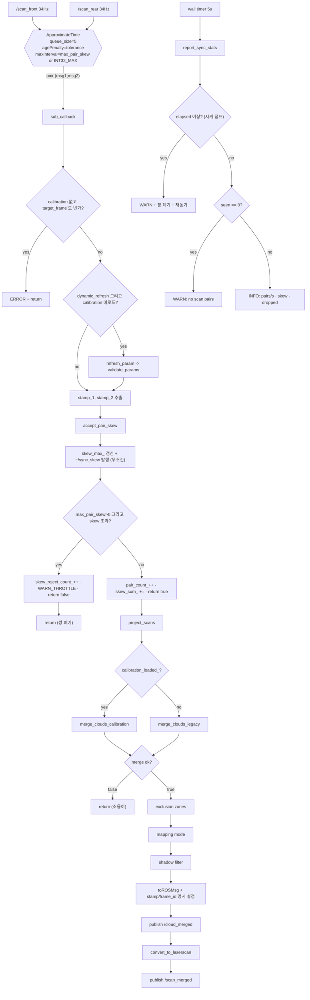

## 2026-08-08 (KST) — dual-laser-merger-sync 리뷰

> 리뷰 lane: 별도 세션(`code-reviewer`). 작성자 lane 은 self-APPROVE 하지 않는다(SOP 룰 11).
> 본 문서는 **리뷰 → 수정 → 재검증**을 한 파일에 담는다. 각 항목에 `[해결]`/`[잔존]` 을 붙였다.

### 코드 버전
- 리뷰 커밋: `4dfb626` (branch `main`) + **uncommitted working tree**
- 리뷰 시점 대상 4파일: `src/dual_laser_merger.cpp`, `include/dual_laser_merger/dual_laser_merger.hpp`,
  `package.xml`, `CMakeLists.txt` (`git diff --stat` → 4 files, +159/-3)
- 수정 후 해시: `src/dual_laser_merger.cpp` md5 `48c90146b6392a56506f9f16758e9945`
  (수정으로 `launch/dual_sick_merger.launch.py` 추가 변경)
- 직전 리뷰: **없음** (`find docs src -path '*code_review*' -iname '*merger*'` → 0건) — 최초 리뷰
- 검증 환경: ROS2 Humble, aarch64 (Linux 5.15.136-tegra), PCL 1.12, gcc `-std=c++17 -Wall -Wextra`
- 같은 시각 `docs/user_instructions/` 세션 `66e0baff` entry (2026-08-08 07:28 «lildar_merger 동기화»)

### 분석 분기 명시
- 분기: **단위 코드 리뷰** (1 노드 `merger_node::MergerNode`)
- 감지된 도메인: **ros2-review** (`package.xml`·`rclcpp`·`.launch.py`·`ament_cmake_auto`) /
  **concurrency** (message_filters 콜백, wall timer, 비보호 통계 멤버) — embedded-review 미해당

---

## Core 인벤토리

### 1. 목적

두 개의 2D LaserScan(전방 `/scan_front`, 후방 `/scan_rear`)을 하나의 360° 스캔으로 합치는 ROS2
composable 노드다. `message_filters::sync_policies::ApproximateTime` 로 두 스캔을 시각 기준으로
짝짓고, `laser_geometry::LaserProjection` 으로 각각 PointCloud2 로 투영한 뒤, 캘리브레이션 YAML 의
2D 강체변환으로 `merged_scan` 프레임에 정렬해 합치고, 제외영역·매핑모드·shadow 필터를 거쳐
`/scan_merged`(LaserScan)와 `/cloud_merged`(PointCloud2)로 발행한다.

이번 변경이 겨냥한 결함은 **쌍의 시각 어긋남(skew)에 상한이 없다**는 것이다. 노드는
`setAgePenalty(tolerance)` 만 호출했고, 정책이 소유한 유일한 시각거리 상한 `max_interval_duration_`
는 생성자 기본값 `rclcpp::Duration(INT32_MAX, 999999999)` 로 남아 있었다
(`/opt/ros/humble/include/message_filters/message_filters/sync_policies/approximate_time.h:121`).
`age_penalty_` 는 `:753`·`:776`·`:797`·`:805` 의 **후보 비교 비용식**에만 등장하고 어떤 상한
비교에도 쓰이지 않는다 ⇒ 「tolerance 는 상한이 아니다」는 참.

**실기 실측(2026-08-08, SICK 2대, 507초 연속)**: 두 스캐너가 자유구동이라 skew 는 고정값이 아니라
**삼각파로 순환**한다 — `0.48 ms ↔ 14.21 ms`, **주기 ≈ 260 s**, 전 구간 최대 **15.32 ms**
(= 34.05 Hz 주기의 절반). 역위상 정점에서는 `pairs/s` 가 34.05 → **29.47** 로 처진다.

### 2. 코드 플로우차트 (단위 — `sub_callback` + 보고 타이머)

동반 drawio: `2026-08-08-flow.drawio` — 박스 35 · 화살표 35, 아래 mermaid 와 1:1.
`python3 docs/claude_guideline/code_review/checks/drawio_validate.py …` → `dangling 0 — 통과`



### 3. 함수 리스트

| # | 함수 | 입력 | 출력 | 기능 | 위치(file:line) |
| --- | --- | --- | --- | --- | --- |
| 1 | `MergerNode::MergerNode` | `const rclcpp::NodeOptions&` | — | 파라미터 선언·검증, pub/sub·TF·synchronizer·보고 타이머 구성 | src/dual_laser_merger.cpp:19-110 |
| 2 | `MergerNode::declare_param` | — | (멤버) | 파라미터 38개 선언 (신규 4개는 read_only descriptor 동반) | src/dual_laser_merger.cpp:112-193 |
| 3 | `MergerNode::refresh_param` | — | (멤버) | 런타임 재읽기 25개 후 `validate_params()` | src/dual_laser_merger.cpp:195-227 |
| 4 | `MergerNode::validate_params` | — | (멤버 보정) | 범위·화이트리스트 검증 9건, 위반 시 WARN + 기본값 복원 | src/dual_laser_merger.cpp:229-280 |
| 5 | `MergerNode::accept_pair_skew` **[신규]** | `t1`, `t2`, `double&` | `bool` | skew 계측(무조건) + `~/sync_skew` 발행 + 게이트 판정 | src/dual_laser_merger.cpp:282-313 |
| 6 | `MergerNode::resolve_output_stamp` **[신규]** | `t1`, `t2` | `rclcpp::Time` | `output_stamp` 정책 5분기 | src/dual_laser_merger.cpp:315-334 |
| 7 | `MergerNode::report_sync_stats` **[신규]** | — | — | 타이머 구동 통계: 시계점프 가드 · 무쌍 경고 · 창/누적 분리 로그 | src/dual_laser_merger.cpp:336-376 |
| 8 | `MergerNode::load_calibration` | — | `bool` | 캘리브 YAML 파싱, m2f/m2r 사전계산, static TF 2건 방송 | src/dual_laser_merger.cpp:378-470 |
| 9 | `MergerNode::load_filter_config` | — | `bool` | `exclusion_zones` 파싱·유효성 검사 | src/dual_laser_merger.cpp:472-523 |
| 10 | `MergerNode::apply_exclusion_zones` | `cloud&` | (in-place) | AABB 내부 점 제거 (O(N·Z)) | src/dual_laser_merger.cpp:525-557 |
| 11 | `MergerNode::apply_mapping_mode_filter` | `cloud&` | (in-place) | `atan2` 각도 범위 밖 점 제거 | src/dual_laser_merger.cpp:559-579 |
| 12 | `apply_moving_average_3pt` (static free) | `const vector<float>&`, `vector<float>&` | (out) | 원형 3점 이동평균 | src/dual_laser_merger.cpp:581-590 |
| 13 | `MergerNode::transform_cloud` | `cloud&`, `tx`,`ty`,`cos`,`sin` | (in-place) | 2D 강체변환 | src/dual_laser_merger.cpp:592-602 |
| 14 | `MergerNode::project_scans` | 스캔 2, `PointCloud2&` ×2 | (out) | (선택 평균필터 후) `projectLaser` 2회 | src/dual_laser_merger.cpp:606-642 |
| 15 | `MergerNode::merge_clouds_calibration` | `cloud_in_1/2`, `out&` | `bool` | flip 보정 → 변환 2회 → 합산 | src/dual_laser_merger.cpp:644-681 |
| 16 | `MergerNode::merge_clouds_legacy` | 스캔 2, `cloud_in_1/2`, `out&` | `bool` | 동적 TF 방송 + `tf2_buffer->transform` → 합산 | src/dual_laser_merger.cpp:683-757 |
| 17 | `MergerNode::apply_shadow_filter` | `cloud&` | (in-place) | KdTree radiusSearch 로 고립점 inf 처리 | src/dual_laser_merger.cpp:759-787 |
| 18 | `MergerNode::convert_to_laserscan` | `cloud_out`, `output_frame`, `merged&` | (out) | 포인트→각도 bin 최소거리 투영 | src/dual_laser_merger.cpp:789-846 |
| 19 | `MergerNode::sub_callback` | 스캔 2 | — | 오케스트레이터: 게이트→투영→병합→필터→발행 | src/dual_laser_merger.cpp:850-936 |
| 20 | `RCLCPP_COMPONENTS_REGISTER_NODE` (매크로 진입점) | — | 플러그인 등록 | composable node 등록 | src/dual_laser_merger.cpp:942 |
| 21 | `generate_launch_description` (정본 런치) | — | `LaunchDescription` | static TF + 단독 merger 노드(둘 다 respawn 2 s), 신규 파라미터 4종 노출 | launch/dual_sick_merger.launch.py:22-130 |
| 22 | `generate_launch_description` (데모) | — | `LaunchDescription` | rosbag 데모 (bag 은 8c1d961 에서 삭제됨) | launch/demo_laser_merger.launch.py |
| 23 | `generate_launch_description` (통합) | — | `LaunchDescription` | sick 런치 + merger 런치 include | launch/sick_with_merger.launch.py:24-46 |

**중복/유사 함수**: #10 과 #11 이 "reserve → 술어 → push_back → 헤더 복원 → move" 동일 골격을
술어만 바꿔 반복 — `[품질]` L8(잔존).

### 4. 전역 변수 / 모듈 상수

**진정한 전역 변수·`extern` 노출 변수·파일 스코프 `static` 변수: 없음.** `static` 은 무상태 함수
#12 하나뿐이며, 모든 가변 상태는 `MergerNode` 인스턴스 멤버다(컴포넌트로서 올바른 설계).

**하드코딩 리터럴**(모듈 상수로 승격되지 않은 값):

| # | 리터럴 | 사용처(함수) | 기능 | 위치(file:line) |
| --- | --- | --- | --- | --- |
| G1 | `2000` (상수) | #5 | skew 거부 WARN throttle 주기 [ms] | src/dual_laser_merger.cpp:305 |
| G2 | ~~`5.0`~~ → 파라미터화 **[해결]** | #7 | 통계 보고 주기 → `sync_report_period` | src/dual_laser_merger.cpp:189 |
| G3 | `1e3` (상수, 5회) | #5·#7·#19 | s→ms 변환 | 다수 |
| G4 | `-2.356194` / `2.356194` (상수) | #2 | 매핑모드 기본 각도 [rad] (∓3π/4) | src/dual_laser_merger.cpp:170-171 |
| G5 | `10.0 *` (상수) | #7 | 시계 점프 판정 배수 | src/dual_laser_merger.cpp:345 |

### 5. 의존성 3-tier

| Tier | 대상 | 버전/제약 | 부재 시 동작(필수/선택) | 근거(파일:line) |
| --- | --- | --- | --- | --- |
| 빌드 | `ament_cmake_auto` | ≥3.5 | 빌드 불가 | CMakeLists.txt:8-9 |
| 빌드 | `rclcpp`, `rclcpp_components` | Humble | 빌드 불가 | package.xml:15-16 |
| 빌드 | `sensor_msgs`·`geometry_msgs`·`laser_geometry`·`message_filters`·`pcl_conversions`·`tf2`·`tf2_ros`·`tf2_sensor_msgs` | Humble | 빌드 불가 | package.xml:14-24 |
| 빌드 | **`std_msgs`** **[신규]** | Humble | `std_msgs/msg/float64.hpp` 미해결 | package.xml:25, hpp:43 |
| 빌드 | **`rcl_interfaces`** **[신규]** | Humble | `ParameterDescriptor` 미해결 | package.xml:26, hpp:44 |
| 빌드 | `yaml-cpp` | `find_package REQUIRED` | 빌드 불가 | CMakeLists.txt:10,14 |
| 빌드 | PCL | 1.12 (`/usr/include/pcl-1.12`) | 빌드 불가 | hpp:18-21 |
| 빌드 | `bag/` 디렉토리 | **선택 (`if(EXISTS)`)** | 부재 시 install 스킵 — 종전엔 **빌드 중단** | CMakeLists.txt:23-26 |
| 런타임 필수 | `/scan_front` 발행자 (SICK) | 34 Hz | **`/scan_merged` 무발행 + 5초마다 WARN** (종전엔 무발행 + 완전 침묵) | cpp:41-42, launch:56 |
| 런타임 필수 | `/scan_rear` 발행자 (SICK) | 동상 | 동상 | cpp:43-44, launch:57 |
| 런타임 필수 | `base_link → scan_merged` static TF | `static_transform_publisher` | 정본 런치가 동반 기동. 부재 시 하류가 위치 확정 불가 | launch:37-43 |
| 런타임 선택 | `calibration_file` YAML | `merged_lidar_to_scan_front` / `..._rear_corrected` | fallback: legacy 모드(`target_frame` + offset + tf2). 둘 다 없으면 콜백 진입 즉시 ERROR·return | cpp:70-82, 380-383, 464-469 |
| 런타임 선택 | `filter_config_file` YAML | `exclusion_zones` 시퀀스 | fallback: WARN 후 `enable_exclusion_zones=false` 로 계속 동작 | cpp:85-93, 484-489 |
| 런타임 선택 | `/clock` (`use_sim_time`) | — | fallback: 시계 점프 감지 시 창 폐기 + 재동기 **[해결]** | cpp:344-355 |
| 런타임 선택 | `Tools/lidar_merger_sync_check/` | git 미추적 | 부재 시 신규 기능 검증 수단 없음 | 별도 리뷰 `docs/code_review/lidar-merger-sync-check/` |

---

## 도메인 인벤토리

### ros2-review

**A-1. Subscriptions**

| 토픽 | 타입 | QoS | 콜백 | 위치 |
| --- | --- | --- | --- | --- |
| `laser_1_topic` (`/scan_front`) | `LaserScan` | SensorDataQoS: d5 · BEST_EFFORT · VOLATILE | (message_filters → #19) | cpp:41-42; launch:56 |
| `laser_2_topic` (`/scan_rear`) | `LaserScan` | 동일 | 동일 | cpp:43-44; launch:57 |
| `/tf`, `/tf_static` | `TFMessage` | `TransformListener` 기본 | 내부 버퍼 | cpp:46-47 |

**A-2. Publications**

| 토픽 | 타입 | QoS | 발행 위치 | 위치 |
| --- | --- | --- | --- | --- |
| `/scan_merged` | `LaserScan` | SensorDataQoS (BEST_EFFORT d5) | #19 | cpp:33-34, 935 |
| `/cloud_merged` | `PointCloud2` | SensorDataQoS | #19 | cpp:35-36, 929 |
| **`~/sync_skew`** **[신규]** | `Float64` | **RELIABLE KeepLast(50)** **[해결 — 종전 BEST_EFFORT]** | #5 | cpp:38-39, 296-301 |
| `/tf` | `TransformStamped` | Broadcaster 기본 (RELIABLE d100) | #16 (legacy 경로, 콜백마다) | cpp:64, 716, 742 |
| `/tf_static` | `TransformStamped` ×2 | TRANSIENT_LOCAL | #8 (1회) | cpp:65, 451 |

**A-3. Services / Actions** — **해당 항목 없음** (`grep -n "create_service\|add_on_set_parameters_callback"` → 0건).

**A-4. Parameters** (신규 4개 굵게)

| 이름 | 타입 | default | declare | 사용 |
| --- | --- | --- | --- | --- |
| `laser_1_topic`/`laser_2_topic`/`merged_scan_topic`/`merged_cloud_topic` | string | `laser_1`/`laser_2`/`merged`/`merged_cloud` | cpp:114-117 | cpp:34,36,41,43 |
| `target_frame` | string | `""` | cpp:118 | cpp:690,716,853,918 |
| `tolerance` | double | `0.01` | cpp:119 | **cpp:57 (`setAgePenalty`)**, 707, 733 |
| `queue_size` | int | `hardware_concurrency()` | cpp:120-121 | cpp:51 |
| `min_height` | double | **`numeric_limits<double>::min()` = +2.2e-308** | cpp:122 | cpp:819 `[잔존]` M7 |
| `max_height` | double | `::max()` | cpp:123 | cpp:818 |
| `angle_min`/`angle_max`/`angle_increment` | double | `-π`/`π`/`π/180` | cpp:124-126 | cpp:795-797 |
| `scan_time` | double | `1/30` (런치 `0.067`) | cpp:127 | cpp:799 `[잔존]` L9 |
| `range_min`/`range_max` | double | `0.0`/`DBL_MAX` | cpp:128-129 | cpp:761,800-801 |
| `inf_epsilon`/`use_inf` | double/bool | `1.0`/`true` | cpp:130-131 | cpp:782,805,811 |
| `enable_dynamic_param_refresh` | bool | `false` (런치 `True`) | cpp:132 | cpp:859-863 |
| `laser_{1,2}_{x,y,yaw}_offset` | double ×6 | `0.0` | cpp:133-138 | cpp:694-697,720-723 |
| `allowed_radius` | double | `1.0` | cpp:139 | cpp:761 |
| `enable_shadow_filter`/`enable_average_filter` | bool | `false` | cpp:140-141 | cpp:913,610 |
| `calibration_file` | string | `""` | cpp:144 | cpp:380,387 |
| `merged_scan_frame`/`laser_1_frame`/`laser_2_frame` | string | `merged_scan`/`scan_front`/`scan_rear` | cpp:145-147 | cpp:421,436,918 `[잔존]` L10 |
| `filter_config_file`/`enable_exclusion_zones` | string/bool | `""`/`false` (런치 `True`) | cpp:150-151 | cpp:85,901 |
| `enable_mapping_mode`/`mapping_keep_angle_min`/`_max` | bool/double | `false`/∓2.356194 | cpp:169-171 | cpp:96,907,568 |
| **`max_pair_skew`** | **double** | **`0.0` [s] · read_only** | **cpp:177-181** | **cpp:58-61, 265-270, 303-311** |
| **`publish_sync_diagnostics`** | **bool** | **`true` · read_only** | **cpp:183-187** | **cpp:104, 296** |
| **`sync_report_period`** | **double** | **`5.0` [s] · read_only** | **cpp:189-192** | **cpp:106, 345** |
| **`output_stamp`** | **string** | **`laser_1`** (런타임 변경 가능) | **cpp:195** | **cpp:271-279, 317-333** |

**A-5. TF frames**

| frame | parent | 발행 노드 | 정적/동적 | 위치 |
| --- | --- | --- | --- | --- |
| `scan_merged` | `base_link` | `static_transform_publisher` (외부) | 정적 | launch:37-43 |
| `scan_front` | `merged_scan_frame` | `dual_laser_merger` | 정적 (기동 1회) | cpp:419-431, 451 |
| `scan_rear` | `merged_scan_frame` | `dual_laser_merger` | 정적 (기동 1회) | cpp:434-446, 451 |
| `<sensor>_calibrated` | `<sensor>` | `dual_laser_merger` (legacy) | **동적, 콜백마다** | cpp:705, 716, 731, 742 |

**A-6. QoS 호환 매트릭스 (RxO)**

| 토픽 | offered | requested | 판정 |
| --- | --- | --- | --- |
| `/scan_front`·`/scan_rear` | SICK 드라이버 **기본 RELIABLE** (`SickSafetyscannersRos2.cpp:49` = `create_publisher<LaserScan>("scan", 1)`) | 본 노드 BEST_EFFORT | ✅ (RELIABLE → BEST_EFFORT 호환) |
| `/scan_merged` | BEST_EFFORT d5 | icp_odometry `qos:2` (BEST_EFFORT) | ✅ |
| `/cloud_merged` | BEST_EFFORT d5 | **소비자 0** | ⚠ 고아 발행 `[잔존]` |
| **`~/sync_skew`** | **RELIABLE d50** | `ros2 topic echo` 기본 RELIABLE | ✅ **[해결]** — 실기 `ros2 topic echo /dual_laser_merger/sync_skew --once` → `data: 5.5969e-05` 수신 확인 |
| `~/sync_skew` | 동상 | `merger_sync_check.py` BEST_EFFORT | ✅ |
| `/tf_static` | TRANSIENT_LOCAL | tf2 리스너 TRANSIENT_LOCAL | ✅ |

**A-7. 노드 연결 그래프**

```text
sick_safetyscanners2 --[/scan_front]--> dual_laser_merger --[/scan_merged]--> icp_odometry / rtabmap
sick_safetyscanners2 --[/scan_rear ]--> dual_laser_merger --[/cloud_merged]--> (구독자 없음: 고아)
static_transform_publisher --[/tf_static base_link->scan_merged]--> dual_laser_merger
dual_laser_merger --[/dual_laser_merger/sync_skew]--> merger_sync_check.py / ros2 topic echo
```

- **고아 토픽 1건**: `/cloud_merged` (`grep -rn "cloud_merged" src/ Tools/` → 본 패키지 런치 + 검사 도구뿐)
- **다중 발행자**: `/tf_static` (static_transform_publisher + 본 노드) — child frame 이 겹치지 않아 충돌 없음
- **외부 경계 2건**: SICK 드라이버, `lidar_calibration_2d` 의 YAML

### concurrency

**B-1. 동기화 객체**

| 객체 | 종류 | 보호 자원 | 획득 | 해제 |
| --- | --- | --- | --- | --- |
| (자작 mutex/atomic) | — | — | — | **없음** (`grep -n "mutex\|atomic\|lock_guard"` → 0건) |
| 노드 기본 콜백그룹 | MutuallyExclusive (암묵) | 스캔 콜백 + **보고 타이머** + 통계 멤버 전부 | executor 진입 | executor 이탈 |
| `Synchronizer` 내부 뮤텍스 | Mutex (라이브러리) | 정책 덱·후보 상태 | `add<i>` | 동상 |
| `tf2_ros::Buffer` 내부 뮤텍스 | Mutex (라이브러리) | TF 캐시 | `lookupTransform` | 동상 |

**B-2. 공유 상태**

| 변수 | 읽기 | 쓰기 | 변경 방식 | 보호 |
| --- | --- | --- | --- | --- |
| `pair_count_` | #7 | #5 (`++`), #7 (리셋) | 복합 RMW — 비원자 | 기본 MutuallyExclusive 그룹의 직렬화 |
| `skew_reject_count_` (누적) | #5·#7 | #5 (`++`) | 복합 RMW | 동상 |
| `skew_reject_window_` (창) **[신규]** | #7 | #5 (`++`), #7 (리셋) | 복합 RMW | 동상 |
| `skew_sum_` / `skew_max_` | #7 | #5, #7 | 복합 RMW / check-then-act | 동상 |
| `skew_report_last_` | #7 | ctor, #7 | 대입 (16바이트 비원자) | 동상 |
| `sync_skew_pub` | #5 | ctor 1회 | 대입 | 사실상 불변 |
| 신규 파라미터 3개 | #5·#6·#7 | ctor | 대입 | `read_only` 로 런타임 변경 차단 **[해결]** |

**B-3. 실행 컨텍스트**

| 이름 | 종류 | executor / 그룹 | 생성 위치 |
| --- | --- | --- | --- |
| `dual_laser_merger_node` (단독 실행판) | rclcpp_components 생성 main (**SingleThreadedExecutor**) | 기본 | launch:57-125 |
| 스캔 구독 콜백 ×2 | subscription callback | 노드 기본 **MutuallyExclusive** (그룹 인자 없는 오버로드) | cpp:41-44 |
| `sub_callback` (#19) | message_filters 합성 콜백 | 위 구독 콜백 스택 안에서 동기 실행 | cpp:62-63 |
| **`sync_report_timer_`** **[신규]** | wall timer (5 s) | **동일 기본 MutuallyExclusive 그룹 → 통계와 직렬화** | cpp:104-108 |
| `TransformListener` 내부 | 부모 노드 인터페이스 | 부모 executor | cpp:47 |

---

## 평가

severity 분포: Critical 0 / High 3 / Medium 8 / Low 10 / Info 5
Verdict: **REQUEST CHANGES** (리뷰 시점) → **High 3 · Medium 4 수정 완료, 재검증 통과.
최종 `APPROVE` 는 이 문서를 읽는 별도 lane 이 낸다 (SOP 룰 11 — 작성자 self-APPROVE 금지).**

### High

**함수 #4·#19 `validate_params`/`sub_callback` — [논리][param][해결] 신규 검증 코드가 정본 런치에서 절대 실행되지 않았다 (High)**
   재현: `validate_params()` 의 유일한 호출자는 `refresh_param()`, 그 유일한 호출자는
   `if (enable_dynamic_param_refresh_param && !calibration_loaded_)`. 정본 런치는 `calibration_file` 을
   주입하므로 `calibration_loaded_ == true` → **호출 0회**. `output_stamp: "midpont"` 오타를 주면
   경고 없이 `resolve_output_stamp` 의 fallthrough `return t1` 로 떨어진다.
   기존 `range_max <= range_min` 등의 검증도 같은 이유로 사문이었다.
   조치: 생성자에서 `declare_param()` 직후 `validate_params()` 호출 (cpp:26-31).
   검증: `grep -n "validate_params"` → 생성자 호출 1건 추가 확인, colcon 빌드 통과.

**함수 #19 `sub_callback` — [논리][해결] `/cloud_merged` 의 `frame_id` 가 좌표계와 불일치했다 (High)**
   재현: 캘리브 경로에서 `merge_clouds_calibration` 은 점을 `merged_scan` 좌표로 옮기지만 헤더는
   손대지 않는다. `pcl_conversions.h:117` (`header.frame_id = pcl_header.frame_id`) 경로로
   laser 1 의 센서 프레임(`scan_front`)이 그대로 실려 나갔다. static TF `merged_scan → scan_front` 가
   0 이 아니므로 하류가 변환을 이중 적용한다. LaserScan 은 `convert_to_laserscan` 이 frame_id 를
   덮어 무사했고, **캘리브 경로의 PointCloud2 만** 깨져 있었다.
   조치: `output_frame` 계산을 `toROSMsg` 위로 올리고 `cloud_out.header.frame_id` 를 명시 설정 (cpp:918-929).
   검증(실기): `ros2 topic echo /cloud_merged --field header --once` → `frame_id: scan_merged`.

**함수 #7·#5 `report_sync_stats`/`accept_pair_skew` — [논리][timing][해결] 진단이 정작 필요할 때 침묵하거나 거짓을 말했다 (High)**
   재현: ① `report_sync_stats()` 호출 지점이 `sub_callback` 안뿐이라, 라이다 한 대가 죽어
   synchronizer 가 쌍을 못 만들면 로그가 영원히 안 나온다 — 「조용하다 = 정상」 오독.
   ② 거부된 쌍의 skew 가 `skew_max_`·`~/sync_skew` 양쪽에서 빠져, 전량 거부 시
   `skew mean 0.00 ms max 0.00 ms | dropped-by-skew 170` 이라는 **사실과 정반대** 로그가 나온다.
   조치: ① `create_wall_timer(sync_report_period)` 로 시간 구동 전환 + `seen == 0` 이면 WARN 승격
   (cpp:104-108, 358-364). ② 계측을 게이트보다 앞으로 옮겨 무조건 수행 (cpp:288-301).
   창/누적을 `dropped-by-skew N this window, M total` 로 분리.
   검증(실기): 후방 SICK 드라이버 `kill -9` → 5초마다
   `[WARN] sync: no scan pairs in 5.0 s — check that both inputs are publishing.` 반복 출력 확인.

### Medium

**함수 #2·#3 — [param][해결] 신규 파라미터가 `refresh_param()` 에서 누락 + `max_pair_skew` 는 원리적으로 런타임 변경 불가 (Medium)**
   재현: `max_pair_skew` 값은 생성자에서 `setMaxIntervalDuration()` 으로 정책 내부에 구워지므로,
   `refresh_param()` 에 배선해도 콜백 게이트만 바뀌고 정책은 옛 값을 유지해 **절반만 먹는다** —
   `ros2 param set` 은 성공을 반환하는데 거동은 반만 바뀌는 최악의 실패 양식.
   조치: `max_pair_skew`·`publish_sync_diagnostics`·`sync_report_period` 를
   `ParameterDescriptor.read_only = true` 로 선언해 런타임 변경을 **거절**. 순수 콜백 소비인
   `output_stamp` 만 `refresh_param()` 에 추가 (cpp:177-195, 224-226).

**함수 #1 — [QoS][해결] `~/sync_skew` 의 BEST_EFFORT 는 진단 스트림에 부적절했다 (Medium)**
   재현: `ros2 topic echo` 는 기본 RELIABLE 이라 RxO 규칙상 **연결되지 않는다** — 토픽 목록에는
   보이는데 메시지가 안 오는 증상. skew 를 조사하려는 사람이 가장 먼저 시도할 명령이 실패한다.
   조치: `rclcpp::QoS(rclcpp::KeepLast(50)).reliable()` (cpp:38-39). 34 Hz × 8 B = 272 B/s.
   검증(실기): `ros2 topic echo /dual_laser_merger/sync_skew --once` → `data: 5.5969e-05`.

**함수 #7 — [논리][timing][해결] `use_sim_time` 에서 시계 점프로 통계가 영구 침묵 (Medium)**
   재현: `skew_report_last_` 를 초기화 리스트에서 벽시계로 잡으므로, `/clock` 전환 후
   `elapsed ≈ -1.75e9` → `elapsed < 5.0` 영구 참 → 리셋 지점 미도달 → 자가 회복 없음.
   조치: `elapsed <= 0 || elapsed > 10×period` 면 WARN + 창 폐기 + 재동기 (cpp:344-355).

**함수 #7·#5 — [논리][해결] 한 로그 줄에 창 통계와 누적 통계가 섞여 있었다 (Medium)**
   재현: `pair_count_`·`skew_sum_`·`skew_max_` 는 리셋되는데 `skew_reject_count_` 는 누적이라,
   같은 문장의 앞은 5초 창 값이고 뒤는 기동 이래 누적이었다. 5초마다 같은 숫자가 반복돼
   「지금도 계속 떨어지고 있다」로 오독된다.
   조치: `skew_reject_window_` 신설, 로그를 `dropped-by-skew N this window, M total` 로 분리
   (hpp:114, cpp:366-372).

**함수 #1 — [논리][잔존] `setMaxIntervalDuration` 은 정책의 하드 보장이 아니고, 정책이 버리는 메시지는 카운터에 안 잡힌다 (Medium)**
   재현: `approximate_time.h:728` 의 상한 검사는 `if (pivot_ == NO_PIVOT)` 분기 안 — **후보를 처음
   세울 때만** 검사한다. 초과 시 `dequeDeleteFront` 로 가장 오래된 메시지를 버리는데, 그 유실은
   `sub_callback` 에 도달조차 못 하므로 `skew_reject_count_` 가 0 을 유지한다.
   실증: `--phase 0.15 --max-pair-skew 0.003` 실행에서 `pairs/s 0.20`, `dropped 0 this window, 0 total`
   — 발행은 사실상 멈췄는데 콜백 게이트는 한 건도 세지 않았다. 콜백 이중 방어는 따라서
   **불필요한 중복이 아니라 필요한 방어**이나, 정책측 유실은 여전히 관측되지 않는다.
   권고(미조치): 구독 단 입력 수신 카운트를 세어 출력 쌍 수와 함께 로그에 찍을 것.

**함수 #2·#18 — [param][논리][잔존] `min_height` 기본값이 양수 2.2e-308 (Medium)**
   재현: `std::numeric_limits<double>::min()` 은 최소 **양의** 정규화 수. `projectLaser` 의 점은
   z = 0 이므로 `0.0 < 2.2e-308` → 전 점 탈락 → 전부 `inf` 인 스캔. 정본 런치 2개가
   `min_height: -1.0` 을 명시해 가리고 있다(`ros2 run` 직접 실행에서만 발현).
   권고(미조치): 기본값을 `-DBL_MAX` 로. `validate_params()` 가 이제 실제로 돌므로
   `min_height >= max_height` 검사 추가가 실효를 갖는다.

**패키지 전반 — [테스트][잔존] 패키지 내 자동 테스트 0건 (Medium)**
   재현: `CMakeLists.txt` 의 `BUILD_TESTING` 블록은 `ament_lint_auto` 만 돌린다. 신규
   `resolve_output_stamp`(5분기)·`accept_pair_skew` 는 gtest 로 덮기 쉬운데 테스트가 없다.
   현재 유일한 검증 수단은 `Tools/lidar_merger_sync_check/`(미커밋).

**런치 3종 — [param][해결] 신규 파라미터가 어느 런치에도 노출되지 않았다 (Medium)**
   재현: `grep -rn "max_pair_skew\|output_stamp\|publish_sync_diagnostics" launch/` → **0건**.
   ⇒ 배포 구성에서 `max_pair_skew = 0.0`(무제한) = **원래 결함 그대로**. 2026-08-08 실기 507초
   측정의 `dropped-by-skew 0` 도 게이트가 애초에 비활성이었기 때문이다.
   조치: `dual_sick_merger.launch.py` 에 4종을 단위·근거 주석과 함께 노출 (launch:71-88).
   기본값은 여전히 `0.0` — 실측 skew 가 0.5↔14.2 ms 를 왕복하므로 좁게 걸면 역위상 구간에서
   발행이 멈춘다. 값 선택은 사용자 판단 대기.

### Low

**#5 — [품질][해결] `(t1 - t2)` 를 두 번 계산 → `signed_skew` 로 1회화 (cpp:288-289) (Low)**

**#1·#5·#7 — [품질][해결] `publish_sync_diagnostics` 가 퍼블리셔 생성과 발행을 동시에 게이트해 `if (sync_skew_pub)` 이중 검사를 낳고 런타임 토글을 막았다 → 항상 생성, 발행만 게이트 (cpp:37-39, 296) (Low)**

**#17 — [논리][잔존] 기본 `range_max = DBL_MAX` 에서 shadow 필터를 켜면 `allowed_radius_scaled ≈ 0` → 전 점 inf (Low)**
   정본 런치는 `range_max: 40.0` + 필터 off 라 미발현.

**헤더 — [품질][해결] `<algorithm>`·`<cstdint>`·`<limits>` 가 전이 include 에 의존 → 명시 추가 (hpp:24-26) (Low)**

**CMakeLists — [품질][잔존] `if(EXISTS)` 는 configure 시점 판정. `bag/` 은 `8c1d961` 에서 영구 삭제됐으므로 사실상 죽은 코드를 감싼 것 (Low)**
   되살릴 계획이 없으면 블록째 삭제가 정직하다. `demo_laser_merger.launch.py`(#22)도 사라진 bag 을 전제한다.

**#5·#7 — [품질][부분해결] 매직 넘버 G2(`5.0`) → `sync_report_period` 파라미터화 (Low)**
   G1(`2000` ms throttle)·G5(`10.0` 배)는 잔존.

**#10·#11 — [품질][잔존] 동일 골격 필터 루프 중복 → `filter_cloud(cloud, pred)` 통합 권고 (Low)**

**#8 — [ns][잔존] `merged_scan_frame` 기본값 `"merged_scan"` vs 정본 런치 `'scan_merged'` (Low)**
   기본값으로 기동하면 `base_link → merged_scan` 을 아무도 방송하지 않아 TF 트리가 끊긴다.

**#18 — [잔존] `scan_time` 런치 값 `0.067`(=14.93 Hz)이 실제 발행 주기 29.3 ms 와 어긋난다 (Low)**
   실측 확인: 실기 bag 및 라이브 모두 `merged.scan_time = 0.067` vs `front.scan_time = 0.030`. 하류(rtabmap ICP) 영향이 있어 **사용자 판정 대기**.

**#19 — [품질][잔존] `merge_*` 실패 시 `return` 이 조용하다(로그 없음) (Low)**

### Info

**#6 `resolve_output_stamp` — [논리] `midpoint` 산술은 정확하다 (Info)**
   `rclcpp::Duration` 은 부호 있는 int64 ns 이며 `from_seconds` 에 음수 금지 assert 가 없다(음수 assert 는 `setAgePenalty`· `setInterMessageLowerBound`·`setMaxIntervalDuration` 에만 있고, 후자는 `> 0.0` 가드 뒤). 정밀도는 **차이값**에 적용되므로 절대시각의 238 ns 양자화를 겪지 않고 최종 덧셈은 int64 ns 정확 연산. ⇒ 작성자가 제기했던 우려는 실제 결함이 아니었다.

**#5·#7·#19 — [논리] `rclcpp::Time` clock type 불일치는 발생하지 않는다 (Info)**
   메시지 스탬프 생성자의 기본값이 `RCL_ROS_TIME` 이고 `Node::get_clock()` 도 `RCL_ROS_TIME` 이라 `(t1 - t2)` 가 예외를 던지지 않는다. `use_sim_time` 은 clock **type** 이 아니라 **소스**만 바꾸므로 값 점프로만 나타난다 (→ Medium 시계점프 항목). ⇒ 작성자 우려는 실제 결함이 아니었다.

**concurrency — [race] 통계 멤버는 비보호 복합 RMW 이지만 ① SingleThreadedExecutor ② 스캔 구독과 보고 타이머가 **같은 기본 MutuallyExclusive 그룹** ③ 진입점 2개뿐 이라 안전하다 (Info)**
   `component_container_mt` 로 바꾸거나 Reentrant 그룹을 주입하면 즉시 레이스가 된다 — 이 불변식을 hpp:104-106 주석에 박았다.

**컴파일 — [테스트] `colcon build --packages-select dual_laser_merger` → `Finished`, `-Wall -Wextra` 경고 0 (ament_auto 의 헤더 설치 경로 안내만 출력) (Info)**

**변경 의도의 사실 검증 — [Info] 원본 대조로 4건 모두 확인: ① `max_interval_duration_` 기본값 INT32_MAX (`approximate_time.h:121`) ② `tolerance` = `setAgePenalty` 가중치(비용식에만 등장) ③ PCL 왕복의 µs 절단 (`pcl_conversions.h:92` `/ 1000ull`) ④ `bag` 삭제 커밋 `8c1d961`. ③은 검사 도구로 재확인 — 2026-05-30 녹화에서 merged 스탬프의 100 %가 µs 경계였고, 수정 후 실기에서는 front 스탬프와 ns 단위로 일치한다 (Info)**

### 잘한 점

- 결함 진단이 정확했다 — `setAgePenalty` 를 시각 상한으로 오해하는 것은 message_filters 사용자의
  가장 흔한 오류인데, 원본을 짚어 `max_interval_duration_` 과 구분하고 근거를 주석에 남겼다.
- 정책만 믿지 않고 콜백에서 이중 방어를 둔 판단이 결과적으로 옳았다(`approximate_time.h:728` 의
  상한 검사가 `pivot_ == NO_PIVOT` 분기에만 있다).
- 기본값이 기존 거동을 정확히 재현한다(`max_pair_skew=0.0`·`output_stamp="laser_1"`).
- `midpoint` 산술이 절대시각 평균의 함정을 피해 ns 정확도를 지켰다.
- CMakeLists 수정이 최소 침습이고 원인 커밋(`8c1d961`)을 주석에 인용했다.

---

## 후속 TODO

1. `min_height` 기본값 `-DBL_MAX` + `validate_params()` 에 `min_height >= max_height` 검사 (Medium 잔존).
2. `scan_time: 0.067` → 실측 0.0294 정정 여부 **사용자 판정 대기** (하류 rtabmap ICP 영향).
3. `merged_scan_frame` 기본값을 `scan_merged` 로 통일 (L, TF 트리 단절 방지).
4. `resolve_output_stamp` gtest (5분기 + `t2 < t1` midpoint + 미지 문자열 폴백).
5. 정책측 유실 가시화 — 구독 단 수신 카운트 대비 출력 쌍 수 (Medium 잔존).
6. `docs/code_review/mcl2d-localization-chain/2026-08-07.md:218` 및
   `docs/code_review/seer-slam-mapping/2026-08-08.md:240` 의 `dual_laser_merger.cpp:25-26`·`:28,30`
   줄 인용이 본 변경으로 어긋났다 — 타 세션 소유 문서이므로 손대지 않았다. 해당 세션에 통보 필요.
7. `Tools/lidar_merger_sync_check/` 커밋 — 현재 이 변경의 유일한 검증 근거인데 미추적이다.
