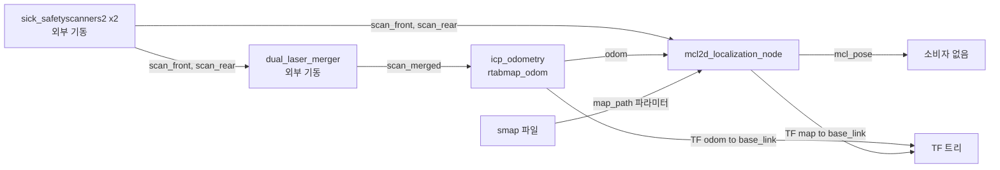

## 2026-08-07 (KST) — mcl2d 위치추정 구동 체인 리뷰 (4패키지)

> 사용자 지시(2026-08-07 08:31): "먼저 해당관련 패키지 coded review 부터 합시다."
> bringup launch 를 만들기 전에, 실제로 함께 돌아가는 경로 전체를 점검한다.

### 코드 버전

- 리뷰 커밋: `8462c75` (branch `main`)
- 대상 4패키지 (합계 1,165줄 / 9파일, test 제외)
  | 패키지 | 규모 | 직전 리뷰 |
  | --- | --- | --- |
  | `src/Navigation/icp_odometry_bringup` | 81줄 / 1파일 | 없음 |
  | `src/Navigation/mcl2d_ros2` | 226줄 / 2파일 | 2026-07-31 부분(모션모델 소비자 관점) |
  | `src/Navigation/mcl2d_map` | 389줄 / 2파일 | 없음 |
  | `Tools/mcl2d_standalone` | 469줄 / 4파일 | 2026-07-31 부분(파사드) |
- 직전 리뷰: 2026-07-31 `docs/code_review/mcl2d-motion-model/2026-07-31.md` @ `cc5e049`
  — 대상이 **모션모델 재작성분과 그 소비자**였다. 본 리뷰는 **구동 체인 전체**로 범위가 다르므로
  Core 5항목을 새로 작성하고, 겹치는 findings 만 상태(`[잔존]`)로 이어받는다.
- `mcl2d_core`(1,368줄)는 본 리뷰 범위 밖 — 2026-07-31 리뷰를 cross-ref 한다.

### 분석 분기 명시

- 분기: **전체 구조 분석** (4패키지 횡단)
- 감지된 도메인: **ros2-review** (`package.xml`·`rclcpp`·`.launch.py` 트리거).
  concurrency 는 **미적용** — `std::thread`·`std::mutex`·`callback_group`·`MultiThreadedExecutor`
  전수 grep 0건(4패키지 대상). embedded-review 미해당.
- ⚠ 도메인 파일(`domains/ros2-review.md`)과 `checks/drawio_validate.py` 는 이 장비에 설치돼 있으나
  **git 미추적**이다(`git cat-file -e origin/main:… ` 실패, `review-claim-lint.py` 만 추적됨).
  다른 장비에서는 같은 검증이 재현되지 않는다 → 평가 #I3.

---

## Core 인벤토리

### 1. 목적

이 4패키지는 **휠 오도메트리 없이 2D 라이다만으로 로봇의 맵 내 자세를 추정하는 한 줄기**다.
모터 제어가 미완성이라 엔코더 오도가 없고(`docs/adr/2026-07-28-icp-odometry-bringup.md`),
그 자리를 스캔 정합 오도메트리가 대신한다.

`icp_odometry_bringup` 은 벤더 노드 `rtabmap_odom/icp_odometry` 를 Big-AMR 구성으로 감싸는
**설정 전용 패키지**다(코드 없음, launch+YAML). 병합 스캔 `/scan_merged` 를 받아 `/odom` 과
TF `odom→base_link` 를 만든다.

`mcl2d_ros2` 는 프레임워크-독립 코어(`mcl2d_core`)를 rclcpp 로 감싼 **ROS2 어댑터**다
(`mcl2d_localization_node.cpp:1-4`). `/odom` 콜백마다 파티클필터를 한 주기 돌려 `/mcl_pose` 와
TF 를 낸다. `mcl2d_map` 은 Seer `.smap`(JSON) 을 **의존성 0 의 자체 파서**로 읽어 장애물 점군과
반사판 좌표를 뽑는다(`smap.hpp:1-4`). `Tools/mcl2d_standalone` 은 코어를 ROS 없이 쓰는
**파사드**이고, ROS2 노드가 이 파사드 소스를 함께 컴파일한다(`mcl2d_ros2/CMakeLists.txt` 의
`NONROS` 경로) — src↔Tools 교차 참조 1건.

### 2. 코드 플로우차트 (전체 구조)



동반 파일: `2026-08-07-flow.drawio` (박스 7 / 화살표 8, mermaid 와 1:1).

**다중 진입점 분리 룰 적용** — `Tools/mcl2d_standalone` 에는 위 체인과 별개인 오프라인 진입점 2개가
있다: `main.cpp:57`(합성 방 시뮬레이션 데모)와 `real_map_demo.cpp:72`(실맵 + 광선투사 데모).
둘 다 ROS 를 타지 않고 파사드를 직접 호출하며(`Mcl2dLocalizer` → `mcl2d_core`), 위 흐름도의
`mcl2d_localization_node` 자리를 대신한다. 공통 호출 그래프는
`Mcl2dLocalizer::{loadMap→setLasers→setInitialPose→update*}` 로 세 진입점이 동일하다.

### 3. 함수 리스트

| # | 함수 | 입력 | 출력 | 기능 | 위치(file:line) |
| --- | --- | --- | --- | --- | --- |
| 1 | `generate_launch_description` | 없음 | `LaunchDescription` | icp_odometry Node + 인자 5개 선언 | icp_odometry_bringup/launch/icp_odometry.launch.py:25 |
| 2 | `Mcl2dLocalizationNode.Mcl2dLocalizationNode` | 없음 | — | 파라미터 선언·맵 적재·라이다 장착·pub/sub 생성 | mcl2d_ros2/src/mcl2d_localization_node.cpp:22 |
| 3 | `Mcl2dLocalizationNode.isStopped` | `o`,`cur`,`dt` | bool | pose 증분 1차·twist 폴백 정지 판정 | mcl2d_ros2/src/mcl2d_localization_node.cpp:92 |
| 4 | `Mcl2dLocalizationNode.onOdom` | `o` | void | 한 주기 갱신 → `/mcl_pose`+TF 발행 | mcl2d_ros2/src/mcl2d_localization_node.cpp:108 |
| 5 | `main` (노드) | argc/argv | int | init → spin → shutdown | mcl2d_ros2/src/mcl2d_localization_node.cpp:162 |
| 6 | `yawFromQuat` | `z`,`w` | double | 쿼터니언 2성분 → yaw | mcl2d_ros2/include/mcl2d_ros2/conversions.hpp:18 |
| 7 | `fromRosScan` | `LaserScan` msg | `mcl2d::LaserScan` | 스캔 무손실 복사 | mcl2d_ros2/include/mcl2d_ros2/conversions.hpp:24 |
| 8 | `fromRosOdom` | `Odometry` msg | `Pose2D` | 자세 추출 | mcl2d_ros2/include/mcl2d_ros2/conversions.hpp:36 |
| 9 | `toRosPose` | `Pose2D` | `PoseWithCovarianceStamped` | 자세 → ROS 메시지 | mcl2d_ros2/include/mcl2d_ros2/conversions.hpp:46 |
| 10 | `JValue.find` | `key` | `const JValue*` | 객체 키 선형 탐색 | mcl2d_map/src/smap.cpp:30 |
| 11 | `JValue.numOr` | `d` | double | 수치 아니면 기본값 | mcl2d_map/src/smap.cpp:37 |
| 12 | `Parser.parse` | `out` | bool | 최상위 값 파싱 | mcl2d_map/src/smap.cpp:49 |
| 12a | `Parser.skip` | 없음 | void | 공백 건너뛰기 | mcl2d_map/src/smap.cpp:59 |
| 12b | `Parser.value` | `v` | bool | 타입 분기 | mcl2d_map/src/smap.cpp:70 |
| 12c | `Parser.object` | `v` | bool | `{}` 파싱 | mcl2d_map/src/smap.cpp:94 |
| 12d | `Parser.array` | `v` | bool | `[]` 파싱 | mcl2d_map/src/smap.cpp:136 |
| 12e | `Parser.string` | `out` | bool | 문자열·이스케이프 | mcl2d_map/src/smap.cpp:168 |
| 12f | `Parser.number` | `v` | bool | 수치 파싱(strtod) | mcl2d_map/src/smap.cpp:224 |
| 12g | `Parser.boolean` | `v` | bool | true/false | mcl2d_map/src/smap.cpp:241 |
| 12h | `Parser.lit` | `l` | bool | 리터럴 일치 | mcl2d_map/src/smap.cpp:252 |
| 13 | `readXY` | `o` | `pair<double,double>` | `{x,y}` 추출(생략=0) | mcl2d_map/src/smap.cpp:265 |
| 14 | `loadSmap` | `path` | `SmapMap` | 파일 → 헤더·점군·반사판·명명점 | mcl2d_map/src/smap.cpp:277 |
| 15 | `Mcl2dLocalizer.Mcl2dLocalizer` | `params`,`seed` | — | 파사드 생성 | mcl2d_standalone/src/mcl2d_localizer.cpp:10 |
| 16 | `Mcl2dLocalizer.loadMap` | 장애물·반사판 | bool | 관측 우도장 구축, `pf_` 무효화 | mcl2d_standalone/src/mcl2d_localizer.cpp:15 |
| 17 | `Mcl2dLocalizer.setInitialPose` | `mean` | void | 파티클필터 생성·초기 산포 | mcl2d_standalone/src/mcl2d_localizer.cpp:23 |
| 18 | `Mcl2dLocalizer.update` | 오도 2개·스캔·`stopped`·`dt` | `Pose2D` | 한 주기(원본 순서 조립) | mcl2d_standalone/src/mcl2d_localizer.cpp:33 |
| 19 | `Mcl2dLocalizer.relocalize` | 중심·반경·각범위·스캔 | bool | 전역 재측위 | mcl2d_standalone/src/mcl2d_localizer.cpp:90 |
| 20 | `Mcl2dLocalizer.confidence` | 없음 | double | 파티클 평균 가중치 | mcl2d_standalone/src/mcl2d_localizer.cpp:106 |
| 21 | `Mcl2dLocalizer.setLasers` | `mounts` | void | 장착 자세 설정(inline) | mcl2d_standalone/include/mcl2d_localizer.hpp:39 |
| 22 | `Mcl2dLocalizer.reportState` | 없음 | `LocReportState` | 보고 상태(inline) | mcl2d_standalone/include/mcl2d_localizer.hpp:58 |
| 23 | `Mcl2dLocalizer.lastExtraMove` | 없음 | `const ExtraMoveParams&` | 마지막 산포 파라미터(inline) | mcl2d_standalone/include/mcl2d_localizer.hpp:63 |
| 24 | `Mcl2dLocalizer.lastModeLikelihood` | 없음 | double | 모드 판정 우도(inline) | mcl2d_standalone/include/mcl2d_localizer.hpp:69 |
| 25 | `Mcl2dLocalizer.ready` | 없음 | bool | `pf_` 존재 여부(inline) | mcl2d_standalone/include/mcl2d_localizer.hpp:73 |
| 26 | `makeRoom` | `W`,`H`,`step` | 점군 | 합성 방 생성(데모, static) | mcl2d_standalone/main.cpp:12 |
| 27 | `simScan` | 진자세·마운트·`W`,`H` | `LaserScan` | 합성 스캔(데모, static) | mcl2d_standalone/main.cpp:29 |
| 28 | `main` (합성 데모) | 없음 | int | 시뮬레이션 수렴 검증 | mcl2d_standalone/main.cpp:57 |
| 29 | `castScan` | 진자세·마운트·격자 | `LaserScan` | 실맵 광선투사(데모, static) | mcl2d_standalone/real_map_demo.cpp:44 |
| 30 | `main` (실맵 데모) | argc/argv | int | 실맵 기반 수렴 검증 | mcl2d_standalone/real_map_demo.cpp:72 |

**중복/유사 함수**: `simScan`(#27)과 `castScan`(#29)은 둘 다 "자세+마운트 → 합성 LaserScan" 이며
차이는 장애물 소스(해석적 방 vs 점유격자)뿐이다 → 평가 #M8.

### 4. 전역 변수 / 모듈 상수

**진정한 가변 전역 없음**(4패키지 전수). 노드 상태는 전부 클래스 멤버이고
(`mcl2d_localization_node.cpp:151-159`), 파서 상태는 `Parser` 인스턴스 멤버다(`smap.cpp:56-57`).

| # | 사용처(함수) | 기능 | 위치(file:line) |
| --- | --- | --- | --- |
| G1 | `Mcl2dLocalizationNode.Mcl2dLocalizationNode`(#2) | `kFoilA082Mounts` (상수) — 라이다 장착 기본값 6개 | mcl2d_ros2/src/mcl2d_localization_node.cpp:50 |
| G2 | `generate_launch_description`(#1) | `params_file` (상수) — 패키지 share 의 YAML 절대경로 | icp_odometry_bringup/launch/icp_odometry.launch.py:26 |

두 상수 모두 **지역 상수**이며 전역 노출이 없다. G1 은 파라미터 기본값으로만 쓰이고
`laser_mounts` 로 덮어쓸 수 있으므로 대체 불필요.

### 5. 의존성 3-tier

| Tier | 대상 | 버전/제약 | 부재 시 동작(필수/선택) | 근거(파일:line) |
| --- | --- | --- | --- | --- |
| 빌드 | `ament_cmake` | — | 빌드 불가 | mcl2d_ros2/package.xml, icp_odometry_bringup/package.xml |
| 빌드 | `rclcpp`·`geometry_msgs`·`nav_msgs`·`sensor_msgs`·`tf2_ros` | ROS2 Humble | 노드 빌드 불가 | mcl2d_ros2/package.xml |
| 빌드 | `mcl2d_core`·`mcl2d_map`·`Tools/mcl2d_standalone` 소스 | 저장소 내부(CMake 직접 컴파일) | 빌드 불가. **`package.xml` 미선언** → 평가 #M5 | mcl2d_ros2/CMakeLists.txt |
| 빌드 | C++17 표준 라이브러리만 (`fstream`·`sstream`·`cstdlib`) | C++17 | 파서 빌드 불가 | mcl2d_map/src/smap.cpp:3-5 |
| 런타임 필수 | `rtabmap_odom`(`icp_odometry` 실행파일) | apt 0.23.7 | launch 즉시 실패(실행파일 없음) | icp_odometry_bringup/package.xml `exec_depend` |
| 런타임 필수 | `/scan_merged` 발행자(`dual_laser_merger`) | 외부 기동 | **조용히 무동작** — icp_odometry 가 스캔 대기로 정지, 오류 없음 | icp_odometry.launch.py 주석, package.xml `exec_depend` |
| 런타임 필수 | `/odom` 발행자 | — | **콜백 미호출 → 위치추정 갱신 0**(노드는 살아 있고 로그 없음) | mcl2d_localization_node.cpp:79-80 |
| 런타임 필수 | `/scan_front`·`/scan_rear` 발행자 | 듀얼 라이다 | 스캔 대기 분기로 **매 콜백 조기 반환** | mcl2d_localization_node.cpp:112-118 |
| 런타임 필수 | `.smap` 맵 파일(`map_path`) | Seer 포맷 | **빈 경로면 오류 없이 원점 발행** → 평가 #H2 | mcl2d_localization_node.cpp:24, 31-43 |
| 런타임 필수 | `base_link→scan_merged` static TF | 외부(merger launch) | icp_odometry 가 TF 조회 실패로 프레임 skip | icp_odometry.launch.py 주석 |
| 런타임 선택 | `laser_mounts` 파라미터 | 3의 배수 | fallback = `kFoilA082Mounts`(G1). 3의 배수 아니면 FATAL 종료 | mcl2d_localization_node.cpp:52-58 |
| 런타임 선택 | `init_x`·`init_y`·`init_theta` | — | fallback = 0 (맵 원점 부근 시작 가정) | mcl2d_localization_node.cpp:25-27 |
| 런타임 선택 | `matplotlib`·Noto Sans CJK | 렌더 전용 | 본 4패키지 무관(`Tools/seer_map` 소관) | — |

---

## 도메인 — ros2-review 추가 표

### A-1. Subscriptions

| 토픽 | 메시지 타입 | QoS(depth·reliability) | 콜백 함수 | 위치(file:line) |
| --- | --- | --- | --- | --- |
| `odom` | `nav_msgs/Odometry` | depth 20, **BEST_EFFORT**(명시) | `onOdom`(#4) | mcl2d_localization_node.cpp:77-80 |
| `scan_front` | `sensor_msgs/LaserScan` | depth 10, 기본 RELIABLE | 람다 → `front_` 저장 | mcl2d_localization_node.cpp:81-82 |
| `scan_rear` | `sensor_msgs/LaserScan` | depth 10, 기본 RELIABLE | 람다 → `rear_` 저장 | mcl2d_localization_node.cpp:83-84 |
| `scan`(→`/scan_merged`) | `sensor_msgs/LaserScan` | `qos:2`=BEST_EFFORT, queue 10 | icp_odometry 내부 | icp_odometry.yaml, icp_odometry.launch.py remap |

### A-2. Publications

| 토픽 | 메시지 타입 | QoS | 발행 위치(함수) | 위치(file:line) |
| --- | --- | --- | --- | --- |
| `mcl_pose` | `PoseWithCovarianceStamped` | depth 10 기본 RELIABLE | `onOdom`(#4) | mcl2d_localization_node.cpp:69, 140 |
| `odom` | `nav_msgs/Odometry` | `qos:2`=BEST_EFFORT | icp_odometry 내부 | icp_odometry.yaml |

### A-3. Services / Actions

**없음** — 4패키지 어디에도 서비스·액션 선언이 없다. 재측위(#19)가 파사드에 있으나 서비스로
노출되지 않는다 → 평가 #M4.

### A-4. Parameters

| 이름 | 타입 | default | declare 위치 | 사용 위치 |
| --- | --- | --- | --- | --- |
| `map_path` | string | `""` | node:24 | node:31-43 |
| `init_x`·`init_y`·`init_theta` | double | 0.0 | node:25-27 | node:67 |
| `laser_mounts` | double[] | `kFoilA082Mounts`(G1) | node:52 | node:59-66 |
| `scan_topic` | string | `/scan_merged` | launch:63 | launch remap |
| `odom_topic` | string | `/odom` | launch:66 | launch remap |
| `publish_tf` | bool | `true` | launch:69 | icp param |
| `force_3dof` | string | `true` | launch:73 | `Reg/Force3DoF` |
| `reset_countdown` | string | `0` | launch:77 | `Odom/ResetCountdown` |

```yaml
mcl2d_localization:
  ros__parameters:
    map_path: "/…/map/260709_test.smap"   # Seer .smap 절대경로
    # 초기 자세 (initial pose)
    init_x: 0.0                            # m
    init_y: 0.0                            # m
    init_theta: 0.0                        # rad
    # 라이다 장착 [x,y,yaw] 반복 — Seer 설정에서 읽은 값
    laser_mounts: [0.881676, -0.578664, -0.785398,
                   -0.857,    0.5971,    2.361256]   # m, m, rad
```

### A-5. TF frames

| frame | parent | 발행 노드 | 정적/동적 | 위치 |
| --- | --- | --- | --- | --- |
| `base_link` | `odom` | `icp_odometry` (`publish_tf` 기본 true) | 동적 | icp_odometry.launch.py:69 |
| **`base_link`** | **`map`** | **`mcl2d_localization_node`** | 동적 | mcl2d_localization_node.cpp:139-148 |
| `scan_merged` | `base_link` | 외부 static (merger launch) | 정적 | 본 4패키지 밖 |

**`base_link` 의 부모가 둘이다** → 평가 #H1.

### A-6. QoS 호환 매트릭스 (RxO)

| 토픽 | offered(pub) | requested(sub) | 호환 | 근거 |
| --- | --- | --- | --- | --- |
| `/odom` | icp_odometry BEST_EFFORT | mcl2d BEST_EFFORT | ✅ | `ros2 topic info /odom -v` 실측(2026-08-02), node:77-78 |
| `/scan_front`·`/scan_rear` | sick_safetyscanners2 **기본 RELIABLE** | mcl2d 기본 RELIABLE | ✅ | `SickSafetyscannersRos2.cpp:49` = `create_publisher<LaserScan>("scan", 1)` (QoS 미지정=기본) |
| `/scan_merged` | dual_laser_merger `SensorDataQoS`(BEST_EFFORT) | icp_odometry `qos:2` | ✅ | `dual_laser_merger.cpp:25-26` |
| `/mcl_pose` | mcl2d 기본 RELIABLE | **구독자 없음** | — | 저장소 전수 grep 0건 |

### A-7. 노드 연결 그래프

| 토픽 | 발행 노드 | 구독 노드(들) | 메시지 타입 | QoS 호환(A-6) |
| --- | --- | --- | --- | --- |
| `/scan_front`·`/scan_rear` | `sick_safetyscanners2` ×2 (**외부**) | `dual_laser_merger`(외부), `mcl2d_localization_node` | `LaserScan` | ✅ |
| `/scan_merged` | `dual_laser_merger` (**외부**) | `icp_odometry` | `LaserScan` | ✅ |
| `/odom` | `icp_odometry` | `mcl2d_localization_node` | `Odometry` | ✅ |
| `/mcl_pose` | `mcl2d_localization_node` | **(없음)** | `PoseWithCovarianceStamped` | 고아 발행 |

```text
sick x2 --[scan_front,scan_rear]--> dual_laser_merger --[scan_merged]--> icp_odometry
sick x2 --[scan_front,scan_rear]--> mcl2d_localization_node
icp_odometry --[odom]--> mcl2d_localization_node --[mcl_pose]--> (구독자 없음)
```

- **고아 토픽**: `/mcl_pose` 의 구독자를 `grep -rn "create_subscription.*mcl_pose\|subscribe.*mcl_pose" src Tools`
  로 조회하면 0건이고, `grep -rn "mcl_pose" --include=*.cpp --include=*.hpp --include=*.py --include=*.xml src Tools`
  히트 3건은 전부 발행부·주석·`package.xml` 설명이다(`mcl2d_localization_node.cpp:3,69`,
  `mcl2d_ros2/package.xml:8`) → 평가 #M9.
- **다중 발행자**: 토픽 단위로는 없다. 그러나 **TF `base_link`** 에는 둘이다(A-5) → #H1.
- **외부 경계**: 스캐너·merger 2종이 본 4패키지 밖이며 의존성 tier 2 와 대응한다.

---

## 평가

severity 분포: Critical 0 / High 3 / Medium 9 / Low 1 / Info 3
> ⚠ **재판정 반영 후 수치다.** 리뷰 작성 시점 선언은 `High 2 / Low 2` 였고, 2026-08-07 에
>   #L1(스캔 QoS)을 **Low → High** 로 올렸다. 사유는 해당 항목과 `docs/claude-mistake/2026-08-07-001`
>   — 「현재 조합에서 안 터진다」는 등급 감면 사유가 아니다.
Verdict: REQUEST CHANGES

### High

**함수 #4 `Mcl2dLocalizationNode.onOdom` — [논리][topology][신규] `base_link` 부모가 둘이 되어 TF 트리가 깨진다 (High)**
   재현: 본 체인을 문서대로 함께 띄우면(`icp_odometry.launch.py` 기본 `publish_tf:=true` + 본 노드)
   `icp_odometry` 가 `odom→base_link` 를(icp_odometry.launch.py:69), 본 노드가 `map→base_link` 를
   (mcl2d_localization_node.cpp:139-148) 각각 발행한다. TF 는 한 프레임에 부모 하나만 허용하므로
   두 변환이 경쟁하고, 소비자는 조회 시점에 따라 서로 다른 자세를 얻는다.
   같은 형태의 사고가 참조 스택에 기록돼 있다 — `docs/code_review/trnav-icp-odometry/2026-07-28.md`
   가 인용한 TR_Nav `issues_and_fixes.md`: "휠 odom 과 ICP odom 이 동일한 `odom→base_link` TF 를
   동시 발행 → TF 소비자가 두 값 사이 flip-flop → 위치추정 실패".
   권고: 표준대로 **측위는 `map→odom` 을 발행**한다 — `map→base_link` 추정치에서
   `odom→base_link`(TF 조회)를 빼서 `map→odom` 을 계산해 낸다. 그 전까지는 bringup 에서 둘 중
   하나의 TF 발행을 반드시 꺼야 하며(`publish_tf:=false` 또는 본 노드 TF 억제 파라미터), 지금은
   **끄는 수단이 본 노드에 없다**(TF 발행이 무조건이다).

**함수 #2·#4 `Mcl2dLocalizationNode` — [논리][신규] `map_path` 미지정 시 오류 없이 원점을 계속 발행한다 (High)**
   재현: `map_path` 기본값이 `""`(node:24)이고, 빈 문자열이면 `if (!map_path.empty())` 가 거짓이라
   **적재도 오류 로그도 없이** 통과한다(node:31-43 — ERROR 는 "경로는 있는데 로드 실패"일 때만).
   맵이 없으면 `field_` 가 비어 `setInitialPose` 가 즉시 반환하고(mcl2d_localizer.cpp:25-26)
   `pf_` 가 생성되지 않는다. 이후 `update` 는 `if (!pf_) return Pose2D{};`(mcl2d_localizer.cpp:36-37)
   로 **항상 (0,0,0)** 을 돌려주고, 노드는 그것을 그대로 `/mcl_pose` 와 TF `map→base_link` 로
   발행한다(node:137-148). 소비자 입장에서 "로봇이 맵 원점에 정지해 있다"와 구분되지 않는다.
   권고: `map_path` 를 필수 파라미터로 승격(빈 값이면 FATAL 종료 — `laser_mounts`(node:53-58)와
   같은 방식)하거나, 최소한 `pf_` 미준비 상태에서는 발행을 중단하고 주기적으로 WARN 을 남긴다.

### Medium

**함수 #9 `toRosPose` — [논리][신규] 공분산을 전혀 채우지 않는다 (Medium)**
   재현: conversions.hpp:46-54 는 position 2개와 orientation 2개만 쓴다. `covariance` 36칸은
   기본값 0 으로 남아 "불확실도 0" 으로 읽힌다. 파사드에는 이미 `confidence()`(#20)와
   `lastModeLikelihood()`(#24)가 있고 노드도 후자를 로그에 쓰는데(node:134) 메시지에는 넣지 않는다.
   권고: 최소한 x·y·yaw 대각 3칸을 신뢰도 기반으로 채우고, 미지원 축은 큰 값으로 표기한다.

**함수 #4 `onOdom` — [논리][잔존] 입력 타임스탬프를 전파하지 않는다 (Medium)**
   재현: node:138 `msg.header.stamp = now()`. 오도·스캔의 원 시각 대신 발행 시각을 쓴다.
   TF 소비자가 시간 보간을 하면 실제 관측 시각과 어긋난다. 2026-07-31 리뷰의 도메인 표
   ("타임스탬프: 발행 시 now() 사용(입력 스탬프 미전파)")에 이미 기록됐고 그대로 남아 있다.
   권고: `o.header.stamp` 를 그대로 전파한다.

**함수 #18·#22 `Mcl2dLocalizer.update`/`reportState` — [품질][신규] 진단 상태를 계산만 하고 내보내지 않는다 (Medium)**
   재현: 슬립·저신뢰 판정이 `report_state_` 에 저장되지만(mcl2d_localizer.cpp:79-84) 노드는
   `reportState()`(#22)를 한 번도 호출하지 않는다(node 전수 grep 0건). 위치추정이 신뢰 불가 상태로
   빠져도 외부에 알릴 경로가 없다.
   권고: `/mcl_status` 같은 토픽이나 진단 메시지로 노출한다.

**함수 #19 `Mcl2dLocalizer.relocalize` — [품질][신규] 복구 경로가 연결되지 않았다 (Medium)**
   재현: 전역 재측위가 파사드에 구현돼 있으나(mcl2d_localizer.cpp:90-104) 노드에서 호출하는 곳이
   없다. 위치를 잃으면 스스로 복구할 수단이 없다.
   권고: 서비스로 노출하거나, `LowConfidence` 지속 시 자동 호출한다.

**의존성 tier — [runtime][신규] `package.xml` 이 형제 소스 의존을 선언하지 않는다 (Medium)**
   재현: `mcl2d_ros2/package.xml` 의 depend 는 ROS 메시지·rclcpp·tf2_ros 5개뿐인데, 실제로는
   `mcl2d_core`·`mcl2d_map`·`Tools/mcl2d_standalone` 의 소스를 CMake 가 직접 컴파일한다.
   `rosdep` 으로 환경을 재현할 수 없고, src↔Tools 교차 참조가 메타데이터에 드러나지 않는다.
   권고: 최소한 README·package.xml 주석으로 명시하고, 장기적으로는 코어를 설치 가능한 라이브러리
   패키지로 분리한다.

**함수 #2 — [param][신규] 코어 파라미터가 하나도 노출되지 않는다 (Medium)**
   재현: `Mcl2dParams params_{}`(node:151)가 기본값으로 고정이고 ROS 파라미터 선언이 없다.
   파티클 수(`max_particle_number`)·빔 수(`beams_used`)·정지 임계 등 성능·거동을 좌우하는 값을
   재빌드 없이 바꿀 수 없다. 이 노드는 단일 스레드에서 1코어를 100% 쓰며 처리율 상한이 1코어
   성능이라(`docs/adr/2026-07-28-icp-odometry-bringup.md` 실측) 이 값들이 곧 튜닝 손잡이다.
   권고: 최소한 파티클 수·빔 수·정지 임계를 파라미터로 뺀다.

**함수 #1 — [runtime][신규] 체인을 한 번에 띄우는 bringup launch 가 없다 (Medium)**
   재현: `find src/Navigation -name "*.launch.py"` → `icp_odometry.launch.py`,
   `seer_pose_publisher/launch/seer_pose.launch.py` 둘뿐이다. 맵 적재를 포함한 위치추정 기동은
   `ros2 run … -p map_path:=…` 수동 조합에만 의존한다.
   권고: 라이다·merger·icp·mcl2d 를 인자로 묶는 bringup launch 를 만든다(#H1 의 TF 충돌 회피
   설정을 그 안에서 강제할 수 있다).

**함수 #27·#29 `simScan`/`castScan` — [품질][신규] 같은 일을 하는 함수 2개 (Medium)**
   재현: main.cpp:29 와 real_map_demo.cpp:44 는 둘 다 "자세+마운트 → 합성 `LaserScan`" 이고
   장애물 소스만 다르다(해석적 방 vs 점유격자). 광선투사 규약이 갈리면 두 데모의 결과가 조용히
   달라진다.
   권고: 장애물 질의를 콜백으로 받는 단일 `castScan` 으로 통합한다.

**A-7 — [topology][신규] `/mcl_pose` 는 구독자가 없다 (Medium)**
   재현: 저장소 전수 grep 결과 발행자 1개(본 노드)·구독자 0. 참조 스택의 자세 정본은
   `/robot_pose` 다(`docs/code_review/trnav-icp-odometry/2026-07-28.md`).
   권고: 소비 계약(토픽명·QoS·프레임)을 먼저 정하고 맞춘다. 지금 상태로는 이 체인의 출력이
   아무 곳에도 쓰이지 않는다.

### Low

**함수 #6 `yawFromQuat` — [논리][신규] 2D 가정이 입력 검증 없이 적용된다 (Low)**
   재현: conversions.hpp:18-21 이 쿼터니언의 `z`·`w` 만 쓴다. 발행자가 roll/pitch 를 실은 자세를
   보내면 조용히 틀린 yaw 가 나온다. 현재 `/odom` 발행자(icp_odometry)는 `Reg/Force3DoF=true` 라
   평면 3자유도로 제한되므로 실사용상 문제는 없다.
   권고: 주석에 전제를 남기거나, `x`·`y` 성분이 임계 이상이면 경고한다.

**함수 #3 `isStopped` — [QoS][신규] 스캔 구독이 RELIABLE 고정이다 (High — 2026-08-07 재판정, 최초 Low)**
   재현: node:81-84 가 depth 숫자만 주어 기본 RELIABLE 이다. 현재 발행자
   `sick_safetyscanners2` 는 `create_publisher<LaserScan>("scan", 1)`(SickSafetyscannersRos2.cpp:49)
   으로 QoS 미지정=기본 RELIABLE 이라 **지금은 정합한다**(A-6). 다만 스캔을 BEST_EFFORT 발행자로
   바꾸면(예: merger 출력을 직접 구독) 그 순간 조용히 미연결된다 — `/odom` 에서 실제로 겪은 형태다.
   권고: 센서 스트림이므로 BEST_EFFORT 구독으로 넓혀 둔다(RELIABLE 발행자와도 연결된다).
   ⚠ **등급 재판정 (2026-08-07)**: 이 항목을 "지금은 정합하니 Low" 로 매긴 것은 잘못이다.
   같은 리뷰가 `/odom` 의 **동일한 결함**을 High 로 다뤘는데, 판정 기준이 결함의 성질이 아니라
   *관측 시점에 터졌는지* 였다. 실제로 스캔 소스를 `/scan_merged`(merger 가 BEST_EFFORT 발행)로
   바꾸는 순간 한 건도 수신하지 못하는 상태가 된다. **"현재 조합에서 안 터진다" 는 등급 감면
   사유가 아니다.** 경위: `docs/claude-mistake/2026-08-07-001`. 조치는 아래 §후속 조치 참조.

### Info

**함수 #3 `isStopped` — [스타일] 하나의 임계를 m/s 와 rad/s 양쪽에 쓴다 (Info)**
   재현: node:98 이 `v < motor_stop_threshold && w < motor_stop_threshold` 로 단위가 다른 두 양에
   같은 상수를 적용한다. 다만 이는 원본 Seer 파라미터 `MotorStopThreshold` 를 그대로 옮긴 것으로
   보인다 — `types.hpp:119` 주석이 "m/s·rad/s (MotorStopThreshold)" 로 두 단위를 함께 적고 있다.
   충실 이식 결과이므로 결함으로 보지 않는다. 원본과 다르게 갈 경우에만 분리한다.

**함수 #1 — [runtime] `dual_laser_merger` 를 선언만 하고 띄우지는 않는다 (Info)**
   재현: `icp_odometry_bringup/package.xml` 이 `exec_depend`로 선언하지만 launch 는 구독만 한다
   (파일 상단 주석에 명시). 의도된 분리이나, 미기동 시 증상이 "조용한 대기"라 오해를 부른다.
   권고: launch 기동 시 `/scan_merged` 미수신이 N 초 지속되면 경고를 남긴다.

**리뷰 인프라 — [runtime] 도메인 add-on 과 drawio 검증기가 git 미추적이다 (Info)**
   재현: `git cat-file -e origin/main:docs/claude_guideline/code_review/domains/ros2-review.md` 실패,
   `…/checks/drawio_validate.py` 도 실패. `review-claim-lint.py` 만 추적된다. 이 장비에는 설치돼
   있어 본 리뷰는 정상 수행됐으나, 다른 장비·CI 에서는 같은 검증이 재현되지 않는다.
   권고: 설치본을 추적 대상에 넣을지 사용자 판단이 필요하다(별건).

---

## 후속 TODO

1. **#H1 TF 충돌** — bringup 을 만들기 전에 반드시 결정해야 한다. `map→odom` 발행으로 바꾸거나,
   최소한 본 노드에 TF 발행 on/off 파라미터를 넣는다.
2. **#H2 map_path 필수화** — 조용한 원점 발행을 막는다.
3. **#M7 bringup launch** — #H1·#H2 조치 후 작성한다.
4. **#M1·#M2** 공분산·타임스탬프는 소비자가 생기기 전에 고치는 편이 싸다.

> 본 리뷰는 작성자(claude)가 `APPROVE` 할 수 없다 — 별도 lane 에서 승인 필요.

---

## 후속 조치 (2026-08-07, 같은 날 — 사용자 지시 "문제점 수정 바람")

리뷰 직후 High 2건과 Medium 2건을 고쳤다. 아래는 **조치와 그 검증 근거**이며, severity 분포와
Verdict 는 리뷰 시점 스냅샷이므로 갱신하지 않는다(다음 날짜 리뷰에서 `[해결]` 로 추적).

| 항목 | 조치 | 상태 |
| --- | --- | --- |
| #H1 TF 부모 중복 | `map→base_link` 발행을 폐기하고 **`map→odom` 보정항**만 발행. `publishMapToOdom` 신설 — `odom→base_link` 를 TF 조회해 `map→odom = (map→base) ∘ (odom→base)⁻¹` 를 2D 로 계산. 조회 실패 시 **폴백하지 않고** 5초 throttle WARN 후 미발행(폴백이 곧 부모 중복이므로). `publish_tf`·`map_frame`·`odom_frame`·`base_frame` 파라미터 신설 | 해결 |
| #H2 map_path 조용한 통과 | 빈 경로·적재 실패 모두 **FATAL 로그 + 예외로 기동 중단** | 해결 |
| #M1 공분산 전무 | `confidence()` 기반으로 x·y·yaw 대각 채움. z·roll·pitch 는 `1e6`(미지원 표시) | 해결 |
| #M2 타임스탬프 미전파 | `msg.header.stamp = o.header.stamp` — 입력 관측 시각 전파 | 해결 |
| #M6 코어 파라미터 미노출 | 처리율 손잡이(`init/min/max_particle_number`·`beams_used`)와 현장 게이트(`motor_stop_threshold`·`stop_confidence`·`init_dist_scatter`·`init_angle_scatter`) **8개만** 노출. 기본값은 전부 현행 이식값이라 지정하지 않으면 거동 불변이고, 값이 바뀌면 `declareTuned` 가 "충실도 기준선 이탈" WARN 을 남긴다. 나머지 20여 개는 원본 대조로 고정된 값이라 의도적으로 닫아 뒀다 | 해결(부분 — 의도적 범위 한정) |
| #M7 bringup launch 부재 | `mcl2d_ros2/launch/localization.launch.py`(노드 단독)와 `bringup.launch.py`(라이다·icp·측위 계층 토글) 신설 + `config/mcl2d.yaml`. CMake 에 launch·config 설치 추가 | 해결 |

**검증 (하드웨어 없이, 가짜 `/odom`+스캔 + `static_transform_publisher odom→base_link`)**

- #H2: 인자 없이 기동 → `[FATAL] map_path 는 필수 파라미터다` + `exit 134`.
  없는 경로 → `[FATAL] 맵 적재 실패: /no/such.smap` + `exit 134`.
- #H1: `/tf` 수집 결과 **`map → odom` 170회, `base_link` 를 자식으로 하는 발행 0건**
  (조치 전 같은 하니스에서는 `map → base_link` 185회였다).
- #M1: `/mcl_pose` covariance x=0.938, yaw=0.00518 (조치 전 0).
- #M2: 입력 스탬프 1000 대역이 그대로 나옴(조치 전에는 벽시계 1786062171).
- 실행 인스턴스가 정확히 1개임을 `/proc` cmdline 조회로 확인하고 측정했다.
- #M6: 기본값과 **다른** YAML(`beams_used: 400`, `max_particle_number: 1500`)로 기동해
  `[WARN] beams_used = 400 (이식 기준값 541 에서 변경 — 충실도 기준선 이탈)` 2건을 확인했다.
  기본값이 같으면 적용 여부를 증명할 수 없으므로 일부러 다른 값으로 시험했다.
- #M7: `bringup.launch.py map_path:=… lidar:=false icp:=false` → mcl2d 만 기동(`loaded map` 확인,
  `sick_safety|merger|icp_odometry` 흔적 0건). `map_path` 생략 → `[FATAL] map_path 는 필수`.
  `icp:=true` → `icp_odometry` 와 mcl2d 가 함께 기동(`Odometry: frame_id = base_link` 확인).
  **`lidar:=true` 전체 경로는 미검증** — 라이다 네트워크 설정(sudo)이 필요해 이번에 돌리지 못했다.

> ⚠ #M7 작성 중 **스스로 만든 결함을 시험이 잡았다**: 포함 경로를 `get_package_share_directory()`
> 로 만들면 런치 기술 생성 시점에 즉시 평가되어, `lidar:=false` 로 꺼 놓아도 그 패키지가 없으면
> `PackageNotFoundError` 로 전체가 죽었다. `FindPackageShare` + `PathJoinSubstitution` 으로 바꿔
> 액션 실행 시점 해석으로 만들었다(조건이 거짓이면 아예 해석되지 않는다).

> ⚠ 검증 과정에서 겪은 함정 2건을 남긴다. ① 백그라운드 명령의 `cd` 가 다음 구문에 적용되지 않아
> **공유 트리의 옛 바이너리**를 측정했다 — 절대경로로 실행해야 한다. ② `pgrep -x mcl2d_localization_node`
> 는 커널 `comm` 이 15자(`mcl2d_localizat`)로 잘려 **절대 매치되지 않는다** — 인스턴스 수 확인은
> `/proc/*/cmdline` 로 해야 한다. 두 함정 모두 "0개 실행 중" 이라는 거짓 안심을 만들었다.

**미조치로 남긴 것**: #M3(진단 상태 미발행) · #M4(relocalize 미연결) · #M5(package.xml 의존 선언) ·
#M8(데모 중복) · #M9(`/mcl_pose` 소비자 계약) · #L1 · #L2 · #I1~#I3.
