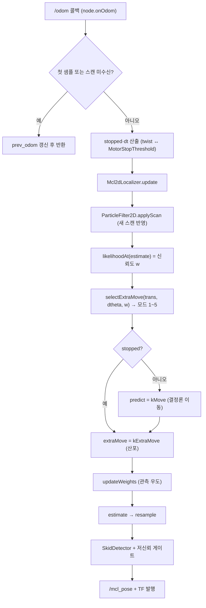

## 2026-07-31 (KST) — mcl2d 모션모델 원본 정합 재작성 리뷰

### 코드 버전

- 리뷰 커밋: `cc5e049` (branch `main`) — **단, 리뷰 대상은 미커밋 작업트리**다. 파일 내용 해시(md5)로 고정:

| 파일 | md5 |
| --- | --- |
| `src/Navigation/mcl2d_core/include/mcl2d_core/motion_model.hpp` | `b4c624b0f0d4f38996b6dc4a7c829136` |
| `src/Navigation/mcl2d_core/src/motion_model.cpp` | `9fa268bd051156fba868a0c4d299d81b` |
| `src/Navigation/mcl2d_core/include/mcl2d_core/types.hpp` | `f8ef4e5bf3301e1309c836896d27caea` |
| `src/Navigation/mcl2d_core/include/mcl2d_core/particle_filter.hpp` | `9652c8e1b631165fa489b89d0b7b793d` |
| `src/Navigation/mcl2d_core/src/particle_filter.cpp` | `8508f8839234bb01c9ed1dbab7202e95` |
| `Tools/mcl2d_standalone/include/mcl2d_localizer.hpp` | `a02b48dd5c673f71a51216b52fdb8dd0` |
| `Tools/mcl2d_standalone/src/mcl2d_localizer.cpp` | `400312bfa8289e633ae5adfec4c8502e` |
| `src/Navigation/mcl2d_ros2/src/mcl2d_localization_node.cpp` | `a8ae1002adca556dad136f493657a955` |
| `src/Navigation/mcl2d_core/test/test_motion_model.cpp` | `1967f9b5fce0ee36d0db1fde6d2cad71` |

- 직전 리뷰: 없음(본 주제 최초)
- 근거 문서: ADR(Architecture Decision Record) `docs/adr/2026-07-31-mcl2d-motion-model-fidelity.md` ·
  대조 `docs/comparison/seer-libmcloc-odom_vs_mcl2d-port_2026-07-31.md` · 1차 산출물 `References/seer/libMCLoc/*.asm`
- 같은 시각 사용자 지시: "리뷰를 돌릴지, <- 진행" (2026-07-31 21:57 KST)

> **리뷰 lane 고지**: 본 리뷰는 **변경 작성자와 같은 세션**에서 작성됐다. SOP 룰 11 에 따라
> 작성자는 `APPROVE` 를 찍을 수 없으며, 아래 Verdict 는 `REQUEST CHANGES` 다.
> §적대적 반대심문 절에 자기 결론을 뒤집는 라운드를 별도로 기록했다(INDEX §메타 패턴 debt-020 대응).

### 분석 분기 명시

- 분기: **전체 구조 분석**(3개 패키지 횡단 — 코어 라이브러리 + 비-ROS 파사드 + ROS2 노드)
- 감지된 도메인: **ros2-review**(`mcl2d_ros2` 노드 `rclcpp`·구독/발행·TF) · concurrency **미해당**(스레드·뮤텍스 0, `grep -rn "thread\|mutex\|async" src/Navigation/mcl2d_core src/Navigation/mcl2d_ros2 Tools/mcl2d_standalone` → 0건) · embedded-review 미해당

---

### Core 인벤토리

#### 1. 목적

`src/Navigation/mcl2d_core` 는 Seer `libMCLoc.so`(rbk 3.4.5.20) 의 2D Monte Carlo Localization 파티클필터
모드를 리버스 엔지니어링(Reverse Engineering)으로 복원한 프레임워크-독립 코어다
(`src/Navigation/mcl2d_core/README.md:3`). 2026-07-31 변경분은 그 코어의 **모션모델**을 원본의 함수 분해·
실행 순서와 동일하게 재작성한 것이다 — 원본은 "결정론적 이동(`kMove`)"과 "산포(`kExtraMove`)"를
서로 다른 액션으로 분리하고, 산포 크기를 매 주기 6개 모드로 재선택한다.

리뷰 대상은 그 재작성분과 소비자 3곳이다: 코어(`motion_model`·`particle_filter`),
비-ROS 파사드(`Tools/mcl2d_standalone`, 원본 `MCLoc` 의 조립 역할), ROS2 노드(`mcl2d_ros2`).

#### 2. 코드 플로우차트 (전체 — 한 주기 데이터 흐름)

drawio 동반: `2026-07-31-flow.drawio` (양쪽 사본).

#### 3. 함수 리스트

| # | 함수 | 입력 | 출력 | 기능 | 위치(file:line) |
| --- | --- | --- | --- | --- | --- |
| 1 | `rangeRandomHalf` | `mt19937&` | double | 원본 `RangeRandom(-1000,1000)/2000` 재현 → `U{-0.5..+0.5}` | mcl2d_core/src/motion_model.cpp:12 |
| 2 | `normalizeAngle` | rad | rad ∈ [−π,π) | 각도 정규화 | mcl2d_core/src/motion_model.cpp:25 |
| 3 | `supplyControlVar` | 오도 2시점 | `ControlIncrement2D` | 증분을 로봇좌표로 분해(trans·direction·dtheta) | mcl2d_core/src/motion_model.cpp:34 |
| 4 | `doParticleMove` | 파티클, 증분 | — | kMove: 결정론 이동(노이즈 0) | mcl2d_core/src/motion_model.cpp:50 |
| 5 | `doExtraMove` | 파티클, 산포크기, rng | — | kExtraMove: x·y 독립 균등 + θ 균등 | mcl2d_core/src/motion_model.cpp:59 |
| 6 | `selectExtraMove` | trans, dtheta, w, params | `ExtraMoveParams` | 6모드 결정 트리 → 산포 크기 | mcl2d_core/src/motion_model.cpp:67 |
| 7 | `ParticleFilter2D.ParticleFilter2D` (단일 라이다) | params, field, mount, seed | — | 생성 | mcl2d_core/src/particle_filter.cpp:13 |
| 8 | `ParticleFilter2D.ParticleFilter2D` (다중) | params, field, mounts, seed | — | 생성(빈 mounts 방어) | mcl2d_core/src/particle_filter.cpp:19 |
| 9 | `ParticleFilter2D.applyScan` | scans | — | ROS 프레임 → 원본 프레임 변환 후 `field_.setScan` | mcl2d_core/src/particle_filter.cpp:30 |
| 10 | `ParticleFilter2D.likelihoodAt` | pose(m) | double | 자세의 관측 우도 | mcl2d_core/src/particle_filter.cpp:56 |
| 11 | `ParticleFilter2D.initialize` | mean | — | 초기 산포 생성 | mcl2d_core/src/particle_filter.cpp:61 |
| 12 | `ParticleFilter2D.initializeInRegion` | center, half_extent, angle_range | — | 영역 균등 살포 | mcl2d_core/src/particle_filter.cpp:79 |
| 13 | `ParticleFilter2D.relocalize` | center, radius, angle_range, scans | bool | 담금질 반복 재위치추정 | mcl2d_core/src/particle_filter.cpp:94 |
| 14 | `ParticleFilter2D.predict` | 오도 2시점 | — | **변경**: 산포 제거, 결정론화 | mcl2d_core/src/particle_filter.cpp:136 |
| 15 | `ParticleFilter2D.extraMove` | `ExtraMoveParams` | — | **신규**: 전 파티클 산포 | mcl2d_core/src/particle_filter.cpp:143 |
| 16 | `ParticleFilter2D.updateWeights` (단일) | scan | bool | 벡터 버전 위임 | mcl2d_core/src/particle_filter.cpp:149 |
| 17 | `ParticleFilter2D.updateWeights` (다중) | scans | bool | 우도 계산·정규화, `mean_weight_` 갱신 | mcl2d_core/src/particle_filter.cpp:154 |
| 18 | `ParticleFilter2D.computeSampleNumber` | — | int | 점유 bin × factor, clamp | mcl2d_core/src/particle_filter.cpp:180 |
| 19 | `ParticleFilter2D.resample` | — | — | systematic 리샘플 | mcl2d_core/src/particle_filter.cpp:196 |
| 20 | `ParticleFilter2D.estimate` | — | `Pose2D` | 가중평균 + 원형평균(`atan2f`) | mcl2d_core/src/particle_filter.cpp:231 |
| 21 | `ParticleFilter2D.step` (단일) | 오도 2시점, scan | `Pose2D` | 벡터 버전 위임 | mcl2d_core/src/particle_filter.cpp:255 |
| 22 | `ParticleFilter2D.step` (다중) | 오도 2시점, scans | `Pose2D` | **변경**: 원본 순서로 한 주기 조립 | mcl2d_core/src/particle_filter.cpp:260 |
| 23 | `ParticleFilter2D.meanWeight` | — | double | 접근자(inline) | mcl2d_core/include/mcl2d_core/particle_filter.hpp:64 |
| 24 | `ParticleFilter2D.particles` | — | `vector<Particle>&` | 접근자(inline) | mcl2d_core/include/mcl2d_core/particle_filter.hpp:68 |
| 25 | `ParticleFilter2D.setParticles` | ps | — | 오라클 대조용 주입(inline) | mcl2d_core/include/mcl2d_core/particle_filter.hpp:73 |
| 26 | `Mcl2dLocalizer.Mcl2dLocalizer` | params, seed | — | 생성 | mcl2d_standalone/src/mcl2d_localizer.cpp:10 |
| 27 | `Mcl2dLocalizer.loadMap` | obstacles, reflectors | bool | 우도장 구축, pf 무효화 | mcl2d_standalone/src/mcl2d_localizer.cpp:15 |
| 28 | `Mcl2dLocalizer.setInitialPose` | mean | — | PF 생성 + 초기 산포 | mcl2d_standalone/src/mcl2d_localizer.cpp:23 |
| 29 | `Mcl2dLocalizer.update` | 오도 2시점, scans, stopped, dt | `Pose2D` | **변경**: 원본 `MCLoc` 순서 조립 + 정지 시 kMove 생략 | mcl2d_standalone/src/mcl2d_localizer.cpp:33 |
| 30 | `Mcl2dLocalizer.relocalize` | center, radius, angle_range, scans | bool | 재위치추정 위임 + 상태 복구 | mcl2d_standalone/src/mcl2d_localizer.cpp:76 |
| 31 | `Mcl2dLocalizer.confidence` | — | double | `meanWeight` 노출 | mcl2d_standalone/src/mcl2d_localizer.cpp:92 |
| 32 | `Mcl2dLocalizer.setLasers` | mounts | — | 접근자(inline) | mcl2d_standalone/include/mcl2d_localizer.hpp:33 |
| 33 | `Mcl2dLocalizer.reportState` | — | `LocReportState` | 접근자(inline) | mcl2d_standalone/include/mcl2d_localizer.hpp:50 |
| 34 | `Mcl2dLocalizer.lastExtraMove` | — | `ExtraMoveParams&` | **신규** 접근자(inline) | mcl2d_standalone/include/mcl2d_localizer.hpp:55 |
| 35 | `Mcl2dLocalizer.ready` | — | bool | 접근자(inline) | mcl2d_standalone/include/mcl2d_localizer.hpp:58 |
| 36 | `Mcl2dLocalizationNode.Mcl2dLocalizationNode` | — | — | 파라미터·맵·라이다 장착·구독/발행 설정 | mcl2d_ros2/src/mcl2d_localization_node.cpp:21 |
| 37 | `Mcl2dLocalizationNode.onOdom` | `nav_msgs::Odometry` | — | **변경**: stopped·dt 산출 후 한 주기 구동, 발행 | mcl2d_ros2/src/mcl2d_localization_node.cpp:57 |
| 38 | `main` | argc, argv | int | 노드 spin | mcl2d_ros2/src/mcl2d_localization_node.cpp:109 |
| 39 | `near` (테스트 로컬) | a, b, eps | bool | 부동소수 비교 | mcl2d_core/test/test_motion_model.cpp:28 |
| 40 | `testSupplyControlVar` | — | — | #3 4케이스 | mcl2d_core/test/test_motion_model.cpp:34 |
| 41 | `testDoParticleMove` | — | — | #4 결정론·재투영·정규화 | mcl2d_core/test/test_motion_model.cpp:66 |
| 42 | `testDoExtraMove` | — | — | #5 반폭·독립성·평균 (20,000 표본) | mcl2d_core/test/test_motion_model.cpp:90 |
| 43 | `testSelectExtraMove` | — | — | #6 5모드 + 경계 2건 | mcl2d_core/test/test_motion_model.cpp:120 |

중복/유사 함수: #21↔#22, #16↔#17 은 오버로드 위임(중복 아님). #3 의 결과를 #29 가 슬립 판정용으로
**다시 계산**하는 중복이 있다 → 평가 M4.

#### 4. 전역 변수 / 모듈 상수

가변 전역 **없음**. 모듈 상수는 `motion_model.cpp` 익명 네임스페이스 4개뿐이다.

| # | 사용처(함수) | 기능 | 위치(file:line) |
| --- | --- | --- | --- |
| 1 | `selectExtraMove`(#6) | `kMode2AngleDeg` (상수) = 2.0 — 원본 모드 2 각도 리터럴(.rodata 0x562980) | mcl2d_core/src/motion_model.cpp:20 |
| 2 | `selectExtraMove`(#6) | `kMode5FallbackDistMm` (상수) = 10.0 — 원본 모드 5 거리 리터럴(.rodata 0x5629d8) | mcl2d_core/src/motion_model.cpp:21 |
| 3 | `selectExtraMove`(#6) | `kDegToRad` (상수) 단위 환산 | mcl2d_core/src/motion_model.cpp:22 |
| 4 | `selectExtraMove`(#6) | `kMmToM` (상수) 단위 환산 | mcl2d_core/src/motion_model.cpp:23 |

난수 상태는 전역이 아니라 인스턴스 멤버(`ParticleFilter2D::rng_`, particle_filter.hpp:83)다 —
동일 시드 재현성이 인스턴스 단위로 보장된다.

#### 5. 의존성 3-tier

| Tier | 대상 | 버전/제약 | 부재 시 동작(필수/선택) | 근거(파일:line) |
| --- | --- | --- | --- | --- |
| 빌드 | C++17 표준 라이브러리(`<random>`,`<cmath>`) | C++17 | 빌드 불가 | mcl2d_core/CMakeLists.txt:5 |
| 빌드 | CMake | ≥ 3.10 | 빌드 불가 | mcl2d_core/CMakeLists.txt:1 |
| 빌드 | `rclcpp`·`nav_msgs`·`sensor_msgs`·`geometry_msgs`·`tf2_ros` | ROS2 Humble | 노드 빌드 불가(코어·파사드는 무관) | mcl2d_ros2/package.xml |
| 빌드 | `mcl2d_core` + `Tools/mcl2d_standalone` 파사드 소스 | 저장소 내부(교차 참조 1건) | 노드 빌드 불가 | src/Navigation/README.md:17-18 |
| 런타임 필수 | `/odom` (`nav_msgs/Odometry`) 발행자 | — | **콜백 미호출 → 위치추정 갱신 0**(노드는 살아 있고 로그 없음) | mcl2d_ros2/src/mcl2d_localization_node.cpp:47 |
| 런타임 필수 | `/scan_front`·`/scan_rear` (`sensor_msgs/LaserScan`) | 듀얼 라이다 | 스캔 대기 분기로 **매 콜백 조기 반환**(추정 미갱신) | mcl2d_ros2/src/mcl2d_localization_node.cpp:49-52 |
| 런타임 필수 | `.smap` 맵 파일(파라미터 `map_path`) | Seer 포맷 | 빈 경로면 맵 미적재 → 우도장 비어 `setInitialPose` 무시 → **추정 불가** | mcl2d_ros2/src/mcl2d_localization_node.cpp:22,28-39 |
| 런타임 선택 | `/odom` 의 `twist` 필드 | — | **fallback 없음** — 0 으로 채워져 오면 항상 정지로 판정(평가 H1) | mcl2d_ros2/src/mcl2d_localization_node.cpp:73-75 |
| 런타임 선택 | `/odom` 헤더 타임스탬프 | — | 0 이면 `dt=0` → 슬립 복구 타이머 미진행(평가 L1) | mcl2d_ros2/src/mcl2d_localization_node.cpp:77 |

### 도메인 — ros2-review 추가 표

| 항목 | 값 | 근거 |
| --- | --- | --- |
| 노드명 | `mcl2d_localization` | node:20 |
| 구독 | `odom`(depth 20) · `scan_front`(10) · `scan_rear`(10) | node:47-52 |
| 발행 | `mcl_pose`(`PoseWithCovarianceStamped`, depth 10) + TF `map→base_link` | node:45,78-84 |
| QoS | **전부 기본(Reliable/Volatile) + depth 숫자만 지정** — 라이다 드라이버가 BestEffort 로 발행하면 매칭 실패 | node:47-52 |
| 파라미터 | `map_path`·`init_x`·`init_y`·`init_theta` (선언만, 동적 반영 없음) | node:22-25 |
| 타임스탬프 | 발행 시 `now()` 사용(입력 스탬프 미전파) | node:74 |
| 실행 모델 | 단일 스레드 `spin`, 콜백 그룹 미지정 → 상호배제 보장 | node:111 |

---

### 평가

severity 분포: Critical 0 / High 2 / Medium 4 / Low 3 / Info 2
Verdict: REQUEST CHANGES

**함수 #37 `Mcl2dLocalizationNode.onOdom` — [논리][신규] twist 미채움 발행자에서 오도 예측이 영구 생략된다 (High)**
   재현: `mcl2d_ros2/src/mcl2d_localization_node.cpp:73-75`. `stopped` 를 `twist.twist` 만으로 판정한다.
   `nav_msgs/Odometry` 의 twist 는 선택적으로 채워지는 필드이고, 채우지 않는 발행자는 0 을 보낸다.
   그 경우 `v=0` · `|ω|=0` 이라 **항상 `stopped=true`** → `Mcl2dLocalizer::update`(#29) 가 `predict`(#14)를
   건너뛰어 **파티클이 오도를 전혀 반영하지 않는다**(산포만 누적). 로그도 없어 조용히 실패한다.
   우리 배치의 `/odom` 은 `icp_odometry`(`src/Navigation/icp_odometry_bringup`)가 공급하는데,
   그 노드가 twist 를 채우는지는 **이번 리뷰에서 확인하지 않았다**(실행 대조 미수행).
   권고: pose 증분 기반으로 바꾼다 — `supplyControlVar`(#3) 결과의 `trans/dt`·`|dtheta|/dt` 를 임계와 비교.
   twist 를 쓰려면 최소한 "twist 가 전부 0이고 pose 는 움직였다" 를 검출해 경고 로그 + pose 기준으로 폴백.

**함수 #6 `selectExtraMove` — [논리][신규] 모드 5(신뢰 높음) 분기가 실질적으로 죽어 있다 (High)**
   재현: 판정 입력 `w` 는 `likelihoodAt`(#10) = `ObservationField::getPostProb` 스케일인데,
   임계 `best_particle_tolerant_threshold = 0.8` 은 원본 `robot.param` 실측값(원본은 `getParticleLikelihood`
   스케일)이다. 두 스케일이 같다는 근거가 없다. 실측: 비-ROS 데모 수렴 시 신뢰도 **0.076**
   (`Tools/mcl2d_standalone/build/mcl2d_non_ros_demo` 출력 "최종 오차 0.007 m, 신뢰도 0.076"),
   `types.hpp:125` 의 `stop_confidence` 주석도 "수렴 시 평균 meanWeight ~0.05" 라 적는다.
   즉 `w ≥ 0.8` 이 성립할 일이 사실상 없어 **모드 5 는 선택되지 않고**, 회전 중에는 항상 모드 1/3
   (큰 산포)로 간다 — 원본 대비 산포가 과대해진다.
   `docs/debt/registry.md` **debt-031** 으로 등록돼 있으나, 등록만으로는 동작 차이가 남는다.
   권고: ① 오라클로 스케일 환산 전까지 모드 5 미발동 사실을 `lastExtraMove()`(#34) 로그/진단에 노출,
   또는 ② 임계를 상대 기준(예: 최근 `meanWeight` 대비 비율)으로 잠정 치환하고 그 근거를 ADR 에 추가.

**함수 #6·#29 — [논리][신규] 모드 판정에 쓰는 이동량 기준 구간이 원본과 다르다 (Medium)**
   재현: 원본은 `MCLoc::DoNormalUpdateAction` 진입 시 정적 기준점(`accumu`)과의 차로 dist·dθ 를 구하고
   그때 기준점을 갱신한다 — 즉 **직전 스캔 갱신 이후 누적**이다(대조 문서 §1.1.2).
   이식본은 `supplyControlVar(prev_odom, cur_odom)`(#3) 의 **1 콜백 증분**을 쓴다
   (`mcl2d_localizer.cpp:42`, `particle_filter.cpp:266`). 노드가 odom 콜백마다 스캔 갱신을 하는
   현재 구성에서는 동치지만, 스캔이 odom 보다 느리거나 `update()` 를 간헐 호출하는 사용처에서는
   dist 가 원본보다 작게 나와 **모드가 4(최소 산포) 쪽으로 치우친다.**
   권고: 파사드에 기준점(`accum_odom_`)을 두고 `update()` 진입 시 누적분으로 판정 후 기준점 갱신.

**함수 #37 — [품질][신규] 정지 임계를 임시 `Mcl2dParams` 로 읽어 파라미터 소유가 이중화됐다 (Medium)**
   재현: `mcl2d_localization_node.cpp:72` 가 콜백마다 `const Mcl2dParams p{};` 를 만들어
   `p.motor_stop_threshold` 를 읽는다. 로컬라이저는 생성자에서 별도의 `Mcl2dParams{}` 를 받았으므로
   (node:27) 현재는 값이 같지만, 어느 한쪽만 파라미터화하면 **조용히 갈라진다.**
   권고: 노드가 로컬라이저에 넘긴 params 를 멤버로 보관해 단일 소유로 쓴다.

**함수 #14·#15·#29 — [테스트][신규] PF 레벨과 파사드 분기에 테스트가 없다 (Medium)**
   재현: 신규 `test_motion_model`(#40~#43)은 자유함수 4개만 덮는다. `ParticleFilter2D::predict`(#14)·
   `extraMove`(#15) 와 파사드의 `stopped` 생략 경로(#29)는 단위 테스트가 없고, `test_mcl2d` 는
   수렴만 본다(오차 < 0.3 m). 정지 신호가 잘못 배선돼도(H1) 회귀가 잡히지 않는다.
   권고: "stopped=true 이면 파티클 평균이 오도 증분만큼 이동하지 않는다" 를 확인하는 테스트 1건 추가.

**함수 #29 — [품질][신규] 같은 증분을 두 번 계산한다 (Medium)**
   재현: `mcl2d_localizer.cpp:42` 에서 `supplyControlVar` 로 `ctrl.trans`·`ctrl.dtheta` 를 구해놓고,
   같은 함수 `:58-59` 에서 슬립 판정용 `trans_odo`·`dth_odo` 를 `hypot`/`normalizeAngle` 로 재계산한다.
   두 값은 정의상 동일하다(`trans` 는 회전 불변량). DRY(Don't Repeat Yourself) 위반이며,
   한쪽만 고치면 슬립 판정과 모드 판정이 갈라진다.
   권고: `ctrl` 을 그대로 `skid_.update` 에 넘긴다.

**함수 #37 — [논리][신규] 첫 콜백에서 `prev_stamp_` 를 설정하지 않아 두 번째 주기의 dt 가 0이다 (Low)**
   재현: `node:60-64` 의 첫 분기는 `prev_odom_` 만 설정하고 반환한다. `prev_stamp_` 는
   스캔 대기 분기(`:69`)에서만 설정되므로, 스캔이 이미 도착한 상태로 두 번째 콜백이 오면 `dt=0`.
   권고: 두 조기 반환 경로에서 동일하게 `prev_stamp_` 갱신.

**함수 #22·#29 — [성능][신규] 한 주기에 `applyScan` 이 두 번 실행된다 (Low)**
   재현: `particle_filter.cpp:266`·`mcl2d_localizer.cpp:41` 에서 명시 호출 후,
   `updateWeights`(#17, `:156`)가 내부에서 다시 `applyScan` 한다. 비용은 빔 수 선형(541×2)이라
   파티클 루프 대비 작지만 불필요하다.
   권고: `updateWeights` 에 "스캔 이미 적용됨" 오버로드를 두거나, 파사드가 `updateWeights` 대신
   가중치 계산만 하는 내부 API 를 쓴다.

**함수 #37 — [논리][신규] 정지 임계의 물리량 대응이 미검증이다 (Low)**
   재현: `MotorStopThreshold = 0.02` 는 원본에서 **모터** 정지 판정 임계로 보이는데(robot.param `MCLoc` 테이블),
   이식본은 이를 차체 선속도(m/s)와 각속도(rad/s) 양쪽에 같은 값으로 적용한다(`node:74-75`).
   각속도 0.02 rad/s ≈ 1.15 °/s 가 적절한지는 근거가 없다.
   권고: 원본에서 이 값이 어느 물리량과 비교되는지 확인하거나, 선/각 임계를 분리해 파라미터화.

**함수 #6 — [품질][신규] 원본 리터럴 2개를 의도적으로 파라미터화하지 않았다 (Info)**
   `kMode2AngleDeg`(2.0°)·`kMode5FallbackDistMm`(10.0mm)는 원본 `.rodata` 리터럴이라 파라미터가 아니다
   (전역표 #1·#2). 파라미터로 승격하면 원본과의 대응이 흐려지므로 **현 상태 유지 권고**.

**함수 #40~#43 — [테스트][신규] 변이 검증 1건 수행 (Info)**
   `selectExtraMove` 의 `trans > threshold` 를 `>=` 로 바꾸면 경계 테스트가 exit=1 로 실패함을 확인했다
   (테스트가 실제로 실패할 수 있음을 증명). 나머지 3개 함수에는 변이 검증 미수행.

---

### 적대적 반대심문 (자기 결론 뒤집기 라운드)

INDEX §메타 패턴 debt-020 대응 — 위 findings 를 반증 시도한 결과다.

| 대상 | 반증 시도 | 결과 |
| --- | --- | --- |
| H1 | "twist 를 안 채우는 발행자가 실제로 우리 배치에 있나?" | **미확정 — 확정 못 함.** `icp_odometry` 의 twist 채움 여부를 이번 리뷰에서 실행 대조하지 않았다. 따라서 H1 은 "확정된 현장 결함"이 아니라 **조건부 위험**이다. 다만 twist 의존 자체가 계약에 없는 가정이므로 지적은 유지하되, 본문에서 "우리 배치에서 깨진다"고 단정하지 않도록 문구를 고쳤다. |
| H2 | "0.8 임계가 실제로 안 걸린다는 근거가 데모 1건뿐 아닌가?" | **부분 반증 → severity 유지.** 근거는 데모 출력 1건 + `types.hpp:125` 주석(과거 측정)이다. 실기 데이터는 없다. 그러나 두 독립 출처가 같은 자릿수(0.05~0.08)를 가리키고, 임계는 그보다 10배 크다. "죽어 있다"는 단정 대신 "실질적으로 선택되지 않는다"로 서술을 조정했다. |
| M1 | "노드가 odom 마다 스캔 갱신하니 실제로는 동치 아닌가?" | **부분 인정.** 현재 노드 구성에서는 동치다. 그래서 Critical/High 가 아니라 Medium 이며, 조건(스캔이 느리거나 간헐 호출)을 명시했다. |
| M4 | "trans 가 정말 같은 값인가?" | **유지.** `trans` 는 로봇좌표 회전 후의 `hypot` 이고 회전은 길이를 보존하므로 `hypot(dx,dy)` 와 동일하다. `dtheta` 도 같은 정규화를 거친다. |
| 누락 점검 | "리뷰가 놓친 영역은?" | **`relocalize`(#13) 경로**는 이번 변경에서 손대지 않았으나 `updateWeights` 를 통해 간접 영향을 받는다(스캔 이중 적용). 영향은 성능뿐이라 L2 에 포함했다. **`test_a1.cpp`·`compare_impls.cpp`** 는 빌드 대상이 아니어서(CMakeLists 미등록) 이번에도 검증되지 않았다 — 기존 상태이며 본 변경의 회귀는 아니다. |

### 후속 조치 (권고 우선순위)

1. H1 — 정지 판정을 pose 증분 기반으로 교체(또는 twist 유효성 폴백). 회귀 테스트 동반(M3).
2. H2 — 모드 5 미발동 사실을 진단으로 노출하고 debt-031 상환 시 임계 환산.
3. M1·M4 — 파사드에 기준점 누적 도입 + 증분 재계산 제거(같은 함수에서 함께 처리 가능).
4. M2·L1·L3 — 노드 정리(파라미터 단일 소유, `prev_stamp_` 일관 갱신, 임계 분리).

---
