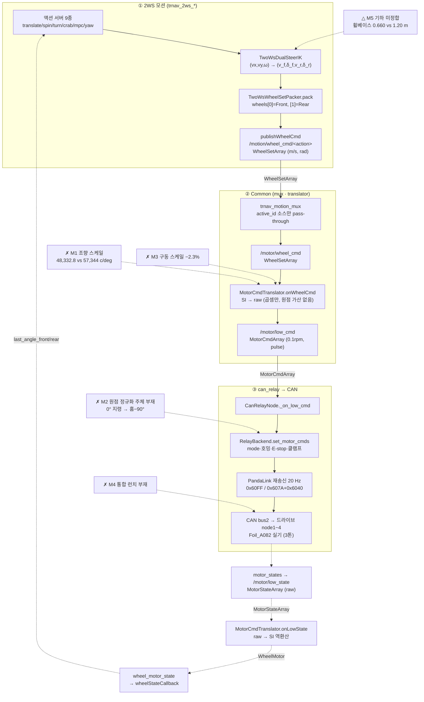

# 2WS ↔ can_relay 연동 접점 — 코드 리뷰 (날짜=버전)

## 2026-08-05 (KST) — 연동 착수 전 접점 인벤토리

> 본 문서는 **연결 작업 착수 전** 코딩 SOP §2(사전조사)가 요구하는 함수표·전역변수표를
> 갖추기 위한 인벤토리다. 대상은 「2WS 모션 스택 ↔ can_relay」를 잇는 **접점 코드 전수**이며,
> 액션 서버 9종의 제어 본문(≈6,900줄)은 이 범위 밖이다(§분석 분기 참조).

### 코드 버전

- 리뷰 커밋: `45d6a7b` (branch `main`)
- **본 리뷰 직전에 세 패키지를 git 추적으로 올렸다** — `d606dcc`(can_relay 46파일) ·
  `e19c884`(2WS 102파일) · `45d6a7b`(Common 65파일). 그전까지 `git ls-files` 가 0건이라
  코드 버전을 커밋으로 고정할 수 없었고, 직전 can_relay 리뷰는 파일 md5 로 고정했다
  (`docs/code_review/can_relay_ros2/2026-08-03.md:5-24`). **본 문서부터 커밋 고정이 가능하다.**
- 직전 리뷰: can_relay 는 [2026-08-03](../can_relay_ros2/2026-08-03.md)(+08-04 delta).
  2WS·Common 은 **본 문서가 최초 리뷰**(그전까지 `docs/code_review/` 에 주제 폴더 0건).

### 분석 분기 명시

- 분기: **전체 구조 분석**(다중 패키지 횡단) — 범위는 「접점 우선」(2026-08-05 사용자 결정)
- 범위 내(전수): `trnav_motion_mux`(270줄) · `amr_motor_cmd_translator`(291줄) ·
  `trnav_2ws_motion`(접점 3파일) · `trnav_2ws_kinematics`(3모델) · `trnav_2ws_core/robot_geometry`
  · can_relay 저수준 경로 5함수
- **범위 밖(명시)**: 액션 서버 9종 제어 본문 6,900줄 · can_relay UI 1,768줄 ·
  `qd_path_controller` · `qd_mpc_controller` · `localization_monitor`.
  → 후속 TODO ①. **이 문서가 그 부분을 점검했다고 읽지 말 것.**
- 감지된 도메인: **ros2-review · concurrency** (embedded-review 는 범위 내 펌웨어 코드 0 → 미적용)
- 기록: 다중 패키지 횡단이라 **루트 정본만**(SOP §기록 위치 「패키지 루트 특정 불가 시 루트만」)

---

## Core 인벤토리

### 1. 목적

2WS 모션 스택(액션 서버 9종)이 만든 **SI 단위 휠 지령**을 CAN 드라이브의 **raw 지령**까지
내려보내고, 그 피드백을 되돌리는 4단 체인이다. 각 단의 책임이 코드에 명시돼 있다:

| 단 | 책임 | 근거 |
| --- | --- | --- |
| 2WS 액션 서버 | 궤적·제어 → 바디속도 → IK → (v_f, δ_f, v_r, δ_r) | `qd_action_server_base.hpp:105-110` |
| `trnav_motion_mux` | 다중 소스 중 **활성 1개만** 하류로 통과 | `trnav_motion_mux_node.cpp:102-108` |
| `amr_motor_cmd_translator` | **SI → raw 환산**(m/s→0.1rpm, rad→pulse) + 역환산 | `amr_motor_cmd_translator_node.cpp:99-218` |
| `can_relay` | 환산·기구학 **없음**. raw 단위 안전 게이트 + CAN 송신 | `driver_node.py:248-255`(docstring) |

즉 **환산의 소유자는 translator 하나**이고 can_relay 는 그것을 신뢰한다. 본 리뷰의 결함 대부분이
이 경계에 몰려 있는 이유다.

### 2. 코드 플로우차트

동반 파일: [`2026-08-05-flow.drawio`](2026-08-05-flow.drawio) (박스 24 · 화살표 20 · dangling 0,
`checks/drawio_validate.py` 통과). 아래 mermaid 와 노드·엣지 1:1.



### 3. 함수 리스트

**범위 내 전수(누락 0).** 표기: `ClassName.method`, 이너/파일로컬은 부모번호+알파벳.

#### 3-1. `trnav_motion_mux` (전수)

| # | 함수 | 입력 | 출력 | 기능 | 위치(file:line) |
| --- | --- | --- | --- | --- | --- |
| 1 | `MotionMuxNode.MotionMuxNode` | — | — | `output_topic`(기본 `/motor/wheel_cmd`) pub 생성, `/select_motion_source` 서비스, `default_source_id` 선언 후 loadSources→validateSources→active_id 적용 | trnav_motion_mux_node.cpp:38-69 |
| 2 | `MotionMuxNode.loadSources` | 파라미터 `source_ids` | — | id 별 `source_N.{name,topic,timeout_ms}` 선언·구독 등록. name/topic 공란이면 V-07 FATAL+shutdown | :71-114 |
| 2a | `loadSources.<lambda>` | `WheelSetArray::SharedPtr` | — | `active_id_ == id` 일 때만 `pub_->publish(*msg)` — 그 외 즉시 폐기 | :103-108 |
| 3 | `MotionMuxNode.validateSources` | `default_source_id` | — | Pass1 V-05 name중복/V-06 topic중복/V-10 패턴(WARN) → Pass2 V-08 default 존재 → Pass3 Reserved id↔name. 위반 시 FATAL+shutdown+throw | :116-193 |
| 4 | `MotionMuxNode.onSelectSource` | `Request{source_id}` | `Response{success,message}` | 등록된 id 면 `active_id_` 교체, 아니면 success=false | :195-214 |
| 5 | `main` | argc, argv | int | `MultiThreadedExecutor` 로 spin | :218-227 |

#### 3-2. `amr_motor_cmd_translator` (전수)

| # | 함수 | 입력 | 출력 | 기능 | 위치(file:line) |
| --- | --- | --- | --- | --- | --- |
| 6 | `MotorCmdTranslator.MotorCmdTranslator` | — | — | 파라미터 18종 선언·읽기(기하·감속비·motor_id·부호·조향영점·wheel_index·legacy 발행 플래그), QoS=RELIABLE·KeepLast(10)·VOLATILE, pub 3 · sub 2 생성 | amr_motor_cmd_translator_node.cpp:14-97 |
| 7 | `MotorCmdTranslator.onWheelCmd` | `WheelSetArray::SharedPtr` | — | `wheels[front/rear]` → `MotorCmdArray` 4원소. walk=VELOCITY(0.1rpm), steer=POSITION(pulse)+profile_vel. `n<2` 또는 index 범위 밖이면 WARN 후 **drop** | :99-154 |
| 8 | `MotorCmdTranslator.onLowState` | `MotorStateArray::SharedPtr` | — | motor_id 별 raw→SI 역환산 → `WheelMotor`·`WheelMotorState` 발행. 어느 모터든 `error_code≠0` 이면 `motor_ready=false` | :156-218 |
| 9 | `main` | argc, argv | int | **단일 스레드** `rclcpp::spin` (콜백 2종 직렬화) | main.cpp:4-10 |

#### 3-3. `trnav_2ws_motion` — 접점(전수)

| # | 함수 | 입력 | 출력 | 기능 | 위치(file:line) |
| --- | --- | --- | --- | --- | --- |
| 10 | `TwoWsActionServerBase.TwoWsActionServerBase` | node, action_mutex, action_name, publish_topic | — | 공통 파라미터·IK·packer 구성, pub 2(WheelSetArray·last_result)·sub 3(wheel_motor_state·motor_status·imu/data)·액션 서버 생성 | qd_action_server_base.hpp:40-95 |
| 11 | `TwoWsActionServerBase.publishWheelCmd` | v_f, δ_f, v_r, δ_r | — | packer 로 재포장 후 stamp 찍어 발행 — **체인의 시작점** | :105-110 |
| 12 | `TwoWsActionServerBase.publishStopCmd` | — | — | 속도 0, **조향각은 마지막 실측값 유지** | :112-115 |
| 13 | `TwoWsActionServerBase.reportResult` | int8 code | — | `"<server>:<code>"` 를 `/motion/last_result` 로(rosbag2 가 action result 를 안 남겨서) | :119-124 |
| 14 | `TwoWsActionServerBase.safeParam<T>` | name, default | T | 중복 declare 회피 헬퍼 | :127-134 |
| 15 | `TwoWsActionServerBase.wheelStateCallback` | `WheelMotor::SharedPtr` | — | `last_angle_front_/rear_` 갱신(virtual — Translate 가 override) | :156-160 |
| 16 | `TwoWsActionServerBase.geometry` | — | `const RobotGeometry&` | packer 의 기하 노출 | :163-166 |
| 17 | `TwoWsActionServerBase.loadGeometry` | node | `RobotGeometry` | 파라미터에서 기하 로드. **미지정 시 Carrier AGV 기본값**(w1_x 0.330 / r 0.080 / gear 20) | :170-197 |
| 17a | `loadGeometry.get_d` | name, default | double | declare-or-get | :172-178 |
| 17b | `loadGeometry.get_s` | name, default | string | declare-or-get | :179-185 |
| 18 | `TwoWsActionServerBase.imuCallback` | `Imu::SharedPtr` | — | quaternion→yaw 저장, `imu_received_` 세움 | :199-206 |
| 19 | `TwoWsActionServerBase.handleGoal` | uuid, goal | GoalResponse | `validateGoal` → `action_mutex_` CAS 로 **전 액션 상호배타** | :208-222 |
| 20 | `TwoWsActionServerBase.handleCancel` | goal_handle | CancelResponse | 항상 ACCEPT | :224-228 |
| 21 | `TwoWsActionServerBase.handleAccepted` | goal_handle | — | `std::thread(...).detach()` 로 execute 분리 | :230-233 |
| 22 | `TwoWsWheelSetPacker.TwoWsWheelSetPacker` | geom | — | 기하 복사 보관 | qd_wheel_set_packer.cpp:6-8 |
| 23 | `TwoWsWheelSetPacker.pack` | v_f, δ_f, v_r, δ_r | `WheelSetArray` | wheels[0]=Front, [1]=Rear 2원소 고정. 비-QD 플랫폼도 **같은 경로로 fall-through** | :10-45 |
| 24 | `TwoWsWheelSetPacker.geometry` | — | `const RobotGeometry&` | 접근자 | qd_wheel_set_packer.hpp:25-28 |

#### 3-4. `trnav_2ws_kinematics` — 접점(전수)

| # | 함수 | 입력 | 출력 | 기능 | 위치(file:line) |
| --- | --- | --- | --- | --- | --- |
| 25 | `TwoWsDualSteerIK.TwoWsDualSteerIK` | wheels, radius, gear_walk | — | 휠 위치·반경·감속비 보관 | qd_inverse_kinematics.cpp:6-9 |
| 26 | `TwoWsDualSteerIK.compute` | `VelocityCommand{vx,vy,ω}` | `IKResult` | 휠별 `v_ix=vx−ωy_i`, `v_iy=vy+ωx_i` → atan2/hypot | :11-31 |
| 27 | `TwoWsDualSteerIK.computeSpin` | ω | `IKResult` | `compute({0,0,ω})` 래퍼 | :33-36 |
| 28 | `TwoWsDualSteerIK.computeWheel` | vx, vy | `WheelOutput` | 단일 휠 조향·속도·방향·RPM | :38-97 |
| 29 | `TwoWsDualSteerIK.normalizeAngle` | angle, dir& | double | \|θ\|>π/2 이면 π 감산 + 방향 반전 → **±90° 정규화** | :99-110 |
| 30 | `TwoWsCrabIK.TwoWsCrabIK` | num_wheels, radius, gear_walk | — | 크랩 IK 구성 | qd_crab_inverse_kinematics.cpp:8-11 |
| 31 | `TwoWsCrabIK.setInitial` | base_steer, walk_dir | — | 초기 조향·방향 고정(크랩 기준자세) | :13-34 |
| 32 | `TwoWsCrabIK.isInitialized` | — | bool | 초기화 여부 | qd_crab_inverse_kinematics.hpp:42 |
| 33 | `wrapSteer` (파일 로컬) | steer, dir& | double | **±115° 에서만** wrap(±90°+`WRAP_MARGIN` 25°) | qd_crab_inverse_kinematics.cpp:36-50 |
| 34 | `TwoWsCrabIK.compute` | vx_path, θ_body, δ_cte, … | `IKResult` | 크랩 주행 휠 지령 | :52- |
| 35 | `TwoWsBicycleModel.TwoWsBicycleModel` | wheels | — | 휠 좌표로 wheelbase 산출 | qd_bicycle_model.cpp:9-21 |
| 36 | `TwoWsBicycleModel.TwoWsBicycleModel` | wheelbase_m | — | 휠베이스 직접 지정 오버로드 | :22-28 |
| 37 | `TwoWsBicycleModel.wheelbase` | — | double | 접근자 | qd_bicycle_model.hpp:74-77 |
| 38 | `TwoWsBicycleModel.toVelocityCommand` | `BicycleCommand{v,δ}` | `VelocityCommand` | 단일 자전거 → 바디속도 | qd_bicycle_model.cpp:30-52 |
| 39 | `TwoWsBicycleModel.toIKResult` | `BicycleCommand`, ik | `IKResult` | 38 + IK 합성 | :53-57 |
| 40 | `TwoWsBicycleModel.toVelocityCommand` | `DualBicycleCommand{vx,δ_f,δ_r}` | `VelocityCommand` | **이중 조향** → 바디속도 | :58-75 |
| 41 | `TwoWsBicycleModel.toIKResult` | `DualBicycleCommand`, ik | `IKResult` | 40 + IK 합성 | :76-80 |
| 42 | `TwoWsBicycleModel.fromVelocityCommand` | `VelocityCommand` | `BicycleState` | 역변환(곡률·회전반경) | :81-110 |
| 43 | `TwoWsBicycleModel.fromIKResult` | `IKResult` | `BicycleState` | 휠 출력에서 역산 | :111-149 |
| 44 | `TwoWsBicycleModel.curvature` | `BicycleCommand` | double | 1/m | :150-155 |
| 45 | `TwoWsBicycleModel.turningRadius` | `BicycleCommand` | double | m (직진 시 inf) | :156-166 |
| 46 | `TwoWsBicycleModel.omega` | `BicycleCommand` | double | rad/s | :167- |
| 47 | `parsePlatform` | string | `Platform` | 문자열→enum. **미상 문자열은 조용히 QD_DIAGONAL 로 fallback** | robot_geometry.hpp:35-47 |

#### 3-5. `can_relay` — 저수준 경로(접점만, 전체 표는 직전 리뷰 cross-ref)

| # | 함수 | 입력 | 출력 | 기능 | 위치(file:line) |
| --- | --- | --- | --- | --- | --- |
| 48 | `RelayBackend.set_motor_cmds` | `[(motor_id,mode,tvel,tpos,pvel)]` | `list[str]` 사유 | mode 검사(구동=VELOCITY·조향=POSITION 강제) · 호밍 미완료 거부 · E-stop 거부 · **조향 `[home±90°]` / 구동 `±4889` 클램프**. `profile_vel` 미반영(debt-038) | backend.py:320-413 |
| 49 | `RelayBackend.motor_states` | — | `list[dict]` | 노드별 raw 피드백. `home_comp` 는 드라이브 0x6041 bit15 그대로 | :415-438 |
| 50 | `CanRelayNode._on_low_cmd` | `MotorCmdArray` | — | 필드 추출 후 48 위임. 환산·기구학 없음. 축별 조향각 상이는 **정상**(선회) | driver_node.py:247-264 |
| 51 | `CanRelayNode._on_low_state_timer` | — | — | 49 결과를 `MotorStateArray` 로 `low_state_hz` 주기 발행 | :266-276 |
| 52 | `CanRelayNode._load_msgs` | — | 타입 3 또는 None | `trnav_msgs` import 실패 시 **저수준 경로를 아예 열지 않는다**(조용한 대체 금지) | :229-244 |

### 4. 전역 변수 / 모듈 상수

**가변 전역 상태: 없음** (범위 내 전 파일). 아래는 모듈 상수·파일 스코프뿐이다.

| # | 사용처(함수) | 기능 | 위치(file:line) |
| --- | --- | --- | --- |
| G1 | #3 | `kReservedRules` (상수) — Reserved id↔name 12쌍 + rule_id. SSOT mirror(`docs/abstraction/motion_source_id_contract.md`) | trnav_motion_mux_node.cpp:21-34 |
| G2 | #33 | `WRAP_MARGIN = 25° ` (상수, `constexpr`) — 크랩 wrap 임계를 ±90°가 아닌 **±115°** 로 만드는 값 | qd_crab_inverse_kinematics.cpp:35 |
| G3 | #17 | `loadGeometry` 하드코딩 default 7개 (상수 리터럴) — `w1_x 0.330 / w1_y 0.135 / w2_x −0.330 / w2_y −0.135 / wheel_radius 0.080 / gear_walk 20.0 / platform "QD_DIAGONAL"`. **Carrier AGV 값** | qd_action_server_base.hpp:188-195 |

**필요성 평가**: G1·G2 는 상수로 적절(단 G2 는 값 자체가 결함 — H5 참조). G3 은 기본값이
**다른 기체 값**이라 파라미터 미지정 시 조용히 틀린 기하로 동작한다 → `[품질]` 지적(H3).

### 5. 의존성 3-tier

| Tier | 대상 | 버전/제약 | 부재 시 동작 | 근거(파일:line) |
| --- | --- | --- | --- | --- |
| 빌드 | `rclcpp` · `trnav_msgs` · `std_msgs` · `nav_msgs` · `sensor_msgs` · `tf2` | ament_cmake | 빌드 실패 | 각 `package.xml` |
| 빌드 | `rclpy` · `trnav_msgs` (can_relay) | ament_python | 빌드 실패 | can_relay/package.xml |
| 빌드 | `NLopt` (MPC 경로) | — | 빌드 실패 | QD 이식 시 확인된 함정(메모리 `biguamr-qd-motion-port`) |
| 런타임 필수 | `trnav_motion_mux` 노드 | — | 액션 서버가 발행해도 **`/motor/wheel_cmd` 에 아무것도 오지 않음** → 로봇 무동작 | mux :50,102-108 |
| 런타임 필수 | `amr_motor_cmd_translator` 노드 | — | `/motor/low_cmd` 미발행 → can_relay 무지령 | translator :76,88 |
| 런타임 필수 | `can_relay` 노드 + panda + CAN bus2 | — | CAN 송신 없음 | can_relay.yaml:5-7 |
| 런타임 필수 | `trnav_msgs` (can_relay 런타임 import) | — | **저수준 경로 미개설** — 벤치 지령(`~/steer_deg` 등)만 동작 | driver_node.py:229-244 |
| 런타임 필수 | `can_relay ~/engage` 서비스 호출 | — | 제어권 미획득 상태로 대기, **모든 지령 무효** | driver_node.py:225-226 |
| 런타임 필수 | `/select_motion_source` 서버(=mux) | 기본 active=0(joystick) | 액션 서버가 execute 진입부에 **스스로 호출**하므로 사람 개입은 불요. 서버가 없으면 소스 전환 실패 | 액션서버 :64-66,108 · mux:53-56 |
| 런타임 필수 | IMU `imu/data` | SensorDataQoS | yaw 미갱신 → yaw 기반 액션(spin/yaw_control/crab) 동작 불가 | base.hpp:82-84 |
| 런타임 선택 | `wheel_motor_state_detailed` | `publish_legacy_*` 파라미터 | false 면 미발행(2WS 는 미사용) | translator :82-85 |
| 런타임 선택 | `/motion/last_result` 구독자 | — | 없으면 발행만 되고 소비 없음(무해) | base.hpp:72-73 |

---

## 도메인 — ros2-review

### A-1. Subscriptions (범위 내)

| 토픽 | 메시지 타입 | QoS(depth·rel·dur) | 콜백 함수 | 위치(file:line) |
| --- | --- | --- | --- | --- |
| `/motion/wheel_cmd/<name>` ×11 | `trnav_msgs/WheelSetArray` | 10 · RELIABLE · VOLATILE | #2a lambda | mux:102-108 |
| `/motor/wheel_cmd` | `trnav_msgs/WheelSetArray` | 10 · RELIABLE · VOLATILE | #7 `onWheelCmd` | translator:88-89 |
| `/motor/low_state` | `trnav_msgs/MotorStateArray` | 10 · RELIABLE · VOLATILE | #8 `onLowState` | translator:91-92 |
| `/motor/low_cmd` | `trnav_msgs/MotorCmdArray` | 10 · RELIABLE · VOLATILE | #50 `_on_low_cmd` | driver_node.py:177-178 |
| `wheel_motor_state` | `trnav_msgs/WheelMotor` | 10 · RELIABLE · VOLATILE | #15 `wheelStateCallback` | base.hpp:75-77 |
| `motor_status` | `trnav_msgs/MotorStatus` | 10 · RELIABLE · VOLATILE | 빈 람다 | base.hpp:79-80 |
| `imu/data` | `sensor_msgs/Imu` | SensorDataQoS(5·BEST_EFFORT) | #18 `imuCallback` | base.hpp:82-84 |
| `estop` | `std_msgs/Bool` | LATCHED(TRANSIENT_LOCAL) | `_on_estop` | driver_node.py:195-197 |

### A-2. Publications (범위 내)

| 토픽 | 메시지 타입 | QoS | 발행 위치(함수) | 위치(file:line) |
| --- | --- | --- | --- | --- |
| `/motion/wheel_cmd/<action>` | `WheelSetArray` | 10 · RELIABLE · VOLATILE | #11 `publishWheelCmd` | base.hpp:66-67 |
| `/motion/last_result` | `std_msgs/String` | 10 · RELIABLE | #13 `reportResult` | base.hpp:72-73 |
| `/motor/wheel_cmd` | `WheelSetArray` | 10 · RELIABLE · VOLATILE | #2a lambda | mux:50,106 |
| `/motor/low_cmd` | `MotorCmdArray` | 10 · RELIABLE · VOLATILE | #7 `onWheelCmd` | translator:76,153 |
| `wheel_motor_state` | `WheelMotor` | 10 · RELIABLE · VOLATILE | #8 `onLowState` | translator:80,212 |
| `wheel_motor_state_detailed` | `WheelMotorState` | 10 · RELIABLE · VOLATILE | #8 `onLowState` | translator:84,216 |
| `/motor/low_state` | `MotorStateArray` | 10 · RELIABLE · VOLATILE | #51 timer | driver_node.py:179-181 |

### A-3. Services / Actions

| 이름 | 타입 | 클라/서버 | 콜백 | 위치(file:line) |
| --- | --- | --- | --- | --- |
| `/select_motion_source` | `trnav_msgs/SelectMotionSource` | 서버 | #4 | mux:53-56 |
| `amr_motion_<action>_abstract` ×9 | `trnav_2ws_interfaces` 액션 | 서버 | #19~#21 | base.hpp:85-93 |
| `~/engage` | `std_srvs/SetBool` | 서버 | `_srv_engage` | driver_node.py:211-212 |
| `~/stop` · `~/home` · `~/home_cancel` | `std_srvs/Trigger` | 서버 | 각 콜백 | driver_node.py:213-219 |

### A-4. Parameters — 접점 계약에 직접 들어가는 것만

| 이름 | 타입 | default | declare 위치 | 사용 위치 |
| --- | --- | --- | --- | --- |
| `output_topic` | string | `/motor/wheel_cmd` | mux:41 | #1 |
| `default_source_id` | int | 0 (joystick) | mux:59 | #1·#3 |
| `wheel_radius_m` | double | 0.08 | translator:17 | #7·#8 |
| `gear_walk` | double | 20.0 | translator:18 | #7·#8 |
| `gear_steer` | double | 265.5 | translator:19 | #7·#8 |
| `pulses_per_rev` | double | 65536.0 | translator:20 | #7·#8 |
| `direction_steer_front/rear` | int | −1 | translator:29-30 | #7·#8 |
| `steer_offset_front/rear_deg` | double | 0.0 (YAML −1.676) | translator:33-34 | #7·#8 |
| `steer_counts_per_deg` | double | (코드 기본 없음) 57344.0 | foil_a082.yaml:20 | #48 |
| `steer_home_counts` | int[] | **코드 기본 없음** | foil_a082.yaml:136 | #48 (클램프 경계에만) |
| `steer_limit_deg` | double | 90.0 | can_relay.yaml:18 | #48 |
| `w1_x`/`w2_x`/`wheel_radius`/`gear_walk` | double | 0.330/−0.330/0.080/20.0 | base.hpp:189-194 | #17→#26 |

### A-6. QoS 호환 매트릭스 (RxO)

| 토픽 | offered(pub) | requested(sub) | 호환 |
| --- | --- | --- | --- |
| `/motion/wheel_cmd/<name>` | RELIABLE·VOLATILE·10 | RELIABLE·VOLATILE·10 | ✅ |
| `/motor/wheel_cmd` | RELIABLE·VOLATILE·10 | RELIABLE·VOLATILE·10 | ✅ |
| `/motor/low_cmd` | RELIABLE·VOLATILE·10 | RELIABLE·VOLATILE·10 | ✅ |
| `/motor/low_state` | RELIABLE·VOLATILE·10 | RELIABLE·VOLATILE·10 | ✅ |
| `wheel_motor_state` | RELIABLE·VOLATILE·10 | RELIABLE·VOLATILE·10 | ✅ |
| `motor_status` | **발행자 없음** | RELIABLE·VOLATILE·10 | ⚠ 고아 |
| `estop` | **발행자 없음(범위 내)** | TRANSIENT_LOCAL | ⚠ 고아 |

**QoS 불일치 0건** — 체인 전 구간이 RELIABLE·VOLATILE·KeepLast(10) 로 통일돼 있다.

### A-7. 노드 연결 그래프

| 토픽 | 발행 노드 | 구독 노드 | 메시지 타입 | QoS 호환 |
| --- | --- | --- | --- | --- |
| `/motion/wheel_cmd/<action>` | 2WS 액션 서버 9종 | `trnav_motion_mux` | WheelSetArray | ✅ |
| `/motion/wheel_cmd/joystick` | **없음** | `trnav_motion_mux`(기본 활성) | WheelSetArray | ⚠ 고아 |
| `/motor/wheel_cmd` | `trnav_motion_mux` | `amr_motor_cmd_translator` | WheelSetArray | ✅ |
| `/motor/low_cmd` | `amr_motor_cmd_translator` | `can_relay` | MotorCmdArray | ✅ |
| `/motor/low_state` | `can_relay` | `amr_motor_cmd_translator` | MotorStateArray | ✅ |
| `wheel_motor_state` | `amr_motor_cmd_translator` | 2WS 액션 서버 9종 | WheelMotor | ✅ |
| `motor_status` | **없음** | 2WS 액션 서버 9종 | MotorStatus | ⚠ 고아 |

**체인 자체는 끊긴 곳이 없다.** 고아 3건은 모두 "구독만 있고 발행자 없음"이며 그중
`/motion/wheel_cmd/joystick` 만 동작에 영향(기본 활성 소스).

---

## 도메인 — concurrency

### B-1. 동기화 객체

| 객체 | 종류 | 보호 자원 | 획득 위치 | 해제 위치 |
| --- | --- | --- | --- | --- |
| `active_id_` | `std::atomic<uint8_t>` | 활성 소스 id | mux:104 load / :210 store | (원자) |
| `action_mutex_` | `shared_ptr<atomic<bool>>` | **전 액션 서버 공통** 실행권 | #19 CAS(base.hpp:216) | `ActionMutexGuard` 소멸(action_mutex.hpp:22-25) |
| `last_angle_front_/rear_`, `last_yaw_rad_`, `imu_received_` | `std::atomic<double/bool>` | 콜백↔execute 스레드 공유 상태 | #15·#18 store / execute load | (원자) |
| `RelayBackend._lock` | `threading.Lock` | 노드 상태·지령 딕셔너리 | backend.py:395 | with 블록 종료(:413) |

### B-2. 공유 상태

| 변수 | 읽기 위치 | 쓰기 위치 | 변경 방식 | 공유 방식 | 보호 객체 |
| --- | --- | --- | --- | --- | --- |
| `active_id_` | #2a lambda | #1, #4 | 단순 대입 | 원자 | atomic |
| `sources_` | #3, #4 | #2 (ctor 중) | 컬렉션 삽입 | 참조 | **비보호** — 다만 쓰기는 ctor 단계뿐이고 이후 읽기 전용 |
| `last_angle_front_/rear_` | execute 스레드 | #15 콜백 스레드 | 단순 대입 | 원자 | atomic |
| `action_mutex_` 대상 bool | #19 | #19 CAS / Guard | **CAS(compare_exchange)** | 공유 포인터 | atomic |
| translator 멤버(기하·부호·id) | #7, #8 | ctor | 단순 대입 | 값 | 불요 — **단일 스레드 spin**(#9) |
| `_steer_counts`, `_drive_units_by_node` | 재송신 루프 | #48 | 딕셔너리 교체 | 참조 | `_lock` |

### B-3. 실행 컨텍스트

| 이름 | 종류 | executor | 생성 위치 |
| --- | --- | --- | --- |
| mux spin | MultiThreadedExecutor | 기본 콜백 그룹(상호배타) | mux:222-224 |
| translator spin | **단일 스레드** `rclcpp::spin` | — | main.cpp:7 |
| 2WS execute | `std::thread` **detached** | 액션 서버당 1 | base.hpp:232 |
| can_relay | MultiThreadedExecutor + 콜백그룹 3(home·safety·engage) | driver_node.py:191-193 | — |

---

## 평가

severity 분포: Critical 1 / High 4 / Medium 5 / Low 2 / Info 4
Verdict: REQUEST CHANGES

### Critical

**함수 #7·#48 — [논리][param] 조향 원점 정규화 주체가 체인에 없다 (Critical)**
   재현: translator 는 `target_pos = 각도 × ppr × gear / 2π`(node.cpp:142-143) 곱셈만 하고
   **원점을 더하지 않는다** — 정상적인 「0=직진」 좌표계를 전제한 표준 구현이다. 그 좌표계는
   보통 홈잉이 드라이브를 영점화해 성립시키는데, **이 기체는 그 영점화가 없다**:
   method 35 재영점은 Seer desync 로 기각됐고(foil_a082.yaml:36-45), `firmware` 호밍은
   리밋 탐색 후 GOZERO 로 갈 뿐 엔코더 기준을 바꾸지 않는다. 그래서 직진 0° 가
   `node3 7,871,815c / node4 7,840,086c`(foil_a082.yaml:136) 로 남아 있다.
   계산(§검증 ②): 0° 지령 → `−81,005c` → #48 의 클램프 구간 `[2,710,855 , 13,032,775]`
   하한으로 잘려 **홈−90.0°** 가 지령된다. 거부가 아니라 **클램프 후 그대로 송신**된다
   (backend.py:392 `steer[mid]=c` → :409 `_steer_counts=steer` → 재송신 루프).
   경고 로그는 남지만 3톤 차체는 움직인다.
   권고: **can_relay 가 config 의 0° 를 지령에 적용**한다(`target_pos` 를 홈 기준 상대값으로
   해석 → `home + tpos`). 홈 counts 정본이 이미 can_relay 에 있으므로(foil_a082.yaml:98-100
   「이 파일이 유일 정본」) translator 에 복제하면 정본이 둘이 된다. 상위 계층은 무변경.
   (드라이브측 대안 CiA 402 `0x607C Home offset` 은 **이 드라이브 지원 여부 미확인** — 미채택.)

### High

**함수 #7 — [param] 조향 스케일이 상류(Carrier AGV) 값 그대로 (High)**
   재현: `65536 × 265.5 / 360 = 48,332.8 c/deg`(§검증 ②) vs 이 기체 실측 `57,344.0`
   (foil_a082.yaml:17-20, 홈↔90° Δ=+5,160,960c=90.00°). **18.6% 과소** — 30° 지령이 25.3°.
   can_relay 의 config 주석이 이 함정을 이미 경고한다(「⚠ 상류 QD 값 48,332.8 과 다르다」).
   권고: `gear_steer: 265.5 → 315.0` (`57344×360/65536 = 315.0`, §검증 ②).

**함수 #7·#8 — [param] 구동 스케일 −2.3% (High)**
   재현: `60×20×10/(2π×0.08) = 23,873.2 u/(m/s)` vs 기체값 `24,446.2`
   (r=0.125·gear=32, foil_a082.yaml:24 `drive_units_per_mmps: 24.447`).
   권고: `wheel_radius_m: 0.08→0.125`, `gear_walk: 20.0→32.0`. **역환산(#8)도 같은 상수를
   쓰므로 피드백 속도까지 함께 틀어져 있다** — 고치면 양방향이 동시에 맞는다.

**함수 #17·G3 — [품질][param] 액션 서버가 다른 기체 기하로 동작 (High)**
   재현: 9종 launch 는 `<action>_params.yaml` 만 넘기고 `robot_geometry_2ws.yaml` 은
   **어떤 launch 도 읽지 않는다**(그 파일 :3-10 자체 고지). 로드되는 값은 Carrier AGV
   `w1_x 0.330 / w2_x −0.330` → `wheelbase = 0.660 m`(실측 1.20 m, mpc_action_server.cpp:119).
   파라미터 미지정 시 코드 default(G3)도 같은 값이라 **조용히 통과**한다.
   권고: 파라미터 병합 배선 또는 `<action>_params.yaml` 갱신. 값 변경은 실측·주행 확인 후
   별건(spin_params.yaml:15 의 기존 판단 유지).

**[runtime][topology] 통합 런치가 없다 — 참조 대상 3개가 저장소에 부재 (High)**
   재현: `new_motor_stack.launch.py` 는 `amr_canopen_motor_driver`·`amr_canopen_sim`·
   `tc_motors` 를 띄우는데 셋 다 이 저장소에 없다(`find -maxdepth 4 -type d` 0건, §검증 ③).
   can_relay 가 그 자리를 대신하지만 **mux+translator+can_relay 를 함께 띄우는 런치가 없다.**
   권고: 통합 런치 신설(ADR 대상). 브링업 순서를 그 안에 박을 것 — `~/engage` → `~/home`
   → `/select_motion_source` → 액션.

### Medium

**함수 #15 — [topology] `motor_status` 고아 구독 (Medium)**
   재현: 2WS 9종이 `trnav_msgs/MotorStatus` 를 구독(base.hpp:79-80)하나 **발행 노드가 없다**.
   콜백도 빈 람다다. 권고: 삭제하거나 translator 가 발행. 현 상태는 오해를 부른다.

**함수 #10·#8 — [ns] 상대 토픽명이라 네임스페이스 분리 시 조용히 끊긴다 (Medium)**
   재현: `wheel_motor_state`·`motor_status`·`imu/data` 는 **상대명**이고
   `/motor/low_cmd`·`/motor/wheel_cmd` 는 절대명이다. 노드를 네임스페이스에 넣으면 상대명만
   따라 이동해 절반이 어긋난다. 권고: 통합 런치에서 remap 을 명시하거나 절대명으로 통일.

**[topology][runtime] QD·2WS 스택이 같은 토픽·서비스를 쓴다 — 동시 기동 시 지령이 섞인다 (Medium)**
   재현: `docs/debt/registry.md:74` (debt-024). 두 스택은 `/motor/wheel_cmd` ·
   `/motor/low_cmd` · `/motion/wheel_cmd/<action>` · `/select_motion_source` 가 모두 동일하고,
   2026-07-31 메시지 패키지 통합으로 **타입 불일치라는 우연한 안전장치가 사라졌다**.
   mux 의 소스 중재는 **한 스택 내부**용이라 스택 간 중재가 되지 않는다. 배타 장치는
   검출되지 않았다 — `grep -rniE "flock|lockfile|count_publishers|get_publishers_info|이미 기동"
   src/Control/Motion_Control --include=*.py --include=*.cpp --include=*.hpp` → **0건**
   (§검증 ⑥). 이 grep 이 놓칠 수 있는 형태(launch XML·외부 스크립트)는 확인 범위 밖이다.
   본 연동은 그 통합 체인을 실제로 가동시키는 작업이므로 이 위험이 현실화되는 시점이다.
   권고: 통합 런치에 상호배타(파일 락 또는 `/motor/wheel_cmd` 기존 발행자 수 조회) 포함.
   그전까지 동시 launch 금지는 **운전자 수동 준수**.

**함수 #48 — [논리] 클램프가 거부보다 위험할 수 있다 (Medium)**
   재현: 조향 목표가 한계를 넘으면 잘린 값이 **지령된다**(:375-378 → :392). 상류가 의도한
   자세와 다른 자세로 실제 이동한다. 지금은 Critical 항목의 증폭기로 작동했다.
   권고: 조향은 **거부(무시)** 가 기본이 되어야 하는지 재검토 — 결정 사항이므로 ADR.

**함수 #23·#47 — [품질] 비-QD 플랫폼이 조용히 QD 로 fall-through (Medium)**
   재현: `pack` 은 DD/FWS/ACKERMANN 도 같은 2륜 경로로 처리하고(packer.cpp:27-41),
   `parsePlatform` 은 미상 문자열을 QD 로 되돌린다(robot_geometry.hpp:45-46).
   지금은 2WS=2륜이라 무해하나 4WS 확장 시 조용한 오동작이 된다. 권고: 명시적 실패.

### Low

**함수 #7 — [테스트] 조향 영점 −1.676° 의 출처가 다른 기체 (Low)**
   재현: `steer_offset_*_deg: -1.676`(translator yaml:26-27)의 근거는
   `experiments/2026-07-13_steer_zero_calib` 인데, 그 시점 대상이 본 기체인지 문서에
   명시가 없다. 권고: 원점 정규화(Critical)를 고친 뒤 본 기체에서 재측정.

**함수 #7·#8 — [테스트] `direction_* = −1` 부호가 본 기체 미검증 (Low)**
   재현: 네 축 모두 −1(translator yaml:14-17). can_relay 쪽 부호 정합은 별도 실측 이력이
   있으나(메모리 `biguamr-motor-node4-sign-crab`) 이 조합 전체를 함께 검증한 기록은 없다.
   권고: 잭업 상태 저속 단축 검증.

### Info

**[exec] translator 가 단일 스레드 spin (Info)**
   `onWheelCmd`·`onLowState` 가 직렬화된다(main.cpp:7). 현재 부하에서는 문제없고 race 도
   없앤다. 다만 한쪽이 막히면 다른 쪽도 멈춘다 — 향후 부하 증가 시 재검토.

**함수 #33·G2·#48 — [논리][오판 정정] 크랩 ±115° 와 can_relay ±90° 는 설계대로다 (Info)**
   ⚠ 본 항목은 2026-08-05 최초 작성 시 **High 결함으로 잘못 등재**했다. 사용자 지적으로 정정.
   ±90° 는 하드웨어 한계가 아니라 **유일해(canonical) 구속**이다 — 독립조향 바퀴는
   `(θ,+v) ≡ (θ∓180°,−v)` 로 등가해가 항상 2개라, 반원(180° 폭)으로 정규화해야 지령이
   비결정·chattering 을 일으키지 않는다(ADR `docs/adr/2026-07-26-qd-ik-pm90-unique-solution.md`
   §결정, `config/machine/foil_a082.yaml:162-166` 「±90° 로 묶어 **이중해를 없앤다(합의)**」).
   크랩의 `WRAP_MARGIN`(25°)도 결함이 아니라 **경계 chattering 회피 히스테리시스**이며,
   그 주석 자체가 「**motor saturate** 로 robot 진행은 거의 정확」이라 적어 **하류 포화를 전제**한다
   (`qd_crab_inverse_kinematics.cpp:20-35`). 즉 can_relay 의 클램프는 크랩 설계가 **가정하는
   동작**이다. 조치 없음. 검사기 C4 의 WARN 도 정보 표시로 바꿨다.
   기록: `docs/claude-mistake/2026-08-05-001_pm90-unique-solution-filed-as-defect.md`

**[runtime] 기본 활성 소스는 joystick 이지만 브링업 수동 단계가 아니다 (Info)**
   `default_source_id: 0`(mux yaml:4) = joystick 이고 그 발행 노드는 저장소에 없다(A-7 고아).
   다만 **액션 서버가 `execute()` 진입부에서 `/select_motion_source` 를 스스로 호출**하므로
   (`yaw_control_reverse_action_server.cpp:64-66,108-116` — 9종 공통 패턴) 사람이 미리
   호출해 둘 필요는 없다. 부팅 직후 무출력은 **의도된 안전 기본값**이다.
   ⚠ 단 그 호출이 **실패해도 액션이 계속 진행**되는지는 범위 밖(후속 TODO ①에서 확인).

**[품질] 전역 가변 상태 0건 (Info)**
   범위 내 전 파일에서 가변 전역이 없고 공유 상태가 모두 atomic 또는 lock 으로 보호된다.
   `sources_`(B-2)만 비보호이나 쓰기가 ctor 단계에 한정돼 실질 위험 없음.

---

## 검증 (실행 명령과 출력 원문)

**① git 추적 상태 (본 리뷰 직전 변경)**

```
$ for d in src/Comm/CAN/can_relay src/Control/Motion_Control/2WS src/Control/Motion_Control/Common; do
    printf "%-42s 추적 %s개\n" "$d" "$(git ls-files "$d" | wc -l)"; done
src/Comm/CAN/can_relay                     추적 46개
src/Control/Motion_Control/2WS             추적 102개
src/Control/Motion_Control/Common          추적 65개
```

**② 단위 계약 재계산** (기억이 아니라 계산 — 근거 사건 2026-08-03-001)

```
translator 조향 counts/deg = 65536.0*265.5/360 = 48,332.8
can_relay 요구(foil_a082:20)          = 57,344.0   → 비 1.1864
→ 필요한 gear_steer = 57344*360/65536 = 315.0

translator 구동 units/(m/s) = 60*20.0*10/(2*pi*0.08) = 23,873.2 → /mm/s = 23.873
기체값(r=0.125,gear=32)               = 24,446.2 → /mm/s = 24.446
can_relay 요구(foil_a082:24)          = 24.447     → 오차 -2.3%

translator 가 0° 로 내는 target_pos = -81,005 counts
can_relay node3 클램프 구간        = [2,710,855 , 13,032,775]
→ 클램프 결과 2,710,855 counts = 홈 대비 -90.0°  (의도 0°)
```

**③ 런치 참조 패키지 부재**

```
$ find . -maxdepth 4 -type d \( -name 'amr_canopen*' -o -name 'tc_motors' \) \
    -not -path './build/*' -not -path './install/*'
(출력 없음 — 0건)
```

**④ 플로우차트 검증**

```
$ python3 docs/claude_guideline/code_review/checks/drawio_validate.py \
    docs/code_review/motion-canrelay-chain/2026-08-05-flow.drawio
✅ …: 박스 24개, 화살표 20개, dangling 0 — 통과
```

**⑥ QD·2WS 스택 간 배타 장치 검색**

```
$ grep -rniE "flock|lockfile|count_publishers|get_publishers_info|이미 기동|already running" \
    src/Control/Motion_Control --include=*.py --include=*.cpp --include=*.hpp | wc -l
0
```

**⑤ 미검증 항목 (정직 고지)** — 본 리뷰는 **정적 분석과 계산뿐**이다. 실기·SIL 구동으로
확인한 항목은 **0건**이다. Critical·High 5건은 모두 「코드·config 를 읽고 계산한 결과」이며,
실제 로봇에서 재현한 것이 아니다. 연결 착수 전 SIL(mock 링크)로 ②의 수치를 재확인할 것.

---

## 조치 (같은 날 반영 — 2026-08-05)

사용자 지시: 「고치는 값 — translator YAML 3줄 는 이 기체에 맞도록 당연히 수정해야 함」

**계약 변경 없음**(메시지·토픽·서비스·시그니처 무변경, 파라미터 값 3개 + 신규 도구 1개) →
코딩 SOP §3 사전승인 트리거 해당 0건, ADR 불요. Rollback = YAML 3줄 revert.

### ① 재도출 검사기 신설 (먼저)

`Tools/motion_chain_check/check_chain_contract.py` — 두 config 에서 스케일을 **다시 계산해**
대조한다(C1 조향 · C2 구동 · C3 motor_id · C4 조향 한계). 불일치 시 exit 1.

**고치기 전에 먼저 돌려 검출되는 것을 확인했다** — 순서를 뒤집으면 그 검사기가 실제로
무언가를 잡는지 알 수 없다(근거: INDEX §메타 2026-08-04-001).

```
$ python3 Tools/motion_chain_check/check_chain_contract.py     # YAML 정정 전
[FAIL] C1 조향 스케일  48,332.8 c/deg  vs  57,344.0   (비 1.1864 — gear_steer 315 이면 일치)
[FAIL] C2 구동 스케일  23.873 u/(mm/s) vs  24.447     (오차 -2.3%)
[PASS] C3 · [PASS] C4
불일치 2건 — C1, C2 ;  exit=1
```

`--selftest` 13건은 「정상이면 통과, 한 값만 틀리면 그 검사가 FAIL」을 확인한다 —
표기 반올림(24.447 vs 24.4462)은 통과시키고 0.1% 어긋남은 잡는 **허용오차 경계**도 포함.

### ② YAML 3값 정정

`amr_motor_cmd_translator_qd.yaml` — `wheel_radius_m 0.08→0.125` · `gear_walk 20.0→32.0` ·
`gear_steer 265.5→315.0` (`pulses_per_rev` 65536.0 은 양쪽 일치라 무변경).

```
$ python3 Tools/motion_chain_check/check_chain_contract.py     # 정정 후
[PASS] C1  65536×315.0/360 = 57,344.0 c/deg  vs  57,344.0
[PASS] C2  24.4462 u/(mm/s) vs 24.4470  (차 -0.003%, 허용 ±0.01%)
[PASS] C3 · [PASS] C4 (⚠ 크랩 실효 상한 115° > 90° 경고 존속)
불일치 0건 ;  exit=0
```

### ③ findings 상태

| 항목 | 상태 | 근거 |
| --- | --- | --- |
| High 조향 스케일 | **[해결]** | C1 PASS. 90° 지령의 실제 각이 75.86°→90.00° |
| High 구동 스케일 | **[해결]** | C2 PASS. 지령 −2.3%·피드백 +2.4% 편차 소거 |
| High 액션 서버 기하 | **[해결]** | §조치 ⑥ — 9종 params 를 정본 값으로, 휠베이스 0.660→1.200 m. 검사기 C6 이 상시 대조 |
| ~~High 크랩 ±115° vs ±90°~~ | **[오판 정정]** | 설계대로임(ADR 2026-07-26). Info 로 강등, C4 WARN 제거 |
| High 통합 런치 부재 | **[잔존]** | — |
| Critical 원점 정규화 | **[해결]** | §조치 ⑤ — 지령·피드백 양방향, 회귀 19건 + 돌연변이 확인 |

⚠ **연결이 안전해졌다는 뜻은 아니다.** Critical 은 §조치 ⑤ 에서 닫혔으나 **실기 검증이 0건**
이다. 남은 High 1건(통합 런치)은 그대로다.

⚠ **실기 검증 0건** — ①②는 파일 편집과 오프라인 계산뿐이다. 정정된 값으로 로봇을 움직인
적이 없다.

### ⑤ Critical 조치 — can_relay 가 조향 원점을 지령·피드백 양방향에 적용 (2026-08-05)

사용자 지시: 「조향 원점 부분은 전체 모션에서 중요한 수정할 것」 ·
「조향 원점을 저장하고 읽는 구조로 바꾸면 됨」. ADR 로 미루지 않고 같은 날 반영했다 —
설계 결정이 아니라 **이미 config 에 있는 캘리브레이션을 쓰느냐 마느냐**의 문제였다.

**계약**: `/motor/low_cmd` 의 `target_pos` 는 **홈(직진 0°) 기준 상대 counts**,
`/motor/low_state` 의 조향축 `fb_pos` 도 같은 좌표계. 절대 counts 변환은 can_relay 안에서만
일어난다 — 홈 정본(`config/machine/<기체>.yaml`)이 있는 곳이기 때문이다. **상류 무변경.**

| 방향 | 변경 | 위치 |
| --- | --- | --- |
| 지령 | `target = home + tpos` 후 `[home±limit]` 클램프. 클램프 사유도 홈 기준으로 보고 | backend.py:378-393 |
| 피드백 | 조향축 `fb_pos = position − home` (구동축은 그대로) | backend.py:436-446 |

**피드백 방향도 같은 결함이었다** — 절대 counts 를 그대로 올리면 상류가 직진을
`7,871,815 ÷ 57,344 = 137.3°` 로 읽는다.

#### 검증

신규 회귀 `test/test_steer_origin.py` 19건. **별도 파일인 이유**: 기존 저수준 경로 시험은
픽스처가 `steer_home = {3:0, 4:0}`(`test_backend.py:496`)이라 **원점을 지워도 전부 통과**한다 —
홈이 0 이면 더하든 말든 같기 때문이다. 실기 값(7,871,815 / 7,840,086)으로 그 눈먼 구간을 덮었다.

돌연변이 확인 (「고쳤다」를 통과 숫자로 말하지 않는다 — 근거: INDEX 2026-08-04-001):

```
돌연변이 1  target = home + tpos → tpos      → 11 failed, 8 passed
돌연변이 2  pos -= home 제거                  →  3 failed, 16 passed
복원                                          → 19 passed
```

전체 회귀: `377 passed` (ROS2 환경 소싱). `test_gui_node.py` 2건은 **기존 플레이키**로,
변경 전 코드에서도 3회 중 2회 실패함을 확인하고 deselect 했다(별건 → 후속 TODO ⑦).

#### 독립 계측기(Seer) 대조 — 로봇을 움직이지 않고 확인

사용자 지적(「seer 에서 조향값을 읽을 수 있는 것은 알지?」)으로 추가했다. 홈 counts 를 확정할 때
쓴 `orin_steer_crosscheck.py` 캡처는 판다 SAFETY_SILENT passthrough(제어권 미취득·CAN 송신 0)
에서 CAN `0x6064` 와 Seer API 1040 각도를 **동시** 기록한 것이라 두 경로가 독립이다.

검사기에 `--seer-capture` 로 상설화했다(`Tools/motion_chain_check/check_chain_contract.py` C5):

```
$ python3 Tools/motion_chain_check/check_chain_contract.py \
    --seer-capture Log/steer_xcheck_reboot_0deg.jsonl
[PASS] C5-3  Seer -0.000124° vs 보고 -0.000140° (fb_pos +8c)  차 -0.000016°
             원점 미적용이었다면 137.27° 로 읽혔다
[PASS] C5-4  Seer +0.000605° vs 보고 +0.000593° (fb_pos -34c) 차 -0.000012°
             원점 미적용이었다면 136.72° 로 읽혔다
```

독립 2차 캡처(`steer_xcheck_reboot_0deg_confirm.jsonl`)에서도 동일하다.
**이 한 번의 대조가 세 가지를 동시에 확인한다** — 원점(137° → ≈0) · 스케일(57,344) ·
조향 부호(`direction_steer = −1`). Low 항목이던 「부호 미검증」이 이로써 근거를 얻었다.

⚠ **범위**: 확인된 것은 「정지 자세에서 보고각이 Seer 와 일치한다」이다. **움직이는 지령을
실기에 낸 적은 없다** — 첫 지령은 잭업 또는 저속으로 확인할 것. 또한 Seer 각도 자체도 Seer
자신의 캘리브레이션을 거친 값이라, 확인한 것은 「Seer 좌표계와의 정합」이지 물리 직진이 아니다.

### ⑥ 로봇 기하를 Foil_A082 값으로 (2026-08-05)

사용자 지시: 「로봇 변수는 적용해야 함」·「seer config 에서 읽음」.

실행 시 로드되는 `<action>_params.yaml` 9종이 **Carrier AGV(Automated Guided Vehicle) 원본
값**을 그대로 이고 있었다. 본 기체는 대각(diagonal)이 아니라 **inline dual-steer(2WS)** 다.

| | 종전(로드됨) | 적용 |
| --- | --- | --- |
| w1 | (+0.330, **+0.135**) | (+0.6039, **−0.0014**) |
| w2 | (−0.330, **−0.135**) | (−0.5961, **−0.0014**) |
| 휠베이스 | 0.660 m | **1.200 m** |
| wheel_radius | 0.080 | **0.125** |
| gear_walk | 20.0 | **32.0** |

정본은 `trnav_2ws_core/config/robot_geometry_2ws.yaml`(Seer `live_models` 추출값)이고,
`References/Tongyi-Motor-Controller/docs/tongyi-canopen-protocol-reference.md:11-15`
(±0.604/−0.596 · wheelRadius 0.125 · reduction 32)와 일치한다.

`y` 가 ±0.135 → ≈0 으로 바뀌는 것이 구조 차이 그 자체다 — IK 가 `v_ix = vx − ω·y_i` 로 돌므로
스핀·크랩의 좌우 배분이 달라진다. **주행 거동이 바뀐다.**

**검사기 C6 신설** — 정본이 어떤 launch 에도 로드되지 않아 값이 9곳에 복제된 채 갈라질 수
있다. 매 실행마다 파일별로 대조한다. 돌연변이 확인: `spin_params.yaml` 의 `w1_x` 만 옛값으로
되돌리면 `C6-spin FAIL`(휠베이스 0.926 m) + exit 1, 복원하면 exit 0.

**C4 정정(같은 조치)** — C4 가 can_relay 의 `steer_limit_deg` 를 2WS params 의 같은 키와
대조하고 있었는데, **2WS 코드는 그 키를 한 번도 읽지 않는다**(`grep steer_limit …` → 0건).
살아 있는 값과 죽은 값을 비교하고 있었다. 이제 **IK 반원 정규화 90°** 와 대조한다 —
`normalizeAngle` 의 `M_PI/2` 는 코드에 박혀 config 로 안 바뀌므로, can_relay 가 90 이 아니면
두 계층이 실제로 어긋난다. selftest 에 「2WS 130° 여도 C4 PASS(죽은 키)」 회귀를 넣어
옛 동작으로 되돌아가지 못하게 했다. selftest 20/20.

⚠ **실기 검증 0건** — 값 교체와 오프라인 대조뿐이다. 기하가 바뀌면 스핀 게인·MPC 자전거모델이
모두 영향을 받으므로(그 게인들은 Carrier AGV 에서 튜닝된 값이다) **첫 주행은 저각도·저속**으로.

### ④ 조치 중 확인된 사실 — can_relay 조향 진입점이 둘이다

사용자 질문(「이미 can_relay 에서 조향 검증을 했는데 무슨 문제인지?」)으로 드러났다.

| 진입점 | 입력 | 환산 | 실기 검증 |
| --- | --- | --- | --- |
| `~/steer_deg` → `set_steer_deg` | 각도(deg) | `home[node] + deg × counts_per_deg` (safety.py:85) | **완료** |
| `/motor/low_cmd` → `set_motor_cmds` | raw counts | **없음**(클램프만) | **미실행** |

즉 **실기 검증된 조향 캘리브레이션은 이미 can_relay 안에 있고**, 연동이 쓸 경로만 그것을
지나지 않는다. Critical 조치는 새 변환을 만드는 것이 아니라 **검증된 그 원점을 raw 경로가
재사용하게 하는 것**이다 — 권고의 근거가 이로써 더 분명해졌다.

---

## 후속 TODO

1. **범위 밖 인벤토리** — 액션 서버 9종 본문(6,900줄) · `qd_path_controller` ·
   `qd_mpc_controller` · `localization_monitor` · can_relay UI. 본 문서는 접점만 덮었다.
2. **Critical 조치 ADR** — can_relay 가 홈 원점을 지령에 적용하는 설계(인터페이스 계약 변경).
3. **High 조치** — translator YAML 3값 정정(`gear_steer` 315.0 · `wheel_radius_m` 0.125 ·
   `gear_walk` 32.0) + **두 config 정합 재도출 검사기**(translator YAML 에서 계산한 c/deg 와
   `steer_counts_per_deg` 불일치 시 exit 1). 값만 고치면 다음에 또 어긋난다.
4. **통합 런치 + 브링업 순서** 신설.
5. ~~크랩 ±115° vs can_relay ±90° 한계 통일 결정~~ — **취소**(오판이었다, 위 Info 참조).
6. can_relay 리뷰 갱신 — `backend.py` 가 08-03 리뷰 시점 880줄 → 현행 1,022줄.
7. `test_gui_node.py` 플레이키 2건(`test_measured_angle_expires` ·
   `test_joint_states_flow_from_driver`) — 변경 전 코드에서도 3회 중 2회 실패. 별건 조사 필요.
8. **실기 검증** — §조치 ①②⑤ 는 전부 오프라인이다. 잭업 또는 저속으로 첫 지령 확인.

---
