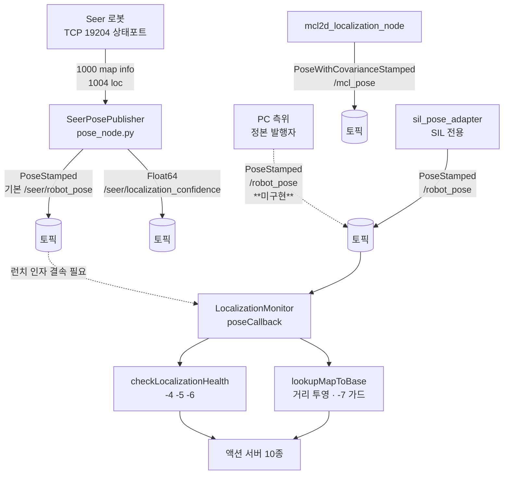

## 2026-08-10 (KST) — pose 토픽 배선 사슬 리뷰

### 코드 버전
- 리뷰 커밋: `cb53176` (branch `session/c9ea2414-pose`)
- 직전 리뷰: 없음 (본 주제 최초)
- 같은 시각 사용자 지시: "코드 분석만 진행부탁" (2026-08-10 15:55 KST)

### 분석 분기 명시
- 분기: **전체 구조 분석** (다중 모듈 — 발행자·모니터·소비 액션 서버 횡단)
- 감지된 도메인: **없음** (`docs/claude_guideline/code_review/domains/` 미설치 — Core 단독)

---

### Core 인벤토리

#### 1. 목적

**측위 자세(pose)가 Seer 또는 PC 측위에서 2WS 액션 서버까지 도달하는 경로**를 대상으로 한다.
액션 서버는 `trnav_2ws_core::LocalizationMonitor` 를 통해 `PoseStamped` 토픽 하나를 구독하고,
그 값으로 ① 주행 거리 투영 ② 측위 건전성 워치독(`status −4·−5·−6`) ③ 헤딩 발산 가드(`−7`)를
수행한다. 즉 **이 한 토픽이 끊기면 측위 기반 안전장치 전부가 성립하지 않는다.**

설계 의도는 코드에 명시돼 있다 — `seer_pose_publisher/seer_pose_publisher/pose_node.py:20-31`:

> `trnav_2ws_action_server` 의 `translate_forward`·`translate_reverse`·`mpc`·`mpc_reverse`
> 네 액션은 `LocalizationMonitor` 로 `/robot_pose` 를 구독하며, 그 토픽이 없으면 목표 접수
> 직후 `status −3` 로 abort 한다. … **그 토픽을 PC 측위가 채우는 것이 정본 구성이고,
> 본 노드는 그 옆의 참조다.**

따라서 `seer_pose_publisher` 가 `/seer/robot_pose` 로 발행하는 것은 **의도된 분리**이며
배선 결함이 아니다. 본 리뷰의 관심사는 「정본 발행자가 실재하는가」와
「두 끝을 잇는 결속이 어디에 선언돼 있는가」다.

#### 2. 코드 플로우차트 (전체 흐름도)

**다중 진입점**: 발행 측 3경로(Seer 실기 · PC 측위(미구현) · SIL 어댑터), 소비 측 단일
(`LocalizationMonitor`). 실기 경로와 SIL 경로가 **같은 토픽명을 두고 갈린다**.

동반 파일: `2026-08-10-flow.drawio` — **박스 13 · 화살표 12**, XML well-formed OK · dangling 0 · mermaid 노드/엣지 1:1 OK (기계 검증).

#### 3. 함수 리스트

| # | 함수 | 입력 | 출력 | 기능 | 위치(file:line) |
| --- | --- | --- | --- | --- | --- |
| 1 | `SeerPosePublisher.__init__` | 없음 | 없음 | 파라미터 선언·퍼블리셔 2개 생성·타이머 2개 등록 | seer_pose_publisher/seer_pose_publisher/pose_node.py:89 |
| 2 | `SeerPosePublisher._declare` | 없음 | 없음 | 파라미터 선언·범위 검증(`rate_hz>0`, 벤더 권장 10 Hz 초과 경고) | 〃:128 |
| 3 | `SeerPosePublisher._connect` | 없음 | `bool` | Seer 19204 접속, 실패 시 False | 〃:152 |
| 4 | `SeerPosePublisher._close` | 없음 | 없음 | 소켓 정리(멱등) | 〃:168 |
| 5 | `SeerPosePublisher._check_map` | 없음 | `bool` | `1000` 으로 현재 맵·md5 확인, 게이트 판정 | 〃:178 |
| 6 | `SeerPosePublisher._on_map_timer` | 없음 | 없음 | 주기적 맵 재확인 | 〃:220 |
| 7 | `SeerPosePublisher._on_pose_timer` | 없음 | 없음 | `1004` 폴링 → `PoseStamped`·confidence 발행 | 〃:227 |
| 8 | `SeerPosePublisher._warn_throttled` | `text`,`period_ns` | 없음 | 경고 폭주 억제 | 〃:289 |
| 9 | `SeerPosePublisher.destroy_node` | 없음 | `bool` | 소켓 닫고 상위 정리 | 〃:295 |
| 10 | `main` | `argv` | `int` | 노드 spin 진입점 | 〃:300 |
| 11 | `generate_launch_description` | 없음 | `LaunchDescription` | 노드 1개 + yaml 파라미터. **remap 없음** | seer_pose_publisher/launch/seer_pose.launch.py:12 |
| 12 | `LocalizationMonitor::poseCallback` | `PoseStamped::SharedPtr` | 없음 | x·y·yaw·stamp 캐시, 점프 판정 | trnav_2ws_core/src/localization_monitor.cpp:28 |
| 13 | `LocalizationMonitor::checkLocalizationHealth` | 없음 | `bool` | 워치독 — 정지·미수신·점프·신선도 판정 | 〃:76 |
| 14 | `LocalizationMonitor::lookupMapToBase` (3인자) | `x,y,yaw` out | `bool` | 캐시 조회(4인자 판 위임) | 〃:131 |
| 15 | `LocalizationMonitor::lookupMapToBase` (4인자) | `x,y,yaw,stamp` out | `bool` | 캐시 + stamp 조회. **신선도 미검사** | 〃:137 |
| 16 | `LocalizationMonitor::getLastFailReason` | 없음 | `HealthFailReason` | 마지막 실패 사유 | trnav_2ws_core/include/trnav_2ws_core/localization_monitor.hpp:46 |
| 17 | `LocalizationMonitor::setMaxCmdSpeed` | `double` | 없음 | 현재 지령속도 통보(워치독 게이트) | 〃:51 |
| 18 | `LocalizationMonitor::setEnableWatchdog` | `bool` | 없음 | 워치독 on/off | 〃:56 |

#### 4. 전역 변수 / 모듈 상수

| # | 변수 | 사용처(함수) | 기능 | 위치(file:line) |
| --- | --- | --- | --- | --- |
| G1 | `API_INFO = 1000` (상수) | #5 | 맵 정보 조회 API 번호 | pose_node.py:81 |
| G2 | `API_LOCATION = 1004` (상수) | #7 | 자세 조회 API 번호 | pose_node.py:82 |
| G3 | `PORT_STATUS = 19204` (상수) | #3 | Seer 상태 전용 포트 | pose_node.py:83 |
| G4 | `Params::pose_topic{"/robot_pose"}` (상수 기본값) | #12 구독 생성 | **소비 측 기본 토픽명** — 발행 측 기본(`/seer/robot_pose`)과 다르다 | localization_monitor.hpp:27 |

`LocalizationMonitor` 의 인스턴스 상태(`last_x_`·`pose_received_`·`max_cmd_speed_` 등 11개)는
전역이 아니라 멤버이며 **전부 `std::atomic`** 이다(hpp:83-99). 콜백 스레드와 execute 스레드가
동시 접근하는 구조에 맞는 선택이고, 별도 지적 사항 없음.

#### 5. 의존성 3-tier

| Tier | 대상 | 버전/제약 | 부재 시 동작(필수/선택) | 근거(파일:line) |
| --- | --- | --- | --- | --- |
| 빌드 | `rclpy`·`geometry_msgs`·`std_msgs` | 제약 없음 | 빌드 실패 | seer_pose_publisher/package.xml |
| 빌드 | `csm` | 제약 없음 | 빌드 실패 (본 노드는 미사용 — [품질] 참조) | 〃 |
| 런타임 필수 | Seer 로봇 TCP 19204 | 폴링 ≤10 Hz(벤더 권장) | 접속 실패 시 재시도 반복, **발행 0** | pose_node.py:41-46, 152 |
| 런타임 필수 | `/robot_pose`(PoseStamped) — 소비 측 | — | **`checkLocalizationHealth`→TF_LOOKUP_FAIL, 시작 pose 조회 실패로 액션 abort** | localization_monitor.cpp:96-103 |
| 런타임 선택 | `expected_map_md5` | 미설정 시 게이트 OFF | 다른 맵이어도 발행 계속(경고만) | pose_node.py:105-118 |
| 런타임 선택 | PC 측위(정본 `/robot_pose` 발행자) | — | **본 저장소에 미구현** → 운용자가 런치 인자로 결속해야 함 | pose_node.py:27-31 |

---

### 평가

severity 분포: Critical 0 / High 2 / Medium 2 / Low 1 / Info 1  (Medium 1건은 2026-08-10 오판으로 철회 — 아래 참조)
Verdict: REQUEST CHANGES

**함수 #11·#15 — [논리][신규] 실기에서 `/robot_pose` 를 채우는 결속이 어디에도 선언돼 있지 않다 (High)**
   재현: 저장소 전체에서 `PoseStamped` 발행자는 둘뿐이다 —
   `pose_node.py:102`(기본 `/seer/robot_pose`)와 `sil_pose_adapter_node.cpp:39`(SIL 전용 `/robot_pose`).
   `seer_pose.launch.py:12-19` 에 remap 이 없고, 액션 서버 런치는 `pose_topic` 기본값이
   `/robot_pose` 다(예: `mpc.launch.py:13`). 즉 **실기 구성에서 두 끝을 잇는 것은 운용자가
   손으로 넣는 런치 인자뿐**이고, 그 인자는 어느 런치·문서에도 기본으로 박혀 있지 않다.
   `RUNBOOK-first-drive.md:63-64` 도 override 없이 띄운다(→ `/seer/robot_pose`).
   설계상 「PC 측위가 정본」은 맞으나 **그 정본 발행자가 본 저장소에 없다**(#5 의존성 표).
   권고: ① 실기 브링업 런치에 결속을 명시하거나 ② `seer_pose_publisher` 를 정본으로 쓸
   구성이면 그 런치에 `pose_topic:=/robot_pose` 를 기본으로 박고 의존성 경고를 유지.
   어느 쪽이든 **결속이 코드/런치에 선언**돼야 한다. 지금은 재현 가능한 기동 절차가 없다.

**함수 #15 — [논리][잔존] `lookupMapToBase` 가 신선도를 검사하지 않는다 (High)**
   재현: `localization_monitor.cpp:137-150` 은 `pose_received_` 만 보고 마지막 값을 돌려준다.
   `pose_received_` 는 한 번 참이 되면 내려가지 않는다(`:28-74` 에 해제 경로 없음).
   즉 측위가 멈춰도 **성공을 반환하며 얼어붙은 좌표를 준다.** 거리 투영이 고정되어
   기동이 진행되지 않고, 헤딩 가드는 얼어붙은 맵 yaw 로 IMU 를 탓한다.
   `yaw_control` 계열은 2026-08-10 에 호출부에서 stamp 나이를 검사하도록 고쳤으나
   (`kHeadingPoseMaxAgeSec`), **`translate_*`·`mpc*`·`crab_linear` 는 그대로다.**
   권고: 검사를 `lookupMapToBase` 안으로 내려 모든 호출부가 함께 닫히게 할 것.

**함수 #13 — [논리][신규] 워치독이 `setMaxCmdSpeed` 호출에 의존하는데 호출하지 않는 서버가 있다 (Medium)**
   재현: `checkLocalizationHealth`(`:80-89`)는 `max_cmd_speed_ <= 0.01` 이면 즉시 `true` 를
   반환한다. `grep -rn setMaxCmdSpeed` 결과 `translate_*`·`crab_linear`·`mpc*` 는 호출하고
   `spin`·`turn`(±)은 호출하지 않는다. `yaw_control` 계열은 2026-08-10 에 배선했다.
   `spin`·`turn` 은 IMU 기반이라 측위를 쓰지 않으므로 **현재는 무해**하나, 워치독이
   「호출해야 켜지는」 구조라 새 서버가 조용히 무방비로 태어난다.
   권고: 기본을 「켜짐」으로 뒤집고 정지 구간만 예외로 하거나, 미호출을 기동 시 경고.

**함수 #14·#15 — [품질][신규] 3인자 판이 4인자 판의 얇은 위임인데 호출부가 갈렸다 (Medium)**
   재현: `:131-135` 가 `:137` 에 위임한다. stamp 를 버리는 3인자 판을 쓰면 신선도 검사를
   할 수 없다 — 위 High 의 구조적 원인이다. 현재 `translate_*`·`mpc*` 는 3인자 판을 쓴다.
   권고: 3인자 판을 폐기하고 4인자 판으로 통일(호출부가 stamp 를 보게 강제).

**~~#5 의존성 — [품질][신규] `package.xml` 의 `csm` 은 본 노드가 쓰지 않는다 (Medium)~~ — ⚠ 철회(오판)**
   **이 지적은 틀렸다.** `pose_node.py:79` 가 `from csm.seer_client import SeerError,
   SeerStatusClient` 로 실제 사용한다. 내가 "grep 0건" 이라 적은 것은 조회가 잘못된 것이다
   (`import` 행을 포함하지 않는 패턴으로 봤다). 제거를 시도했다가 되돌렸다(`git checkout`).
   **`csm` 은 정당한 런타임 필수 의존이다** — `_ALLOWED_PORTS` 로 상태 포트만 열도록
   강제하는 근거도 `pose_node.py:60,76` 에 적혀 있다.
   교훈: 「없다」를 주장하려면 **부재를 확인하는 조회**(import 행 포함)를 써야 한다.

**함수 #7 — [스타일][신규] 실패 로그 문구가 기전과 어긋난다 (Low)**
   재현: `pose_node.py:22-25` 자신이 지적하듯, 소비 측 실패 문구는
   `TF2 map->base_link not available` 인데 `localization_monitor.cpp:137-150` 은 TF 를 전혀
   쓰지 않고 토픽 캐시를 읽는다. 정비자가 TF 를 파게 된다.
   권고: 소비 측 문구를 「`/robot_pose` 미수신」으로 정정(본 리뷰 범위 밖 파일이라 별도 조치).

**[Info] `/seer/robot_pose` 발행 분리는 의도된 설계다**
   `pose_node.py:27-31` 이 「그 토픽을 PC 측위가 채우는 것이 정본 구성이고 본 노드는 그 옆의
   참조」라 명시하고, `:114-118` 은 `/robot_pose` 로 덮어쓰면 의존성 경고를 남긴다.
   **배선 결함으로 오독하지 말 것** — 본 리뷰의 High 는 「분리」가 아니라 「결속 미선언」이다.

---

### 기록 위치 판정
본 리뷰는 `seer_pose_publisher` · `trnav_2ws_core` · `trnav_2ws_action_server` · `sil_pose_adapter`
**4개 패키지를 횡단**한다. SOP 룰 13 의 「패키지 루트 특정 불가 시 루트 정본만」에 해당하여
패키지 병기를 생략한다(무해).

---

## 2026-08-10 후속 — 조치 결과

| 항목 | 조치 | 검증 |
| --- | --- | --- |
| High #11·#15 결속 미선언 | `seer_pose.launch.py` 에 `pose_topic` 을 **런치 인자로 선언**(기본값 `/seer/robot_pose` 유지). 두 구성(Seer 정본 / 참조+서버 redirect)을 docstring 에 명시 | `--show-args` 로 인자 노출 확인 |
| High #15 신선도 미검사 | 검사를 **`lookupMapToBase` 안으로 이동**. 3인자 판이 위임하므로 `translate_*`·`mpc*`·`crab_linear` 까지 함께 닫힌다. 임계는 새 손잡이 없이 `localization_timeout_sec` 재사용 | SIL `yaw_stale_start` 신설 — **검사 有 `−6` / 無 `−3`**(격리 실증) |
| Medium #13 워치독 배선 | 미조치 — `spin`·`turn` 은 측위를 쓰지 않아 현재 무해. 구조 개선은 별도 | — |
| Medium #14·#15 3인자 판 | 위 신선도 이동으로 **실질 해소**(3인자 판이 4인자에 위임) | 동일 |
| Medium #5 `csm` | **철회** — 오판이었다(위 참조) | — |
| Low #7 오류 문구 | 5개 서버의 `"TF2 map->base_link not available"` → `"/robot_pose 미수신 또는 낡음 … TF 문제가 아니다"` | 빌드 통과 |
| (부수) `−7` 카운터 | 자세를 못 얻은 주기에 `heading_diverge_cnt` 리셋 추가 — 공백을 낀 누적이 「연속」으로 읽히지 않게 | SIL 7/7 |

**격리 실증이 중요했다.** 처음 두 번의 음성 대조가 무효였다 —
① 임계를 0 으로 두는 방식은 `checkLocalizationHealth` 에서 「항상 초과」가 되어 반대로 작동했고,
② 워치독을 켠 채로는 `−4` 가 먼저 잡아 검사의 기여를 구분할 수 없었다.
워치독을 끄고 소스를 되돌려 비교해서야 **`−6` vs `−3`** 차이가 드러났다.
시험 판정도 `status != 0` 에서 **`−4`·`−6` 만 통과**로 조였다 — 「멈추는 것」과
「원인을 가리키는 코드로 멈추는 것」은 다르다.
