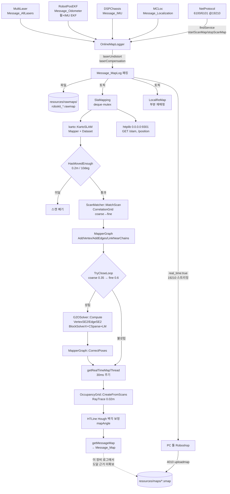
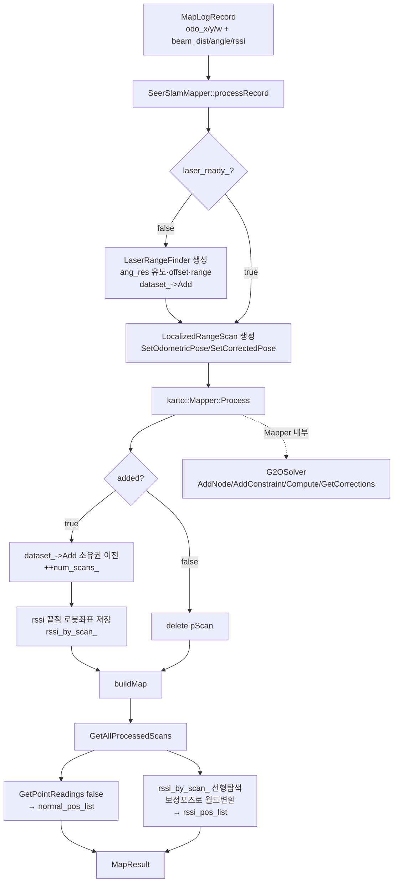

## 2026-08-08 (KST) — Seer legacy 지도생성(SLAM 매핑) 리뷰 — 원본 파이프라인 + 이식 대상 `slam_karto_core`

> 사용자 지시(2026-08-08 18:17): "amap-server에서 63g sata에 seer legacy에서 지도 생성 방법에 대해서
> 조사해주세요. 코드 리뷰하고 결과는 이 pC에 기록하고 /home/nvidia/Project/Ford-CATL-AMR/Big-AMR/src/Navigation
> 에 동일한 코드 구현해줄수 있을까? 총 10명 투입가능"
>
> 조사는 10 에이전트 병렬(A1~A10). 본 리뷰는 그 산출을 근거로 한다.

### 코드 버전

**리뷰 대상 ①: 원본 바이너리** (읽기 전용, 수정 0)

| 항목 | 값 | 근거 |
| --- | --- | --- |
| 배포본 | rbk **3.4.5.22** | `<하드>/usr/local/SeerRobotics/rbk/product.version.h` |
| 플러그인 빌드 | **3.4.5.20** (본체보다 한 빌드 뒤짐) | DWARF 소스경로 `/root/workspace/3.4.5.20/plugins/SlaMapping/src/` |
| `libSlaMapping.so` | 18,437,896 B, 2023-06-21, md5 `a925b68bee99b098e50e7ef726ca4620` | `ls -la`, `md5sum` |
| ELF | x86-64, **with debug_info, not stripped** | `file` |
| 하드 | `amap-server:/media/amap/6ab6980d-f090-4387-8753-a2251e75651d` (`sdb2`, 59.1G ext4) | 마운트 실측 |

**리뷰 대상 ②: 이식 대상 소스** — `amap-server:~/Project/Seer_Analysis/src/`

| 항목 | 값 |
| --- | --- |
| 커밋 | `8ffd07d` "feat(slam): SLAM 매핑 재구현 — Open Karto + g2o 채용 (Seer 튜닝 파라미터 적용)" (2026-07-13) |
| `slam_karto_ros2` | **git 미추적** (`git status --short` → `?? src/slam_karto_ros2/`) |
| 규모 | `slam_karto_core` 781줄(9파일) + `slam_karto_ros2` 30줄(1파일) = 811줄 |

파일 내용 해시 (비-git 대상이므로 SHA-256 으로 버전 고정):

| 파일 | 줄 | sha256 (앞 16) |
| --- | --- | --- |
| `slam_karto_core/src/g2o_solver.cpp` | 121 | `8bdb737a00fa45f4` |
| `slam_karto_core/src/seer_mapper_config.cpp` | 45 | `8044ff1bd272c58a` |
| `slam_karto_core/src/seer_slam_mapper.cpp` | 155 | `611b85844b99c5ee` |
| `slam_karto_core/test/test_slam_mapping.cpp` | 120 | `7a3ee37bfaec8227` |
| `slam_karto_core/include/slam_karto_core/g2o_solver.hpp` | 59 | `2e0b3503e49c3cc3` |
| `slam_karto_core/include/slam_karto_core/seer_mapper_config.hpp` | 58 | `6acfa416ab1222e1` |
| `slam_karto_core/include/slam_karto_core/seer_slam_mapper.hpp` | 82 | `d68635854aab77da` |
| `slam_karto_core/include/slam_karto_core/types.hpp` | 35 | `e2e4841e2e7cac41` |
| `slam_karto_core/CMakeLists.txt` | 65 | `a10b16a4e25a54e8` |
| `slam_karto_core/README.md` | 41 | `d2aa73967e3fbcab` |
| `slam_karto_ros2/package.xml` | 30 | `aa41a8648c0a30cf` |

**본 저장소 상태**: `main` @ `4dfb626`. 리뷰 시점에 `src/Navigation/` 에는 SLAM 매핑 패키지가 없다
(`ls src/Navigation/` → `mcl2d_core`, `mcl2d_map`, `mcl2d_ros2`, `seer_pose_publisher`, `icp_odometry_bringup`, `docs`, `README.md`).

- 직전 리뷰: 없음(`ls docs/code_review/` 에 slam·karto·mapping 주제 폴더 부재 — 최근접 인접 주제는
  `mcl2d-localization-chain/2026-08-07.md`, 대상이 위치추정이라 범위가 다름). 따라서 Core 5항목 전체 작성.
- 같은 시각 `docs/user_instructions/sessions/82e3631a*.md` entry 참조.

### 분석 분기 명시

- 분기: **전체 구조 분석** (다중 모듈 — 원본 플러그인 3개 + 이식 모듈 2개)
- 감지된 도메인: **ros2-review**(이식 대상이 ament_cmake 패키지 선언) + **concurrency**(원본에 스레드 4종, 이식본에 뮤텍스 없음)

---

## Core 인벤토리

### 1. 목적

**원본.** Seer rbk 3.4.5 의 `libSlaMapping.so` 는 2D 라이다 그래프 SLAM(Simultaneous Localization And Mapping)
플러그인이다. `OnlineMapLogger` 가 발행하는 `rbk.protocol.Message_MapLog`(레이저 스캔 + 오도메트리 시퀀스)를
구독해, Open Karto 프런트엔드(상관격자 스캔매칭 + 근접체인 루프클로저)와 g2o 백엔드(SE(2) 포즈그래프,
Levenberg-Marquardt)로 포즈를 보정하고, `getMessageMap()` 서비스로 `rbk.protocol.Message_Map` 을 반환한다.
정체는 추측이 아니라 DWARF 소스경로가 직접 말한다:

```
$ readelf --debug-dump=info libSlaMapping.so | grep -oaE "/root/workspace/[^ \")]*" | sort -u | grep -i karto
/root/workspace/3.4.5.20/plugins/SlaMapping/src/./karto/Karto.cpp
/root/workspace/3.4.5.20/plugins/SlaMapping/src/./karto/Karto.h
/root/workspace/3.4.5.20/plugins/SlaMapping/src/./karto/KartoSLAM.cpp
/root/workspace/3.4.5.20/plugins/SlaMapping/src/./karto/Mapper.cpp
/root/workspace/3.4.5.20/plugins/SlaMapping/src/./karto/g2o_solver.cpp
```

`Karto.cpp`·`Mapper.cpp` 는 [open_karto](https://github.com/ros-perception/open_karto) 상류 파일명 그대로이고,
`g2o_solver.cpp` 는 `slam_karto` 계열 `G2OSolver : karto::ScanSolver` 와 클래스·메서드 구성이 일치한다.

**⚠ 「원본 지도가 이 플러그인으로 만들어졌다」는 확정이 아니다.** 실기 로그(A5)는 반대 방향을 가리킨다 —
매핑 명령 `6100`/`6101`(포트 19210)은 `SlaMapping` 이 아니라 **`OnlineMapLogger`** 로 라우팅되고,
완성 `.smap` 은 PC 툴(Roboshop)이 만들어 `4010` 으로 업로드한다. 2024-05-31 Foil AGV 세션 전 구간 원문:

```
[240531 181952.512][NP][d] [NetworkJSON][{"real_time":true}]            (Other|6100)
[240531 181952.516][OM][i] mapping status: 2
[240531 182043.368][NP][d] [NetworkCmd][Other|6101|0|192.168.192.2|51052|true|2]
[240531 182043.373][OM][i] [Text][Save rawmap: .../robokit_2024-05-31_18-20-43.rawmap, size: 1108834]
[240531 182114.285][NP][i] [Text][upload map .../resources/maps/Test.smap, size: 86185]
[240531 182114.326][NP][d] [NetworkJSON][{"map_name":"Test"}]           (Control|2022)
```

조사 범위 명시: `diagnosis/log/` 1,564개 `.log.gz` 중 2023-08-09 및 2024-05-31 세션 파일을 열람했고,
그 파일들의 플러그인 태그 전수(`Charger CPU DC Lar MCLoc MF NP OC OM R SF SP TM`)에 SlaMapping 태그가
나타나지 않았다. **따라서 온보드 Karto+g2o 경로는 `[존재]` 이며, 이 장비의 열람 범위에서 `[동작]` 근거는 얻지 못했다.**
`.smap` 을 실제로 생성한 PC 측 알고리즘은 본 조사에서 열람하지 않았다.

**이식 대상.** `slam_karto_core` 는 위 RE(Reverse Engineering) 결과를 근거로 Open Karto + g2o 를
**재구현이 아니라 채용**해 조립한 프레임워크-독립 C++ 모듈이다(ADR 2026-07-13). `slam_karto_ros2` 는
그것을 rclcpp 노드로 감쌀 예정으로 선언만 되어 있다.

### 2. 코드 플로우차트

전체 흐름도(mermaid). 동반 `.drawio`: `2026-08-08-flow.drawio`(원본 파이프라인)·`2026-08-08-flow-port.drawio`(이식본).

**흐름 ① 원본 rbk 파이프라인** (진입점: 플러그인 로드 → TCP 서비스 호출)



**흐름 ② 이식본 `slam_karto_core`** (진입점: `SeerSlamMapper::processRecord` — 라이브러리 단일 진입)



**다중 진입점 분리**: 원본은 ① 플러그인 생명주기(`plugin_connect`→`create`→`initialize`→`loadFromConfigFile`
→`setSubscriberCallBack`→`run`) ② 토픽 콜백(`messageMapLogCallBack`) ③ 서비스 RPC(`startScanMap`/
`stopScanMap`/`getMessageMap`) ④ HTTP(`/slam`,`/position`) 4개 진입점을 갖는다. 이식본은 라이브러리
단일 진입(`processRecord`/`buildMap`)뿐이다 — 이 비대칭 자체가 findings #M12·#H5 의 근거다.

### 3. 함수 리스트 표

이식 대상 `slam_karto_core`(전수, private 포함). 원본은 바이너리이므로 §도메인 표에 별도 정리.

| # | 함수 | 입력 | 출력 | 기능 | 위치(file:line) |
| --- | --- | --- | --- | --- | --- |
| 1 | `G2OSolver::G2OSolver` | — | — | g2o 스택 조립(LinearSolver→BlockSolverX→LM), `setAlgorithm` | g2o_solver.cpp:28-35 |
| 2 | `G2OSolver::~G2OSolver` | — | — | `= default` (optimizer_ unique_ptr 해제) | g2o_solver.cpp:37 |
| 3 | `G2OSolver::AddNode` | `karto::Vertex<LocalizedRangeScan>*` | void | `VertexSE2`(id=UniqueId, est=CorrectedPose) 추가, 첫 노드 `setFixed(true)` | g2o_solver.cpp:39-55 |
| 4 | `G2OSolver::AddConstraint` | `karto::Edge<LocalizedRangeScan>*` | void | `EdgeSE2` 추가, measurement=PoseDifference, information=Covariance 역행렬 | g2o_solver.cpp:57-87 |
| 5 | `G2OSolver::Compute` | — | void | 정점 2개 이상이면 `initializeOptimization`+`optimize(max_iterations_)`, corrections_ 수집 | g2o_solver.cpp:89-109 |
| 6 | `G2OSolver::GetCorrections` | — | `const IdPoseVector&` | corrections_ 반환 | g2o_solver.cpp:111-114 |
| 7 | `G2OSolver::Clear` | — | void | `corrections_.clear()` 만 수행 | g2o_solver.cpp:116-119 |
| 8 | `G2OSolver::setMaxIterations` | `int n` | void | 인라인 setter | g2o_solver.hpp:45-48 |
| 9 | `applySeerParams` | `karto::Mapper*`, `const SeerMapperParams&` | void | Karto setter 25회 호출 | seer_mapper_config.cpp:8-43 |
| 10 | `SeerSlamMapper::SeerSlamMapper` | `const SeerMapperParams&` | — | Mapper/Dataset/G2OSolver 생성, `applySeerParams`, `SetScanSolver` | seer_slam_mapper.cpp:18-23 |
| 11 | `SeerSlamMapper::~SeerSlamMapper` | — | — | mapper_→dataset_→solver_ 순 명시 파괴 | seer_slam_mapper.cpp:25-31 |
| 12 | `SeerSlamMapper::setMaxIterations` | `int n` | void | solver_ 로 위임 | seer_slam_mapper.cpp:33-36 |
| 13 | `SeerSlamMapper::processRecord` | `const MapLogRecord&`, `const LaserGeometry&` | `bool` (그래프 추가 여부) | 첫 호출 시 LaserRangeFinder 구성, LocalizedRangeScan 생성 후 `Mapper::Process`, rssi 끝점 적재 | seer_slam_mapper.cpp:38-108 |
| 14 | `SeerSlamMapper::buildMap` | — | `MapResult` | 전 스캔의 보정포즈 점군 + rssi 월드변환 | seer_slam_mapper.cpp:110-153 |
| 15 | `SeerSlamMapper::setRssiThreshold` | `double t` | void | 인라인 setter | seer_slam_mapper.hpp:52-55 |
| 16 | `SeerSlamMapper::numScans` | — | `int` | 인라인 getter | seer_slam_mapper.hpp:62-65 |
| 17 | `makeScan` (test, 익명 ns) | `rx,ry,rth,W,H` | `MapLogRecord` | 사각방 벽 레이캐스트로 360빔 합성 | test_slam_mapping.cpp:20-46 |
| 18 | `main` (test) | — | `int` | 합성 궤적 151스텝 투입 후 assert 4건 | test_slam_mapping.cpp:49-119 |
| 18a | `main.addLeg` (람다) | `x0,y0,x1,y1,steps` | void | 직선 구간 truth 궤적 생성 | test_slam_mapping.cpp:64-72 |

**중복/유사 함수**: 없음 — 16개 공개·내부 함수의 시그니처와 본문이 서로 다르며, 같은 일을 하는 쌍을
찾지 못했다(전 4개 `.cpp`/4개 `.hpp` 전문 대조).

### 4. 전역 변수 / 모듈 상수 표

| # | 사용처(함수) | 기능 | 위치(file:line) |
| --- | --- | --- | --- |
| G1 | #13 `processRecord` | `kSensorName = "SeerLaser"` — Karto `Name` 키. **(상수)**, 익명 네임스페이스 | seer_slam_mapper.cpp:15 |
| G2 | #1 `G2OSolver::G2OSolver` | `typedef g2o::BlockSolverX BlockSolver` — **(상수/타입)**, 익명 네임스페이스 | g2o_solver.cpp:20 |
| G3 | #1 `G2OSolver::G2OSolver` | `typedef LinearSolverCSparse/LinearSolverEigen<...> LinearSolver` — `SLAM_G2O_USE_CSPARSE` 로 분기. **(상수/타입)** | g2o_solver.cpp:21-25 |
| G4 | 빌드 전역 | `SLAM_G2O_USE_CSPARSE` 컴파일 정의 — CSparse 가용 시에만 부여 | CMakeLists.txt:38, 55-57 |
| G5 | #9 `applySeerParams` 기본인자 | `SeerMapperParams` 28 필드 기본값(멤버 초기화자) — **(상수)**, 진정한 전역 아님(구조체 기본값) | seer_mapper_config.hpp:21-51 |

**가변 전역 상태는 없다** — `grep -nE '^[A-Za-z_].*=' src/*.cpp` 및 4개 `.cpp` 전문 확인 결과
파일 스코프 `static`/mutable 전역 정의를 찾지 못했다. 상태는 전부 `SeerSlamMapper`/`G2OSolver`
멤버로 캡슐화되어 있다 — 이 설계는 유지할 것.

**필요성 평가**: G1 은 Karto `SensorManager` 조회 키라 필수. G2·G3 는 타입 별칭이라 무해.
G4 는 빌드 구성 스위치로 적절. **불필요한 전역 0건.**

### 5. 의존성 3-tier 표

| Tier | 대상 | 버전/제약 | 부재 시 동작(필수/선택) | 근거(파일:line) |
| --- | --- | --- | --- | --- |
| 빌드 | Open Karto (`open_karto/Mapper.h`, `libkarto`) | melodic-devel 계열, **LGPL-3.0** | **모듈 전체 미빌드**(CMake `return()`) — 테스트도 사라짐 | CMakeLists.txt:18-19, 30-34 |
| 빌드 | g2o `core`/`stuff`/`types_slam2d` | — | 동상 미빌드 | CMakeLists.txt:20-23, 30 |
| 빌드 | Eigen3 | — | 동상 미빌드 | CMakeLists.txt:14, 30 |
| 빌드 | g2o `solver_csparse` + SuiteSparse `cs.h` | 선택 | **Eigen 해법기로 폴백**(`SLAM_G2O_USE_CSPARSE` 미부여) | CMakeLists.txt:26-45 |
| 빌드 | Boost thread/system | karto 전이 의존 | 링크 실패 | README.md:23-31 (검증 명령) |
| 빌드 | C++14 | `CMAKE_CXX_STANDARD 14` — 저장소 표준(C++17)과 불일치 | 컴파일 가능하나 혼재 | CMakeLists.txt:6 |
| 런타임 필수 | 호출자가 공급하는 `MapLogRecord` 시퀀스 | `beam_dist`/`beam_angle` 길이 일치, **균일 각도 간격** | 비균일 시 각도 왜곡(#M7) | seer_slam_mapper.cpp:44-51 |
| 런타임 필수 | 오도메트리 시드(`odo_x/y/w`) | 원본은 EKF(휠+IMU) 출력 | 없으면 스캔매칭 초기추정 부재 | 원본 `rbk.plugin` `["RobotPosEKF","Message_Odometer","MCLoc","OnlineMapLogger"]` |
| 런타임 선택 | `beam_rssi` | 비었으면 `rssi_pos_list` 미산출 | `rssi_by_scan_` 에 아무것도 쌓이지 않음(빈 벡터 반환) | seer_slam_mapper.cpp:79, types.hpp:21 |
| 런타임 선택 | `LaserGeometry::angular_resolution` | 0 이면 `beam_angle[1]-beam_angle[0]` 유도, 그것도 0 이면 1° | seer_slam_mapper.cpp:43-47 |
| — (`slam_karto_ros2`) 빌드 | `ament_cmake`, `rclcpp`, `sensor_msgs`, `nav_msgs`, `geometry_msgs`, `std_srvs`, `tf2`, `eigen` | 선언만 존재 | **`CMakeLists.txt` 부재로 colcon 빌드 실패**(#H5) | package.xml:14-25 |

---

## 도메인 — ros2-review

| 항목 | 원본 대응 | 이식본 현황 | 근거 |
| --- | --- | --- | --- |
| 노드/실행자 | rbk 플러그인 `run()` + 스레드풀 2 + detached HTTP 1 + 루프클로저 1 | **없음** (`slam_karto_ros2` 소스 0줄) | package.xml 만 존재 |
| 토픽 구독 | `Message_MapLog` 1개 (`setTopicCallBack`) | 미정 — package.xml 설명은 `/scan` + `/odom` | package.xml:8 |
| 토픽 발행 | 없음(`rbk.plugin` 의 publisher 슬롯에 SlaMapping 미등장) | 미정 — 설명은 `/map`(OccupancyGrid) | package.xml:8 |
| 서비스 | `startScanMap(int,int)`, `stopScanMap()`, `getMessageMap()→string` | 미정 — `std_srvs` 만 선언 | A1 디스어셈블 §3.2 |
| QoS | 해당 없음(ROS 아님) | 미정 — `/scan_merged` 는 `SensorDataQoS`(BEST_EFFORT) | dual_laser_merger.cpp:28,30 |
| TF | 해당 없음 | **미정 — 충돌 위험**: `map→odom` 은 이미 mcl2d 소유로 확정 | docs/code_review/mcl2d-localization-chain/2026-08-07.md H1 |
| 파라미터 | rbk 설정 키는 `StartSlam` 단 1개(그룹 `Laser`) — Karto 28개는 **하드코딩** | `SeerMapperParams` 구조체 기본값(런타임 노출 없음) | A1 §7.1, seer_mapper_config.hpp:21-51 |

## 도메인 — concurrency

| 항목 | 원본 | 이식본 | 근거 |
| --- | --- | --- | --- |
| 스레드 | detached HTTP 1 + ThreadPool 태스크 2 + `KartoSLAM::mpLoopThread` 1 | **0** (동기 라이브러리) | A1 §5 |
| 락 | `m_msg_map_mutex`, `mMutex`, `mSlamMutex`, `karto::Mapper::mScanMutex` | **0** | A1 §4-5 |
| 주기 | `getRealTimeMapThread` `nanosleep` 30 ms(=33 Hz), EINTR 재시도 | 없음 | A1 §5 (`mov $0x1c9c380` = 30,000,000 ns) |
| 큐 | `std::deque<Message_MapLog>` + 뮤텍스 | 없음 | A1 §4 (`mqMapLog` @ +816) |

**평가**: 이식본이 동기·무락인 것은 **결함이 아니라 올바른 코어/어댑터 분리**다(`mcl2d_core` 선례와 동일).
다만 ROS2 어댑터를 쓸 때 스캔 콜백 스레드에서 `processRecord`(스캔매칭·루프클로저·g2o 최적화 포함)를
직접 호출하면 executor 를 수백 ms 단위로 막는다 — 어댑터 설계 시 별도 워커가 필요하다(#M16).

---

## 평가

severity 분포: Critical 0 / High 4 / Medium 21 / Low 5 / Info 4
Verdict: REQUEST CHANGES

> 본 리뷰는 작성자 self-APPROVE 대상이 아니다(SOP 룰 11). 이식 구현 후 별도 lane 검증 필요.

### High

**함수 #18 `main` (test) — [테스트][신규] assert 4건이 Release 빌드에서 전부 컴파일아웃 → 무조건 PASS (High)**
   재현: `CMakeLists.txt:8-10` 이 `CMAKE_BUILD_TYPE` 미지정 시 **Release 를 강제**하고, Release 는 `-DNDEBUG` 를
   부여한다. 검증 로직은 `test_slam_mapping.cpp:101,102,103,115` 의 `assert` 4개가 전부다.
   `-DNDEBUG` 하에서 `assert` 는 빈 문장으로 치환되므로 **어떤 결함이 있어도 `return 0`**.
   이 저장소는 동일 사고를 이미 겪었다 — `src/Navigation/README.md:74-76`:
   "기본 빌드타입 Release(`-DNDEBUG`)라 `test_mcl2d` 의 assert 3개가 전부 사라져 있었다
   (`nm` 로 `__assert_fail` 부재 확인 = 어떤 결함이든 무조건 PASS)". **동일 형태의 퇴행.**
   권고: `test_smap` 이 채택한 방식대로 NDEBUG 무관 자체 `CHECK` 매크로로 교체(권장), 또는 테스트 타깃에
   `-UNDEBUG` 부여. 교체 후 **돌연변이 검증**으로 실제 검출력을 증명할 것(`Tools/amr_test_gui/mutation_check.py` 선례).

**함수 #4 `G2OSolver::AddConstraint` — [논리][신규] 공분산 역행렬에 가드가 없다 (High)**
   재현: `g2o_solver.cpp:81-85` 가 Karto `LinkInfo::GetCovariance()` 를 그대로 `info.inverse()` 한다.
   Karto 의 공분산은 상관 응답 분포에서 추정되므로, 특징이 빈약한 복도·개활지에서 한 축이 사실상 0 이 되어
   행렬이 특이해질 수 있다. Eigen 의 `inverse()` 는 특이행렬에 대해 예외를 던지지 않고 `inf`/`NaN` 을 채운다.
   그 정보행렬이 하나라도 들어가면 `optimize()` 의 전체 해가 오염되어 **그래프 전체가 발산**한다(부분 손상이 아님).
   권고: `Eigen::FullPivLU` 등으로 가역성 판정 후 실패 시 (a) 해당 엣지 기각 + 로그, 또는
   (b) 대각 정규화(`cov += eps*I`) 적용. 어느 쪽이든 조용한 실패는 금지.

**모듈 `slam_karto_ros2` — [논리][신규] `package.xml` 만 있고 빌드 파일·소스가 없다 (High)**
   재현: `find slam_karto_ros2 -type f` → `package.xml` 1건. `package.xml:28` 은 `<build_type>ament_cmake</build_type>`
   를 선언하는데 `CMakeLists.txt` 가 없다. 이 상태로 `src/` 에 두면 colcon 이 패키지로 인식한 뒤
   CMake 구성 단계에서 실패해 **워크스페이스 빌드 전체가 깨진다**. amap-server 에서도 git 미추적이다
   (`git status --short` → `?? src/slam_karto_ros2/`).
   더 무거운 문제는 **선언과 실물의 불일치**다 — `package.xml:7-9` 는
   "`/scan` + `/odom` → 온라인 그래프 SLAM → `/map`(OccupancyGrid) + `.smap` 저장. 실장비 HIL 검증용 패키지"
   라고 적었으나 그 어느 것도 구현되어 있지 않다.
   권고: 이식 시 **빈 껍데기를 그대로 옮기지 말 것.** 구현과 함께 만들거나, 옮긴다면 즉시 `CMakeLists.txt` 를 붙인다.

**ADR 2026-07-13 — [품질][신규] 상류 라이선스를 BSD 로 오기 (High)**
   재현: ADR `:45` 는 "**신규 외부 패키지**: Open Karto(BSD), g2o(LGPL/BSD 혼합 …)" 라고 적었다.
   상류 원문 확인 — `https://raw.githubusercontent.com/ros-perception/open_karto/melodic-devel/src/Mapper.cpp` 헤더:
   "Copyright 2010 SRI International / This program is free software: you can redistribute it and/or modify
   it under the terms of the **GNU Lesser General Public License** as published by the Free Software Foundation,
   either **version 3** of the License, or (at your option) any later version."
   → **LGPL-3.0.** A10 이 확인한 로컬 벤더링본(`/home/nvidia/Project/jsy/T-Drive_ui/third_party/open_karto/`,
   커밋 `922db50`)도 LGPL-3.0 으로 표기돼 있다. ADR 의 "License: 재배포 시 LGPL 컴포넌트 동적링크 유지
   (정적링크 금지)" 라는 조치 자체는 방향이 맞지만, **적용 대상에서 Karto 가 빠져 있다** — BSD 로 분류했기 때문.
   벤더링해서 배포하면 조건이 달라진다.
   권고: ADR 을 `Superseded` 처리하거나 후속 ADR 로 정정. 이식 시 Karto 를 **별도 공유 라이브러리로 동적링크**
   유지하고 `VENDORED.md` 에 라이선스·커밋을 명시(로컬 벤더링본 선례가 이미 그 형식을 쓴다).

### Medium

**함수 #7 `G2OSolver::Clear` — [논리][신규] `first_node_` 가 리셋되지 않아 세션 재사용이 깨진다 (Medium)**
   재현: `g2o_solver.cpp:116-119` 는 `corrections_.clear()` 만 한다. `first_node_`(`g2o_solver.hpp:54`,
   `AddNode` 에서 `false` 로 전이)는 되돌아가지 않으므로, `karto::Mapper` 를 재초기화해 **두 번째 매핑 세션**을
   시작하면 고정(fixed) 노드가 하나도 생기지 않는다 → SE(2) 게이지 자유도 3이 남아 LM 정규방정식이 특이해진다.
   `optimizer_` 의 옛 정점·간선도 잔존해 새 스캔 id 와 충돌한다.

   ⚠ **`Clear()` 에서 그래프를 비우는 "고침"은 오답이다 — 확인함.** 상류 벤더링본
   `third_party/open_karto/src/Mapper.cpp:1322-1332` 의 `MapperGraph::CorrectPoses()` 는
   `pSolver->Compute()` → 보정 적용 → **`pSolver->Clear()`** 를 **루프클로저가 성립할 때마다** 호출한다.
   여기서 `optimizer_->clear()` 를 하면 매 루프클로저마다 포즈그래프가 통째로 파괴된다.
   상류 선언 `virtual void Clear() {};`(Mapper.h:889)의 주석은 "Resets the solver" 지만, **실제 계약은
   "직전 corrections 를 버린다"** 이다 — 호출 위치가 그것을 말한다. 기존 구현이 옳다.
   권고: `Clear()` 는 그대로 두고, 세션 재시작용 **별도 `Reset()`**(그래프 소거 + `first_node_ = true`)을 신설.

**함수 #9 `applySeerParams` — [논리][신규] `ScanBufferSize=100` 의 근거 등급이 과표기됐다 (Medium)**
   재현: `seer_mapper_config.hpp:27` 은 `scan_buffer_size = 100; // ★ stock 70` 이라 적고 README `:9` 는
   이를 "Seer-튜닝 5개(★)가 핵심"의 하나로 든다. 그러나 이번 조사에서 **값이 재현되지 않았다** —
   A1 은 "`ScanBufferSize`, `LoopMatchMinimumChainSize` 는 `Parameter<unsigned int>` 이고 내 추출기는
   `double` 즉치만 복원했다"고 명시했고, A2 도 "bool/uint 파라미터는 값 추출 미수행, 이름만 `[존재]` 확정"
   이라 적었다. 즉 두 독립 디스어셈블 모두 이 값을 측정하지 않았다.
   대조로, 나머지 4개(★)는 상류 원문과 대조해 **확정**됐다 —
   상류 `Mapper.cpp InitializeParameters()`: `LoopSearchMaximumDistance=4.0`(Seer 20.0),
   `LoopMatchMinimumResponseCoarse=0.8`(0.35), `LoopMatchMinimumResponseFine=0.8`(0.6),
   `LoopSearchSpaceDimension=8.0`(6.0). 상류 `ScanBufferSize` 는 `70`.
   권고: 코드 주석의 `★` 를 `★(미재현 — RE 문서 교차검증 진술만)` 으로 강등하고, `uint` 즉치를 별도 추출해
   확정하거나 확정 전까지 부채로 등록.

**함수 #9 `applySeerParams` — [논리][신규] 원본 실측 파라미터 4개를 설정하지 않는다 (Medium)**
   재현: `seer_mapper_config.cpp:14-42` 의 setter 는 25개다. A1·A2 가 원본 `InitializeParameters()` @`0xe1c50`
   에서 실측한 항목 중 다음 4개에 대응하는 setter 호출이 없다 —
   `LoopMatchMaximumVarianceCoarse`(원본 0.16 = 0.4²), `MinimumAnglePenalty`(0.9), `MinimumDistancePenalty`(0.5),
   `UseResponseExpansion`(bool). 상류 기본값이 앞 3개는 동일(`math::Square(0.4)`, `0.9`, `0.5`)하므로 현재는
   무해하지만, **벤더링 판본이 바뀌면 조용히 달라진다.** `LoopMatchMaximumVarianceCoarse` 는 루프클로저
   coarse 게이트라 영향이 크다.
   권고: 4개를 `SeerMapperParams` 에 추가하고 명시 설정. "상류 기본값과 같으니 생략"은 벤더링 환경에서 위험하다.

**함수 #9 `applySeerParams` — [논리][신규] `minimum_time_interval = 3600.0` 은 실측값이 아니다 (Medium)**
   재현: `seer_mapper_config.hpp:50` 주석은 "사실상 무제한 (거리/각도 게이트 우선)". RE 문서 §4 의 파라미터
   표에서 이 항목을 찾지 못했고(회수본 `2026-07-10.md` 전문 대조), A1·A2 의 실측 목록에도 없다.
   즉 **구현자가 임의로 정한 값이 Seer 실측값처럼 표에 섞여 있다.**
   권고: `// [미실측 — 구현 선택]` 주석으로 출처 등급을 분리 표기.

**함수 #13 `processRecord` — [논리][신규] `rssi_threshold_` 기본값이 원본 미확정 파라미터를 대신한다 (Medium)**
   재현: `seer_slam_mapper.cpp:87` 이 `rec.beam_rssi[i] <= rssi_threshold_` 로 걸러내고 기본값은
   `seer_slam_mapper.hpp:74` 의 `0.0`. RE 문서 §근거/한계 `:69` 는 "미확정: … **RssiThres 런타임값**" 이라
   명시했다. A1 이 원본 `SLAM::MapConfigData` 에 `RssiThres` 필드(offset 56, double)가 있음을 확인했으나
   그 값의 생산자는 추적되지 않았다.
   권고: 미확정임을 코드 주석에 명시하고 부채 등록. 반사판 점군 개수가 원본 `.smap` 의 `rssiPosList` 와
   맞는지로 역산하는 것이 가장 빠른 확정 경로다 — 회수한 `.smap` 15개가 그 대조 자산이다.

**함수 #14 `buildMap` — [성능][신규] rssi 매칭이 O(N_rssi × N_scans) 선형 탐색 (Medium)**
   재현: `seer_slam_mapper.cpp:129-137` 이 `rssi_by_scan_` 의 각 항목마다 `scans` 전체를 선형 순회해
   `GetUniqueId()` 를 비교한다. 스캔 수천 개 규모(원본 `.smap` 은 장애물 점 수만 개)에서 제곱 비용.
   `buildMap()` 이 `const` 라 캐시도 못 만든다.
   권고: `std::unordered_map<int, LocalizedRangeScan*>` 을 함수 진입부에 1회 구성.

**함수 #13 `processRecord` — [논리][신규] `LaserGeometry` 를 첫 호출에만 반영하면서 rssi 변환에는 매번 쓴다 (Medium)**
   재현: 기하 설정은 `laser_ready_` 가드 안(`:42-64`)에서 첫 호출에만 수행되는데, rssi 끝점 변환은
   `:84-96` 에서 **매 호출의 `laser` 인자**(`offset_x/offset_y/offset_yaw`, `min_range`, `max_range`)를 쓴다.
   호출자가 도중에 다른 값을 넘기면 Karto 가 아는 기하와 rssi 좌표계가 어긋나며, 아무 경고도 없다.
   권고: 첫 호출의 `LaserGeometry` 를 멤버에 저장해 이후 그 값만 쓰고, 인자가 달라지면 거부하거나 경고.

**함수 #13 `processRecord` — [논리][신규] 빔 각도 균일성을 검증하지 않는다 (Medium)**
   재현: `:44-45` 가 `ang_res = rec.beam_angle[1] - rec.beam_angle[0]` 로 간격을 유도하고, `:51` 이
   `max_angle = min_angle + (n-1)*ang_res` 로 Karto 를 구성한다. Karto `LaserRangeFinder` 는 균일 간격을
   전제하므로, 입력이 비균일하면 **빔 인덱스↔각도 대응이 조용히 어긋난다**. 본 저장소의 실제 입력 후보인
   `dual_laser_merger` 는 두 라이다를 하나의 `LaserScan` 으로 병합하는데(`dual_laser_merger.cpp:27-33`),
   병합 결과의 각도 균일성은 본 리뷰에서 확인하지 않았다.
   권고: 진입부에서 인접 간격의 최대편차를 검사해 허용치 초과 시 거부 + 사유 반환. 아울러
   `beam_dist.size() != beam_angle.size()` 도 함께 검사(현재 `:82-83` 의 `std::min` 은 rssi 경로에서만 방어).

**함수 #13 `processRecord` — [논리][신규] 무효 빔을 걸러내지 않고 Karto 에 투입한다 (Medium)**
   재현: `:67` 이 `rec.beam_dist` 를 그대로 `RangeReadingsVector` 로 넘긴다. `types.hpp:20` 주석은
   "무효/무반사는 range_max 이상"이라 계약을 적었으나 **강제하지 않는다**. `0`·음수·`NaN`·`inf` 가 들어오면
   Karto 의 `RangeThreshold` 로도 걸러지지 않고 상관격자에 반영될 수 있다. 대조로 rssi 경로는
   `:90` 에서 `d >= min_range && d < max_range` 를 검사한다 — **같은 데이터에 두 기준이 적용되는 비대칭**.
   권고: 진입부에서 유한성·범위를 검사해 위반 빔을 `max_range` 로 정규화하고, 그 규칙을 두 경로가 공유.

**함수 #5 `G2OSolver::Compute` — [논리][신규] corrections 순서가 비결정적 (Medium)**
   재현: `:100` 이 `optimizer_->vertices()`(g2o `HyperGraph::VertexIDMap`, 해시맵)를 순회해 `corrections_` 를
   채운다. 순회 순서가 실행마다 달라질 수 있어 **같은 입력이 비트 동일한 산출을 보장하지 않는다.**
   Karto `CorrectPoses` 가 전량을 적용하므로 최종 포즈는 같을 가능성이 높으나, 부동소수 누적 순서가
   달라지면 하위 비트가 흔들려 회귀 대조가 어려워진다.
   권고: 수집 후 `id` 로 정렬. RE 제1원칙(원본 대조) 관점에서 결정성은 협상 대상이 아니다.

**모듈 전체 — [테스트][신규] 원본 대비 RSSI 활용 계층이 다르다 (Medium)**
   재현: 원본 심볼에 `karto::ScanMatcher::GetResponseWithRssi`, `karto::OccupancyGrid::GetCellRssi` 가 있다
   (A2 §2 표, `nm -C --defined-only`). 즉 Seer 는 반사강도를 **스캔매칭 응답과 격자 셀**에 반영하도록
   Karto 를 개조했다. 이식본은 rssi 를 `buildMap()` 의 사후 점군 분류로만 쓴다(`seer_slam_mapper.cpp:79-101`).
   상류 open_karto 를 무개조로 채용하면 이 경로는 재현되지 않는다.
   권고: ADR 의 "채용 = 거동 동등" 전제에 이 격차를 명시적 예외로 기록. 반사판이 많은 현장에서 차이가 커진다.

**모듈 전체 — [논리][신규] 원본의 후처리 2단계가 미구현 (Medium)**
   재현: 원본은 `OccupancyGrid::CreateFromScans`/`RayTrace`(해상도 0.02 m, `.smap` 헤더 `"resolution":0.02` 로
   교차 확인)와 `SlaMapping::HTLine`(Hough 직선)+`mapAngle`(주벽 각도 추정, `cv::Canny`+`cv::minMaxLoc` 호출)
   을 수행한다. 이식본 산출은 `MapResult{normal_pos_list, rssi_pos_list}` 점군까지다. README `:39` 가 이를 자인한다.
   권고: 래스터화는 `.smap` 이 점군 포맷이므로 후순위여도 되나, **벽각 보정은 지도 정렬에 직접 영향**하므로
   우선순위를 올릴 것.

**모듈 전체 — [논리][신규] `.smap` 직렬화가 없어 산출물이 메모리에서 끝난다 (Medium)**
   재현: `types.hpp:25-31` 의 `MapResult` 가 최종 산출이고, 저장 함수는 회수본 9파일에서 찾지 못했다
   (`grep -rn -E 'save|serialize|ofstream|json' slam_karto_core/` → 히트 0건). 본 저장소도 마찬가지다 —
   `grep -rn -E 'saveSmap|writeSmap|dumpSmap' src Tools` → 0건(A6).
   권고: `mcl2d_map` 에 `saveSmap()` 을 추가하는 것이 신규 코드가 가장 적다 — `SmapMap` 구조체가 이미
   왕복에 필요한 필드를 갖고 있고, `test_smap.cpp` 를 왕복 검증에 재사용할 수 있다.

**`mcl2d_map/src/smap.cpp` — [논리][신규] `.smap` 15개 요소 중 3개만 파싱한다 (Medium)**
   재현: 정본은 원본 하드의 `proto/message_map.proto`(302줄, 평문)이며 `Message_Map` 은 15개 요소 필드를
   정의한다(`normal_pos_list=3` … `user_data=100`). 회수본 `References/seer/slam_mapping/proto/message_map.proto`
   로 확인. 실제 현장 `.smap` 15개 파일에는 8종이 나타났고, 그중 `advancedAreaList`(4파일),
   `normalLineList`(1), `advancedLineList`(1)를 `smap.cpp:312-323` 이 읽지 않는다.
   `advancedAreaList` 원소는 구역별 `obsStopDist`/`obsDecDist`/`obsExpansion` — **안전 파라미터**이고,
   `advancedLineList` 는 `ForbiddenLine`(가상 금지선)이다. `advancedCurveList`(경로 topology)도 미파싱.
   권고: 본 리뷰 범위 밖이나 별도 이슈로 등록. SLAM 이 `.smap` 을 쓰기 시작하면 **왕복 손실**이 된다.

**`CMakeLists.txt` — [테스트][신규] graceful `return()` 이 "테스트 0개 + 빌드 성공"을 만든다 (Medium)**
   재현: `:30-34` 가 Karto/g2o/Eigen 미탐지 시 경고만 내고 `return()` 한다. 그 경로에서는 `:62-65` 의
   `add_test` 자체가 등록되지 않으므로 **`ctest` 가 "0 tests passed" 로 성공**한다.
   이 저장소의 "green ≠ good" 원칙(`docs/claude_guideline/coding/coding.md:26`)과 어긋난다.
   권고: 의존성 부재를 옵트인(`-DSLAM_ALLOW_MISSING_DEPS=ON`)으로만 허용하고 기본은 `FATAL_ERROR`.

**`CMakeLists.txt` — [스타일][신규] C++14 가 저장소 표준 C++17 과 어긋난다 (Medium)**
   재현: `:6` `set(CMAKE_CXX_STANDARD 14)`. 본 저장소의 `mcl2d_core/CMakeLists.txt:5`·
   `mcl2d_ros2/CMakeLists.txt:5` 는 C++17 이다. A10 이 open_karto 상류를 `-std=c++17` 로 컴파일해
   "rc=0, 경고 0" 을 실측했으므로 C++14 를 유지할 이유가 확인되지 않는다.
   권고: C++17 로 통일.

**검증 절차 — [테스트][신규] "Seer 충실" 해법기로 검증되지 않았다 (Medium)**
   재현: README `:23-31` 의 검증 명령은 `-lg2o_solver_eigen` 을 링크한다. 같은 문서 `:16` 은
   "배포 기본 = CSparse(Seer 충실)" 라고 선언한다. 즉 **선언한 구성과 검증한 구성이 다르다.**
   이 PC 에는 `libg2o_solver_csparse.so` 와 `libsuitesparse-dev` 가 모두 설치돼 있으므로 CSparse 경로 검증이 가능하다.
   권고: 이식 후 CSparse 구성으로 재검증하고, 두 해법기 산출을 대조해 "수치적 동등"이라는 README 주장을 실측으로 뒷받침.

**어댑터 설계 — [성능][신규] `processRecord` 를 콜백 스레드에서 직접 부르면 executor 가 막힌다 (Medium)**
   재현: `processRecord` 는 내부적으로 `karto::Mapper::Process` 를 호출하며 여기에 상관격자 스캔매칭과
   루프클로저·g2o 최적화(`max_iterations_` 기본 100, `g2o_solver.hpp:53`)가 포함된다. 원본이 이 작업을
   별도 스레드(`KartoSLAM::mpLoopThread`)로 뺀 것도 같은 이유로 보인다.
   권고: `slam_karto_ros2` 는 스캔 큐 + 워커 스레드 구조로 설계하고, 큐 포화 시 정책(최신 유지/드롭)을 명시.

**입력 계약 — [논리][신규] 원본은 라이다별 `MapLog` 를 따로 만든다 (Medium)**
   재현: `message_map.proto` 의 `Message_MapLog.laser_name` 은 **스칼라** `string` 이다(`:7` 필드 정의).
   즉 MapLog 1개 = 라이다 1대. 원본 설정도 `OnlineMapLogger.useAllLaser = 1` 로 전·후 라이다를 각각 쓴다.
   반면 본 저장소의 입력 후보는 `dual_laser_merger` 가 병합한 단일 `/scan_merged` 다.
   권고: 병합 스캔을 쓸 것인지(간단, 원본과 다름) 라이다별 처리를 할 것인지(원본 충실, Karto 센서 2개 등록 필요)를
   ADR 로 결정. 병합을 택하면 §M7 의 각도 균일성 검증이 필수 전제가 된다.

**입력 계약 — [논리][신규] `Message_MapLog.laser_pos_z` 는 높이가 아니라 yaw 다 (Medium)**
   재현: `References/seer/slam_mapping/proto/message_map.proto` 의 해당 필드 주석이 명시한다 —
   "由于版本原因里面设置是激光安装yaw角，取激光高度数据从laser_install_height"
   (버전 사정으로 여기에 라이다 설치 yaw 가 들어가며, 높이는 `laser_install_height` 에서 취하라).
   회수한 `.rawmap` 실측도 이와 정합한다 — 필드 3 = `-0.7853981633974483`(= −45°)이며 이는 높이 값이 아니다.
   권고: `.rawmap` 을 읽어 재생하는 코드에 이 함정을 주석으로 못박을 것. 오독 시 라이다 자세가 통째로 틀어진다.

**`.rawmap` 스키마 — [논리][신규] 필드 20 이 캡처마다 다르다 (Medium)**
   재현: `Message_MapLog.all_gnss_data = 20` 인데, 회수한 `robokit_2023-08-09_04-27-34.rawmap` 의 필드 20 을
   디코드하면 `{header, 13.7615, -29.2041, -1.9598, double×3}` 으로 `Message_Localization{header,x,y,angle,
   correction_errs}` 와 일치한다 — 즉 이 파일은 `Message_LocalMapLog`(필드 20 = `localization_data`) 스키마다.
   권고: 재생기는 두 스키마를 모두 처리하거나 판별 로직을 두어야 한다. GNSS 로 오독하면 조용히 실패한다.

### Low

**함수 #18 `main` (test) — [테스트][신규] 루프클로저 발생을 검증하지 않는다 (Low)**
   재현: assert 4개(`:101,102,103,115`)는 각각 스캔 추가 하한, 게이트 동작, 점군 산출, 발산 여부다.
   **루프클로저가 한 번도 성립하지 않고 g2o 가 호출되지 않아도 전부 통과**한다 — 드리프트가 작으면 점군은
   여전히 방 경계 ±2 m 안에 들어온다. 테스트 헤더 `:1-3` 의 선언("루프클로징 + g2o 최적화 수행하는지 확인")과
   실제 검증 내용이 어긋난다.
   권고: `karto::MapperLoopClosureListener` 로 루프클로저 횟수를 세거나, `G2OSolver::Compute` 호출 카운터를
   노출해 `>= 1` 을 단언. 아울러 최적화 전/후 종점 오차 감소량을 수치로 단언.

**함수 #18 `main` (test) — [품질][신규] `added` 가 사실상 미사용 (Low)**
   재현: `:81` 선언, `:92` 증가, `:117` `(void)added;`. `mapper.numScans()` 와 중복 정보다.
   권고: 제거하거나 `assert(added == mapper.numScans())` 로 의미를 부여.

**함수 #4 `G2OSolver::AddConstraint` — [논리][신규] 3개 실패 경로가 전부 조용하다 (Low)**
   재현: `:59-60`(널 엣지), `:63-65`(`dynamic_cast<LinkInfo*>` 실패), `:73-77`(정점 미등록) 모두 로그 없이 return.
   `AddNode` `:41-42` 도 같다. 엣지가 조용히 누락되면 그래프가 성기어져 최적화 품질이 떨어지는데 원인 추적이 불가능하다.
   권고: 최소한 누락 카운터를 멤버로 두고 노출.

**모듈 전체 — [품질][신규] 함수표·전역변수표가 없다 (Low)**
   재현: `find slam_karto_core -name 'function_table*' -o -name 'docs'` → 0건. 본 저장소 규약
   `docs/claude_guideline/coding/coding.md:41-47` 은 코딩 전 함수표·전역표 선독을 요구하고, `mcl2d_core` 는
   `docs/function_table.md` 를 갖는다.
   권고: 본 리뷰 §3·§4 표를 이식 시 `src/Navigation/slam_karto_core/docs/` 로 옮겨 시작점으로 삼을 것.

**함수 #3·#4 — [품질][잔존] `RemoveNode`/`RemoveConstraint` 미구현으로 그래프가 단조 증가 (Low)**
   재현: `karto::ScanSolver` 에 두 가상함수가 있으나 `g2o_solver.hpp:28-48` 에 오버라이드가 없다.
   A1 이 **원본 `G2OSolver` 도 동일하게 오버라이드하지 않음**을 확인했으므로 이는 원본 충실이다.
   따라서 결함이 아니라 **원본에서 물려받은 제약**으로 기록한다 — 한 매핑 세션 동안 메모리가 단조 증가한다.
   권고: 수정하지 말 것(충실도 우선). 대신 세션 길이 한계를 문서화.

### Info

**원본 — [보안][신규] `SlaMapping` 이 `0.0.0.0:9301` 에 무인증 HTTP 서버를 연다 (Info)**
   재현: A1 이 `run()` 의 detached 스레드 본문(`0x73840`)에서 `httplib::Server::Get("/slam")`,
   `Get("/position")`, `bind_internal("0.0.0.0", 9301)`, `listen_internal()` 을 디스어셈블로 확인했다.
   응답 필드 `refresh`/`theta`/`isFinished`, 로그 문자열 `SLAM server start`.
   이는 원본의 성질이며 우리 이식본에는 존재하지 않는다.
   권고: **이식하지 말 것.** 별건으로 실기 `ss -lntp | grep 9301` 확인 가치가 있다(본 조사는 정적 분석뿐이라
   실제 리스닝 여부는 관측하지 않았다).

**원본 — [논리][신규] 매핑과 위치추정은 배타적이지 않다 — 우리 쪽에서는 배타 실행이 필요하다 (Info)**
   재현: `rbk.plugin` 의 `plugins` 배열에 `MCLoc` 와 `SlaMapping` 이 **함께** 등재돼 있고, 로더는 배열 전량을
   `create/initialize/run` 시킨다(A7 §2.5 `NDeviceManager::initDevice` 디스어셈블). 매핑은 모드 전환이 아니라
   `startScanMap`/`stopScanMap` **서비스 토글**이다.
   함의: 우리 쪽에서는 `map→odom` TF 소유권이 mcl2d 로 확정돼 있어(`mcl2d-localization-chain/2026-08-07.md` H1)
   **동시 기동 시 TF 충돌**한다. 원본과 달리 배타 실행이 필요하다. 매핑 중 원본 `MCLoc` 가 자기 출력을
   억제하는지는 본 조사에서 확인하지 않았다.

**모듈 전체 — [테스트][신규] 검증 자산이 확보되어 end-to-end 원본 대조가 가능해졌다 (Info)**
   RE 문서와 구현본 README 는 공통으로 "Seer 실 로그(`Message_MapLog` 시퀀스) 확보 시 `.smap` 대조가
   다음 단계"라며 합성 검증에 머물렀다. 그 로그가 원본 하드에 있었다 — 본 세션에서 회수 완료:
   `References/seer/slam_mapping/rawmaps/*.rawmap` **26개(55 MB)**, `maps/*.smap` **15개(6.3 MB)**,
   `proto/*.proto` **6개(659줄)**. `References/` 는 `.gitignore:12` 로 미추적이다(`git check-ignore -v` 확인).
   → 이식 후 회귀는 합성 궤적이 아니라 **실 로그 재생 + `.smap` 대조**로 세울 것.

**함수 #9 `applySeerParams` — [품질][신규] 판본 2종이 존재한다 — 파라미터 재확인 시 대상 혼동 주의 (Info)**
   본 리뷰가 다룬 것은 63G 하드의 rbk **3.4.5.20** 플러그인(md5 `a925b68b…`)이다.
   `amap-server:~/Project/Seer_Analysis/extracted/rbk-3.4.8-AMB150/` 에는 **3.4.8.26** 빌드가 별도로 있다
   (빌드경로 `/opt/jenkins/workspace/RBK-3.4.8-x86_64/3.4.8.26/`). 두 판본의 karto 소스 경로는 일치하지만
   파라미터 즉치가 같은지는 대조하지 않았다.
   권고: `ScanBufferSize` 등 미재현 값을 확정할 때 **두 판본을 함께 뜯어 교차 확인**할 것.

---

## 후속 조치 (이식 전 필수)

| # | 조치 | 근거 findings |
| --- | --- | --- |
| 1 | 테스트를 NDEBUG 무관 `CHECK` 로 교체 + 돌연변이 검증 | High #18 |
| 2 | `Clear()` 는 상류 계약대로 유지, 세션 재시작용 별도 `Reset()` 신설 | Medium #7 |
| 3 | 정보행렬 가역성 가드 추가 | High #4 |
| 4 | `slam_karto_ros2` 는 구현과 함께 생성 | High (모듈) |
| 5 | 라이선스 LGPL-3.0 정정 + 동적링크·`VENDORED.md` | High (ADR) |
| 6 | 미실측 파라미터 3건 등급 표기 분리 + 미설정 4건 추가 | Medium ×3 |
| 7 | 입력 검증(균일성·유한성·범위) 진입부 통합 | Medium ×2 |
| 8 | 실 로그 재생 회귀 도입 | Info |

---

## 2026-08-08 (2차) — 역어셈블 대조에 의한 **본 리뷰 자체의 정정**

사용자 지시("code 역 어셈블")로 원본 `libSlaMapping.so` 를 4축(D1~D4)으로 디스어셈블해 이식본과 대조했다.
그 결과 **위 1차 리뷰의 판정 일부가 반증됐다.** 원문은 이력으로 보존하고 여기에 정정을 적는다.

### 정정 ① — High "정보행렬 가드 없음"의 **전제가 틀렸다**

1차 리뷰는 "`Eigen 의 inverse()` 는 특이행렬에 예외 대신 inf/NaN 을 채우고, 그 간선 하나가
그래프 전체 해를 오염시킨다"고 적고 가역성 가드를 High 로 요구했다.

**원본은 Eigen 을 쓰지 않는다.** `0xebe18 call karto::Matrix3::InverseFast(Matrix3&, double)`,
허용오차 `0xebe10 movsd 0x10e080` = **1e-14**. 상류 `Karto.h` 의 `InverseFast` 는 여인수 행렬을
**먼저 다 쓴 뒤** `|det| <= tol` 이면 `1/det` 스케일링 없이 `false` 를 반환한다. 원본은 그 반환값을
**검사하지 않는다**(`0xebe18` 직후 `0xebe1d movaps (%rsp),%xmm0` 로 곧장 결과를 읽는다).

→ 원본에서 특이 공분산의 결과는 **inf/NaN 이 아니라 정규화 안 된 여인수 행렬**이다.
내가 지적한 위험은 **원본에 있던 것이 아니라 내가 Eigen 으로 바꾸면서 만든 것**이었고,
그 위에 원본에 없는 가드를 얹은 것이었다. 원본 경로를 보지 않고 우리 코드만 보고 판정한 결과다.

**조치**: `karto::Matrix3::InverseFast(inv, 1e-14)` 로 되돌렸다. 특이 시 채택 거동도 원본을 따르되
발생 횟수만 `SolverStats::singular_covariances` 로 계측한다(거동 불변).

### 정정 ② — 파라미터 **2개가 틀렸다** (심각)

`karto::Mapper::InitializeParameters()` 만 보고 값을 채웠는데, 원본은 그 위에 **런타임 override** 를 얹는다.
`SlaMapping::run()` 이 매 메시지마다 `MapConfigData` 를 리터럴로 덮고 `KartoSLAM::Process` 가 적용한다.

| 값 | 이식본(1차) | **원본 실측** | 근거 | 영향 |
| --- | --- | --- | --- | --- |
| `MinimumTravelDistance` | 0.2 | **0.01 m** | `.rodata:0x1033d0` low → `ca9b1: call setParamMinimumTravelDistance` | **노드 밀도 20배** (실측: 301 → 601) |
| `RssiThres` | 0.0 (임의) | **150.0** | `7048b: movabs $0x4062c00000000000` | 반사판 점군이 전혀 달라짐 |
| `MinimumTravelHeading` | 0.05 | 0.05 (일치) | `.rodata:0x1033e0` low | — |

라이브러리 전체에 `Mapper::setParam*` 호출은 **2개뿐**(PLT `0x6cfb0`·`0x6a000`)이므로 나머지는 컴파일 기본값이 맞다.

### 정정 ③ — 그 밖의 "다름" 3건

| 항목 | 이식본(1차) | 원본 실측 | 조치 |
| --- | --- | --- | --- |
| LM 반복 상한 | 100 | **50** (`0xebb20 mov $0x32,%esi`) | 50 으로 수정 |
| `setBlockOrdering` | 미호출(기본 true) | **false 명시**(`0xeb7cf movb $0x0,0x38(%r12)`) | 호출 추가 |
| corrections 순서 | `id` 오름차순 정렬 | **삽입 순서**(자체 `vector<VertexSE2*>` 순회, sort 0건) | 삽입 순서 보관으로 교체 |

### 유지된 판정

- **`Clear()` 는 corrections 만 비운다** — 1차 리뷰의 판단이 옳았음이 실측 확정됐다.
  `MapperGraph::CorrectPoses()` `0xe0b85 call *0x40` → `G2OSolver::Clear()` `0xeb9f0`(총 15바이트, 2명령).
  1차에서 "그래프도 비우게 고치라"고 적었던 권고가 **오답**이었던 것도 그대로 확인됐다.
- CSparse + BlockSolverX + Levenberg · `GetCorrectedPose()` estimate · `GetUniqueId()` id ·
  첫 노드만 fixed · `GetPoseDifference()` measurement · 로버스트 커널 없음 — 전부 **일치**.
- ★ Seer 튜닝 5개 — 전부 실측 확정(`ScanBufferSize=100` 포함, debt-050 해결).
  3.4.5.20 ≡ 3.4.8 명령 스트림 **1,925개 차이 0건**.

### 신규 격차 — 이전 조사의 절반은 오판이었다

`doRefineMatch`·`doingFineMatch`·`coarseSearchResolution`·`candidateScanNum`·`frontScanPose`·
`accumulatedVarianceXX`·`doSmear` 는 **상류에 그대로 있는 지역변수**다(`debug_info` 빌드라 지역변수 이름까지
DWARF 에 실려 "신규 심볼"로 오인됐다). 상류 소스에 직접 grep 해 확인했다.

진짜 개조는 더 크다 — `Mapper.cpp` **+533줄(+24.6%)**, RSSI 채널이 스캔 자료구조→상관그리드→응답계산→점유격자
전체에 관통 배선. 상세는 `src/Navigation/slam_karto_core/README.md` §알려진 격차, 부채 **debt-057·053·054**.

### 우리가 추가한 것 (원본에 없음 — "개선"일 수 있으나 충실은 아님)

null 가드 3종 · `dynamic_cast` 검사 · 정점 미등록 검사 · `addVertex`/`addEdge` 반환값 검사 ·
입력 검증(길이·유한성·각도 균일성·기하 일관성) · 거리 정규화 · 정점 2개 미만 조기 return ·
`setVerbose(false)` · `SolverStats` · `Reset()` · Eigen 폴백 분기.

이 중 **거동을 바꿀 수 있는 것은 입력 검증·거리 정규화뿐**이며(나머지는 유효 입력에서 발동하지 않는다),
그 둘은 원본이 하지 않는 방어이므로 원본 대조 시 차이의 원인이 될 수 있다.

### 원본에만 있는 것 (우리가 빠뜨림)

`save("before_optimization.g2o")`/`save("after_optimization.g2o")` **무조건 2회**(매 루프클로저마다 CWD 에 덤프) ·
stdout 진단 3종 · 자체 `vector<VertexSE2*>` 멤버(삽입 순서 보관 — 이번에 `vertex_order_` 로 대응).

---

## 2026-08-09 (3차) — **원본 직접 구동 오라클 대조**에 의한 재정정

사용자 지시로 원본 `libSlaMapping.so` 를 amap-server(x86_64)에서 `dlopen` 으로 직접 구동해
(rbk 플러그인 프레임워크 없이 `karto::` 심볼만 `dlsym` — 545개가 `.dynsym` 에 공개돼 있다),
회수한 실 로그를 양쪽에 먹여 대조했다. 설계: `docs/adr/2026-08-09-seer-karto-oracle-harness.md`.

기준 입력 `robokit_2023-08-10_05-41-41.rawmap`(빔 521 균일, 스캔 213, 실이동 7.6 m).

### 대조가 잡아낸 이식본 결함 4건 — 정적 분석만으로는 못 잡았던 것들

| # | 결함 | 원본 실측 | 효과 |
| --- | --- | --- | --- |
| 1 | **`SetCorrectedPose(odom − mPose0)` 누락** | `mPose0` = 첫 레코드 오도, 시작 자세를 원점으로 (KartoSLAM.cpp:41,123) | 위치차 mean **2.65 → 0.108 m** |
| 2 | **per-beam 각도 미사용** | Seer 포크는 실측 각도 배열을 쓴다 | 위치차 max **1.83 → 0.026 m** |
| 3 | **거리 정규화가 무반사를 유효 히트로 둔갑** | 원본은 원시값(9999.999) 그대로 넘겨 Karto 필터가 거른다 | 점군 **101,074 → 81,948** |
| 4 | `min_range` 0.05 | `SetMinimumRange(0.001)` 하드코딩 (KartoSLAM.cpp:32) | — |

**3번은 내가 만든 결함이다.** 1차 리뷰에서 "무효 빔 미필터"를 Medium 으로 지적하고 정규화를 넣었는데,
Karto 필터가 `InRange(dist, minRange, rangeThreshold)` 이고 `rangeThreshold == max_range` 라
**정확히 `max_range` 인 값이 통과**한다. 무반사 빔이 "그 거리에 벽이 있다"로 둔갑해
7.6 m 국소 주행에서 점군이 101,074개(=194×521 전 빔), bbox ±33 m 가 됐다.
D1 이 "우리가 추가한 것 중 거동을 바꿀 수 있는 것은 입력 검증·거리 정규화뿐"이라고 지목한 그 둘이
**둘 다 실제로 터졌다**(#3 과 아래 정정 ④).

### 정정 ④ — 2차 정정에서 내린 "per-beam 각도 미사용" 판정이 틀렸다

2차(역어셈블) 때 상류 `Karto.h` 의 `LocalizedRangeScan::Update()` 가
`minimumAngle + beamNum * angularResolution` 로 각도를 재생성하는 것을 보고
**"원본은 per-beam 각도 배열을 쓰지 않는다"**고 판정했다. 그래서 각도 균일성 검증을 완화하고
rssi 끝점 계산도 재생성 방식으로 바꿨다.

**틀렸다. 나는 상류 원문을 보고 Seer 개조본을 판정했다.** D4 가 `LaserRangeScan::m_pAngleReadings`
추가와 3벡터 `SetRangeReadings(range, angle, rssi)` 를 이미 지목했는데도 상류 원문에 끌려 반대로 결론냈다.

오라클 대조가 이를 반증했다 — 근거 2중:
- 원본 `LaserRangeFinder` 의 min/maxAngle 이 **±π/2 기본값 그대로**다(오라클 기록 `oracle_params.json`).
  재생성 방식이면 521빔이 −90°~+170° 를 덮어야 하는데, 실제 원본 점군은 −130°~+130° 기하다.
- **최초 분기 스캔(idx 20)이 최초 비균일 스캔(idx 20)과 정확히 일치**했다.

조치: 동봉 Karto 에 패치를 적용해 per-beam 각도 경로를 재현했다
(`third_party/patches/0001-use-measured-per-beam-angles.patch`, `VENDORED.md` 에 기록).
배열이 비면 상류 동작이 그대로 유지되므로 무개조 사용도 가능하다.

### 최종 대조 결과

| 항목 | 결과 |
| --- | --- |
| 스캔 채택 판정 (`added`) | **213/213 완전 일치** (194 채택 / 19 게이트 거부) |
| 스캔 식별자 (`unique_id`) | **전부 일치** |
| 점군 개수 | **81,948 완전 일치** |
| 보정 포즈 위치차 | max **0.026 m** · mean **0.0084 m** |
| 보정 포즈 방위차 | max **0.0073 rad**(0.42°) · mean **0.0019 rad**(0.11°) |
| 점 좌표 | 최초 상이 3번째 줄, 차이 **2e-16**(ULP) |

**비트 동일은 목표가 될 수 없다** — 오라클은 x86-64/clang 원본, 우리는 aarch64/GCC 다.
아키텍처·libm·FMA 차이로 마지막 비트는 원리적으로 갈린다. 목표는 **수치 동등**이고 위가 그 결과다.

### 구조 차이 — debt-052 의 분류를 정정한다

원본 `KartoSLAM::SaveMap` 의 호출 목록 전체에 `GetPointReadings` 가 **0건**이고,
`OccupancyGrid::ComputeBoundingBox` → `OccupancyGrid` 생성 → 셀 순회로 `vMapPoint`/`vRssi` 를 채운다.
`ComputeBoundingBox` 반환이 복수형이라 **서브맵 여러 개**로 쪼갠다.

즉 **원본 지도 점군은 스캔 점군이 아니라 점유격자 셀에서 나온다.**
debt-052 을 "후처리 미구현"으로 적은 것은 오분류였다 — **산출 경로 그 자체**다.
현재 우리 `buildMap()` 은 `GetPointReadings(true)`(필터본)를 쓰며, 이는 오라클의 선택과 맞춘 것이지
원본 `.smap` 산출 경로와 같지 않다.

### 검출력

돌연변이 **10/10 검출**. 오라클이 잡아준 결함 3건도 잠갔다 —
`no-pose0-origin-shift` · `range-normalization-reintroduced` · `seer-param-rssi-threshold`.

그 과정에서 **시험 공백이 두 번 드러났다** — 반사판 점군을 `!empty()` 로만, 점군을 `map.valid` 로만
단언했더니 결함이 통과했다. 둘 다 **개수를 못박는 단언**으로 바꿔서야 잡혔다.

---
