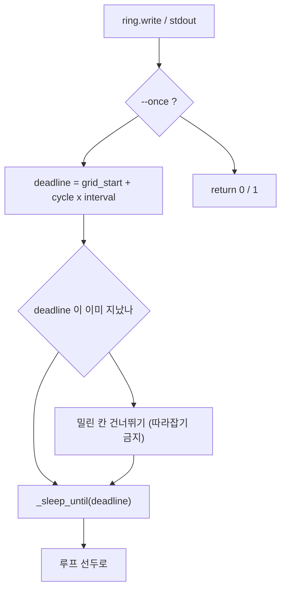

# system_health 패키지 — 코드 리뷰 (날짜=버전)

## 2026-08-09 (KST) — delta: 2026-08-07 권고 반영 후 인벤토리 재도출

### 코드 버전

패키지는 여전히 현재 브랜치에서 git 미추적이다(`git ls-files src/Safety/system_health | wc -l` → 0).
비-git 규칙대로 파일 해시로 고정한다.

| 파일 | md5(앞 8) | 줄수 | 변경 |
| --- | --- | --- | --- |
| `system_health/sysfs.py` | `f82718ae` | 765 | 코어 번호 join · 미사용 상수 삭제 |
| `system_health/sampler.py` | `8f0a7d4c` | 497 | 인자 검증 · 절대 시각 스케줄 · 설정 오류 조기 종료 |
| `system_health/thresholds.py` | `a65d64b0` | 507 | 값 타입·순서 검증 · 지역명 분리 |
| `system_health/report.py` | `4edb8485` | 412 | 0-주기 방어 · 성장률 구간 일치 · 표본 주입/상한 |
| `system_health/webview.py` | `ed5a2006` | 373 | 이스케이프 · 등급표 주입 · `/api/report` 상한 |
| `system_health/ringlog.py` | `e6ecc711` | 169 | 총량 1회 계산 |
| `system_health/cliargs.py` | `59b7d428` | 50 | **신규** — 인자 범위 검증 공용 |
| `setup.py` | `308c68fb` | 28 | 유닛 glob |
| `install_service.sh` | `088f12a5` | 116 | 저장소 경로 유도 · 템플릿 치환 |
| `systemd/amr-health-sampler.service` | `97410466` | 49 | 자리표시자 템플릿 |
| `systemd/amr-health-webview.service` | `600c3656` | 51 | 자리표시자 템플릿 |

- 패키지 전체(리뷰 산출물 제외) sha256: `86477744cb5bc2fe4d0985134be7e7c5a46cdf0ca6c36f1fda0a783b7443225b`
- 직전 리뷰: [2026-08-07](2026-08-07.md) — 그 문서의 `파일:줄` 앵커는 **이 변경 이전 기준**이다.
  현행 앵커의 권위는 본 문서 §3 함수표다.
- 사전승인: `docs/adr/2026-08-09-system-health-review-followup.md` (Status: Proposed)
- 테스트: `python3 -m pytest test -q` → **220 passed in 11.31s** (직전 183 → 회귀 37건 추가)

### 분석 분기 명시

- 분기: 전체 구조 분석 — **delta**(2026-08-07 권고 반영분 + 인벤토리 재도출)
- 감지된 도메인: ros2-review · concurrency (직전과 같음. `cliargs` 도 `rclpy` 무의존)

---

## Core 인벤토리 (delta)

### 1. 목적

변경 없음 — 관측 전용 자원·SW 건강 감시([2026-08-07 §1](2026-08-07.md) 참조).
모듈 하나가 늘었다: `cliargs.py` 는 세 진입점이 공유하는 **CLI 인자 범위 검증**만 담는다.
검증 함수를 모듈마다 복사하면 `checks/dup-signature.sh` 에 걸리고, 무엇보다 한쪽만 고치는 순간
"주기는 0 보다 커야 한다"는 규칙이 갈린다.

### 2. 코드 플로우차트

sampler 루프의 대기 계산만 바뀌었다(나머지 흐름은 [2026-08-07 §2](2026-08-07.md) 그대로).

동반 흐름도: `2026-08-09-flow-schedule.drawio` (박스 8 · 화살표 8).

### 3. 함수 리스트 (전수 재도출 — 현행 앵커의 권위본)

위치는 소스에서 기계로 재도출했다(정의 줄). 108행 전수를 소스와 대조해 일치 108 / 불일치 0 을 확인했다.

| # | 함수 | 입력 | 출력 | 기능 | 위치 |
| --- | --- | --- | --- | --- | --- |
| 1 | `_read_text` | `path` | `str \| None` | 파일 읽어 strip, 실패 시 None | sysfs.py:68 |
| 2 | `_read_int` | `path` | `int \| None` | 파일을 정수로, 실패 시 None | sysfs.py:76 |
| 3 | `_unique_key` | `key, seen` | `str` | 동일 type 노드 키 충돌 회피(`X#1`) | sysfs.py:87 |
| 4 | `read_temperatures_c` | 없음 | `dict[str,float]` | thermal zone 온도(°C) 전수 | sysfs.py:100 |
| 5 | `read_cooling_states` | 없음 | `dict[str,int]` | 냉각장치 `cur_state`(개입 여부) | sysfs.py:118 |
| 6 | `FanInfo` (frozen dataclass) | `pwm, rpm` | 인스턴스 | 팬 상태 값객체 | sysfs.py:142 |
| 7 | `read_fan` | 없음 | `FanInfo` | 팬 PWM/RPM(읽기 전용). Tegra `pwm-fan` → 범용 hwmon `fan1_input`/`pwm1` 순 탐색 | sysfs.py:156 |
| 8 | `CpuTimes` (frozen dataclass) | `idle, total` | 인스턴스 | `/proc/stat` 누적 시간 | sysfs.py:184 |
| 9 | `CpuSnapshot` (frozen dataclass) | `total, per_core` | 인스턴스 | 한 시점 CPU 누적 시간 | sysfs.py:192 |
| 10 | `CpuUsage` (frozen dataclass) | `total_pct, per_core_pct` | 인스턴스 | 구간 CPU 사용률 | sysfs.py:209 |
| 11 | `_parse_cpu_line` | `fields` | `CpuTimes \| None` | cpu 행 파싱(idle=idle+iowait) | sysfs.py:216 |
| 12 | `read_cpu_times` | 없음 | `CpuSnapshot \| None` | 전체·코어별 누적 시간 수집 | sysfs.py:233 |
| 13 | `_usage_pct` | `prev, cur` | `float` | 두 누적 시간의 구간 사용률 | sysfs.py:265 |
| 14 | `cpu_usage_pct` | `prev, cur` | `CpuUsage` | 스냅샷 2장 차분 → 사용률 | sysfs.py:274 |
| 15 | `read_cpu_freqs_khz` | 없음 | `tuple[int,...]` | 코어별 현재 주파수(kHz) | sysfs.py:307 |
| 16 | `MemoryInfo` (frozen dataclass) | 5 필드 | 인스턴스 | 메모리·스왑 사용량(MB) | sysfs.py:332 |
| 17 | `read_memory` | 없음 | `MemoryInfo \| None` | `/proc/meminfo` 파싱 | sysfs.py:346 |
| 18 | `DiskInfo` (frozen dataclass) | `path,total,free,used_pct` | 인스턴스 | 파일시스템 사용량(GB) | sysfs.py:385 |
| 19 | `read_disk` | `path` | `DiskInfo` | statvfs(`f_bavail` 기준). **예외 전파** | sysfs.py:394 |
| 20 | `ProcessInfo` (frozen dataclass) | `pid,name,rss_mb` | 인스턴스 | 프로세스 1건 | sysfs.py:424 |
| 21 | `ProcessScan` (frozen dataclass) | `count,top_rss,names,pids_by_name` | 인스턴스 | `/proc` 순회 결과 | sysfs.py:433 |
| 22 | `_read_process` | `pid` | `ProcessInfo \| None` | `/proc/<pid>/stat` 1건(rpartition) | sysfs.py:453 |
| 23 | `scan_processes` | `top_n=5` | `ProcessScan` | `/proc` 전수 순회 | sysfs.py:473 |
| 24 | `GpuInfo` (frozen dataclass) | `load_pct,freq_hz,max_freq_hz` | 인스턴스 | GR3D 상태 | sysfs.py:508 |
| 25 | `read_gpu` | 없음 | `GpuInfo` | GPU 사용률(천분율÷10)·주파수. Tegra devfreq → i915 `gt_*_freq_mhz`(MHz→Hz) 순 탐색 | sysfs.py:527 |
| 26 | `PowerRail` (frozen dataclass) | `name,voltage_mv,current_ma` | 인스턴스 | 전원 레일 1개 | sysfs.py:562 |
| 27 | `PowerRail.power_mw` (property) | self | `float` | mV×mA÷1000 = mW 계산값 | sysfs.py:577 |
| 28 | `read_power_rails` | 없음 | `tuple[PowerRail,...]` | INA3221 라벨 있는 채널만 | sysfs.py:582 |
| 29 | `SwapCounters` (frozen dataclass) | `pswpin,pswpout` | 인스턴스 | 누적 스왑 페이지 | sysfs.py:617 |
| 30 | `read_swap_counters` | 없음 | `SwapCounters \| None` | `/proc/vmstat` 파싱 | sysfs.py:630 |
| 31 | `swap_rate_pages_s` | `prev,cur,elapsed_s` | `(float,float)` | 스왑 in/out 속도(되감기 시 0) | sysfs.py:648 |
| 32 | `CanInterface` (frozen dataclass) | 8 필드 | 인스턴스 | socketcan 상태·누적 카운터 | sysfs.py:670 |
| 33 | `CanInterface.total_errors` (property) | self | `int` | rx+tx 에러·드랍 합 | sysfs.py:695 |
| 34 | `read_can_interfaces` | 없음 | `tuple[CanInterface,...]` | `type==ARPHRD_CAN` 으로 판별 | sysfs.py:700 |
| 34a | `read_can_interfaces.counter` (이너) | `field` | `int` | statistics 필드 읽기(None→0) | sysfs.py:717 |
| 35 | `can_error_rate` | `prev,cur,elapsed_s` | `float` | 에러 증가율(건/초) | sysfs.py:735 |
| 36 | `count_dds_segments` | 없음 | `int` | `/dev/shm` DDS 세그먼트 수(판정 없음) | sysfs.py:752 |
| 37 | `read_load_average` | 없음 | `tuple \| None` | 1·5·15분 부하 평균 | sysfs.py:770 |
| 38 | `read_uptime_s` | 없음 | `float \| None` | 부팅 후 경과 시간 | sysfs.py:778 |
| 39 | `RingLogWriteError` (예외) | — | — | 기록 실패 신호(삼키지 않기 위함) | ringlog.py:23 |
| 40 | `RingLog` (클래스) | — | — | 일자 회전 + 총량·보존 상한 기록기 | ringlog.py:27 |
| 41 | `RingLog.__init__` | `out_dir, prefix, max_total_mb, max_age_days, enforce_every, clock` | None | 상한·시계 주입 | ringlog.py:33 |
| 42 | `RingLog.directory` (property) | self | `Path` | 로그 디렉토리 | ringlog.py:63 |
| 43 | `RingLog._day_string` | self | `str` | 로컬 일자 `YYYY-MM-DD` | ringlog.py:67 |
| 44 | `RingLog.path_for_day` | `day` | `Path` | 일자별 파일 경로 | ringlog.py:71 |
| 45 | `RingLog.existing_files` | self | `list[Path]` | 접두 일치 파일 오름차순 | ringlog.py:75 |
| 46 | `RingLog.write` | `record` | `Path` | JSONL 1줄 append + 주기적 상한 강제 | ringlog.py:81 |
| 47 | `RingLog.enforce_limits` | self | `list[Path]` | 보존기간·총량 초과분 삭제(최신 파일 보존) | ringlog.py:109 |
| 48 | `RingLog._total_size` | self | `float` | 접두 파일 총 바이트 | ringlog.py:152 |
| 49 | `RingLog._unlink` (staticmethod) | `path` | `bool` | 삭제 시도, 실패는 False | ringlog.py:163 |
| 50 | `Level` (IntEnum) | — | — | OK/WARN/ERROR 심각도 | thresholds.py:29 |
| 51 | `Finding` (frozen dataclass) | `key,level,value,message` | 인스턴스 | 판정 결과 1건 | thresholds.py:38 |
| 52 | `Thresholds` (frozen dataclass) | 18 필드 | 인스턴스 | 경보 임계값 묶음 | thresholds.py:55 |
| 53 | `Thresholds.__post_init__` | self | None | JSON list → tuple 정규화 | thresholds.py:102 |
| 54 | `Thresholds.from_mapping` (classmethod) | `overrides` | `Thresholds` | 기본값+덮어쓰기, 미지·폐기 키 거부 | thresholds.py:131 |
| 55 | `Thresholds.to_mapping` | self | `dict` | 직렬화(from_mapping 역함수) | thresholds.py:168 |
| 56 | `_grade` | `value,warn_at,error_at,higher_is_worse` | `Level` | 단일 값 등급화 | thresholds.py:252 |
| 57 | `_hottest` | `temps` | `(str,float) \| None` | 최고 온도 존 | thresholds.py:282 |
| 58 | `evaluate` | `record, th` | `tuple[Finding,...]` | record 전 항목 판정(WARN/ERROR 만) | thresholds.py:290 |
| 58a | `_coerce` | `key, annotation, value` | 필드 타입에 맞는 값 | 설정 값 타입 변환·거부(신규) | thresholds.py:191 |
| 59 | `worst_level` | `findings` | `Level` | 최고 심각도(빈 입력 OK) | thresholds.py:505 |
| 60 | `_on_stop_signal` | `signum, frame` | None | SIGTERM/SIGINT → 정지 플래그 | sampler.py:55 |
| 61 | `is_stop_requested` | 없음 | `bool` | 정지 플래그 조회(테스트 노출) | sampler.py:65 |
| 62 | `reset_stop_flag` | 없음 | None | 정지 플래그 해제(테스트 격리) | sampler.py:70 |
| 63 | `SampleState` (frozen dataclass) | `stamp,cpu,swap,can,pids` | 인스턴스 | 차분·비교용 직전 표본 묶음 | sampler.py:77 |
| 64 | `collect` | `prev, disk_paths, proc_scan, top_rss, fan_daemon_name, expected_processes, now` | `(record, SampleState)` | 한 시점 자원 record 생성 | sampler.py:93 |
| 65 | `_format_findings` | `findings` | `str` | 경보를 사람이 읽을 줄로 | sampler.py:245 |
| 66 | `_sleep_until` | `deadline` | None | 0.2s 청크 분할 대기(정지 반응) | sampler.py:250 |
| 67 | `_load_threshold_overrides` | `path` | `dict` | 임계 JSON 로드(실패 시 SystemExit) | sampler.py:259 |
| 68 | `_write_thresholds` | `path, th` | `int` | 임계값을 주석 포함 JSON 으로 저장 | sampler.py:278 |
| 69 | `_parse_args` | `argv` | `Namespace` | sampler CLI 해석 | sampler.py:313 |
| 70 | `run` | `args` | `int` | 샘플 루프 본체 | sampler.py:367 |
| 71 | `main` | `argv` | `int` | sampler 진입점 | sampler.py:485 |
| 72 | `LogFileInfo` (frozen dataclass) | `path,records,bytes` | 인스턴스 | 로그 파일 요약 | report.py:36 |
| 73 | `list_log_paths` | `log_dir, prefix` | `list[Path]` | 경로만 날짜순(내용 미독) | report.py:44 |
| 74 | `log_span` | `log_dir, prefix` | `dict` | 파일 수·총 바이트·첫 표본 시각 | report.py:56 |
| 75 | `load_files` | `log_dir, prefix` | `list[LogFileInfo]` | 파일별 표본 수·크기(완독) | report.py:81 |
| 76 | `load_records` | `log_dir, prefix` | `list[dict]` | 전 표본 시간순 로드(완독) | report.py:109 |
| 77 | `tail_records` | `log_dir, n, prefix` | `list[dict]` | 최근 n 개만 역방향 블록 읽기 | report.py:135 |
| 78 | `sample_gaps` | `records` | `list[float]` | 연속 표본 간격 | report.py:183 |
| 79 | `gap_stats` | `gaps, interval_s` | `dict` | 간격 통계·결손 추정 | report.py:189 |
| 80 | `level_counts` | `records` | `dict[str,int]` | 등급별 표본 수 | report.py:222 |
| 81 | `finding_counts` | `records` | `dict[str,dict]` | 경보 키·등급별 횟수 | report.py:231 |
| 82 | `_series` | `records, pick` | `list[float]` | 수열 추출(예외·None 제거) | report.py:242 |
| 83 | `resource_ranges` | `records` | `dict[str,dict]` | 항목별 최소·최대·마지막 | report.py:255 |
| 84 | `filter_since` | `records, since` | `list[dict]` | ISO 시각 이후만 | report.py:276 |
| 85 | `format_report` | `log_dir, interval_s, prefix, since` | `str` | 사람이 읽는 6절 보고문 | report.py:294 |
| 86 | `_parse_args` | `argv` | `Namespace` | report CLI 해석 | report.py:383 |
| 87 | `main` | `argv` | `int` | report 진입점 | report.py:397 |
| 88 | `latest_payload` | `records, span` | `dict` | 최신 표본 + 구간 요약 | webview.py:46 |
| 89 | `history_payload` | `records, n` | `dict` | 차트용 7계열 시계열 | webview.py:63 |
| 90 | `_Handler` (클래스) | — | — | 읽기 전용 GET 핸들러 | webview.py:268 |
| 91 | `_Handler.log_message` | `fmt, *args` | None | 접속 로그 억제(I/O 최소화) | webview.py:276 |
| 92 | `_Handler._send` | `code, body, ctype` | None | 응답 송신(HEAD 시 본문 생략) | webview.py:279 |
| 93 | `_Handler._json` | `payload` | None | JSON 응답 | webview.py:288 |
| 94 | `_Handler.do_GET` | 없음 | None | 5개 경로 라우팅(= `do_HEAD`) | webview.py:292 |
| 95 | `make_server` | `log_dir, bind, port, prefix, interval_s` | `ThreadingHTTPServer` | 핸들러 서브클래스 주입 후 서버 생성 | webview.py:321 |
| 96 | `_parse_args` | `argv` | `Namespace` | webview CLI 해석 | webview.py:339 |
| 97 | `main` | `argv` | `int` | webview 진입점(외부 바인드 경고) | webview.py:353 |
| 98 | `$` (브라우저 JS) | `s` | Element | querySelector 축약 | webview.py:160 |
| 99 | `fmt` (브라우저 JS) | `v, d` | `string` | 소수 자리 포맷(null→em dash) | webview.py:162 |
| 99a | `esc` (브라우저 JS) | `s` | `string` | HTML 특수문자 이스케이프(신규) | webview.py:166 |
| 100 | `line` (브라우저 JS) | `sel,t,vals,unit,dec` | None | SVG 단일 계열 라인차트 렌더 | webview.py:169 |
| 100a | `line.move` (이너 JS) | `e` | None | 포인터 최근접 표본 툴팁 | webview.py:190 |
| 101 | `tile` (브라우저 JS) | `k,v,u` | `string` | 통계 타일 HTML 생성 | webview.py:203 |
| 102 | `tick` (브라우저 JS) | 없음 | Promise | 5초 주기 갱신 루프 본체 | webview.py:206 |
| 103 | `positive_float` | `text` | `float` | 0 초과 실수만 받는 argparse 타입(신규) | cliargs.py:16 |
| 104 | `non_negative_int` | `text` | `int` | 0 이상 정수만 받는 argparse 타입(신규) | cliargs.py:37 |

#### 3-1. 설치 스크립트 함수 (`install_service.sh`)

원 리뷰의 함수표는 Python 모듈만 담았다. 설치 스크립트의 셸 함수도 **함수**이므로 여기서 메운다
(SOP 룰 6 "모든 함수 전수").

| # | 함수 | 입력 | 출력 | 기능 | 위치 |
| --- | --- | --- | --- | --- | --- |
| S1 | `units_for_target` | `$1` = sampler\|webview\|both | 유닛 파일명 문자열 | 대상→유닛 목록 해석, 미지 값은 exit 1 | install_service.sh:42 |
| S2 | `render_unit` | `$1` = 템플릿 경로 | 치환된 유닛 본문(stdout) | `@REPO@`·`@USER@`·`@GROUP@`·`@PORT@` 를 이 장비 값으로 치환 | install_service.sh:53 |
| S3 | `warn_if_port_taken` | 없음(전역 `HEALTH_PORT`) | 경고 출력(stderr) | 대시보드 포트가 이미 LISTEN 이면 점유자 확인·변경 방법 안내. **차단하지 않는다**(재설치도 정상 경로) | install_service.sh:60 |
| S4 | `install_unit` | `$1` = 유닛 파일명 | 없음(설치 부작용) | `render_unit` 결과를 `/etc/systemd/system/` 에 0644 로 설치 | install_service.sh:68 |

**스크립트 전역**

| # | 사용처(함수) | 기능 | 위치 |
| --- | --- | --- | --- |
| S-G1 | 전역 | `HERE` — 스크립트 자신의 위치. `REPO` 유도의 기준 | install_service.sh:19 |
| S-G2 | `render_unit`(S2)·`install_unit`(S4) | `REPO` — `HERE/../../..` 에서 유도. 하드코딩하지 않는다 | install_service.sh:22 |
| S-G3 | `--apply` | `LOG_DIR` · `CONFIG` — 로그·임계값 경로 | install_service.sh:23-24 |
| S-G4 | `render_unit`(S2) | `RUN_USER` · `RUN_GROUP` — `id -un`/`id -gn` 실측값 | install_service.sh:26-27 |
| S-G5 | `warn_if_port_taken`(S3) | **`SERVICE_ENV` (신규)** — 장비별 서비스 설정 파일. 있으면 `source` 한다 | install_service.sh:30 |
| S-G6 | `render_unit`(S2)·`warn_if_port_taken`(S3) | **`HEALTH_PORT` (신규, 기본 8770)** — 대시보드 포트. `service.env` 로 장비별 지정 | install_service.sh:34 |
| S-G7 | `units_for_target`(S1) | `SAMPLER_UNIT` · `WEBVIEW_UNIT` — 유닛 파일명 | install_service.sh:36-37 |
| S-G8 | 진입 분기 | `MODE` · `TARGET` — 명령행 인자 | install_service.sh:39-40 |

**중복/유사 함수**: 직전 리뷰가 확인한 `_parse_args`·`main` 3중복은 `.dup-allow` 에 근거가
등재된 의도된 중복으로 그대로다. 이번에 새로 생긴 `positive_float`·`non_negative_int`(#103·#104)는
**중복을 만들지 않기 위해** 공용 모듈에 한 번만 정의했다.

### 4. 전역 변수 / 모듈 상수 (delta)

| # | 사용처(함수) | 기능 | 위치 |
| --- | --- | --- | --- |
| G40 | `Thresholds.__post_init__`(#53) | **`THRESHOLD_PAIRS` (상수, 신규)** — (WARN 키, ERROR 키, 방향) 8쌍. 순서 검증과 판정이 같은 근원을 본다 | thresholds.py:179 |
| G41 | `_Handler.do_GET`(#94) | **`REPORT_MAX_SAMPLES` (상수, 신규)** — `/api/report` 표본 상한 5000 | webview.py:35 |
| G37′ | `_Handler.do_GET`(#94) | `LEVEL_VIEW` — **사용처 0건이었으나 이제 페이지에 주입**되어 등급 표현의 단일 근원이 됐다 | webview.py:39 |
| G20·G21 | — | `_PROC_STAT_UTIME`·`_PROC_STAT_STIME` **삭제**(사용처 0건이었다) | (없음) |
| G42 | `read_gpu`(#25) | **`_DRM_ROOT` (상수 경로, 신규)** — `/sys/class/drm`. 범용 PC(Personal Computer)의 통합 GPU 주파수 노드 위치 | sysfs.py:40 |
| G43 | `read_gpu`(#25) | **`_HZ_PER_MHZ` (상수, 신규)** — i915 는 MHz, Tegra devfreq 는 Hz 라 단위를 맞춘다 | sysfs.py:41 |
| G11′ | `read_power_rails`(#28) · **`read_fan`(#7) 신규 사용** | `_HWMON_ROOT` — 범용 hwmon 탐색에 재사용 | sysfs.py:45 |

나머지 G1~G39 는 직전 리뷰 표와 같다(값·소유권 변경 없음). 가변 전역은 여전히
`_stop_requested`(G1) 하나뿐이며 단일 writer 규율도 그대로다.

### 5. 의존성 3-tier (delta)

| Tier | 대상 | 버전/제약 | 부재 시 동작(필수/선택) | 근거(file:line) |
| --- | --- | --- | --- | --- |
| 빌드 | 변경 없음 | — | 직전 리뷰와 같음 | package.xml:13-16 |
| 런타임 필수 | `system_health.cliargs` (패키지 내부) | 신규 모듈 | 없으면 세 진입점 모두 import 실패 — 같은 패키지라 배포 단위가 동일하다 | sampler.py:29, report.py:27 |
| 런타임 선택 | 변경 없음 | — | 직전 리뷰와 같음 | — |

외부 의존은 **늘지 않았다**(`package.xml` 무변경, 표준 라이브러리만).

---

## 도메인 (delta)

### ros2-review

A-1~A-7 모두 직전과 같이 해당 없음 — `grep -rnE '^\s*(import rclpy|from rclpy)' system_health/*.py` → 0건.
신규 `cliargs.py` 도 같은 검사를 받는다(`test/test_no_rclpy_import.py` 의 모듈 목록은 Phase 1 모듈
기준이며, `cliargs` 는 `argparse` 만 import 한다).

**A-4. Parameters** — 임계값 JSON 의 계약이 바뀌었다: 값 타입과 WARN/ERROR 순서가 **로드 시점에
검증**된다. `[param]` 관점의 변화는 §조치 대조표 F1 참조.

### concurrency

**B-1 동기화 객체**: 여전히 없음. **B-2 공유 상태**: `_stop_requested`(비보호·단일 writer),
`_Handler` 클래스 속성(생성 후 읽기 전용), `RingLog` 인스턴스 상태(단일 스레드) — 직전과 같다.
**B-3 실행 컨텍스트**: 변경 없음. 이번 변경은 새 스레드·공유 상태를 만들지 않는다.

---

## 조치 대조표 (2026-08-07 findings)

severity 분포: Critical 0 / High 0 / Medium 0 / Low 0 / Info 0
Verdict: COMMENT

> 본 문서는 **조치 기록 + 인벤토리 재도출**이며 새 findings 를 내지 않는다. 조치가 충분한지에 대한
> 판정은 저자가 찍을 수 없다(review.md 룰 11 · coding.md §5 never-self-approve) — 외부 lane 대기.

| 직전 finding | 상태 | 조치 · 확인 근거 |
| --- | --- | --- |
| High `Thresholds.from_mapping` 값 미검증 | **[해결]** | `_coerce`(#58a) 가 타입 거부, `__post_init__`(#53) 이 순서 거부. 회귀 13건(`test_thresholds.py` 파라미터화). `--thresholds` 오류 파일로 `sampler.main` → `SystemExit("임계값 설정을 받아들일 수 없다…")` |
| Medium `--interval` 0·음수 | **[해결]** | `positive_float`(#103)·`non_negative_int`(#104). 실측: `--interval 0` → `error: 0 보다 커야 한다`, exit 2 |
| Medium `gap_stats` ZeroDivisionError | **[해결]** | `gap_stats`(#79) 가 `interval_s <= 0` 에서 간격 통계만 내고 결손 판정을 건너뛴다. `format_report`(#85) 는 하루 추정을 생략 |
| Medium `--since` 성장률 과대 | **[해결]** | 분모를 전 구간 표본 수로 통일 + "전 구간 기준" 라벨. 회귀: `test_growth_rate_is_not_inflated_by_since` |
| Medium report CLI 2회 완독 | **[해결]** | `main`(#87) 이 1회 읽어 `format_report(records=…)` 로 주입. 회귀가 `load_records` 호출 횟수를 센다 |
| Medium 절대경로 하드코딩 | **[해결]** | `REPO` 를 `HERE/../../..` 로 유도, 유닛은 `@REPO@`·`@USER@`·`@GROUP@` 템플릿. 실측: 이 PC dry-run 이 `/home/amap/…` 을 가리키고 `systemd-analyze verify` exit 0 |
| Low `/api/report` 전 로그 완독 | **[해결]** | `REPORT_MAX_SAMPLES`(G41) 상한 + 상한 적용 시 보고문에 명시 |
| Low innerHTML 무이스케이프 | **[해결]** | `esc`(#99a) 도입, `f.key`·`f.message`·레일·존 이름에 적용 |
| Low 코어 인덱스 정렬 가정 | **[해결]** | `CpuSnapshot.core_ids` 로 번호 join(#14). ⚠ 전제(offline 코어 행 소실)는 여전히 미실측이나, 번호 join 은 전제가 거짓이어도 결과가 같다 |
| Low 미사용 상수 3건 | **[해결]** | 2개 삭제, `LEVEL_VIEW` 는 페이지 주입으로 단일 근원화 |
| Low `setup.py` webview 유닛 누락 | **[해결]** | `glob("systemd/*.service")` |
| Low `evaluate` 지역명 재사용 | **[해결]** | `swap_rate` · `can_rate` 로 분리 |
| Low 주기 드리프트 | **[해결]** | 절대 시각 스케줄. 실측: 목표 1.000 s 에서 평균 1.0073 s → **1.0000 s** |
| Low `enforce_limits` 반복 stat | **[해결]** | 총량 1회 계산 + 삭제분 차감. 회귀 1건 추가 |
| Low 회귀 테스트 부재 | **[해결]** | 183 → **220** (신규 37건) |
| Info 3건 | [잔존] | 확인 항목이라 조치 대상이 아니다 |

## 플랫폼 적응 변경의 유래 (2026-08-10)

`read_fan`(#7)·`read_gpu`(#25)의 플랫폼 적응 탐색과 유닛의 `@PORT@` 자리표시자는 **LGIT MOMA 이식
과정에서 나왔고 x86_64 실기에서 검증된 뒤 상류로 되돌린 것**이다. Tegra 경로를 먼저 보므로 본 장비
(Jetson)의 동작은 바뀌지 않는다. 이식본 검증 근거는 LGIT 저장소의 같은 파일 §이식 검증 절에 있다.
본 저장소에서는 회귀 220 passed 로만 확인했다 — **Jetson 실기 재검증은 하지 않았다.**

## 잔여 · 후속

1. **외부 lane 검증 대기** — 본 조치의 적정성 판정은 저자가 못 찍는다.
2. ADR `2026-08-09-system-health-review-followup.md` 는 `Status: Proposed` — 외부 검증 후 Accepted 로 올린다.
3. **유닛 템플릿화의 운영 영향**: 이미 설치된 장비에서는 재설치(`--apply`)를 해야 새 유닛이 반영된다.
   소스의 `.service` 를 직접 `systemctl` 에 넣으면 자리표시자 때문에 기동하지 않는다(파일 상단 주석에 명시).
4. `test_no_rclpy_import.py` 의 검사 모듈 목록에 `cliargs` 추가를 검토할 것 — 지금은 Phase 1 모듈만 열거한다.

---
