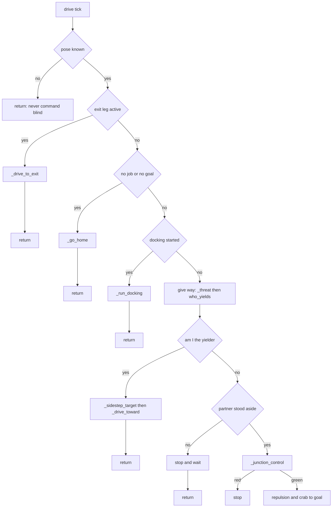
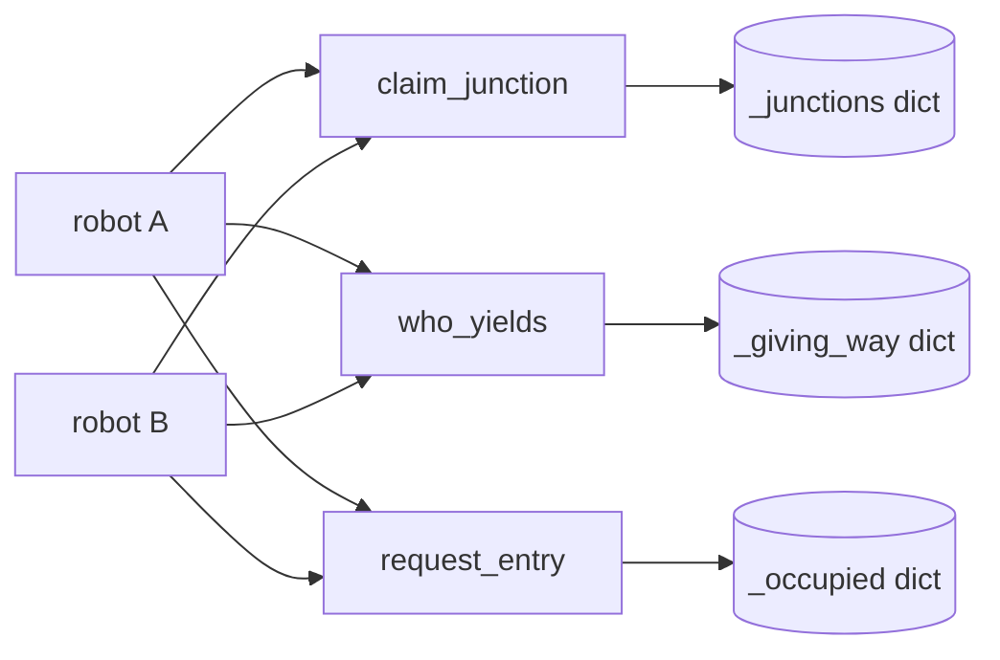

## 2026-08-10 (KST) — traffic-layer review

> Prose is English per the repository house rule. The Korean structural tokens
> (table headers, `severity 분포`, `Verdict`, `감지된 도메인`, `함수 #N`, `[논리]`
> …) are kept verbatim because they are the identifiers the SOP self-check greps
> match — they are machine anchors, not prose.

### 코드 버전

The working tree is dirty, so a commit hash alone does not identify what was
reviewed. Both are recorded.

- Base commit: `f543422` (branch `main`)
- Reviewed content (uncommitted changes on top of `f543422`), sha256[:16]:
  - `src/MES/csm/csm/adapters/sim_acs.py` — `7742b8ad4849dd1f` (1826 lines)
  - `src/MES/csm/csm/adapters/roads.py` — `39755038e43f0885` (239 lines)
  - `src/MES/csm/csm/plant.py` — modified (geometry constants only)
- Previous review of this topic: none — this is the first `traffic-layer` review.
- Related same-day record: `docs/issues_and_fixes/issues_and_fixes.md`
  (give-way junction deadlock) and
  `docs/verification/2026-08-10-two-robot-one-hour-soak.md`.

**Two SOP prerequisites are absent and were not silently skipped:**

1. `docs/claude_guideline/code_review/domains/` does not exist
   (`ls` → no such directory), so no domain add-on could be applied. ROS2 and
   concurrency add-ons would both trigger on this code if installed.
2. `docs/claude_guideline/code_review/checks/drawio_validate.py` does not exist
   (`ls checks/` → only `review-claim-lint.py`). The accompanying `.drawio` was
   therefore validated with an inline equivalent check (XML well-formed;
   every edge `source`/`target` resolves to a real vertex id; mermaid ↔ drawio
   node/edge parity). Result recorded at the end of this file.

### 분석 분기 명시

- 분기: 전체 구조 분석 (multi-file module: the traffic layer)
- 감지된 도메인: 없음 (`domains/` not installed — see prerequisite 1 above)

**Scope.** The traffic layer is the set of rules that decide *whether a robot may
move right now*, as distinct from where it is going (routing) or what it is
carrying (job lifecycle). Concretely: collision avoidance, junction reservation,
the give-way handshake, the bay entry interlock, stall detection, and the road
network they run on.

- `src/MES/csm/csm/adapters/sim_acs.py` — in scope: 함수 #1–#41
- `src/MES/csm/csm/adapters/roads.py` — in scope: 함수 #42–#55
- `src/MES/csm/csm/plant.py` — geometry constants only (전역 #G14–#G22)
- Out of scope, listed at the end of 함수 리스트 for 누락 0: docking controller,
  job lifecycle, ROS plumbing.

---

### Core 인벤토리

#### 1. 목적

The traffic layer arbitrates a shared floor between robots that each plan their
own route. Routing (`roads.py`) answers *which way*; this layer answers *may I
move now*. It is layered deliberately, and the layering is stated in the source:

- **Layer 1 — avoidance** (함수 #11 `_threat`, sim_acs.py:1311). Purely
  geometric: sample both bodies forward at measured velocity and stop if the
  capsule gap would close below `STOP_GAP`. It can only ever say *stop*.
- **Layer 2 — junctions** (함수 #6 `_junction_control`, #25 `claim_junction`).
  A junction is a resource held by one robot at a time, because "layer 1 only
  ever says stop: it cannot say who goes, so two robots that both stop at a
  junction stay stopped" (sim_acs.py:145-149).
- **Layer 3 — give way** (함수 #28 `who_yields`, #10 `_sidestep_target`). For a
  head-on meeting on a single-file aisle, one robot leaves the road entirely.
  "THE AISLES ARE SINGLE FILE, SO SOMEBODY HAS TO LEAVE THE ROAD"
  (sim_acs.py:103).
- **Layer 4 — bay interlock** (함수 #32 `request_entry`). One robot inside a
  station bay at a time, mirroring the real PLC handshake bit.

The design intent is that each layer resolves what the one below it cannot. The
evaluation below finds that the layers are individually sound but compose badly:
every defect found is at a seam between two layers, not inside one.

#### 2. 코드 플로우차트

`SimRobot.drive()` (함수 #1) is a priority dispatcher. Every branch **returns**,
so a robot in an earlier mode never reaches later rules — this single fact is the
origin of three of the four High findings.

Accompanying diagram: `2026-08-10-flow.drawio` (same folder, both copies).

**Fleet-side arbitration** (`SimAcs`, shared mutable state):

#### 3. 함수 리스트

| # | 함수 | 입력 | 출력 | 기능 | 위치 |
| --- | --- | --- | --- | --- | --- |
| 1 | `SimRobot.drive` | – | – | Priority dispatcher; one tick of motion | sim_acs.py:857 |
| 2 | `SimRobot._go_home` | – | – | Drive an idle robot to its parking bay | sim_acs.py:636 |
| 3 | `SimRobot._drive_toward` | goal,x,y,yaw | – | Straight crab to a point | sim_acs.py:699 |
| 4 | `SimRobot._junction_ahead` | x,y,ex,ey | node/None | Nearest junction ahead within claim range | sim_acs.py:717 |
| 5 | `SimRobot._road_clear` | node | bool | Nothing MOVING toward that junction | sim_acs.py:740 |
| 6 | `SimRobot._junction_control` | x,y,ex,ey | bool hold | Red light; claim/release | sim_acs.py:761 |
| 7 | `SimRobot._robot_ahead` | x,y,ex,ey | robot/None | Corridor test ahead | sim_acs.py:1236 |
| 8 | `SimRobot._travel_dir` | – | unit/None | Direction of travel (goal vector) | sim_acs.py:1272 |
| 9 | `SimRobot._head_on_with` | other | bool | Approaching vs following | sim_acs.py:1284 |
| 10 | `SimRobot._sidestep_target` | – | (x,y) | Where to stand aside | sim_acs.py:1296 |
| 11 | `SimRobot._threat` | – | robot/None | LAYER 1 predictive capsule stop | sim_acs.py:1311 |
| 12 | `SimRobot._repulsion` | – | vec,dist | Potential-field push from obstacles | sim_acs.py:423 |
| 13 | `SimRobot._drive_to_exit` | – | – | Reverse out of a bay | sim_acs.py:1165 |
| 14 | `SimRobot._release_exit` | – | – | Release bay, end exit leg | sim_acs.py:1338 |
| 15 | `SimRobot._exit_stalled` | x,y | bool | Stall check for the exit leg | sim_acs.py:1347 |
| 16 | `SimRobot._check_stall` | x,y | bool | Stall check; fails the job | sim_acs.py:1402 |
| 17 | `SimRobot._reset_stall` | – | – | Clear stall reference | sim_acs.py:1398 |
| 18 | `SimRobot._in_a_bay` | – | bool | Geometric "inside a bay" | sim_acs.py:802 |
| 19 | `SimRobot._plan` | station | waypoints | Route via road network | sim_acs.py:812 |
| 20 | `SimRobot._set_route` | station | – | Install a route | sim_acs.py:826 |
| 21 | `SimRobot._final_leg` | – | bool | Last hop (dock fade) | sim_acs.py:842 |
| 22 | `SimRobot._stop` | – | – | Publish zero Twist | sim_acs.py:1474 |
| 23 | `SimRobot._on_model_states` | msg | – | Ground-truth pose/velocity source | sim_acs.py:375 |
| 24 | `SimRobot._now` | – | float | Clock | sim_acs.py:1395 |
| 25 | `SimAcs.claim_junction` | node,robot | bool | Take the red light | sim_acs.py:1670 |
| 26 | `SimAcs.junction_holder` | node | robot/None | Who holds it | sim_acs.py:1710 |
| 27 | `SimAcs.release_junction` | robot | – | Drop all held junctions | sim_acs.py:1713 |
| 28 | `SimAcs.who_yields` | a,b | robot | Pick the yielder, memoised | sim_acs.py:1717 |
| 29 | `SimAcs.partner_of` | robot | robot/None | Other robot in the encounter | sim_acs.py:1771 |
| 30 | `SimAcs.yielding` | robot | bool | Is this robot the yielder | sim_acs.py:1782 |
| 31 | `SimAcs.encounter_over` | robot | – | Forget the encounter | sim_acs.py:1788 |
| 32 | `SimAcs.request_entry` | station,name | bool | Bay interlock grant | sim_acs.py:1795 |
| 33 | `SimAcs.release` | station,name | – | Bay interlock release | sim_acs.py:1813 |
| 34 | `SimAcs.release_all` | job_id | – | Release every bay | sim_acs.py:1819 |
| 35 | `SimAcs.submit_job` | job | result | Segment filter + nearest-robot choice | sim_acs.py:1525 |
| 36 | `SimAcs.drive` | – | – | Step every robot | sim_acs.py:1619 |
| 37 | `SimAcs._log_state` | period | – | Periodic STATE line | sim_acs.py:1625 |
| 38 | `_seg_gap` | a,b | float | Capsule segment-to-segment gap | sim_acs.py:192 |
| 39 | `_to_body` | ex,ey,yaw | (x,y) | World → body frame | sim_acs.py:221 |
| 40 | `_wrap` | a | float | Angle wrap | sim_acs.py:175 |
| 41 | `_parallel_heading` | marker,cur | float | Nearest parallel heading | sim_acs.py:179 |
| 42 | `build` | – | Roads | Construct + validate the network | roads.py:183 |
| 43 | `Roads.__init__` | nodes,lanes,obstacles,dock_owner | – | Hold the network | roads.py:56 |
| 44 | `Roads.required` | obstacle_radius | float | Required clearance | roads.py:66 |
| 45 | `Roads.report` | – | list | Unsafe lane report | roads.py:69 |
| 46 | `Roads.check` | – | – | Raise on unsafe lane | roads.py:88 |
| 47 | `Roads.is_clear` | a,b,ignore | bool | Lane clear of obstacles | roads.py:96 |
| 48 | `Roads.entry_node` | pos | node | Nearest network entry | roads.py:109 |
| 49 | `Roads.route_from` | pos,station | waypoints | Route from a pose | roads.py:136 |
| 50 | `Roads.route_to_node` | pos,node | waypoints | Route to a named node | roads.py:140 |
| 51 | `Roads.route` | from,to | waypoints | Station-to-station route | roads.py:150 |
| 52 | `Roads._route_nodes` | start,goal | nodes | Dijkstra/BFS over nodes | roads.py:153 |
| 53 | `_clearance` | p,a,b | float | Point-to-segment distance | roads.py:40 |
| 54 | `_owner_of` | dock_name | str | Machine owning a dock | roads.py:228 |
| 55 | `_chain` | nodes,names,axis | – | Link nodes along an axis | roads.py:236 |

**Out of scope (listed for 누락 0, not evaluated):** docking controller —
`_begin_docking`:528, `_run_docking`:544, `_publish_wheels`:574,
`_end_docking`:585, `_dock_heading`:595, `_square_up`:607; job lifecycle —
`accept`:492, `busy`:481, `_on_arrival`:1367, `_begin_delivery`:1381,
`_finish`:1436, `get_job_result`:1607, `cancel_job`:1610, `_on_robot_finished`:1663;
ROS plumbing — `__init__`:235, `_on_joints`:410, `_on_front`:417, `_on_rear`:420,
`_tag`:852, `SimAcs.__init__`:1498, `SimAcs._stop`:1659.

#### 4. 전역 변수 / 모듈 상수

| # | 사용처(함수) | 기능 | 위치 |
| --- | --- | --- | --- |
| G1 | #7 | (상수) `ROBOT_STOP_AHEAD` 2.4 m corridor length | sim_acs.py:62 |
| G2 | #7 | (상수) `ROBOT_STOP_SIDE` 1.2 m corridor half-width | sim_acs.py:65 |
| G3 | #38 | (상수) `ROBOT_SEG_HALF` 0.35 m body half-length | sim_acs.py:89 |
| G4 | #38 | (상수) `ROBOT_SEG_RADIUS` 0.45 m body half-width | sim_acs.py:91 |
| G5 | #11 | (상수) `CONTACT_GAP` 0.90 m — bodies touch | sim_acs.py:93 |
| G6 | #11 | (상수) `STOP_GAP` 1.20 m — avoidance target | sim_acs.py:95 |
| G7 | #11 | (상수) `LOOKAHEAD_S` 2.0 s prediction horizon | sim_acs.py:98 |
| G8 | #11 | (상수) `LOOKAHEAD_STEP_S` 0.25 s sample step | sim_acs.py:99 |
| G9 | #10 | (상수) `SIDESTEP` 2.0 m off-aisle offset | sim_acs.py:131 |
| G10 | #1 | (상수) `YIELD_LIMIT` 45 s give-way patience | sim_acs.py:134 |
| G11 | #4,#5,#6 | (가변, built once) `ROADS` — network, built at import | sim_acs.py:139 |
| G12 | #4,#5,#6 | (상수) `JUNCTIONS` — `join_*` + `aisle_*` nodes | sim_acs.py:162 |
| G13 | #4 | (상수) `JUNCTION_CLAIM_RANGE` 3.0 m | sim_acs.py:166 |
| G14 | #5 | (상수) `JUNCTION_WATCH` 6.0 m | sim_acs.py:168 |
| G15 | #5,#6 | (상수) `MOVING_MIN` 0.05 m/s "stopped" threshold | sim_acs.py:172 |
| G16 | #12,#19 | (상수) `STATION_POSES`/`APPROACH_POSES`/`EXIT_POSES` | sim_acs.py:44,45,49 |
| G17 | #42,#47 | (상수) `ROBOT_RADIUS` 0.70, `MACHINE_RADIUS`, `MARGIN` 0.30 | roads.py:31,34,37 |
| G18 | #10 | (상수) `plant.AISLE_N_Y` 3.0 / `AISLE_S_Y` −3.0 | plant.py:102,103 |
| G19 | #10 | (상수) `plant.AISLE_W_X` −20.0 / `AISLE_E_X` 16.0 | plant.py:104,105 |
| G20 | #2 | (상수) `plant.PARKING`, `PARKING_JOIN` | plant.py:356,362 |
| G21 | #18 | (상수) `plant.BAY_RADIUS` | plant.py:236 |
| G22 | #35 | (상수) `plant.ROBOT_SEGMENT` — robot → segment binding | plant.py:338 |

Mutable module-level state: **none** other than `ROADS` (G11), which is built
once at import and then read-only. All per-encounter state lives on `SimAcs`
instances (`_junctions`, `_giving_way`, `_occupied`), which is correct.

#### 5. 의존성 3-tier

| Tier | 대상 | 버전/제약 | 부재 시 동작(필수/선택) | 근거(파일:line) |
| --- | --- | --- | --- | --- |
| 빌드 | `rclpy` | – | 필수 — import fails, node cannot start | package.xml exec_depend |
| 빌드 | `geometry_msgs` | – | 필수 — `Twist` unavailable | package.xml exec_depend |
| 빌드 | `sensor_msgs` | – | 필수 — `LaserScan`/`JointState` | package.xml exec_depend |
| 빌드 | `gazebo_msgs` | – | 필수 — `ModelStates`, the pose source | package.xml depend |
| 빌드 | `nav_msgs` | – | declared; not imported by this layer | package.xml exec_depend |
| 빌드 | **`trnav_msgs`** | **UNDECLARED** | **필수 — `ImportError: No module named 'trnav_msgs'`, whole adapter fails to import (reproduced: running pytest without sourcing `install/setup.bash`)** | import at sim_acs.py:32; package exists at src/Control/Motion_Control/Common/trnav_msgs; **absent from src/MES/csm/package.xml** (`grep -c trnav_msgs package.xml` → 0) |
| 런타임 필수 | `/gazebo/model_states` | Gazebo | 필수 — `pose is None`, 함수 #1 returns every tick, robot never moves | sim_acs.py:304 |
| 런타임 필수 | Road network validity | – | 필수 — 함수 #42 `build()` raises at import if a lane is obstructed | sim_acs.py:136-139 |
| 런타임 선택 | `{ns}/scan_front`, `{ns}/scan_rear` | – | 선택 — 함수 #12 `_repulsion` falls back to station geometry only | sim_acs.py:306-307 |
| 런타임 선택 | `plant.ROBOT_SEGMENT` entry | – | 선택 — a robot with no entry is offered no work (BUSY, not REJECTED) and idles | sim_acs.py:1590 |

---

### 평가

severity 분포: Critical 1 / High 4 / Medium 6 / Low 2 / Info 2
Verdict: REQUEST CHANGES

The single structural cause behind most of this: **`drive()` (함수 #1) is a
chain of early returns, and each traffic rule sits at a different depth.** A
robot in an earlier mode is silently exempt from every later rule. Docking, the
exit leg and homing all return before give-way and junction control.

#### Critical

**함수 #11 `_threat` — [논리] layer 1 is written but not wired up; STOP_GAP is unenforced on the main driving path (Critical)**

   > REVISED 2026-08-10, after grepping every call site. The first version of
   > this finding said the *standoff* bypassed layer 1. That is true but far too
   > narrow, and it implied the main path was protected. It is not.

   재현: `grep -n "_threat()\|_robot_ahead(" sim_acs.py` returns exactly three
   call sites:

   | line | caller | effect |
   | --- | --- | --- |
   | 695 | 함수 #2 `_go_home` | hard stop — the only real use |
   | 1006 | 함수 #1 `drive` | **selection only** — feeds `who_yields`, never stops |
   | 711 | 함수 #3 `_drive_toward` | 함수 #7 `_robot_ahead`, not 함수 #11 |

   So on a normal job leg, after the give-way block and 함수 #6, the robot
   computes repulsion and publishes a velocity with **no hard stop for another
   robot at all**. Line 1006 only stops something when 함수 #9 `_head_on_with`
   is also true, i.e. a head-on meeting routed into the give-way machinery. A
   robot **crossing** the path, or **catching up** from behind, produces no stop.
   What remains is 함수 #12 `_repulsion`, which does see robots (it is lidar
   driven) but is deliberately bounded so that "avoidance steers the robot
   without ever becoming the thing that drives it" (sim_acs.py:434-436) — it
   nudges, it does not stop.

   함수 #11's own docstring states the opposite intent: "head-on, following,
   crossing a junction and meeting at a corner are all the same arithmetic"
   (sim_acs.py:1316-1319). The function implements that. It is simply not
   connected to the path that needs it.

   Consequence, measured: proximity meter, 20 320 samples, 3-robot run —
   `amr2 <-> amr3: centre 1.26 m body 0.90 m [CONTACT]` at
   `amr2(-19.81,-2.70) amr3(-19.35,-3.87)`. `CONTACT_GAP` (G5) is 0.90 m, so the
   capsules touched, against a `STOP_GAP` (G6) of 1.20 m that nothing was
   enforcing. 함수 #10's bad geometry (next finding) is what drove them
   together; the absence of layer 1 is why nothing stopped it.

   권고: make layer 1 a precondition of publishing a velocity, not a branch —
   every path that commands motion (함수 #1 main path, 함수 #3, 함수 #13)
   consults 함수 #11 first. Keep 함수 #7 for the give-way *decision* if useful,
   but it must not be the only guard anywhere.

#### High

**함수 #10 `_sidestep_target` — [논리] picks the wrong aisle where two aisles meet (High)**
   재현: sim_acs.py:1303-1308 tests the north/south aisles by `y` **first** and
   returns on the first match. A robot on the **west cross aisle** at
   (−19.36, −4.07) satisfies `abs(y − AISLE_S_Y) = 1.07 < 1.5`, so it is treated
   as being on the south aisle and told to stand aside at (−19.36, −1.0) — 3 m
   **north, straight along the cross aisle it is actually driving on**, and
   through the robot it is yielding to at y = −2.70. Logged verbatim:
   `[amr3] stepping aside to (-19.4,-1.0)`, repeated 8 times.
   권고: choose the aisle by direction of travel (함수 #8 `_travel_dir`), not by
   proximity in one axis; the standoff must be perpendicular to actual motion.

**함수 #10 `_sidestep_target` — [논리] standoff ignores where the passer is (High)**
   재현: same lines; the function takes no argument and never consults the
   partner (함수 #29). Nothing prevents it returning a point on the far side of
   the robot being yielded to, which is what happened above.
   권고: pass the partner in; reject a candidate whose path passes within
   `STOP_GAP` of it and take the opposite sign.

**함수 #1·#2 `drive`/`_go_home` — [논리] an idle robot can be named yielder but cannot act (High)**
   재현: sim_acs.py:857-859 returns into 함수 #2 before the give-way block. The
   fleet still selects it (함수 #28) because selection is name-order only, so
   the passer waits on `partner._stood_aside` for ever. Measured: `amr3 gives
   way to amr2` at t=335127 with no `stepping aside` following it; both robots
   stopped 2.2 m apart; amr2's job died at the 600 s timeout. Attempting to fix
   this by letting idle robots step aside was **reverted the same day** because
   it activated the two 함수 #10 defects above and produced the Critical
   contact — the geometry must be fixed first.
   권고: fix 함수 #10, then give 함수 #2 the same handshake; a parked robot in a
   bay should report clear immediately rather than manoeuvre.

**함수 #9 `_head_on_with` — [논리] unknown direction is treated as head-on, so idle robots always qualify (High)**
   재현: sim_acs.py:1291-1293 returns `True` when either `_travel_dir()` is
   `None`. 함수 #8 returns `None` whenever `_goal is None`, which is exactly the
   idle state. So every encounter involving an idle robot is classified head-on
   and enters the give-way path — the one path an idle robot cannot execute
   (previous finding). The "safe reading" comment is defensible for layer 1 but
   is the wrong default for selecting a yielder.
   권고: an idle robot should be excluded from give-way selection and simply be
   moved out of the way, or the unknown case should not force an encounter.

#### Medium

**함수 #13 `_drive_to_exit` — [논리] exit leg bypasses give-way and junction control (Medium)**
   재현: sim_acs.py:843-845 returns before both. A robot reversing out of a bay
   is unreserved and unyielding for the whole manoeuvre. Bounded by an 8 s
   give-up (`could not clear SLT_LD1 in 8s`, observed), which limits but does
   not remove the exposure.
   권고: same treatment as the homing path once 함수 #10 is sound.

**함수 #25·#6 `claim_junction`/`_junction_control` — [논리] a junction is released while the robot is still on it (Medium)**
   재현: sim_acs.py:1675-1681 releases the previously held junction as soon as
   the next is claimed ("never hold two"). Junction spacing is 2.0–2.4 m
   (`_SLT_PITCH` 2.0, plant.py:173; LD/ULD 2×`PORT_OFFSET` = 2.4) and the robot
   is 1.6 m long, so it can still be physically occupying the junction it just
   released. Another robot may then claim and enter it; only layer 1 prevents
   contact, and layer 1 has now been measured failing once.
   권고: release on *clearance* (distance past the node), not on next claim.

**함수 #1 `drive` — [논리] a traffic stall destroys a transport job (Medium)**
   재현: sim_acs.py:994-999 — on `YIELD_LIMIT` the robot calls `_finish(...,
   FAILED)`. Eight jobs were destroyed this way on 2026-08-10 by what were
   purely right-of-way problems; the material never moved and the CSM had to
   recreate the job.
   권고: return the job to the queue (retry) rather than failing it; reserve
   FAILED for transport that cannot be completed at all.

**함수 #28 `who_yields` — [논리] name order makes one robot the permanent yielder (Medium)**
   재현: sim_acs.py:1722 `chosen = a if a.name > b.name else b`. With
   `amr1 < amr2 < amr3`, amr3 yields in every encounter it is ever part of.
   Measured idle share in one run: amr1 2 %, amr2 10 %, amr3 63 % — the robot
   that yields most is also the one least able to (High finding above).
   Determinism is deliberate and worth keeping; the *bias* is the problem.
   권고: break ties on something fairer (job state, or distance to a lay-by)
   while keeping the decision total and memoised.

**함수 #10 `_sidestep_target` — [논리] standoff can land on a parking spur (Medium)**
   재현: standoff from the north aisle is `y = 3.0 − 2.0 = 1.0`
   (G9); `plant.PARKING` A and B sit at `y = 1.5` (plant.py:356) with their
   joins at the same `y`. A robot standing aside near `x = −20` or `x = 16` is
   within 0.5 m of a parking spur line and may block a homing robot.
   권고: check the standoff against `PARKING`/`PARKING_JOIN` and offset further.

**의존성 — [품질] `trnav_msgs` imported but not declared (Medium)**
   재현: `grep -c trnav_msgs src/MES/csm/package.xml` → 0, while sim_acs.py:32
   imports `WheelSet, WheelSetArray`. colcon may therefore build/install `csm`
   before `trnav_msgs`, and the adapter fails to import. Reproduced this session:
   `python3 -m pytest test/` without a sourced overlay →
   `ModuleNotFoundError: No module named 'trnav_msgs'`.
   권고: add `<depend>trnav_msgs</depend>` to `src/MES/csm/package.xml`.

#### Low

**함수 #11 `_threat` — [스타일] docstring overstates the stationary-robot rule (Low)**
   재현: sim_acs.py:1316-1319 says "a robot standing still is ignored". The code
   (1324-1334) has no such exclusion — it is purely geometric, so a stationary
   robot already inside `STOP_GAP` *is* returned. The intended meaning is that a
   constant separation never triggers, which is a different statement.
   권고: reword to describe the geometry rather than an exclusion.

**함수 #10·#9·#38 — [테스트] the traffic geometry has no unit tests (Low)**
   재현: `test_traffic.py` (added 2026-08-10) covers the fleet bookkeeping —
   `claim_junction`, `who_yields`, `release_junction` — because that is testable
   without ROS. `_sidestep_target`, `_head_on_with`, `_seg_gap` and `_threat`
   are pure functions of pose and would be trivially testable, and are the exact
   functions that produced the Critical finding.
   권고: table-driven tests over poses, including the aisle-corner case at
   (−19.36, −4.07) that this review used.

#### Info

**함수 #42 `build` — [품질] network built at import (Info)**
   재현: sim_acs.py:139 `ROADS = roads.build()` runs at module import and raises
   on an obstructed lane. Deliberate and documented (fail loudly at startup); it
   does make the module unimportable in a broken plant, which is the intent.

**함수 #32 `request_entry` — [논리] per-station interlock permits neighbouring bays (Info)**
   재현: already documented at plant.py:161-172 — slitter ports at 2.0 m pitch
   leave 0.4 m between docked robots, and the interlock is per station so both
   are permitted. Harmless at fleet size 1 on that segment, a real fault at the
   documented six.

---

### drawio 검증

`checks/drawio_validate.py` is absent (see prerequisites). Equivalent check run
inline against `2026-08-10-flow.drawio`:

- XML well-formed: PASS
- edges with dangling `source`/`target`: 0
- mermaid ↔ drawio parity: PASS — 22 vertices / 21 edges on both sides
  (the `drive()` dispatch chart; the fleet-state chart is mermaid-only)

---

### 후속

Order matters, and it is the order this session got wrong: **함수 #10 first**,
because both the idle-yield fix and the exit-leg fix route more traffic through
it, and doing them in the other order caused the Critical contact.

1. 함수 #10 geometry (High ×2) — direction-of-travel based, partner-aware
2. 함수 #3/#13 to consult 함수 #11 (Critical)
3. 함수 #2 homing handshake (High) — only after 1 and 2
4. 함수 #9 idle classification (High)
5. Medium cluster; `trnav_msgs` declaration is independent and can go any time
