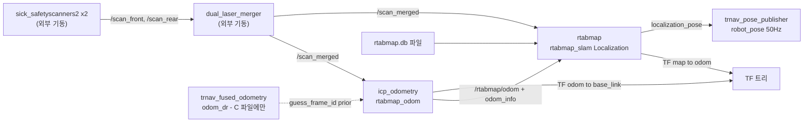

## 2026-07-28 (KST) — TR_Nav ICP 오도메트리 스택 리뷰 (Big-AMR 이식 관점)

> 목적: Big-AMR 은 모터 제어 미완성으로 휠 오도메트리가 없다. 그 대체로 TR_Nav_ros2_ws 의
> `icp_odometry`(ICP, Iterative Closest Point) 구성을 그대로 가져올 수 있는지 판정한다.
> 사용자 지시(2026-07-28 17:35): "TR_Nav 검토해주세요. fito는 학생이 해서 잘 안맞을겁니다."
> → FITO_AMR_ros2_ws 는 **대조군으로만** 인용하고 판정 근거로 삼지 않는다.

### 코드 버전

- 리뷰 대상: **외부 저장소** `kuks2309/TR_Nav_ros2_ws`, branch `main` @ `ad7520981d50` (2026-07-13T09:55:12Z)
- 대상 파일 (모두 `src/SLAM/2D_SLAM/rtab_map/`)
  | 태그 | 파일 | 행수 | 역할 |
  | --- | --- | --- | --- |
  | **A** | `launch/rtabmap_dual_lidar_localization.launch.py` | 163 | **주 리뷰 대상** — dual lidar + 측위 |
  | **B** | `launch/rtabmap_dual_lidar.launch.py` | 135 | 대조 — 같은 구성의 매핑(SLAM)판 |
  | **C** | `launch/rtabmap_2d_lidar_rgbd_localization.launch.py` | 268 | 대조 — 모션 prior 가 실제 적용된 유일본 |
  | — | `package.xml` (`rtab_map_config`) | — | 의존성 tier 근거 |
- 근거 문서: `docs/plan/2026-07-13_icp_motion_prior.md`, `docs/issues_fixes/issues_and_fixes.md`
- 직전 리뷰: 없음 (최초)

### 분석 분기 명시

- 분기: **전체 구조 분석** (다중 노드·다중 launch 횡단)
- 감지된 도메인: **ros2-review** (`.launch.py`, `package.xml`) / concurrency 미해당(콜백·스레드 코드 없음, 전부 노드 구성) / embedded-review 미해당

---

## Core 인벤토리

### 1. 목적

파일 A 는 **2D 라이다만으로 주행하는 AMR(Autonomous Mobile Robot)의 측위 스택을 한 번에 띄우는 launch** 다. 전·후 2개 SICK 스캐너를 외부에서 `dual_laser_merger` 로 합친 `/scan_merged` 하나를 입력으로 받아, ① `icp_odometry`(rtabmap_odom)가 스캔 정합으로 `odom→base_link` 를 만들고 ② `rtabmap`(rtabmap_slam, Localization 모드)이 사전 제작된 `.db` 맵에 대해 `map→odom` 을 보정한다. 휠 오도메트리는 TF 체인에 넣지 않는다.

라이다 병합은 **이 launch 의 책임이 아니다** — 주석(A:32-33)이 "`dual_laser_merger` 는 외부 Merger entry 가 띄움 … 본 launch 는 구독만" 이라고 명시한다.

파일 B 는 동일 센서 구성의 매핑판(`Mem/IncrementalMemory: 'true'`)이고, 파일 C 는 2D 라이다 + RGB-D 구성에 **엔코더+IMU 순수 DR(Dead Reckoning, 추측항법) prior 를 유일하게 연결한 판**이다(C:84 `'guess_frame_id': 'odom_dr'`).

### 2. 코드 플로우차트 (전체 구조)



동반 파일: `2026-07-28-flow.drawio` (박스 8 / 화살표 9, mermaid 와 1:1)

### 3. 함수 리스트

| # | 함수 | 입력 | 출력 | 기능 | 위치(file:line) |
| --- | --- | --- | --- | --- | --- |
| 1 | `launch_setup` | `context`, `*args`, `**kwargs` | `[icp_odometry, rtabmap_localization, rviz_node]` | 런타임 인자(`use_sim_time`·`initial_pose`)를 `perform(context)` 로 해석해 3개 Node 액션 생성 | A:14 |
| 2 | `generate_launch_description` | 없음 | `LaunchDescription` | 인자 5개 선언 + `OpaqueFunction(#1)` + `trnav_pose_publisher` include | A:126 |
| 3 | `launch_setup` | `context`, `*args`, `**kwargs` | `[icp_odometry, rtabmap_slam, rviz_node]` | B판(매핑) — #1 과 **동일 구조**, rtabmap 파라미터만 SLAM 용 | B:13 |
| 4 | `generate_launch_description` | 없음 | `LaunchDescription` | B판 인자 선언 + `OpaqueFunction(#3)` | B:112 |
| 5 | `launch_setup` | `context`, `*args`, `**kwargs` | Node 리스트 | C판 — #1 에 `guess_frame_id`(C:84)·RGB-D 구독 추가 | C:39 |
| 6 | `generate_launch_description` | 없음 | `LaunchDescription` | C판 인자 선언 + DR 발행 launch 선행 include | C:217 |

**중복/유사 함수**: #1·#3·#5 는 `icp_odometry` Node 블록(파라미터 8개 + remap)이 **세 파일에 그대로 복제**돼 있다 → `[품질]` 평가 #M2 참조.

### 4. 전역 변수 / 모듈 상수

| # | 사용처(함수) | 기능 | 위치(file:line) |
| --- | --- | --- | --- |
| G1 | `generate_launch_description` (#2) | `default_db_path` (가변 지역이나 launch 기동 시 1회 확정되는 경로 상수) — `maps_dir() / 'rtabmap_2d' / 'rtabmap.db'` | A:127 |
| G2 | `launch_setup` (#1) | `pkg_share` — `rtab_map_config` share 디렉터리(상수) | A:16 |
| G3 | `launch_setup` (#1) | `rviz_config` — `rtabmap_lidar.rviz` 절대경로(상수) | A:17 |
| G4 | `generate_launch_description` (#6) | C판 `default_db_path` — `os.path.join` 조립 | C:218 |

모듈 레벨 가변 전역(mutable module-level state)은 **없음**. 위 4건은 모두 함수 지역의 경로 상수다.

### 5. 의존성 3-tier

| Tier | 대상 | 버전/제약 | 부재 시 동작(필수/선택) | 근거(파일:line) |
| --- | --- | --- | --- | --- |
| 빌드 | `ament_cmake` | — | 빌드 불가 | `package.xml` |
| 빌드 | `rtabmap_launch`, `rviz2` | 미고정 | `exec_depend` 로만 선언 | `package.xml` |
| 런타임 필수 | `rtabmap_odom` (`icp_odometry`) | apt `0.23.7-1jammy` (이 장비 **미설치**) | **launch 즉시 실패** — 실행파일 없음. `package.xml` 에 미선언 | A:37-38 |
| 런타임 필수 | `rtabmap_slam` (`rtabmap`) | 동상 | launch 실패. `package.xml` 에 미선언 | A:67-68 |
| 런타임 필수 | `dual_laser_merger` → `/scan_merged` | 외부 기동 전제 | **조용히 무동작** — 두 노드가 스캔 대기 상태로 정지, 오류 없음 | A:32-33, A:142 |
| 런타임 필수 | `rtabmap.db` 맵 파일 | `maps_dir()/rtabmap_2d/rtabmap.db` | Localization 모드에서 맵 없음 → 측위 불가 | A:127, A:88 |
| 런타임 필수 | `tm_paths` 파이썬 모듈 (`maps_dir`) | TR_Nav 전용 | **import 실패로 launch 즉시 중단** | A:11 |
| 런타임 필수 | `rtab_map_config` 패키지 share | TR_Nav 전용 | `get_package_share_directory` 예외 | A:16 |
| 런타임 필수 | `trnav_pose_publisher` launch | TR_Nav 전용 | include 해석 실패 → launch 중단 | A:160-162 |
| 런타임 선택 | `rviz2` | `rviz:=false` 로 비활성 | fallback = GUI 없이 동작 | A:113-121 |
| 런타임 선택 | `trnav_fused_odometry` (`odom_dr`) | **C 파일에만** | A/B 는 prior 없이 등속 외삽으로 동작(→ 평가 #H3) | C:84 |

---

## ROS2 도메인 인벤토리

### A-1. Subscriptions

| 토픽 | 메시지 타입 | QoS(depth·reliability) | 콜백 함수 | 위치(file:line) |
| --- | --- | --- | --- | --- |
| `/scan_merged` (remap `scan`) | `sensor_msgs/LaserScan` | `qos:2` = SensorDataQoS(BEST_EFFORT), `topic_queue_size:10` | icp_odometry 내부 | A:56-57, A:60 |
| `/scan_merged` (remap `scan`) | `sensor_msgs/LaserScan` | `qos_scan:2`(BEST_EFFORT), `queue_size:10` | rtabmap 내부 | A:102, A:106 |
| `/rtabmap/odom` (remap `odom`) | `nav_msgs/Odometry` | `qos_odom:2` | rtabmap 내부 | A:103, A:107 |
| `/rtabmap/odom_info` | `rtabmap_msgs/OdomInfo` | `subscribe_odom_info: True` | rtabmap 내부 | A:80 |

### A-2. Publications

| 토픽 | 메시지 타입 | QoS | 발행 위치(함수) | 위치(file:line) |
| --- | --- | --- | --- | --- |
| `/rtabmap/odom` | `nav_msgs/Odometry` | rtabmap 기본(BEST_EFFORT) | icp_odometry (#1) | A:36-40 |
| `/rtabmap/odom_info` | `rtabmap_msgs/OdomInfo` | 기본 | icp_odometry (#1) | A:36-40 |
| `/rtabmap/localization_pose` | `geometry_msgs/PoseWithCovarianceStamped` | 기본 | rtabmap (#1) | A:66-70 |
| `/rtabmap/grid_map` | `nav_msgs/OccupancyGrid` | 기본 | rtabmap (`RGBD/CreateOccupancyGrid:true`) | A:98 |

### A-3. Services / Actions

**없음** — 본 launch 는 노드 구성만 하며 서비스/액션을 직접 선언하지 않는다(rtabmap 노드 자체 서비스는 벤더 패키지 소관).

### A-4. Parameters

| 이름 | 타입 | default | declare 위치 | 사용 위치 |
| --- | --- | --- | --- | --- |
| `use_sim_time` | bool(str) | **`'true'`** ⚠ | A:130-134 | A:29-30, 전 노드 |
| `database_path` | str | `maps_dir()/rtabmap_2d/rtabmap.db` | A:135-139 | A:88 |
| `scan_topic` | str | `'/scan_merged'` | A:140-144 | A:60, A:106 |
| `rviz` | bool(str) | `'true'` | A:145-149 | A:119 |
| `initial_pose` | str `"x y z roll pitch yaw"` | `'0 0 0 0 0 0'` | A:150-156 | A:96 |

Big-AMR 이식 시 `icp_odometry` 만 떼어낸 최소 파라미터(단위 주석 의무):

```yaml
icp_odometry:
  ros__parameters:
    # 프레임 (frame)
    frame_id: base_link
    odom_frame_id: odom
    publish_tf: true               # 실차에서는 반드시 true (평가 #H1)
    # 타이밍 (timing)
    wait_for_transform: 0.2        # s
    # ICP 정합 (registration)
    Icp/VoxelSize: "0.05"                  # m, 다운샘플 격자
    Icp/MaxCorrespondenceDistance: "0.1"   # m, 대응점 최대거리
    Icp/Iterations: "30"                   # 회, 반복 상한
    Icp/Epsilon: "0.001"                   # m, 수렴 임계
    Icp/PointToPlane: "false"              # 2D 스캔이므로 point-to-point
    Reg/Force3DoF: "true"                  # ← 원본에 없음. 평면 3자유도 강제 (평가 #H2)
    # 키프레임·맵 (keyframe/map)
    Odom/ScanKeyFrameThr: "0.6"            # 0~1, 키프레임 갱신 임계
    OdomF2M/ScanSubtractRadius: "0.05"     # m
    OdomF2M/ScanMaxSize: "5000"            # 점, 로컬맵 상한
    Odom/ResetCountdown: "1"               # ← 원본에 없음. 상실 시 자동 리셋 (평가 #H4)
    # QoS·큐 (transport)
    qos: 2                          # SensorDataQoS(BEST_EFFORT)
    topic_queue_size: 10
```

### A-5. TF frames

| frame | parent | 발행 노드 | 정적/동적 | 위치 |
| --- | --- | --- | --- | --- |
| `base_link` | `odom` | `icp_odometry` (`publish_tf`) | 동적 | A:44-45 |
| `odom` | `map` | `rtabmap` | 동적 | A:74-75 |
| `base_link` | `odom_dr` | `trnav_fused_odometry` (**C 전용**) | 동적 | C:84 근거 문서 |
| `odom_dr` | `odom` | `icp_odometry` 보정 변환 (**C 전용**) | 동적 | C:80-84 |
| 라이다 마운트 | `base_link` | 본 launch **미포함** — 외부 static TF 필요 | 정적 | (부재) |

### A-6. QoS 호환 매트릭스 (RxO — Requested vs Offered)

| 토픽 | offered(pub) | requested(sub) | 호환 | 근거 |
| --- | --- | --- | --- | --- |
| `/scan_merged` | `dual_laser_merger` = SensorDataQoS(BEST_EFFORT) | icp_odometry `qos:2`(BEST_EFFORT) | ✅ | B:41 주석이 "dual_laser_merger publisher와 호환" 명시 |
| `/scan_merged` | 동상 | rtabmap `qos_scan:2` | ✅ | A:102 |
| `/rtabmap/odom` | icp_odometry 기본 | rtabmap `qos_odom:2` | ✅ | A:103 |
| `/imu/data` (IMU 사용 시) | `iahrs_driver` = **RELIABLE** | icp_odometry `qos_imu` 미설정(기본) | ⚠ **미검증** | 본 launch 에 IMU 경로 자체가 없음 |

### A-7. 노드 연결 그래프

| 토픽 | 발행 노드 | 구독 노드(들) | 메시지 타입 | QoS 호환(A-6) |
| --- | --- | --- | --- | --- |
| `/scan_front`, `/scan_rear` | `sick_safetyscanners2` ×2 (**외부 경계**) | `dual_laser_merger` (**외부 경계**) | `sensor_msgs/LaserScan` | 본 launch 밖 |
| `/scan_merged` | `dual_laser_merger` (**외부 경계**) | `icp_odometry`, `rtabmap` | `sensor_msgs/LaserScan` | ✅ |
| `/rtabmap/odom` | `icp_odometry` | `rtabmap` | `nav_msgs/Odometry` | ✅ |
| `/rtabmap/odom_info` | `icp_odometry` | `rtabmap` | `rtabmap_msgs/OdomInfo` | ✅ |
| `/rtabmap/localization_pose` | `rtabmap` | `trnav_pose_publisher` (**외부 경계**) | `PoseWithCovarianceStamped` | 본 launch 밖 |
| `/rtabmap/grid_map` | `rtabmap` | (없음 — rviz2 만) | `nav_msgs/OccupancyGrid` | 고아 발행 후보 |

```text
sick x2 --[/scan_front,/scan_rear]--> dual_laser_merger --[/scan_merged]--> icp_odometry
icp_odometry --[/rtabmap/odom + odom_info]--> rtabmap --[/localization_pose]--> trnav_pose_publisher
```

- **고아 토픽**: `/rtabmap/grid_map` 은 rviz2 외 구독자 없음 (Info 급).
- **다중 발행자**: 없음. `base_link` 부모는 `odom` 하나(C 판에서는 `odom_dr` 하나) — TF 충돌 없음.
- **외부 경계**: 스캐너·merger·pose_publisher 3개가 본 launch 밖 (의존성 tier 2 와 대응).

---

## 평가

severity 분포: Critical 0 / High 4 / Medium 4 / Low 2 / Info 2
Verdict: REQUEST CHANGES

> 판정 대상은 **"Big-AMR 에 그대로 이식 가능한가"** 다. TR_Nav 자체 운용 맥락에서의 적합성 판정이 아니다.

### High

**함수 #1 `launch_setup` — [논리][신규] `use_sim_time` 기본값이 형제 launch 와 반대여서 실차에서 TF 를 발행하지 않는다 (High)**
   재현: A:132 `use_sim_time` default `'true'` → A:29 `is_sim=True` → A:30 `icp_publish_tf=False` → A:45 `publish_tf:False`. 인자 없이 실차에서 띄우면 `odom→base_link` TF 가 **발행되지 않고**, 오류 메시지도 없다. 형제 파일은 둘 다 `'false'`(B:115 근처, C:225 근처) — A 만 반대다.
   권고: Big-AMR 이식본은 default `'false'` 로 고정하거나, `publish_tf` 를 `use_sim_time` 에서 분리해 독립 인자로 뺀다.

**함수 #1 `launch_setup` — [논리][잔존] `icp_odometry` 에 `Reg/Force3DoF` 가 없어 평면 스캔에 6자유도 ICP 를 돌린다 (High)**
   재현: A:47-57 파라미터 목록에 `Reg/Force3DoF` 없음. 같은 파일 A:87 의 `Reg/Force3DoF:'true'` 는 **rtabmap 노드 쪽**이다. 저자 자신이 `issues_and_fixes.md:40` 에 "보류 (사용자 지시): `Reg/Force3DoF`(icp_odometry 가 평면 스캔에 6DoF ICP 를 돌리는 중)" 로 기록 — 미해결 상태.
   권고: Big-AMR 은 2D 전용이므로 이식 시 `Reg/Force3DoF:'true'` 를 icp_odometry 에 추가한다. 단 원저자가 "prior 와 동시 투입 시 원인 분리 불가"로 순차 진행을 지시했으므로, 우리도 **한 번에 하나씩** 넣고 효과를 따로 측정한다.

**함수 #1 `launch_setup` — [논리][잔존] 모션 prior 부재 — 실차 측위 파괴 2건의 근본 원인이 이 파일에는 미적용 (High)**
   재현: A 에 `guess_frame_id` 없음(전 파일 grep 0건). prior 는 **C:84 에만** 적용됐다. `issues_and_fixes.md:3-23` 기록 — 2026-07-13 실차 2건에서 `odom→base_link` 가 파괴(876 ms 공백 후 yaw +147.17°, 실제 IMU −20.36°), 근본 원인은 "출발점이 `Odom/GuessMotion` 등속 외삽뿐". 2026-06-17 에도 ICP 4 m 폭주 기록(`:850`).
   권고: **Big-AMR 은 이 대책을 그대로 쓸 수 없다** — 처방된 prior 는 `odom_dr`(엔코더 Δcount + IMU yaw)인데 우리는 엔코더가 없다. 대안은 IMU 전용 guess(`wait_imu_to_init` + `qos_imu`)이며, 이는 TR_Nav 에 전례가 없고 FITO 계열에만 있으므로 **Big-AMR 에서 새로 검증해야 하는 미검증 경로**다. 저속·수동 주행으로 한정해 시작할 것.

**함수 #1 `launch_setup` — [논리][잔존] `Odom/ResetCountdown` 미설정 — 트래킹 상실 후 자가 복구 없음 (High)**
   재현: A:47-57 에 `Odom/ResetCountdown` 없음. `issues_and_fixes.md:98` — "`icp_odometry` 트래킹 상실 후 **자가 복구 없음** … **347초간 미복구**. 별도 조치 필요."
   권고: 이식본에 `Odom/ResetCountdown` 을 명시(예: `'1'`)하고, 복구 발생을 로그로 관측한다.

### Medium

**함수 #1·#2 — [runtime][신규] TR_Nav 전용 결합 3건이 하드 의존이라 그대로는 기동 불가 (Medium)**
   재현: A:11 `from tm_paths import maps_dir`, A:16 `get_package_share_directory('rtab_map_config')`, A:160-162 `FindPackageShare('trnav_pose_publisher')`. 셋 다 Big-AMR 저장소에 없다 → **launch 파싱 단계에서 즉시 실패**.
   권고: 이식 시 `icp_odometry` Node 블록만 추출해 Big-AMR 전용 launch 로 재작성. rviz·db·pose_publisher 경로는 버린다.

**함수 #1·#3·#5 — [품질][신규] `icp_odometry` 파라미터 블록이 3개 파일에 복제 (Medium)**
   재현: A:36-63 / B:30-57 / C:(85 부근) 이 동일 8 파라미터를 각각 하드코딩. A 와 B 는 `qos` 주석 문구까지 다르다(A:56 "NOT qos_scan" vs B:41 "dual_laser_merger publisher와 호환") — 한쪽만 고치면 드리프트.
   권고: Big-AMR 은 처음부터 YAML 파라미터 파일 1개로 분리해 launch 가 그것을 읽게 한다.

**함수 #1 — [논리][신규] rtabmap 측위 절반은 Big-AMR 에서 무용 (Medium)**
   재현: A:66-110 은 `.db` 기반 rtabmap Localization 이다(A:84 `Mem/IncrementalMemory:'false'`, A:88 `database_path`). Big-AMR 의 맵은 Seer `.smap` 이고 측위는 `src/Navigation` 의 mcl2d 가 담당한다 — 형식·엔진 모두 다르다.
   권고: **`icp_odometry` 노드 1개만** 가져오고 rtabmap 노드는 가져오지 않는다. 소비자는 `mcl2d_localization_node` 의 `/odom` 입력.

**A-6 — [QoS][신규] Big-AMR 쪽 `/scan_merged` 발행 QoS 미확인 (Medium)**
   재현: A:56 `qos:2`(BEST_EFFORT)는 TR_Nav 의 merger 발행 QoS 에 맞춘 값이다(B:41 주석). Big-AMR 의 `dual_laser_merger` 가 RELIABLE 로 발행하면 offered(RELIABLE) ≥ requested(BEST_EFFORT) 라 연결 자체는 되지만, 반대 조합(pub BEST_EFFORT → sub RELIABLE)이면 **조용히 미연결**된다.
   권고: 이식 전 `ros2 topic info -v /scan_merged` 로 실측 확인 후 값 결정.

### Low

**함수 #1 — [param][신규] `Icp/MaxCorrespondenceDistance:0.1 m` 는 회전 시 대응점 34% 탈락이 실측된 값 (Low)**
   재현: `issues_and_fixes.md:20` — "회전 33.5°/s·스캔 32Hz 기준 실측 **34% 탈락**". 값 자체가 사고의 연쇄 고리 중 하나였다.
   권고: Big-AMR 은 저속 수동 주행부터 시작하므로 초기값 유지가 무난하나, 제자리 회전 시험 시 이 값과 스캔 주파수를 함께 기록해 둔다.

**함수 #1 — [topology][신규] `/rtabmap/grid_map` 고아 발행 (Low)**
   재현: A:98 `RGBD/CreateOccupancyGrid:'true'` 로 발행하나 rviz2 외 구독자 없음(A-7).
   권고: 이식 대상 아님 — rtabmap 노드를 안 가져오면 자연 소멸.

### Info

**의존성 tier — [runtime][신규] `package.xml` 이 `rtabmap_odom`·`rtabmap_slam` 을 선언하지 않는다 (Info)**
   재현: `rtab_map_config/package.xml` 의 `exec_depend` 는 `rtabmap_launch`, `rviz2` 뿐. 실제 실행하는 두 패키지가 빠져 있어 `rosdep` 으로 환경을 재현할 수 없다.
   권고: Big-AMR 이식본 `package.xml` 에는 `rtabmap_odom` 을 `exec_depend` 로 명시한다.

**환경 — [runtime][신규] 이 장비에 rtabmap 미설치 (Info)**
   재현: `apt-cache policy ros-humble-rtabmap-odom` → `Installed: (none)`, `Candidate: 0.23.7-1jammy.20260622.101306`.
   권고: 이식 착수 전 `sudo apt install ros-humble-rtabmap-odom` 선행.

---

## 결론 (Big-AMR 이식 판정)

**"파일 A 를 그대로 가져오기"는 불가** — TR_Nav 전용 결합 3건(#M1)으로 기동 자체가 안 되고, `use_sim_time` 기본값(#H1) 때문에 그대로 띄우면 TF 도 안 나온다.

**"`icp_odometry` 노드 구성만 가져오기"는 타당** — ICP 파라미터 8개는 동일 센서(dual SICK → `dual_laser_merger` → `/scan_merged`)에서 실주행으로 다듬어진 값이고, Big-AMR 의 센서 구성과 일치한다. 단 이식 시 **#H2(Force3DoF)·#H4(ResetCountdown) 2건을 보강**하고, **#H3(모션 prior)은 엔코더 부재로 대체 불가라는 리스크를 안고** 시작해야 한다.

### 후속 TODO

1. `sudo apt install ros-humble-rtabmap-odom` (이 장비 미설치)
2. Big-AMR 전용 launch 신규 작성 — `icp_odometry` 단독 + YAML 파라미터 분리 (#M2)
3. `ros2 topic info -v /scan_merged` 로 QoS 실측 후 `qos` 확정 (#M4)
4. `Reg/Force3DoF`·`Odom/ResetCountdown` 을 **하나씩 순차 투입**하고 각각 효과 측정 (#H2·#H4, 원저자 지시 준용)
5. IMU 전용 guess 는 별도 실험으로 분리 — TR_Nav 전례 없음 (#H3)

> 본 리뷰는 작성자(claude) 가 `APPROVE` 할 수 없다 — 별도 lane 에서 승인 필요.

---

## 2026-08-02 정정 — 실행 검증으로 드러난 본 리뷰의 누락

이식본을 실기에서 구동한 결과, **본 리뷰의 A-6 QoS 매트릭스에 누락이 있었다.**

A-6 은 `/scan_merged` 의 pub(merger) ↔ sub(icp_odometry) 정합만 검사하고, **`icp_odometry` 가
발행하는 `/odom` 의 소비자 쪽 QoS 를 검사하지 않았다.** 실제로는 `rtabmap_odom` 의 `qos` 파라미터가
구독뿐 아니라 **발행에도 적용**되어 `/odom` 이 BEST_EFFORT 로 나가고, 기본 RELIABLE 로 구독하는
소비자(`mcl2d_localization_node`)와 `offered < requested` 가 되어 **메시지가 한 건도 전달되지
않았다**(2026-08-02 실측 경고 로그).

- 근거: `ros2 topic info /odom -v` → `Reliability: BEST_EFFORT`
- 조치: 소비자 쪽을 BEST_EFFORT 구독으로 변경. 상세는
  `docs/adr/2026-07-28-icp-odometry-bringup.md` §실주행 검증 ①
- 교훈: QoS 매트릭스는 **리뷰 대상 노드가 발행하는 토픽의 외부 소비자까지** 포함해야 한다.
  본 리뷰의 A-7 노드 연결 그래프가 `/rtabmap/odom` 의 구독자를 `rtabmap` 하나로만 적은 것도 같은
  한계다 — 이식 후에는 mcl2d 가 소비자가 되는데 그 조합을 검사하지 않았다.

severity 분포·Verdict 는 갱신하지 않는다(TR_Nav 원본 코드에 대한 판정은 그대로다 — 위 누락은
**본 리뷰의 검사 범위** 문제이지 원본의 결함이 아니다).
