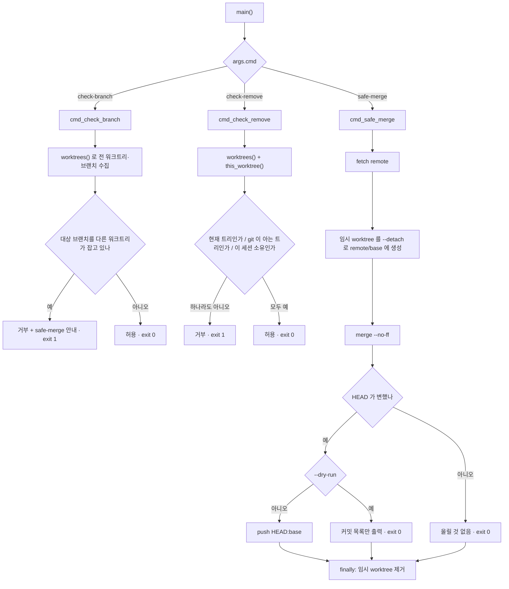

## 2026-08-10 (KST) — worktree-guard 계획 인벤토리 (신규 파일)

> coding.md §2 — **신규 파일은 계획 단계에서 함수·전역변수 표를 작성한다.**
> 본 문서는 코드 작성 **전**에 만든 설계 표이며, 작성 후 위치(줄)를 실제 값으로 맞췄다.

### 코드 버전
- 대상: `Tools/repo_tools/worktree_guard.py` (신규, git 미추적 → 커밋 시 해시 고정)
- 계기: 사건 `docs/claude-mistake/2026-08-10-001_shared-head-moved-from-linked-worktree.md`
  의 재발 방지 자산. 선행 동종 사건 `2026-08-06-003`(open) 도 함께 덮는다.

### 분석 분기 명시
- 분기: **단위 코드 리뷰**(단일 파일, 신규)
- 감지된 도메인: 없음 — ROS2·동시성·임베디드 어디에도 해당하지 않는 저장소 운용 스크립트

---

## 1. 목적

하나의 `.git` 을 여러 세션이 공유하는 이 저장소에서 **남의 HEAD 를 건드리는 git 조작을 막는다.**
`git_workflow.md` §2-1 이 「⚠ 공유 HEAD 주의 — `git switch` 금지」로 명시 금지하고 있으나
문서 규칙일 뿐 기계 강제가 없어 두 사건이 실제로 발생했다.

| 사건 | 조작 | 결과 |
| --- | --- | --- |
| 2026-08-10-001 | 링크드 워크트리에서 `git checkout -B main <ref>` | 공유 트리의 `main` 이 통째로 이동, 다른 세션에 유령 staged 167건 |
| 2026-08-06-003 | `git worktree remove --force` 를 경로 패턴으로 일괄 | 타 세션 워크트리 삭제(미커밋 파일 복구 불가) |

설계 원칙: **금지만으로는 막히지 않는다**(2026-07-28-005). 그래서 판정(`check-*`)뿐 아니라
**위험한 명령 형태를 쓸 필요 자체를 없애는 안전 경로**(`safe-merge`)를 함께 제공한다.

## 2. 코드 플로우차트 (단위)

## 3. 함수 리스트

| # | 함수 | 입력 | 출력 | 기능 | 위치(file:line) |
| --- | --- | --- | --- | --- | --- |
| 1 | `git` | `*args`, `cwd`, `check` | `str` (stdout) | git 실행 래퍼. 실패 시 `SystemExit` | worktree_guard.py:41-46 |
| 2 | `worktrees` | `cwd` | `list[(경로, 브랜치\|None)]` | `git worktree list --porcelain` 파싱 | worktree_guard.py:49-63 |
| 3 | `this_worktree` | `cwd` | `str` | 현재 워크트리 최상위 실경로 | worktree_guard.py:66-67 |
| 4 | `cmd_check_branch` | `args(branch)` | `int` (0/1) | 대상 브랜치를 **다른** 워크트리가 잡고 있으면 거부 | worktree_guard.py:70-82 |
| 5 | `cmd_check_remove` | `args(path, session_id)` | `int` (0/1) | 이 세션 소유 워크트리가 아니면 거부 | worktree_guard.py:85-106 |
| 6 | `cmd_safe_merge` | `args(branch, remote, base, message, dry_run)` | `int` | base 를 **체크아웃하지 않고** detached 임시 워크트리에서 병합·push | worktree_guard.py:109-136 |
| 7 | `main` | — (`sys.argv`) | `int` | 서브파서 3종 + dict 디스패치 | worktree_guard.py:139-162 |

## 4. 전역 변수 / 모듈 상수

**가변 전역 없음.** 모듈 레벨 대입은 `__doc__`(argparse description 으로 사용) 뿐이다.
상태는 전부 함수 지역이며, 외부 상태는 git 저장소 자체다.

## 5. 의존성 3-tier

| Tier | 대상 | 버전/제약 | 부재 시 동작(필수/선택) | 근거(파일:line) |
| --- | --- | --- | --- | --- |
| 빌드 | 없음 | — | `python3` 즉시 실행 (colcon 대상 아님 → `Tools/`) | — |
| 런타임 필수 | `git` CLI | worktree 지원(2.5+), `--porcelain` | `SystemExit` 로 즉시 종료 | worktree_guard.py:41-46 |
| 런타임 필수 | git 저장소 안에서 실행 | — | `rev-parse --show-toplevel` 실패 → `SystemExit` | worktree_guard.py:66-67 |
| 런타임 필수 (safe-merge) | 원격 접근 | `fetch`/`push` 권한 | fetch·push 실패 시 `SystemExit`, 임시 워크트리는 `finally` 로 정리 | worktree_guard.py:112, 131 |
| 런타임 선택 | `CLAUDE_SESSION_ID` 환경변수 | `check-remove` 의 소유 판정 | 없으면 판정 불가로 **거부**(보수적) | worktree_guard.py:150 |

---

## 평가

severity 분포: Critical 0 / High 0 / Medium 0 / Low 2 / Info 1
Verdict: **COMMENT** — 신규 파일의 계획 인벤토리이며, 결함 평가는 실사용 후 별도 날짜로 갱신한다.

**함수 #5 `cmd_check_remove` — [논리] 세션 소유 판정이 명명 규약에 의존한다 (Low)**
   재현: 소유 판정이 브랜치명 `session/<id>` 접두 또는 경로의 `-ses-<id>` 에 의존한다.
   그 규약을 따르지 않는 워크트리는 자기 것이어도 거부된다.
   권고: 보수적 방향(거부)이라 안전 측이므로 그대로 둔다. 예외가 잦아지면 생성 시점에
   소유를 기록하는 방식으로 바꾼다.

**함수 #6 `cmd_safe_merge` — [논리] 충돌 시 임시 워크트리가 정리되며 해결 기회가 사라진다 (Low)**
   재현: `merge` 가 충돌로 실패하면 `git()` 이 `SystemExit` 을 던지고 `finally` 가 워크트리를
   제거한다. 충돌 해결을 그 자리에서 이어가지 못한다.
   권고: 충돌은 사람이 해결해야 하고(`git_workflow.md` §2-1 「Claude 는 충돌을 자동 해결하지
   않는다」) 브랜치는 보존되므로 재시도 가능하다. 현 동작이 그 원칙과 정합한다.

**함수 #6 — [Info] 이 명령이 브랜치를 하나도 이동시키지 않는 이유**
   근거: `git worktree add --detach <path> <remote>/<base>` 는 분리 HEAD 로 체크아웃하므로
   지역 브랜치를 만들지도 옮기지도 않는다. push 도 `HEAD:<base>` 형태라 지역 `<base>` 를
   경유하지 않는다. 따라서 사건 2026-08-10-001 의 기전이 구조적으로 재현될 수 없다.

## 후속 TODO

1. 실사용 후 결함 평가를 별도 날짜 파일로 갱신(본 문서는 계획 인벤토리).
2. `git_workflow` 훅에 `check-branch`·`check-remove` 를 PreToolUse 게이트로 얹는 안은
   번들 SSOT 수정이라 **사용자 승인 사항**이다(`2026-08-06-003` 재발 방지 후보 ②와 동일).
