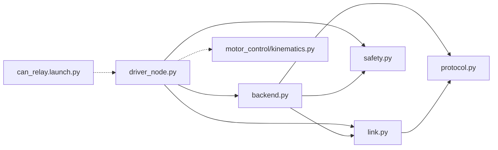
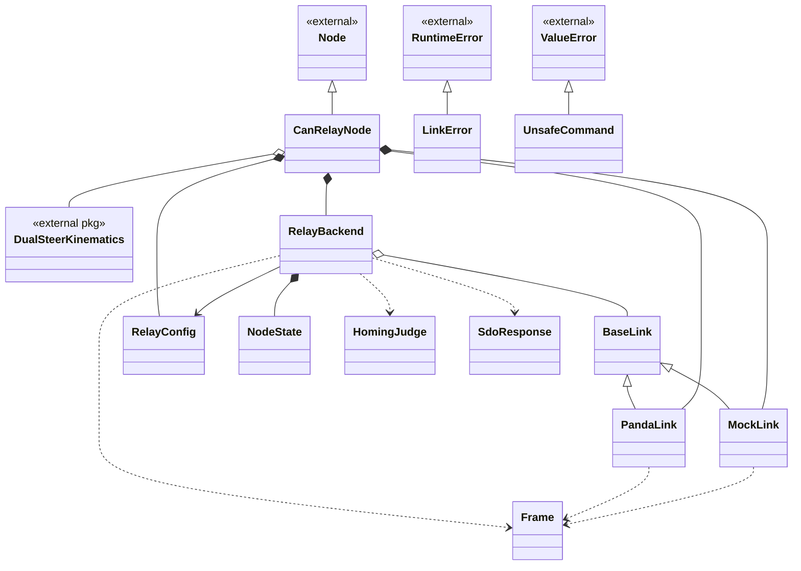
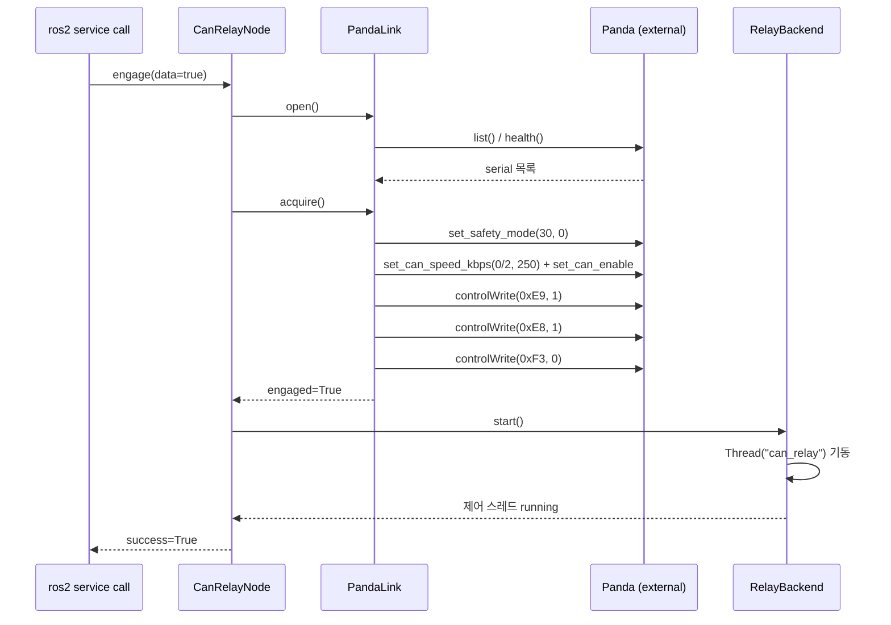
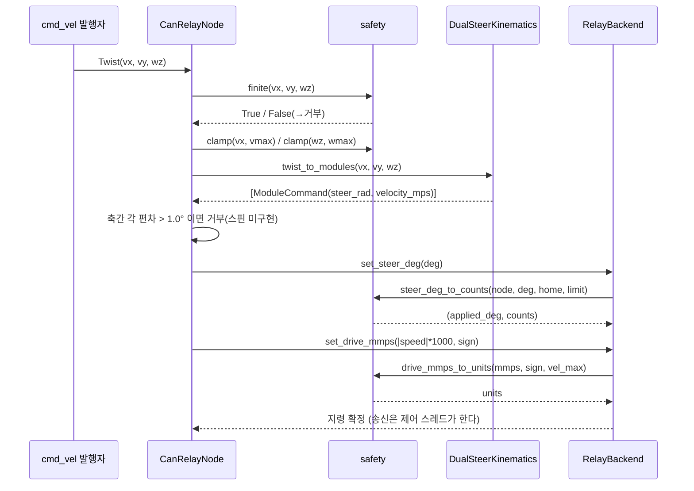
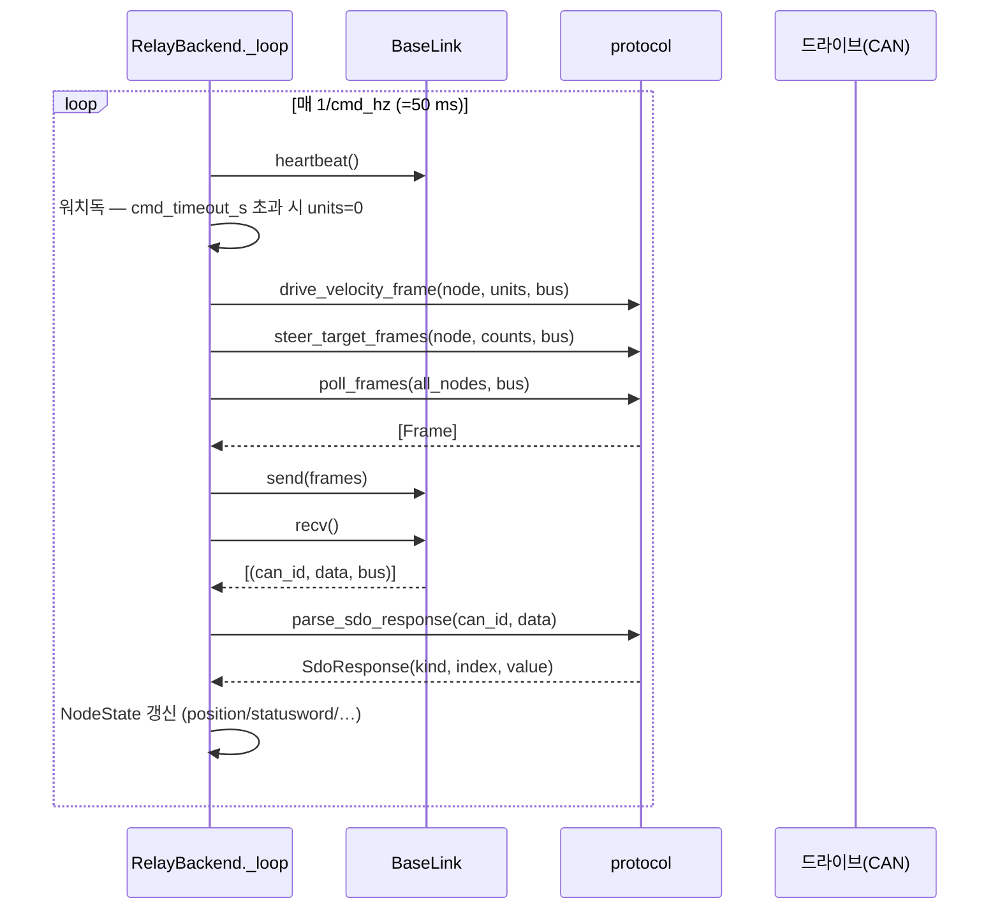

# can_relay (ROS2) SW 구조

## 2026-07-31 16:35 (KST) — ROS2 인터페이스 설계와 모듈 연결 구조

### 분석 범위

- 대상: `src/Comm/CAN/can_relay/` (ROS2 `ament_python` 패키지, 5 모듈 1396줄)
- 산출물 분기: **둘 다** (파일 의존 그래프 + 클래스 관계도 + 시퀀스)
- 계기: Python → C++ 포팅 사전 구조 파악 (2026-07-31 세션)
- ⚠ **이름 주의**: 이 문서의 `can_relay` 는 **ROS2 드라이버 패키지**다.
  `Tools/Can_Relay/` 의 판다 펌웨어 프로젝트가 아니다(`package.xml:8-18` 의 동일 경고 참조).

---

### ROS2 인터페이스 설계 (토픽·서비스·파라미터)

노드 실행체는 **1개**다 — `can_relay_node` (`setup.py:26` console_script → `driver_node:main`).

#### 이름 공간 설계 규칙

인터페이스가 **전역 상대명**과 **프라이빗명(`~/`)** 두 갈래로 갈리며, 그 경계에 규칙이 있다:

| 갈래 | 대상 | 이유 |
|---|---|---|
| 전역 상대명 (`cmd_vel`, `estop`, `joint_states`, `diagnostics`) | 로봇 전체가 공유하는 표준 인터페이스 | 다른 노드(내비게이션·안전·`robot_state_publisher`)가 노드명을 몰라도 붙을 수 있어야 한다 |
| 프라이빗 (`~/steer_deg`, `~/drive_mmps`, `~/engage`, `~/stop`, `~/home`) | 이 드라이버에만 있는 시험·수명주기 지령 | 노드명 아래로 숨겨 다른 드라이버와 충돌하지 않게 한다. 잭업 시험용 직접 지령이 전역에 노출되면 오발 위험 |

#### 구독 (4)

| 토픽 | 타입 | QoS | 위치 | 비고 |
|---|---|---|---|---|
| `cmd_vel` | `geometry_msgs/Twist` | depth 10 (기본) | `driver_node.py:127-128` | **조건부 생성** — 역기구학 import 실패 시 구독 자체를 만들지 않는다 |
| `estop` | `std_msgs/Bool` | **TRANSIENT_LOCAL** depth 1 | `driver_node.py:120-121` | 래치 상태라 늦게 붙은 구독자도 현재 값을 받아야 한다 (`driver_node.py:48-52`) |
| `~/steer_deg` | `std_msgs/Float64` | depth 10 | `driver_node.py:122-123` | 잭업 시험용 직접 조향각 |
| `~/drive_mmps` | `std_msgs/Float64` | depth 10 | `driver_node.py:124-125` | 잭업 시험용 직접 구동속도 |

`cmd_vel` 만 조건부인 것이 이 패키지 설계의 핵심 중 하나다 — `motor_control.kinematics` 를
import 하지 못하면 **자체 역기구학으로 대체하지 않고 구독을 열지 않는다**
(`driver_node.py:145-154`). 저장소에 같은 역기구학이 이미 3벌 있고 접기 임계가
±90°/±115°/±140° 로 갈라져 있어서, 4벌째를 막는 것이 명시된 의도다(`driver_node.py:8-11`).

#### 발행 (2)

| 토픽 | 타입 | 주기 | 위치 |
|---|---|---|---|
| `joint_states` | `sensor_msgs/JointState` | `state_hz` = 10.0 Hz | `driver_node.py:130`, 타이머 `:137` |
| `diagnostics` | `diagnostic_msgs/DiagnosticArray` | `diag_hz` = 1.0 Hz | `driver_node.py:131`, 타이머 `:138` |

`joint_states` 는 **믿을 수 없는 축을 발행하지 않는다** — 0 으로 채우지 않고 이름 자체를
빼며(`driver_node.py:257-263`), 이름이 하나도 없으면 메시지를 내지 않는다. 판정은
`backend.steer_angles_deg()` 가 하고 상태워드 bit15·피드백 신선도·원점 유무 세 조건을
본다(`backend.py:274-293`).

#### 서비스 (3)

| 서비스 | 타입 | 위치 | 비고 |
|---|---|---|---|
| `~/engage` | `std_srvs/SetBool` | `driver_node.py:133` | 제어권 획득/반환. **기동만으로는 제어권을 잡지 않는다** |
| `~/stop` | `std_srvs/Trigger` | `driver_node.py:295` | `stop_all()` — 구동 0 송신 **+ 조향 정지**(현재 실측 위치를 새 `0x607A` 목표로 써서 PP 이동을 끝낸다). ⚠ 2026-08-01 이전 서술 「조향은 현 위치 유지」는 **틀렸다** — 당시 `stop()` 은 `drive_nodes` 에만 프레임을 보냈고 조향축에 도달한 프레임이 0 이었다. 정지는 소프트웨어가 아니라 구동 완료·정지마찰로 끝났다 |
| `~/home` | `std_srvs/Trigger` | `driver_node.py:135` | 조향 호밍 (물리 스윙 100°+) |

launch 는 노드를 **대기 상태**로만 띄우고 `~/engage` 명시 호출을 요구한다
(`launch/can_relay.launch.py:3-6`). `on_exit=Shutdown()` 이며 `respawn` 하지 않는다 —
재기동은 제어권을 다시 잡는 행위라 사람이 판단해야 한다는 것이 주석에 명시돼 있다
(`launch/can_relay.launch.py:36-38`).

#### 파라미터 (22, `driver_node.py:60-82`)

`config/can_relay.yaml` 이 `/**` 와일드카드로 키잉돼 있어 노드명·네임스페이스를 바꿔도
로드된다(`config/can_relay.yaml:1-3`). 고정 노드명으로 키잉하면 리맵 시 조용히 미로드되고
코드 기본값이 나가기 때문이다.

| 그룹 | 파라미터 |
|---|---|
| 링크 | `link`(panda\|mock), `panda_serial`, `bus`(=2) |
| 축 배정 | `drive_nodes`[1,2], `steer_nodes`[3,4], `steer_home_counts` |
| 안전 한계 | `steer_limit_deg`(90.0), `vel_max_units`(4889), `cmd_timeout_s`(0.3) |
| 주기 | `cmd_hz`(20.0), `poll_hz`(5.0), `diag_hz`(1.0), `state_hz`(10.0) |
| 판정 | `settle_tol_deg`(3.0) |
| 게이트 | `allow_bringup`(false), `enable_cmd_vel`(true) |
| 기하·상한 | `vmax`, `wmax`, `module_x`, `module_y` |

`steer_home_counts` 와 `steer_nodes` 는 길이가 다르면 **생성자에서 예외로 죽는다**
(`driver_node.py:88-91`) — 조향 원점 오배정이 물리 손상으로 이어지기 때문에 기동 거부를
택했다.

---

### ① 파일 의존 그래프



- 실선 = 패키지 내부 import. 점선 = 패키지 경계를 넘는 연결(launch→실행체, 타 ROS2 패키지).
- 외부 라이브러리(`rclpy`, `panda`, `struct`)는 룰 7 에 따라 제외.
- 계층은 4단: `driver_node`(ROS2 껍데기) → `backend`(제어 스레드) → `link`(전송) → `protocol`(프레임 조립).
  `safety` 는 순수 함수 모듈이라 어느 층에서든 부른다.

drawio: [2026-07-31-file-graph.drawio](2026-07-31-file-graph.drawio)

### ② 클래스 관계도



- `BaseLink` 는 추상 인터페이스(모든 메서드 `NotImplementedError`, `link.py:76-102`)이고
  구현체는 `PandaLink`(실기)·`MockLink`(시험) 둘이다. `RelayBackend` 는 `BaseLink` 만 알기
  때문에 하드웨어 없이 전량 회귀 시험이 가능하다 — `test_backend.py` 26건이 이 구조 위에 선다.
- `DualSteerKinematics` 는 같은 저장소의 **다른 ROS2 패키지**(`motor_control`) 소속이라
  `<<external pkg>>` 로 구분했다. 룰 7 의 외부 라이브러리 제외와 달리 in-repo 이므로 표기한다.

drawio: [2026-07-31-class.drawio](2026-07-31-class.drawio)

### ③ 시퀀스 다이어그램

#### 시나리오 A — 제어권 획득 (`~/engage true`)



`auth(0xE9)` 가 `intercept(0xE8)` 보다 **먼저**여야 재engage 래치가 걸려 있을 때 intercept 가
조용히 무시되지 않는다(`link.py:196-200`). 중간 실패 시 어중간한 상태로 두지 않고
`_rollback()` 한다(`link.py:212-216`).

#### 시나리오 B — `cmd_vel` → 모터 프레임



**여기서 프레임이 나가지 않는다** — 콜백은 공유 상태(`_drive_units`·`_steer_counts`)만
갱신하고, 실제 송신은 별도 제어 스레드가 20 Hz 로 한다. C++ 포팅 시 이 경계가 그대로
락(`std::mutex`) 경계가 된다.

#### 시나리오 C — 제어 스레드 루프 (20 Hz)



`bus` 가 `cfg.bus`(=2) 가 아닌 수신 프레임은 버린다(`backend.py:370-371`) — bus 0 은 Seer 측이다.

drawio: [2026-07-31-sequence.drawio](2026-07-31-sequence.drawio)

### ④ 연결 관계표

| # | source | → | target | 관계 종류 | 위치 |
|---|--------|---|--------|----------|------|
| 1 | can_relay.launch.py | → | driver_node.py | call | launch/can_relay.launch.py:30-31 (setup.py:26 경유) |
| 2 | driver_node.py | → | safety.py | import | can_relay/driver_node.py:44 |
| 3 | driver_node.py | → | backend.py | import | can_relay/driver_node.py:45 |
| 4 | driver_node.py | → | link.py | import | can_relay/driver_node.py:46 |
| 5 | driver_node.py | → | motor_control/kinematics.py | import | can_relay/driver_node.py:147 |
| 6 | backend.py | → | protocol.py | import | can_relay/backend.py:33 |
| 7 | backend.py | → | safety.py | import | can_relay/backend.py:34 |
| 8 | backend.py | → | link.py | import | can_relay/backend.py:35 |
| 9 | link.py | → | protocol.py | import | can_relay/link.py:43 |
| 10 | CanRelayNode | → | Node | inherit | can_relay/driver_node.py:55 |
| 11 | MockLink | → | BaseLink | inherit | can_relay/link.py:105 |
| 12 | PandaLink | → | BaseLink | inherit | can_relay/link.py:156 |
| 13 | LinkError | → | RuntimeError | inherit | can_relay/link.py:72 |
| 14 | UnsafeCommand | → | ValueError | inherit | can_relay/safety.py:41 |
| 15 | CanRelayNode | → | RelayBackend | compose | can_relay/driver_node.py:115 |
| 16 | CanRelayNode | → | MockLink | compose | can_relay/driver_node.py:110 |
| 17 | CanRelayNode | → | PandaLink | compose | can_relay/driver_node.py:114 |
| 18 | CanRelayNode | → | RelayConfig | compose | can_relay/driver_node.py:93 |
| 19 | CanRelayNode | → | DualSteerKinematics | aggregate | can_relay/driver_node.py:164 |
| 20 | RelayBackend | → | BaseLink | aggregate | can_relay/backend.py:82 |
| 21 | RelayBackend | → | RelayConfig | associate | can_relay/backend.py:83 |
| 22 | RelayBackend | → | NodeState | compose | can_relay/backend.py:86-88 |
| 23 | RelayBackend | → | HomingJudge | depend | can_relay/backend.py:217 |
| 24 | RelayBackend | → | Frame | depend | can_relay/backend.py:306 |
| 25 | RelayBackend | → | SdoResponse | depend | can_relay/backend.py:372 |
| 26 | PandaLink | → | Frame | depend | can_relay/link.py:273 |
| 27 | MockLink | → | Frame | depend | can_relay/link.py:112 |

### ⑤ 구조 관찰

- 순환 의존: 순환 없음. 파일 그래프는 `driver_node → {backend, link, safety, kinematics}`,
  `backend → {protocol, safety, link}`, `link → protocol` 의 방향 비순환 그래프(DAG)다.
- 고립 노드: `can_relay/__init__.py` (0 statements, 내부 엣지 0 — 패키지 마커 전용).
- 진입점:
  - `can_relay/driver_node.py:320` `main()` — console_script `can_relay_node` (`setup.py:26`)
  - `launch/can_relay.launch.py:17` `generate_launch_description()`
  - `test/conftest.py` 경유 pytest 3파일 (`test_protocol.py`·`test_backend.py`·`test_safety.py`)
- **fan-in 상위**: `protocol.py` 2, `safety.py` 2, `link.py` 2
- **fan-out 상위**: `driver_node.py` 4, `backend.py` 3, `link.py` 1
- **스레드 경계**: 실행 스레드는 2개다 — rclpy executor(콜백·타이머)와
  `RelayBackend._loop`(`backend.py:114-116`, 이름 `can_relay`, daemon). 공유 상태는
  `self._lock`(`backend.py:90`) 하나로 보호된다. 판다 USB 핸들 경합 이력 때문에 송수신·심박을
  **한 스레드에 몰아** 둔 것이 명시된 설계다(`backend.py:74-78`, `link.py:32-33`).
- **테스트 커버리지 분포(2026-07-31 실측, `python3 -m coverage run --source=can_relay -m pytest test`)**:
  `safety.py` 100% · `protocol.py` 99% · `backend.py` 82% · `link.py` 45% · `driver_node.py` 0%
  (전체 57%, 84 passed). 그래프의 **상단 2노드**(`driver_node`·`link` 의 `PandaLink` 경로)가
  회귀 그물 밖이다.

---

### 검증 근거

```
$ python3 -m pytest test -q                      → 84 passed
$ python3 -m coverage report -m                  → TOTAL 763 stmts, 326 miss, 57%
$ (drawio 검증) 노드·엣지 1:1, dangling 0        → ALL PASS
    2026-07-31-file-graph.drawio: 노드 7/7 · 엣지 9/9 · dangling 0
    2026-07-31-class.drawio:      노드 16/16 · 엣지 18/18 · dangling 0
    2026-07-31-sequence.drawio:   노드 6/6 · 엣지 13/13 · dangling 0
```

⚠ SOP 룰 10 이 지정한 검증기 `checks/drawio_validate.py` 는 **이 저장소에 부재**다
(`find . -name drawio_validate.py` → 0건, 2026-07-31 실행). CLAUDE.md 의 "강제 장치 미설치
고지"와 같은 상태이므로, 동등한 검사(well-formed·dangling·mermaid 1:1)를 수행하는
생성·검증 스크립트를 별도로 돌려 위 결과를 얻었다.

---
