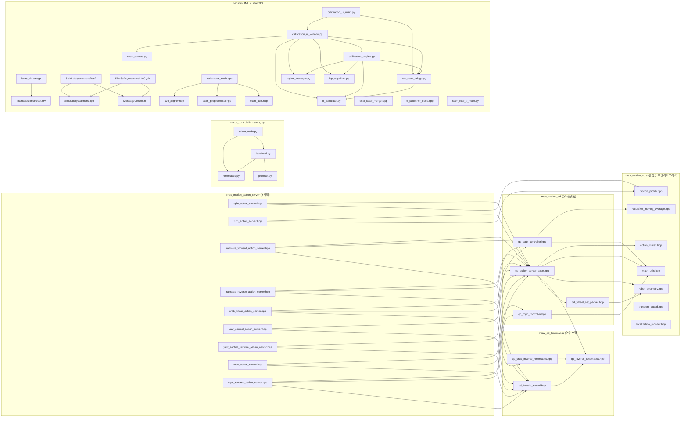
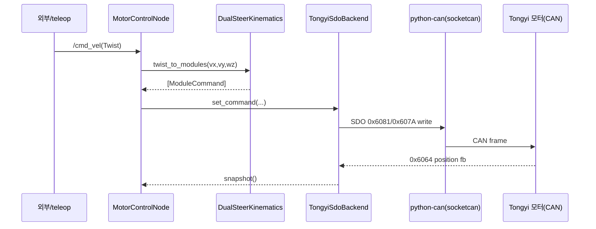
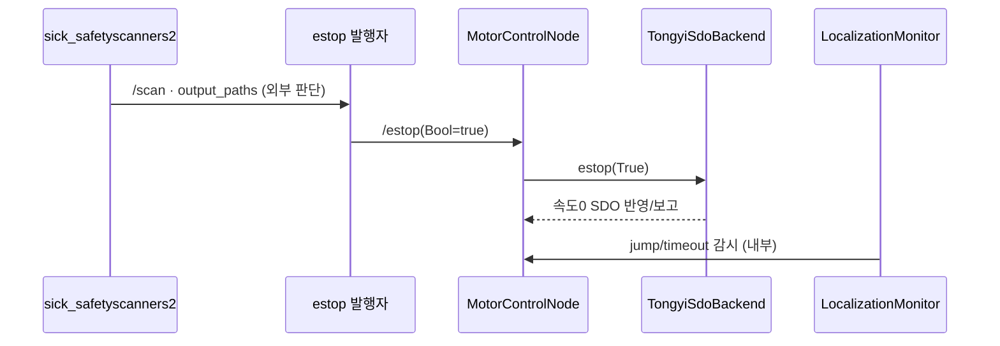
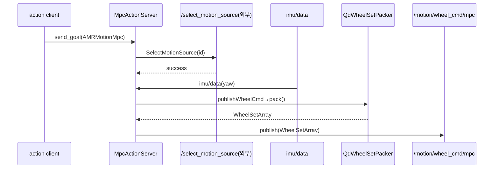

## 2026-07-26 21:30 (KST) — Big-AMR 전체 프로젝트 SW 구조 (코드 레벨 실측)

> 시스템 아키텍처 정본 `docs/sw_structure/system-architecture/2026-06-27.md`(D1~D17)를 **실제 `src/` 코드**로 구체화한다.
> 모든 연결은 `package.xml`/`CMakeLists.txt`/`setup.py` 및 `create_publisher|subscription|service|client`·`class ... : public`·`#include`·`import` grep 실측 근거만 기재(환각 0). 판정 없음(연결 시각화만, `code_review` 소관 제외).

### 분석 범위
- 대상: `src/` 아래 ROS2 패키지 전체(13 `package.xml` + 4 빈 stub 디렉토리)
- 산출물 분기: **둘 다**(파일 의존 그래프 + 클래스 관계도 + 시퀀스 3종)
- **stub(코드 0, 빈 디렉토리) — 실측상 파일 없음**: `Comm/CAN/can_relay`(Black Panda relay), `Control/Seer`, `Safety`, `Sensors/Lidar/3D`, `Control/Motion_Control/{2WS,4IS,DD}`. → 시스템 아키텍처의 Seer·Panda·Safety PLC 체인은 **아직 코드 미구현**(HW/펌웨어·외부). 본 문서는 존재하는 코드만 그린다.
- **그래프 스코핑(rule 8 규모 관리)**: ① 파일 그래프에서 9개 action server 헤더는 **정의적 include(→ `qd_action_server_base.hpp` 및 고유 controller/kinematics)만** 표기. 공통 코어 유틸(`action_mutex`/`math_utils`/`motion_profile`/`transient_guard`/`localization_monitor`) 공통 include 는 §부록 A 에 위치 전수. `*_main.cpp`(9개 실행 래퍼)는 그래프 생략, ⑤ 진입점에 명시.

---

### ① 파일 의존 그래프 (mermaid flowchart, 48 노드 / 59 엣지, 5 도메인 subgraph)

노드=소스 파일, 화살표="왼쪽이 오른쪽을 include/import". 외부 라이브러리(rclcpp·pcl·PyQt5 등)는 제외(rule 7). drawio 동반: `2026-07-26-file-graph.drawio`.

---

### ② 클래스 관계도 (mermaid classDiagram, 51 노드 / 77 엣지)

```mermaid
classDiagram
    class RclNode { <<external>> }
    class RclLC { <<external>> }
    class PyNode { <<external>> }
    class QObject { <<external>> }
    class QWidget { <<external>> }
    class QMain { <<external>> }
    class QThread { <<external>> }

    QdActionServerBase <|-- SpinActionServer
    QdActionServerBase <|-- TurnActionServer
    QdActionServerBase <|-- TranslateForwardActionServer
    QdActionServerBase <|-- TranslateReverseActionServer
    QdActionServerBase <|-- CrabLinearActionServer
    QdActionServerBase <|-- YawControlActionServer
    QdActionServerBase <|-- YawControlReverseActionServer
    QdActionServerBase <|-- MpcActionServer
    QdActionServerBase <|-- MpcReverseActionServer

    QdActionServerBase *-- QdDualSteerIK
    QdActionServerBase *-- QdWheelSetPacker
    QdActionServerBase o-- RclNode
    QdWheelSetPacker *-- RobotGeometry
    QdPathController *-- RecursiveMovingAverage
    QdCrabIK ..> QdDualSteerIK
    QdBicycleModel ..> QdDualSteerIK
    LocalizationMonitor o-- RclNode

    TranslateForwardActionServer *-- QdPathController
    TranslateForwardActionServer *-- QdBicycleModel
    TranslateForwardActionServer *-- TransientGuard
    TranslateForwardActionServer *-- LocalizationMonitor
    TranslateReverseActionServer *-- QdPathController
    TranslateReverseActionServer *-- QdBicycleModel
    TranslateReverseActionServer *-- TransientGuard
    TranslateReverseActionServer *-- LocalizationMonitor
    CrabLinearActionServer *-- QdPathController
    CrabLinearActionServer *-- QdCrabIK
    CrabLinearActionServer *-- TransientGuard
    CrabLinearActionServer *-- LocalizationMonitor
    YawControlActionServer *-- QdBicycleModel
    YawControlActionServer *-- TransientGuard
    YawControlActionServer *-- LocalizationMonitor
    YawControlReverseActionServer *-- QdBicycleModel
    YawControlReverseActionServer *-- TransientGuard
    YawControlReverseActionServer *-- LocalizationMonitor
    MpcActionServer *-- QdBicycleModel
    MpcActionServer *-- QdMpcController
    MpcActionServer *-- TransientGuard
    MpcActionServer *-- LocalizationMonitor
    MpcReverseActionServer *-- QdBicycleModel
    MpcReverseActionServer *-- QdMpcController
    MpcReverseActionServer *-- TransientGuard
    MpcReverseActionServer *-- LocalizationMonitor
    SpinActionServer ..> TrapezoidalProfile
    TurnActionServer ..> TrapezoidalProfile

    IAHRS --|> RclNode
    MergerNode --|> RclNode
    CalibrationNode --|> RclNode
    TFPublisherNode --|> RclNode
    SickSafetyscannersRos2 --|> RclNode
    SickSafetyscannersRos2 --|> SickSafetyscanners
    SickSafetyscannersLifeCycle --|> RclLC
    SickSafetyscannersLifeCycle --|> SickSafetyscanners
    SickSafetyscannersRos2 *-- MessageCreator
    SickSafetyscannersLifeCycle *-- MessageCreator

    MotorControlNode --|> PyNode
    SeerLidarTf --|> PyNode
    CalibrationUINode --|> PyNode
    MotorControlNode *-- TongyiSdoBackend
    MotorControlNode *-- DualSteerKinematics
    MotorControlNode *-- DiffDriveKinematics
    TongyiSdoBackend --> ModuleConfig
    TongyiSdoBackend --> NodeState
    TongyiSdoBackend ..> protocolFrame
    TongyiSdoBackend ..> DualSteerKinematics

    ScanCanvas --|> QWidget
    CalibrationEngine --|> QObject
    RosScanBridge --|> QObject
    RegionManager --|> QObject
    CalibrationWorker --|> QThread
    CalibrationUIWindow --|> QMain
    CalibrationUIWindow *-- ScanCanvas
    CalibrationUIWindow *-- RegionManager
    CalibrationUIWindow *-- RosScanBridge
    CalibrationUIWindow *-- CalibrationEngine
    CalibrationUIWindow *-- CalibrationWorker
    CalibrationEngine --> RosScanBridge
```

외부 기반 클래스는 `<<external>>` leaf(rule 7 예외). drawio 동반: `2026-07-26-class.drawio`.

---

### ③ 시퀀스 다이어그램 (실행 시나리오 3종, 17 participant / 20 message)

drawio 동반: `2026-07-26-sequence.drawio`. ③ 의 런타임 호출은 ④-3 표(위치)와 대응(rule 2: ②에 없는 런타임 엣지라 ④-3 별표로 보강 기재).

#### (a) 구동 명령 경로 — 실측: `/cmd_vel → motor_control → CAN`
> 아키텍처의 `Seer → Black Panda → Tongy` 경로는 **stub(코드 0)** — 현 코드가 실현하는 구동은 `motor_control` 의 CANopen SDO 마스터 뿐. Seer/Panda leg 부재.

#### (b) 안전정지 체인 — 실측: `/estop(Bool) → backend.estop` + 내부 감시
> 아키텍처의 `SICK 안전 Lidar → Safety PLC → 모터` 인증 체인은 **HW/Safety(stub)** — 코드가 실현하는 정지는 (i) `/estop` Bool 구독→backend, (ii) `LocalizationMonitor` jump/timeout 감시, (iii) `sick_safetyscanners2` 는 `/scan`·field 데이터만 발행(정지 판단은 외부).

#### (c) 모션제어(trnav) 명령 흐름 — 실측: action → WheelSetArray
> 발행 `WheelSetArray`(`/motion/wheel_cmd/<action>`)와 `/select_motion_source` 서비스의 **소비자/서버는 in-repo 부재**(mux 외부/미구현). motor_control 은 `/cmd_vel` 구독이라 이 경로와 토픽 미연결(⑤ 관찰).

---

### ④ 연결 관계표

> 반복 패턴(9 서버 동형)은 그룹 행으로 압축하되 각 행에 `file:line` 위치를 전수 병기(추적성 유지). 관계 종류 어휘 고정: `import`/`include`/`call`/`inherit`/`compose`/`aggregate`/`associate`/`depend`.

#### ④-1 파일 include/import (① 대응)

| # | source | → | target | 관계 종류 | 위치 |
|---|--------|---|--------|----------|------|
| 1 | qd_path_controller.hpp | → | recursive_moving_average.hpp | include | qd_path_controller.hpp:4 |
| 2 | qd_path_controller.cpp | → | math_utils.hpp | include | qd_path_controller.cpp:2 |
| 3 | qd_mpc_controller.cpp | → | math_utils.hpp | include | qd_mpc_controller.cpp:3 |
| 4 | qd_wheel_set_packer.hpp | → | robot_geometry.hpp | include | qd_wheel_set_packer.hpp:4 |
| 5 | qd_action_server_base.hpp | → | action_mutex.hpp | include | qd_action_server_base.hpp:4 |
| 6 | qd_action_server_base.hpp | → | math_utils.hpp | include | qd_action_server_base.hpp:5 |
| 7 | qd_action_server_base.hpp | → | robot_geometry.hpp | include | qd_action_server_base.hpp:6 |
| 8 | qd_action_server_base.hpp | → | qd_inverse_kinematics.hpp | include | qd_action_server_base.hpp:7 |
| 9 | qd_action_server_base.hpp | → | qd_wheel_set_packer.hpp | include | qd_action_server_base.hpp:8 |
| 10 | qd_crab_inverse_kinematics.hpp | → | qd_inverse_kinematics.hpp | include | qd_crab_inverse_kinematics.hpp:6 |
| 11 | qd_bicycle_model.hpp | → | qd_inverse_kinematics.hpp | include | qd_bicycle_model.hpp:4 |
| 12 | {spin,turn,tfwd,trev,crab,yaw,yawr,mpc,mpcr}_action_server.hpp (×9) | → | qd_action_server_base.hpp | include | spin:7,turn:7,tfwd:18,trev:18,crab:18,yaw:13,yawr:13,mpc:18,mpcr:18 |
| 13 | spin_action_server.hpp | → | motion_profile.hpp | include | spin_action_server.hpp:8 |
| 14 | turn_action_server.hpp | → | motion_profile.hpp | include | turn_action_server.hpp:8 |
| 15 | translate_forward_action_server.hpp | → | qd_path_controller.hpp | include | translate_forward_action_server.hpp:22 |
| 16 | translate_forward_action_server.hpp | → | qd_bicycle_model.hpp | include | translate_forward_action_server.hpp:19 |
| 17 | translate_reverse_action_server.hpp | → | qd_path_controller.hpp | include | translate_reverse_action_server.hpp:22 |
| 18 | translate_reverse_action_server.hpp | → | qd_bicycle_model.hpp | include | translate_reverse_action_server.hpp:19 |
| 19 | crab_linear_action_server.hpp | → | qd_path_controller.hpp | include | crab_linear_action_server.hpp:22 |
| 20 | crab_linear_action_server.hpp | → | qd_crab_inverse_kinematics.hpp | include | crab_linear_action_server.hpp:19 |
| 21 | yaw_control_action_server.hpp | → | qd_bicycle_model.hpp | include | yaw_control_action_server.hpp:14 |
| 22 | yaw_control_reverse_action_server.hpp | → | qd_bicycle_model.hpp | include | yaw_control_reverse_action_server.hpp:14 |
| 23 | mpc_action_server.hpp | → | qd_mpc_controller.hpp | include | mpc_action_server.hpp:22 |
| 24 | mpc_action_server.hpp | → | qd_bicycle_model.hpp | include | mpc_action_server.hpp:19 |
| 25 | mpc_reverse_action_server.hpp | → | qd_mpc_controller.hpp | include | mpc_reverse_action_server.hpp:22 |
| 26 | mpc_reverse_action_server.hpp | → | qd_bicycle_model.hpp | include | mpc_reverse_action_server.hpp:19 |
| 27 | driver_node.py | → | backend.py | import | driver_node.py:22 |
| 28 | driver_node.py | → | kinematics.py | import | driver_node.py:23 |
| 29 | backend.py | → | protocol.py | import | backend.py:18 |
| 30 | backend.py | → | kinematics.py | import | backend.py:19 |
| 31 | iahrs_driver.cpp | → | interfaces/ImuReset.srv | include | iahrs_driver.cpp:59 (interfaces::srv::ImuReset) |
| 32 | SickSafetyscannersRos2.h | → | SickSafetyscanners.hpp | include | SickSafetyscannersRos2.h:54 |
| 33 | SickSafetyscannersLifeCycle.hpp | → | SickSafetyscanners.hpp | include | SickSafetyscannersLifeCycle.hpp:61 |
| 34 | SickSafetyscannersRos2.h | → | MessageCreator.h | include | SickSafetyscannersRos2.h:47 |
| 35 | SickSafetyscannersLifeCycle.hpp | → | MessageCreator.h | include | SickSafetyscannersLifeCycle.hpp:47 |
| 36 | calibration_node.cpp | → | svd_aligner.hpp | include | calibration_node.cpp:25 |
| 37 | calibration_node.cpp | → | scan_preprocessor.hpp | include | calibration_node.cpp:23 |
| 38 | calibration_node.cpp | → | scan_utils.hpp | include | calibration_node.cpp:24 |
| 39 | calibration_ui_main.py | → | ros_scan_bridge.py | import | calibration_ui_main.py:16 |
| 40 | calibration_ui_main.py | → | calibration_ui_window.py | import | calibration_ui_main.py:17 |
| 41 | calibration_ui_window.py | → | scan_canvas.py | import | calibration_ui_window.py:21 |
| 42 | calibration_ui_window.py | → | region_manager.py | import | calibration_ui_window.py:22 |
| 43 | calibration_ui_window.py | → | ros_scan_bridge.py | import | calibration_ui_window.py:23 |
| 44 | calibration_ui_window.py | → | calibration_engine.py | import | calibration_ui_window.py:24 |
| 45 | calibration_ui_window.py | → | icp_algorithm.py | import | calibration_ui_window.py:25 |
| 46 | calibration_ui_window.py | → | tf_calculator.py | import | calibration_ui_window.py:26 |
| 47 | calibration_engine.py | → | icp_algorithm.py | import | calibration_engine.py:18 |
| 48 | calibration_engine.py | → | region_manager.py | import | calibration_engine.py:19 |
| 49 | calibration_engine.py | → | ros_scan_bridge.py | import | calibration_engine.py:20 |
| 50 | calibration_engine.py | → | tf_calculator.py | import | calibration_engine.py:21 |
| 51 | ros_scan_bridge.py | → | tf_calculator.py | import | ros_scan_bridge.py:16 |

> 행 12는 9개 파일 그래프 엣지를 한 행으로 압축(위치는 파일별 line 병기) — 그래프 엣지 총 59 = (표 개별 행) + (행12의 9엣지 중 8 추가) + (행 그룹 없는 개별). 파일별 개별 엣지 전수는 drawio(59 엣지)와 1:1.

#### ④-2 클래스 관계 (② 대응)

| # | source | → | target | 관계 종류 | 위치 |
|---|--------|---|--------|----------|------|
| 1 | {Spin,Turn,TranslateForward,TranslateReverse,CrabLinear,YawControl,YawControlReverse,Mpc,MpcReverse}ActionServer (×9) | → | QdActionServerBase | inherit | 각 hpp: spin:16,turn:16,tfwd:28-29,trev:34-35,crab:28-29,yaw:22-23,yawr:30-31,mpc:28-29,mpcr:34-35 |
| 2 | QdActionServerBase | → | QdDualSteerIK | compose | qd_action_server_base.hpp:141 (ik_) |
| 3 | QdActionServerBase | → | QdWheelSetPacker | compose | qd_action_server_base.hpp:242 (packer_) |
| 4 | QdActionServerBase | → | rclcpp::Node | aggregate | qd_action_server_base.hpp:137 (node_ SharedPtr) |
| 5 | QdWheelSetPacker | → | RobotGeometry | compose | qd_wheel_set_packer.hpp:4 / geometry() |
| 6 | QdPathController | → | RecursiveMovingAverage | compose | qd_path_controller.hpp:4 |
| 7 | QdCrabIK | → | QdDualSteerIK | depend | qd_crab_inverse_kinematics.hpp:6 |
| 8 | QdBicycleModel | → | QdDualSteerIK | depend | qd_bicycle_model.hpp:4 |
| 9 | LocalizationMonitor | → | rclcpp::Node | aggregate | localization_monitor.cpp:23 (node_) |
| 10 | TranslateForwardActionServer | → | QdPathController · QdBicycleModel · TransientGuard · LocalizationMonitor | compose | translate_forward_action_server.hpp:49-52 |
| 11 | TranslateReverseActionServer | → | QdPathController · QdBicycleModel · TransientGuard · LocalizationMonitor | compose | translate_reverse_action_server.hpp:52-55 |
| 12 | CrabLinearActionServer | → | QdPathController · QdCrabIK · TransientGuard · LocalizationMonitor | compose | crab_linear_action_server.hpp:49-52 |
| 13 | YawControlActionServer | → | QdBicycleModel · TransientGuard · LocalizationMonitor | compose | yaw_control_action_server.hpp:35-37 |
| 14 | YawControlReverseActionServer | → | QdBicycleModel · TransientGuard · LocalizationMonitor | compose | yaw_control_reverse_action_server.hpp:43-45 |
| 15 | MpcActionServer | → | QdBicycleModel · QdMpcController · TransientGuard · LocalizationMonitor | compose | mpc_action_server.hpp:49-52 |
| 16 | MpcReverseActionServer | → | QdBicycleModel · QdMpcController · TransientGuard · LocalizationMonitor | compose | mpc_reverse_action_server.hpp:53-56 |
| 17 | SpinActionServer · TurnActionServer | → | TrapezoidalProfile | depend | spin/turn *_action_server (motion_profile.hpp include) |
| 18 | IAHRS | → | rclcpp::Node | inherit | iahrs_driver.cpp:34 |
| 19 | MergerNode | → | rclcpp::Node | inherit | dual_laser_merger.hpp:49 |
| 20 | CalibrationNode | → | rclcpp::Node | inherit | calibration_node.cpp:66 |
| 21 | TFPublisherNode | → | rclcpp::Node | inherit | tf_publisher_node.cpp:20 |
| 22 | SickSafetyscannersRos2 | → | rclcpp::Node | inherit | SickSafetyscannersRos2.h:59 |
| 23 | SickSafetyscannersRos2 | → | SickSafetyscanners | inherit | SickSafetyscannersRos2.h:59 |
| 24 | SickSafetyscannersLifeCycle | → | rclcpp_lifecycle::LifecycleNode | inherit | SickSafetyscannersLifeCycle.hpp:66 |
| 25 | SickSafetyscannersLifeCycle | → | SickSafetyscanners | inherit | SickSafetyscannersLifeCycle.hpp:66 |
| 26 | SickSafetyscanners(기반) → SickSafetyscannersRos2 · SickSafetyscannersLifeCycle 상속 | → | MessageCreator | compose | SickSafetyscanners.hpp:96 (멤버 `m_msg_creator` unique_ptr, 생성 :69) — 두 파생은 기반에서 상속. ②의 파생별 `*-- MessageCreator` 엣지는 상속된 기반 멤버 기준 |
| 27 | MotorControlNode | → | rclpy.Node | inherit | driver_node.py:32 |
| 28 | SeerLidarTf | → | rclpy.Node | inherit | seer_lidar_tf_node.py:37 |
| 29 | CalibrationUINode | → | rclpy.Node | inherit | calibration_ui_main.py:20 |
| 30 | MotorControlNode | → | TongyiSdoBackend | compose | driver_node.py:73 |
| 31 | MotorControlNode | → | DualSteerKinematics · DiffDriveKinematics | compose | driver_node.py:61,64 |
| 32 | TongyiSdoBackend | → | ModuleConfig · NodeState | associate | backend.py:31,40 |
| 33 | TongyiSdoBackend | → | protocol.Frame | depend | backend.py:18,49 (_to_can) |
| 34 | TongyiSdoBackend | → | DualSteerKinematics(ModuleCommand) | depend | backend.py:19 |
| 35 | ScanCanvas | → | QWidget | inherit | scan_canvas.py:35 |
| 36 | CalibrationEngine | → | QObject | inherit | calibration_engine.py:30 |
| 37 | RosScanBridge | → | QObject | inherit | ros_scan_bridge.py:19 |
| 38 | RegionManager | → | QObject | inherit | region_manager.py:34 |
| 39 | CalibrationWorker | → | QThread | inherit | calibration_ui_window.py:37 |
| 40 | CalibrationUIWindow | → | QMainWindow | inherit | calibration_ui_window.py:64 |
| 41 | CalibrationUIWindow | → | ScanCanvas · RegionManager · RosScanBridge · CalibrationEngine · CalibrationWorker | compose | calibration_ui_window.py (멤버 생성) |
| 42 | CalibrationEngine | → | RosScanBridge | associate | calibration_engine.py:20 |

#### ④-3 런타임 인터페이스 (topic/service/action, ③ 대응 보강 — 관계 종류 `call`)

| # | source | → | target | 관계 종류 | 위치 |
|---|--------|---|--------|----------|------|
| 1 | MotorControlNode | → | cmd_vel (Twist, sub) | call | driver_node.py:85 (리터럴 `"cmd_vel"` 상대명, ns 하위로 해석) |
| 2 | MotorControlNode | → | estop (Bool, sub) | call | driver_node.py:86 (리터럴 `"estop"` 상대명) |
| 3 | MotorControlNode | → | odom (Odometry, pub) | call | driver_node.py:87 |
| 4 | MotorControlNode | → | joint_states (JointState, pub) | call | driver_node.py:88 |
| 5 | MotorControlNode | → | diagnostics (DiagnosticArray, pub) | call | driver_node.py:89 |
| 6 | MotorControlNode | → | odom→base_link TF | call | driver_node.py:90,157 |
| 7 | IAHRS | → | imu/data (Imu, pub) | call | iahrs_driver.cpp:52 |
| 8 | IAHRS | → | all_data_reset (ImuReset, service) | call | iahrs_driver.cpp:59-60 (create_service@59, 광고명 `"all_data_reset"`@60; `euler_angle_reset` 은 멤버변수·콜백명) |
| 9 | IAHRS | → | imu/reset (Bool, sub) | call | iahrs_driver.cpp:64-65 (create_subscription@64, 토픽명 `"imu/reset"`@65) |
| 10 | QdActionServerBase | → | /motion/wheel_cmd/<action> (WheelSetArray, pub) | call | qd_action_server_base.hpp:66 |
| 11 | QdActionServerBase | → | /motion/last_result (String, pub) | call | qd_action_server_base.hpp:72 |
| 12 | QdActionServerBase | → | wheel_motor_state (WheelMotor, sub) | call | qd_action_server_base.hpp:75 |
| 13 | QdActionServerBase | → | motor_status (MotorStatus, sub) | call | qd_action_server_base.hpp:79 |
| 14 | QdActionServerBase | → | imu/data (Imu, sub) | call | qd_action_server_base.hpp:82 |
| 15 | QdActionServerBase | → | <ActionT> action server (예: amr_motion_spin_abstract) | call | qd_action_server_base.hpp:87 |
| 16 | *ActionServer (×9) | → | /select_motion_source (SelectMotionSource, client) | call | spin:36,turn:26,tfwd:42,trev:42,crab:41,yaw:68,yawr:66,mpc:183,mpcr:173 |
| 17 | Mpc/CrabLinear/Translate* ActionServer | → | <name>_path (Path, pub) · <name>_debug (Float64MultiArray, pub) | call | mpc:176-177, crab:115-116, tfwd:126-127, trev:112-113, mpcr:164-166 |
| 18 | LocalizationMonitor | → | <pose_topic> (PoseStamped, sub) | call | localization_monitor.cpp:23 |
| 19 | MergerNode | → | laser_1 · laser_2 (LaserScan, message_filters sub) | call | dual_laser_merger.cpp:29,31 |
| 20 | MergerNode | → | merged (LaserScan) · merged_cloud (PointCloud2) (pub) | call | dual_laser_merger.cpp:25,27 |
| 21 | CalibrationNode | → | scan front/rear (LaserScan, message_filters sub) | call | calibration_node.cpp:102,103 |
| 22 | SickSafetyscannersRos2 | → | scan · extended_scan · output_paths · raw_data (pub) | call | SickSafetyscannersRos2.cpp:49-55 |
| 23 | SickSafetyscannersRos2 | → | field_data (FieldData, service) | call | SickSafetyscannersRos2.cpp:57 |
| 24 | SickSafetyscannersLifeCycle | → | scan/extended_scan/output_paths/raw_data (pub) · field_data (service) | call | SickSafetyscannersLifeCycle.cpp:56-64 |
| 25 | RosScanBridge | → | front/rear scan (LaserScan, sub) | call | ros_scan_bridge.py:65,68 |
| 26 | SeerLidarTf | → | parent_frame→scan_* static TF (SEER TCP 19204 API 1009) | call | seer_lidar_tf_node.py:139 (TCP: :153) |
| 27 | TFPublisherNode | → | static TF (StaticTransformBroadcaster) | call | tf_publisher_node.cpp:44,63 |

---

### ⑤ 구조 관찰 (사실만, 판정 없음)

- **순환 의존:** 순환 없음. ① 파일 include/import 그래프는 방향성 비순환(DAG) — `motion_core → kinematics → motion_qd → action_server` 단방향 계층, python 모듈(`driver_node→backend→protocol/kinematics`, `ui_main→ui_window→engine→bridge→tf_calculator`)도 비순환. 역방향 include 실측 0.
- **고립 노드:** (내부 엣지 0, 외부 라이브러리만 의존하는 단일 파일 노드) `dual_laser_merger.cpp`(pcl/laser_geometry 등 외부만), `tf_publisher_node.cpp`(내부 include 0), `seer_lidar_tf_node.py`(socket/struct/tf2 외부만). 세 노드는 각자 self-contained 실행 노드.
- **진입점:** (외부 인터페이스 / 실행 파일)
  - **ROS2 executable(`add_executable`/`entry_points`)**: `amr_{spin,translate_forward,translate_reverse,crab_linear,turn,yaw_control,mpc,yaw_control_reverse,mpc_reverse}_node`(9, `*_main.cpp` 래퍼), `motor_control_node`(driver_node:main), `iahrs_driver`, `sick_safetyscanners2_node`·`sick_safetyscanners2_lifecycle_node`, `lidar_calibration_2d_node`·`lidar_tf_publisher`, `seer_lidar_tf_node`, `dual_laser_merger`, `calibration_ui_main`(GUI).
  - **외부 물리/프로토콜 경계**: CAN `socketcan can1`(motor_control, `driver_node.py:72`) · SEER SRC TCP `19204/API1009`(seer_lidar_tf, `:149-153`) · IMU 시리얼(iahrs) · SICK 안전스캐너 이더넷(sick_safetyscanners_base).
  - **미해결 in-degree 0 소비자(외부/미구현 인터페이스)**: `/select_motion_source`(9 서버가 client 로 호출하나 **in-repo 서버 부재** — mux 미구현/외부), `/motion/wheel_cmd/<action>`(WheelSetArray 발행하나 **in-repo 구독자 부재**), `wheel_motor_state`·`motor_status`(구독하나 in-repo 발행자 부재 — Tongy 피드백 노드 외부/미구현).
- **fan-in/out 상위(① 파일 그래프 내부 엣지 기준)**:
  - fan-in 상위: `qd_action_server_base.hpp`(9 서버가 include, in=9), `qd_inverse_kinematics.hpp`(in=3: asb·cik·bm), `qd_bicycle_model.hpp`(in=6: tfwd·trev·yaw·yawr·mpc·mpcr), `tf_calculator.py`(in=3).
  - fan-out 상위: 각 `*_action_server.hpp`(out=2~3, 정의적 엣지 기준), `qd_action_server_base.hpp`(out=5), `calibration_ui_window.py`(out=6).
- **도메인 간 미연결(사실)**: 모션 명령 도메인(trnav, `WheelSetArray`/`/select_motion_source`)과 구동 도메인(motor_control, `/cmd_vel` Twist)은 **공통 토픽으로 in-repo 연결되지 않음** — 브리지(mux) 부재. IMU `imu/data` 는 두 도메인(iahrs 발행 → qd_action_server_base 및 아키텍처상 감시)에서 공유되는 유일한 교차 토픽.
- **stub(코드 0)**: `can_relay`·`Seer`·`Safety`·`Lidar/3D`·`Motion_Control/{2WS,4IS,DD}` 는 빈 디렉토리(파일 0) — 아키텍처 정본의 Black Panda relay·Seer 주행제어·Safety PLC 안전체인·3D 인지·타 운동학 플랫폼은 **아직 미구현**.

---

### 부록 A — action server 헤더 공통 코어 include (그래프 스코핑 제외분, 실측 위치)

9개 `*_action_server.hpp` 는 위 정의적 엣지 외에 아래 공통 유틸을 include(grep 실측). 가독성을 위해 ① 그래프/④-1 에는 미포함:

- `action_mutex.hpp`: spin:6, turn:6, tfwd:17, trev:17, crab:17, yaw:12, yawr:12, mpc:17, mpcr:17
- `motion_profile.hpp`: tfwd:21, trev:21, crab:21, yaw:16, yawr:16, mpc:21, mpcr:21 (spin:8·turn:8 는 ④-1 포함)
- `localization_monitor.hpp`: tfwd:20, trev:20, crab:20, yaw:15, yawr:15, mpc:20, mpcr:20
- `transient_guard.hpp`: tfwd:23, trev:23, crab:23, yaw:17, yawr:17, mpc:23, mpcr:23
- `*_main.cpp`(9) → 대응 `*_action_server.hpp` + `action_mutex.hpp` + `rclcpp.hpp` (실행 래퍼, 진입점)

---

## 검증 패스 (Verification Pass) — 2026-07-26 (KST)

> 위 ①~⑤·부록 A 는 **authoring 패스** 산출물. 본 절은 **작성자와 분리된 검토 패스**(OMC never-self-approve)로, ④ 연결 관계표의 `file:line` 을 실제 코드와 1:1 대조한 결과다. 5 도메인 병렬 검증(코드 read + grep 실측), 총 **약 178 개 file:line 주장** 확인.

### 검증 결과 요약

- **정확도: 173/178 정확(≈97%).** 아래 5건만 불일치 — 3건 실질 수정, 2건 표기 정밀화. 모두 본 문서에 반영 완료.
- 순수 include/import·상속·compose 위치(④-1 전체, ④-2 클래스 상속·멤버, 부록 A 공통 include, trnav 런타임 ④-3 row10~18)는 **불일치 0**.

### 수정된 불일치 (본 문서 반영)

| 항목 | 위치 | authoring 주장 | 실측 정정 | 유형 |
|------|------|---------------|-----------|------|
| ④-3 #1 | driver_node.py:85 | `/cmd_vel` | 리터럴 `"cmd_vel"` (상대명, 선행 슬래시 없음) | 표기 정밀화 |
| ④-3 #2 | driver_node.py:86 | `/estop` | 리터럴 `"estop"` (상대명) | 표기 정밀화 |
| ④-3 #8 | iahrs_driver.cpp:59-60 | 서비스명 `euler_angle_reset` | 광고명 `"all_data_reset"`(:60); `euler_angle_reset` 은 멤버변수·콜백명 | **실질 정정** |
| ④-3 #9 | iahrs_driver.cpp:64-65 | 토픽 `reset` | 토픽 `"imu/reset"`(:65) | **실질 정정** |
| ④-2 #26 | (구)Ros2.h:47/LifeCycle.hpp:47 | 멤버 `m_message_creator` @47 | 멤버 `m_msg_creator`, 기반 `SickSafetyscanners.hpp:96`(생성 :69)에서 상속 — :47 은 `#include` | **실질 정정** |

### 비-오류 관찰 (수정 불요)

- `qd_action_server_base.hpp:66` 발행 토픽은 하드코딩 리터럴이 아니라 생성자 `publish_topic` 파라미터(:42). 파생 서버가 `/motion/wheel_cmd/<action>` 리터럴을 주입 — 문서 서술과 일치.
- ④-2 compose 멤버 나열 순서가 코드 선언 순서와 일부 다름(tfwd/trev: 코드는 QdBicycleModel 먼저) — 단 claim 의 line 범위 안에 4멤버 모두 존재하므로 위치 정확.
- ④-3 row17 `mpc_reverse` debug 발행문은 실제 166-167 에 걸침(주장 164-166 은 마지막 줄만 미포함) — 위치 실질 정확.
- ④-1 #34: `backend.py:19` 는 `DualSteerKinematics` 가 아니라 `ModuleCommand`(kinematics dataclass) import — 의존 대상 라벨만 느슨, 파일·line·의존 성립은 정확.

### HANDOFF §4 미검증 관찰 — 재확인 결과

1. **모션↔구동 도메인 미연결: 확정(CONFIRMED).** `src` 전역 grep 실측:
   - `/motion/wheel_cmd/*` 의 **in-repo 구독자 0** (`create_subscription ... wheel_cmd` 매치 0). trnav 9 서버는 발행만.
   - `/select_motion_source` 의 **in-repo 서버 0** (`create_service ... select_motion_source` 매치 0). 9 서버 전부 `create_client<trnav_msgs::srv::SelectMotionSource>` — client 호출뿐.
   - motor_control 패키지 전역에 `wheel_cmd`·`WheelSetArray`·`/motion` 매치 0 — 구동측은 `cmd_vel`(Twist) 만 구독.
   - → **mux 브리지는 in-repo 부재(외부/미구현)**. 참조 문서 `amr_motion_action_server_code_updates.md:649` 도 mux 를 외부 구독자로 기술.
2. **imu/data 유일 교차 토픽: 확정.** iahrs 발행 `"imu/data"`(iahrs_driver.cpp:52) ↔ qd_action_server_base 구독 `imu/data`(:82). 그 외 도메인 간 공유 토픽 없음(cmd_vel·wheel_cmd·scan 계열 모두 단일 도메인 내부).

### stub 5(+2) 구성 — 미구현 유지 기록 (실측)

`find <dir> -name '*.py|*.cpp|*.hpp|*.h|*.c'` 결과 **코드 파일 0** 재확인:

| stub 디렉토리 | 코드 파일 | 아키텍처 역할(2026-06-27 정본) |
|---------------|-----------|------------------------------|
| `Comm/CAN/can_relay` | 0 | Black Panda CAN relay(Seer↔모터 인라인) |
| `Control/Seer` | 0 | Seer 주행제어 leg |
| `Safety` | 0 | Safety PLC 안전 인증 체인 |
| `Sensors/Lidar/3D` | 0 | 3D 인지 |
| `Control/Motion_Control/2WS` | 0 | 2-Wheel Steer 운동학 플랫폼 |
| `Control/Motion_Control/4IS` | 0 | 4-Independent Steer 운동학 플랫폼 |
| `Control/Motion_Control/DD` | 0 | Differential Drive 운동학 플랫폼 |

→ 아키텍처 정본의 Black Panda relay·Seer 주행·Safety PLC·3D 인지·타 운동학 플랫폼은 **본 날짜(2026-07-26) 기준 코드 미구현**. 구현 시 신규 날짜 파일로 갱신(rule 9 이중기록).

> **명명 정정(2026-07-26)**: 기존 `Comm/CAN/Can_Relay` → `Comm/CAN/can_relay` 로 rename. 이 디렉토리는 향후 하나의 ROS2 패키지 자리로, 패키지명은 **REP 144 상 소문자 강제**(대문자·하이픈 시 ament/colcon 빌드 거부)이며 리포 기존 패키지(`motor_control`·`dual_laser_merger` 등 전부 소문자 snake) 관례와도 정합. 상위 컨테이너 `Comm`(도메인)·`CAN`(버스 서브도메인)은 패키지가 아니므로 현행 대문자/약어 표기 유지(`Sensors/Lidar/2D`·`Control/Motion_Control/QD` 와 동일 계층 스타일).

### 검증 방법

- 5 도메인 병렬 read-only 에이전트(trnav core/kinematics/qd · trnav action_server 9종 · motor_control+IMU · sick+lidar+calibration). 각 에이전트가 주장 line 을 직접 Read 후 OK/MISMATCH 판정, 교차 도메인 토픽 연결은 `grep -rn` 실측.
- ⑤ 구조 관찰(순환 0·고립 3·도메인 미연결)은 위 grep 결과와 정합 — 별도 정정 없음.

---
