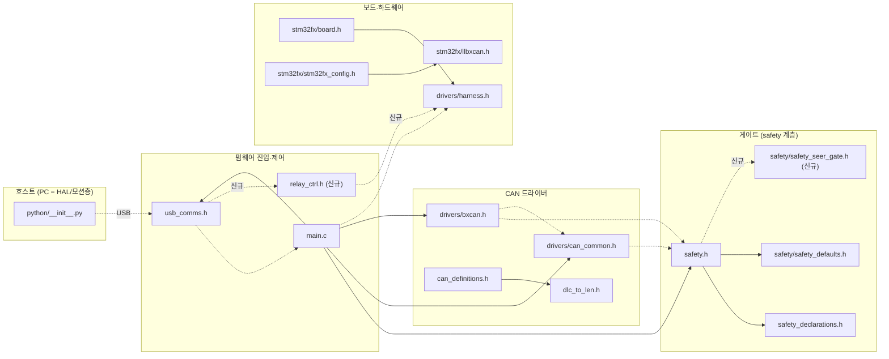
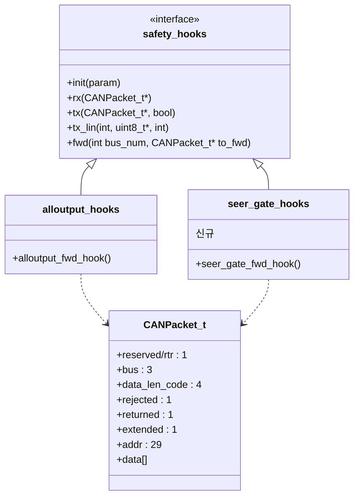
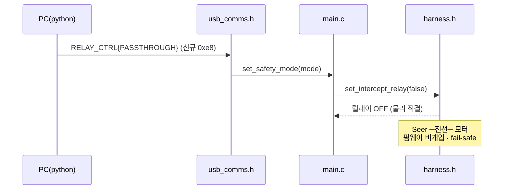
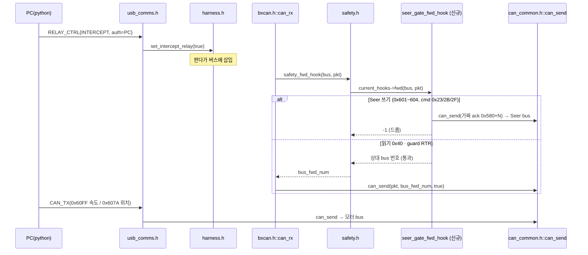

## 2026-07-20 07:40 (KST) — 블랙판다 도킹 릴레이 펌웨어 SW(Software) 구조 (기존 실측 + 신규 제안)

### 분석 범위

- **대상(기존, 실측)**: amap-1 `~/T-Robotics/CAN_Relay/panda` (git HEAD `26524538`) 중 **CAN 릴레이 경로 서브셋**
  — `board/main.c`, `usb_comms.h`, `safety.h`, `safety_declarations.h`, `safety/safety_defaults.h`,
  `drivers/can_common.h`, `drivers/bxcan.h`, `drivers/harness.h`, `can_definitions.h`, `stm32fx/*`
  (차종별 `safety_*.h` 14종은 릴레이 경로와 무관하여 범위 제외 — `safety.h:5-26`)
- **대상(신규 제안)**: 본 프로젝트가 추가할 모듈 — 아직 **미존재**이므로 `file:line` 없이 `신규` 로 표기
- 산출물 분기: **파일 그래프 + 클래스(구조체 vtable) 관계도 + 시퀀스** 모두
- 근거: 본 세션 grep 실측 (2026-07-20). 프로토콜은 `docs/can_relay/usb-can-mapping-table.md`

---

### ① 파일 의존 그래프

실선 = 기존(실측) · 점선 = 신규 제안

> 점선 중 `usb_comms.h -.-> main.c` 등은 **호출**(include 아님) — ④ 관계표 참조.

---

### ② 클래스 관계도 (C 구조체 vtable — 클래스 대체)

C 코드라 클래스는 없으나, `safety_hooks` 가 **함수 포인터 테이블(vtable)** 로 인터페이스 역할을 하므로 이를 클래스로 표기한다.

- `current_hooks` 포인터가 런타임에 어느 구현을 가리키는지로 동작이 갈린다 (`safety.h:63,67,75`).
- **신규 `seer_gate_hooks` 가 본 프로젝트의 게이트** — `alloutput_hooks` 와 동일 인터페이스로 끼워 넣는다.

---

### ③ 시퀀스 다이어그램

#### 시나리오 A — 노드 이동 (passthrough, Seer 직결)

#### 시나리오 B — 도킹 (intercept + 게이트, PC 구동)

---

### ④ 연결 관계표

**기존 (실측)**

| # | source | → | target | 관계 종류 | 위치 |
|---|--------|---|--------|----------|------|
| 1 | main.c | → | config.h | include | main.c:2 |
| 2 | main.c | → | drivers/usb.h | include | main.c:5 |
| 3 | main.c | → | power_saving.h | include | main.c:12 |
| 4 | main.c | → | safety.h | include | main.c:13 |
| 5 | main.c | → | drivers/can_common.h | include | main.c:15 |
| 6 | main.c | → | drivers/bxcan.h | include | main.c:20 |
| 7 | main.c | → | usb_comms.h | include | main.c:25 |
| 8 | safety.h | → | safety_declarations.h | include | safety.h:1 |
| 9 | safety.h | → | safety/safety_defaults.h | include | safety.h:4 |
| 10 | can_definitions.h | → | dlc_to_len.h | include | can_definitions.h:1 |
| 11 | stm32fx/board.h | → | drivers/harness.h | include | stm32fx/board.h:8 |
| 12 | stm32fx/stm32fx_config.h | → | stm32fx/llbxcan.h | include | stm32fx/stm32fx_config.h:80 |
| 13 | usb_comms.h | → | main.c::set_safety_mode | call | usb_comms.h:276 |
| 14 | main.c::set_safety_mode | → | harness.h::set_intercept_relay | call | main.c:116 |
| 15 | main.c | → | main.c::set_safety_mode | call | main.c:377 |
| 16 | main.c (heartbeat 손실) | → | main.c::set_safety_mode(SILENT) | call | main.c:241 |
| 17 | bxcan.h::can_rx | → | safety.h::safety_fwd_hook | call | bxcan.h:188 |
| 18 | bxcan.h::can_rx | → | can_common.h::can_send | call | bxcan.h:199 |
| 19 | bxcan.h::can_rx | → | safety.h::safety_rx_hook | call | bxcan.h:202 |
| 20 | bxcan.h::can_rx | → | can_common.h::can_push | call | bxcan.h:206 |
| 21 | bxcan.h::process_can | → | can_common.h::can_pop | call | bxcan.h:146 |
| 22 | can_common.h::can_send | → | safety.h::safety_tx_hook | call | can_common.h:227 |
| 23 | safety.h::safety_rx_hook | → | safety_hooks.rx | call | safety.h:63 |
| 24 | safety.h::safety_tx_hook | → | safety_hooks.tx | call | safety.h:67 |
| 25 | safety.h::safety_fwd_hook | → | safety_hooks.fwd | call | safety.h:75 |
| 26 | alloutput_hooks | → | safety_hooks | inherit | safety_defaults.h:86-91 |
| 27 | alloutput_hooks | → | CANPacket_t | depend | safety_defaults.h:70 |
| 28 | harness.h::harness_init | → | harness.h::set_intercept_relay | call | harness.h:91 |

**신규 제안 (미존재 — 위치 미정)**

| # | source | → | target | 관계 종류 | 위치 |
|---|--------|---|--------|----------|------|
| N1 | safety.h | → | safety/safety_seer_gate.h | include | 신규 |
| N2 | seer_gate_hooks | → | safety_hooks | inherit | 신규 |
| N3 | seer_gate_hooks | → | CANPacket_t | depend | 신규 |
| N4 | usb_comms.h | → | relay_ctrl.h | call | 신규 (vendor request `0xe8`/`0xe9` — 미사용 번호 실측 확인) |
| N5 | relay_ctrl.h | → | harness.h::set_intercept_relay | call | 신규 |
| N6 | seer_gate_fwd_hook | → | can_common.h::can_send | call | 신규 (가짜 ack 합성) |

---

### ⑤ 구조 관찰 (사실만)

- 순환 의존: 파일 include 그래프상 **순환 없음**. 단 호출 레벨에서 `can_common.h ↔ safety.h` 상호 참조 존재
  — `can_common.h::can_send → safety_tx_hook`(can_common.h:227) ↔ `safety.h` 가 `CANPacket_t`(can_definitions.h 정의)에 의존.
  헤더 단일 번역단위(unity build)로 해소됨.
- 고립 노드: 범위 내 고립 없음.
- 진입점:
  1. `main.c::main()` — 부팅
  2. `usb_comms.h` 제어전송 핸들러 — 호스트 명령 (in-degree 는 USB 인터럽트)
  3. `bxcan.h::can_rx()` / `process_can()` — CAN 인터럽트 (**게이트가 여기 붙음**)
- fan-in/out 상위: `safety.h`(fan-in 4: main.c·bxcan.h×2·can_common.h) · `can_common.h`(fan-in 3) · `harness.h`(fan-in 3: main.c·board.h·자기 91행)

---

### 구조상 확인된 설계 정합 / 보완 필요

1. **게이트 삽입 지점이 이미 존재** — `safety_hooks.fwd` 가 `can_rx` 인터럽트에서 호출(bxcan.h:188)되고
   반환값 `-1`=드롭 / `bus 번호`=전달. 별도 릴레이 루프를 만들 필요 없음.
2. **⚠ RTR 필드 부재** — `CANPacket_t` 에 rtr 없음. §① `candefs` 노드에 `reserved:1 → rtr:1` 전용 패치 필요
   (TX `bxcan.h:149`, RX `bxcan.h:180-183`, fwd `bxcan.h:195-199`, `python/__init__.py:29-90` 4지점).
3. **⚠ `set_safety_mode` 에 릴레이가 종속됨** — 현재 릴레이 전환이 safety mode switch(main.c:87-130) 안에 묶여 있어
   `ALLOUTPUT=intercept 강제`(main.c:116). **릴레이 제어를 safety mode 와 분리**해 `relay_ctrl.h` 로 독립시켜야
   passthrough↔intercept 동적 전환이 가능.
4. **✓ heartbeat 손실 → 릴레이 OFF = 의도적 fail-safe (사용자 확정 2026-07-20)** — heartbeat 손실 시
   `set_safety_mode(SAFETY_SILENT)`(main.c:240-241) → `set_intercept_relay(false)` → 릴레이 OFF. **버그 아닌 설계 원칙**:
   PC(호스트)가 죽거나 USB 가 끊기면 판다가 자동 passthrough 복귀 → Seer 에게 제어권 자동 반환.
   - ⚠ 2026-07-25 실차 반증(field-record-orin-nx-2026-07-25.md:288-294): 0xf3 능동 전송이 게이트 누출의 근본원인으로 확정. 현행 게이트 운용은 0xf3 미전송(hb_on=False)이 정답이며 heartbeat 는 게이트 동작에 불필요. PC 사망 대비 heartbeat 재도입은 단일스레드 인터리브/전송확인 재설계(debt-004) 후에만.
   - **timeout 임계 (소스 확정 ✓)**: ignition ON `HEARTBEAT_IGNITION_CNT_ON = 5`(main.c:156) / OFF `= 2`(main.c:157),
     카운터 1/초 증가(main.c:197-198). → **약 5초(ON)/2초(OFF)** 무전송 시 자동 반환.
   - **설계 반영**: 도킹 중 **PC 는 5초 이내 주기로 heartbeat(`0xf3`) 전송**해야 intercept 유지. 중단 = 자동 반환(fail-safe).
   - **⚠ 현재 테스트 펌웨어와 정면 충돌**: `main.c:396 heartbeat_disabled = true;  // CAN-Relay: SILENT 복귀 방지` 로
     07-18 테스트 때 fail-safe 를 **꺼둔 상태**. 본 설계는 반대로 **켜야** 함 → 이 줄 원복 + PC heartbeat 송신 루프 추가.
   - **검증 필요**: heartbeat timeout 시점에 게이트가 깨끗이 원복(가짜 ack 중단·미완 프레임 없음)되는지.

---
