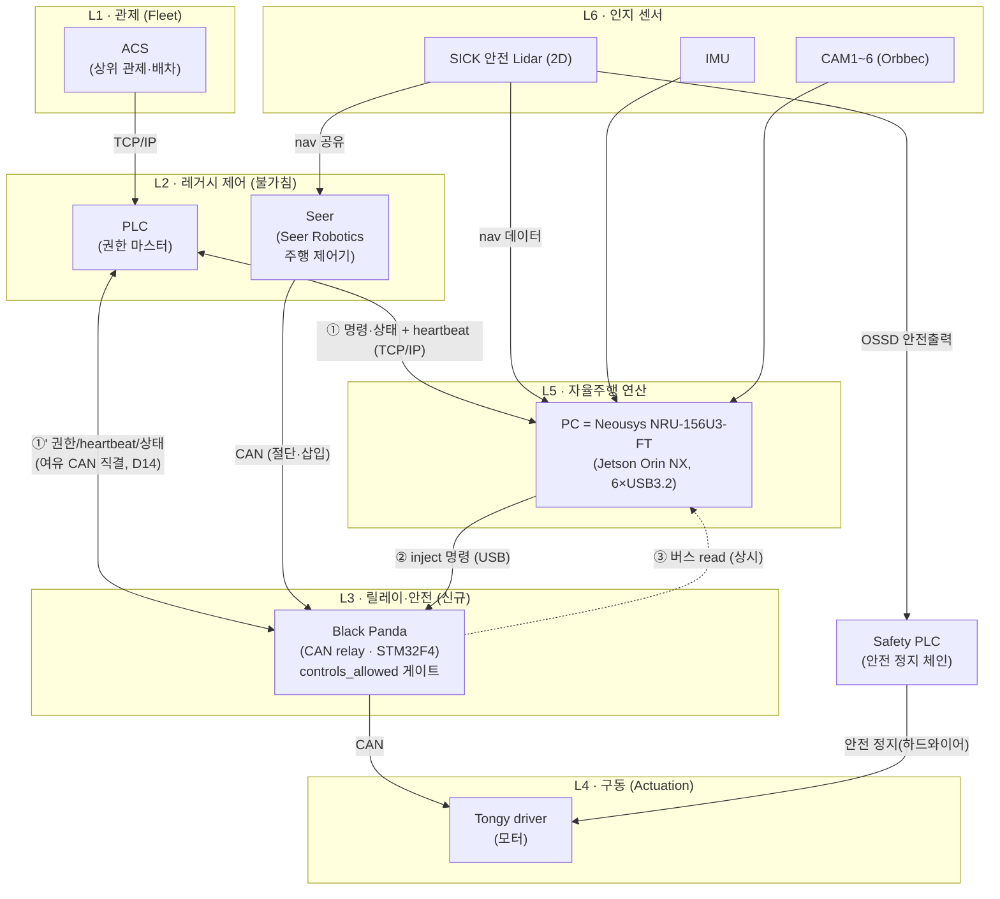
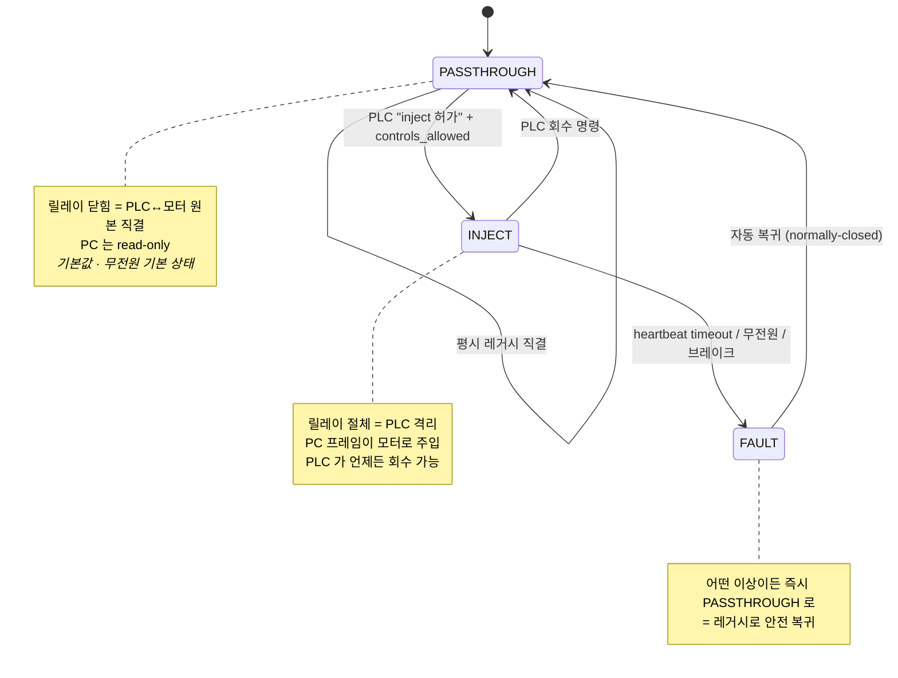
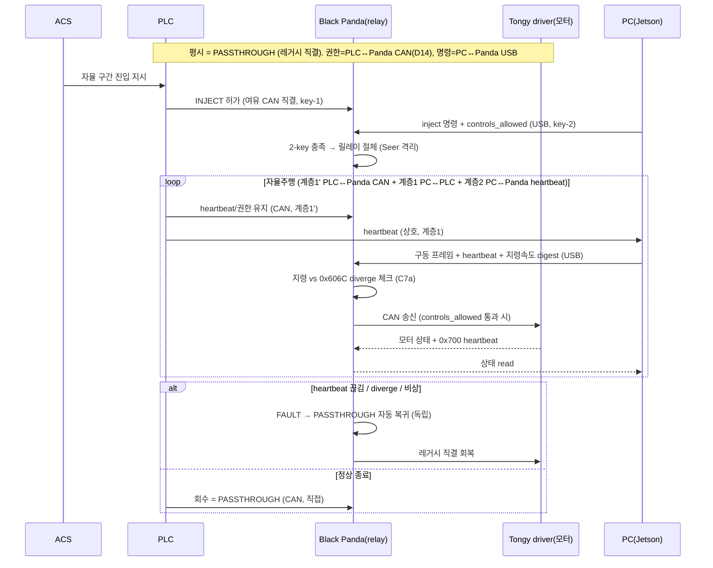
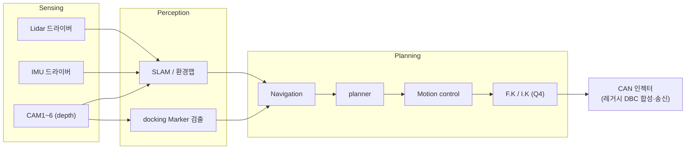

# CATL-Ford CAN-Relay — 전체 시스템 아키텍처 (재설계)

> 2026-06-27 03:12 (KST) 작성. 화이트보드 손그림 + 누적 결정 사항을 정식 구조로 재정리.
> 본 문서는 **하드웨어+소프트웨어 시스템 설계**라 SW 구조 SOP(코드 grep 기반)와 형식이 일부 다르다(아직 코드 없음). 코드 확정 후 코드 레벨 구조도로 갱신.

---

## 0. 한 줄 요약

레거시 AGV(Automated Guided Vehicle) 제어 체인(ACS→PLC→**Seer**→AMR 모터)은 **불가침**으로 두고, 그 Seer↔모터 CAN 구간에 **Black Panda(CAN relay)** 를 인라인 삽입해 자율주행 PC(Personal Computer)를 **종속 주행원**으로 얹는다. **모드 권한은 PLC(Programmable Logic Controller) 소유**, **fail-safe 는 릴레이 하드웨어**.

> 명칭: 화이트보드의 "T-driver" = **Seer(Seer Robotics 주행 제어기)**, "Tongy driver" = **AMR 모터(Tongy QD wheel)**. 현 체인 = `ACS → PLC → Seer → AMR(motor)`.
> **현 상태 문제(D9)**: 이중화·독립 검증이 없어 **무조건 Seer 를 신뢰**한다 — Seer 가 틀려도 잡을 수단이 없음. 본 프로젝트의 릴레이+PC 가 그 **독립 감시 채널**을 신규 추가한다.

---

## 1. 누적 확정 사항 (결정 로그)

| # | 결정 | 근거/출처 |
|---|------|-----------|
| D1 | 레거시 체인 ACS→PLC→Seer→AMR(motor) 는 수정하지 않는다 (리트로핏) | 사용자 02:48 |
| D9 | 현 체인은 이중화 없이 **무조건 Seer 신뢰** → 릴레이+PC 가 독립 감시 채널 신규 추가 | 사용자 04:53 |
| D10 | **정정(08:18)**: 안전 정지 = **SICK 안전 Lidar → Safety PLC → 모터 드라이버 정지** (인증 안전 체인, **Panda·연산과 독립**). ⚠ 이전 "OSSD→Panda 하드와이어" 표기는 **미지시 assistant 추정 오류 → 철회** | 사용자 08:18 정정 |
| D11 | **Seer = 기본 내비(동결), PC = 추가 자율기능 + Seer 감시 + 자율 시 주행 대체** (§2.5) | 사용자 05:25 |
| D11' | Seer 펌웨어 **보유·분석 가능** (비공개·수정불가 전제 정정) — 동결 원칙은 유지 | 사용자 05:35 |
| D12 | **카메라 3D 충돌 회피 = 6 카메라 1차 목적** — 2D Lidar 가 못 보는 상대 AGV 적재물 검출·정지 (PC, 비안전 best-effort, 안전 Lidar→Safety PLC 정지 체인과 별개 보강) | 사용자 05:48 |
| D13 | ~~PLC↔Panda 직결 없음~~ → **D14 로 갱신**. (당시) 연결 링크 = PC↔PLC(TCP/IP)+PC↔Panda(USB), heartbeat 1차=PC↔PLC | 사용자 06:00·06:03 |
| D15 | **Tongy 드라이버 = CANopen 버전 확정**(06:55) → Seer↔모터 = classic CAN → **Black Panda 적합 최종 확정** (EtherCAT 분기 제거) | 사용자 06:55 |
| D16 | **PC = Neousys NRU-156U3-FT 선정**(Jetson Orin NX + 6×USB3.2, Q6 종결) | 사용자 07:10 |
| D16' | **카메라 = Orbbec Gemini E ×6 (RGBD, 모델 G102200000) — 최종 확정(07:25, 6대 전부 E, E-Lite 혼용 없음)**. USB2.0, 깊이 카메라 내 MX6000 | 사용자 07:18·07:25 |
| D17 | (리스크) Gemini E **동작온도 10~40°C 협소** → 산업 AGV 환경 초과 가능, 설치환경 확인·방열 대책 필요(Q3c) | DS p5 ✓ |
| D14 | **PLC CAN ↔ Panda 여유 CAN 직결 추가.** Black Panda 트랜시버 4개(읽기 3버스, `black.h:9-26`)라 Seer↔모터 절체 후 **여유 CAN 버스로 PLC 와 직결** → 권한/heartbeat/상태를 **PC 비의존**으로 PLC↔Panda 직접 교환. inject = **2-key(PLC 허가 via CAN + PC 명령 via USB)** | 사용자 06:18 |
| D2 | CAN relay = 화이트보드의 `CAN Robot` 박스 (× = 기존 CAN 절단·인라인 삽입) | 확대 이미지 02:55 |
| D3 | 모드 권한(passthrough/inject 토글)은 **PLC** 가 가진다, PC 는 종속 | 사용자 03:00 |
| D4 | fail-safe 는 릴레이 하드웨어: 무전원 시 passthrough 복귀 + heartbeat 워치독 | ~~안전 설계, Black Panda 펌웨어 일치~~ → ⚠ **2026-07-27 감사 정정(근거없음)**: '펌웨어 일치' 라는 주장만 있고 file:line 이 없었다. 실재 근거로 교체 — **heartbeat 워치독 부분**: `Tools/Can_Relay/panda-firmware/board/main.c:236-238`(heartbeat 타임아웃 판정) → `:253-254` `set_safety_mode(SAFETY_SILENT, 0U)` → `:88-89` `case SAFETY_SILENT: set_intercept_relay(false)`, 추가로 `:257-262` CAN-Relay fail-open 이 직접 `set_intercept_relay(false)`. **부팅 기본 passthrough**: `board/drivers/harness.h:90-91` `// keep busses connected by default` → `set_intercept_relay(false)`. ⚠ **'무전원 시' 는 코드로 증명되지 않는 하드웨어 속성이므로 '미검증 HW 가정' 으로 분리**(실측 = 전원 차단 후 릴레이 도통 확인 필요). 또 「heartbeat 소실 → **passthrough** 복귀」라는 표현 자체는 `docs/verified_facts/2026-07-27.md:133`(§A-5)가 **부정확**으로 판정했다(실제 = `SAFETY_SILENT` 진입, 그 결과로 릴레이 OFF). |
| D8 | **현 시스템엔 이중화·heartbeat·주행검증이 없음** → 본 프로젝트가 heartbeat/health 를 **신규 도입**(릴레이가 제공), 이중화는 별도 결정 | 사용자 04:38 (현 상태 한계) |
| D5 | CAN relay 하드웨어 = **Black Panda** (classic CAN, STM32F4) | 사용자 03:05 |
| D6 | PC 가 inject 할 프레임은 Tongy driver 원본 DBC 포맷을 그대로 흉내 — 공동 코딩 | 사용자 03:05 |
| D7 | "PC" 는 단일 연산 유닛 1대. **후보 3종 중 택1** (HW 선정 진행 중): ① Jetson Orin NX 16G / ② Advantech(산업용 PC) / ③ +1 (미정) | 사용자 04:42 |

### 미해결 (다음 확인 필요)

| Q | 질문 | 영향 |
|---|------|------|
| ~~Q1~~ | ~~Seer↔모터 버스 classic CAN vs CAN-FD~~ → **대체로 해결: Tongy 드라이버 = CANopen CiA301/402 = classic CAN (10k~1Mbps)** ✓ → **Black Panda 적합**. 잔여: 실제 AGV 가 **CANopen 판인지 EtherCAT 판인지** 확인(Q1') | [Handbook V7.0 §6 p133](../../../References/Tongyi-Motor-Controller/manuals/IxLII-IxLs-IxH_Servo_Driver_Handbook_V7.0.pdf) |
| ~~Q1'~~ | ~~CANopen 변형인가 EtherCAT 변형인가~~ → **종결(06:55): CANopen 버전 사용 확정** → **Black Panda(classic CAN) 적합 최종 확정** ✓ | — |
| ~~Q2~~ | ~~PLC→relay 모드 명령 채널~~ → **해결(D14): PLC↔Panda 여유 CAN 직결, 권한 PC 비의존** | — |
| ~~Q9~~ | ~~PLC DO → Panda GPIO E-stop 직결~~ → **보류**: 안전 정지는 Panda 가 아니라 **SICK 안전 Lidar → Safety PLC → 모터** 체인이 담당(D10 정정) | — |
| ~~Q10~~ | **종결(06-29): Safety PLC = 별도의 안전 PLC** (권한 PLC 와 다른 유닛). 안전 체인 = 안전 Lidar → **별도 Safety PLC** → 모터 정지, 권한/제어 체인과 물리 분리 | 사용자 06-29 |
| ~~Q3~~ | **종결**: CAM1~6 = Gemini E(RGBD)=USB2.0, 권장 config depth+color@30 ≈ 294 Mbps/대. NRU 6 포트 full-bandwidth 로 ~~**6대 무경합 확정(Q3b ✓)**~~ → ⚠ **2026-07-27 감사: 무경합 부분은 미판정으로 하향**(Q3b 행 정정 참조 — 근거는 USB3.2 대역뿐, USB2.0 컴패니언 호스트 분리는 미확인. `:290` 와 모순) | ✓ [Gemini E DS p5-6](../../../References/orbbec/gemini-e-lite/Gemini_E_E-Lite_Datasheet_V1.0.pdf) |
| Q3b | ~~NRU USB2 호스트 토폴로지~~ → ~~**종결(07:35)**: DS 확인 — 카메라 포트 = **2×USB3.2 Gen2(10G)+4×Gen1(5G), "full-bandwidth each port"**(포트별 전용). USB2 하위호환이라 **6 Gemini E(≈294 Mbps/대) 무경합 성립**. 잔여(TT 부품레벨 100% 확정)는 실무상 안전~~ → ⚠ **2026-07-27 감사: 「종결」 을 「미판정」 으로 하향**(같은 문서 내 모순). 확보된 근거는 **USB3.2 포트 링크 대역**뿐이고, `full-bandwidth each port` 는 **USB 2.0 컴패니언 호스트 토폴로지**에 대한 서술이 아니다. 본 행 스스로도 "잔여(TT 부품레벨 100% 확정)" 가 남았음을 인정한다. 같은 문서 `:290`(정정 반영 후 기준) 는 정반대로 **아직 확인 필요**라고 적고 정정되지 않았다 — "6대를 NRU 의 6 포트가 각각 **독립 USB2 호스트**로 받아야 무경합. 1 호스트 공유면 6×294=1.76 Gbps ≫ USB2 → 병목. NRU 데이터시트로 USB2 토폴로지 확인 필수." **어느 쪽이 참인지 본 감사로는 판정 불가** → `:290` 의 확인 필요 문장을 **유효로 유지**한다. **판정에 필요한 측정**: NRU 실기에서 `lsusb -t` 로 USB2 버스 트리(호스트 컨트롤러별 포트 귀속) 확인 + Gemini E 6대 동시 depth+color@30 스트리밍 시 프레임 드랍·타임스탬프 지터 계측. | ~~✓~~ **보류** [NRU DS p1-2](../../../References/neousys/nru-156u3-ft/NRU-154PoE-156U3-FT_Datasheet.pdf) |
| Q3c | Gemini E **동작온도 10~40°C** vs 실제 AGV 설치환경 온도 — 초과 시 방열 대책 | 카메라 신뢰성 |
| Q4 | 차체 운동학 (차동/메카넘/스티어/관절) — F.K·I.K 존재 이유 | 모션 제어 스택 형태 |
| Q5 | `CAN Robot` 박스가 Black Panda 단독인가, 추가 CAN 노드와 공존인가 | 버스 토폴로지 |
| ~~Q6~~ | ~~PC 후보 3종 중 선정~~ → **종결(07:10): PC = Neousys NRU-156U3-FT** (rugged Jetson Orin NX + 6×USB3.2, D16) | — |
| ~~Q7~~ | ~~IMU 도 Seer 가 쓰는가~~ → **해결: IMU = PC 전용(05:08)** → Seer 감시의 진짜 diverse 채널 확정 | — |
| Q8 | **Lidar 공유 토폴로지** (Seer 소유+PC tap / 스플리터 / 네트워크 멀티캐스트) | 배선·독립성·대역폭 |

---

## 2. 계층 모델 (Layered Architecture)



핵심: **모든 구동 명령은 Black Panda 한 점을 통과**한다. PLC↔PC 가 명령·상태·heartbeat(①), **PLC↔Panda 가 여유 CAN 으로 권한·heartbeat·상태를 PC 비의존 직결(①', D14)**, PC 는 inject 명령을 USB 로(②), 상태는 항상 read(③). **inject 는 2-key** — PLC 허가(CAN ①') **그리고** PC 명령(USB ②)이 동시 충족해야 절체. **안전 정지는 Panda 와 무관한 별도 체인**: SICK 안전 Lidar → Safety PLC → 모터 드라이버 정지(D10 정정).

---

## 2.5 역할 정의 — Seer vs PC (책임 경계, D11)

> 사용자 지시(05:25): "Seer 의 역할을 정확히 define. **추가 기능은 PC 에서 구현**. **PC 는 감시 기능도 포함**."

### Seer (= SEER Robotics SRC 컨트롤러) — 베이스라인 (동결하되 분석 가능)
[References/Seer-Driver/README.md](../../../References/Seer-Driver/README.md), [sources.md](../../../References/Seer-Driver/sources.md) 근거. RoboKit 구동.

> **펌웨어 보유·분석 정정(D11', 05:35)**: SEER 의 *공개* GitHub 에는 코어 펌웨어가 없으나(API/SDK 만), **본 프로젝트는 Seer 펌웨어를 보유하고 분석 가능**하다. 따라서 Seer 는 순수 블랙박스가 아니다 — **Seer↔모터 CAN 프로토콜·명령 거동·heartbeat 를 펌웨어 분석으로 직접 규명** 가능(버스 스니핑에만 의존하지 않음). → Q1'·C1 을 분석으로 단축(신규 C9).
> 단 **동결 원칙(D1)은 유지**: 분석은 하되 *수정으로 인한 레거시 거동 변경은 지양*(리트로핏). 수정 필요가 생기면 별도 ADR 로 승인.

**Seer 가 소유(담당)하는 것 — 그대로 둔다:**
| 기능 | 내용 | 근거 |
|------|------|------|
| 측위/localization | SLAM·QR·레이저 반사판·NFL (±5mm/±1°) | ✓ Seer README §1·2 |
| 경로계획/navigation | 태스크→경로 생성 | ✓ |
| 모션 모델 운동학 | 차동/단일·이중 스티어링 휠 → 휠 속도 산출 | ✓ |
| 구동 명령 출력 | CANopen 으로 Tongy 드라이버에 속도/제어 하달 | ✓ (Tongy=CiA402) |
| 상위 인터페이스 | PLC 로부터 태스크 수신(TCP) | ✓ |

→ **Seer 는 "검증된 기본 내비게이션 엔진"으로 동결.** 본 프로젝트는 Seer 내부를 건드리지 않는다.

#### 보강 — 조사로 추가 확인된 Seer 기능 (05:42, GitHub·웹, ⓦ)
공식 마케팅·GitHub 조사로 §2.5 초안에서 누락했던 Seer 기능을 보강한다 (검증등급 ⓦ — 1차 매뉴얼 PDF 승격 필요):

| 추가 기능 | 내용 | 감시/통합 시사점 |
|------|------|------|
| **스키딩(미끄럼) 감지·보정** | "optimized skidding detection and solving" — Seer 가 휠 슬립 자체 감지·경로 보정 ⓦ | Seer 가 *내부적으로* 슬립 보정함 → 그래도 **PC 의 IMU 감시는 독립이므로 여전히 유효**(Seer 자기보정은 self-report) |
| **자동 경로 최적화** | 부드러운 주행을 위한 route 자동 최적화 ⓦ | 자율 inject 시 PC 가 동등 품질 보장 필요 |
| **RoboKit 임베디드 APP / Codesys** | RoboKit 프레임워크가 **컨트롤러 내 앱 개발** 지원(HW 가속), F10/R10 은 Codesys(IEC 61131-3) 옵션 ⓦ | "추가 기능=PC" 는 *설계 선택*이지 Seer 의 한계가 아님 — 일부는 Seer 에도 가능(단 D11 대로 PC 우선) |
| **충전 도킹** | 자동 충전(프로토콜/상태/전압 모드), 충전 스테이션 연동 ⓦ | 아래 도킹 구분 참조 |
| **smap 맵 포맷** | `seer-robotics/smap` — Seer 맵 기술 포맷(GitHub 공개) ⓦ | PC 환경맵·docking marker 를 Seer 맵과 정합할 때 인터페이스 |

**PC↔Seer 통합 표면 (NetProtocol TCP, ⓦ)**: Seer 는 NetProtocol(TCP) API 로 외부 연동 — 포트 분리: **19204 상태(state) / 19205 제어(control) / 19206 태스크(task) / 19207 설정 / 19208 커널** ([Robokit_TCP_API_py](https://github.com/seer-robotics/Robokit_TCP_API_py), [smap](https://github.com/seer-robotics/smap)). PC 는 19206 으로 태스크 하달, 19204 로 Seer 상태 read 가능.
> ⚠ **독립성 주의**: 19204 상태는 **Seer 의 self-report** 라 *독립 감시 근거가 아님*. PC 의 독립 감시는 계속 물리 센서(IMU+Lidar+엔코더)로 — Seer API 상태는 참고용.

**도킹 재정리 (05:38 보강)**: Seer/SEER 는 **충전 도킹·컨베이어(롤러) 도킹**(반사판·상태 기반)은 제공하나, 본 프로젝트의 **카메라 marker 기반 정밀 비전 도킹은 SRC 컨트롤러가 제공한다는 근거 없음** → **비전 marker 도킹은 PC 전담(A)이 맞다**(사용자 인지 일치). 단 "Seer 도킹 전무"가 아니라 "*비전 marker* 도킹 전무"로 정밀화.

### PC — 추가 기능 + 감시 (신규 구현 전부)
**원칙: Seer 베이스라인에 *없는* 모든 것은 PC 에 구현한다. PC 는 Seer 를 *감시*까지 한다.**

| 분류 | PC 책임 | 관련 |
|------|---------|------|
| **A. 추가 기능** | Seer 가 못 하는 자율 기능 — 6 카메라 인지, 환경맵 확장, **docking marker 도킹(Seer 미제공 → PC 전담, 05:38)**, **상대 AGV+적재물 3D 충돌 회피(05:48, D12)**, 고급 플래닝/모션, F.K·I.K | C5, C10 |
| **B. 감시(필수)** | Seer 동작 정확성 독립 감시 — IMU(diverse)+Lidar odometry 로 "Seer 명령 vs 실제 거동" 교차 확인, diverge 시 PLC 보고/정지 | C7b |
| **C. 주행 대체** | 자율 구간에서 inject 모드로 Seer 자리 대체 (PLC 허가 시) | C3 |

> **두 역할의 시점 분리**: 평시(passthrough)엔 PC 가 **감시자**(B) — Seer 를 안 믿고 교차검증(D9 해소). 자율주행(inject)엔 PC 가 **주행원**(C)이 되고, 이때 감시는 릴레이(엔코더, 하드 독립) + PLC 가 맡는다(§7.5-1 "감시자=명령 안 하는 쪽").

### 경계 한 줄 요약
```
Seer = 기본 내비게이션(동결)   |   PC = [추가 자율기능] + [Seer 감시] + [자율 시 주행 대체]
```

---

## 3. 모드 상태 기계 (Mode State Machine)

릴레이는 3상태. **권한 전환은 PLC, 강등(degrade)은 하드웨어가 자동.**



- ~~**PASSTHROUGH = 무전원 기본값** (Black Panda 하니스 릴레이 normally pass-through, `References/Black-Panda/02-can-architecture.md` §3 / `black.h:92-104`).~~
  → ⚠ **2026-07-27 감사 정정(근거없음)**: 인용된 **두 근거가 모두 확인되지 않는다**.
  ① `References/Black-Panda/02-can-architecture.md` 는 저장소에 없다 — `find . -name '02-can-architecture.md'` → **0건**, `ls references` → `No such file or directory`.
  ② `Tools/Can_Relay/panda-firmware/board/boards/black.h:92-104` 는 **GPS 모드 분기**(`case GPS_BOOTMODE:` …)와 `black_set_can_mode()` 시작부로 **릴레이와 무관**하다(파일 총 228줄).
  **실재하는 근거로 교체**:
  - **부팅 기본 passthrough(코드로 증명됨)**: `board/drivers/harness.h:90-91` `// keep busses connected by default` → `set_intercept_relay(false)`; 함수 정의 `harness.h:21-34`(`else { puts("switching harness to passthrough (relay off)\n"); }`).
  - **릴레이 핀 배정**: `board/boards/black.h:191-202` `black_harness_config`(`.GPIO_relay_SBU1/2`, `.pin_relay_SBU1 = 10`, `.pin_relay_SBU2 = 11`).
  - 저장소 내 하드웨어 검증 문서: `docs/can_relay/black-panda-hw-verification.md`.
  - ⚠ **「무전원(전원 상실) 시」 부분은 위 코드로 증명되지 않는 하드웨어 속성**이다 → **미검증 가정**으로 표기. 판정에 필요한 측정: **판다 전원 차단 상태에서 하니스 CAN 라인 도통(연속성) 확인.**
- **FAULT 트리거**: PC↔PLC heartbeat 타임아웃(계층1) 또는 PC↔Panda USB heartbeat 타임아웃(계층2), 명령↔실측 diverge, Tongy 0x700 끊김, 릴레이 전원 상실, 비상정지 (§7.6).
- PC 는 어느 상태로도 *스스로* 갈 수 없다 (D3 종속 원칙). **INJECT 는 2-key — PLC 허가(CAN 직결 D14) AND PC 명령(USB) 동시 충족** 시에만 절체.

---

## 4. 시퀀스 — 자율주행 진입/주행/회수



---

## 5. 연결 관계표

| # | source | → | target | 매체/인터페이스 | 비고 |
|---|--------|---|--------|----------------|------|
| 1 | ACS | → | PLC | TCP/IP | 레거시 |
| 2 | PLC | → | Seer | (레거시 내부) | 불가침 |
| 3 | Seer | → | Black Panda | CAN (절단·삽입) | × 지점 |
| 4 | Black Panda | → | AMR 모터(Tongy) | CAN | 구동 출력 |
| 5 | PLC | ↔ | PC | TCP/IP | 명령·상태 + heartbeat (계층1, 실시간 폐루프 금지) |
| 5b | PLC | ↔ | Black Panda | **여유 CAN 직결(D14)** | **권한(inject 허가)/heartbeat/상태** — PC 비의존 |
| 7 | PC | → | Black Panda | USB | inject 명령 + heartbeat |
| 7b | SICK 안전 Lidar | → | Safety PLC | OSSD 안전출력 | 인증 안전 정지 체인 (Panda 무관) |
| 7c | Safety PLC | → | Tongy 모터 | 하드와이어 | 안전 정지 (D10) |
| 8 | Black Panda | ⇢ | PC | USB | 버스 read (상시) |
| 9 | Lidar | → | PC | (Q3) | 인지 |
| 10 | IMU | → | PC | (Q3) | 인지 |
| 11 | CAM1~6 | → | PC | USB3 / GMSL (Q3) | Orbbec, 대역폭 주의 |

---

## 6. PC(Jetson Orin NX) 내부 SW 스택



- **시각동기 미해결**: 6 카메라+Lidar+IMU 는 공통 시간축(HW trigger / PTP) 필요 — SLAM·도킹 정밀도 직결.
- **연산 예산 리스크(Medium, 07:18 RGBD 반영)**: 카메라=**Gemini E(RGBD)=USB2.0**, 깊이는 카메라 내 MX6000 처리(Orin NX 수신만). 대당 스트림(640×480@30): depth 16bit ≈147 + color YUY2 ≈147 + IR 8bit ≈74 = **세 스트림 합 ≈ 368~440 Mbps → USB2.0 실효(≈400) 한계 근접**. → 운용 config 권장 = **depth+color@30(IR off) ≈ 294 Mbps/대**로 여유 확보. ✓ [Gemini E/E-Lite DS V1.0 p5-6](../../../References/orbbec/gemini-e-lite/Gemini_E_E-Lite_Datasheet_V1.0.pdf)
- **⚠ Q3b 중요도 상승**: RGBD 는 대당 대역폭이 커져 **6대를 NRU 의 6 포트가 각각 독립 USB2 호스트로** 받아야 무경합. 1 호스트 공유면 6×294=1.76 Gbps ≫ USB2 → 병목. NRU 데이터시트로 USB2 토폴로지 확인 필수.
- **⚠ 동작온도 10~40°C(D17)**: Gemini E 동작온도가 **10~40°C 로 좁다**. 산업 AGV 환경(여름/설비 발열)이 이를 초과할 수 있음 → 설치 환경 온도 확인 또는 방열·환기 대책 필요. ✓ DS p5.

### 6.1 카메라 3D 충돌 회피 — 6 카메라의 존재 이유 (D12, 05:48)

> 사용자 요구: "카메라로 상대 AGV 감지, 부딪힐 경우 정지. 현재 2D Lidar 는 AGV 위 적재물 크기를 감지 못함."

- **근거(2D Lidar 의 구조적 한계)**: 2D Lidar(Seer·SICK)는 **단일 수평 스캔 평면**만 본다. 그 평면 위/아래로 돌출한 **적재물(짐)·오버행은 비가시** → 짐 실은 상대 AGV 와 충돌 위험을 2D 로는 못 막는다. **이것이 6 depth 카메라를 둔 1차 목적.**
- **PC 담당 기능(C10)**: depth 카메라 6대로 **상대 AGV + 적재물의 3D 점유 공간(occupancy)** 검출 → 충돌 임박 시 **정지 요청**. 360° 커버(6대 배치 이유)로 측·후방 적재물도 포착.
- **안전 등급 한계(정직)**: 이 카메라 정지는 **PC 연산 = 비안전등급(non-SIL)** 의 *best-effort* 충돌 예방이다. 따라서:
  - 1차 정지 백본 = **SICK 안전 Lidar → Safety PLC → 모터 정지**(2D 보호필드, 인증, Panda 무관) — 단 짐 높이는 못 봄.
  - 그 위에 **카메라 3D 충돌 정지(PC, 비안전)** 를 보강 계층으로 적층 → 2D 가 못 보는 적재물 영역을 커버.
  - 정지 지령 경로: 카메라 검출 → PC → 정지 요청. **고신뢰화 시 카메라 정지를 Safety PLC 안전 정지 체인에 연동할지**는 별도 검토(추측 금지 — Safety PLC 입력 가용 여부 확인 필요).
- **시사점**: depth 카메라 해상도·FPS·FOV(Field of View)·배치는 "상대 AGV 적재물 최소 검출 크기·최대 접근 속도"의 정지거리 계산에서 역산해야 함 → Q3 연산 예산과 함께 산정.

---

## 7. 공동 코딩 백로그 (D6)

| # | 항목 | 위치 | 의존 |
|---|------|------|------|
| C1 | ~~Tongy 트래픽 스니핑 → DBC 정의~~ → **대부분 커버**: CANopen 오브젝트 딕셔너리(EDS)·핸드북 확보. inject 핵심 = `0x6040 Controlword` + `0x6081 Profile velocity`, 감시 = `0x606C Velocity_actual`. **잔여 = 실버스 캡처로 보드레이트·Node-ID·활성 PDO 매핑 확정** | EDS + 실버스 캡처 | Q1' |
| C2 | 커스텀 panda safety mode (`controls_allowed` = PLC 허가 기반) | panda 펌웨어 | Q2 |
| C3 | PC 측 프레임 합성·송신 (레거시 DBC 포맷 흉내) | PC 앱 | C1 |
| C4 | PLC→panda 모드 명령 + heartbeat 워치독 | 펌웨어 + 배선 | Q2 |
| C5 | 인지·내비 스택 (SLAM·docking·planner·motion) | PC 앱 | Q3, Q4 |
| C6 | **shadow-mode 로깅·경로 비교 하니스** (inject 전 무위험 주행검증) | PC 앱 + 릴레이 | C1, C3 |
| C7a | **엔코더↔명령 plausibility 감시** (하드 독립, diverge 시 정지) — 릴레이가 CANopen `0x606C Velocity_actual` vs 명령 `0x6081` 비교 | 릴레이 펌웨어 | C1 |
| C7b | **IMU+Lidar odometry 융합 감시** + PLC 보고 (PC 주행 중 독립성) | PC 앱 | C5 |
| C8 | **SICK 안전 Lidar → Safety PLC → 모터 정지 체인 확인·연동** (인증 독립 안전 정지, Panda 무관) | Safety PLC 배선 | D10 |
| C9 | **Seer 펌웨어 분석** → Seer↔모터 CAN 프로토콜·명령 거동·heartbeat 규명 (Q1'·C1 단축) | 펌웨어 RE | D11' |
| C10 | **카메라 3D 충돌 회피** — 상대 AGV+적재물 occupancy 검출 → 정지 (2D Lidar 사각 보강) | PC 인지 + 정지경로 | C5, D12 |
| C11 | **heartbeat 구현** — 계층1 PC↔PLC 앱 heartbeat + 계층2 Panda 백스톱(PC USB/Tongy 0x700/diverge/IWDG) + 의도 digest 대조 (§7.6) | PC 앱 + 릴레이 펌웨어 | C7a |

> 스톡 Black Panda 안전 모드는 차종 전용(크루즈/브레이크/토크 한계, `safety/modes/ford.h`)이라 Tongy 모터엔 안 맞음 → C2 커스텀 필수 (`References/Black-Panda/03-safety-model.md` §2·§4).

---

## 7.5 가용성·이중화·검증 (현 상태 한계 → 신규 도입, D8)

> 현 시스템 한계(사용자 04:38): ① PLC·전체 루프 **이중화 없음**, ② **heartbeat 없음 → health 확인 불가**, ③ **현재 map 주행이 잘 되는지 검증 수단 없음**.

세 가지는 **서로 다른 문제**이므로 분리해 다룬다:

### (1) 이중화 = 동작 정확성의 **상호 감시(monitoring redundancy)** — 하드웨어 중복 아님
> 사용자 정의(04:48): "이중화는 AMR 이 정확히 움직이는지 **상호 감시**해야 한다는 것."

- 즉 여기서 이중화는 *용량 중복(고장 중 주행 지속)*이 아니라, **명령(intended) ↔ 실제(actual) 모션이 일치하는지 독립 채널이 교차 확인**하는 것 = diverse monitoring / 1oo2D 패턴.
- **두 채널**이 같은 모션을 봐야 한다:
  - **채널 A (명령 의도)**: 현재 구동을 명령한 주체(Seer 또는 PC)의 프레임이 의도한 속도/방향.
  - **채널 B (실제 거동)**: **3종 융합** — 모터 엔코더 + IMU + Lidar(odometry/scan matching) (사용자 04:58).
  - 두 채널이 **diverge(불일치)** 하면 → FAULT → 안전 정지. ("명령은 직진인데 실제로 휘었다" 즉시 검출.)

- **채널 B 3종은 연결 위치가 달라 감시 등급(독립성)이 갈린다** — 이게 설계의 핵심:

  | 소스 | 연결 위치 | 릴레이가 직접 읽나 | Seer 와 공유? | Seer 감시 독립성 |
  |------|----------|----------|----------|----------|
  | 모터 엔코더 | Seer↔모터 **CAN 버스 위** | ✅ 직접 | 공유(피드백) | **하드 독립** (릴레이가 실제 거동 직접 측정) |
  | IMU | **PC 전용(05:08)** | ❌ | **Seer 미사용 확정** | **진짜 diverse** (Seer 인지와 독립 관성 측정) — Seer 감시 1순위 독립 채널 |
  | Lidar | PC + **Seer 도 사용(05:03)** | ❌ | ✅ 공유 | **SICK 안전등급·UL 인증 고신뢰 가정(05:13)** → 센서 자체 오류 확률 낮아 common-cause 완화. 단 잔여 common-cause(환경: 유리·반사·연무)는 인증과 무관하게 잔존 |

  > **공통원인(common-cause) 재평가 (D10 가정)**: 명령 주체(Seer)와 감시자가 같은 Lidar 를 보는 우려는, Lidar 가 **SICK 안전등급(SIL2/PLd 급)·UL 인증** 고신뢰면 *센서 하드웨어 고장* 측면에선 크게 완화된다. 남는 것은 (a) **환경성 공통원인**(유리벽·거울·연무 — 인증으로도 못 막음)과 (b) **인증 범위 구분**: SICK 안전 스캐너의 인증은 보통 **보호필드 침입 정지(protective field)** 기능에 적용되지, **odometry/scan-matching 측정 데이터**(우리가 모션 검증에 쓰는 스트림)에까지 자동 적용되진 않는다. → 따라서 Lidar 는 **모션 correctness 의 *독립* 근거로는 여전히 보조**, 그러나 신뢰도는 상향. 검증 무게는 계속 **엔코더 + IMU**.

  > 🟢 **부가 이득 (큰 점)**: SICK 안전 Lidar 는 **그 자체로 인증된 독립 안전정지**(보호필드 침입 → OSSD(Output Signal Switching Device) 안전출력)를 제공한다. 이 OSSD 는 **Safety PLC 로 들어가 모터 드라이버를 정지**시킨다 — Seer·PC·Panda 의 연산과 **무관한** 별도 인증 안전 체인(D10). **백로그 C8: 이 안전 Lidar→Safety PLC→모터 정지 체인 확인·연동.** ⚠ 본 OSSD 가 Panda 로 들어간다는 이전 표기는 미지시 추정 오류였음(D10 정정).

- **감시자는 "지금 명령하는 주체"가 아니어야 한다**(자기 감시 금지). 명령 주체가 바뀌면 감시자도 바뀐다:
  - **passthrough (Seer 주행)**: 감시 = **PC(엔코더+IMU+Lidar) + 릴레이** → Seer 를 독립 검증. ← D9 "Seer 무조건 신뢰" 깨는 지점.
  - **inject (PC 주행)**: 감시 = **릴레이(엔코더, 하드 독립) + PLC** → PC 를 독립 검증.
- 따라서 **엔코더↔명령 plausibility 는 릴레이(Black Panda STM32F4) 펌웨어에 상주**(항상 독립), **IMU+Lidar 융합 검증은 PC 가 수행하되 그 판정을 PLC 로 보고**(PC 주행 중 독립성 확보).
- (2) heartbeat 가 "상대가 **살아있나**(liveness)"라면, 본 상호 감시는 "동작이 **맞나**(correctness)" — 별개의 안전 축. 둘 다 필요.
- → **C7 분할**: C7a = 엔코더↔명령 감시(릴레이 펌웨어, 하드 독립), C7b = IMU+Lidar odometry 융합 감시(PC) + PLC 보고.

### (2) heartbeat / health — 본 프로젝트가 신규 도입
- 현재 없음. → **릴레이(Black Panda STM32F4)가 health 모니터로서 heartbeat 를 신규 제공**한다. 이게 릴레이를 쓰는 부가 이득.
- 양방향 heartbeat 정의: `PLC ↔ Panda`(권한 생존), `PC ↔ Panda`(자율 스택 생존). 어느 쪽이든 끊기면 → FAULT → passthrough/정지.
- 즉 **C4 의 heartbeat 는 "기존 것에 의존"이 아니라 "우리가 만드는 것"** — D4 의 전제를 이렇게 정정한다.

### (3) map 주행 검증 — shadow mode 로 무위험 확보
- inject 하기 **전에**, 릴레이를 passthrough(read-only)로 둔 채 **PC 가 계산한 구동 명령을 송신하지 않고 로그만** 한다 = **shadow mode**.
- 사람/PLC 가 실제 주행하는 동안 PC 의 "계획 경로 vs 실제 경로"를 비교 → **현재 map 에서 주행이 맞는지 0 리스크로 검증**. (comma.ai 가 openpilot 을 검증하는 방식과 동일.)
- shadow 통과 후에만 inject 활성. → **신규 백로그 C6: shadow-mode 로깅·경로 비교 하니스**.

---

## 7.6 Heartbeat / 상호 감시 구현 설계 (05:55)

> ~~**토폴로지 정정 (D13, 06:03)**: **PLC 와 Panda 는 직접 연결되지 않는다.** 물리적으로 연결된 링크는 **PC↔PLC(TCP/IP)** 와 **PC↔Panda(USB)** 뿐(+ Panda 가 앉은 CAN 버스).~~ 따라서 heartbeat 는 릴레이 중심이 아니라 **2계층**으로 본다: 상위(두뇌) PC↔PLC 가 1차, 릴레이는 근육(enforcement).
>
> ⚠ **2026-07-27 감사 정정(반증됨 — 같은 문서 내 모순)**: 위 D13 은 **같은 문서가 이미 철회**했는데 본 §7.6 서두에만 정정 표시 없이 단정형으로 남아 있었다.
> **→ D14(06:18) 로 대체됨: PLC↔Panda 여유 CAN 직결이 있다.**
> 근거(모두 본 문서 내): `:27` "| D13 | ~~PLC↔Panda 직결 없음~~ → **D14 로 갱신**." · `:32` "| D14 | **PLC CAN ↔ Panda 여유 CAN 직결 추가.**" ·
> 바로 아래 본문 `:391` "### 계층 1' — PLC ↔ Panda 권한/heartbeat (여유 CAN 직결, D14, PC 비의존)" · `:447` "[계층1'·권한] PLC ↔ Panda heartbeat/권한 (여유 CAN 직결, D14)". (행번호는 2026-07-27 정정 반영 후 기준)
> 본 서두 문장은 **06:03 시점 기록으로 보존**한다(삭제 아님). 현행 토폴로지는 D14 를 따를 것.

### 계층 1 — PC ↔ PLC 상호 heartbeat (★ 가장 중요, 06:00)
두 의사결정자(권한=PLC, 자율=PC)가 **서로의 생존·health 를 직접 교차 감시**. 기존 TCP/IP 링크 위.
- **PLC→PC**: "권한 살아있음 + 현재 허가 모드"(예 20~50ms). 끊기면 PC 는 *권한 소실* 로 보고 자율 중단.
- **PC→PLC**: "자율 스택 살아있음 + health(인지·감시 상태)". 끊기면 PLC 는 PC 불건전으로 보고 **자율 비허가/회수**.
- TCP 는 재전송·지터로 죽은 피어를 가릴 수 있음 → **애플리케이션 레벨 heartbeat(시퀀스+명시 timeout)**.
- 이건 두 두뇌의 *조율* heartbeat. **권한 자체는 아래 계층 1' 의 PLC↔Panda CAN 으로 PC 비의존 전달**(D14).

### 계층 1' — PLC ↔ Panda 권한/heartbeat (여유 CAN 직결, D14, PC 비의존)
Black Panda 여유 CAN 버스에 PLC CAN 을 물려 **PLC 가 Panda 에 직접**:
- PLC→Panda: **inject 허가/회수**(권한) + heartbeat + (선택) 허가 모드. PC 가 죽어도 PLC 권한은 Panda 에 도달.
- Panda→PLC: 릴레이 상태·diverge 경보·모터 0x700 요약 보고.
- **inject 2-key**: Panda 는 **PLC 허가(CAN) AND PC 명령(USB)** 동시 충족 시에만 절체 → 한쪽만으론 주행 못 함(권한·명령 분리).
- CAN 은 결정적·견고 → heartbeat 매체로 TCP 보다 적합. (단 *최종 안전 정지* 는 Panda/CAN 이 아니라 **안전 Lidar→Safety PLC→모터** 인증 체인이 담당, D10.)

### 계층 2 — 릴레이(Panda) 로컬 enforcement (양 채널 비신뢰 독립 fail-safe)
PLC(CAN)·PC(USB) 어느 쪽 입력도 **Panda 는 무조건 신뢰하지 않고** 자체 백스톱으로 독립 안전을 보장:

| 백스톱 | 메커니즘 | 신규/네이티브 |
|------|----------|----------|
| ~~**PC USB heartbeat**~~ | ~~panda 네이티브 `heartbeat_engaged`. 끊김/`controls_allowed` 불일치 → inject 차단 → passthrough~~ ⚠ **2026-07-27 감사: 인용·메커니즘 모두 틀림(반증됨)** — 아래 두 행으로 분리 | ~~**네이티브** ✓ `safety/safety.h:74`~~ **인용 무효** |
| **PC USB heartbeat ①**<br/>(불일치 경로) | `heartbeat_engaged` ↔ `controls_allowed` **불일치 3회 누적** → `controls_allowed = 0U` (**inject 차단**). **릴레이는 건드리지 않는다.** | 네이티브 · 근거 `Tools/Can_Relay/panda-firmware/board/main.c:222-228`, 선언 `board/main_declarations.h:23-24` |
| **PC USB heartbeat ②**<br/>(타임아웃 경로) | heartbeat **타임아웃**(`HEARTBEAT_IGNITION_CNT_ON/OFF`) → `set_safety_mode(SAFETY_SILENT, 0U)` → `case SAFETY_SILENT: set_intercept_relay(false)` (**릴레이 OFF = passthrough**). 개조 펌웨어는 같은 블록에서 CAN-Relay fail-open 으로 `set_intercept_relay(false)` + `pc_authority = false` 도 수행 | 네이티브+개조 · 근거 `board/main.c:236-238` → `:253-254` → `:88-89`, fail-open `:257-263` |
| **Tongy 0x700** | CANopen 슬레이브 heartbeat(status 0/4/5/127), 주기=obj `0x1017`. 릴레이가 버스에서 소비 → 구동 노드 생존 | **네이티브 소비** ✓ [Handbook §6.4](../../../References/Tongyi-Motor-Controller/manuals/IxLII-IxLs-IxH_Servo_Driver_Handbook_V7.0.pdf) |
| **명령↔실측 diverge** | inject 지령 vs `0x606C Velocity_actual` 비교(C7a) | 신규(펌웨어) |
| **IWDG + normally-closed** | 펌웨어 행 → 칩 리셋 → 릴레이 de-energize → passthrough | 네이티브(STM32) |

> ⚠ **2026-07-27 감사 정정 — 위 'PC USB heartbeat' 원행에 대하여**:
> **(1) 인용 위치가 틀렸다.** `Tools/Can_Relay/panda-firmware/board/safety.h:74` 는 `safety_fwd_hook`/`relay_malfunction` 코드이고 `heartbeat_engaged` 는 그 파일에 **없다**.
> `grep -rn heartbeat_engaged Tools/Can_Relay/panda-firmware/board/` → `main_declarations.h:23,24` · `main.c:222-228` · `usb_comms.h:451` **뿐**.
> **(2) 서로 다른 두 메커니즘을 하나로 합쳐 결과를 잘못 서술했다.** 「불일치 → passthrough」는 성립하지 않는다 —
> 불일치 경로(`main.c:222-228`)는 3회 누적 시 `controls_allowed = 0U` **만** 하고 safety mode·릴레이를 건드리지 않는다.
> 릴레이 OFF(passthrough)는 **별개의 heartbeat 타임아웃 경로**에서만 일어난다(`main.c:236-238` → `:253-254` `set_safety_mode(SAFETY_SILENT, 0U)` → `:88-89` `case SAFETY_SILENT: set_intercept_relay(false)`).
> **(3) 같은 저장소의 검증 기록이 이 서술을 명시적으로 부정한다** — `docs/verified_facts/2026-07-27.md:133`(§A-5):
> "여러 문서·주석에 있던 「heartbeat 소실 시 fail-safe **passthrough** 복귀」는 **부정확**하다. SILENT 로 간다."
> **「✓ 네이티브」 검증 표시는 재대조 전까지 보류**로 둔다(위 ①②행의 근거는 2026-07-27 본 감사에서 `Tools/Can_Relay/panda-firmware` 로컬 판본과 직접 대조함).

> 즉 **PLC(CAN)·PC(USB) 어느 쪽이 거짓이어도** Panda 의 diverge·heartbeat·IWDG 가 이상을 잡아 passthrough 로 떨군다 → **2-key + 독립 백스톱** 의 다중 방어. (예: PC 가 허가를 위조해도 PLC CAN 허가가 없으면 절체 안 됨; 양쪽이 다 속여도 diverge/0x700/IWDG 가 잡음.)
> **하드 안전 정지** 는 Panda/CAN 과 독립한 **SICK 안전 Lidar → Safety PLC → 모터** 인증 체인(D10)이 담당 — 최종 정지는 Panda 가 아니라 Safety PLC.

### liveness → correctness 로 승격 (상호 감시 = heartbeat + 의도 digest)

순수 heartbeat 는 "살아있나"만 본다. **heartbeat 페이로드에 의도(intent) digest 를 실어** "맞나"까지 한 번에 검사:
- PC→Panda heartbeat 에 **현재 지령 속도 + 시퀀스 카운터**를 동봉 → Panda 가 CANopen `0x606C Velocity_actual` 과 비교(C7a). 불일치(diverge) → 정지.
- PC↔PLC heartbeat 에 **현재 허가 모드**를 실어 양측이 합치 확인, PC→Panda USB heartbeat 의 `heartbeat_engaged` 와 Panda 의 `controls_allowed` 도 합치 확인(panda 의 `heartbeat_engaged_mismatches` 와 동형) → 불일치 시 차단.
- **anti-stale**: 모든 heartbeat 에 증가 카운터(또는 CANopen nodeguard toggle 비트) → *멈춘 송신기가 마지막 프레임을 반복*하는 경우도 검출(침묵 + 정체 동시 커버).

### timeout 계층 + 정지 동작

| 끊긴 링크 | 계층 | timeout(권장) | 동작 |
|-----------|------|----------|------|
| **PLC↔Panda heartbeat (CAN)** | 1'(★) | ≈ 60~100ms | 권한 상실 → Panda inject 차단 → passthrough (**PC 비의존**) |
| PC↔PLC heartbeat (TCP/IP) | 1 | ≈ 100~150ms | PLC: 자율 회수 / PC: 자율 중단 |
| PC USB heartbeat (→Panda) | 2 | 3×주기 ≈ 60~100ms | Panda inject 차단 → passthrough |
| Tongy 0x700 (버스) | 2 | object 0x1017 × 3 | 구동 노드 fault → 비상 정지 |
| 명령↔실측 diverge | 2 | 즉시(수 사이클) | Panda 정지 (C7a) |

> 모든 timeout 은 **최악 지터 < timeout < 안전 반응시간**. heartbeat 주기 20~50ms, timeout 3× 가 출발점 — 정지거리 실측으로 확정.

### 누가 감시자를 감시하나 (릴레이 자기 보호)
- **STM32 IWDG**(Independent Watchdog) — 릴레이 펌웨어가 행(hang)이면 칩이 리셋 → 릴레이 코일 de-energize → **passthrough 자동 복귀**(normally-closed, D4). heartbeat 로직 자체의 고장도 안전측으로 떨어진다.

### 한 줄 요약
```
[계층1'·권한] PLC ↔ Panda heartbeat/권한 (여유 CAN 직결, D14) — PC 비의존, inject 2-key 의 한 축
[계층1 ·조율] PC ↔ PLC heartbeat (TCP/IP) — 두 두뇌 상호 감시, inject 2-key 의 다른 축(PC 명령)
[계층2 ·독립] Panda 가 PLC(CAN)·PC(USB) 둘 다 비신뢰 + Tongy 0x700 + diverge + IWDG 로 fail-safe
   삼각 연결(PLC↔PC, PLC↔Panda, PC↔Panda) — 권한·명령 분리, 단일 노드 고장에 강함.
```
→ 신규 백로그 **C11: heartbeat 구현**(계층1' PLC↔Panda CAN + 계층1 PC↔PLC + 계층2 Panda 백스톱 + 의도 digest + IWDG).

---

## 7.7 선례 검증 — openpilot 과 동일 구조 (06:10)

> 사용자: "panda 를 쓰는 openpilot 도 동일 구조." → 본 설계는 검증된 양산 아키텍처와 1:1 대응 (검증 근거, [Black-Panda/03-safety-model.md](../../../References/Black-Panda/03-safety-model.md) §1).

| openpilot | 본 프로젝트 | 공통 원리 |
|-----------|------------|----------|
| comma C3 (host, 신경망 연산) | **PC** | 메인 연산 = **안전 비의존** (신뢰 안 함) |
| **panda** | **Black Panda** (동일 HW) | 독립 MCU 가 `controls_allowed` 로 TX 게이트 |
| 차량 stock ECU/카메라 | **Seer** (레거시) | relay 가 그 앞단을 절체·격리 |
| host→panda USB heartbeat | PC→Panda USB heartbeat | 끊기면 disengage |
| panda 가 **차량 CAN 읽어** 상태 게이트 | Panda 가 **Seer↔모터 CAN 읽어** 게이트 | 전용선 없이 *버스 가시성*으로 판단 |
| relay normally pass-through | 동일 | 무전원→레거시 |

**핵심 시사 1 — 우리는 openpilot 보다 권한 채널이 강하다(D14)**: openpilot 은 권한 주체가 *사람*이라 panda 로의 권한선이 불가능, 운전자 조작을 panda 가 CAN 에서 *읽는* 데 그친다. 우리는 권한 주체가 **PLC(CAN 보유)** 라 → **PLC↔Panda 여유 CAN 직결(D14)로 권한을 PC 비의존·양방향으로 직접 전달** 가능 = openpilot 보다 한 단계 강한 권한 분리. (단 *최종 안전 정지* 는 Panda/CAN 이 아니라 안전 Lidar→Safety PLC→모터 체인 — 시사 2.)

> ⚠ **핵심 시사 2 — 무인(unmanned) 차이(정직)**: openpilot 안전의 마지막 보루는 **사람(brake 즉시 정지·hands-on)**. 우리 AGV 는 **무인** → 그 운전자 오버라이드 계층이 **없다**. 그 대체 = **SICK 안전 Lidar → Safety PLC → 모터 정지 인증 체인(D10)** — Panda·연산과 독립한 별도 안전 계층이 "운전자의 발"을 맡는다. 카메라 충돌정지(D12)·상호감시(C7)가 보강.

**결론**: ① 권한 채널 = **PLC↔Panda 여유 CAN(D14)** 채택 — openpilot 대비 강화. ② ~~Q9(별도 디지털 E-stop 선)~~ 은 불요. ③ **무인 대체 안전 = SICK 안전 Lidar→Safety PLC→모터 정지 체인(D10/C8)** — Panda 와 독립. (Safety PLC 가 권한 PLC 와 동일/별도인지는 Q10 확인.)

---

## 8. 구조 관찰 (사실만)

- **단일 통과점**: 모든 구동 명령이 Black Panda 1점을 지난다 (의도된 mux·단일 안전 게이트).
- **권한/안전 이중화**: 권한=PLC(논리), fail-safe=릴레이 하드웨어(물리) — 서로 독립.
- **PC 단일 연산 노드**: 인지·판단·구동 합성이 NX 하나에 집중 (연산 단일점, 안전은 D4 로 분리됨).
- ~~**미해결 5건(Q1~Q5)** 이 하드웨어 선택(Q1)·배선(Q2)·예산(Q3)·스택 형태(Q4)·토폴로지(Q5)를 가른다.~~
  → ⚠ **2026-07-27 감사 정정(같은 문서 내 모순)**: 같은 문서의 미해결 표가 **Q1·Q1′·Q2·Q3 를 모두 종결 처리**했다 —
  `:45` "~~Q1~~ … → **Black Panda 적합**" · `:46` "~~Q1′~~ … **종결(06:55)**" · `:47` "~~Q2~~ … **해결(D14)**" · `:50` "~~Q3~~ … **종결**".
  **2026-06-27 표 기준 실제 잔여 = Q3c(`:52`) · Q4(`:53`) · Q5(`:54`) · Q8(`:57`) 4건.**
  단 Q3b(`:51`)는 본 감사에서 '종결' → **미판정으로 하향**했으므로(같은 행 정정 참조) 실질 잔여는 **Q3b 포함 5건**이다.

---

## 9. 다음 액션

1. ~~**Q1(CAN classic/FD)** 확인 → Black Panda vs Red Panda 확정.~~ → ⚠ **2026-07-27 감사: 이미 종결된 항목**(`:45-46`, D15 CANopen=classic CAN → Black Panda 확정).
2. ~~**Q2(모드 채널)** 확정 → C2·C4 착수 가능.~~ → ⚠ **2026-07-27 감사: 이미 종결된 항목**(`:47`, D14 PLC↔Panda 여유 CAN 직결).
   → **갱신된 다음 액션**: 잔여 Q3b(NRU USB2 호스트 토폴로지 실측) · Q3c(Gemini E 동작온도) · Q4(차체 운동학) · Q5(CAN 버스 토폴로지) · Q8(Lidar 공유 토폴로지).
3. 본 구조 합의되면 ADR(Architecture Decision Record) 로 D1~D6 박제 + C1 스니핑부터 시작.
