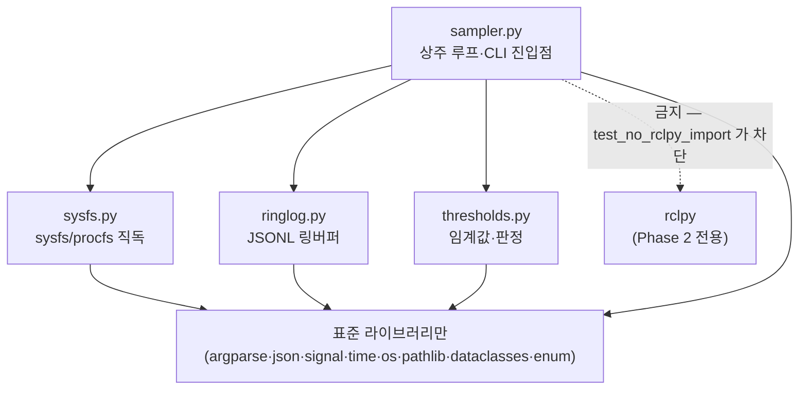
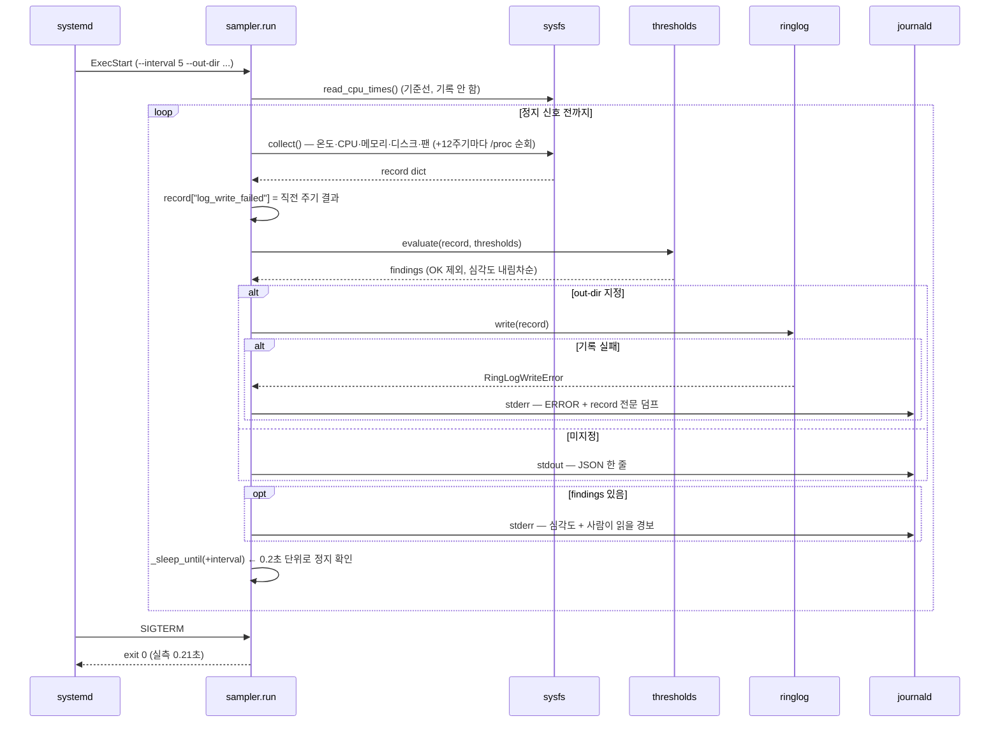

## 2026-07-28 (KST) — `system_health` Phase 1 구조 (함수표·전역변수표)

> coding SOP §2(사전조사)/§6(후속갱신)의 대칭 폐루프 산출물. **루트 정본** — 패키지 병기본은
> `src/Safety/system_health/docs/sw_structure/system-health/2026-07-28.md` (동일 내용).
>
> 설계 결정과 그 근거는 `docs/adr/2026-07-28-system-health-monitor.md` 소관. 본 문서는 **무엇이
> 어디 있는가**만 기록한다. 결함 평가는 code_review 소관(별도 lane).

### 코드 버전

- 브랜치 `main`, 신규 패키지(직전 리뷰 없음 — 최초 작성)
- 대상: `src/Safety/system_health/system_health/` 4개 모듈 + `__init__.py`, 총 1,290줄
- 테스트: `src/Safety/system_health/test/` 5개 파일, **90 PASS** (2026-07-28 실행)

### 모듈 의존 그래프

`__init__.py` 는 **어떤 모듈도 import 하지 않는다** — 여기서 Phase 2 브리지를 끌어오면 Phase 1 의
ROS 무의존이 깨지기 때문이다.

### 1. 함수 리스트 표 (`sysfs.py` — sysfs/procfs 직독)

| # | 함수 | 입력 | 출력 | 기능 | 위치(file:line) |
| --- | --- | --- | --- | --- | --- |
| 1 | `_read_text` | `path: Path` | `str \| None` | 파일을 문자열로 읽고 양끝 공백 제거. 실패 시 None | sysfs.py:43 |
| 2 | `_read_int` | `path: Path` | `int \| None` | 파일을 정수로 읽음. 없거나 비정수면 None | sysfs.py:51 |
| 3 | `_unique_key` | `key: str`, `seen: dict` | `str` | 같은 `type` 노드가 둘 이상일 때 `key#N` 으로 충돌 회피 | sysfs.py:62 |
| 4 | `read_temperatures_c` | 없음 | `dict[str, float]` | 모든 thermal zone 온도(°C), 존 type 이 키 | sysfs.py:75 |
| 5 | `read_cooling_states` | 없음 | `dict[str, int]` | 냉각장치별 `cur_state`. 0 아니면 실제 개입 중 | sysfs.py:93 |
| 6 | `FanInfo` (dataclass) | — | — | 팬 상태. `rpm` 은 본 HW 에 노드 부재로 항상 None | sysfs.py:117 |
| 7 | `read_fan` | 없음 | `FanInfo` | 팬 PWM/RPM 읽기 (**읽기 전용 — 제어하지 않음**) | sysfs.py:131 |
| 8 | `CpuTimes` (dataclass) | — | — | `/proc/stat` 한 줄의 누적 jiffies (idle, total) | sysfs.py:151 |
| 9 | `CpuSnapshot` (dataclass) | — | — | 한 시점의 전체·코어별 누적 CPU 시간 | sysfs.py:159 |
| 10 | `CpuUsage` (dataclass) | — | — | 두 스냅샷 사이 구간의 사용률(%) | sysfs.py:167 |
| 11 | `_parse_cpu_line` | `fields: list[str]` | `CpuTimes \| None` | `cpu*` 한 줄 파싱. idle = idle+iowait, total = 앞 8필드 | sysfs.py:174 |
| 12 | `read_cpu_times` | 없음 | `CpuSnapshot \| None` | `/proc/stat` 에서 전체·코어별 누적 시간 | sysfs.py:191 |
| 13 | `_usage_pct` | `prev`, `cur: CpuTimes` | `float` | 구간 사용률(%). 구간 0 이하면 0.0, 0~100 클램프 | sysfs.py:218 |
| 14 | `cpu_usage_pct` | `prev`, `cur: CpuSnapshot` | `CpuUsage` | 전체·코어별 사용률. 코어 수 변동(hotplug) 허용 | sysfs.py:227 |
| 15 | `read_cpu_freqs_khz` | 없음 | `tuple[int, ...]` | 코어별 현재 주파수(kHz). 저감 확증 지표 | sysfs.py:247 |
| 16 | `MemoryInfo` (dataclass) | — | — | 메모리·스왑 사용량(MB). used = total − available | sysfs.py:272 |
| 17 | `read_memory` | 없음 | `MemoryInfo \| None` | `/proc/meminfo` 파싱 | sysfs.py:286 |
| 18 | `DiskInfo` (dataclass) | — | — | 파일시스템 사용량(GB) | sysfs.py:325 |
| 19 | `read_disk` | `path: str` | `DiskInfo` | `statvfs` 기반 사용량. **OSError 를 전파**(경로 오타를 숨기지 않음) | sysfs.py:334 |
| 20 | `ProcessInfo` (dataclass) | — | — | pid·name·rss_mb | sysfs.py:364 |
| 21 | `ProcessScan` (dataclass) | — | — | `/proc` 1회 순회 결과(count·top_rss·names) | sysfs.py:373 |
| 22 | `_read_process` | `pid: int` | `ProcessInfo \| None` | `/proc/<pid>/stat` 1개 파싱. 사라졌으면 None | sysfs.py:387 |
| 23 | `scan_processes` | `top_n: int = 5` | `ProcessScan` | `/proc` 순회 → 프로세스 수·상위 RSS·이름 집합 | sysfs.py:407 |
| 24 | `read_load_average` | 없음 | `tuple[float,float,float] \| None` | 1·5·15분 부하 평균 | sysfs.py:440 |
| 25 | `read_uptime_s` | 없음 | `float \| None` | 부팅 후 경과 시간(초). 재시작 감지용 | sysfs.py:448 |

### 2. 함수 리스트 표 (`thresholds.py` — 임계값·판정)

| # | 함수 | 입력 | 출력 | 기능 | 위치(file:line) |
| --- | --- | --- | --- | --- | --- |
| 26 | `Level` (IntEnum) | — | — | 심각도 OK(0)/WARN(1)/ERROR(2). 크기 비교 가능 | thresholds.py:26 |
| 27 | `Finding` (dataclass) | — | — | 단일 판정 결과(key·level·value·message) | thresholds.py:35 |
| 28 | `Thresholds` (dataclass) | — | — | 임계값 11개 + 팬 데몬 이름. 전부 덮어쓰기 가능 | thresholds.py:52 |
| 28a | `Thresholds.from_mapping` | `overrides: Mapping` | `Thresholds` | 기본값 위에 덮어쓰기. **미지의 키는 KeyError**(오타를 삼키면 임계값이 안 바뀐 줄 모름) | thresholds.py:74 |
| 28b | `Thresholds.to_mapping` | 없음 | `dict[str, Any]` | 현재 값을 JSON 직렬화 가능한 dict 로. `from_mapping` 의 역함수 | thresholds.py:97 |
| 29 | `_grade` | `value`, `warn_at`, `error_at`, `higher_is_worse` | `Level` | 값 하나를 등급화. 경계는 **포함**(>=, <=) | thresholds.py:112 |
| 30 | `_hottest` | `temps: Mapping[str,float]` | `tuple[str,float] \| None` | 가장 뜨거운 존과 온도 | thresholds.py:142 |
| 31 | `evaluate` | `record: Mapping`, `th: Thresholds` | `tuple[Finding, ...]` | record 판정. **OK 는 반환하지 않음**, 심각도 내림차순 | thresholds.py:150 |
| 32 | `worst_level` | `findings: tuple[Finding,...]` | `Level` | 최고 심각도. 비었으면 OK | thresholds.py:279 |

### 3. 함수 리스트 표 (`ringlog.py` — JSONL 링버퍼)

| # | 함수 | 입력 | 출력 | 기능 | 위치(file:line) |
| --- | --- | --- | --- | --- | --- |
| 33 | `RingLogWriteError` (예외) | — | — | 기록 실패. 호출자가 최고 심각도로 승격해야 함 | ringlog.py:23 |
| 34 | `RingLog` (class) | — | — | 일자 회전 + 총량/보존 상한 JSONL 기록기 | ringlog.py:27 |
| 34a | `RingLog.__init__` | `out_dir`, `prefix`, `max_total_mb`, `max_age_days`, `enforce_every`, `clock` | None | 설정 보관. `clock` 주입으로 테스트가 시각을 통제 | ringlog.py:33 |
| 34b | `RingLog.directory` (property) | 없음 | `Path` | 로그 디렉토리 | ringlog.py:63 |
| 34c | `RingLog._day_string` | 없음 | `str` | 현재 로컬 일자 `YYYY-MM-DD` | ringlog.py:67 |
| 34d | `RingLog.path_for_day` | `day: str` | `Path` | 해당 일자 파일 경로 | ringlog.py:71 |
| 34e | `RingLog.existing_files` | 없음 | `list[Path]` | 본 접두 파일들, 날짜 오름차순 | ringlog.py:75 |
| 34f | `RingLog.write` | `record: Mapping` | `Path` | JSON 한 줄 append. **실패 시 RingLogWriteError 를 올림** | ringlog.py:81 |
| 34g | `RingLog.enforce_limits` | 없음 | `list[Path]` | 보존기간·총량 상한 적용. **최신 파일은 절대 삭제 안 함** | ringlog.py:109 |
| 34h | `RingLog._total_size` | 없음 | `float` | 본 접두 파일 총 바이트 | ringlog.py:143 |
| 34i | `RingLog._unlink` | `path: Path` | `bool` | 삭제 시도. 실패는 False(회수 실패로 감시를 멈추지 않음) | ringlog.py:154 |

### 4. 함수 리스트 표 (`sampler.py` — 상주 루프·진입점)

| # | 함수 | 입력 | 출력 | 기능 | 위치(file:line) |
| --- | --- | --- | --- | --- | --- |
| 35 | `_on_stop_signal` | `signum: int`, `frame` | None | SIGTERM/SIGINT 핸들러. **플래그만 세움**(I/O 없음) | sampler.py:52 |
| 36 | `is_stop_requested` | 없음 | `bool` | 정지 플래그 조회(테스트 관측용) | sampler.py:62 |
| 37 | `reset_stop_flag` | 없음 | None | 정지 플래그 해제(테스트 격리용) | sampler.py:67 |
| 38 | `collect` | `prev_cpu`, `disk_paths`, `proc_scan`, `top_rss`, `fan_daemon_name`, `now` | `tuple[dict, CpuSnapshot \| None]` | 한 시점 자원 상태 → record. `prev_cpu` 없으면 CPU% 생략 | sampler.py:73 |
| 39 | `_format_findings` | `findings: tuple[Finding,...]` | `str` | 경보를 사람이 읽을 여러 줄로 | sampler.py:155 |
| 40 | `_sleep_until` | `deadline: float` | None | 정지 요청에 0.2초 내 반응하며 대기 | sampler.py:160 |
| 41 | `_load_threshold_overrides` | `path: str \| None` | `dict` | 임계값 JSON 로드. **읽기·형식 실패는 SystemExit** | sampler.py:169 |
| 41a | `_write_thresholds` | `path: str`, `th: Thresholds` | `int` | 현재 임계값을 사람이 편집할 JSON 으로 저장. `_provisional` 동반 기재. 실패는 SystemExit | sampler.py:188 |
| 42 | `_parse_args` | `argv: Sequence[str] \| None` | `Namespace` | CLI 인자 해석 | sampler.py:223 |
| 43 | `run` | `args: Namespace` | `int` | 임계값 구성 → (`--write-thresholds` 면 저장 후 종료) → 샘플 루프. 기록 실패를 상태로 승격·복구 감지 | sampler.py:274 |
| 44 | `main` | `argv: Sequence[str] \| None = None` | `int` | 진입점(`console_scripts: health_sampler`) | sampler.py:366 |

### 5. 전역 변수 / 모듈 상수 표

가변 전역은 **1개**뿐이다(`_stop_requested`). 나머지는 전부 불변 상수다.

| # | 사용처(함수) | 기능 | 위치(file:line) |
| --- | --- | --- | --- |
| G1 | `_on_stop_signal`(**writer**) · `run`·`_sleep_until`·`is_stop_requested`(reader) | **(가변)** 정지 요청 플래그. **누가 바꾸나 = `_on_stop_signal` 단독**. 단일 writer + 원자적 bool 대입이라 lock 없음 (concurrency aspect §1) | sampler.py:49 |
| G2 | `read_temperatures_c` | (상수) `_MILLI_C_PER_C = 1000.0` — 커널은 milli-°C 로 노출 | sysfs.py:21 |
| G3 | `read_memory` | (상수) `_KB_PER_MB = 1024.0` | sysfs.py:22 |
| G4 | `read_disk` | (상수) `_BYTES_PER_GB = 1<<30` | sysfs.py:23 |
| G5 | `read_temperatures_c` | (상수) `_THERMAL_ZONE_ROOT` | sysfs.py:25 |
| G6 | `read_cooling_states` | (상수) `_COOLING_DEVICE_ROOT` | sysfs.py:26 |
| G7 | `read_cpu_freqs_khz` | (상수) `_CPUFREQ_ROOT` | sysfs.py:27 |
| G8 | `read_fan` | (상수) `_FAN_HWMON_ROOT` — 본 HW 경로. 부재 시 팬 항목 전부 None | sysfs.py:29 |
| G9 | `read_cpu_times`·`read_memory`·`_read_process`·`scan_processes`·`read_uptime_s` | (상수) `_PROC_ROOT = /proc` | sysfs.py:30 |
| G10 | `_read_process` | (상수) `_PROC_STAT_UTIME/STIME/RSS_PAGES` = 11/12/21 — `") "` 기준 필드 인덱스 | sysfs.py:33-35 |
| G11 | `_read_process` | (상수) `_PAGE_MB` — `SC_PAGE_SIZE` 유래 | sysfs.py:37 |
| G12 | 문서·보고 | (상수) `PROVISIONAL_KEYS` — 램프 시험 전 **잠정** 임계 4개 | thresholds.py:107 |
| G12a | `Thresholds.from_mapping` | (상수) `COMMENT_KEY_PREFIX = "_"` — 설정 JSON 의 주석 키 접두. 왕복 가능하게 하는 관례 | thresholds.py:23 |
| G13 | `RingLog._total_size`·`enforce_limits` | (상수) `_BYTES_PER_MB`, `_SECONDS_PER_DAY` | ringlog.py:19-20 |
| G14 | `_parse_args` | (상수) `DEFAULT_INTERVAL_S=5.0`, `DEFAULT_MAX_TOTAL_MB=512.0`, `DEFAULT_MAX_AGE_DAYS=14.0`, `DEFAULT_TOP_RSS=5`, `DEFAULT_PROC_SCAN_EVERY=12` | sampler.py:32-38 |
| G15 | `run` | (상수) `ONCE_BASELINE_DELAY_S=1.0` — `--once` 의 CPU 기준선 간격 | sampler.py:40 |
| G16 | `_sleep_until` | (상수) `_SLEEP_CHUNK_S=0.2` — 정지 신호 반응 분해능 | sampler.py:42 |

### 6. 의존성 3-tier 표

| Tier | 대상 | 버전/제약 | 부재 시 동작(필수/선택) | 근거(파일:line) |
| --- | --- | --- | --- | --- |
| 빌드 | `setuptools` | 제약 없음 | 필수 — colcon 빌드 불가. 단 **소스 직접 실행은 가능**(systemd 가 그 경로를 씀) | setup.py:19 |
| 빌드 | `python3-pytest` | 제약 없음 | 선택 — 테스트만 불가, 런타임 영향 0 | package.xml:13 |
| 런타임 필수 | Python 3 표준 라이브러리 | 3.10+ (`X \| Y` 타입 문법) | 필수 — 기동 불가 | sysfs.py:13 (`from __future__ import annotations`) |
| 런타임 필수 | `/proc` 마운트 | — | CPU·메모리·프로세스 항목이 전부 빠지고 온도·디스크만 남는다. **죽지는 않는다** | sysfs.py:30 |
| 런타임 선택 | `/sys/devices/virtual/thermal` | — | fallback: 온도·냉각단계 항목 생략(빈 dict) | sysfs.py:75, 93 |
| 런타임 선택 | `/sys/devices/platform/pwm-fan` | — | fallback: `fan.pwm`·`fan.rpm` 모두 None | sysfs.py:131 |
| 런타임 선택 | `rpm` hwmon 노드 | **본 HW 에 부재(실측)** | fallback: 항상 None. RPM 기반 팬 고착 판정 불가 — ADR §Decision 5 | sysfs.py:120 |
| 런타임 선택 | `config/system_health/thresholds.json` | JSON 객체 | `--thresholds` 로 **명시 지정 시에는 필수**(없으면 SystemExit — 값을 바꿨다고 믿는 상태 방지). 미지정이면 코드 기본값 | sampler.py:169 |
| 런타임 선택 | `--out-dir` 디렉토리 | 쓰기 가능해야 함 | fallback: 미지정 시 stdout 으로만 출력(journald 가 수집) | sampler.py:194 |
| 런타임 선택 | systemd | — | fallback: 수동 실행 가능. **유닛은 자동 설치되지 않음** | install_service.sh |
| 비의존 (명시) | `rclpy` | — | **import 금지.** `test_no_rclpy_import.py` 가 정적·동적 양쪽으로 차단 | ADR §Decision 2 |
| 비의존 (명시) | `psutil` (설치돼 있음) | 5.9.0 | 쓰지 않는다 — 의존 표면 최소화(ADR §Decision 9) | ADR §Decision 9 |

### 7. 시퀀스 — 표본 1주기

### 구조 관찰 (결함 평가 아님 — code_review 소관)

- **판정과 수집이 분리돼 있다.** `thresholds.evaluate()` 는 record dict 만 받으므로 실장비 없이
  전 경로를 테스트할 수 있다. `dataset_collector` 의 `sampling.py` 와 같은 구조다.
- **가변 전역이 1개**뿐이고 그 writer 가 단일(신호 핸들러)이라 동시성 표면이 최소다.
- **`__init__.py` 가 비어 있는 것이 의도**다. Phase 2 에서 여기에 브리지를 import 하면
  ROS 무의존이 조용히 깨지므로, 그 자체를 테스트가 막고 있다.
- `record` 스키마는 Phase 2 의 `/diagnostics` 매핑 대상이 된다 — 키 이름 변경은 그때 공개표면이 된다.

### 미기재 / 한계

- **플로우차트 `.drawio` 미동반.** code_review SOP 룰 14 는 리뷰 산출물에 `.drawio` 를
  요구한다. 본 문서는 coding §6 의 구조 기록이며 code_review 산출물이 아니라 mermaid 만 넣었다.
  정식 코드 리뷰(별도 lane) 시 `.drawio` 를 함께 생성해야 한다.
- 본 문서는 **작성자 자신이 만든 구조 기록**이다. 결함 평가·Verdict 는 담고 있지 않으며,
  담을 수도 없다(never-self-approve).
