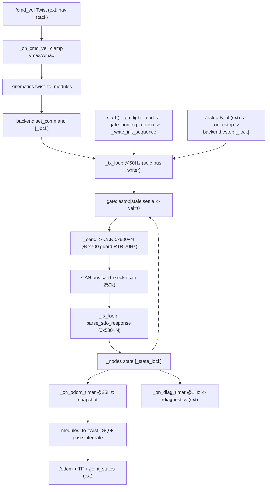

> ## ❌ 통합 재정정 2026-08-03 17:30 — 아래 15:40 블록의 수치·판정을 **원자료 재계산**으로 정정한다
>
> 원문은 삭제하지 않는다. 재검증: `python3 Tools/docking_field_kit/verify_homing_claims.py --docs`
> (`Log/` 원자료 재계산 — 문서를 근거로 문서를 고치지 않는다)
>
> - **E1** 「13회 연속 성공」 → **12회**. 2026-08-03 은 **시도 13 / 성공 12 / 실패 1**(09:58 `ERR_TIMEOUT`).
>   15:33 실행의 `baseline` 은 호밍이 아니라 **레지스터 스냅샷**이다 — 회차로 세지 말 것.
>   ⚠ **「10회 연속 10/10」 자체는 유효**하다.
> - **E2** 「`0x6064`=0 은 1회 관측·재현 안 됨」 → **[거짓] 재현된다.** `0x6041` bit15=1 인 채로 0 이 나온
>   캡처가 **6개**다. ⚠ **인과는 양쪽 미판정** — 0 이 관측된 직후 호밍이 성공한 회차가 있으므로
>   「0 이면 호밍 실패」도 성립하지 않는다. **「호밍 중(bit15=0)의 0」은 별개의 유효 관측**이다.
> - **E3** 「WAIT 31.7 s」 → WAIT(state 4) **체류 31.30 s**. 31.7 s 는 개시~RESTORE **절대시각**.
> - **E4** 「35.0 s」 → 15:33 10회 **평균 35.07 · 중앙 35.05**(34.99~35.16, 폭 0.17).
> - **E5** 「counts/° = 57,344」 → node3 **57,344.0** / node4 **57,344.3**. 「기울기 1.000000」은 node3 한정.
> - **E6** 「σ≈3 counts」는 **모표준편차** 기준 — node3 **2.80** / node4 **3.21**(표본 2.95 / 3.38).
> - **E7** 「결함이 아니라 **설계 동작**」 → **과잉 확정.** 실측이 보증하는 것은 **재현되는 정착 동작**까지이며
>   펌웨어 상수의 **적정성은 별건**이다 — `debt-016` 이 같은 편차를 「영구 미검출 오프셋」으로 등록 중이라 충돌한다.
> - **E8** 조향 0° `[7871815, 7840086]` — **값은 정본 유지**, 근거는 **공학적 채택값**(역산식이 항등식).
>   「실측 확정」 표현 금지.
> - **E9** `seer_home_cancel_frames()` = **`safety_seer_gate.h:312-316`**(`:307-311` 은 `seer_home_digital_in()`).
> - **E10 ★** 「**물리 직진 앵커 부재**」·「**물리 직진 미확인**」 → **거짓.** 앵커는 **실재한다** —
>   Seer 1005/1040 은 EasyDRIVE `steerOffset` 으로 **교정된** 조향각이고, 사용자가 바퀴 직진 상태에서
>   Seer 앞바퀴 2축 **0° 를 육안 확인**했다(can_relay GUI 표시로도 동일). 부족한 것은 **앵커가 아니라
>   정밀도**(육안 ≈**±1° = ±57,344 counts**)다 — 다툰 193 c(0.0034°)의 약 **297배**라 counts 소수 자리를
>   분해하지 못한다. ⇒ 「非-Seer 계측 필요」는 **「counts 소수 자리까지 판정하려면」** 조건부로만 참이다.
>   ⚠ 단 **(a) 역산식이 항등식이라 육안 확인이 counts 값 결정에 기여하지 않는다**는 판정은 **유지**된다 —
>   무효인 것은 (a) 뿐이고, **(b) 「Seer 0° = 물리 직진」은 성립**한다. 이 둘을 뭉개지 말 것.


> ⚠ **조향 홈 정본**: `docs/homing/2026-08-03-can-relay-homing-assets.md` §0 — 조향 0° = **`[7871815, 7840086]`**(Seer 좌표계 기준).

> ### ❌ 정정 2026-08-03 15:40 — 호밍 10회 연속 실측으로 확정 (본 문서 전체에 우선)
>
> 정본: `docs/homing/2026-08-03-can-relay-homing-assets.md` §0 ·
> 실행기 `Tools/docking_field_kit/orin_home_experiment.py`.
> 아래와 어긋나는 본 문서의 서술은 **이력으로만** 읽을 것(원문은 삭제하지 않는다).
>
> - **호밍은 정상 동작한다 — 10 / 10 성공**, 소요 **35.0 s**(34.99~35.16, 편차 0.17 s).
>   09:58 `ERR_TIMEOUT` 1회가 유일한 실패이고 그 뒤 **12회 연속 성공**, **재현되지 않는다.**
> - **호밍 후 정착 counts(10회 중앙값)**: node3 **7,882,021** · node4 **7,859,065**, σ ≈ 3 counts.
>   조향 0° 대비 **+0.178° / +0.331°** — **결함이 아니라 설계 동작.**
> - **조향 0° = `[7871815, 7840086]`** (`src/Comm/CAN/can_relay/config/machine/foil_a082.yaml:134`).
>   ⚠ **Seer 좌표계 기준이다. 물리적 직진과 같은지는 미확인**(非-Seer 계측 부재).
>   > ❌ **재정정 2026-08-03 17:30 — 「물리 직진 앵커 부재/미확인」은 거짓이다.** 두 질문을 하나로 뭉갠 오류다.
>   > - **(a) 「조향 0° = 몇 counts 인가」 역산에 육안 확인이 기여하나 → 아니오.** 역산식이 **항등식**이라는 판정은 **유지**한다.
>   > - **(b) 「Seer 0° 표시 = 바퀴가 물리적으로 직진」이 성립하나 → 예.** Seer 1005/1040 은 EasyDRIVE `steerOffset` 으로
>   >   **교정된** 조향각이고, 사용자가 바퀴 직진 상태에서 Seer 앞바퀴 2축 0° 를 **육안 확인**했다(can_relay GUI 로도 동일 확인).
>   > ⇒ **물리 직진 앵커는 실재한다** — (b) 를 (a) 에 딸려 무효화한 것이 오류였다.
>   > ⇒ 다만 앵커 **정밀도가 ≈±1°(±57,344 counts)** 다 — **직진 판정에는 충분**, **counts 소수 자리**
>   >   (193 c = 0.0034°, ±1° 의 **1/297**) 판정에는 **불충분**.
>   > ⇒ counts 정본이 **공학적 채택값**인 이유는 「앵커 부재」가 아니라 **「앵커 정밀도 부족」**이며,
>   >   「비-Seer 계측 필요」는 **「counts 소수 자리까지 판정하려면」** 이라는 조건에서만 성립한다.
> - **counts/° = 57,344** — 지령각→CAN 기울기 실측 **1.000000**.
> - 호밍 방식 **`0x6098` = 1**(Home 1, −리밋), **리밋 스위치 실재** — 10회 모두
>   DI(Digital Input) `0x01`→`0x09`(bit3 = −Limit) 전이 관측.
>
> **폐기 — 본 문서 어디서도 인용 금지**: 「`Switch on disabled` 라 호밍이 막힌다」 · 「`0x6098` = 0 이라 호밍 비활성」 ·
> 「RstStart 가 1 로 고착돼 에지 불가」 · 「`0x6064` = 0 은 전원 사이클로만 풀리는 래치」 ·
> 「축이 이미 홈이면 무동작 즉시 완료 → 타임아웃」 ·
> 「CAN 과 Seer 가 독립 경로라 교차검증 성립」(**Seer 1005·1040 은 둘 다 `0x6064` 유래 — 독립 앵커가 아니다**) ·
> **`+0.334°` / `+0.332°`(→ `+0.331°` 로 정정)**.

## 2026-07-26 (KST) — motor_control 리뷰

리뷰 대상: 이식된 ROS2 패키지 `src/Actuators/motor_control/` (동익(同益) 4축 AMR CAN 모터 드라이버, SDO 폴링 단독 마스터). 사용자 요청 "이식된 코드를 분석하고 오류 검증".

### 코드 버전
- 비-git 저장소 → 파일 내용 해시(md5)로 코드 상태 고정:
  - `motor_control/backend.py`   = e0ac1269abf88b06483228ff04230e6b (314줄)
  - `motor_control/driver_node.py` = (이식본, 218줄)
  - `motor_control/kinematics.py`  = (이식본, 114줄)
  - `motor_control/protocol.py`    = (이식본, 103줄)
  - `launch/motor_control.launch.py` (23줄) · `config/tongyi_amr.yaml`
- 원본 대조: `amap@amap-2:.../T-Driver-Analysis/src/Motor_Control/` 와 backend.py/test_backend.py md5 **바이트 동일**(이식 무손상). 이식 경위 → [[biguamr-motor-control-port]].
- 직전 리뷰: 없음(최초).
- 같은 시각 지시: `docs/user_instructions/user_instructions.md` 2026-07-26 15:42 "이식된 코드를 분석하고 오류 검증".

### 분석 분기 명시
- 분기: **전체 구조 분석**(디렉토리·다중 모듈 패키지).
- 감지된 도메인: **ros2-review + concurrency + embedded-review**(부분: CAN HW·스레드 모델). ISR/RTOS 없음(유저스페이스 Python).

---

## Core 인벤토리

### 1. 목적

`motor_control` 은 **Seer 마스터를 분리한 상태에서 ROS2 노드가 CAN(250 kbps, CANopen CiA301/402 SDO 폴링 전용)으로 동익 4축 서보를 직접 구동**하는 패키지다. 노드 1·2=구동(PV 속도), 3·4=조향(PP 위치). 설계 근거는 실측 통합 문서 [docs/ros2_driver/2026-07-09-design-inputs.md](../../ros2_driver/2026-07-09-design-inputs.md) §1–5 (✓ 기동 캡처 전수 디코드·실차 재생 성공).

구조는 3계층 순수/부수효과 분리다: `protocol.py`(SDO 프레임 인코드/디코드, 버스 무의존 순수 함수) → `kinematics.py`(Twist↔모듈 세트 변환, ROS/CAN 무의존 순수 수학) → `backend.py`(TX 단독 버스 writer + RX 단독 상태 writer 스레드 모델) → `driver_node.py`(ROS2 노드: 비블로킹 콜백은 목표 저장만, CAN 타이밍은 backend 스레드 소관). "모듈 세트 추상화"(`ModuleCommand{v, θ|None}`)로 dual-steer(스워브)와 diff-drive를 동일 인터페이스로 커버한다.

안전 설계 3종: ① 콜드부팅 조향 스윙(137°) 게이트(`allow_homing_motion` 없이는 기동 거부), ② 조향 정착 게이트(목표↔실측 편차 초과 시 구동 0), ③ cmd 워치독 + E-stop 래치.

> ❌ **정정 2026-08-03 15:40 — 안전 설계 ① 의 명칭, 그리고 137° 스윙의 성격.** (원문은 이력 보존용으로 남긴다.)
>
> **(1) ① 은 「콜드부팅 조향 스윙 게이트」가 아니다.** 실제 판정 조건은 「조향 실측이 홈 대비
> `homing_tol_counts`(기본 286,720 counts = 5°) 초과」이며
> (`src/Actuators/motor_control/motor_control/backend.py:231` `_gate_homing_motion()` — 2026-08-03 실측 줄번호),
> 콜드부팅을 검출하지도, 137° 스윙을 차단하지도 않는다. 정확한 이름은 **홈 편차 브링업 거부 게이트**다.
>
> **(2) 137° 스윙은 설계 동작이다.** 호밍(−리밋 탐색) 완료 후 **펌웨어 GOZERO 목표**
> (`Tools/Can_Relay/panda-firmware/board/safety/safety_seer_gate.h:212` `SEER_HOME_ZERO_N3/N4` = 7882020 / 7859062)
> 로 이동한다. 2026-08-03 호밍 **10회 연속**에서 정착 counts 중앙값 node3 **7,882,021** · node4 **7,859,065**
> (σ ≈ 3 counts)로 재현됐고, 10회 모두 DI `0x01`→`0x09`(bit3 = −Limit) 전이가 관측돼 **리밋 스위치 실재**와
> **`0x6098` = 1**(Home 1)이 확인됐다.
>
> **(3) 그 정착 지점은 조향 0° 가 아니다.** 0° `[7871815, 7840086]` 대비 **+0.178° / +0.331°** 다.
> 라벨은 **「호밍 후 정착값(0° 아님)」**.
>
> **(4) ⚠ 「조향 0°(물리 직진)」 표기의 「물리 직진」은 근거가 없다.** 확정된 0° 는 **Seer 좌표계 기준**이며,
> 물리적 직진과 일치하는지는 **미확인**이다(非-Seer 계측 부재). 위·아래 본문의 「조향 0°(물리 직진)」는
> **「조향 0°(Seer 좌표계, 물리 직진 미확인)」** 로 읽을 것.
>
> ❌ **재정정 2026-08-03 17:30 — 「물리 직진 앵커 부재/미확인」은 거짓이다.** 두 질문을 하나로 뭉갠 오류다.
> - **(a) 「조향 0° = 몇 counts 인가」 역산에 육안 확인이 기여하나 → 아니오.** 역산식이 **항등식**이라는 판정은 **유지**한다.
> - **(b) 「Seer 0° 표시 = 바퀴가 물리적으로 직진」이 성립하나 → 예.** Seer 1005/1040 은 EasyDRIVE `steerOffset` 으로
>   **교정된** 조향각이고, 사용자가 바퀴 직진 상태에서 Seer 앞바퀴 2축 0° 를 **육안 확인**했다(can_relay GUI 로도 동일 확인).
> ⇒ **물리 직진 앵커는 실재한다** — (b) 를 (a) 에 딸려 무효화한 것이 오류였다.
> ⇒ 다만 앵커 **정밀도가 ≈±1°(±57,344 counts)** 다 — **직진 판정에는 충분**, **counts 소수 자리**
>   (193 c = 0.0034°, ±1° 의 **1/297**) 판정에는 **불충분**.
> ⇒ counts 정본이 **공학적 채택값**인 이유는 「앵커 부재」가 아니라 **「앵커 정밀도 부족」**이며,
>   「비-Seer 계측 필요」는 **「counts 소수 자리까지 판정하려면」** 이라는 조건에서만 성립한다.
>
> 근거: `docs/homing/2026-08-03-can-relay-homing-assets.md` §0-2 · §0-3.

### 2. 코드 플로우차트 (전체 흐름도)

mermaid + 동반 검증된 `2026-07-26-flow.drawio`(박스 16·화살표 16·dangling 0 — `drawio_validate.py` 통과).

다중 진입점: **(a) live 진입** `driver_node.main()` (ROS 노드) · **(b) 라이브러리 진입** `TongyiSdoBackend` (버스만 있으면 ROS 없이 동작, 테스트가 이 경로 사용). 공통 호출 그래프는 아래 하나로 표현(색: 파랑=외부 토픽 경계, 노랑=스레드/lock 공유상태, 빨강=브링업, 초록=HW).



### 3. 함수 리스트

| # | 함수 | 입력 | 출력 | 기능 | 위치(file:line) |
|---|---|---|---|---|---|
| 1 | `sdo_write` | node,index,value,size,sub | Frame | SDO expedited 쓰기 프레임 인코드 | protocol.py:65 |
| 2 | `sdo_read` | node,index,sub | Frame | SDO 읽기 요청(cmd 0x40) | protocol.py:73 |
| 3 | `guard_rtr` | node | Frame(RTR) | Node Guarding RTR 프레임 | protocol.py:78 |
| 4 | `parse_sdo_response` | can_id,data | SdoResponse\|None | 0x580+N 응답 파싱(read INT32 signed) | protocol.py:83 |
| 5 | `DualSteerKinematics.__init__` | node_xy,vmax,limit | — | 듀얼스티어 구성 | kinematics.py:30 |
| 6 | `DualSteerKinematics.twist_to_modules` | vx,vy,wz | ModuleCommand[] | 역기구학(inverse_multisteer 이식) | kinematics.py:36 |
| 7 | `DualSteerKinematics.modules_to_twist` | measured{n:(v,θ)} | (vx,vy,ω) | 정기구학 LSQ(오도메트리) | kinematics.py:56 |
| 8 | `DiffDriveKinematics.__init__` | l,r,track,vmax | — | 차동구동 구성 | kinematics.py:94 |
| 9 | `DiffDriveKinematics.twist_to_modules` | vx,_vy,wz | ModuleCommand[] | (vx,ω)→좌/우 속도 | kinematics.py:100 |
| 10 | `DiffDriveKinematics.modules_to_twist` | measured | (vx,0,ω) | 차동 정기구학 | kinematics.py:110 |
| 11 | `_to_can` | Frame | can.Message\|SimpleNamespace | python-can 지연 import 변환 | backend.py:49 |
| 12 | `TongyiSdoBackend.__init__` | bus,modules,scale... | — | 백엔드 구성·lock·상태 초기화 | backend.py:74 |
| 13 | `TongyiSdoBackend.start` | — | — | RX기동→선판독→게이트→init→TX기동 | backend.py:119 |
| 14 | `TongyiSdoBackend.set_command` | ModuleCommand[] | — | SI→디바이스단위 목표 갱신+워치독 스탬프 | backend.py:131 |
| 15 | `TongyiSdoBackend.estop` | engage:bool | — | E-stop 래치+vel 0 | backend.py:147 |
| 16 | `TongyiSdoBackend.snapshot` | — | dict | 진단·오도메트리용 상태 사본 | backend.py:154 |
| 17 | `TongyiSdoBackend.shutdown` | — | — | 정지송신·스레드 join·버스 close | backend.py:166 |
| 18 | `TongyiSdoBackend._preflight_read` | — | — | 전노드 0x6064 선판독(무응답 검출) | backend.py:184 |
| 19 | `TongyiSdoBackend._gate_homing_motion` | — | — | ~~콜드부팅 조향스윙 게이트~~ ❌ **정정 2026-08-03 15:40**: 콜드부팅 검출 아님·137° 스윙 차단 아님 → **홈 편차 브링업 거부 게이트**(현행 위치 `backend.py:231` `_gate_homing_motion()`, 2026-08-03 실측) | backend.py:197 |
| 20 | `TongyiSdoBackend._write_init_sequence` | — | — | Seer 기동 init 재현(~2ms 간격) | backend.py:211 |
| 21 | `TongyiSdoBackend._tx_loop` | — | — | 50Hz 지령+20Hz guard+피드백 폴링 | backend.py:235 |
| 22 | `TongyiSdoBackend._rx_loop` | — | — | 수신 파싱→상태 dict 갱신 | backend.py:276 |
| 23 | `TongyiSdoBackend._send` | Frame | — | 버스 송신+tx_count++ | backend.py:312 |
| 24 | `MotorControlNode.__init__` | — | — | 파라미터·기구학·버스·backend 기동·pub/sub | driver_node.py:33 |
| 25 | `MotorControlNode._on_cmd_vel` | Twist | — | clamp→기구학→set_command | driver_node.py:100 |
| 26 | `MotorControlNode._on_estop` | Bool | — | backend.estop 위임 | driver_node.py:107 |
| 27 | `MotorControlNode._on_odom_timer` | — | — | 변위→LSQ→pose 적분 | driver_node.py:111 |
| 28 | `MotorControlNode._publish_odom` | steer_rad,drive_pos | — | /odom·TF·/joint_states 발행 | driver_node.py:136 |
| 29 | `MotorControlNode._on_diag_timer` | — | — | /diagnostics 발행 | driver_node.py:169 |
| 30 | `MotorControlNode.destroy_node` | — | — | backend.shutdown 후 상위 정리 | driver_node.py:197 |
| 31 | `main` | args | — | rclpy init/spin/shutdown | driver_node.py:204 |
| 32 | `generate_launch_description` | — | LaunchDescription | 파라미터 로드 진입점 | launch/motor_control.launch.py:11 |

중복/유사 함수: `twist_to_modules`/`modules_to_twist` 는 DualSteer·DiffDrive 두 클래스에 동일 시그니처로 존재하나 **의도된 전략 다형성**(공통 인터페이스)이라 `[품질]` 통합 대상 아님.

### 4. 전역 변수 / 모듈 상수

**가변 모듈 전역 없음**(순수 함수 설계). 모듈 상수만 존재:

| # | 사용처(함수) | 기능 | 위치(file:line) |
|---|---|---|---|
| 1 | protocol 전역 (#1·#2·#3·#4) | `SDO_RX_BASE=0x600`·`SDO_TX_BASE=0x580`·`GUARD_BASE=0x700` COB-ID 베이스 (상수) | protocol.py:15-17 |
| 2 | protocol #1·#4 | `OBJ_*` 오브젝트 딕셔너리 인덱스 16종 (상수) | protocol.py:20-35 |
| 3 | protocol #4·backend #20 | `CW_DRIVE_ENABLE=0x86`·`CW_STEER_SETPOINT=0x3F`·`CW_DISABLE=0x05` (상수) | protocol.py:38-40 |
| 4 | protocol #1·#4 | `_WRITE_CMD`·`_READ_RESP_SIZE` 매핑 (상수) | protocol.py:42-43 |
| 5 | kinematics #6 | `STEER_LIMIT_RAD=2.443` 조향 ±140° (상수) | kinematics.py:15 |
| 6 | driver_node #24·#27·#28 | `M_S_PER_UNIT`·`COUNTS_PER_RAD`·`COUNTS_PER_M`·`WHEEL_RADIUS` 실측 스케일 (상수) | driver_node.py:26-29 |

backend 클래스 상수(`GUARD_TIME_MS` 등 backend.py:67-72)는 인스턴스 스코프 → 전역 아님. 인스턴스 가변 공유상태는 concurrency **B-2** 참조.

### 5. 의존성 3-tier

| Tier | 대상 | 버전/제약 | 부재 시 동작(필수/선택) | 근거(파일:line) |
|---|---|---|---|---|
| 빌드 | rclpy, geometry_msgs, nav_msgs, sensor_msgs, std_msgs, diagnostic_msgs, tf2_ros | ROS2 (ament_python) | 빌드 실패 | package.xml:13-20 |
| 빌드 | python3-can | — | import 실패 | package.xml:21 |
| 빌드(test) | python3-pytest, ament_copyright | — | 테스트 불가 | package.xml:23-24 |
| 런타임 필수 | CAN 인터페이스 `can1` (socketcan, 250k) | PCAN 등 | **필수** — 부재 시 `can.Bus()` 예외로 노드 기동 실패(driver_node.py:72) | driver_node.py:72 |
| 런타임 필수 | 동익 서보 4노드(1·2 구동, 3·4 조향) 응답 | — | **필수** — `_preflight_read` 2s 내 무응답 시 `NodeSilent` 로 기동 중단 | backend.py:184-195 |
| 런타임 필수 | `/cmd_vel` 발행자(nav2 등) | — | **필수(구동)** — 부재 시 워치독 stale→vel 0 유지(안전 정지) | driver_node.py:85, backend.py:243 |
| 런타임 선택 | `python-can`(순수 로직) | — | 선택 — 미설치 시 `_to_can` 이 `SimpleNamespace` fallback(테스트용, 실버스 불가) | backend.py:51-56 |
| 런타임 선택 | `/estop` 발행자 | — | 선택 — 없으면 E-stop 미개입(기본 비상정지 없음) | driver_node.py:86 |

---

## 도메인 인벤토리

### ros2-review

**A-1. Subscriptions**

| 토픽 | 메시지 타입 | QoS(depth·rel·dur·hist) | 콜백 함수 | 위치(file:line) |
|---|---|---|---|---|
| cmd_vel | geometry_msgs/Twist | depth 10·RELIABLE·VOLATILE·KEEP_LAST (기본) | `_on_cmd_vel` | driver_node.py:85 |
| estop | std_msgs/Bool | depth 10·기본 | `_on_estop` | driver_node.py:86 |

**A-2. Publications**

| 토픽 | 메시지 타입 | QoS | 발행 위치(함수) | 위치(file:line) |
|---|---|---|---|---|
| odom | nav_msgs/Odometry | depth 10·기본 | `_publish_odom` | driver_node.py:87,147 |
| joint_states | sensor_msgs/JointState | depth 10·기본 | `_publish_odom` | driver_node.py:88,167 |
| diagnostics | diagnostic_msgs/DiagnosticArray | depth 10·기본 | `_on_diag_timer` | driver_node.py:89,195 |

**A-3. Services / Actions**: 없음.

**A-4. Parameters** (declare: driver_node.py:35-53)

| 이름 | 타입 | default | 사용 위치 |
|---|---|---|---|
| can_channel | str | "can1" | driver_node.py:72 |
| kinematics | str | "dual_steer" | driver_node.py:60 |
| vmax / wmax | float | 0.2 / 0.3 | driver_node.py:102-104,77 |
| cmd_timeout | float | 0.2 | backend cmd_timeout |
| allow_homing_motion | bool | False | backend gate |
| steer_settle_tol_deg / homing_tol_deg | float | 3.0 / 5.0 | ×57344→counts |
| drive_sign / kin_steer_sign | int | -1 / 1 ⚠ | 부호(미검증) |
| module_drive_nodes / module_steer_nodes | int[] | [1,2] / [3,4] | 배선 |
| module_x / module_y | float[] | [-0.5961,0.6039] ⚠ / [-0.0014,-0.0014] | 차체좌표(m) |
| steer_home_counts | int[] | [7871815,7840086] | 조향 홈(counts) — **✓ 2026-08-03 실측 재확인**(Seer 역산 node3 7,871,816 / node4 7,840,087, 1c 이내). 상단 배너의 `[7871810,7839894]` 은 폐기 ❌ **정정 2026-08-03 15:40**: 이 값은 **Seer 좌표계 0°** 이며 **물리 직진은 미확인**. ❌ **재정정 2026-08-03 17:30**: 「물리 직진 미확인」은 **거짓** — Seer 1005/1040 은 EasyDRIVE `steerOffset` 으로 교정된 조향각이고, 바퀴 직진 상태에서 Seer 앞바퀴 2축 0° 를 **육안 확인**했다(can_relay GUI 로도 동일 확인) ⇒ **물리 직진 앵커 실재**. 정밀도 **≈±1°(±57,344 c)** 라 직진 판정에는 충분하나 **counts 소수 자리**(193 c = 0.0034°, ±1° 의 1/297) 판정에는 불충분 — counts 정본이 **공학적 채택값**인 이유는 「앵커 부재」가 아니라 **「앵커 정밀도 부족」**이다. (a) 「역산식은 항등식」 판정은 **유지**. 호밍 후 정착값(node3 7,882,021 / node4 7,859,065, 0° 대비 +0.178° / +0.331°)과 **혼동 금지** |
| track_width | float | 1.2 | diff_drive(m) |
| odom_frame/base_frame/publish_tf/odom_rate/diag_rate | — | odom/base_link/True/25.0/1.0 | 발행 |

YAML 단위 주석은 `config/tongyi_amr.yaml` 에 존재(rad·m/s·counts 등 표기됨) — ros2-review A-4 단위 주석 의무 충족.

**A-5. TF frames**

| frame | parent | 발행 노드 | 정적/동적 | 위치 |
|---|---|---|---|---|
| base_link | odom | motor_control_node | 동적 | driver_node.py:148-157 |

**A-6. QoS 호환 매트릭스(RxO)**: 본 패키지 내 pub↔sub 짝 없음(구독 2·발행 3 모두 외부 경계와만 연결). 전 토픽 **기본 QoS(RELIABLE/VOLATILE/depth10)**. 외부 nav2 의 `/cmd_vel` 발행이 RELIABLE 이면 offered≥requested 성립 → 호환. `/estop` 도 동일. **불일치 축 없음**(단, 외부 발행자가 BEST_EFFORT면 `/cmd_vel` 미연결 — 배포 시 확인 필요, `[QoS]` I 항목).

**A-7. 노드 연결 그래프**

```text
(ext) nav2/teleop --[/cmd_vel Twist]--> motor_control_node
(ext) safety      --[/estop Bool]-----> motor_control_node
motor_control_node --[/odom]---------> (ext) localization/nav2
motor_control_node --[/tf: odom->base_link]--> (ext) TF tree
motor_control_node --[/joint_states]--> (ext) robot_state_publisher
motor_control_node --[/diagnostics]--> (ext) diagnostic_aggregator
```

- 고아 토픽: 본 패키지 관점 전부 외부 경계와만 연결(단일 노드 패키지) — 설계상 정상. 미연결은 배포 시스템 통합에서 확인.
- 다중 발행자: 없음.

### concurrency

**B-1. 동기화 객체**

| 객체 | 종류 | 보호 자원 | 획득 위치 | 해제 위치 |
|---|---|---|---|---|
| `_lock` | Lock | `_vel_units`,`_steer_counts`,`_last_cmd_time`,`_estop` | set_command(134)·estop(148)·snapshot(159)·_tx_loop(242) | with 블록 종료 |
| `_state_lock` | Lock | `_nodes`(NodeState),`rx_count` | _rx_loop(289,296)·snapshot(156)·_preflight_read(192)·_gate_homing_motion(199)·_tx_loop(248) | with 블록 종료 |

lock 획득 **중첩 없음**(snapshot·_tx_loop 모두 순차 획득/해제) → `[deadlock]` 위험 없음. 획득 순서 일관.

**B-2. 공유 상태**

| 변수 | 읽기 위치 | 쓰기 위치 | 변경 방식 | 공유 방식 | 보호 객체 |
|---|---|---|---|---|---|
| `_vel_units` | _tx_loop(245),snapshot(160) | set_command(140),estop(151),__init__ | 대입/dict항목 | 공유 dict | `_lock` ✓ |
| `_steer_counts` | _tx_loop(246),snapshot(161) | set_command(143) | dict항목 | 공유 dict | `_lock` ✓ |
| `_estop`,`_last_cmd_time` | _tx_loop(243) | estop/set_command | 대입 | 값 | `_lock` ✓ |
| `_nodes[n]`(pos/status/…) | snapshot(157),_tx_loop(250),odom | _rx_loop(300-310) | 필드 대입 | 공유 객체 | `_state_lock` ✓ |
| `rx_count` | snapshot(164) | _rx_loop(291,299) | **복합 read-modify-write(`+=1`)** | 정수 | 쓰기 `_state_lock` ✓ / **읽기 비보호** |
| `tx_count` | snapshot(163) | _send(314) | **복합 RMW(`+=1`)** | 정수 | **비보호**(단일 writer 시점) |
| `settling` | snapshot(163),_on_diag | _tx_loop(252) | 대입(bool) | 값 | **비보호** |
| `_running` | _tx_loop/_rx_loop(240,277) | start(121),shutdown(168) | 대입(bool) | 값 | 비보호(bool 플래그, 관용적 허용) |

**B-3. 실행 컨텍스트**

| 이름 | 종류 | 우선순위·executor | 생성 위치 |
|---|---|---|---|
| tongyi-tx | thread(daemon) | OS 기본 | backend.py:127 |
| tongyi-rx | thread(daemon) | OS 기본 | backend.py:122 |
| ROS executor(main) | SingleThreadedExecutor(기본) | rclpy.spin | driver_node.py:208 |
| odom/diag 타이머 | ROS timer callback(executor 스레드) | 단일 executor | driver_node.py:94-95 |

- TX 스레드 = 유일한 버스 writer, RX 스레드 = 유일한 `_nodes` writer(설계 주석대로 실측). ROS 콜백/타이머는 executor 단일 스레드 → 상호 non-reentrant. 콜백은 비블로킹(목표 저장만) → `[timing]` 양호.

### embedded-review (부분 적용: HW/스레드)

**C-1. ISR / 인터럽트**: 없음(유저스페이스). **C-2. Task/Thread**: B-3 참조.

**C-3. 공유 자원**

| 자원 | 사용 Task | 보호 메커니즘 |
|---|---|---|
| CAN 버스 write | TX 스레드(정상)·main(브링업·shutdown) | 시간분리(TX 시작 전/join 후) — lock 아님 |
| `_nodes` 상태 | RX(write)·TX/odom/diag(read) | `_state_lock` |

**C-4. 하드웨어 인터페이스**

| 페리페럴 | 핀맵 | 속도/모드 | 드라이버 위치 |
|---|---|---|---|
| CAN (socketcan `can1`) | — | 250 kbps classic, 11-bit | driver_node.py:72, backend `_send` |

WCET: 유저스페이스라 경성 실시간 아님 — TX 루프는 `time.sleep(max(0, iv-elapsed))` 로 50Hz 목표(지터는 OS 스케줄링 의존, `[timing]`).

---

## 평가

severity 분포: Critical 0 / High 1 / Medium 3 / Low 4 / Info 4
Verdict: REQUEST CHANGES

> 본 리뷰는 작성자(현 세션) 본인이 APPROVE 불가 — 별도 lane(다른 세션/리뷰어)에서만 APPROVE.

### High

**함수 #12·#21 (test) — [테스트][race] 브링업 테스트가 TX 스레드를 기다리지 않아 타깃 HW에서 결정적 실패 (High)**
   재현: `test/test_backend.py:126` `test_cold_bringup_allowed_with_permission` — `b.start()` 직후 `last_write(bus,3,OBJ_TARGET_POSITION) is not None` 단언. 목표위치 write는 `_tx_loop`(backend.py:258)에서 생성되는데 start()는 tx 데몬 스레드를 띄우고 즉시 리턴(backend.py:127-129) → 스레드 첫 write 전에 단언 도달. 이 Jetson(ARM/Tegra)에서 **8/8 결정적 실패**, x86 원격(바이트 동일 코드)은 통과 → 순수 스케줄링 레이스. 나머지 28개 통과.
   영향: 배포 타깃에서 테스트 스위트가 상시 red → 진짜 회귀와 레이스 실패를 구분 불가(검증 게이트 무력화).
   권고: 테스트에 tx 첫 write 폴링 대기 추가(예: `for _ in range(50): if last_write(...): break; time.sleep(0.01)`). 원형 보존 원칙상 **이식본 임의 수정 보류** — 승인 시 issue_fix SOP로 수정.

### Medium

**함수 #21 `_tx_loop` — [논리][safety] E-stop이 조향 지령을 차단하지 않음 (Medium)**
   재현: backend.py:244-259 — E-stop/stale 시 `vel`은 0으로 강제되나 조향(`OBJ_TARGET_POSITION`+`CW_STEER_SETPOINT`)은 매 틱 **무조건 송신**(257-259). E-STOP 중에도 조향축이 마지막 목표로 물리 회전 가능.
   영향: "정지" 상태에서 바퀴 조향 스윙 → 협착/방향 예측 실패 위험. 설계문서 §5-4 "정지=step-cut(속도 0)" 는 구동만 언급.
   권고: E-stop 시 조향 setpoint 갱신 억제(마지막 값 유지) 또는 명시적 안전 정책 문서화. 승인 필요.

**함수 #24·#31 `__init__`/`main` — [논리][품질] 브링업 예외 시 CAN 버스·rclpy 컨텍스트 누수 (Medium)**
   재현: driver_node.py:206 `node = MotorControlNode()` 는 try/finally **밖**. `__init__` 이 버스 개방(72) 후 `backend.start()`(83)에서 `NodeSilent`/`BringupRefused` 를 던지면 예외가 생성자를 벗어나 전파 → `bus`(개방됨) `shutdown()` 미호출, `rclpy.shutdown()` 미호출. socketcan 소켓·rclpy 컨텍스트 누수(재기동 시 잔류).
   영향: 노드 무응답/콜드거부 시마다 리소스 누수, 재시작 신뢰성 저하.
   권고: `node = MotorControlNode()` 를 try로 감싸 실패 시 버스 close + rclpy shutdown, 또는 `__init__` 에서 start() 실패 시 버스 정리. 승인 필요.

**함수 #14 `set_command` — [race][논리][safety] E-stop 중 도착한 cmd_vel이 해제 직후 적용 (Medium)**
   재현: set_command(backend.py:131-145)은 `_estop` 을 확인하지 않음. E-stop 개입 중 `/cmd_vel` 이 오면 `_vel_units` 를 비-0으로 갱신하고 `_last_cmd_time` 스탬프(145). E-stop 해제 순간 `cmd_timeout`(0.2s) 내면 `_tx_loop`(243-245)가 stale 아님 판정 → **직전 지령 즉시 적용**(급발진).
   영향: E-stop 해제 시 예기치 않은 구동.
   권고: set_command 에서 `_estop` 시 velocity 갱신 무시, 또는 해제 시 `_vel_units` 재-0. 승인 필요.

### Low

**함수 #16 `snapshot` — [race] 락 밖에서 `settling`/`tx_count`/`rx_count` 읽기 (Low)**
   재현: backend.py:163-164 — `self.settling`,`self.tx_count`,`self.rx_count` 를 어느 lock도 없이 읽음(쓰기는 각각 tx/rx 스레드). GIL 하 정수/bool 단일 읽기라 torn 위험 낮으나 lock 규율과 불일치.
   권고: 진단 값이라 무해 — 일관성 위해 `_state_lock` 하로 이동하거나 주석으로 "advisory" 명시.

**함수 #23 `_send` — [race] `tx_count += 1` 비원자 RMW·비보호 (Low)**
   재현: backend.py:314 — 복합 연산이나 실제로는 시점상 단일 writer(브링업=main, 정상=tx, shutdown=join 후 main)라 경합 없음. 다만 문서화 안 됨.
   권고: 단일 writer 불변식을 주석으로 명시(향후 멀티 writer 추가 시 회귀 방지).

**함수 #28 `_publish_odom` — [품질] odom.twist(속도) 미설정 (Low)**
   재현: driver_node.py:139-147 — pose만 채우고 `od.twist`(선속/각속) 미발행. twist 소비자(속도 피드백 컨트롤러)는 0을 받음.
   권고: LSQ 결과(dx,dy,dyaw)/dt 로 twist 채움.

**함수 #19 `_gate_homing_motion` — [품질] 매직 상수 `3.14159265` 인라인 (Low)**
   재현: backend.py:204 — `math.pi` 대신 리터럴. protocol/kinematics는 `math` 사용.
   권고: `math.pi` 로 통일(정밀도·일관성).

### Info

**함수 #11·#24 — [품질] `import can` 지연 import 이원화 (Info)**
   driver_node.py:71(하드 import)·backend.py:51(지연 fallback) 혼재. 의도(순수 로직 테스트 시 python-can 불요)는 타당 — 주석으로 정책 명시 권고.

**함수 #7 `modules_to_twist` — [테스트] 오도메트리 LSQ 오라클 대조 회귀벡터 부재 (Info)**
   역기구학(#6)은 오라클 `libOdoCalculator.so` 완일치라 명시되나(ADR), 정기구학 LSQ(#7)의 오라클 대조 벡터 회귀 테스트는 in-tree 미확인. 수치식(정규방정식 닫힌형) 자체는 검산 일치.
   권고: 오라클 캡처 몇 점으로 `test_kinematics` 보강.

**전역 [QoS] — 외부 발행자 QoS 미검증 (Info)**
   `/cmd_vel`·`/estop` 이 기본 RELIABLE 구독 → 외부 발행자가 BEST_EFFORT면 미연결("토픽 보이는데 안 옴"). 배포 통합 시 nav2/safety 발행 QoS 확인.

**전역 [param] — 미검증 부호 가정 2건 (Info, 설계상 알려짐)**
   `kin_steer_sign`,`module_x`(node1=Rear) — 설계문서·README에 ⚠ 명시된 알려진 미확정. 첫 실차 저속(≤0.05 m/s) 방향 확인 절차 존재. 코드 결함 아님(파라미터화됨).

---

## 요약

- **오류 검증 결론**: Critical 없음. 런타임 안전 관련 실질 결함 **Medium 3건**(E-stop 조향 미차단·브링업 예외 리소스 누수·E-stop 해제 급발진 창) + 테스트 신뢰성 **High 1건**(타깃 HW 결정적 레이스). 나머지는 품질/일관성.
- **이식 무결성**: 원본과 바이트 동일 — 위 결함은 이식이 유발한 것이 아니라 원본에 내재. 이식 자체는 무손상.
  - ⚠ **정정 append 2026-07-27 — 이 문장은 리뷰 시점(2026-07-26 수정 전) 한정이며, "지금도 원본과 동일"로 읽어서는 안 된다.**
    본 문서 **§코드 버전**의 `motor_control/backend.py = e0ac1269abf88b06483228ff04230e6b (314줄)` 행(현재 :7)이 코드 상태를 고정했으나,
    2026-07-27 실측은 `md5sum` **59239a6110253a78e48d43e3bd169c94**, **352줄** 이다(불일치 = 이후 수정됨).
    (⚠ 좌표 정정 2026-07-27b — 원 표기 `본 문서 :8` 은 `driver_node.py = (이식본, 218줄)` 행이다. backend.py 행은 :7.)
    (⚠ 사실 재확인 2026-07-27b — 위 "352줄" 도 이미 지났다. `backend.py` 는 같은 세션 안에서 494 → 549 → **635줄**,
     `md5sum` 도 **54f7eb7746c975858de84045b6ff417b** 로 계속 바뀌었다(동시 편집 중). 위 수치는 그 시점의 측정으로만 읽을 것 —
     원문은 이력 보존을 위해 남긴다. **결론(원본과 바이트 동일 아님, divergence 존재)은 오히려 강화된다.**)
    같은 문서 아래 "수정 반영 (2026-07-26 후속)" 절이 4건 수정을 기록하고 있고,
    [`docs/issues_and_fixes/issues_and_fixes.md`](../../../../../../docs/issues_and_fixes/issues_and_fixes.md) 의
    **`- **상태**: 로컬 완료 · 원본 반영 **부분(검증 보류)**` 행**(현재 :92, ⚠ 좌표 정정 2026-07-27b — 원 표기 `:65` 는
    USB 카메라 entry 의 `- **상태**: 완료` 줄이며 인용 문구가 없다)은
    "⚠ 원본과 바이트 동일했던 코드에 **의도적 divergence**" 및 원본 amap-2 **SSH 도달 불가로 원격 pytest 검증·기록·commit 미완**을 명시한다.
    ⇒ 현재 상태: **로컬 divergence 존재, 원본과의 재정합(원격 검증) 미완**. 원문은 이력 보존을 위해 삭제하지 않는다.
- 후속(승인 필요): High/Medium 4건은 issue_fix SOP(docs/issues_and_fixes/)로 수정 진행 가능.

---

## 수정 반영 (2026-07-26 후속) — findings 상태

사용자 승인 "4건 전부 수정" → issue_fix SOP로 수정 완료. 상세: [docs/issues_and_fixes/issues_and_fixes.md](../../issues_and_fixes/issues_and_fixes.md) 2026-07-26 [Fix].

| finding | 상태 | 조치 |
|---|---|---|
| High [테스트][race] 브링업 테스트 레이스 | **[해결]** | tx 첫 write 폴링 대기(≤1s) + 회귀 테스트 2건 추가 |
| Med [논리][safety] E-stop 조향 미차단 | **[해결]** | `_tx_loop` E-stop 시 조향 setpoint 송신 억제(hold) |
| Med [논리] 브링업 예외 리소스 누수 | **[해결]** | `__init__` start() try→shutdown 재raise + `main()` rclpy.shutdown |
| Med [race][safety] E-stop 해제 급발진 | **[해결]** | `set_command` 진입부 `if self._estop: return` |

검증: 로컬 **31 passed**(원본 29 + 신규 2), 레이스 테스트 8/8 PASS(Jetson). Low/Info 8건은 [잔존](후속 선택). 재검증(APPROVE)은 별도 lane 소관.
