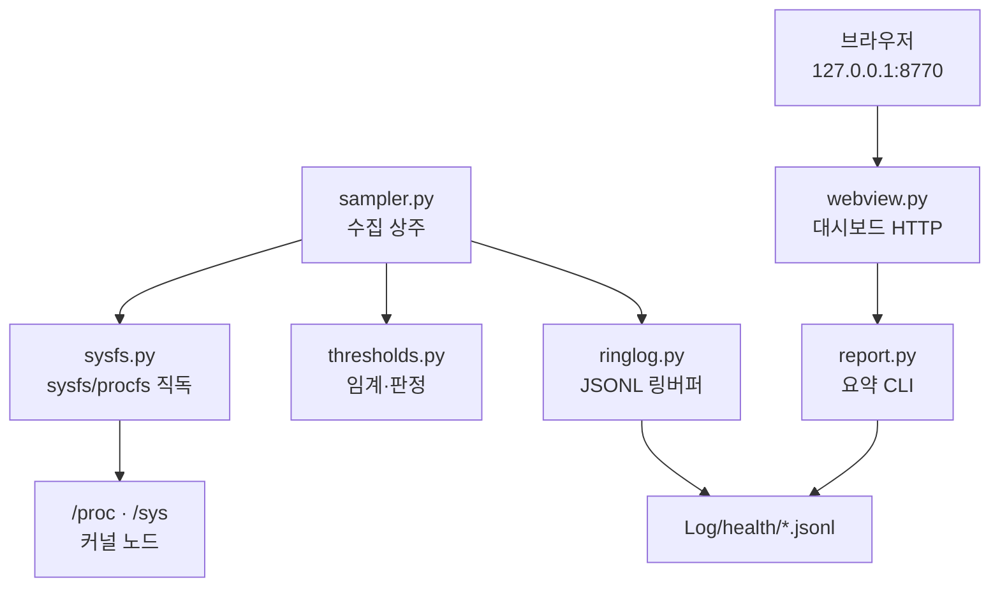
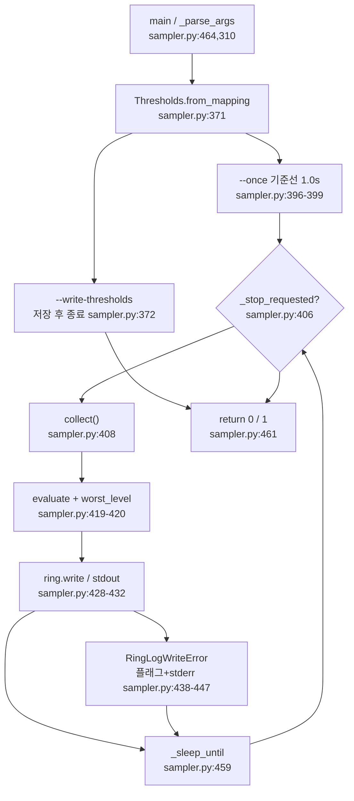
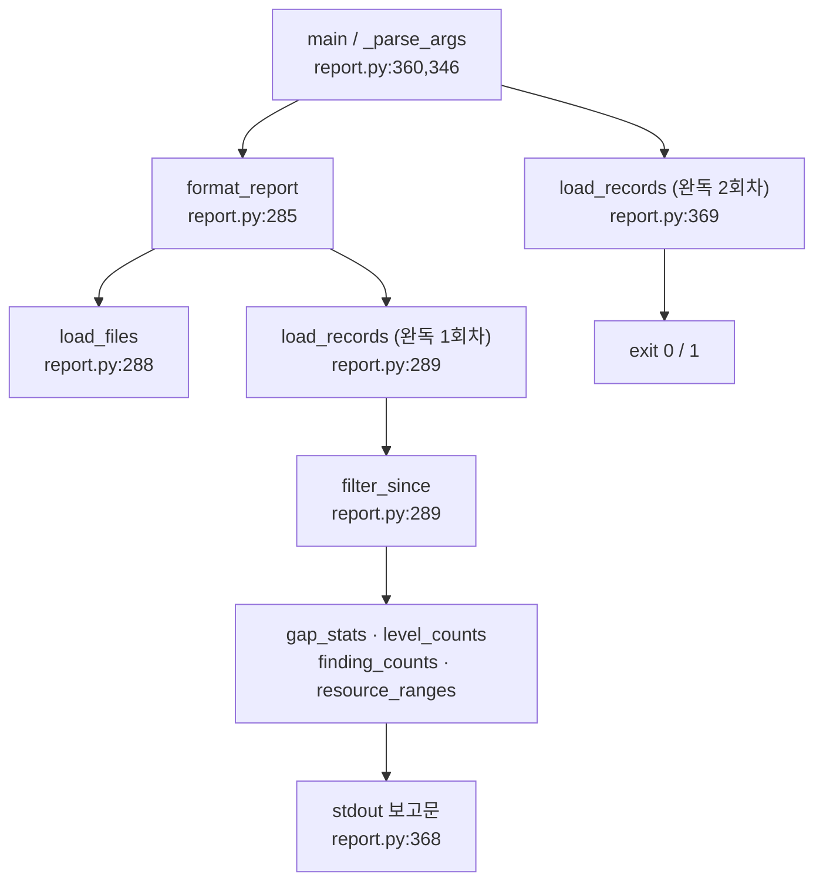
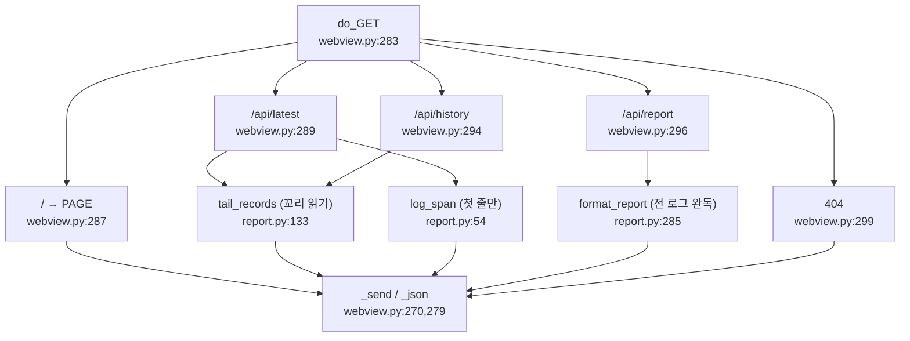

# system_health 패키지 — 코드 리뷰 (날짜=버전)

## 2026-08-07 (KST) — 전체 구조 분석 (최초 리뷰)

> ⚠ **본 문서는 스냅샷이다.** 2026-08-09 에 아래 권고가 전부 반영되어 코드가 바뀌었다 —
> 현행 `파일:줄` 앵커와 findings 상태의 권위본은 [2026-08-09](2026-08-09.md) 다.
> 본 문서의 앵커는 **주석 정정(부록 A)까지 반영한 시점** 기준이며 그 이후 변경은 반영하지 않았다.

### 코드 버전

패키지가 **현재 브랜치에서 git 미추적**이므로 작업트리를 커밋으로 직접 고정할 수 없다. 다만 같은 내용이
`origin/main` 에 커밋되어 있어 두 근거를 함께 박는다.

```
$ git -C <repo> status --short -- src/Safety/            → ?? src/Safety/
$ git -C <repo> ls-files src/Safety/system_health | wc -l → 0
$ git -C <repo> log --oneline -1 origin/main -- src/Safety/system_health
757056d feat(safety): Phase 3a — SW 이상유무 워치독 (선언 기반, ROS 무의존)
$ for f in $(git ls-tree -r --name-only origin/main src/Safety/system_health/); do
    diff -q <(git show "origin/main:$f") "$f"; done   → 차이 0건 · 양방향 파일 목록 차이 0건
```

- **리뷰 대상 코드 버전**: 작업트리 = `origin/main` 의 `757056d` 시점 내용(위 대조로 확인).
- **내용 해시**(캐시 제외 26개 파일 정렬 후 sha256 of sha256sum): `0a3142d8214348c2e36a2eea2a648bd4ac75f8e077b497459f0530b51814ef31`
- 현재 로컬 브랜치 `main` 은 `origin/main` 대비 ahead 11 / behind 286 이라 이 경로가 체크아웃되어 있지 않다.

| 파일 | md5(앞 8) | 줄수 |
| --- | --- | --- |
| `system_health/sysfs.py` | `6ffc10c6` | 738 |
| `system_health/sampler.py` | `c202ccf4` | 474 |
| `system_health/thresholds.py` | `5412c92e` | 417 |
| `system_health/report.py` | `557ca9d0` | 373 |
| `system_health/webview.py` | `156cf164` | 359 |
| `system_health/ringlog.py` | `0fa272fa` | 160 |
| `system_health/__init__.py` | `bd6ec992` | 10 |
| `install_service.sh` | `733821a5` | 105 |
| `setup.py` | `29a54b9d` | 28 |
| `package.xml` | `4d7e6d12` | 18 |
| `systemd/amr-health-sampler.service` | `9ab6fd01` | 48 |
| `systemd/amr-health-webview.service` | `37bd1752` | 48 |

> **리뷰 후 같은 날 주석 정정 21건 적용** — ADR 원문 대조 결과 오귀속 2 · ADR 미지정 10 ·
> 근거 누락 1, 주석 규율(정정 경위 제거) 2, S6 게이트(확인 근거 부재) 6 을 고쳤다(§부록 A).
> **코드 로직 변경 0줄**(주석·docstring 만, `183 passed` 유지). 정정으로 줄번호가 밀려 본 문서의
> `파일:줄` 앵커는 **정정 후 기준으로 재계산**했고, 함수표 104행 전수를 소스와 대조해
> 일치 104 / 불일치 0 을 확인했다.
>
> 정정 후 해시: `sysfs.py` `bc9ae8ef`(740줄) · `sampler.py` `bc5f7b0d`(476줄) ·
> `thresholds.py` `2da7d7ac`(421줄) · `install_service.sh` `c9462401` ·
> `amr-health-sampler.service` `5efae91b` · `test/test_sampler.py` `73b8ff5c` ·
> `test/test_sysfs.py` `e439b4b7` · `test/test_swhealth.py` `9464a74b` · `.dup-allow` `f186c6b6`.
> 패키지 전체(리뷰 산출물 제외) sha256: `2d4a9af1bc251e3f9829eb6f2bb330a1d21c943f8635e25d03db80c1c1cafd3d`.
> 나머지 파일(`report.py`·`webview.py`·`ringlog.py`·`__init__.py`·`setup.py`·`package.xml`·
> `amr-health-webview.service`)은 위 표의 해시 그대로다.

- 직전 리뷰: 없음(본 문서가 최초). `docs/code_review/` 에 `system_health` 주제 폴더 0건이었다.
- 관련 1차 문서: `docs/adr/2026-07-28-system-health-monitor.md`, `docs/adr/2026-08-01-system-health-phase3-sw-watchdog.md`,
  `src/Safety/system_health/docs/sw_structure/system-health/2026-07-28.md`.
- 테스트 실행 결과(리뷰 시점 실측): `python3 -m pytest test -q` → **183 passed in 10.31s**.

### 분석 분기 명시

- 분기: **전체 구조 분석**(디렉토리 단위, 진입점 3개)
- 감지된 도메인: **ros2-review**(트리거 `package.xml` + `ament_python` build_type, `package.xml:16`) ·
  **concurrency**(트리거 `signal` 핸들러 + 모듈 전역, `sampler.py:54`; `ThreadingHTTPServer`, `webview.py:21`).
  embedded-review 는 트리거(ISR·NVIC·FreeRTOS·`volatile`) 매칭 0건이라 비활성.

---

## Core 인벤토리

### 1. 목적

**AMR 본체 PC(Jetson Orin NX)의 자원·소프트웨어 건강을 관측만 하는 상주 감시 패키지**다. 제어는 하지 않는다 —
`sampler.py:8-10` 이 "온도가 높든 팬이 멈췄든 본 프로그램은 기록·경보만 한다"고 못 박고, 그 근거로 검증되지 않은
지령이 실장비를 손상시킨 사건(`docs/claude-mistake/2026-07-27-002`)을 인용한다.

설계의 축은 **ROS 무의존**이다(`package.xml:6`, ADR 2026-07-28 §Decision 2). ROS 가 죽은 순간이 자원 로그를 가장
보고 싶은 시점인데 ROS 노드 안에 넣으면 그때 같이 죽기 때문이다. 이 불변식은 문서가 아니라 테스트가 지킨다 —
`test/test_no_rclpy_import.py` 가 ①소스에 `import rclpy` 문이 있는지 정적 검사, ②별도 인터프리터에서 import 후
`sys.modules` 에 rclpy 가 적재됐는지 동적 검사를 이중으로 건다.

수집 경로도 같은 원칙을 따른다. `tegrastats` 파싱·`psutil`·`ros2 topic hz` 서브프로세스를 모두 배제하고
sysfs/procfs 를 직독한다(`sysfs.py:3-9`) — 커널 ABI 가 문자열 출력보다 안정적이고, 서브프로세스가 DDS
participant 를 만들면 관측이 대상을 바꾸기 때문이다. 모든 reader 는 노드 부재에 관대해 `None`/빈 컬렉션을
돌려주며, 예외를 전파하는 것은 사용자가 경로를 지정하는 `read_disk()` 하나뿐이다(`sysfs.py:11-13`).

구성은 **수집(sampler) · 요약(report) · 열람(webview)** 3개 독립 진입점이다. 셋을 합치지 않은 이유는
`.dup-allow` 에 명시돼 있다 — 대시보드가 죽어도 기록은 계속되고, 수집기는 나머지 둘이 없어도 돌아야 한다.

### 2. 코드 플로우차트

진입점이 3개이므로 SOP 의 **다중 진입점 분리 룰**에 따라 path 별 흐름도 + 공통 호출 그래프를 분리한다.
각 흐름도는 동반 `.drawio` 를 가지며 `checks/drawio_validate.py` 로 dangling 0 · 노드·엣지 1:1 을 확인했다.

#### 2-A. 공통 호출 그래프 (`2026-08-07-flow-modules.drawio`)



`webview` 는 `report` 의 `format_report`·`log_span`·`tail_records` 만 재사용하고 `sysfs` 를 건드리지 않는다
(`webview.py:26`) — 열람 경로가 커널 노드를 다시 읽지 않게 한 분리다.

#### 2-B. sampler 진입점 (`2026-08-07-flow-sampler.drawio`)



#### 2-C. report 진입점 (`2026-08-07-flow-report.drawio`)



#### 2-D. webview 요청 처리 (`2026-08-07-flow-webview.drawio`)



### 3. 함수 리스트

전수(private·property·staticmethod·이너 함수·PAGE 안의 브라우저 JS 함수 포함). dataclass 는 생성 계약을 갖는
값객체이므로 행으로 포함한다.

| # | 함수 | 입력 | 출력 | 기능 | 위치 |
| --- | --- | --- | --- | --- | --- |
| 1 | `_read_text` | `path` | `str \| None` | 파일 읽어 strip, 실패 시 None | sysfs.py:66 |
| 2 | `_read_int` | `path` | `int \| None` | 파일을 정수로, 실패 시 None | sysfs.py:74 |
| 3 | `_unique_key` | `key, seen` | `str` | 동일 type 노드 키 충돌 회피(`X#1`) | sysfs.py:85 |
| 4 | `read_temperatures_c` | 없음 | `dict[str,float]` | thermal zone 온도(°C) 전수 | sysfs.py:98 |
| 5 | `read_cooling_states` | 없음 | `dict[str,int]` | 냉각장치 `cur_state`(개입 여부) | sysfs.py:116 |
| 6 | `FanInfo` (frozen dataclass) | `pwm, rpm` | 인스턴스 | 팬 상태 값객체 | sysfs.py:139-152 |
| 7 | `read_fan` | 없음 | `FanInfo` | pwm-fan hwmon 읽기(읽기 전용) | sysfs.py:154 |
| 8 | `CpuTimes` (frozen dataclass) | `idle, total` | 인스턴스 | `/proc/stat` 누적 시간 | sysfs.py:173-178 |
| 9 | `CpuSnapshot` (frozen dataclass) | `total, per_core` | 인스턴스 | 한 시점 CPU 누적 시간 | sysfs.py:181-186 |
| 10 | `CpuUsage` (frozen dataclass) | `total_pct, per_core_pct` | 인스턴스 | 구간 CPU 사용률 | sysfs.py:189-194 |
| 11 | `_parse_cpu_line` | `fields` | `CpuTimes \| None` | cpu 행 파싱(idle=idle+iowait) | sysfs.py:197 |
| 12 | `read_cpu_times` | 없음 | `CpuSnapshot \| None` | 전체·코어별 누적 시간 수집 | sysfs.py:214 |
| 13 | `_usage_pct` | `prev, cur` | `float` | 두 누적 시간의 구간 사용률 | sysfs.py:241 |
| 14 | `cpu_usage_pct` | `prev, cur` | `CpuUsage` | 스냅샷 2장 차분 → 사용률 | sysfs.py:250 |
| 15 | `read_cpu_freqs_khz` | 없음 | `tuple[int,...]` | 코어별 현재 주파수(kHz) | sysfs.py:270 |
| 16 | `MemoryInfo` (frozen dataclass) | 5 필드 | 인스턴스 | 메모리·스왑 사용량(MB) | sysfs.py:294-306 |
| 17 | `read_memory` | 없음 | `MemoryInfo \| None` | `/proc/meminfo` 파싱 | sysfs.py:309 |
| 18 | `DiskInfo` (frozen dataclass) | `path,total,free,used_pct` | 인스턴스 | 파일시스템 사용량(GB) | sysfs.py:347-354 |
| 19 | `read_disk` | `path` | `DiskInfo` | statvfs(`f_bavail` 기준). **예외 전파** | sysfs.py:357 |
| 20 | `ProcessInfo` (frozen dataclass) | `pid,name,rss_mb` | 인스턴스 | 프로세스 1건 | sysfs.py:386-392 |
| 21 | `ProcessScan` (frozen dataclass) | `count,top_rss,names,pids_by_name` | 인스턴스 | `/proc` 순회 결과 | sysfs.py:395-413 |
| 22 | `_read_process` | `pid` | `ProcessInfo \| None` | `/proc/<pid>/stat` 1건(rpartition) | sysfs.py:416 |
| 23 | `scan_processes` | `top_n=5` | `ProcessScan` | `/proc` 전수 순회 | sysfs.py:436 |
| 24 | `GpuInfo` (frozen dataclass) | `load_pct,freq_hz,max_freq_hz` | 인스턴스 | GR3D 상태 | sysfs.py:470-487 |
| 25 | `read_gpu` | 없음 | `GpuInfo` | GPU 사용률(천분율÷10, **1초 창 20표본 평균**)·devfreq | sysfs.py:539 |
| 26 | `PowerRail` (frozen dataclass) | `name,voltage_mv,current_ma` | 인스턴스 | 전원 레일 1개 | sysfs.py:512-525 |
| 27 | `PowerRail.power_mw` (property) | self | `float` | mV×mA÷1000 = mW 계산값 | sysfs.py:527-530 |
| 28 | `read_power_rails` | 없음 | `tuple[PowerRail,...]` | INA3221 라벨 있는 채널만 | sysfs.py:533 |
| 29 | `SwapCounters` (frozen dataclass) | `pswpin,pswpout` | 인스턴스 | 누적 스왑 페이지 | sysfs.py:567-575 |
| 30 | `read_swap_counters` | 없음 | `SwapCounters \| None` | `/proc/vmstat` 파싱 | sysfs.py:581 |
| 31 | `swap_rate_pages_s` | `prev,cur,elapsed_s` | `(float,float)` | 스왑 in/out 속도(되감기 시 0) | sysfs.py:599 |
| 32 | `CanInterface` (frozen dataclass) | 8 필드 | 인스턴스 | socketcan 상태·누적 카운터 | sysfs.py:620-643 |
| 33 | `CanInterface.total_errors` (property) | self | `int` | rx+tx 에러·드랍 합 | sysfs.py:645-648 |
| 34 | `read_can_interfaces` | 없음 | `tuple[CanInterface,...]` | `type==ARPHRD_CAN` 으로 판별 | sysfs.py:651 |
| 34a | `read_can_interfaces.counter` (이너) | `field` | `int` | statistics 필드 읽기(None→0) | sysfs.py:668 |
| 35 | `can_error_rate` | `prev,cur,elapsed_s` | `float` | 에러 증가율(건/초) | sysfs.py:686 |
| 36 | `count_dds_segments` | 없음 | `int` | `/dev/shm` DDS 세그먼트 수(판정 없음) | sysfs.py:703 |
| 37 | `read_load_average` | 없음 | `tuple \| None` | 1·5·15분 부하 평균 | sysfs.py:721 |
| 38 | `read_uptime_s` | 없음 | `float \| None` | 부팅 후 경과 시간 | sysfs.py:729 |
| 39 | `RingLogWriteError` (예외) | — | — | 기록 실패 신호(삼키지 않기 위함) | ringlog.py:23 |
| 40 | `RingLog` (클래스) | — | — | 일자 회전 + 총량·보존 상한 기록기 | ringlog.py:27 |
| 41 | `RingLog.__init__` | `out_dir, prefix, max_total_mb, max_age_days, enforce_every, clock` | None | 상한·시계 주입 | ringlog.py:33 |
| 42 | `RingLog.directory` (property) | self | `Path` | 로그 디렉토리 | ringlog.py:62-65 |
| 43 | `RingLog._day_string` | self | `str` | 로컬 일자 `YYYY-MM-DD` | ringlog.py:67 |
| 44 | `RingLog.path_for_day` | `day` | `Path` | 일자별 파일 경로 | ringlog.py:71 |
| 45 | `RingLog.existing_files` | self | `list[Path]` | 접두 일치 파일 오름차순 | ringlog.py:75 |
| 46 | `RingLog.write` | `record` | `Path` | JSONL 1줄 append + 주기적 상한 강제 | ringlog.py:81 |
| 47 | `RingLog.enforce_limits` | self | `list[Path]` | 보존기간·총량 초과분 삭제(최신 파일 보존) | ringlog.py:109 |
| 48 | `RingLog._total_size` | self | `float` | 접두 파일 총 바이트 | ringlog.py:143 |
| 49 | `RingLog._unlink` (staticmethod) | `path` | `bool` | 삭제 시도, 실패는 False | ringlog.py:153-160 |
| 50 | `Level` (IntEnum) | — | — | OK/WARN/ERROR 심각도 | thresholds.py:29 |
| 51 | `Finding` (frozen dataclass) | `key,level,value,message` | 인스턴스 | 판정 결과 1건 | thresholds.py:37-51 |
| 52 | `Thresholds` (frozen dataclass) | 18 필드 | 인스턴스 | 경보 임계값 묶음 | thresholds.py:54-100 |
| 53 | `Thresholds.__post_init__` | self | None | JSON list → tuple 정규화 | thresholds.py:102 |
| 54 | `Thresholds.from_mapping` (classmethod) | `overrides` | `Thresholds` | 기본값+덮어쓰기, 미지·폐기 키 거부 | thresholds.py:111-142 |
| 55 | `Thresholds.to_mapping` | self | `dict` | 직렬화(from_mapping 역함수) | thresholds.py:144 |
| 56 | `_grade` | `value,warn_at,error_at,higher_is_worse` | `Level` | 단일 값 등급화 | thresholds.py:167 |
| 57 | `_hottest` | `temps` | `(str,float) \| None` | 최고 온도 존 | thresholds.py:197 |
| 58 | `evaluate` | `record, th` | `tuple[Finding,...]` | record 전 항목 판정(WARN/ERROR 만) | thresholds.py:205 |
| 59 | `worst_level` | `findings` | `Level` | 최고 심각도(빈 입력 OK) | thresholds.py:419 |
| 60 | `_on_stop_signal` | `signum, frame` | None | SIGTERM/SIGINT → 정지 플래그 | sampler.py:54 |
| 61 | `is_stop_requested` | 없음 | `bool` | 정지 플래그 조회(테스트 노출) | sampler.py:64 |
| 62 | `reset_stop_flag` | 없음 | None | 정지 플래그 해제(테스트 격리) | sampler.py:69 |
| 63 | `SampleState` (frozen dataclass) | `stamp,cpu,swap,can,pids` | 인스턴스 | 차분·비교용 직전 표본 묶음 | sampler.py:75-89 |
| 64 | `collect` | `prev, disk_paths, proc_scan, top_rss, fan_daemon_name, expected_processes, now` | `(record, SampleState)` | 한 시점 자원 record 생성 | sampler.py:92 |
| 65 | `_format_findings` | `findings` | `str` | 경보를 사람이 읽을 줄로 | sampler.py:244 |
| 66 | `_sleep_until` | `deadline` | None | 0.2s 청크 분할 대기(정지 반응) | sampler.py:249 |
| 67 | `_load_threshold_overrides` | `path` | `dict` | 임계 JSON 로드(실패 시 SystemExit) | sampler.py:258 |
| 68 | `_write_thresholds` | `path, th` | `int` | 임계값을 주석 포함 JSON 으로 저장 | sampler.py:277 |
| 69 | `_parse_args` | `argv` | `Namespace` | sampler CLI 해석 | sampler.py:312 |
| 70 | `run` | `args` | `int` | 샘플 루프 본체 | sampler.py:363 |
| 71 | `main` | `argv` | `int` | sampler 진입점 | sampler.py:464 |
| 72 | `LogFileInfo` (frozen dataclass) | `path,records,bytes` | 인스턴스 | 로그 파일 요약 | report.py:33-39 |
| 73 | `list_log_paths` | `log_dir, prefix` | `list[Path]` | 경로만 날짜순(내용 미독) | report.py:42 |
| 74 | `log_span` | `log_dir, prefix` | `dict` | 파일 수·총 바이트·첫 표본 시각 | report.py:54 |
| 75 | `load_files` | `log_dir, prefix` | `list[LogFileInfo]` | 파일별 표본 수·크기(완독) | report.py:79 |
| 76 | `load_records` | `log_dir, prefix` | `list[dict]` | 전 표본 시간순 로드(완독) | report.py:107 |
| 77 | `tail_records` | `log_dir, n, prefix` | `list[dict]` | 최근 n 개만 역방향 블록 읽기 | report.py:133 |
| 78 | `sample_gaps` | `records` | `list[float]` | 연속 표본 간격 | report.py:181 |
| 79 | `gap_stats` | `gaps, interval_s` | `dict` | 간격 통계·결손 추정 | report.py:187 |
| 80 | `level_counts` | `records` | `dict[str,int]` | 등급별 표본 수 | report.py:213 |
| 81 | `finding_counts` | `records` | `dict[str,dict]` | 경보 키·등급별 횟수 | report.py:222 |
| 82 | `_series` | `records, pick` | `list[float]` | 수열 추출(예외·None 제거) | report.py:233 |
| 83 | `resource_ranges` | `records` | `dict[str,dict]` | 항목별 최소·최대·마지막 | report.py:246 |
| 84 | `filter_since` | `records, since` | `list[dict]` | ISO 시각 이후만 | report.py:267 |
| 85 | `format_report` | `log_dir, interval_s, prefix, since` | `str` | 사람이 읽는 6절 보고문 | report.py:285 |
| 86 | `_parse_args` | `argv` | `Namespace` | report CLI 해석 | report.py:346 |
| 87 | `main` | `argv` | `int` | report 진입점 | report.py:360 |
| 88 | `latest_payload` | `records, span` | `dict` | 최신 표본 + 구간 요약 | webview.py:43 |
| 89 | `history_payload` | `records, n` | `dict` | 차트용 7계열 시계열 | webview.py:60 |
| 90 | `_Handler` (클래스) | — | — | 읽기 전용 GET 핸들러 | webview.py:259 |
| 91 | `_Handler.log_message` | `fmt, *args` | None | 접속 로그 억제(I/O 최소화) | webview.py:267 |
| 92 | `_Handler._send` | `code, body, ctype` | None | 응답 송신(HEAD 시 본문 생략) | webview.py:270 |
| 93 | `_Handler._json` | `payload` | None | JSON 응답 | webview.py:279 |
| 94 | `_Handler.do_GET` | 없음 | None | 5개 경로 라우팅(= `do_HEAD`) | webview.py:283 |
| 95 | `make_server` | `log_dir, bind, port, prefix, interval_s` | `ThreadingHTTPServer` | 핸들러 서브클래스 주입 후 서버 생성 | webview.py:307 |
| 96 | `_parse_args` | `argv` | `Namespace` | webview CLI 해석 | webview.py:325 |
| 97 | `main` | `argv` | `int` | webview 진입점(외부 바인드 경고) | webview.py:339 |
| 98 | `$` (브라우저 JS) | `s` | Element | querySelector 축약 | webview.py:157 |
| 99 | `fmt` (브라우저 JS) | `v, d` | `string` | 소수 자리 포맷(null→em dash) | webview.py:159 |
| 100 | `line` (브라우저 JS) | `sel,t,vals,unit,dec` | None | SVG 단일 계열 라인차트 렌더 | webview.py:161 |
| 100a | `line.move` (이너 JS) | `e` | None | 포인터 최근접 표본 툴팁 | webview.py:182 |
| 101 | `tile` (브라우저 JS) | `k,v,u` | `string` | 통계 타일 HTML 생성 | webview.py:195 |
| 102 | `tick` (브라우저 JS) | 없음 | Promise | 5초 주기 갱신 루프 본체 | webview.py:198 |

**중복/유사 함수**: `_parse_args`(#69·#86·#96)와 `main`(#71·#87·#97)이 모듈 3개에 각각 존재한다. 이는 dup 검사에
예외 등록된 **의도된 중복**이며 근거가 `.dup-allow:1-8` 에 적혀 있다(진입점 3개를 합치면 ROS·의존 최소화 원칙이
깨진다). 리뷰에서 통합을 권고하지 않는다.

### 4. 전역 변수 / 모듈 상수

| # | 사용처(함수) | 기능 | 위치 |
| --- | --- | --- | --- |
| G1 | `_on_stop_signal`(쓰기) · `run`·`_sleep_until`(읽기) | **`_stop_requested` (가변)** — 유일한 가변 모듈 전역 | sampler.py:51 |
| G2 | `read_temperatures_c` | `_MILLI_C_PER_C` (상수) 온도 단위 환산 | sysfs.py:22 |
| G3 | `read_memory` | `_KB_PER_MB` (상수) | sysfs.py:23 |
| G4 | `read_disk` | `_BYTES_PER_GB` (상수) | sysfs.py:24 |
| G5 | `read_temperatures_c` | `_THERMAL_ZONE_ROOT` (상수 경로) | sysfs.py:26 |
| G6 | `read_cooling_states` | `_COOLING_DEVICE_ROOT` (상수 경로) | sysfs.py:27 |
| G7 | `read_cpu_freqs_khz` | `_CPUFREQ_ROOT` (상수 경로) | sysfs.py:28 |
| G8 | `read_gpu` | `_GPU_LOAD_PATHS` (상수) 후보 경로 2종 | sysfs.py:32-35 |
| G9 | `read_gpu` | `_GPU_LOAD_PER_MILLE` (상수) 천분율÷10 | sysfs.py:37 |
| G9a | `read_gpu` | `_GPU_LOAD_SAMPLES`·`_GPU_LOAD_WINDOW_S` (상수) 부하 창 평균 표본수·창 길이 | sysfs.py:43-44 |
| G10 | `read_gpu` | `_DEVFREQ_ROOT` (상수 경로) | sysfs.py:37 |
| G11 | `read_power_rails` | `_HWMON_ROOT` (상수 경로) | sysfs.py:41 |
| G12 | `read_power_rails` | `_INA3221_NAME` (상수) 드라이버 이름 | sysfs.py:42 |
| G13 | `read_power_rails` | `_MAX_RAIL_CHANNELS` (상수) 채널 상한 8 | sysfs.py:43 |
| G14 | `read_can_interfaces` | `_NETDEV_ROOT` (상수 경로) | sysfs.py:44 |
| G15 | `read_can_interfaces` | `_ARPHRD_CAN` (상수) 280 | sysfs.py:47 |
| G16 | `count_dds_segments` | `_SHM_ROOT` (상수 경로) | sysfs.py:48 |
| G17 | `count_dds_segments` | `_DDS_SHM_PATTERNS` (상수) | sysfs.py:50 |
| G18 | `read_fan` | `_FAN_HWMON_ROOT` (상수 경로) | sysfs.py:52 |
| G19 | `read_cpu_times`·`read_memory`·`_read_process` 등 | `_PROC_ROOT` (상수 경로) | sysfs.py:53 |
| G20 | **사용처 0건** | `_PROC_STAT_UTIME` (상수) | sysfs.py:56 |
| G21 | **사용처 0건** | `_PROC_STAT_STIME` (상수) | sysfs.py:57 |
| G22 | `_read_process` | `_PROC_STAT_RSS_PAGES` (상수) | sysfs.py:58 |
| G23 | `_read_process` | `_PAGE_MB` (상수, import 시 `os.sysconf` 1회) | sysfs.py:60 |
| G24 | `RingLog.__init__` | `_BYTES_PER_MB` (상수) | ringlog.py:19 |
| G25 | `RingLog.__init__` | `_SECONDS_PER_DAY` (상수) | ringlog.py:20 |
| G26 | `Thresholds.from_mapping` | `COMMENT_KEY_PREFIX` (상수) `_` 주석 키 | thresholds.py:26 |
| G27 | `_write_thresholds` | `PROVISIONAL_KEYS` (상수) 잠정 항목 4종 | thresholds.py:154-156 |
| G28 | `Thresholds.from_mapping` | `RETIRED_KEYS` (상수) 폐기 키→대체 안내 | thresholds.py:161-164 |
| G29 | `_parse_args`(sampler) | `DEFAULT_INTERVAL_S` 외 기본값 5종 | sampler.py:32-38 |
| G30 | `run` | `ONCE_BASELINE_DELAY_S` (상수) 1.0s | sampler.py:40 |
| G31 | `_sleep_until` | `_SLEEP_CHUNK_S` (상수) 0.2s | sampler.py:42 |
| G32 | `gap_stats` | `GAP_FACTOR` (상수) 1.5 | report.py:30 |
| G33 | `tail_records` | `_TAIL_BLOCK` (상수) 64 KiB | report.py:130 |
| G34 | `format_report` | `_BYTES_PER_MB` (상수) | report.py:27 |
| G35 | `_parse_args`(webview)·`make_server` | `DEFAULT_PORT`·`DEFAULT_BIND` (상수) | webview.py:28-29 |
| G36 | `do_GET`·`history_payload` | `DEFAULT_HISTORY`·`MAX_HISTORY` (상수) | webview.py:31-32 |
| G37 | **사용처 0건** | `LEVEL_VIEW` (상수) — 같은 매핑이 JS `LV` 로 재정의됨 | webview.py:36-40 |
| G38 | `do_GET` | `PAGE` (상수) 대시보드 HTML 전문 | webview.py:86-256 |
| G39 | `make_server`(주입) · `do_GET`(읽기) | `_Handler.log_dir`·`prefix`·`interval_s` 클래스 속성 | webview.py:262-264 |

**필요성 평가**: 가변 전역은 G1 하나뿐이고, 신호 핸들러라는 언어 제약상 대안이 마땅치 않다(핸들러 시그니처에
상태를 주입할 수 없다). 근거·소유권이 `sampler.py:44-48` 에 writer/reader 로 명시돼 있어 결합도 위험은 낮다.
G39 는 `http.server` 가 핸들러를 클래스로만 받는 제약을 서브클래스 주입으로 우회한 것으로, 생성 후 불변이다.
G20·G21·G37 은 사용처 0건이다(→ 평가 Low-4).

### 5. 의존성 3-tier

| Tier | 대상 | 버전/제약 | 부재 시 동작(필수/선택) | 근거(파일:line) |
| --- | --- | --- | --- | --- |
| 빌드 | `setuptools` | 제약 없음 | 빌드 불가 | setup.py:17 |
| 빌드 | `ament_python` | ROS2 build_type | `colcon build` 불가(직접 실행은 가능) | package.xml:16 |
| 빌드 | `python3-pytest` | test_depend | 테스트 실행 불가 | package.xml:13 |
| 런타임 필수 | CPython | 본 PC 실측 3.10.12. **최소 버전 미선언**(`python_requires` 0건) | 미확인 — 하위 버전 동작은 본 리뷰 미실측 | setup.py:1-28 |
| 런타임 필수 | Linux `/proc` | procfs 마운트 | `_PROC_ROOT.is_dir()` False → `scan_processes` 가 count=0 반환, CPU·메모리·스왑 항목이 record 에서 빠지고 그 항목은 판정 생략 | sysfs.py:448-449, 219-221, 314-316 |
| 런타임 필수 | `os.statvfs` (POSIX) | — | `read_disk` 만 예외 전파 → `collect` 가 `{"path":…, "error":…}` 로 기록 계속 | sysfs.py:371, sampler.py:166-170 |
| 런타임 필수 | 쓰기 가능한 `--out-dir` | systemd `ReadWritePaths` 로 한정 | `RingLogWriteError` → stderr 출력 + 다음 판정에 `log_write` ERROR 승격, 루프는 계속 | ringlog.py:99-100, sampler.py:438-447, thresholds.py:405-413 |
| 런타임 선택 | thermal zone `/sys/devices/virtual/thermal` | — | 빈 dict → 온도 판정 생략 | sysfs.py:105-106, thresholds.py:218-219 |
| 런타임 선택 | INA3221 hwmon | 라벨 있는 채널만 채택 | 빈 튜플 → `power` 항목 자체를 record 에 넣지 않음 | sysfs.py:542-543, sampler.py:149 |
| 런타임 선택 | `pwm-fan` hwmon | rpm 노드는 본 HW 에 부재 | `FanInfo(None,None)` → 팬 타일이 em dash | sysfs.py:160-161 |
| 런타임 선택 | devfreq `*.gpu` | — | `GpuInfo` 필드 None → GPU 판정 생략 | sysfs.py:503-509, thresholds.py:292 |
| 런타임 선택 | socketcan 인터페이스 | `type==280` 으로 판별 | 빈 튜플 → `can` 항목 미기록(CAN 미사용 운영도 정상) | sysfs.py:652-659 |
| 런타임 선택 | `/dev/shm` DDS 세그먼트 | — | 0 반환, 판정하지 않고 기록만 | sysfs.py:706-718 |
| 런타임 선택 | `nvfancontrol` 데몬 | `proc_scan` 주기에만 확인 | 미검출 시 `fan_daemon` ERROR 경보 | thresholds.py:345-355 |
| 런타임 선택 | 임계값 JSON | `--thresholds` | 경로 미지정 시 코드 기본값 사용 | sampler.py:259-261 |
| 런타임 선택 | systemd · sudo | 설치 시에만 | `install_service.sh` 없이도 CLI 로 직접 실행 가능 | install_service.sh:39-60 |
| 런타임 선택 | `rclpy` | **의도적 비의존** | 해당 없음 — `grep -rnE '^\s*(import rclpy\|from rclpy)' system_health/*.py` → 0건, 동적 검사도 `test_no_rclpy_import.py:56-70` 가 상시 수행 | package.xml:10-11 |

---

## 도메인 인벤토리

### ros2-review 추가 표

본 패키지는 `ament_python` ROS2 패키지로 **선언**되어 있으나 노드를 만들지 않는다(Phase 1 범위). 아래 표는
비어 있으며, 그것이 설계 의도임을 ADR 이 명시한다(`package.xml:10-11`).

**A-1. Subscriptions**

| 토픽 | 메시지 타입 | QoS(depth·reliability·durability·history) | 콜백 함수 | 위치(file:line) |
| --- | --- | --- | --- | --- |
| 해당 없음 | 해당 없음 | 해당 없음 | 해당 없음 | `grep -rn "create_subscription" system_health/` → 0건 |

**A-2. Publications**

| 토픽 | 메시지 타입 | QoS | 발행 위치(함수) | 위치(file:line) |
| --- | --- | --- | --- | --- |
| 해당 없음 | 해당 없음 | 해당 없음 | 해당 없음 | `grep -rn "create_publisher" system_health/` → 0건 |

**A-3. Services / Actions** — 해당 없음(`grep -rn "create_service\|ActionServer" system_health/` → 0건).
**A-5. TF frames** — 해당 없음(`grep -rn "TransformBroadcaster\|lookup_transform" system_health/` → 0건).
**A-6. QoS 호환 매트릭스 (RxO — Requested vs Offered)** — pub·sub 양쪽이 0건이라 대조 대상 없음.
`BEST_EFFORT`→`RELIABLE`, `VOLATILE`→`TRANSIENT_LOCAL` 같은 불일치 축은 이 패키지에 성립하지 않는다.
**A-7. 노드 연결 그래프** — ROS 노드 0개. 대신 프로세스 간 결합은 §2-A 공통 호출 그래프가 담당하며,
결합 매체는 토픽이 아니라 **파일**(`Log/health/*.jsonl`)이다.

**A-4. Parameters** — ROS 파라미터 대신 **JSON 임계값 파일**이 같은 역할을 한다(`--thresholds`,
`sampler.py:348`). 선언 위치는 `Thresholds` 필드(`thresholds.py:54-100`), 사용 위치는 `evaluate`
(`thresholds.py:205`)다.

| 이름 | 타입 | default | declare 위치 | 사용 위치 |
| --- | --- | --- | --- | --- |
| `temp_warn_c` / `temp_error_c` | float | 75.0 / 85.0 (⚠ 잠정) | thresholds.py:62-63 | thresholds.py:221 |
| `cpu_warn_pct` / `cpu_error_pct` | float | 85.0 / 95.0 (⚠ 잠정) | thresholds.py:64-65 | thresholds.py:235 |
| `mem_available_warn_mb` / `_error_mb` | float | 2000.0 / 1000.0 | thresholds.py:66-67 | thresholds.py:250-255 |
| `swap_rate_warn_pages_s` / `_error_pages_s` | float | 64.0 / 512.0 | thresholds.py:72-73 | thresholds.py:270-275 |
| `disk_free_warn_gb` / `_error_gb` | float | 10.0 / 6.0 | thresholds.py:74-75 | thresholds.py:309-314 |
| `gpu_warn_pct` / `gpu_error_pct` | float\|None | None (비활성) | thresholds.py:79-80 | thresholds.py:292 |
| `input_rail_name` | str | `"VDD_IN"` | thresholds.py:84 | thresholds.py:326 |
| `input_current_warn_ma` / `_error_ma` | float\|None | None (비활성) | thresholds.py:85-86 | thresholds.py:327-328 |
| `expected_processes` | tuple[str,...] | `()` (판정 안 함) | thresholds.py:93 | sampler.py:224-238 |
| `can_error_rate_warn_s` / `_error_s` | float\|None | None (비활성) | thresholds.py:96-97 | thresholds.py:389-390 |
| `fan_daemon_name` | str | `"nvfancontrol"` | thresholds.py:100 | sampler.py:222 |

설정 파일 예시(의미 그룹별 분리 + 단위 주석 — 실제 JSON 에서는 `_` 접두 키가 주석 역할을 하며
`from_mapping` 이 이를 무시한다, `thresholds.py:126-128`):

```jsonc
{
  "_설명": "AMR 자원 감시 임계값",
  // 의미 그룹 1 (열)
  "temp_warn_c":  75.0,          # °C, 잠정치
  "temp_error_c": 85.0,          # °C, 잠정치
  // 의미 그룹 2 (연산 부하)
  "cpu_warn_pct": 85.0,          # %, 순간값
  "swap_rate_warn_pages_s": 64.0, # pages/s (4 KiB 페이지 기준 약 0.25 MB/s)
  // 의미 그룹 3 (저장)
  "disk_free_warn_gb": 10.0,     # GB
  // 의미 그룹 4 (전원)
  "input_current_warn_ma": null  # mA, null 이면 판정 비활성
}
```

### concurrency 추가 표

**B-1. 동기화 객체**

| 객체 | 종류(Mutex/Lock/Event/Semaphore/Atomic/Condvar) | 보호 자원 | 획득 위치 | 해제 위치 |
| --- | --- | --- | --- | --- |
| 해당 없음 | — | — | `grep -rn "Lock()\|Semaphore\|Event()" system_health/` → 0건 | — |

동기화 객체를 두지 않은 근거가 코드에 적혀 있다: `RingLog` 는 단일 스레드 전제(`ringlog.py:30`),
`_stop_requested` 는 단일 writer + bool 대입(`sampler.py:44-48`).

**B-2. 공유 상태**

| 변수 | 읽기 위치 | 쓰기 위치 | 변경 방식 | 공유 방식 | 보호 객체 |
| --- | --- | --- | --- | --- | --- |
| `_stop_requested` | `run` sampler.py:406 · `_sleep_until` sampler.py:251 · `is_stop_requested` :64 | `_on_stop_signal` sampler.py:60-61 · `reset_stop_flag` :69-70 | 단순 대입(read-modify-write 아님) | 모듈 전역, 메인 스레드 ↔ 신호 핸들러 컨텍스트 | **비보호**(의도적 — 단일 writer) |
| `_Handler.log_dir`·`prefix`·`interval_s` | `do_GET` webview.py:289-296 | `make_server` webview.py:320-321 (생성 시 1회) | 서브클래스 생성 시 대입 후 불변 | 요청 스레드 전원 공유 | **비보호**(생성 후 읽기 전용) |
| `RingLog._writes_since_enforce`·`_current_day` | `write` ringlog.py:104 | `write` ringlog.py:102-105 | **복합 연산**(`+= 1`, read-modify-write) | 인스턴스 지역, 단일 스레드 전제 | **비보호**(단일 스레드라 경합 없음, ringlog.py:30) |

**B-3. 실행 컨텍스트**

| 이름 | 종류(thread/task/coroutine/callback group/executor) | 우선순위·executor | 생성 위치 |
| --- | --- | --- | --- |
| sampler 메인 루프 | 프로세스 메인 스레드 | systemd `Nice=10`, `IOSchedulingClass=idle` | sampler.py:406, amr-health-sampler.service:37-38 |
| SIGTERM/SIGINT 핸들러 | 신호 핸들러(메인 스레드 인터럽트) | — | sampler.py:383-384 |
| webview 요청 스레드 | `ThreadingHTTPServer` 요청당 1 스레드(daemon) | systemd `Nice=10`, `IOSchedulingClass=idle` | webview.py:322, amr-health-webview.service:35-36 |
| 테스트 보조 스레드 | `threading.Thread` / `threading.Timer` | — | test/test_report_and_webview.py:166,229 · test/test_sampler.py:206 |

---

## 평가

severity 분포: Critical 0 / High 1 / Medium 5 / Low 9 / Info 3
Verdict: REQUEST CHANGES

findings 상태는 전부 `[신규]`다(최초 리뷰).

### High

**함수 #54 `Thresholds.from_mapping` — [논리][param][신규] 값의 타입·대소 순서를 검증하지 않아 잘못된 임계값 파일이 로드가 아니라 첫 판정에서 터진다 (High)**

재현(실측):

```
$ python3 -c "from system_health.thresholds import Thresholds, evaluate;
              th=Thresholds.from_mapping({'temp_warn_c':'hot'});
              evaluate({'temperatures_c':{'cpu':78.0}}, th)"
from_mapping 통과: 'hot' (str)
evaluate 예외: TypeError: '>=' not supported between instances of 'float' and 'str'
```

`from_mapping`(thresholds.py:111-142)은 **키**는 엄격하게 검증한다 — 미지 키는 `KeyError`, 폐기 키는 대체 안내와
함께 거부한다(:127-137). 그러나 **값**은 그대로 dataclass 에 넣는다. 그 결과 `"75"`·`"hot"` 같은 문자열이 통과하고
`_grade`(#56, thresholds.py:184-193)의 비교 연산에서 `TypeError` 가 난다. 이 예외는 `run`(#70) 어디에서도 잡히지
않으므로 프로세스가 죽고, 유닛이 `Restart=always` / `RestartSec=5`(amr-health-sampler.service:32-33)이므로
**5초 주기 재시작 루프**가 된다 — 감시기가 살아 있는 것처럼 보이면서 기록이 0인 상태로, `ringlog.py:5-7` 이
"최악의 상태"로 규정한 바로 그 형태다.

순서 검증 부재도 같은 함수 소관이다. `{"temp_warn_c":90.0,"temp_error_c":85.0}` 는 그대로 통과하고, 87 °C 가
`ERROR` 로 판정된다(실측) — WARN 대역이 사라지는데 경고가 없다.

권고: `from_mapping` 에서 ①필드 타입에 맞춘 캐스팅·거부(`float(v)` 실패 시 `KeyError` 와 같은 계열로 즉시 거부),
②`higher_is_worse` 항목은 `warn <= error`, 반대는 `warn >= error` 순서 검증. 기존 `RETIRED_KEYS` 안내와 같은
자리에서 같은 방식으로 거부하면 UX 도 일관된다.

### Medium

**함수 #69 `_parse_args` · #70 `run` — [논리][timing][신규] `--interval` 0·음수를 검증하지 않아 감시기가 대상 PC 의 부하가 된다 (Medium)**

재현(실측, 각 3초 실행):

```
$ python3 -m system_health.sampler --interval -1 --out-dir <tmp>   → 3초간 표본 757개 · 로그 996 KB
$ python3 -m system_health.sampler --interval  0 --out-dir <tmp>   → 3초간 표본 745개 · 로그 980 KB
$ python3 -m system_health.sampler --interval  5 --out-dir <tmp>   → 6초간 표본   2개 (대조군)
$ grep -n "interval" system_health/sampler.py | grep -E "if|<=|assert"   → 0건 (검증 코드 없음)
```

`_sleep_until`(#66, sampler.py:249-255)은 `deadline` 이 이미 지났으면 즉시 반환하므로, 0·음수 주기에서는
`collect()`(#64)가 `/proc`·`/sys` 를 최대 속도로 읽는다. 초당 약 250 표본은 `sysfs.py:8-9` 의 설계 원칙
("관측이 대상을 바꾸면 안 된다")과 systemd 의 `Nice=10`·`IOSchedulingClass=idle` 완화 의도를 모두 무력화한다.
로그 총량은 `RingLog` 상한이 막지만(ringlog.py:136-140) CPU·I/O 는 막지 못한다.

권고: `_parse_args` 에서 `--interval > 0`, `--top-rss >= 0`, `--max-total-mb > 0`, `--max-age-days > 0` 검증 후
`parser.error()`.

**함수 #79 `gap_stats` — [논리][신규] `interval_s == 0` 에서 ZeroDivisionError 로 보고서 생성이 중단된다 (Medium)**

재현(실측):

```
$ python3 -c "from system_health import report; report.format_report('<dir>', 0.0)"
ZeroDivisionError: float division by zero        # report.py:209 sum(round(g / interval_s) …)
$ python3 -c "… report.format_report('<dir>', -5.0)"   → 정상 반환(음수는 통과)
```

`gap_stats`(report.py:198-210)는 `interval_s` 로 두 번 나눈다(`threshold` 계산은 곱이지만 `missing_estimate` 는
나눗셈). `format_report`(#85, report.py:342)의 하루 추정 계산도 같은 값으로 나눈다. `report` CLI 는
`--interval 0` 을 그대로 받고(report.py:352), 웹 경로에서도 `--interval 0` 으로 기동하면 `/api/report` 가
같은 예외를 만난다 — `do_GET`(#94)의 예외 처리는 `ValueError`·`OSError` 만 잡으므로(webview.py:300)
`ZeroDivisionError` 는 핸들러 밖으로 나가 500 응답 대신 연결이 끊긴다.

권고: `_parse_args` 에서 `--interval > 0` 검증(위 항목과 같은 조치로 함께 해소). 방어적으로 `gap_stats`
진입부에 `if interval_s <= 0: return {"count": len(gaps), "gaps_over": [], "missing_estimate": 0}`.

**함수 #85 `format_report` — [논리][신규] `--since` 를 쓰면 ⑥ 로그 성장률이 실제의 2.5배로 부풀려진다 (Medium)**

재현(실측, 5표본 로그에서 뒤 2표본만 자름):

```
전체  : 총 0.00 MB · 표본당 119 B · 하루 추정 2.0 MB
--since: 총 0.00 MB · 표본당 298 B · 하루 추정 4.9 MB      # 같은 로그, 같은 파일
표본수 : since 2개 / 전체 5개
```

원인은 분자와 분모의 구간이 다른 데 있다. `total` 은 `load_files` 결과 전체의 바이트 합(report.py:338)인데
`len(recs)` 는 `filter_since` 로 잘린 표본 수(report.py:289)다. `format_report` 는 ④ 절에서 "표본 수는 --since 로
자르지 않은 전체다"라고 파일 수에 대해서만 주석을 달고(report.py:328), ⑥ 절에는 같은 보정이 없다.
성장률은 디스크 상한(`--max-total-mb`)을 정하는 근거 수치이므로 과대 추정은 그대로 운영 판단 오류가 된다.

권고: ⑥ 을 `--since` 구간의 바이트(예: 구간 첫·마지막 표본이 속한 파일만 합산)로 계산하거나,
`since` 가 주어지면 ⑥ 에 "전 구간 기준" 라벨을 붙여 분모·분자 구간을 일치시킨다.

**함수 #87 `main` — [성능][신규] report CLI 가 전체 로그를 2회 완독한다 (Medium)**

재현(실측, 20,000 표본 · 6.8 MB 로그에서 `load_records` 호출 횟수 계수):

```
load_records 호출 횟수: 2      # ① format_report 내부 report.py:289  ② 종료 코드 판정 report.py:369
```

`main`(report.py:366-369)은 보고문을 만들 때 이미 읽은 표본을 버리고, 종료 코드를 정하려고 같은 디렉토리를
다시 완독한다. `tail_records` docstring(report.py:137-141)이 기록한 사건(반복 완독으로 대시보드 RSS 137 MB)과
같은 계열의 낭비다.

권고: `format_report` 가 표본 목록 또는 표본 수를 함께 돌려주도록 바꾸거나(`format_report` 를 얇은 래퍼로 분리),
`main` 에서 `load_records` 1회 결과를 `format_report` 에 주입한다.

**`install_service.sh` · systemd 유닛 2종 — [품질][신규] 저장소 절대경로가 5곳에 하드코딩되어 이식 시 조용히 다른 장비를 가리킨다 (Medium)**

위치: `install_service.sh:20` (`REPO="/home/nvidia/Project/Ford-CATL-AMR/Big-AMR"`),
`amr-health-sampler.service:23`(PYTHONPATH)·`:29-30`(--thresholds·--out-dir)·`:43`(ReadWritePaths),
`amr-health-webview.service:24`(PYTHONPATH)·`:26`(--log-dir).

`install_service.sh:19` 는 `HERE` 를 스크립트 위치에서 계산해 두고도 `REPO` 에는 쓰지 않는다. 그래서 개발 PC
(`/home/amap/Project/…`)로 이식한 사본에서 `--apply` 를 실행하면 로그·임계값이 존재하지 않는 `/home/nvidia/…`
경로를 향한다. 유닛 파일 주석(`amr-health-sampler.service:10`)은 "다른 장비에 배포하려면 아래 두 경로를 고칠 것"
이라고 알고 있으나, 스크립트가 이를 자동화하지 않아 사람의 기억에 의존한다. 본 리뷰의 계기가 **이 패키지의
타 PC 이식**이라 즉시 걸리는 항목이다.

권고: `REPO` 를 `HERE` 에서 유도(`REPO="$(cd "${HERE}/../../.." && pwd)"`)하고, 유닛 파일은 템플릿(`@REPO@`)으로
두어 설치 시 치환한다. 치환 후 `systemd-analyze verify` 로 확인.

### Low

**함수 #94 `do_GET` — [성능][신규] `/api/report` 가 요청마다 전 로그를 완독한다 (Low)**

실측(20,000 표본 · 6.8 MB 로그, 같은 서버):

```
/api/latest             1.6 ms    514 B
/api/history?n=360      3.3 ms  17708 B
/api/report           269.9 ms   1307 B      ← 169배
```

`tail_records`(#77)를 도입해 화면 갱신 경로를 꼬리 읽기로 바꾼 개선이 `/api/report` 에는 적용되지 않았다
(webview.py:296 → `format_report` → `load_records`). 다만 5초 자동 갱신 루프는 `/api/latest` 와 `/api/history`
만 호출하므로(webview.py:200-201) 영향은 사람이 footer 링크를 누를 때로 한정된다. 그래서 Low 로 둔다.

권고: `/api/report` 에 표본 상한(예: 최근 N개 또는 `--since` 기본값)을 주거나, 응답을 짧은 TTL 로 캐시.

**함수 #100 `line` · #102 `tick` — [논리][신규] 로그 문자열을 이스케이프 없이 innerHTML 로 넣는다 (Low)**

실측(경보 message 에 `` 을 넣은 로그를 서버에 태움):

```
$ curl -s http://127.0.0.1:<port>/api/latest | python3 -c "import json,sys; print(json.load(sys.stdin)['findings'][0]['message'])"
 주입시험        # 서버는 원문 그대로 제공
```

`tick` 은 `f.key`·`f.message`(webview.py:235), 레일 이름(:240), 존 이름(:243)을 `innerHTML` 로 대입한다.
값의 출처는 커널 노드 라벨·운영자가 쓴 임계값 파일·CLI `--disk` 인자라 외부 입력 경로는 아니며, 유닛이
`IPAddressDeny=any`(amr-health-webview.service:45)로 루프백 밖을 막고 있다. 그래서 Low 다.
**브라우저에서 실제로 실행되는지는 본 리뷰에서 미실측**이며, 위 근거는 서버 응답과 대입 방식까지다.

권고: `textContent` 사용 또는 삽입 전 이스케이프 헬퍼 1개 추가.

**함수 #14 `cpu_usage_pct` — [논리][신규] 코어별 사용률이 인덱스 정렬을 가정한다 (Low)**

`cpu_usage_pct`(sysfs.py:261-266)는 `prev.per_core[i]` 와 `cur.per_core[i]` 를 짝지으면서, 코어 수가 다르면
겹치는 만큼만 비교한다. 그런데 `read_cpu_times`(#12, sysfs.py:225-235)는 `/proc/stat` 의 `cpu*` 행을 **나온
순서대로** append 하므로, 중간 번호 코어가 사라지면 이후 인덱스가 한 칸씩 밀린다 — 그 경우 `per_core_pct[i]` 는
서로 다른 물리 코어의 차분이 된다. 전체 `total_pct` 는 영향을 받지 않는다.

⚠ **미실측**: 코어 offline 시 `/proc/stat` 에서 해당 행이 실제로 사라지는지는 본 리뷰에서 확인하지 않았다
(CPU hotplug 시험 미수행). 이 조건이 성립하지 않으면 결함도 성립하지 않는다.

권고: `CpuTimes` 에 코어 번호를 함께 담아 번호로 join.

**전역 G20·G21·G37 — [품질][신규] 사용처 0건인 모듈 상수 3개 (Low)**

```
$ grep -rn "_PROC_STAT_UTIME" system_health/   → 1건 (정의 sysfs.py:56)
$ grep -rn "_PROC_STAT_STIME" system_health/   → 1건 (정의 sysfs.py:57)
$ grep -rn "LEVEL_VIEW"       system_health/   → 1건 (정의 webview.py:36)
```

`_PROC_STAT_UTIME`·`_PROC_STAT_STIME` 는 프로세스별 CPU 시간을 읽으려던 흔적으로 보이나 `_read_process`(#22)는
RSS 만 쓴다. `LEVEL_VIEW` 는 더 나쁜 형태다 — 같은 매핑(등급→역할·아이콘·라벨)이 브라우저 JS 의 `LV`
리터럴(webview.py:158)로 **재정의**되어 있어, 아이콘·라벨을 고칠 때 두 곳 중 하나만 고치면 화면과 서버의
표현이 갈린다.

권고: 미사용 2개는 삭제, `LEVEL_VIEW` 는 서버가 JSON 으로 내려 JS 가 그것을 쓰게 하거나(단일 근원)
Python 쪽을 삭제해 근원을 JS 하나로 정리.

**`setup.py` — [품질][신규] 두 유닛 중 webview 유닛만 설치 대상에서 빠졌다 (Low)**

`setup.py:12-15` 의 `data_files` 는 `systemd/amr-health-sampler.service` 만 `share/system_health/systemd` 로
설치한다. `amr-health-webview.service` 는 같은 폴더에 있고 `install_service.sh` 가 동등하게 다루는데
(install_service.sh:24-25, 34) 패키지 설치물에서는 빠진다. `colcon build` 산출물만 보고 유닛을 찾는 사람은
대시보드 유닛을 놓친다.

권고: `data_files` 목록에 webview 유닛 추가(둘을 한 glob 로 묶어 재발 방지).

**함수 #58 `evaluate` — [품질][신규] 지역 `rate` 가 두 의미로 재사용된다 (Low)**

`rate` 는 thresholds.py:267 에서 스왑 활동 **dict**(`{"in":…, "out":…}`)이고, thresholds.py:388 에서 CAN 에러
**float** 다. 같은 함수 본문 안에서 타입이 바뀌는 이름 재사용이라 읽는 사람이 위쪽 `rate` 를 아래에서 다시
참조한다고 오독하기 쉽다(실제 버그는 아니다 — 사이에 재대입이 있다).

권고: `swap_rate` / `can_error_rate_s` 로 분리.

**함수 #70 `run` — [timing][신규] 주기가 작업 시간만큼 계통적으로 밀린다 (Low)**

실측(`--interval 1` 로 22초, 22표본):

```
간격 평균 1.0073s · 중앙 1.0040s · 최소 1.0030s · 최대 1.0190s   → 목표 대비 +7.3 ms/주기
```

`_sleep_until(time.time() + args.interval)`(sampler.py:459)은 마감시각을 **직전 마감**이 아니라 **지금**에서
계산하므로 `collect`+`evaluate`+`write` 소요가 매 주기 누적된다. 5 s 주기에서는 비율이 작아
`report.py:29` 가 기록한 "정상 지터 0.1 % 수준" 과 모순되지 않으나, 주기를 줄일수록 비율이 커진다.

권고: `deadline += interval` 방식으로 절대 시각 기준 스케줄(지연이 커지면 건너뛰기).

**함수 #47 `enforce_limits` — [성능][신규] 삭제 루프마다 디렉토리 전체를 stat 한다 (Low)**

`while candidates and self._total_size() > self._max_total_bytes:`(ringlog.py:136)는 반복마다
`_total_size`(#48)를 호출하고, 그 안에서 `existing_files()` 가 다시 glob + stat 한다 — 삭제 k 건에 O(k·n) 이다.
기본값(512 MB / 14일)에서 파일 수는 수십 개 규모라 실효 영향은 작다.

권고: 총량을 루프 밖에서 한 번 구하고 삭제한 파일 크기만큼 차감.

**[테스트][신규] 위 High·Medium 3건에 대응하는 회귀 테스트가 없다 (Low)**

리뷰 시점 실측으로 `183 passed` 이고 `test/` 는 7개 파일로 모듈 6개를 덮는다. 다만 위에서 실측으로 확인한
경계 — 임계값 값 타입(High), `--interval` 0·음수(Medium 1·2), `--since` 성장률(Medium 3) — 은 테스트에서 다루지
않는다(`grep -rn "interval.*0\|from_mapping.*hot\|since" test/` 로 해당 케이스 0건). `install_service.sh` 도
테스트 대상 밖이다.

권고: 조치와 함께 각 1건씩 추가. 특히 임계값 검증은 `test_thresholds.py` 의 기존 `from_mapping` 거부 테스트
바로 옆에 두면 의도가 드러난다.

### Info

**함수 #64 `collect` 외 패키지 전체 — [runtime][신규] ROS 부재 시 동작이 설계로 고정돼 있고 테스트가 지킨다 (Info)**

`grep -rnE '^\s*(import rclpy|from rclpy)' system_health/*.py` → 0건이며, `test_no_rclpy_import.py:56-70` 이
별도 인터프리터에서 import 후 `sys.modules` 를 확인하는 동적 검사까지 건다. 의존성 표의 "런타임 필수" 에
ROS 가 없는 것이 누락이 아니라 설계임을 확인했다.

**전역 G1 `_stop_requested` — [race][신규] 비보호 공유 상태이나 이 형태에서는 안전하다 (Info)**

writer 는 `_on_stop_signal` 단독(sampler.py:60-61), reader 는 메인 루프 단독이며 변경은 bool 단순 대입이라
복합 연산(read-modify-write)이 아니다. 근거와 소유권이 `sampler.py:44-48` 에 주석으로 명시돼 있고 프로젝트
동시성 지침을 인용한다. 지적이 아니라 확인 항목으로 남긴다.
정지 반응 지연은 `_SLEEP_CHUNK_S = 0.2 s` 가 상한이다(sampler.py:42, 249-253).

**함수 #19 `read_disk` — [품질][신규] `free_gb` 와 `used_pct` 의 기준 블록이 다른 것은 의도다 (Info)**

`free` 는 `f_bavail`(비특권 가용), `used` 는 `f_blocks - f_bfree`(예약분 포함) 기준이라 `free + used != total`
이다. `df` 와 같은 계산이며, docstring(sysfs.py:360-361)이 `dataset_collector` 의 `disk_free_gb()` 와 기준을
맞췄다고 근거를 댄다. 오해를 부르는 형태이나 결함은 아니다.

---

## 검증 (본 리뷰의 재현 명령)

저장소 루트에서:

```bash
cd src/Safety/system_health

# ① 테스트 — 리뷰 시점 183 passed
python3 -m pytest test -q

# ② 코드 버전 대조 (작업트리 == origin/main)
for f in $(git -C ../../.. ls-tree -r --name-only origin/main src/Safety/system_health/); do
  diff -q <(git -C ../../.. show "origin/main:$f") "../../../$f"; done

# ③ 미사용 상수 (평가 Low-4)
grep -rn "_PROC_STAT_UTIME\|_PROC_STAT_STIME\|LEVEL_VIEW" system_health/

# ④ rclpy 무의존 (Info-1)
grep -rnE '^\s*(import rclpy|from rclpy)' system_health/*.py

# ⑤ --interval 경계 (Medium-1) — 3초 실행 후 표본 수 확인
python3 -m system_health.sampler --interval 0 --out-dir /var/tmp/sh-check & sleep 3; kill %1
wc -l /var/tmp/sh-check/*.jsonl
```

## 부록 A — 소스 주석 정정 (2026-08-07, 21건)

리뷰 본문의 ADR 인용은 처음에 **소스 주석을 재인용**한 것이었다(ADR 원문 미독). 원문을 읽고 전수
대조한 결과 아래를 고쳤다. 판정 기준은 ADR 의 절 구조 실측이다:

- `2026-07-28-system-health-monitor.md` §Decision 1~9 = 배치 · **2 ROS 독립성** · **3 sysfs 직독/DDS
  participant 0** · **4 임계값은 우리 값** · **5 팬 읽기 전용** · **6 링버퍼 상한** · **7 소스 트리 실행** ·
  **8 동시성(신호 핸들러 1개, lock 없음)** · **9 의존성 표준 라이브러리만**
- `2026-08-01-system-health-phase3-sw-watchdog.md` §Decision 1~6 = 범위 · **2 기대 프로세스 선언** ·
  **3 CAN 자동 감시(에러는 증가율)** · **4 DDS 기록만** · 5 임계 기본 비활성 · 6 의존성 추가 없음

| # | 위치(정정 후) | 유형 | 정정 전 → 정정 후 | 판정 근거 |
| --- | --- | --- | --- | --- |
| A1 | sysfs.py:3-9 | **오귀속** | `§Decision 3` → `§Decision 3·9`, 이유 ②에 §Decision 9 명시 | 이유 ②(psutil 미사용·의존 최소)는 ADR §Decision 3 본문에 없고 §Decision 9("`psutil` 이 설치돼 있으나 쓰지 않는다") 소관 |
| A2 | thresholds.py:8-13 | **오귀속(범위 과대)** | "온도·CPU 를 후속과제 1 로 확정" → 온도만 후속과제 1, CPU 는 절차 미정 | 후속 과제 1 원문은 "팬 커브 램프 시험 … → **온도** 임계 확정" — CPU 임계 확정은 그 항목에 없다 |
| A3 | sampler.py:47-50 | **근거 누락** | 지침(`concurrency-coding.md` §1)만 인용 → ADR 2026-07-28 §Decision 8 을 1차 근거로 추가 | §Decision 8 이 "신호 핸들러 1개, lock 없음"을 결정한 당사자 절 |
| A4 | sampler.py:182 | ADR 미지정 | `ADR §Decision 5` → `ADR 2026-07-28 §Decision 5` | 파일에 07-28·08-01 두 ADR 이 혼재 |
| A5 | sampler.py:205 | ADR 미지정 | `ADR §Decision 3` → `ADR 2026-08-01 §Decision 3` | 07-28 §Decision 3 은 sysfs 직독이라 **오독 위험이 실재**했다 |
| A6 | sampler.py:210 | ADR 미지정 | `ADR §Decision 4` → `ADR 2026-08-01 §Decision 4` | 같은 파일의 A7 과 무자격 번호가 충돌(07-28 D4 = 임계값) |
| A7 | sampler.py:280 | ADR 미지정 | `ADR §Decision 4` → `ADR 2026-07-28 §Decision 4` | 위와 같은 이유 |
| A8 | sysfs.py:145 | ADR 미지정 | `ADR §Decision 5` → 날짜 명시 | 인용 형식 통일 |
| A9 | sysfs.py:155 | ADR 미지정 | `ADR §Decision 5` → 날짜 명시 | 인용 형식 통일 |
| A10 | test/test_sampler.py:68 | ADR 미지정 | `ADR §Decision 5` → 날짜 명시 | 파일 안에 ADR 앵커 0건이라 추적 불가였다 |
| A11 | .dup-allow:5-6 | ADR 미지정 | `ADR §Decision 2·9` → 날짜 + 각 결정 요지 명시 | 파일 안에 ADR 앵커 0건 |
| A12 | systemd/amr-health-sampler.service:24 | ADR 미지정 | `ADR §Decision 4` → 날짜 명시 | 인용 형식 통일 |
| A13 | install_service.sh:15 | ADR 미지정 | `ADR §Rollback` → 날짜 명시 | 인용 형식 통일 |
| A14 | sysfs.py:6-7 | **주석 규율** | "이 항목의 근거는 §Decision 3 이 아니라 §Decision 9 다" → "(§Decision 9 — 의존성은 표준 라이브러리만)" | 주석은 코드 설명이고 **정정 경위는 별도 기록(본 부록) 소관**이다 — 사용자 지시 2026-08-07 |
| A15 | thresholds.py:8-13 | **주석 규율** | A2 의 정정 경위 서술을 지우고 온도·CPU 각 항목의 **현재 상태**만 목록으로 | 위와 같음 |
| A16 | sampler.py:259 | S6 게이트 | "경로가 없으면 빈 dict" → "`path` 가 None 이면 빈 dict" | 인자값 설명인데 게이트가 부재 단정으로 검출 — 뜻이 더 정확해지는 쪽으로 다시 썼다 |
| A17 | sysfs.py:368 | S6 게이트 | "경로가 없거나 statvfs 실패 시" → "지정한 경로를 열 수 없거나 statvfs 실패 시" | 위와 같음 |
| A18 | sysfs.py:553 | S6 게이트 | 확인 명령 1줄 추가 — `ls /sys/class/hwmon/hwmon*/in*_label curr*_input` | "존재하지 않는 17.8 W 레일" 은 2026-07-29 실측 사실이라 **문구는 유지**하고 근거 명령을 문장 옆에 붙였다 |
| A19 | thresholds.py:90-92 | S6 게이트 | ADR 인용에 `…-phase3-sw-watchdog.md:53` 앵커 추가 | 위와 같음 |
| A20 | test/test_swhealth.py:4-6 | S6 게이트 | 같은 ADR 앵커 추가 | 위와 같음 |
| A21 | test/test_sysfs.py:219 | S6 게이트 | 확인 명령 1줄 추가 | 위와 같음 |

정정 후 확인: `grep -rn "ADR §Decision\|ADR §Rollback\|ADR §Consequences" system_health/ test/ install_service.sh systemd/ package.xml .dup-allow` → **잔존 0건**,
`python3 -m pytest test -q` → **183 passed**, `checks/index-fresh.sh` → 인덱스 최신,
`checks/dup-signature.sh` → 중복 시그니처 0건.

**미정정 잔여**: 없다. `review-claim-lint.py` 의 S6(절대형 부정에 확인 명령 없음)가 잡던 6건을
A16~A21 로 모두 정정해 `review-claim-lint.py system_health/*.py test/*.py` → **TOTAL FAIL 0건 PASS**
를 확인했다. 정정 방식은 두 갈래다 — ①문장이 실제로는 인자값 설명인데 게이트가 부재 단정으로 읽은
경우(A16·A17)는 **뜻이 더 정확해지도록 다시 썼고**, ②문장이 실측 사실인 경우(A18~A21)는 **문구를
유지한 채 근거 명령·문서 앵커를 문장 옆에 붙였다**. 정확한 서술을 게이트에 맞추려고 흐리지 않는다는
것이 기준이다.

## 후속 TODO

1. High 1건(임계값 값 검증)·Medium 5건 조치 → 조치 후 delta 리뷰로 `[해결]` 표기.
2. 본 패키지가 `origin/main` 에는 있으나 현재 브랜치 작업트리에서는 미추적 상태다 — 브랜치 정리 시
   `src/Safety/` 추적 상태를 맞출 것(리뷰 대상 코드 고정에 영향).
3. Medium 5(절대경로 하드코딩)는 **타 PC 이식 착수 전** 선행 조치 대상이다.
4. `FUNCTIONS.idx` 는 함수명만 담고 위치가 없다. 본 문서 §3 이 위치까지 담으므로,
   `docs/claude_guideline/coding/checks/index-fresh.sh` 갱신 시 §3 과 대조할 것.

---
