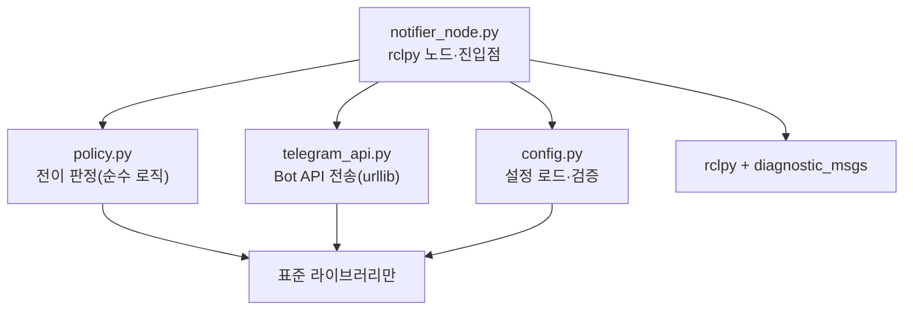
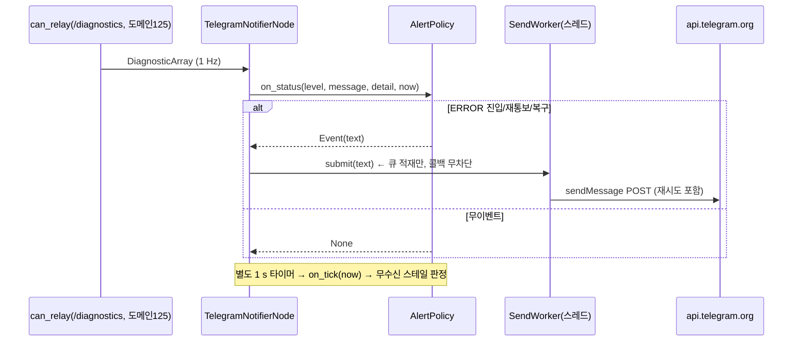

# 2026-08-23 (KST) — `telegram_notifier` 구조 (함수표·전역변수표)

> coding SOP §2(사전조사)/§6(후속갱신)의 대칭 폐루프 산출물. **패키지 병기본** — 루트 집계는
> `docs/sw_structure/function_table.md`. 설계 결정과 근거는
> `docs/adr/2026-08-23-telegram-can-alert-notifier.md` 소관.

## 코드 버전

- 신규 패키지. 계획 단계 표를 구현 후 실측 줄번호로 정정(2026-08-23)
- 대상: `src/Safety/telegram_notifier/telegram_notifier/` 4개 모듈 + `__init__.py`
- 테스트: `test/` 3개 파일, **25 PASS** (2026-08-23 실행)

## 모듈 의존 그래프

`policy`·`telegram_api`·`config` 는 rclpy 를 import 하지 않는다 — ROS 없이 단위 테스트한다.

## 1. 함수 리스트 표 (`telegram_api.py` — Bot API 전송)

| # | 함수 | 입력 | 출력 | 기능 | 위치(file:line) |
| --- | --- | --- | --- | --- | --- |
| 1 | `TelegramSendError` (예외) | — | — | 전송 실패. 메시지에서 토큰은 이미 가려져 있다 | telegram_api.py:17 |
| 2 | `redact_token` | `text: str`, `token: str` | `str` | 문자열 속 토큰을 `<token>` 으로 치환(로그·예외 누설 방지) | telegram_api.py:21 |
| 3 | `send_message` | `token`, `chat_id`, `text`, `timeout_s` | `None` | sendMessage POST. 실패 시 `TelegramSendError`(토큰 가림) | telegram_api.py:46 |
| 4 | `get_updates` | `token`, `timeout_s` | `list[dict]` | getUpdates — chat_id 탐색용(설정 도우미) | telegram_api.py:53 |

## 2. 함수 리스트 표 (`config.py` — 설정 로드·검증)

| # | 함수 | 입력 | 출력 | 기능 | 위치(file:line) |
| --- | --- | --- | --- | --- | --- |
| 6 | `NotifierConfig` (dataclass) | — | — | token·chat_id·정책 파라미터. 기본값 보유 | config.py:16 |
| 7 | `NotifierConfig.from_mapping` | `raw: Mapping` | `NotifierConfig` | 기본값 위 덮어쓰기. **미지의 키 KeyError**, `_` 접두는 주석 | config.py:31 |
| 8 | `load_config` | `path: str` | `NotifierConfig` | JSON 로드 + 필수값(token·chat_id) 검증 + 권한 경고(그룹/기타 읽기) | config.py:50 |

## 3. 함수 리스트 표 (`policy.py` — 전이 판정, 순수 로직)

| # | 함수 | 입력 | 출력 | 기능 | 위치(file:line) |
| --- | --- | --- | --- | --- | --- |
| 9 | `Event` (dataclass) | — | — | 통보 1건(text). policy 출력 단위 | policy.py:18 |
| 10 | `AlertPolicy` (class) | — | — | 전이 상태기. rclpy 무의존 — 시각은 인자로 받는다 | policy.py:24 |
| 10a | `AlertPolicy.__init__` | `notify_warn`, `warn_ignore`, `renotify_s`, `stale_after_s` | — | 정책 파라미터 보관 | policy.py:31 |
| 10b | `AlertPolicy.on_status` | `level: int`, `message: str`, `detail: str`, `now: float` | `Event \| None` | 진단 1건 반영. ERROR 진입/지속 재통보/복구, WARN 옵션 판정 | policy.py:43 |
| 10c | `AlertPolicy.on_tick` | `now: float` | `Event \| None` | 주기 점검: 무수신 스테일 진입/복구 판정 | policy.py:76 |

## 4. 함수 리스트 표 (`notifier_node.py` — rclpy 노드·진입점)

| # | 함수 | 입력 | 출력 | 기능 | 위치(file:line) |
| --- | --- | --- | --- | --- | --- |
| 11 | `SendWorker` (class) | — | — | 유한 큐 + 전송 스레드. 채널별 독립 재시도(한 채널 실패가 다른 채널을 안 막음) | notifier_node.py:66 |
| 11d | `_build_senders` | `cfg` | `list[(name, send)]` | channels 설정 → 채널별 전송함수 목록(다채널) | notifier_node.py:53 |
| 13c | `_kakao_auth` | `cfg` | `int` | 카카오 인가: URL 안내 → localhost code 수신 → 토큰 저장 | notifier_node.py:177 |
| 11p | `_default_config_path` | 없음 | `str` | 저장소 루트 config/ 의 telegram.json 경로(소스 트리 기준) | notifier_node.py:31 |
| 11q | `_level_int` | `raw` | `int` | DiagnosticStatus.level(byte→bytes) 을 정수로 | notifier_node.py:37 |
| 11r | `_format_detail` | `values` | `str` | KeyValue 중 bus·node 키만 추려 상세 줄로 | notifier_node.py:44 |
| 11a | `SendWorker.submit` | `text: str` | `bool` | 큐 적재(가득 차면 버리고 False — 로봇을 막지 않음) | notifier_node.py:89 |
| 11b | `SendWorker._run` | — | — | 스레드 본체: 재시도 → 실패 시 폐기·로그 | notifier_node.py:98 |
| 11c | `SendWorker.stop` | — | — | 종료 신호 + join | notifier_node.py:111 |
| 12 | `TelegramNotifierNode` (class) | — | — | `/diagnostics` 구독 + 스테일 타이머 → policy → worker | notifier_node.py:129 |
| 12a | `._on_diagnostics` | `msg: DiagnosticArray` | — | 감시 대상 status 추출 → `policy.on_status` | notifier_node.py:147 |
| 12b | `._on_timer` | — | — | `policy.on_tick`(스테일 판정) | notifier_node.py:158 |
| 13 | `main` | `argv` | `int` | 진입점: 설정 로드 → (--test-send 면 전송 후 종료) → spin | notifier_node.py:237 |
| 13a | `_spin` | `cfg` | `int` | rclpy 노드 생성·spin. rclpy import 는 여기서만(CLI 는 ROS 무의존) | notifier_node.py:120 |
| 13b | `_parse_args` | `argv` | `Namespace` | CLI 인자(--config·--test-send·--get-updates) | notifier_node.py:221 |
| 14 | `__init__.py` (모듈) | — | — | 빈 파일 — 패키지 표식. notifier_node re-export 금지(rclpy 무의존 유지) | __init__.py:1 |
| 15 | `setup.py` (파일) | — | — | ament_python 패키징. systemd 유닛 glob 동봉, 진입점 `telegram_notifier` | setup.py:1-28 |
| 16 | `test_policy.py` (파일) | — | — | AlertPolicy 전이 단위시험(ERROR 진입/지속/복구·WARN·스테일) | test_policy.py:1 |
| 17 | `test_config.py` (파일) | — | — | 설정 로드 단위시험(미지 키 거부·주석 키·필수값) | test_config.py:1 |
| 18 | `test_telegram_api.py` (파일) | — | — | 전송 단위시험(mock urlopen·토큰 가림·본문 절단) | test_telegram_api.py:1 |
| 19 | `test_kakao_api.py` (파일) | — | — | 카카오 전송 단위시험(mock urlopen·401 refresh·비밀 가림) | test_kakao_api.py:1 |

### 1b. 함수 리스트 표 (`kakao_api.py` — 카카오 "나에게 보내기", 2026-08-23 추가)

| # | 함수 | 입력 | 출력 | 기능 | 위치(file:line) |
| --- | --- | --- | --- | --- | --- |
| K1 | `KakaoSendError` (예외) | — | — | 전송/인가 실패. http_code 보유, 비밀 가림 | kakao_api.py:24 |
| K2 | `redact_secrets` | `text`, `secrets` | `str` | REST 키·토큰을 `<secret>` 으로 치환 | kakao_api.py:32 |
| K3 | `_post` | `url`, `data`, `headers`, `timeout_s`, `secrets` | `dict` | form POST + 오류 승격(HTTP 본문 포함) | kakao_api.py:40 |
| K4 | `build_auth_url` | `rest_key`, `redirect_uri` | `str` | talk_message 인가 URL | kakao_api.py:61 |
| K5 | `exchange_code` | `rest_key`, `code`, `redirect_uri`, `client_secret` | `dict` | code → 토큰 교환. 앱 시크릿 활성(발급 기본값) 시 client_secret 필수 | kakao_api.py:70 |
| K6 | `refresh_tokens` | `rest_key`, `refresh_token`, `client_secret` | `dict` | 토큰 갱신(시크릿 동봉) | kakao_api.py:87 |
| K7 | `send_to_me` | `access_token`, `text`, `timeout_s` | `None` | 텍스트 템플릿(200자 절단) 나에게 전송 | kakao_api.py:99 |
| K8 | `load_tokens`/`save_tokens` | `path`(/`tokens`) | `dict`/None | 토큰 파일 읽기/0600 저장 | kakao_api.py:112-127 |
| K9 | `KakaoSession` (class) | `rest_key`, `token_file`, `timeout_s`, `client_secret` | — | 전송 + 401 시 refresh 1회·즉시 저장. 워커 스레드 전용 | kakao_api.py:129 |
| K9a | `KakaoSession.send` | `text` | `None` | 만료 대응 포함 전송 | kakao_api.py:144 |

## 5. 전역 변수 / 모듈 상수 표

가변 전역 **0개**. 전부 불변 상수다. (상태는 `AlertPolicy`/`SendWorker` 인스턴스 안에만 있다.)

| # | 사용처(함수) | 기능 | 위치(file:line) |
| --- | --- | --- | --- |
| G1 | `send_message`·`get_updates` | (상수) `_API_BASE = "https://api.telegram.org"` | telegram_api.py:11 |
| G2a | `NotifierConfig` | (상수) `channels=("telegram",)` 기본·허용 {telegram, kakao} + `kakao_client_secret`(시크릿 활성 앱 필수) | config.py:19-33 |
| G2 | `NotifierConfig` | (상수) 기본 정책값: `renotify_s=1800`·`stale_after_s=15.0`·`warn_ignore=("제어권 미획득 (대기)",)` 등 | config.py:19-28 |
| G3 | `NotifierConfig.from_mapping` | (상수) `COMMENT_KEY_PREFIX = "_"` — system_health 관례 동일 | config.py:12 |
| G4 | `SendWorker` | (상수) `_QUEUE_MAX`·`_RETRY`·`_RETRY_BACKOFF_S` | notifier_node.py:23-25 |
| G5 | `TelegramNotifierNode` | (상수) `_WATCH_NAME_PREFIX = "can_relay:"` — 감시 status 선별 | notifier_node.py:22 |

## 6. 의존성 3-tier 표

| Tier | 대상 | 버전/제약 | 부재 시 동작 | 근거 |
| --- | --- | --- | --- | --- |
| 빌드 | `setuptools` | 제약 없음 | colcon 빌드 불가. **소스 직접 실행은 가능**(systemd 가 그 경로를 씀) | setup.py |
| 런타임 필수 | Python 3 표준 라이브러리 | 3.10+ | 기동 불가 | 전 모듈 |
| 런타임 필수 | `rclpy`·`diagnostic_msgs` | ROS2 humble | `notifier_node` 기동 불가 (`policy`·`api`·`config` 는 무관) | notifier_node.py:106-112 |
| 런타임 필수 | `config/telegram_notifier/telegram.json` | token·chat_id | SystemExit — 값 없이 도는 것처럼 보이는 상태 방지 | config.py:50-74 |
| 런타임 선택 | 인터넷(api.telegram.org, HTTPS) | — | 전송 재시도 후 폐기·로그. 노드는 계속 산다 | notifier_node.py:79-95 |
| 런타임 선택 | systemd | — | 수동 실행 가능. 유닛은 자동 설치되지 않음 | install_service.sh |

## 시퀀스 — 경보 1건

